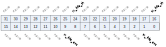

寄存器描述
====================

+----------------------+----------------------------------+
| 名称                 | 描述                             |
+----------------------+----------------------------------+
| `i2c_config`_        | I2C configuration register       |
+----------------------+----------------------------------+
| `i2c_int_sts`_       | I2C interrupt status             |
+----------------------+----------------------------------+
| `i2c_sub_addr`_      | I2C sub-address configuration    |
+----------------------+----------------------------------+
| `i2c_bus_busy`_      | I2C bus busy control register    |
+----------------------+----------------------------------+
| `i2c_prd_start`_     | I2C length of start phase        |
+----------------------+----------------------------------+
| `i2c_prd_stop`_      | I2C length of stop phase         |
+----------------------+----------------------------------+
| `i2c_prd_data`_      | I2C length of data phase         |
+----------------------+----------------------------------+
| `i2c_fifo_config_0`_ | I2C FIFO configuration register0 |
+----------------------+----------------------------------+
| `i2c_fifo_config_1`_ | I2C FIFO configuration register1 |
+----------------------+----------------------------------+
| `i2c_fifo_wdata`_    | I2C FIFO write data              |
+----------------------+----------------------------------+
| `i2c_fifo_rdata`_    | I2C FIFO read data               |
+----------------------+----------------------------------+

i2c_config
------------
 
**地址：**  0x4000a300
 

.. table::
    :widths: 10, 15,10,10,55
    :width: 100%
    :align: center
     
    +----------+------------------------------+--------+-------------+----------------------------------------------------------------------------------------------------------+
    | 位       | 名称                         |权限    | 复位值      | 描述                                                                                                     |
    +==========+==============================+========+=============+==========================================================================================================+
    | 31:28    | cr_i2c_deg_cnt               | r/w    | 4'd0        | De-glitch function cycle count                                                                           |
    +----------+------------------------------+--------+-------------+----------------------------------------------------------------------------------------------------------+
    | 27:24    | RSVD                         |        |             |                                                                                                          |
    +----------+------------------------------+--------+-------------+----------------------------------------------------------------------------------------------------------+
    | 23:16    | cr_i2c_pkt_len               | r/w    | 8'd0        | Packet length (unit: byte)                                                                               |
    +----------+------------------------------+--------+-------------+----------------------------------------------------------------------------------------------------------+
    | 15       | RSVD                         |        |             |                                                                                                          |
    +----------+------------------------------+--------+-------------+----------------------------------------------------------------------------------------------------------+
    | 14:8     | cr_i2c_slv_addr              | r/w    | 7'd0        | Slave address for I2C transaction (target address)                                                       |
    +----------+------------------------------+--------+-------------+----------------------------------------------------------------------------------------------------------+
    | 7        | RSVD                         |        |             |                                                                                                          |
    +----------+------------------------------+--------+-------------+----------------------------------------------------------------------------------------------------------+
    | 6:5      | cr_i2c_sub_addr_bc           | r/w    | 2'd0        | Sub-address field byte count                                                                             |
    +          +                              +        +             +                                                                                                          +
    |          |                              |        |             | 2'd0: 1-byte, 2'd1: 2-byte, 2'd2: 3-byte, 2'd3: 4-byte                                                   |
    +----------+------------------------------+--------+-------------+----------------------------------------------------------------------------------------------------------+
    | 4        | cr_i2c_sub_addr_en           | r/w    | 1'b0        | Enable signal of I2C sub-address field                                                                   |
    +----------+------------------------------+--------+-------------+----------------------------------------------------------------------------------------------------------+
    | 3        | cr_i2c_scl_sync_en           | r/w    | 1'b1        | Enable signal of I2C SCL synchronization, should be enabled to support Multi-Master and Clock-Stretching |
    +          +                              +        +             +                                                                                                          +
    |          |                              |        |             | (Normally should not be turned-off)                                                                      |
    +----------+------------------------------+--------+-------------+----------------------------------------------------------------------------------------------------------+
    | 2        | cr_i2c_deg_en                | r/w    | 1'b0        | Enable signal of I2C input de-glitch function (for all input pins)                                       |
    +----------+------------------------------+--------+-------------+----------------------------------------------------------------------------------------------------------+
    | 1        | cr_i2c_pkt_dir               | r/w    | 1'b1        | Transfer direction of the packet                                                                         |
    +          +                              +        +             +                                                                                                          +
    |          |                              |        |             | 1'b0: Write; 1'b1: Read                                                                                  |
    +----------+------------------------------+--------+-------------+----------------------------------------------------------------------------------------------------------+
    | 0        | cr_i2c_m_en                  | r/w    | 1'b0        | Enable signal of I2C Master function                                                                     |
    +          +                              +        +             +                                                                                                          +
    |          |                              |        |             | Asserting this bit will trigger the transaction, and should be de-asserted after finish                  |
    +----------+------------------------------+--------+-------------+----------------------------------------------------------------------------------------------------------+

i2c_int_sts
-------------
 
**地址：**  0x4000a304
 
.. figure:: ../../picture/i2c_i2c_int_sts.svg
   :align: center

.. table::
    :widths: 10, 15,10,10,55
    :width: 100%
    :align: center
     
    +----------+------------------------------+--------+-------------+-------------------------------------------------------------------------------------------------+
    | 位       | 名称                         |权限    | 复位值      | 描述                                                                                            |
    +==========+==============================+========+=============+=================================================================================================+
    | 31:30    | RSVD                         |        |             |                                                                                                 |
    +----------+------------------------------+--------+-------------+-------------------------------------------------------------------------------------------------+
    | 29       | cr_i2c_fer_en                | r/w    | 1'b1        | Interrupt enable of i2c_fer_int                                                                 |
    +----------+------------------------------+--------+-------------+-------------------------------------------------------------------------------------------------+
    | 28       | cr_i2c_arb_en                | r/w    | 1'b1        | Interrupt enable of i2c_arb_int                                                                 |
    +----------+------------------------------+--------+-------------+-------------------------------------------------------------------------------------------------+
    | 27       | cr_i2c_nak_en                | r/w    | 1'b1        | Interrupt enable of i2c_nak_int                                                                 |
    +----------+------------------------------+--------+-------------+-------------------------------------------------------------------------------------------------+
    | 26       | cr_i2c_rxf_en                | r/w    | 1'b1        | Interrupt enable of i2c_rxf_int                                                                 |
    +----------+------------------------------+--------+-------------+-------------------------------------------------------------------------------------------------+
    | 25       | cr_i2c_txf_en                | r/w    | 1'b1        | Interrupt enable of i2c_txf_int                                                                 |
    +----------+------------------------------+--------+-------------+-------------------------------------------------------------------------------------------------+
    | 24       | cr_i2c_end_en                | r/w    | 1'b1        | Interrupt enable of i2c_end_int                                                                 |
    +----------+------------------------------+--------+-------------+-------------------------------------------------------------------------------------------------+
    | 23:22    | RSVD                         |        |             |                                                                                                 |
    +----------+------------------------------+--------+-------------+-------------------------------------------------------------------------------------------------+
    | 21       | rsvd                         | rsvd   | 1'b0        |                                                                                                 |
    +----------+------------------------------+--------+-------------+-------------------------------------------------------------------------------------------------+
    | 20       | cr_i2c_arb_clr               | w1c    | 1'b0        | Interrupt clear of i2c_arb_int                                                                  |
    +----------+------------------------------+--------+-------------+-------------------------------------------------------------------------------------------------+
    | 19       | cr_i2c_nak_clr               | w1c    | 1'b0        | Interrupt clear of i2c_nak_int                                                                  |
    +----------+------------------------------+--------+-------------+-------------------------------------------------------------------------------------------------+
    | 18       | rsvd                         | rsvd   | 1'b0        |                                                                                                 |
    +----------+------------------------------+--------+-------------+-------------------------------------------------------------------------------------------------+
    | 17       | rsvd                         | rsvd   | 1'b0        |                                                                                                 |
    +----------+------------------------------+--------+-------------+-------------------------------------------------------------------------------------------------+
    | 16       | cr_i2c_end_clr               | w1c    | 1'b0        | Interrupt clear of i2c_end_int                                                                  |
    +----------+------------------------------+--------+-------------+-------------------------------------------------------------------------------------------------+
    | 15:14    | RSVD                         |        |             |                                                                                                 |
    +----------+------------------------------+--------+-------------+-------------------------------------------------------------------------------------------------+
    | 13       | cr_i2c_fer_mask              | r/w    | 1'b1        | Interrupt mask of i2c_fer_int                                                                   |
    +----------+------------------------------+--------+-------------+-------------------------------------------------------------------------------------------------+
    | 12       | cr_i2c_arb_mask              | r/w    | 1'b1        | Interrupt mask of i2c_arb_int                                                                   |
    +----------+------------------------------+--------+-------------+-------------------------------------------------------------------------------------------------+
    | 11       | cr_i2c_nak_mask              | r/w    | 1'b1        | Interrupt mask of i2c_nak_int                                                                   |
    +----------+------------------------------+--------+-------------+-------------------------------------------------------------------------------------------------+
    | 10       | cr_i2c_rxf_mask              | r/w    | 1'b1        | Interrupt mask of i2c_rxf_int                                                                   |
    +----------+------------------------------+--------+-------------+-------------------------------------------------------------------------------------------------+
    | 9        | cr_i2c_txf_mask              | r/w    | 1'b1        | Interrupt mask of i2c_txf_int                                                                   |
    +----------+------------------------------+--------+-------------+-------------------------------------------------------------------------------------------------+
    | 8        | cr_i2c_end_mask              | r/w    | 1'b1        | Interrupt mask of i2c_end_int                                                                   |
    +----------+------------------------------+--------+-------------+-------------------------------------------------------------------------------------------------+
    | 7:6      | RSVD                         |        |             |                                                                                                 |
    +----------+------------------------------+--------+-------------+-------------------------------------------------------------------------------------------------+
    | 5        | i2c_fer_int                  | r      | 1'b0        | I2C TX/RX FIFO error interrupt, auto-cleared when FIFO overflow/underflow error flag is cleared |
    +----------+------------------------------+--------+-------------+-------------------------------------------------------------------------------------------------+
    | 4        | i2c_arb_int                  | r      | 1'b0        | I2C arbitration lost interrupt                                                                  |
    +----------+------------------------------+--------+-------------+-------------------------------------------------------------------------------------------------+
    | 3        | i2c_nak_int                  | r      | 1'b0        | I2C NACK-received interrupt                                                                     |
    +----------+------------------------------+--------+-------------+-------------------------------------------------------------------------------------------------+
    | 2        | i2c_rxf_int                  | r      | 1'b0        | I2C RX FIFO ready (rx_fifo_cnt > rx_fifo_th) interrupt, auto-cleared when data is popped        |
    +----------+------------------------------+--------+-------------+-------------------------------------------------------------------------------------------------+
    | 1        | i2c_txf_int                  | r      | 1'b0        | I2C TX FIFO ready (tx_fifo_cnt > tx_fifo_th) interrupt, auto-cleared when data is pushed        |
    +----------+------------------------------+--------+-------------+-------------------------------------------------------------------------------------------------+
    | 0        | i2c_end_int                  | r      | 1'b0        | I2C transfer end interrupt                                                                      |
    +----------+------------------------------+--------+-------------+-------------------------------------------------------------------------------------------------+

i2c_sub_addr
--------------
 
**地址：**  0x4000a308
 
.. figure:: ../../picture/i2c_i2c_sub_addr.svg
   :align: center

.. table::
    :widths: 10, 15,10,10,55
    :width: 100%
    :align: center
     
    +----------+------------------------------+--------+-------------+---------------------------------------------------------------------+
    | 位       | 名称                         |权限    | 复位值      | 描述                                                                |
    +==========+==============================+========+=============+=====================================================================+
    | 31:24    | cr_i2c_sub_addr_b3           | r/w    | 8'd0        | I2C sub-address field - byte[3]                                     |
    +----------+------------------------------+--------+-------------+---------------------------------------------------------------------+
    | 23:16    | cr_i2c_sub_addr_b2           | r/w    | 8'd0        | I2C sub-address field - byte[2]                                     |
    +----------+------------------------------+--------+-------------+---------------------------------------------------------------------+
    | 15:8     | cr_i2c_sub_addr_b1           | r/w    | 8'd0        | I2C sub-address field - byte[1]                                     |
    +----------+------------------------------+--------+-------------+---------------------------------------------------------------------+
    | 7:0      | cr_i2c_sub_addr_b0           | r/w    | 8'd0        | I2C sub-address field - byte[0] (sub-address starts from this byte) |
    +----------+------------------------------+--------+-------------+---------------------------------------------------------------------+

i2c_bus_busy
--------------
 
**地址：**  0x4000a30c
 
.. figure:: ../../picture/i2c_i2c_bus_busy.svg
   :align: center

.. table::
    :widths: 10, 15,10,10,55
    :width: 100%
    :align: center
     
    +----------+------------------------------+--------+-------------+-------------------------------------------------------------------------------+
    | 位       | 名称                         |权限    | 复位值      | 描述                                                                          |
    +==========+==============================+========+=============+===============================================================================+
    | 31:2     | RSVD                         |        |             |                                                                               |
    +----------+------------------------------+--------+-------------+-------------------------------------------------------------------------------+
    | 1        | cr_i2c_bus_busy_clr          | w1c    | 1'b0        | Clear signal of bus_busy status, not for normal usage (in case I2C bus hangs) |
    +----------+------------------------------+--------+-------------+-------------------------------------------------------------------------------+
    | 0        | sts_i2c_bus_busy             | r      | 1'b0        | Indicator of I2C bus busy                                                     |
    +----------+------------------------------+--------+-------------+-------------------------------------------------------------------------------+

i2c_prd_start
---------------
 
**地址：**  0x4000a310
 
.. figure:: ../../picture/i2c_i2c_prd_start.svg
   :align: center

.. table::
    :widths: 10, 15,10,10,55
    :width: 100%
    :align: center
     
    +----------+------------------------------+--------+-------------+-----------------------------------+
    | 位       | 名称                         |权限    | 复位值      | 描述                              |
    +==========+==============================+========+=============+===================================+
    | 31:24    | cr_i2c_prd_s_ph_3            | r/w    | 8'd15       | Length of START condition phase 3 |
    +----------+------------------------------+--------+-------------+-----------------------------------+
    | 23:16    | cr_i2c_prd_s_ph_2            | r/w    | 8'd15       | Length of START condition phase 2 |
    +----------+------------------------------+--------+-------------+-----------------------------------+
    | 15:8     | cr_i2c_prd_s_ph_1            | r/w    | 8'd15       | Length of START condition phase 1 |
    +----------+------------------------------+--------+-------------+-----------------------------------+
    | 7:0      | cr_i2c_prd_s_ph_0            | r/w    | 8'd15       | Length of START condition phase 0 |
    +----------+------------------------------+--------+-------------+-----------------------------------+

i2c_prd_stop
--------------
 
**地址：**  0x4000a314
 
.. figure:: ../../picture/i2c_i2c_prd_stop.svg
   :align: center

.. table::
    :widths: 10, 15,10,10,55
    :width: 100%
    :align: center
     
    +----------+------------------------------+--------+-------------+----------------------------------+
    | 位       | 名称                         |权限    | 复位值      | 描述                             |
    +==========+==============================+========+=============+==================================+
    | 31:24    | cr_i2c_prd_p_ph_3            | r/w    | 8'd15       | Length of STOP condition phase 3 |
    +----------+------------------------------+--------+-------------+----------------------------------+
    | 23:16    | cr_i2c_prd_p_ph_2            | r/w    | 8'd15       | Length of STOP condition phase 2 |
    +----------+------------------------------+--------+-------------+----------------------------------+
    | 15:8     | cr_i2c_prd_p_ph_1            | r/w    | 8'd15       | Length of STOP condition phase 1 |
    +----------+------------------------------+--------+-------------+----------------------------------+
    | 7:0      | cr_i2c_prd_p_ph_0            | r/w    | 8'd15       | Length of STOP condition phase 0 |
    +----------+------------------------------+--------+-------------+----------------------------------+

i2c_prd_data
--------------
 
**地址：**  0x4000a318
 
.. figure:: ../../picture/i2c_i2c_prd_data.svg
   :align: center

.. table::
    :widths: 10, 15,10,10,55
    :width: 100%
    :align: center
     
    +----------+------------------------------+--------+-------------+-------------------------------------------------------------------------------------------------------------------+
    | 位       | 名称                         |权限    | 复位值      | 描述                                                                                                              |
    +==========+==============================+========+=============+===================================================================================================================+
    | 31:24    | cr_i2c_prd_d_ph_3            | r/w    | 8'd15       | Length of DATA phase 3                                                                                            |
    +----------+------------------------------+--------+-------------+-------------------------------------------------------------------------------------------------------------------+
    | 23:16    | cr_i2c_prd_d_ph_2            | r/w    | 8'd15       | Length of DATA phase 2                                                                                            |
    +----------+------------------------------+--------+-------------+-------------------------------------------------------------------------------------------------------------------+
    | 15:8     | cr_i2c_prd_d_ph_1            | r/w    | 8'd15       | Length of DATA phase 1                                                                                            |
    +          +                              +        +             +                                                                                                                   +
    |          |                              |        |             | Note: This value should not be set to 8'd0, adjust source clock rate instead if higher I2C clock rate is required |
    +----------+------------------------------+--------+-------------+-------------------------------------------------------------------------------------------------------------------+
    | 7:0      | cr_i2c_prd_d_ph_0            | r/w    | 8'd15       | Length of DATA phase 0                                                                                            |
    +----------+------------------------------+--------+-------------+-------------------------------------------------------------------------------------------------------------------+

i2c_fifo_config_0
-------------------
 
**地址：**  0x4000a380
 
.. figure:: ../../picture/i2c_i2c_fifo_config_0.svg
   :align: center

.. table::
    :widths: 10, 15,10,10,55
    :width: 100%
    :align: center
     
    +----------+------------------------------+--------+-------------+----------------------------------------------------------+
    | 位       | 名称                         |权限    | 复位值      | 描述                                                     |
    +==========+==============================+========+=============+==========================================================+
    | 31:8     | RSVD                         |        |             |                                                          |
    +----------+------------------------------+--------+-------------+----------------------------------------------------------+
    | 7        | rx_fifo_underflow            | r      | 1'b0        | Underflow flag of RX FIFO, can be cleared by rx_fifo_clr |
    +----------+------------------------------+--------+-------------+----------------------------------------------------------+
    | 6        | rx_fifo_overflow             | r      | 1'b0        | Overflow flag of RX FIFO, can be cleared by rx_fifo_clr  |
    +----------+------------------------------+--------+-------------+----------------------------------------------------------+
    | 5        | tx_fifo_underflow            | r      | 1'b0        | Underflow flag of TX FIFO, can be cleared by tx_fifo_clr |
    +----------+------------------------------+--------+-------------+----------------------------------------------------------+
    | 4        | tx_fifo_overflow             | r      | 1'b0        | Overflow flag of TX FIFO, can be cleared by tx_fifo_clr  |
    +----------+------------------------------+--------+-------------+----------------------------------------------------------+
    | 3        | rx_fifo_clr                  | w1c    | 1'b0        | Clear signal of RX FIFO                                  |
    +----------+------------------------------+--------+-------------+----------------------------------------------------------+
    | 2        | tx_fifo_clr                  | w1c    | 1'b0        | Clear signal of TX FIFO                                  |
    +----------+------------------------------+--------+-------------+----------------------------------------------------------+
    | 1        | i2c_dma_rx_en                | r/w    | 1'b0        | Enable signal of dma_rx_req/ack interface                |
    +----------+------------------------------+--------+-------------+----------------------------------------------------------+
    | 0        | i2c_dma_tx_en                | r/w    | 1'b0        | Enable signal of dma_tx_req/ack interface                |
    +----------+------------------------------+--------+-------------+----------------------------------------------------------+

i2c_fifo_config_1
-------------------
 
**地址：**  0x4000a384
 

.. table::
    :widths: 10, 15,10,10,55
    :width: 100%
    :align: center
     
    +----------+------------------------------+--------+-------------+-------------------------------------------------------------------------------------------+
    | 位       | 名称                         |权限    | 复位值      | 描述                                                                                      |
    +==========+==============================+========+=============+===========================================================================================+
    | 31:25    | RSVD                         |        |             |                                                                                           |
    +----------+------------------------------+--------+-------------+-------------------------------------------------------------------------------------------+
    | 24       | rx_fifo_th                   | r/w    | 1'd0        | RX FIFO threshold, dma_rx_req will not be asserted if tx_fifo_cnt is less than this value |
    +----------+------------------------------+--------+-------------+-------------------------------------------------------------------------------------------+
    | 23:17    | RSVD                         |        |             |                                                                                           |
    +----------+------------------------------+--------+-------------+-------------------------------------------------------------------------------------------+
    | 16       | tx_fifo_th                   | r/w    | 1'd0        | TX FIFO threshold, dma_tx_req will not be asserted if tx_fifo_cnt is less than this value |
    +----------+------------------------------+--------+-------------+-------------------------------------------------------------------------------------------+
    | 15:10    | RSVD                         |        |             |                                                                                           |
    +----------+------------------------------+--------+-------------+-------------------------------------------------------------------------------------------+
    | 9:8      | rx_fifo_cnt                  | r      | 2'd0        | RX FIFO available count                                                                   |
    +----------+------------------------------+--------+-------------+-------------------------------------------------------------------------------------------+
    | 7:2      | RSVD                         |        |             |                                                                                           |
    +----------+------------------------------+--------+-------------+-------------------------------------------------------------------------------------------+
    | 1:0      | tx_fifo_cnt                  | r      | 2'd2        | TX FIFO available count                                                                   |
    +----------+------------------------------+--------+-------------+-------------------------------------------------------------------------------------------+

i2c_fifo_wdata
----------------
 
**地址：**  0x4000a388
 
.. figure:: ../../picture/i2c_i2c_fifo_wdata.svg
   :align: center

.. table::
    :widths: 10, 15,10,10,55
    :width: 100%
    :align: center
     
    +----------+------------------------------+--------+-------------+-----+
    | 位       | 名称                         |权限    | 复位值      | 描述|
    +==========+==============================+========+=============+=====+
    | 31:0     | i2c_fifo_wdata               | w      | x           |     |
    +----------+------------------------------+--------+-------------+-----+

i2c_fifo_rdata
----------------
 
**地址：**  0x4000a38c
 
.. figure:: ../../picture/i2c_i2c_fifo_rdata.svg
   :align: center

.. table::
    :widths: 10, 15,10,10,55
    :width: 100%
    :align: center
     
    +----------+------------------------------+--------+-------------+-----+
    | 位       | 名称                         |权限    | 复位值      | 描述|
    +==========+==============================+========+=============+=====+
    | 31:0     | i2c_fifo_rdata               | r      | 32'h0       |     |
    +----------+------------------------------+--------+-------------+-----+

