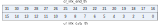

寄存器描述
====================

+---------------------------+---------------------------------------+
| 名称                      | 描述                                  |
+---------------------------+---------------------------------------+
| `irtx_config`_            | IR TX configuration register          |
+---------------------------+---------------------------------------+
| `irtx_int_sts`_           | IR TX interrupt status                |
+---------------------------+---------------------------------------+
| `irtx_data_word0`_        | IR TX data word0                      |
+---------------------------+---------------------------------------+
| `irtx_data_word1`_        | IR TX data word1                      |
+---------------------------+---------------------------------------+
| `irtx_pulse_width`_       | IR TX pulse width                     |
+---------------------------+---------------------------------------+
| `irtx_pw`_                | IR TX pulse width of phase            |
+---------------------------+---------------------------------------+
| `irtx_swm_pw_0`_          | IR TX Software Mode pulse width data0 |
+---------------------------+---------------------------------------+
| `irtx_swm_pw_1`_          | IR TX Software Mode pulse width data1 |
+---------------------------+---------------------------------------+
| `irtx_swm_pw_2`_          | IR TX Software Mode pulse width data2 |
+---------------------------+---------------------------------------+
| `irtx_swm_pw_3`_          | IR TX Software Mode pulse width data3 |
+---------------------------+---------------------------------------+
| `irtx_swm_pw_4`_          | IR TX Software Mode pulse width data4 |
+---------------------------+---------------------------------------+
| `irtx_swm_pw_5`_          | IR TX Software Mode pulse width data5 |
+---------------------------+---------------------------------------+
| `irtx_swm_pw_6`_          | IR TX Software Mode pulse width data6 |
+---------------------------+---------------------------------------+
| `irtx_swm_pw_7`_          | IR TX Software Mode pulse width data7 |
+---------------------------+---------------------------------------+
| `irrx_config`_            | IR RX configuration register          |
+---------------------------+---------------------------------------+
| `irrx_int_sts`_           | IR RX interrupt status                |
+---------------------------+---------------------------------------+
| `irrx_pw_config`_         | IR RX pulse width configuration       |
+---------------------------+---------------------------------------+
| `irrx_data_count`_        | IR RX data bit count                  |
+---------------------------+---------------------------------------+
| `irrx_data_word0`_        | IR RX data word0                      |
+---------------------------+---------------------------------------+
| `irrx_data_word1`_        | IR RX data word1                      |
+---------------------------+---------------------------------------+
| `irrx_swm_fifo_config_0`_ | IR RX FIFO configuration              |
+---------------------------+---------------------------------------+
| `irrx_swm_fifo_rdata`_    | IR RX software mode pulse width data  |
+---------------------------+---------------------------------------+

irtx_config
-------------
 
**地址：**  0x4000a600
 

.. table::
    :widths: 10, 15,10,10,55
    :width: 100%
    :align: center
     
    +----------+------------------------------+--------+-------------+-----------------------------------------------------------------------------------------+
    | 位       | 名称                         |权限    | 复位值      | 描述                                                                                    |
    +==========+==============================+========+=============+=========================================================================================+
    | 31:18    | RSVD                         |        |             |                                                                                         |
    +----------+------------------------------+--------+-------------+-----------------------------------------------------------------------------------------+
    | 17:12    | cr_irtx_data_num             | r/w    | 6'd31       | Bit count of Data phase (unit: bit / PW for normal / SWM)                               |
    +----------+------------------------------+--------+-------------+-----------------------------------------------------------------------------------------+
    | 11       | cr_irtx_tail_hl_inv          | r/w    | 1'b0        | Tail pulse H/L inverse signal (Don't care if SWM is enabled)                            |
    +          +                              +        +             +                                                                                         +
    |          |                              |        |             | 0: Phase 0 is High (Active), phase 1 is Low (Idle) (H -> L)                             |
    +          +                              +        +             +                                                                                         +
    |          |                              |        |             | 1: Phase 0 is Low (Idle), phase 1 is High (Active) (L -> H)                             |
    +----------+------------------------------+--------+-------------+-----------------------------------------------------------------------------------------+
    | 10       | cr_irtx_tail_en              | r/w    | 1'b1        | Enable signal of tail pulse (Don't care if SWM is enabled)                              |
    +----------+------------------------------+--------+-------------+-----------------------------------------------------------------------------------------+
    | 9        | cr_irtx_head_hl_inv          | r/w    | 1'b0        | Tail pulse H/L inverse signal (Don't care if SWM is enabled)                            |
    +          +                              +        +             +                                                                                         +
    |          |                              |        |             | 0: Phase 0 is High (Active), phase 1 is Low (Idle) (H -> L)                             |
    +          +                              +        +             +                                                                                         +
    |          |                              |        |             | 1: Phase 0 is Low (Idle), phase 1 is High (Active) (L -> H)                             |
    +----------+------------------------------+--------+-------------+-----------------------------------------------------------------------------------------+
    | 8        | cr_irtx_head_en              | r/w    | 1'b1        | Enable signal of head pulse (Don't care if SWM is enabled)                              |
    +----------+------------------------------+--------+-------------+-----------------------------------------------------------------------------------------+
    | 7        | RSVD                         |        |             |                                                                                         |
    +----------+------------------------------+--------+-------------+-----------------------------------------------------------------------------------------+
    | 6        | cr_irtx_logic1_hl_inv        | r/w    | 1'b0        | Logic 1 H/L inverse signal (Don't care if SWM is enabled)                               |
    +          +                              +        +             +                                                                                         +
    |          |                              |        |             | 0: Phase 0 is High (Active), phase 1 is Low (Idle) (H -> L)                             |
    +          +                              +        +             +                                                                                         +
    |          |                              |        |             | 1: Phase 0 is Low (Idle), phase 1 is High (Active) (L -> H)                             |
    +----------+------------------------------+--------+-------------+-----------------------------------------------------------------------------------------+
    | 5        | cr_irtx_logic0_hl_inv        | r/w    | 1'b0        | Logic 0 H/L inverse signal (Don't care if SWM is enabled)                               |
    +          +                              +        +             +                                                                                         +
    |          |                              |        |             | 0: Phase 0 is High (Active), phase 1 is Low (Idle) (H -> L)                             |
    +          +                              +        +             +                                                                                         +
    |          |                              |        |             | 1: Phase 0 is Low (Idle), phase 1 is High (Active) (L -> H)                             |
    +----------+------------------------------+--------+-------------+-----------------------------------------------------------------------------------------+
    | 4        | cr_irtx_data_en              | r/w    | 1'b1        | Enable signal of data phase (Don't care if SWM is enabled)                              |
    +----------+------------------------------+--------+-------------+-----------------------------------------------------------------------------------------+
    | 3        | cr_irtx_swm_en               | r/w    | 1'b0        | Enable signal of IRTX Software Mode (SWM)                                               |
    +----------+------------------------------+--------+-------------+-----------------------------------------------------------------------------------------+
    | 2        | cr_irtx_mod_en               | r/w    | 1'b0        | Enable signal of output modulation                                                      |
    +----------+------------------------------+--------+-------------+-----------------------------------------------------------------------------------------+
    | 1        | cr_irtx_out_inv              | r/w    | 1'b0        | Output inverse signal                                                                   |
    +          +                              +        +             +                                                                                         +
    |          |                              |        |             | 1'b0: Output stays at Low during idle state                                             |
    +          +                              +        +             +                                                                                         +
    |          |                              |        |             | 1'b1: Output stays at High during idle state                                            |
    +----------+------------------------------+--------+-------------+-----------------------------------------------------------------------------------------+
    | 0        | cr_irtx_en                   | r/w    | 1'b0        | Enable signal of IRTX function                                                          |
    +          +                              +        +             +                                                                                         +
    |          |                              |        |             | Asserting this bit will trigger the transaction, and should be de-asserted after finish |
    +----------+------------------------------+--------+-------------+-----------------------------------------------------------------------------------------+

irtx_int_sts
--------------
 
**地址：**  0x4000a604
 
.. figure:: ../../picture/ir_irtx_int_sts.svg
   :align: center

.. table::
    :widths: 10, 15,10,10,55
    :width: 100%
    :align: center
     
    +----------+------------------------------+--------+-------------+----------------------------------+
    | 位       | 名称                         |权限    | 复位值      | 描述                             |
    +==========+==============================+========+=============+==================================+
    | 31:25    | RSVD                         |        |             |                                  |
    +----------+------------------------------+--------+-------------+----------------------------------+
    | 24       | cr_irtx_end_en               | r/w    | 1'b1        | Interrupt enable of irtx_end_int |
    +----------+------------------------------+--------+-------------+----------------------------------+
    | 23:17    | RSVD                         |        |             |                                  |
    +----------+------------------------------+--------+-------------+----------------------------------+
    | 16       | cr_irtx_end_clr              | w1c    | 1'b0        | Interrupt clear of irtx_end_int  |
    +----------+------------------------------+--------+-------------+----------------------------------+
    | 15:9     | RSVD                         |        |             |                                  |
    +----------+------------------------------+--------+-------------+----------------------------------+
    | 8        | cr_irtx_end_mask             | r/w    | 1'b1        | Interrupt mask of irtx_end_int   |
    +----------+------------------------------+--------+-------------+----------------------------------+
    | 7:1      | RSVD                         |        |             |                                  |
    +----------+------------------------------+--------+-------------+----------------------------------+
    | 0        | irtx_end_int                 | r      | 1'b0        | IRTX transfer end interrupt      |
    +----------+------------------------------+--------+-------------+----------------------------------+

irtx_data_word0
-----------------
 
**地址：**  0x4000a608
 

.. table::
    :widths: 10, 15,10,10,55
    :width: 100%
    :align: center
     
    +----------+------------------------------+--------+-------------+-----------------------------------------------+
    | 位       | 名称                         |权限    | 复位值      | 描述                                          |
    +==========+==============================+========+=============+===============================================+
    | 31:0     | cr_irtx_data_word0           | r/w    | 32'h0       | TX data word 0 (Don't care if SWM is enabled) |
    +----------+------------------------------+--------+-------------+-----------------------------------------------+

irtx_data_word1
-----------------
 
**地址：**  0x4000a60c
 
.. figure:: ../../picture/ir_irtx_data_word1.svg
   :align: center

.. table::
    :widths: 10, 15,10,10,55
    :width: 100%
    :align: center
     
    +----------+------------------------------+--------+-------------+-----------------------------------------------+
    | 位       | 名称                         |权限    | 复位值      | 描述                                          |
    +==========+==============================+========+=============+===============================================+
    | 31:0     | cr_irtx_data_word1           | r/w    | 32'h0       | TX data word 1 (Don't care if SWM is enabled) |
    +----------+------------------------------+--------+-------------+-----------------------------------------------+

irtx_pulse_width
------------------
 
**地址：**  0x4000a610
 
.. figure:: ../../picture/ir_irtx_pulse_width.svg
   :align: center

.. table::
    :widths: 10, 15,10,10,55
    :width: 100%
    :align: center
     
    +----------+------------------------------+--------+-------------+--------------------------+
    | 位       | 名称                         |权限    | 复位值      | 描述                     |
    +==========+==============================+========+=============+==========================+
    | 31:24    | cr_irtx_mod_ph1_w            | r/w    | 8'd34       | Modulation phase 1 width |
    +----------+------------------------------+--------+-------------+--------------------------+
    | 23:16    | cr_irtx_mod_ph0_w            | r/w    | 8'd17       | Modulation phase 0 width |
    +----------+------------------------------+--------+-------------+--------------------------+
    | 15:12    | RSVD                         |        |             |                          |
    +----------+------------------------------+--------+-------------+--------------------------+
    | 11:0     | cr_irtx_pw_unit              | r/w    | 12'd1124    | Pulse width unit         |
    +----------+------------------------------+--------+-------------+--------------------------+

irtx_pw
---------
 
**地址：**  0x4000a614
 
.. figure:: ../../picture/ir_irtx_pw.svg
   :align: center

.. table::
    :widths: 10, 15,10,10,55
    :width: 100%
    :align: center
     
    +----------+------------------------------+--------+-------------+------------------------------------------------------------------+
    | 位       | 名称                         |权限    | 复位值      | 描述                                                             |
    +==========+==============================+========+=============+==================================================================+
    | 31:28    | cr_irtx_tail_ph1_w           | r/w    | 4'd0        | Pulse width of tail pulse phase 1 (Don't care if SWM is enabled) |
    +----------+------------------------------+--------+-------------+------------------------------------------------------------------+
    | 27:24    | cr_irtx_tail_ph0_w           | r/w    | 4'd0        | Pulse width of tail pulse phase 0 (Don't care if SWM is enabled) |
    +----------+------------------------------+--------+-------------+------------------------------------------------------------------+
    | 23:20    | cr_irtx_head_ph1_w           | r/w    | 4'd7        | Pulse width of head pulse phase 1 (Don't care if SWM is enabled) |
    +----------+------------------------------+--------+-------------+------------------------------------------------------------------+
    | 19:16    | cr_irtx_head_ph0_w           | r/w    | 4'd15       | Pulse width of head pulse phase 0 (Don't care if SWM is enabled) |
    +----------+------------------------------+--------+-------------+------------------------------------------------------------------+
    | 15:12    | cr_irtx_logic1_ph1_w         | r/w    | 4'd2        | Pulse width of logic1 phase 1 (Don't care if SWM is enabled)     |
    +----------+------------------------------+--------+-------------+------------------------------------------------------------------+
    | 11:8     | cr_irtx_logic1_ph0_w         | r/w    | 4'd0        | Pulse width of logic1 phase 0 (Don't care if SWM is enabled)     |
    +----------+------------------------------+--------+-------------+------------------------------------------------------------------+
    | 7:4      | cr_irtx_logic0_ph1_w         | r/w    | 4'd0        | Pulse width of logic0 phase 1 (Don't care if SWM is enabled)     |
    +----------+------------------------------+--------+-------------+------------------------------------------------------------------+
    | 3:0      | cr_irtx_logic0_ph0_w         | r/w    | 4'd0        | Pulse width of logic0 phase 0 (Don't care if SWM is enabled)     |
    +----------+------------------------------+--------+-------------+------------------------------------------------------------------+

irtx_swm_pw_0
---------------
 
**地址：**  0x4000a640
 
.. figure:: ../../picture/ir_irtx_swm_pw_0.svg
   :align: center

.. table::
    :widths: 10, 15,10,10,55
    :width: 100%
    :align: center
     
    +----------+------------------------------+--------+-------------+--------------------------------------------------------------------------------+
    | 位       | 名称                         |权限    | 复位值      | 描述                                                                           |
    +==========+==============================+========+=============+================================================================================+
    | 31:0     | cr_irtx_swm_pw_0             | r/w    | 32'h0       | IRTX Software Mode pulse width data #0~#7, each pulse is represented by 4-bit  |
    +          +                              +        +             +                                                                                +
    |          |                              |        |             | ([3:0] is the 1st pulse, [7:4] is the 2nd pulse, [11:8] is the 3rd pulse, etc) |
    +----------+------------------------------+--------+-------------+--------------------------------------------------------------------------------+

irtx_swm_pw_1
---------------
 
**地址：**  0x4000a644
 

.. table::
    :widths: 10, 15,10,10,55
    :width: 100%
    :align: center
     
    +----------+------------------------------+--------+-------------+--------------------------------------------------------------------------------+
    | 位       | 名称                         |权限    | 复位值      | 描述                                                                           |
    +==========+==============================+========+=============+================================================================================+
    | 31:0     | cr_irtx_swm_pw_1             | r/w    | 32'h0       | IRTX Software Mode pulse width data #8~#15, each pulse is represented by 4-bit |
    +          +                              +        +             +                                                                                +
    |          |                              |        |             | ([3:0] is the 1st pulse, [7:4] is the 2nd pulse, [11:8] is the 3rd pulse, etc) |
    +----------+------------------------------+--------+-------------+--------------------------------------------------------------------------------+

irtx_swm_pw_2
---------------
 
**地址：**  0x4000a648
 
.. figure:: ../../picture/ir_irtx_swm_pw_2.svg
   :align: center

.. table::
    :widths: 10, 15,10,10,55
    :width: 100%
    :align: center
     
    +----------+------------------------------+--------+-------------+---------------------------------------------------------------------------------+
    | 位       | 名称                         |权限    | 复位值      | 描述                                                                            |
    +==========+==============================+========+=============+=================================================================================+
    | 31:0     | cr_irtx_swm_pw_2             | r/w    | 32'h0       | IRTX Software Mode pulse width data #16~#23, each pulse is represented by 4-bit |
    +          +                              +        +             +                                                                                 +
    |          |                              |        |             | ([3:0] is the 1st pulse, [7:4] is the 2nd pulse, [11:8] is the 3rd pulse, etc)  |
    +----------+------------------------------+--------+-------------+---------------------------------------------------------------------------------+

irtx_swm_pw_3
---------------
 
**地址：**  0x4000a64c
 
.. figure:: ../../picture/ir_irtx_swm_pw_3.svg
   :align: center

.. table::
    :widths: 10, 15,10,10,55
    :width: 100%
    :align: center
     
    +----------+------------------------------+--------+-------------+---------------------------------------------------------------------------------+
    | 位       | 名称                         |权限    | 复位值      | 描述                                                                            |
    +==========+==============================+========+=============+=================================================================================+
    | 31:0     | cr_irtx_swm_pw_3             | r/w    | 32'h0       | IRTX Software Mode pulse width data #24~#31, each pulse is represented by 4-bit |
    +          +                              +        +             +                                                                                 +
    |          |                              |        |             | ([3:0] is the 1st pulse, [7:4] is the 2nd pulse, [11:8] is the 3rd pulse, etc)  |
    +----------+------------------------------+--------+-------------+---------------------------------------------------------------------------------+

irtx_swm_pw_4
---------------
 
**地址：**  0x4000a650
 
.. figure:: ../../picture/ir_irtx_swm_pw_4.svg
   :align: center

.. table::
    :widths: 10, 15,10,10,55
    :width: 100%
    :align: center
     
    +----------+------------------------------+--------+-------------+---------------------------------------------------------------------------------+
    | 位       | 名称                         |权限    | 复位值      | 描述                                                                            |
    +==========+==============================+========+=============+=================================================================================+
    | 31:0     | cr_irtx_swm_pw_4             | r/w    | 32'h0       | IRTX Software Mode pulse width data #32~#39, each pulse is represented by 4-bit |
    +          +                              +        +             +                                                                                 +
    |          |                              |        |             | ([3:0] is the 1st pulse, [7:4] is the 2nd pulse, [11:8] is the 3rd pulse, etc)  |
    +----------+------------------------------+--------+-------------+---------------------------------------------------------------------------------+

irtx_swm_pw_5
---------------
 
**地址：**  0x4000a654
 
.. figure:: ../../picture/ir_irtx_swm_pw_5.svg
   :align: center

.. table::
    :widths: 10, 15,10,10,55
    :width: 100%
    :align: center
     
    +----------+------------------------------+--------+-------------+---------------------------------------------------------------------------------+
    | 位       | 名称                         |权限    | 复位值      | 描述                                                                            |
    +==========+==============================+========+=============+=================================================================================+
    | 31:0     | cr_irtx_swm_pw_5             | r/w    | 32'h0       | IRTX Software Mode pulse width data #40~#47, each pulse is represented by 4-bit |
    +          +                              +        +             +                                                                                 +
    |          |                              |        |             | ([3:0] is the 1st pulse, [7:4] is the 2nd pulse, [11:8] is the 3rd pulse, etc)  |
    +----------+------------------------------+--------+-------------+---------------------------------------------------------------------------------+

irtx_swm_pw_6
---------------
 
**地址：**  0x4000a658
 

.. table::
    :widths: 10, 15,10,10,55
    :width: 100%
    :align: center
     
    +----------+------------------------------+--------+-------------+---------------------------------------------------------------------------------+
    | 位       | 名称                         |权限    | 复位值      | 描述                                                                            |
    +==========+==============================+========+=============+=================================================================================+
    | 31:0     | cr_irtx_swm_pw_6             | r/w    | 32'h0       | IRTX Software Mode pulse width data #48~#55, each pulse is represented by 4-bit |
    +          +                              +        +             +                                                                                 +
    |          |                              |        |             | ([3:0] is the 1st pulse, [7:4] is the 2nd pulse, [11:8] is the 3rd pulse, etc)  |
    +----------+------------------------------+--------+-------------+---------------------------------------------------------------------------------+

irtx_swm_pw_7
---------------
 
**地址：**  0x4000a65c
 
.. figure:: ../../picture/ir_irtx_swm_pw_7.svg
   :align: center

.. table::
    :widths: 10, 15,10,10,55
    :width: 100%
    :align: center
     
    +----------+------------------------------+--------+-------------+---------------------------------------------------------------------------------+
    | 位       | 名称                         |权限    | 复位值      | 描述                                                                            |
    +==========+==============================+========+=============+=================================================================================+
    | 31:0     | cr_irtx_swm_pw_7             | r/w    | 32'h0       | IRTX Software Mode pulse width data #56~#63, each pulse is represented by 4-bit |
    +          +                              +        +             +                                                                                 +
    |          |                              |        |             | ([3:0] is the 1st pulse, [7:4] is the 2nd pulse, [11:8] is the 3rd pulse, etc)  |
    +----------+------------------------------+--------+-------------+---------------------------------------------------------------------------------+

irrx_config
-------------
 
**地址：**  0x4000a680
 
.. figure:: ../../picture/ir_irrx_config.svg
   :align: center

.. table::
    :widths: 10, 15,10,10,55
    :width: 100%
    :align: center
     
    +----------+------------------------------+--------+-------------+-----------------------------------------------------------------------------------------+
    | 位       | 名称                         |权限    | 复位值      | 描述                                                                                    |
    +==========+==============================+========+=============+=========================================================================================+
    | 31:12    | RSVD                         |        |             |                                                                                         |
    +----------+------------------------------+--------+-------------+-----------------------------------------------------------------------------------------+
    | 11:8     | cr_irrx_deg_cnt              | r/w    | 4'd0        | De-glitch function cycle count                                                          |
    +----------+------------------------------+--------+-------------+-----------------------------------------------------------------------------------------+
    | 7:5      | RSVD                         |        |             |                                                                                         |
    +----------+------------------------------+--------+-------------+-----------------------------------------------------------------------------------------+
    | 4        | cr_irrx_deg_en               | r/w    | 1'b0        | Enable signal of IRRX input de-glitch function                                          |
    +----------+------------------------------+--------+-------------+-----------------------------------------------------------------------------------------+
    | 3:2      | cr_irrx_mode                 | r/w    | 2'd0        | IRRX mode                                                                               |
    +          +                              +        +             +                                                                                         +
    |          |                              |        |             | 0: NEC                                                                                  |
    +          +                              +        +             +                                                                                         +
    |          |                              |        |             | 1: RC5                                                                                  |
    +          +                              +        +             +                                                                                         +
    |          |                              |        |             | 2: SW pulse-width detection mode (SWM)                                                  |
    +          +                              +        +             +                                                                                         +
    |          |                              |        |             | 3: Reserved                                                                             |
    +----------+------------------------------+--------+-------------+-----------------------------------------------------------------------------------------+
    | 1        | cr_irrx_in_inv               | r/w    | 1'b1        | Input inverse signal                                                                    |
    +----------+------------------------------+--------+-------------+-----------------------------------------------------------------------------------------+
    | 0        | cr_irrx_en                   | r/w    | 1'b0        | Enable signal of IRRX function                                                          |
    +          +                              +        +             +                                                                                         +
    |          |                              |        |             | Asserting this bit will trigger the transaction, and should be de-asserted after finish |
    +----------+------------------------------+--------+-------------+-----------------------------------------------------------------------------------------+

irrx_int_sts
--------------
 
**地址：**  0x4000a684
 
.. figure:: ../../picture/ir_irrx_int_sts.svg
   :align: center

.. table::
    :widths: 10, 15,10,10,55
    :width: 100%
    :align: center
     
    +----------+------------------------------+--------+-------------+----------------------------------+
    | 位       | 名称                         |权限    | 复位值      | 描述                             |
    +==========+==============================+========+=============+==================================+
    | 31:25    | RSVD                         |        |             |                                  |
    +----------+------------------------------+--------+-------------+----------------------------------+
    | 24       | cr_irrx_end_en               | r/w    | 1'b1        | Interrupt enable of irrx_end_int |
    +----------+------------------------------+--------+-------------+----------------------------------+
    | 23:17    | RSVD                         |        |             |                                  |
    +----------+------------------------------+--------+-------------+----------------------------------+
    | 16       | cr_irrx_end_clr              | w1c    | 1'b0        | Interrupt clear of irrx_end_int  |
    +----------+------------------------------+--------+-------------+----------------------------------+
    | 15:9     | RSVD                         |        |             |                                  |
    +----------+------------------------------+--------+-------------+----------------------------------+
    | 8        | cr_irrx_end_mask             | r/w    | 1'b1        | Interrupt mask of irrx_end_int   |
    +----------+------------------------------+--------+-------------+----------------------------------+
    | 7:1      | RSVD                         |        |             |                                  |
    +----------+------------------------------+--------+-------------+----------------------------------+
    | 0        | irrx_end_int                 | r      | 1'b0        | IRRX transfer end interrupt      |
    +----------+------------------------------+--------+-------------+----------------------------------+

irrx_pw_config
----------------
 
**地址：**  0x4000a688
 

.. table::
    :widths: 10, 15,10,10,55
    :width: 100%
    :align: center
     
    +----------+------------------------------+--------+-------------+-----------------------------------------------------------------------------+
    | 位       | 名称                         |权限    | 复位值      | 描述                                                                        |
    +==========+==============================+========+=============+=============================================================================+
    | 31:16    | cr_irrx_end_th               | r/w    | 16'd8999    | Pulse width threshold to trigger END condition                              |
    +----------+------------------------------+--------+-------------+-----------------------------------------------------------------------------+
    | 15:0     | cr_irrx_data_th              | r/w    | 16'd3399    | Pulse width threshold for Logic0/1 detection (Don't care if SWM is enabled) |
    +----------+------------------------------+--------+-------------+-----------------------------------------------------------------------------+

irrx_data_count
-----------------
 
**地址：**  0x4000a690
 
.. figure:: ../../picture/ir_irrx_data_count.svg
   :align: center

.. table::
    :widths: 10, 15,10,10,55
    :width: 100%
    :align: center
     
    +----------+------------------------------+--------+-------------+-----------------------------------------------+
    | 位       | 名称                         |权限    | 复位值      | 描述                                          |
    +==========+==============================+========+=============+===============================================+
    | 31:7     | RSVD                         |        |             |                                               |
    +----------+------------------------------+--------+-------------+-----------------------------------------------+
    | 6:0      | sts_irrx_data_cnt            | r      | 7'd0        | RX data bit count (pulse-width count for SWM) |
    +----------+------------------------------+--------+-------------+-----------------------------------------------+

irrx_data_word0
-----------------
 
**地址：**  0x4000a694
 
.. figure:: ../../picture/ir_irrx_data_word0.svg
   :align: center

.. table::
    :widths: 10, 15,10,10,55
    :width: 100%
    :align: center
     
    +----------+------------------------------+--------+-------------+----------------+
    | 位       | 名称                         |权限    | 复位值      | 描述           |
    +==========+==============================+========+=============+================+
    | 31:0     | sts_irrx_data_word0          | r      | 32'h0       | RX data word 0 |
    +----------+------------------------------+--------+-------------+----------------+

irrx_data_word1
-----------------
 
**地址：**  0x4000a698
 
.. figure:: ../../picture/ir_irrx_data_word1.svg
   :align: center

.. table::
    :widths: 10, 15,10,10,55
    :width: 100%
    :align: center
     
    +----------+------------------------------+--------+-------------+----------------+
    | 位       | 名称                         |权限    | 复位值      | 描述           |
    +==========+==============================+========+=============+================+
    | 31:0     | sts_irrx_data_word1          | r      | 32'h0       | RX data word 1 |
    +----------+------------------------------+--------+-------------+----------------+

irrx_swm_fifo_config_0
------------------------
 
**地址：**  0x4000a6c0
 

.. table::
    :widths: 10, 15,10,10,55
    :width: 100%
    :align: center
     
    +----------+------------------------------+--------+-------------+----------------------------------------------------------+
    | 位       | 名称                         |权限    | 复位值      | 描述                                                     |
    +==========+==============================+========+=============+==========================================================+
    | 31:11    | RSVD                         |        |             |                                                          |
    +----------+------------------------------+--------+-------------+----------------------------------------------------------+
    | 10:4     | rx_fifo_cnt                  | r      | 7'd0        | RX FIFO available count                                  |
    +----------+------------------------------+--------+-------------+----------------------------------------------------------+
    | 3        | rx_fifo_underflow            | r      | 1'b0        | Underflow flag of RX FIFO, can be cleared by rx_fifo_clr |
    +----------+------------------------------+--------+-------------+----------------------------------------------------------+
    | 2        | rx_fifo_overflow             | r      | 1'b0        | Overflow flag of RX FIFO, can be cleared by rx_fifo_clr  |
    +----------+------------------------------+--------+-------------+----------------------------------------------------------+
    | 1        | RSVD                         |        |             |                                                          |
    +----------+------------------------------+--------+-------------+----------------------------------------------------------+
    | 0        | rx_fifo_clr                  | w1c    | 1'b0        | Clear signal of RX FIFO                                  |
    +----------+------------------------------+--------+-------------+----------------------------------------------------------+

irrx_swm_fifo_rdata
---------------------
 
**地址：**  0x4000a6c4
 

.. table::
    :widths: 10, 15,10,10,55
    :width: 100%
    :align: center
     
    +----------+------------------------------+--------+-------------+-------------------------------------+
    | 位       | 名称                         |权限    | 复位值      | 描述                                |
    +==========+==============================+========+=============+=====================================+
    | 31:16    | RSVD                         |        |             |                                     |
    +----------+------------------------------+--------+-------------+-------------------------------------+
    | 15:0     | rx_fifo_rdata                | r      | 16'h0       | IRRX Software Mode pulse width data |
    +----------+------------------------------+--------+-------------+-------------------------------------+

