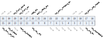

寄存器描述
====================

+----------------+-------------------------+
| 名称           | 描述                    |
+----------------+-------------------------+
| `l1c_config`_  | L1C configuration       |
+----------------+-------------------------+
| `hit_cnt_lsb`_ | Low 32-bit hit couter   |
+----------------+-------------------------+
| `hit_cnt_msb`_ | High 32-bit hit counter |
+----------------+-------------------------+
| `miss_cnt`_    | Miss counter            |
+----------------+-------------------------+

l1c_config
------------
 
**地址：**  0x40009000
 

.. table::
    :widths: 10, 15,10,10,55
    :width: 100%
    :align: center
     
    +----------+------------------------------+--------+-------------+-------------------------------------------------------------+
    | 位       | 名称                         |权限    | 复位值      | 描述                                                        |
    +==========+==============================+========+=============+=============================================================+
    | 31:30    | RSVD                         |        |             |                                                             |
    +----------+------------------------------+--------+-------------+-------------------------------------------------------------+
    | 29       | l1c_flush_done               | r      | 0           |                                                             |
    +----------+------------------------------+--------+-------------+-------------------------------------------------------------+
    | 28       | l1c_flush_en                 | r/w    | 0           | flush dirty line                                            |
    +----------+------------------------------+--------+-------------+-------------------------------------------------------------+
    | 27       | RSVD                         |        |             |                                                             |
    +----------+------------------------------+--------+-------------+-------------------------------------------------------------+
    | 26       | wrap_dis                     | r/w    | 1           |                                                             |
    +----------+------------------------------+--------+-------------+-------------------------------------------------------------+
    | 25       | early_resp_dis               | r/w    | 1           |                                                             |
    +----------+------------------------------+--------+-------------+-------------------------------------------------------------+
    | 24       | RSVD                         |        |             |                                                             |
    +----------+------------------------------+--------+-------------+-------------------------------------------------------------+
    | 23:20    | l1c_bmx_timeout_en           | r/w    | 0           | Bus timeout enable: detect slave no reaponse in 1024 cycles |
    +----------+------------------------------+--------+-------------+-------------------------------------------------------------+
    | 19:18    | RSVD                         |        |             |                                                             |
    +----------+------------------------------+--------+-------------+-------------------------------------------------------------+
    | 17:16    | l1c_bmx_arb_mode             | r/w    | 0           | [1:0] 0:fix, 2:round-robin, 3:random                        |
    +----------+------------------------------+--------+-------------+-------------------------------------------------------------+
    | 15       | l1c_bmx_err_en               | r/w    | 0           | Bus error response enable                                   |
    +----------+------------------------------+--------+-------------+-------------------------------------------------------------+
    | 14       | l1c_bypass                   | r/w    | 0           | bypass cache ; reset cache                                  |
    +----------+------------------------------+--------+-------------+-------------------------------------------------------------+
    | 13       | RSVD                         |        |             |                                                             |
    +----------+------------------------------+--------+-------------+-------------------------------------------------------------+
    | 12       | irom_2t_access               | r/w    | 0           | Set 1 for ROM 2T access if CPU freq >72MHz                  |
    +----------+------------------------------+--------+-------------+-------------------------------------------------------------+
    | 11:8     | l1c_way_dis                  | r/w    | 4'b1111     | Disable part of cache ways & used as ITCM                   |
    +----------+------------------------------+--------+-------------+-------------------------------------------------------------+
    | 7:2      | RSVD                         |        |             |                                                             |
    +----------+------------------------------+--------+-------------+-------------------------------------------------------------+
    | 1        | l1c_cnt_en                   | r/w    | 0           |                                                             |
    +----------+------------------------------+--------+-------------+-------------------------------------------------------------+
    | 0        | l1c_cacheable                | r/w    | 0           |                                                             |
    +----------+------------------------------+--------+-------------+-------------------------------------------------------------+

hit_cnt_lsb
-------------
 
**地址：**  0x40009004
 

.. table::
    :widths: 10, 15,10,10,55
    :width: 100%
    :align: center
     
    +----------+------------------------------+--------+-------------+-----+
    | 位       | 名称                         |权限    | 复位值      | 描述|
    +==========+==============================+========+=============+=====+
    | 31:0     | hit_cnt_lsb                  | r      | 0           |     |
    +----------+------------------------------+--------+-------------+-----+

hit_cnt_msb
-------------
 
**地址：**  0x40009008
 
.. figure:: ../../picture/l1c_hit_cnt_msb.svg
   :align: center

.. table::
    :widths: 10, 15,10,10,55
    :width: 100%
    :align: center
     
    +----------+------------------------------+--------+-------------+--------------------------------------------------+
    | 位       | 名称                         |权限    | 复位值      | 描述                                             |
    +==========+==============================+========+=============+==================================================+
    | 31:0     | hit_cnt_msb                  | r      | 0           | total hit count = hit_cnt_msb*2^32 + hit_cnt_lsb |
    +----------+------------------------------+--------+-------------+--------------------------------------------------+

miss_cnt
----------
 
**地址：**  0x4000900c
 

.. table::
    :widths: 10, 15,10,10,55
    :width: 100%
    :align: center
     
    +----------+------------------------------+--------+-------------+-----+
    | 位       | 名称                         |权限    | 复位值      | 描述|
    +==========+==============================+========+=============+=====+
    | 31:0     | miss_cnt                     | r      | 0           |     |
    +----------+------------------------------+--------+-------------+-----+

