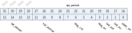
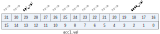
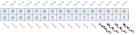
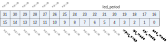

寄存器描述
====================

+------------------+------------------------+
| 名称             | 描述                   |
+------------------+------------------------+
| `qdec0_ctrl0`_   | QDEC0 control0         |
+------------------+------------------------+
| `qdec0_ctrl1`_   | QDEC0 control1         |
+------------------+------------------------+
| `qdec0_value`_   | QDEC0 value            |
+------------------+------------------------+
| `qdec0_int_en`_  | QDEC0 interrupt enable |
+------------------+------------------------+
| `qdec0_int_sts`_ | QDEC0 interrupt status |
+------------------+------------------------+
| `qdec0_int_clr`_ | QDEC0 interrupt clear  |
+------------------+------------------------+
| `qdec1_ctrl0`_   | QDEC1 control0         |
+------------------+------------------------+
| `qdec1_ctrl1`_   | QDEC1 control1         |
+------------------+------------------------+
| `qdec1_value`_   | QDEC1 value            |
+------------------+------------------------+
| `qdec1_int_en`_  | QDEC1 interrupt enable |
+------------------+------------------------+
| `qdec1_int_sts`_ | QDEC1 interrupt status |
+------------------+------------------------+
| `qdec1_int_clr`_ | QDEC1 interrupt clear  |
+------------------+------------------------+
| `qdec2_ctrl0`_   | QDEC2 control0         |
+------------------+------------------------+
| `qdec2_ctrl1`_   | QDEC2 control1         |
+------------------+------------------------+
| `qdec2_value`_   | QDEC2 value            |
+------------------+------------------------+
| `qdec2_int_en`_  | QDEC2 interrupt enable |
+------------------+------------------------+
| `qdec2_int_sts`_ | QDEC2 interrupt status |
+------------------+------------------------+
| `qdec2_int_clr`_ | QDEC2 interrupt clear  |
+------------------+------------------------+

qdec0_ctrl0
-------------
 
**地址：**  0x4000a800
 

.. table::
    :widths: 10, 15,10,10,55
    :width: 100%
    :align: center
     
    +----------+------------------------------+--------+-------------+------------------------------------------------------------------------------------------------------------------------------------------------------------------------+
    | 位       | 名称                         |权限    | 复位值      | 描述                                                                                                                                                                   |
    +==========+==============================+========+=============+========================================================================================================================================================================+
    | 31:28    | RSVD                         |        |             |                                                                                                                                                                        |
    +----------+------------------------------+--------+-------------+------------------------------------------------------------------------------------------------------------------------------------------------------------------------+
    | 27:12    | rpt_period                   | r/w    | 16'd10      | "RPT" report period in [samples/report]. Specifies the number of samples to be accumulated in the ACC1 register before the RPT_RDY and DBL_RDY events can be generated |
    +          +                              +        +             +                                                                                                                                                                        +
    |          |                              |        |             | "RPT_US" report period in [us/report] = SP * RP                                                                                                                        |
    +----------+------------------------------+--------+-------------+------------------------------------------------------------------------------------------------------------------------------------------------------------------------+
    | 11:8     | spl_period                   | r/w    | 4'h2        | "SPL" sample period in [us/sample]. The SAMPLE register will be updated for every new sample                                                                           |
    +          +                              +        +             +                                                                                                                                                                        +
    |          |                              |        |             | 0:  32 us                                                                                                                                                              |
    +          +                              +        +             +                                                                                                                                                                        +
    |          |                              |        |             | 1:  64                                                                                                                                                                 |
    +          +                              +        +             +                                                                                                                                                                        +
    |          |                              |        |             | 2: 128                                                                                                                                                                 |
    +          +                              +        +             +                                                                                                                                                                        +
    |          |                              |        |             | 3: 256                                                                                                                                                                 |
    +          +                              +        +             +                                                                                                                                                                        +
    |          |                              |        |             | 4: 512                                                                                                                                                                 |
    +          +                              +        +             +                                                                                                                                                                        +
    |          |                              |        |             | 5:   1 ms                                                                                                                                                              |
    +          +                              +        +             +                                                                                                                                                                        +
    |          |                              |        |             | 6:   2                                                                                                                                                                 |
    +          +                              +        +             +                                                                                                                                                                        +
    |          |                              |        |             | 7:   4                                                                                                                                                                 |
    +          +                              +        +             +                                                                                                                                                                        +
    |          |                              |        |             | 8:   8                                                                                                                                                                 |
    +          +                              +        +             +                                                                                                                                                                        +
    |          |                              |        |             | 9:  16                                                                                                                                                                 |
    +          +                              +        +             +                                                                                                                                                                        +
    |          |                              |        |             | A:  32                                                                                                                                                                 |
    +          +                              +        +             +                                                                                                                                                                        +
    |          |                              |        |             | B:  65                                                                                                                                                                 |
    +          +                              +        +             +                                                                                                                                                                        +
    |          |                              |        |             | C: 131                                                                                                                                                                 |
    +----------+------------------------------+--------+-------------+------------------------------------------------------------------------------------------------------------------------------------------------------------------------+
    | 7:4      | deg_cnt                      | r/w    | 0           |                                                                                                                                                                        |
    +----------+------------------------------+--------+-------------+------------------------------------------------------------------------------------------------------------------------------------------------------------------------+
    | 3        | deg_en                       | r/w    | 0           | deglitch                                                                                                                                                               |
    +----------+------------------------------+--------+-------------+------------------------------------------------------------------------------------------------------------------------------------------------------------------------+
    | 2        | led_pol                      | r/w    | 1           | led polarity                                                                                                                                                           |
    +----------+------------------------------+--------+-------------+------------------------------------------------------------------------------------------------------------------------------------------------------------------------+
    | 1        | led_en                       | r/w    | 0           |                                                                                                                                                                        |
    +----------+------------------------------+--------+-------------+------------------------------------------------------------------------------------------------------------------------------------------------------------------------+
    | 0        | qdec_en                      | r/w    | 0           |                                                                                                                                                                        |
    +----------+------------------------------+--------+-------------+------------------------------------------------------------------------------------------------------------------------------------------------------------------------+

qdec0_ctrl1
-------------
 
**地址：**  0x4000a804
 

.. table::
    :widths: 10, 15,10,10,55
    :width: 100%
    :align: center
     
    +----------+------------------------------+--------+-------------+--------------------------------------------------------------------+
    | 位       | 名称                         |权限    | 复位值      | 描述                                                               |
    +==========+==============================+========+=============+====================================================================+
    | 31:25    | RSVD                         |        |             |                                                                    |
    +----------+------------------------------+--------+-------------+--------------------------------------------------------------------+
    | 24:16    | led_period                   | r/w    | 0           | Period in us the LED is switched on prior to sampling              |
    +----------+------------------------------+--------+-------------+--------------------------------------------------------------------+
    | 15:4     | RSVD                         |        |             |                                                                    |
    +----------+------------------------------+--------+-------------+--------------------------------------------------------------------+
    | 3        | input_swap                   | r/w    | 0           | input a/b swap                                                     |
    +----------+------------------------------+--------+-------------+--------------------------------------------------------------------+
    | 2        | rpt_mode                     | r/w    | 0           | rpt option  0: Count time only if sample change  1: Continue time  |
    +----------+------------------------------+--------+-------------+--------------------------------------------------------------------+
    | 1        | spl_mode                     | r/w    | 0           | spl option  0: Stop sample if rpt_rdy  1: Continue sample          |
    +----------+------------------------------+--------+-------------+--------------------------------------------------------------------+
    | 0        | acc_mode                     | r/w    | 1           | acc option  0: Stop accumulate if overflow  1: Continue accumulate |
    +----------+------------------------------+--------+-------------+--------------------------------------------------------------------+

qdec0_value
-------------
 
**地址：**  0x4000a808
 

.. table::
    :widths: 10, 15,10,10,55
    :width: 100%
    :align: center
     
    +----------+------------------------------+--------+-------------+----------------------------------------+
    | 位       | 名称                         |权限    | 复位值      | 描述                                   |
    +==========+==============================+========+=============+========================================+
    | 31:30    | RSVD                         |        |             |                                        |
    +----------+------------------------------+--------+-------------+----------------------------------------+
    | 29:28    | spl_val                      | r      | 0           | Sample value. Direction of last change |
    +          +                              +        +             +                                        +
    |          |                              |        |             | 00: no change                          |
    +          +                              +        +             +                                        +
    |          |                              |        |             | 01: clockwise                          |
    +          +                              +        +             +                                        +
    |          |                              |        |             | 11: counter-clockwise                  |
    +          +                              +        +             +                                        +
    |          |                              |        |             | 10: Error                              |
    +----------+------------------------------+--------+-------------+----------------------------------------+
    | 27:20    | RSVD                         |        |             |                                        |
    +----------+------------------------------+--------+-------------+----------------------------------------+
    | 19:16    | acc2_val                     | r      | 0           | Double error accumulation (0~15)       |
    +----------+------------------------------+--------+-------------+----------------------------------------+
    | 15:0     | acc1_val                     | r      | 0           | Sample accumulation (-1024~1023)       |
    +----------+------------------------------+--------+-------------+----------------------------------------+

qdec0_int_en
--------------
 
**地址：**  0x4000a810
 

.. table::
    :widths: 10, 15,10,10,55
    :width: 100%
    :align: center
     
    +----------+------------------------------+--------+-------------+-----+
    | 位       | 名称                         |权限    | 复位值      | 描述|
    +==========+==============================+========+=============+=====+
    | 31:4     | RSVD                         |        |             |     |
    +----------+------------------------------+--------+-------------+-----+
    | 3        | overflow_en                  | r/w    | 0           |     |
    +----------+------------------------------+--------+-------------+-----+
    | 2        | dbl_rdy_en                   | r/w    | 0           |     |
    +----------+------------------------------+--------+-------------+-----+
    | 1        | spl_rdy_en                   | r/w    | 0           |     |
    +----------+------------------------------+--------+-------------+-----+
    | 0        | rpt_rdy_en                   | r/w    | 1           |     |
    +----------+------------------------------+--------+-------------+-----+

qdec0_int_sts
---------------
 
**地址：**  0x4000a814
 

.. table::
    :widths: 10, 15,10,10,55
    :width: 100%
    :align: center
     
    +----------+------------------------------+--------+-------------+---------------------------------------------------------------------------------+
    | 位       | 名称                         |权限    | 复位值      | 描述                                                                            |
    +==========+==============================+========+=============+=================================================================================+
    | 31:4     | RSVD                         |        |             |                                                                                 |
    +----------+------------------------------+--------+-------------+---------------------------------------------------------------------------------+
    | 3        | overflow_sts                 | r      | 0           | ACC1 or ACC2 overflow                                                           |
    +----------+------------------------------+--------+-------------+---------------------------------------------------------------------------------+
    | 2        | dbl_rdy_sts                  | r      | 0           | ACC2 double error                                                               |
    +----------+------------------------------+--------+-------------+---------------------------------------------------------------------------------+
    | 1        | spl_rdy_sts                  | r      | 0           | Event being generated for every new sample value written to the SAMPLE register |
    +----------+------------------------------+--------+-------------+---------------------------------------------------------------------------------+
    | 0        | rpt_rdy_sts                  | r      | 0           | Non-null report ready                                                           |
    +----------+------------------------------+--------+-------------+---------------------------------------------------------------------------------+

qdec0_int_clr
---------------
 
**地址：**  0x4000a818
 

.. table::
    :widths: 10, 15,10,10,55
    :width: 100%
    :align: center
     
    +----------+------------------------------+--------+-------------+-----+
    | 位       | 名称                         |权限    | 复位值      | 描述|
    +==========+==============================+========+=============+=====+
    | 31:4     | RSVD                         |        |             |     |
    +----------+------------------------------+--------+-------------+-----+
    | 3        | overflow_clr                 | w1c    | 0           |     |
    +----------+------------------------------+--------+-------------+-----+
    | 2        | dbl_rdy_clr                  | w1c    | 0           |     |
    +----------+------------------------------+--------+-------------+-----+
    | 1        | spl_rdy_clr                  | w1c    | 0           |     |
    +----------+------------------------------+--------+-------------+-----+
    | 0        | rpt_rdy_clr                  | w1c    | 0           |     |
    +----------+------------------------------+--------+-------------+-----+

qdec1_ctrl0
-------------
 
**地址：**  0x4000a840
 
.. figure:: ../../picture/qdec_qdec1_ctrl0.svg
   :align: center

.. table::
    :widths: 10, 15,10,10,55
    :width: 100%
    :align: center
     
    +----------+------------------------------+--------+-------------+------------------------------------------------------------------------------------------------------------------------------------------------------------------------+
    | 位       | 名称                         |权限    | 复位值      | 描述                                                                                                                                                                   |
    +==========+==============================+========+=============+========================================================================================================================================================================+
    | 31:28    | RSVD                         |        |             |                                                                                                                                                                        |
    +----------+------------------------------+--------+-------------+------------------------------------------------------------------------------------------------------------------------------------------------------------------------+
    | 27:12    | rpt_period                   | r/w    | 16'd10      | "RPT" report period in [samples/report]. Specifies the number of samples to be accumulated in the ACC1 register before the RPT_RDY and DBL_RDY events can be generated |
    +          +                              +        +             +                                                                                                                                                                        +
    |          |                              |        |             | "RPT_US" report period in [us/report] = SP * RP                                                                                                                        |
    +----------+------------------------------+--------+-------------+------------------------------------------------------------------------------------------------------------------------------------------------------------------------+
    | 11:8     | spl_period                   | r/w    | 4'h2        | "SPL" sample period in [us/sample]. The SAMPLE register will be updated for every new sample                                                                           |
    +          +                              +        +             +                                                                                                                                                                        +
    |          |                              |        |             | 0:  32 us                                                                                                                                                              |
    +          +                              +        +             +                                                                                                                                                                        +
    |          |                              |        |             | 1:  64                                                                                                                                                                 |
    +          +                              +        +             +                                                                                                                                                                        +
    |          |                              |        |             | 2: 128                                                                                                                                                                 |
    +          +                              +        +             +                                                                                                                                                                        +
    |          |                              |        |             | 3: 256                                                                                                                                                                 |
    +          +                              +        +             +                                                                                                                                                                        +
    |          |                              |        |             | 4: 512                                                                                                                                                                 |
    +          +                              +        +             +                                                                                                                                                                        +
    |          |                              |        |             | 5:   1 ms                                                                                                                                                              |
    +          +                              +        +             +                                                                                                                                                                        +
    |          |                              |        |             | 6:   2                                                                                                                                                                 |
    +          +                              +        +             +                                                                                                                                                                        +
    |          |                              |        |             | 7:   4                                                                                                                                                                 |
    +          +                              +        +             +                                                                                                                                                                        +
    |          |                              |        |             | 8:   8                                                                                                                                                                 |
    +          +                              +        +             +                                                                                                                                                                        +
    |          |                              |        |             | 9:  16                                                                                                                                                                 |
    +          +                              +        +             +                                                                                                                                                                        +
    |          |                              |        |             | A:  32                                                                                                                                                                 |
    +          +                              +        +             +                                                                                                                                                                        +
    |          |                              |        |             | B:  65                                                                                                                                                                 |
    +          +                              +        +             +                                                                                                                                                                        +
    |          |                              |        |             | C: 131                                                                                                                                                                 |
    +----------+------------------------------+--------+-------------+------------------------------------------------------------------------------------------------------------------------------------------------------------------------+
    | 7:4      | deg_cnt                      | r/w    | 0           |                                                                                                                                                                        |
    +----------+------------------------------+--------+-------------+------------------------------------------------------------------------------------------------------------------------------------------------------------------------+
    | 3        | deg_en                       | r/w    | 0           | deglitch                                                                                                                                                               |
    +----------+------------------------------+--------+-------------+------------------------------------------------------------------------------------------------------------------------------------------------------------------------+
    | 2        | led_pol                      | r/w    | 1           | led polarity                                                                                                                                                           |
    +----------+------------------------------+--------+-------------+------------------------------------------------------------------------------------------------------------------------------------------------------------------------+
    | 1        | led_en                       | r/w    | 0           |                                                                                                                                                                        |
    +----------+------------------------------+--------+-------------+------------------------------------------------------------------------------------------------------------------------------------------------------------------------+
    | 0        | qdec_en                      | r/w    | 0           |                                                                                                                                                                        |
    +----------+------------------------------+--------+-------------+------------------------------------------------------------------------------------------------------------------------------------------------------------------------+

qdec1_ctrl1
-------------
 
**地址：**  0x4000a844
 

.. table::
    :widths: 10, 15,10,10,55
    :width: 100%
    :align: center
     
    +----------+------------------------------+--------+-------------+--------------------------------------------------------------------+
    | 位       | 名称                         |权限    | 复位值      | 描述                                                               |
    +==========+==============================+========+=============+====================================================================+
    | 31:25    | RSVD                         |        |             |                                                                    |
    +----------+------------------------------+--------+-------------+--------------------------------------------------------------------+
    | 24:16    | led_period                   | r/w    | 0           | Period in us the LED is switched on prior to sampling              |
    +----------+------------------------------+--------+-------------+--------------------------------------------------------------------+
    | 15:4     | RSVD                         |        |             |                                                                    |
    +----------+------------------------------+--------+-------------+--------------------------------------------------------------------+
    | 3        | input_swap                   | r/w    | 0           | input a/b swap                                                     |
    +----------+------------------------------+--------+-------------+--------------------------------------------------------------------+
    | 2        | rpt_mode                     | r/w    | 0           | rpt option  0: Count time only if sample change  1: Continue time  |
    +----------+------------------------------+--------+-------------+--------------------------------------------------------------------+
    | 1        | spl_mode                     | r/w    | 0           | spl option  0: Stop sample if rpt_rdy  1: Continue sample          |
    +----------+------------------------------+--------+-------------+--------------------------------------------------------------------+
    | 0        | acc_mode                     | r/w    | 1           | acc option  0: Stop accumulate if overflow  1: Continue accumulate |
    +----------+------------------------------+--------+-------------+--------------------------------------------------------------------+

qdec1_value
-------------
 
**地址：**  0x4000a848
 

.. table::
    :widths: 10, 15,10,10,55
    :width: 100%
    :align: center
     
    +----------+------------------------------+--------+-------------+----------------------------------------+
    | 位       | 名称                         |权限    | 复位值      | 描述                                   |
    +==========+==============================+========+=============+========================================+
    | 31:30    | RSVD                         |        |             |                                        |
    +----------+------------------------------+--------+-------------+----------------------------------------+
    | 29:28    | spl_val                      | r      | 0           | Sample value. Direction of last change |
    +          +                              +        +             +                                        +
    |          |                              |        |             | 00: no change                          |
    +          +                              +        +             +                                        +
    |          |                              |        |             | 01: clockwise                          |
    +          +                              +        +             +                                        +
    |          |                              |        |             | 11: counter-clockwise                  |
    +          +                              +        +             +                                        +
    |          |                              |        |             | 10: Error                              |
    +----------+------------------------------+--------+-------------+----------------------------------------+
    | 27:20    | RSVD                         |        |             |                                        |
    +----------+------------------------------+--------+-------------+----------------------------------------+
    | 19:16    | acc2_val                     | r      | 0           | Double error accumulation (0~15)       |
    +----------+------------------------------+--------+-------------+----------------------------------------+
    | 15:0     | acc1_val                     | r      | 0           | Sample accumulation (-1024~1023)       |
    +----------+------------------------------+--------+-------------+----------------------------------------+

qdec1_int_en
--------------
 
**地址：**  0x4000a850
 

.. table::
    :widths: 10, 15,10,10,55
    :width: 100%
    :align: center
     
    +----------+------------------------------+--------+-------------+-----+
    | 位       | 名称                         |权限    | 复位值      | 描述|
    +==========+==============================+========+=============+=====+
    | 31:4     | RSVD                         |        |             |     |
    +----------+------------------------------+--------+-------------+-----+
    | 3        | overflow_en                  | r/w    | 0           |     |
    +----------+------------------------------+--------+-------------+-----+
    | 2        | dbl_rdy_en                   | r/w    | 0           |     |
    +----------+------------------------------+--------+-------------+-----+
    | 1        | spl_rdy_en                   | r/w    | 0           |     |
    +----------+------------------------------+--------+-------------+-----+
    | 0        | rpt_rdy_en                   | r/w    | 1           |     |
    +----------+------------------------------+--------+-------------+-----+

qdec1_int_sts
---------------
 
**地址：**  0x4000a854
 

.. table::
    :widths: 10, 15,10,10,55
    :width: 100%
    :align: center
     
    +----------+------------------------------+--------+-------------+---------------------------------------------------------------------------------+
    | 位       | 名称                         |权限    | 复位值      | 描述                                                                            |
    +==========+==============================+========+=============+=================================================================================+
    | 31:4     | RSVD                         |        |             |                                                                                 |
    +----------+------------------------------+--------+-------------+---------------------------------------------------------------------------------+
    | 3        | overflow_sts                 | r      | 0           | ACC1 or ACC2 overflow                                                           |
    +----------+------------------------------+--------+-------------+---------------------------------------------------------------------------------+
    | 2        | dbl_rdy_sts                  | r      | 0           | ACC2 double error                                                               |
    +----------+------------------------------+--------+-------------+---------------------------------------------------------------------------------+
    | 1        | spl_rdy_sts                  | r      | 0           | Event being generated for every new sample value written to the SAMPLE register |
    +----------+------------------------------+--------+-------------+---------------------------------------------------------------------------------+
    | 0        | rpt_rdy_sts                  | r      | 0           | Non-null report ready                                                           |
    +----------+------------------------------+--------+-------------+---------------------------------------------------------------------------------+

qdec1_int_clr
---------------
 
**地址：**  0x4000a858
 

.. table::
    :widths: 10, 15,10,10,55
    :width: 100%
    :align: center
     
    +----------+------------------------------+--------+-------------+-----+
    | 位       | 名称                         |权限    | 复位值      | 描述|
    +==========+==============================+========+=============+=====+
    | 31:4     | RSVD                         |        |             |     |
    +----------+------------------------------+--------+-------------+-----+
    | 3        | overflow_clr                 | w1c    | 0           |     |
    +----------+------------------------------+--------+-------------+-----+
    | 2        | dbl_rdy_clr                  | w1c    | 0           |     |
    +----------+------------------------------+--------+-------------+-----+
    | 1        | spl_rdy_clr                  | w1c    | 0           |     |
    +----------+------------------------------+--------+-------------+-----+
    | 0        | rpt_rdy_clr                  | w1c    | 0           |     |
    +----------+------------------------------+--------+-------------+-----+

qdec2_ctrl0
-------------
 
**地址：**  0x4000a880
 
.. figure:: ../../picture/qdec_qdec2_ctrl0.svg
   :align: center

.. table::
    :widths: 10, 15,10,10,55
    :width: 100%
    :align: center
     
    +----------+------------------------------+--------+-------------+------------------------------------------------------------------------------------------------------------------------------------------------------------------------+
    | 位       | 名称                         |权限    | 复位值      | 描述                                                                                                                                                                   |
    +==========+==============================+========+=============+========================================================================================================================================================================+
    | 31:28    | RSVD                         |        |             |                                                                                                                                                                        |
    +----------+------------------------------+--------+-------------+------------------------------------------------------------------------------------------------------------------------------------------------------------------------+
    | 27:12    | rpt_period                   | r/w    | 16'd10      | "RPT" report period in [samples/report]. Specifies the number of samples to be accumulated in the ACC1 register before the RPT_RDY and DBL_RDY events can be generated |
    +          +                              +        +             +                                                                                                                                                                        +
    |          |                              |        |             | "RPT_US" report period in [us/report] = SP * RP                                                                                                                        |
    +----------+------------------------------+--------+-------------+------------------------------------------------------------------------------------------------------------------------------------------------------------------------+
    | 11:8     | spl_period                   | r/w    | 4'h2        | "SPL" sample period in [us/sample]. The SAMPLE register will be updated for every new sample                                                                           |
    +          +                              +        +             +                                                                                                                                                                        +
    |          |                              |        |             | 0:  32 us                                                                                                                                                              |
    +          +                              +        +             +                                                                                                                                                                        +
    |          |                              |        |             | 1:  64                                                                                                                                                                 |
    +          +                              +        +             +                                                                                                                                                                        +
    |          |                              |        |             | 2: 128                                                                                                                                                                 |
    +          +                              +        +             +                                                                                                                                                                        +
    |          |                              |        |             | 3: 256                                                                                                                                                                 |
    +          +                              +        +             +                                                                                                                                                                        +
    |          |                              |        |             | 4: 512                                                                                                                                                                 |
    +          +                              +        +             +                                                                                                                                                                        +
    |          |                              |        |             | 5:   1 ms                                                                                                                                                              |
    +          +                              +        +             +                                                                                                                                                                        +
    |          |                              |        |             | 6:   2                                                                                                                                                                 |
    +          +                              +        +             +                                                                                                                                                                        +
    |          |                              |        |             | 7:   4                                                                                                                                                                 |
    +          +                              +        +             +                                                                                                                                                                        +
    |          |                              |        |             | 8:   8                                                                                                                                                                 |
    +          +                              +        +             +                                                                                                                                                                        +
    |          |                              |        |             | 9:  16                                                                                                                                                                 |
    +          +                              +        +             +                                                                                                                                                                        +
    |          |                              |        |             | A:  32                                                                                                                                                                 |
    +          +                              +        +             +                                                                                                                                                                        +
    |          |                              |        |             | B:  65                                                                                                                                                                 |
    +          +                              +        +             +                                                                                                                                                                        +
    |          |                              |        |             | C: 131                                                                                                                                                                 |
    +----------+------------------------------+--------+-------------+------------------------------------------------------------------------------------------------------------------------------------------------------------------------+
    | 7:4      | deg_cnt                      | r/w    | 0           |                                                                                                                                                                        |
    +----------+------------------------------+--------+-------------+------------------------------------------------------------------------------------------------------------------------------------------------------------------------+
    | 3        | deg_en                       | r/w    | 0           | deglitch                                                                                                                                                               |
    +----------+------------------------------+--------+-------------+------------------------------------------------------------------------------------------------------------------------------------------------------------------------+
    | 2        | led_pol                      | r/w    | 1           | led polarity                                                                                                                                                           |
    +----------+------------------------------+--------+-------------+------------------------------------------------------------------------------------------------------------------------------------------------------------------------+
    | 1        | led_en                       | r/w    | 0           |                                                                                                                                                                        |
    +----------+------------------------------+--------+-------------+------------------------------------------------------------------------------------------------------------------------------------------------------------------------+
    | 0        | qdec_en                      | r/w    | 0           |                                                                                                                                                                        |
    +----------+------------------------------+--------+-------------+------------------------------------------------------------------------------------------------------------------------------------------------------------------------+

qdec2_ctrl1
-------------
 
**地址：**  0x4000a884
 

.. table::
    :widths: 10, 15,10,10,55
    :width: 100%
    :align: center
     
    +----------+------------------------------+--------+-------------+--------------------------------------------------------------------+
    | 位       | 名称                         |权限    | 复位值      | 描述                                                               |
    +==========+==============================+========+=============+====================================================================+
    | 31:25    | RSVD                         |        |             |                                                                    |
    +----------+------------------------------+--------+-------------+--------------------------------------------------------------------+
    | 24:16    | led_period                   | r/w    | 0           | Period in us the LED is switched on prior to sampling              |
    +----------+------------------------------+--------+-------------+--------------------------------------------------------------------+
    | 15:4     | RSVD                         |        |             |                                                                    |
    +----------+------------------------------+--------+-------------+--------------------------------------------------------------------+
    | 3        | input_swap                   | r/w    | 0           | input a/b swap                                                     |
    +----------+------------------------------+--------+-------------+--------------------------------------------------------------------+
    | 2        | rpt_mode                     | r/w    | 0           | rpt option  0: Count time only if sample change  1: Continue time  |
    +----------+------------------------------+--------+-------------+--------------------------------------------------------------------+
    | 1        | spl_mode                     | r/w    | 0           | spl option  0: Stop sample if rpt_rdy  1: Continue sample          |
    +----------+------------------------------+--------+-------------+--------------------------------------------------------------------+
    | 0        | acc_mode                     | r/w    | 1           | acc option  0: Stop accumulate if overflow  1: Continue accumulate |
    +----------+------------------------------+--------+-------------+--------------------------------------------------------------------+

qdec2_value
-------------
 
**地址：**  0x4000a888
 

.. table::
    :widths: 10, 15,10,10,55
    :width: 100%
    :align: center
     
    +----------+------------------------------+--------+-------------+----------------------------------------+
    | 位       | 名称                         |权限    | 复位值      | 描述                                   |
    +==========+==============================+========+=============+========================================+
    | 31:30    | RSVD                         |        |             |                                        |
    +----------+------------------------------+--------+-------------+----------------------------------------+
    | 29:28    | spl_val                      | r      | 0           | Sample value. Direction of last change |
    +          +                              +        +             +                                        +
    |          |                              |        |             | 00: no change                          |
    +          +                              +        +             +                                        +
    |          |                              |        |             | 01: clockwise                          |
    +          +                              +        +             +                                        +
    |          |                              |        |             | 11: counter-clockwise                  |
    +          +                              +        +             +                                        +
    |          |                              |        |             | 10: Error                              |
    +----------+------------------------------+--------+-------------+----------------------------------------+
    | 27:20    | RSVD                         |        |             |                                        |
    +----------+------------------------------+--------+-------------+----------------------------------------+
    | 19:16    | acc2_val                     | r      | 0           | Double error accumulation (0~15)       |
    +----------+------------------------------+--------+-------------+----------------------------------------+
    | 15:0     | acc1_val                     | r      | 0           | Sample accumulation (-1024~1023)       |
    +----------+------------------------------+--------+-------------+----------------------------------------+

qdec2_int_en
--------------
 
**地址：**  0x4000a890
 

.. table::
    :widths: 10, 15,10,10,55
    :width: 100%
    :align: center
     
    +----------+------------------------------+--------+-------------+-----+
    | 位       | 名称                         |权限    | 复位值      | 描述|
    +==========+==============================+========+=============+=====+
    | 31:4     | RSVD                         |        |             |     |
    +----------+------------------------------+--------+-------------+-----+
    | 3        | overflow_en                  | r/w    | 0           |     |
    +----------+------------------------------+--------+-------------+-----+
    | 2        | dbl_rdy_en                   | r/w    | 0           |     |
    +----------+------------------------------+--------+-------------+-----+
    | 1        | spl_rdy_en                   | r/w    | 0           |     |
    +----------+------------------------------+--------+-------------+-----+
    | 0        | rpt_rdy_en                   | r/w    | 1           |     |
    +----------+------------------------------+--------+-------------+-----+

qdec2_int_sts
---------------
 
**地址：**  0x4000a894
 

.. table::
    :widths: 10, 15,10,10,55
    :width: 100%
    :align: center
     
    +----------+------------------------------+--------+-------------+---------------------------------------------------------------------------------+
    | 位       | 名称                         |权限    | 复位值      | 描述                                                                            |
    +==========+==============================+========+=============+=================================================================================+
    | 31:4     | RSVD                         |        |             |                                                                                 |
    +----------+------------------------------+--------+-------------+---------------------------------------------------------------------------------+
    | 3        | overflow_sts                 | r      | 0           | ACC1 or ACC2 overflow                                                           |
    +----------+------------------------------+--------+-------------+---------------------------------------------------------------------------------+
    | 2        | dbl_rdy_sts                  | r      | 0           | ACC2 double error                                                               |
    +----------+------------------------------+--------+-------------+---------------------------------------------------------------------------------+
    | 1        | spl_rdy_sts                  | r      | 0           | Event being generated for every new sample value written to the SAMPLE register |
    +----------+------------------------------+--------+-------------+---------------------------------------------------------------------------------+
    | 0        | rpt_rdy_sts                  | r      | 0           | Non-null report ready                                                           |
    +----------+------------------------------+--------+-------------+---------------------------------------------------------------------------------+

qdec2_int_clr
---------------
 
**地址：**  0x4000a898
 

.. table::
    :widths: 10, 15,10,10,55
    :width: 100%
    :align: center
     
    +----------+------------------------------+--------+-------------+-----+
    | 位       | 名称                         |权限    | 复位值      | 描述|
    +==========+==============================+========+=============+=====+
    | 31:4     | RSVD                         |        |             |     |
    +----------+------------------------------+--------+-------------+-----+
    | 3        | overflow_clr                 | w1c    | 0           |     |
    +----------+------------------------------+--------+-------------+-----+
    | 2        | dbl_rdy_clr                  | w1c    | 0           |     |
    +----------+------------------------------+--------+-------------+-----+
    | 1        | spl_rdy_clr                  | w1c    | 0           |     |
    +----------+------------------------------+--------+-------------+-----+
    | 0        | rpt_rdy_clr                  | w1c    | 0           |     |
    +----------+------------------------------+--------+-------------+-----+

