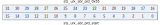

寄存器描述
====================

+-----------------------+--------------------------------------+
| 名称                  | 描述                                 |
+-----------------------+--------------------------------------+
| `utx_config`_         | UART TX configuration register       |
+-----------------------+--------------------------------------+
| `urx_config`_         | UART RX configuration register       |
+-----------------------+--------------------------------------+
| `uart_bit_prd`_       | UART period control register         |
+-----------------------+--------------------------------------+
| `data_config`_        | UART data configuration register     |
+-----------------------+--------------------------------------+
| `utx_ir_position`_    | UART TX ir position control register |
+-----------------------+--------------------------------------+
| `urx_ir_position`_    | UART RX ir position control register |
+-----------------------+--------------------------------------+
| `urx_rto_timer`_      | RTO interrupt control register       |
+-----------------------+--------------------------------------+
| `uart_sw_mode`_       | UART SW mode configuration register  |
+-----------------------+--------------------------------------+
| `uart_int_sts`_       | UART interrupt status                |
+-----------------------+--------------------------------------+
| `uart_int_mask`_      | UART interrupt mask                  |
+-----------------------+--------------------------------------+
| `uart_int_clear`_     | UART interrupt clear                 |
+-----------------------+--------------------------------------+
| `uart_int_en`_        | UART interrupt enable                |
+-----------------------+--------------------------------------+
| `uart_status`_        | UART status control register         |
+-----------------------+--------------------------------------+
| `sts_urx_abr_prd`_    | Auto baud detection control register |
+-----------------------+--------------------------------------+
| `uart_fifo_config_0`_ | UART FIFO configuration register0    |
+-----------------------+--------------------------------------+
| `uart_fifo_config_1`_ | UART FIFO configuration register1    |
+-----------------------+--------------------------------------+
| `uart_fifo_wdata`_    | UART FIFO write data                 |
+-----------------------+--------------------------------------+
| `uart_fifo_rdata`_    | UART FIFO read data                  |
+-----------------------+--------------------------------------+

utx_config
------------
 
**地址：**  0x4000a000
 
.. figure:: ../../picture/uart_utx_config.svg
   :align: center

.. table::
    :widths: 10, 15,10,10,55
    :width: 100%
    :align: center
     
    +----------+------------------------------+--------+-------------+-------------------------------------------------------------------------------------------------+
    | 位       | 名称                         |权限    | 复位值      | 描述                                                                                            |
    +==========+==============================+========+=============+=================================================================================================+
    | 31:16    | cr_utx_len                   | r/w    | 16'd0       | Length of UART TX data transfer (Unit: character/byte) (Don't-care if cr_utx_frm_en is enabled) |
    +----------+------------------------------+--------+-------------+-------------------------------------------------------------------------------------------------+
    | 15:13    | cr_utx_bit_cnt_b             | r/w    | 3'd4        | UART TX BREAK bit count (for LIN protocol)                                                      |
    +          +                              +        +             +                                                                                                 +
    |          |                              |        |             | Note: Additional 8 bit times will be added since LIN Break field requires at least 13 bit times |
    +----------+------------------------------+--------+-------------+-------------------------------------------------------------------------------------------------+
    | 12:11    | cr_utx_bit_cnt_p             | r/w    | 2'd1        | UART TX STOP bit count (unit: 0.5 bit)                                                          |
    +----------+------------------------------+--------+-------------+-------------------------------------------------------------------------------------------------+
    | 10:8     | cr_utx_bit_cnt_d             | r/w    | 3'd7        | UART TX DATA bit count for each character                                                       |
    +----------+------------------------------+--------+-------------+-------------------------------------------------------------------------------------------------+
    | 7        | cr_utx_ir_inv                | r/w    | 1'b0        | Inverse signal of UART TX output in IR mode                                                     |
    +----------+------------------------------+--------+-------------+-------------------------------------------------------------------------------------------------+
    | 6        | cr_utx_ir_en                 | r/w    | 1'b0        | Enable signal of UART TX IR mode                                                                |
    +----------+------------------------------+--------+-------------+-------------------------------------------------------------------------------------------------+
    | 5        | cr_utx_prt_sel               | r/w    | 1'b0        | Select signal of UART TX parity bit                                                             |
    +          +                              +        +             +                                                                                                 +
    |          |                              |        |             | 1: Odd parity                                                                                   |
    +          +                              +        +             +                                                                                                 +
    |          |                              |        |             | 0: Even parity                                                                                  |
    +----------+------------------------------+--------+-------------+-------------------------------------------------------------------------------------------------+
    | 4        | cr_utx_prt_en                | r/w    | 1'b0        | Enable signal of UART TX parity bit                                                             |
    +----------+------------------------------+--------+-------------+-------------------------------------------------------------------------------------------------+
    | 3        | cr_utx_lin_en                | r/w    | 1'b0        | Enable signal of UART TX LIN mode (LIN header will be sent before sending data)                 |
    +----------+------------------------------+--------+-------------+-------------------------------------------------------------------------------------------------+
    | 2        | cr_utx_frm_en                | r/w    | 1'b0        | Enable signal of UART TX freerun mode (utx_end_int will be disabled)                            |
    +----------+------------------------------+--------+-------------+-------------------------------------------------------------------------------------------------+
    | 1        | cr_utx_cts_en                | r/w    | 1'b0        | Enable signal of UART TX CTS flow control function                                              |
    +----------+------------------------------+--------+-------------+-------------------------------------------------------------------------------------------------+
    | 0        | cr_utx_en                    | r/w    | 1'b0        | Enable signal of UART TX function                                                               |
    +          +                              +        +             +                                                                                                 +
    |          |                              |        |             | Asserting this bit will trigger the transaction, and should be de-asserted after finish         |
    +----------+------------------------------+--------+-------------+-------------------------------------------------------------------------------------------------+

urx_config
------------
 
**地址：**  0x4000a004
 
.. figure:: ../../picture/uart_urx_config.svg
   :align: center

.. table::
    :widths: 10, 15,10,10,55
    :width: 100%
    :align: center
     
    +----------+------------------------------+--------+-------------+---------------------------------------------------------------------------------------------------+
    | 位       | 名称                         |权限    | 复位值      | 描述                                                                                              |
    +==========+==============================+========+=============+===================================================================================================+
    | 31:16    | cr_urx_len                   | r/w    | 16'd0       | Length of UART RX data transfer (Unit: character/byte)                                            |
    +          +                              +        +             +                                                                                                   +
    |          |                              |        |             | urx_end_int will assert when this length is reached                                               |
    +----------+------------------------------+--------+-------------+---------------------------------------------------------------------------------------------------+
    | 15:12    | cr_urx_deg_cnt               | r/w    | 4'd0        | De-glitch function cycle count                                                                    |
    +----------+------------------------------+--------+-------------+---------------------------------------------------------------------------------------------------+
    | 11       | cr_urx_deg_en                | r/w    | 1'b0        | Enable signal of RXD input de-glitch function                                                     |
    +----------+------------------------------+--------+-------------+---------------------------------------------------------------------------------------------------+
    | 10:8     | cr_urx_bit_cnt_d             | r/w    | 3'd7        | UART RX DATA bit count for each character                                                         |
    +----------+------------------------------+--------+-------------+---------------------------------------------------------------------------------------------------+
    | 7        | cr_urx_ir_inv                | r/w    | 1'b0        | Inverse signal of UART RX input in IR mode                                                        |
    +----------+------------------------------+--------+-------------+---------------------------------------------------------------------------------------------------+
    | 6        | cr_urx_ir_en                 | r/w    | 1'b0        | Enable signal of UART RX IR mode                                                                  |
    +----------+------------------------------+--------+-------------+---------------------------------------------------------------------------------------------------+
    | 5        | cr_urx_prt_sel               | r/w    | 1'b0        | Select signal of UART RX parity bit                                                               |
    +          +                              +        +             +                                                                                                   +
    |          |                              |        |             | 1: Odd parity                                                                                     |
    +          +                              +        +             +                                                                                                   +
    |          |                              |        |             | 0: Even parity                                                                                    |
    +----------+------------------------------+--------+-------------+---------------------------------------------------------------------------------------------------+
    | 4        | cr_urx_prt_en                | r/w    | 1'b0        | Enable signal of UART RX parity bit                                                               |
    +----------+------------------------------+--------+-------------+---------------------------------------------------------------------------------------------------+
    | 3        | cr_urx_lin_en                | r/w    | 1'b0        | Enable signal of UART RX LIN mode (LIN header will be required and checked before receiving data) |
    +----------+------------------------------+--------+-------------+---------------------------------------------------------------------------------------------------+
    | 2        | RSVD                         |        |             |                                                                                                   |
    +----------+------------------------------+--------+-------------+---------------------------------------------------------------------------------------------------+
    | 1        | cr_urx_abr_en                | r/w    | 1'b0        | Enable signal of UART RX Auto Baud Rate detection function                                        |
    +----------+------------------------------+--------+-------------+---------------------------------------------------------------------------------------------------+
    | 0        | cr_urx_en                    | r/w    | 1'b0        | Enable signal of UART RX function                                                                 |
    +----------+------------------------------+--------+-------------+---------------------------------------------------------------------------------------------------+

uart_bit_prd
--------------
 
**地址：**  0x4000a008
 
.. figure:: ../../picture/uart_uart_bit_prd.svg
   :align: center

.. table::
    :widths: 10, 15,10,10,55
    :width: 100%
    :align: center
     
    +----------+------------------------------+--------+-------------+--------------------------------------------------+
    | 位       | 名称                         |权限    | 复位值      | 描述                                             |
    +==========+==============================+========+=============+==================================================+
    | 31:16    | cr_urx_bit_prd               | r/w    | 16'd255     | Period of each UART RX bit, related to baud rate |
    +----------+------------------------------+--------+-------------+--------------------------------------------------+
    | 15:0     | cr_utx_bit_prd               | r/w    | 16'd255     | Period of each UART TX bit, related to baud rate |
    +----------+------------------------------+--------+-------------+--------------------------------------------------+

data_config
-------------
 
**地址：**  0x4000a00c
 
.. figure:: ../../picture/uart_data_config.svg
   :align: center

.. table::
    :widths: 10, 15,10,10,55
    :width: 100%
    :align: center
     
    +----------+------------------------------+--------+-------------+---------------------------------------+
    | 位       | 名称                         |权限    | 复位值      | 描述                                  |
    +==========+==============================+========+=============+=======================================+
    | 31:1     | RSVD                         |        |             |                                       |
    +----------+------------------------------+--------+-------------+---------------------------------------+
    | 0        | cr_uart_bit_inv              | r/w    | 1'b0        | Bit-inverse signal for each data byte |
    +          +                              +        +             +                                       +
    |          |                              |        |             | 0: Each byte is sent out LSB-first    |
    +          +                              +        +             +                                       +
    |          |                              |        |             | 1: Each byte is sent out MSB-first    |
    +----------+------------------------------+--------+-------------+---------------------------------------+

utx_ir_position
-----------------
 
**地址：**  0x4000a010
 
.. figure:: ../../picture/uart_utx_ir_position.svg
   :align: center

.. table::
    :widths: 10, 15,10,10,55
    :width: 100%
    :align: center
     
    +----------+------------------------------+--------+-------------+------------------------------------+
    | 位       | 名称                         |权限    | 复位值      | 描述                               |
    +==========+==============================+========+=============+====================================+
    | 31:16    | cr_utx_ir_pos_p              | r/w    | 16'd159     | STOP position of UART TX IR pulse  |
    +----------+------------------------------+--------+-------------+------------------------------------+
    | 15:0     | cr_utx_ir_pos_s              | r/w    | 16'd112     | START position of UART TX IR pulse |
    +----------+------------------------------+--------+-------------+------------------------------------+

urx_ir_position
-----------------
 
**地址：**  0x4000a014
 
.. figure:: ../../picture/uart_urx_ir_position.svg
   :align: center

.. table::
    :widths: 10, 15,10,10,55
    :width: 100%
    :align: center
     
    +----------+------------------------------+--------+-------------+-----------------------------------------------------------+
    | 位       | 名称                         |权限    | 复位值      | 描述                                                      |
    +==========+==============================+========+=============+===========================================================+
    | 31:16    | RSVD                         |        |             |                                                           |
    +----------+------------------------------+--------+-------------+-----------------------------------------------------------+
    | 15:0     | cr_urx_ir_pos_s              | r/w    | 16'd111     | START position of UART RXD pulse recovered from IR signal |
    +----------+------------------------------+--------+-------------+-----------------------------------------------------------+

urx_rto_timer
---------------
 
**地址：**  0x4000a018
 
.. figure:: ../../picture/uart_urx_rto_timer.svg
   :align: center

.. table::
    :widths: 10, 15,10,10,55
    :width: 100%
    :align: center
     
    +----------+------------------------------+--------+-------------+--------------------------------------------------------------+
    | 位       | 名称                         |权限    | 复位值      | 描述                                                         |
    +==========+==============================+========+=============+==============================================================+
    | 31:8     | RSVD                         |        |             |                                                              |
    +----------+------------------------------+--------+-------------+--------------------------------------------------------------+
    | 7:0      | cr_urx_rto_value             | r/w    | 8'd15       | Time-out value for triggering RTO interrupt (unit: bit time) |
    +----------+------------------------------+--------+-------------+--------------------------------------------------------------+

uart_sw_mode
--------------
 
**地址：**  0x4000a01c
 
.. figure:: ../../picture/uart_uart_sw_mode.svg
   :align: center

.. table::
    :widths: 10, 15,10,10,55
    :width: 100%
    :align: center
     
    +----------+------------------------------+--------+-------------+-------------------------------------+
    | 位       | 名称                         |权限    | 复位值      | 描述                                |
    +==========+==============================+========+=============+=====================================+
    | 31:4     | RSVD                         |        |             |                                     |
    +----------+------------------------------+--------+-------------+-------------------------------------+
    | 3        | cr_urx_rts_sw_val            | r/w    | 1'b0        | UART RX RTS output SW control value |
    +----------+------------------------------+--------+-------------+-------------------------------------+
    | 2        | cr_urx_rts_sw_mode           | r/w    | 1'b0        | UART RX RTS output SW control mode  |
    +----------+------------------------------+--------+-------------+-------------------------------------+
    | 1        | cr_utx_txd_sw_val            | r/w    | 1'b0        | UART TX TXD output SW control value |
    +----------+------------------------------+--------+-------------+-------------------------------------+
    | 0        | cr_utx_txd_sw_mode           | r/w    | 1'b0        | UART TX TXD output SW control mode  |
    +----------+------------------------------+--------+-------------+-------------------------------------+

uart_int_sts
--------------
 
**地址：**  0x4000a020
 
.. figure:: ../../picture/uart_uart_int_sts.svg
   :align: center

.. table::
    :widths: 10, 15,10,10,55
    :width: 100%
    :align: center
     
    +----------+------------------------------+--------+-------------+-----------------------------------------------------------------------------------------------+
    | 位       | 名称                         |权限    | 复位值      | 描述                                                                                          |
    +==========+==============================+========+=============+===============================================================================================+
    | 31:9     | RSVD                         |        |             |                                                                                               |
    +----------+------------------------------+--------+-------------+-----------------------------------------------------------------------------------------------+
    | 8        | urx_lse_int                  | r      | 1'b0        | UART RX LIN mode sync field error interrupt                                                   |
    +----------+------------------------------+--------+-------------+-----------------------------------------------------------------------------------------------+
    | 7        | urx_fer_int                  | r      | 1'b0        | UART RX FIFO error interrupt, auto-cleared when FIFO overflow/underflow error flag is cleared |
    +----------+------------------------------+--------+-------------+-----------------------------------------------------------------------------------------------+
    | 6        | utx_fer_int                  | r      | 1'b0        | UART TX FIFO error interrupt, auto-cleared when FIFO overflow/underflow error flag is cleared |
    +----------+------------------------------+--------+-------------+-----------------------------------------------------------------------------------------------+
    | 5        | urx_pce_int                  | r      | 1'b0        | UART RX parity check error interrupt                                                          |
    +----------+------------------------------+--------+-------------+-----------------------------------------------------------------------------------------------+
    | 4        | urx_rto_int                  | r      | 1'b0        | UART RX Time-out interrupt                                                                    |
    +----------+------------------------------+--------+-------------+-----------------------------------------------------------------------------------------------+
    | 3        | urx_fifo_int                 | r      | 1'b0        | UART RX FIFO ready (rx_fifo_cnt > rx_fifo_th) interrupt, auto-cleared when data is popped     |
    +----------+------------------------------+--------+-------------+-----------------------------------------------------------------------------------------------+
    | 2        | utx_fifo_int                 | r      | 1'b0        | UART TX FIFO ready (tx_fifo_cnt > tx_fifo_th) interrupt, auto-cleared when data is pushed     |
    +----------+------------------------------+--------+-------------+-----------------------------------------------------------------------------------------------+
    | 1        | urx_end_int                  | r      | 1'b0        | UART RX transfer end interrupt (set according to cr_urx_len)                                  |
    +----------+------------------------------+--------+-------------+-----------------------------------------------------------------------------------------------+
    | 0        | utx_end_int                  | r      | 1'b0        | UART TX transfer end interrupt (set according to cr_utx_len)                                  |
    +----------+------------------------------+--------+-------------+-----------------------------------------------------------------------------------------------+

uart_int_mask
---------------
 
**地址：**  0x4000a024
 
.. figure:: ../../picture/uart_uart_int_mask.svg
   :align: center

.. table::
    :widths: 10, 15,10,10,55
    :width: 100%
    :align: center
     
    +----------+------------------------------+--------+-------------+--------------------------------+
    | 位       | 名称                         |权限    | 复位值      | 描述                           |
    +==========+==============================+========+=============+================================+
    | 31:9     | RSVD                         |        |             |                                |
    +----------+------------------------------+--------+-------------+--------------------------------+
    | 8        | cr_urx_lse_mask              | r/w    | 1'b1        | Interrupt mask of urx_lse_int  |
    +----------+------------------------------+--------+-------------+--------------------------------+
    | 7        | cr_urx_fer_mask              | r/w    | 1'b1        | Interrupt mask of urx_fer_int  |
    +----------+------------------------------+--------+-------------+--------------------------------+
    | 6        | cr_utx_fer_mask              | r/w    | 1'b1        | Interrupt mask of utx_fer_int  |
    +----------+------------------------------+--------+-------------+--------------------------------+
    | 5        | cr_urx_pce_mask              | r/w    | 1'b1        | Interrupt mask of urx_pce_int  |
    +----------+------------------------------+--------+-------------+--------------------------------+
    | 4        | cr_urx_rto_mask              | r/w    | 1'b1        | Interrupt mask of urx_rto_int  |
    +----------+------------------------------+--------+-------------+--------------------------------+
    | 3        | cr_urx_fifo_mask             | r/w    | 1'b1        | Interrupt mask of urx_fifo_int |
    +----------+------------------------------+--------+-------------+--------------------------------+
    | 2        | cr_utx_fifo_mask             | r/w    | 1'b1        | Interrupt mask of utx_fifo_int |
    +----------+------------------------------+--------+-------------+--------------------------------+
    | 1        | cr_urx_end_mask              | r/w    | 1'b1        | Interrupt mask of urx_end_int  |
    +----------+------------------------------+--------+-------------+--------------------------------+
    | 0        | cr_utx_end_mask              | r/w    | 1'b1        | Interrupt mask of utx_end_int  |
    +----------+------------------------------+--------+-------------+--------------------------------+

uart_int_clear
----------------
 
**地址：**  0x4000a028
 
.. figure:: ../../picture/uart_uart_int_clear.svg
   :align: center

.. table::
    :widths: 10, 15,10,10,55
    :width: 100%
    :align: center
     
    +----------+------------------------------+--------+-------------+--------------------------------+
    | 位       | 名称                         |权限    | 复位值      | 描述                           |
    +==========+==============================+========+=============+================================+
    | 31:9     | RSVD                         |        |             |                                |
    +----------+------------------------------+--------+-------------+--------------------------------+
    | 8        | cr_urx_lse_clr               | w1c    | 1'b0        | Interrupt clear of urx_lse_int |
    +----------+------------------------------+--------+-------------+--------------------------------+
    | 7:6      | RSVD                         |        |             |                                |
    +----------+------------------------------+--------+-------------+--------------------------------+
    | 5        | cr_urx_pce_clr               | w1c    | 1'b0        | Interrupt clear of urx_pce_int |
    +----------+------------------------------+--------+-------------+--------------------------------+
    | 4        | cr_urx_rto_clr               | w1c    | 1'b0        | Interrupt clear of urx_rto_int |
    +----------+------------------------------+--------+-------------+--------------------------------+
    | 3:2      | RSVD                         |        |             |                                |
    +----------+------------------------------+--------+-------------+--------------------------------+
    | 1        | cr_urx_end_clr               | w1c    | 1'b0        | Interrupt clear of urx_end_int |
    +----------+------------------------------+--------+-------------+--------------------------------+
    | 0        | cr_utx_end_clr               | w1c    | 1'b0        | Interrupt clear of utx_end_int |
    +----------+------------------------------+--------+-------------+--------------------------------+

uart_int_en
-------------
 
**地址：**  0x4000a02c
 
.. figure:: ../../picture/uart_uart_int_en.svg
   :align: center

.. table::
    :widths: 10, 15,10,10,55
    :width: 100%
    :align: center
     
    +----------+------------------------------+--------+-------------+----------------------------------+
    | 位       | 名称                         |权限    | 复位值      | 描述                             |
    +==========+==============================+========+=============+==================================+
    | 31:9     | RSVD                         |        |             |                                  |
    +----------+------------------------------+--------+-------------+----------------------------------+
    | 8        | cr_urx_lse_en                | r/w    | 1'b1        | Interrupt enable of urx_lse_int  |
    +----------+------------------------------+--------+-------------+----------------------------------+
    | 7        | cr_urx_fer_en                | r/w    | 1'b1        | Interrupt enable of urx_fer_int  |
    +----------+------------------------------+--------+-------------+----------------------------------+
    | 6        | cr_utx_fer_en                | r/w    | 1'b1        | Interrupt enable of utx_fer_int  |
    +----------+------------------------------+--------+-------------+----------------------------------+
    | 5        | cr_urx_pce_en                | r/w    | 1'b1        | Interrupt enable of urx_pce_int  |
    +----------+------------------------------+--------+-------------+----------------------------------+
    | 4        | cr_urx_rto_en                | r/w    | 1'b1        | Interrupt enable of urx_rto_int  |
    +----------+------------------------------+--------+-------------+----------------------------------+
    | 3        | cr_urx_fifo_en               | r/w    | 1'b1        | Interrupt enable of urx_fifo_int |
    +----------+------------------------------+--------+-------------+----------------------------------+
    | 2        | cr_utx_fifo_en               | r/w    | 1'b1        | Interrupt enable of utx_fifo_int |
    +----------+------------------------------+--------+-------------+----------------------------------+
    | 1        | cr_urx_end_en                | r/w    | 1'b1        | Interrupt enable of urx_end_int  |
    +----------+------------------------------+--------+-------------+----------------------------------+
    | 0        | cr_utx_end_en                | r/w    | 1'b1        | Interrupt enable of utx_end_int  |
    +----------+------------------------------+--------+-------------+----------------------------------+

uart_status
-------------
 
**地址：**  0x4000a030
 
.. figure:: ../../picture/uart_uart_status.svg
   :align: center

.. table::
    :widths: 10, 15,10,10,55
    :width: 100%
    :align: center
     
    +----------+------------------------------+--------+-------------+-------------------------------+
    | 位       | 名称                         |权限    | 复位值      | 描述                          |
    +==========+==============================+========+=============+===============================+
    | 31:2     | RSVD                         |        |             |                               |
    +----------+------------------------------+--------+-------------+-------------------------------+
    | 1        | sts_urx_bus_busy             | r      | 1'b0        | Indicator of UART RX bus busy |
    +----------+------------------------------+--------+-------------+-------------------------------+
    | 0        | sts_utx_bus_busy             | r      | 1'b0        | Indicator of UART TX bus busy |
    +----------+------------------------------+--------+-------------+-------------------------------+

sts_urx_abr_prd
-----------------
 
**地址：**  0x4000a034
 

.. table::
    :widths: 10, 15,10,10,55
    :width: 100%
    :align: center
     
    +----------+------------------------------+--------+-------------+------------------------------------------------------------+
    | 位       | 名称                         |权限    | 复位值      | 描述                                                       |
    +==========+==============================+========+=============+============================================================+
    | 31:16    | sts_urx_abr_prd_0x55         | r      | 16'd0       | Bit period of Auto Baud Rate detection using codeword 0x55 |
    +----------+------------------------------+--------+-------------+------------------------------------------------------------+
    | 15:0     | sts_urx_abr_prd_start        | r      | 16'd0       | Bit period of Auto Baud Rate detection using START bit     |
    +----------+------------------------------+--------+-------------+------------------------------------------------------------+

uart_fifo_config_0
--------------------
 
**地址：**  0x4000a080
 
.. figure:: ../../picture/uart_uart_fifo_config_0.svg
   :align: center

.. table::
    :widths: 10, 15,10,10,55
    :width: 100%
    :align: center
     
    +----------+------------------------------+--------+-------------+----------------------------------------------------------+
    | 位       | 名称                         |权限    | 复位值      | 描述                                                     |
    +==========+==============================+========+=============+==========================================================+
    | 31:8     | RSVD                         |        |             |                                                          |
    +----------+------------------------------+--------+-------------+----------------------------------------------------------+
    | 7        | rx_fifo_underflow            | r      | 1'b0        | Underflow flag of RX FIFO, can be cleared by rx_fifo_clr |
    +----------+------------------------------+--------+-------------+----------------------------------------------------------+
    | 6        | rx_fifo_overflow             | r      | 1'b0        | Overflow flag of RX FIFO, can be cleared by rx_fifo_clr  |
    +----------+------------------------------+--------+-------------+----------------------------------------------------------+
    | 5        | tx_fifo_underflow            | r      | 1'b0        | Underflow flag of TX FIFO, can be cleared by tx_fifo_clr |
    +----------+------------------------------+--------+-------------+----------------------------------------------------------+
    | 4        | tx_fifo_overflow             | r      | 1'b0        | Overflow flag of TX FIFO, can be cleared by tx_fifo_clr  |
    +----------+------------------------------+--------+-------------+----------------------------------------------------------+
    | 3        | rx_fifo_clr                  | w1c    | 1'b0        | Clear signal of RX FIFO                                  |
    +----------+------------------------------+--------+-------------+----------------------------------------------------------+
    | 2        | tx_fifo_clr                  | w1c    | 1'b0        | Clear signal of TX FIFO                                  |
    +----------+------------------------------+--------+-------------+----------------------------------------------------------+
    | 1        | uart_dma_rx_en               | r/w    | 1'b0        | Enable signal of dma_rx_req/ack interface                |
    +----------+------------------------------+--------+-------------+----------------------------------------------------------+
    | 0        | uart_dma_tx_en               | r/w    | 1'b0        | Enable signal of dma_tx_req/ack interface                |
    +----------+------------------------------+--------+-------------+----------------------------------------------------------+

uart_fifo_config_1
--------------------
 
**地址：**  0x4000a084
 
.. figure:: ../../picture/uart_uart_fifo_config_1.svg
   :align: center

.. table::
    :widths: 10, 15,10,10,55
    :width: 100%
    :align: center
     
    +----------+------------------------------+--------+-------------+-------------------------------------------------------------------------------------------+
    | 位       | 名称                         |权限    | 复位值      | 描述                                                                                      |
    +==========+==============================+========+=============+===========================================================================================+
    | 31       | RSVD                         |        |             |                                                                                           |
    +----------+------------------------------+--------+-------------+-------------------------------------------------------------------------------------------+
    | 30:24    | rx_fifo_th                   | r/w    | 7'd0        | RX FIFO threshold, dma_rx_req will not be asserted if tx_fifo_cnt is less than this value |
    +----------+------------------------------+--------+-------------+-------------------------------------------------------------------------------------------+
    | 23       | RSVD                         |        |             |                                                                                           |
    +----------+------------------------------+--------+-------------+-------------------------------------------------------------------------------------------+
    | 22:16    | tx_fifo_th                   | r/w    | 7'd0        | TX FIFO threshold, dma_tx_req will not be asserted if tx_fifo_cnt is less than this value |
    +----------+------------------------------+--------+-------------+-------------------------------------------------------------------------------------------+
    | 15:8     | rx_fifo_cnt                  | r      | 8'd0        | RX FIFO available count                                                                   |
    +----------+------------------------------+--------+-------------+-------------------------------------------------------------------------------------------+
    | 7:0      | tx_fifo_cnt                  | r      | 8'd128      | TX FIFO available count                                                                   |
    +----------+------------------------------+--------+-------------+-------------------------------------------------------------------------------------------+

uart_fifo_wdata
-----------------
 
**地址：**  0x4000a088
 
.. figure:: ../../picture/uart_uart_fifo_wdata.svg
   :align: center

.. table::
    :widths: 10, 15,10,10,55
    :width: 100%
    :align: center
     
    +----------+------------------------------+--------+-------------+-----+
    | 位       | 名称                         |权限    | 复位值      | 描述|
    +==========+==============================+========+=============+=====+
    | 31:8     | RSVD                         |        |             |     |
    +----------+------------------------------+--------+-------------+-----+
    | 7:0      | uart_fifo_wdata              | w      | x           |     |
    +----------+------------------------------+--------+-------------+-----+

uart_fifo_rdata
-----------------
 
**地址：**  0x4000a08c
 
.. figure:: ../../picture/uart_uart_fifo_rdata.svg
   :align: center

.. table::
    :widths: 10, 15,10,10,55
    :width: 100%
    :align: center
     
    +----------+------------------------------+--------+-------------+-----+
    | 位       | 名称                         |权限    | 复位值      | 描述|
    +==========+==============================+========+=============+=====+
    | 31:8     | RSVD                         |        |             |     |
    +----------+------------------------------+--------+-------------+-----+
    | 7:0      | uart_fifo_rdata              | r      | 8'h0        |     |
    +----------+------------------------------+--------+-------------+-----+

