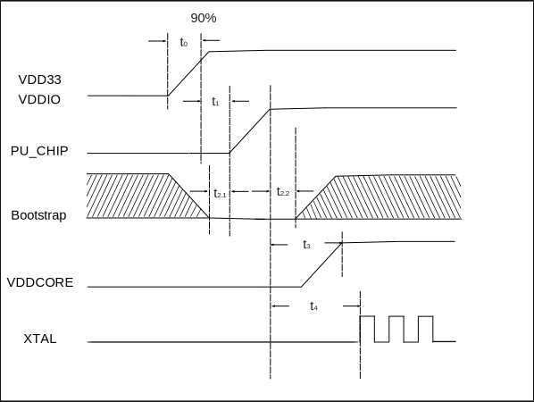

=====================================
Electrical Specifications
=====================================

Absolute Maximum Rating
===========================

.. table:: Absolute Maximum Rating 

    +--------------------------------+--------+--------+------+
    |  Pin Name                      | Min.   | Max.   | Unit | 
    +================================+========+========+======+
    | VDD33_DCDC18, VDD33_DCDC11     | -0.3   | 3.63   | V    | 
    +--------------------------------+--------+--------+------+
    | VDD33(USB)                     | -0.3   | 3.63   | V    | 
    +--------------------------------+--------+--------+------+
    | VDDIO1                         | -0.3   | 3.63   | V    | 
    +--------------------------------+--------+--------+------+
    | VDDIO2                         | -0.3   | 3.63   | V    | 
    +--------------------------------+--------+--------+------+
    | VDDIO3                         | -0.3   | 3.63   | V    | 
    +--------------------------------+--------+--------+------+
    | VDDIO4                         | -0.3   | 3.63   | V    | 
    +--------------------------------+--------+--------+------+
    | VDD33_RF                       | -0.3   | 3.63   | V    | 
    +--------------------------------+--------+--------+------+
    | AVDD33_CODEC                   | -0.3   | 3.63   | V    | 
    +--------------------------------+--------+--------+------+

Operating Condition
=======================

Power characteristics
-----------------------

.. table:: Recommended Power Operating Range

    +---------------------------------+---------------------+-----------+--------------+------+
    |  Pin Name                       | Min.                |  Typ      | Max.         | Unit | 
    +=================================+=====================+===========+==============+======+
    | VDD33_DCDC18, VDD33_DCDC11      | 3                   | 3.3       | 3.63         | V    | 
    +---------------------------------+---------------------+-----------+--------------+------+
    | VDD33(USB)                      | 3                   | 3.3       | 3.63         | V    | 
    +---------------------------------+---------------------+-----------+--------------+------+
    | VDDIO1                          | 3.0/1.62            | 3.3/1.8   | 3.63/1.98    | V    | 
    +---------------------------------+---------------------+-----------+--------------+------+
    | VDDIO2                          | 3                   | 3.3       | 3.63         | V    | 
    +---------------------------------+---------------------+-----------+--------------+------+
    | VDDIO3                          | 3.0/1.62            | 3.3/1.8   | 3.63/1.98    | V    | 
    +---------------------------------+---------------------+-----------+--------------+------+
    | VDDIO4                          | 3.0/1.62            | 3.3/1.8   | 3.63/1.98    | V    | 
    +---------------------------------+---------------------+-----------+--------------+------+
    | VDD33_RF                        | 3                   | 3.3       | 3.63         | V    | 
    +---------------------------------+---------------------+-----------+--------------+------+
    | AVDD33_CODEC                    | 3                   | 3.3       | 3.63         | V    | 
    +---------------------------------+---------------------+-----------+--------------+------+

IO DC characteristics
-------------------------

.. table:: IO DC characteristics

    +----------------------+------------------------+---------------+-----------+--------------+------------+------------+
    |  Symbol              | Description            |  Conditions   |  Min.     | Typ          | Max.       | Unit       |
    +======================+========================+===============+===========+==============+============+============+
    | VOH                  | Output voltage high    |               | 0.8 * VIO |              |            | V          | 
    +----------------------+------------------------+---------------+-----------+--------------+------------+------------+
    | VOL                  | Output voltage low     |               |           |              | 0.1 * VIO  | V          | 
    +----------------------+------------------------+---------------+-----------+--------------+------------+------------+
    | VIH                  | Input voltage high     |               | 0.7 * VIO |              | VIO + 0.3  | V          |
    +----------------------+------------------------+---------------+-----------+--------------+------------+------------+
    | VIL                  | Input voltage low      |               | -0.3      |              | 0.3 * VIO  | V          |
    +----------------------+------------------------+---------------+-----------+--------------+------------+------------+

Power-on sequence
-------------------
In order to ensure normal power-on startup, the power, reset and Bootstrap pins need to meet the corresponding timing requirements.

   Power-on sequence

.. table:: Power-on sequence parameters

    +------------------+------------------------------------------------------------------------+-----------+--------------+------------+
    |  Parameters      | Description                                                            |Min.(ms)   | Typ(ms)      | Max.(ms)   |
    +==================+========================================================================+===========+==============+============+
    | t\ :sub:`0`\     | Rise time for supply voltage to reach 90%                              |           |              | 2          |
    +------------------+------------------------------------------------------------------------+-----------+--------------+------------+
    | t\ :sub:`1`\     | Delay time before power rises until PU_CHIP is pulled high             | 0.1       |              |            |
    +------------------+------------------------------------------------------------------------+-----------+--------------+------------+
    | t\ :sub:`2.1`\   | Bootstrap pin [0101]_ level setup time before PU_CHIP is pulled high   | 0         |              |            |
    +------------------+------------------------------------------------------------------------+-----------+--------------+------------+
    | t\ :sub:`2.2`\   | Hold time of Bootstrap pin level after PU_CHIP is pulled high          | 2         |              |            |
    +------------------+------------------------------------------------------------------------+-----------+--------------+------------+
    | t\ :sub:`3`\     | The time that PU_CHIP is pulled high to VDDCORE output                 |           | 2            |            |
    +------------------+------------------------------------------------------------------------+-----------+--------------+------------+
    | t\ :sub:`4`\     | The time when PU_CHIP is pulled high until XTAL starts to vibrate      |           | 2            |            |
    +------------------+------------------------------------------------------------------------+-----------+--------------+------------+

.. [0101] Bootstrap pin is GPIO39.

Temperature sensor characteristics
-----------------------------------------

.. table:: Recommended Temperature Operating Range

    +--------------+---------------+--------+-----------+--------+
    |  Item                        | Min.   |  Max.     | Unit   |
    +==============+===============+========+===========+========+
    | Temperature  | Main Die      | -40    | 85        | °C     |
    |              +---------------+--------+-----------+        +
    |              | Multi-Die SiP | -40    | 85        |        |
    +--------------+---------------+--------+-----------+--------+

General operating conditions
-----------------------------------

.. table:: General Operating Conditions

    +------------+--------------------------------+-----------+--------------+--------+------+
    |  Item      | Description                    |  Min.     | Typ          | Max.   | Unit |
    +============+================================+===========+==============+========+======+
    | FCPU       | CPU clock frequency (M0)       |           |              | 320    | MHz  | 
    +            +--------------------------------+-----------+--------------+--------+      +
    |            | CPU clock frequency (D0)       |           |              | 480    |      |
    +------------+--------------------------------+-----------+--------------+--------+------+

