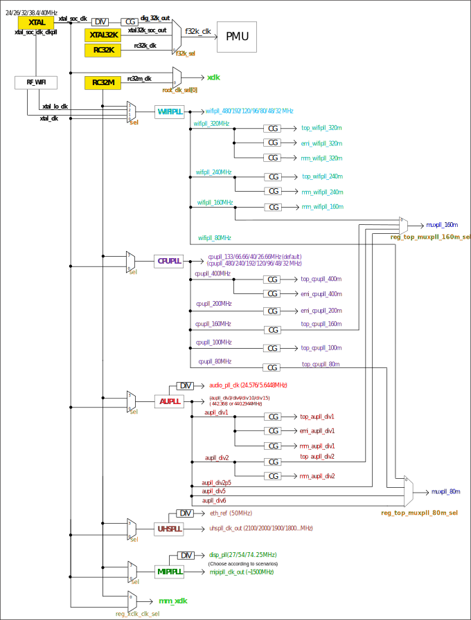

===============================
Functional Description
===============================
BL808  main functions described as follows:

.. figure:: ../../picture/SystemArch.svg
   :align: center

   System Architecture

CPU
====
BL808 contains multiple RISC-V processors inside.

M0 is a 32-bit RISC-V CPU with a 5-stage pipeline structure, supports RISC-V 32/16-bit mixed instruction set, contains 
64
external interrupt sources, and 4 bits can be used to configure interrupt priority.

D0 is a 64-bit RISC-V CPU with a 5-stage pipeline structure, supports the RISC-V RV64IMAFCV instruction architecture, contains 
67
external interrupt sources, and 3 bits can be used to configure the interrupt priority.

Cache
=============
The cache of BL808 improves the performance of CPU accessing external memory. M0 contains 32K instruction cache and 16K data cache;
D0 contains 32K instruction cache and 32K data cache.

Memory
=============
BL808 memory includes: on-chip zero-delay SRAM memory, read-only memory, write-once memory,
Embedded flash (optional), embedded pSRAM (optional).

DMA
==========
The DMA controller has 20 dedicated channels (8 channels each for DMA0 and DMA2, and 4 channels for DMA1) to manage data transfers between peripherals and memory to improve CPU/bus efficiency. DMA has four transfer types, memory-to-memory, memory-to-peripheral, peripheral-to-memory, and peripheral-to-peripheral modes.

The DMA also supports the LLI (Linked List Item) feature, which consists of a series of linked lists that predefine multiple transfers, and then the hardware automatically completes all transfers based on the size and address of each LLI.
Peripherals supported by DMA include UART, I2C, SPI, ADC, IR, GPIO, Audio, I2S, PDM, DBI, DSI.

Memory Map
============
.. table:: Memory Map 

    +-----------------+-------+-------------+----------------+-------------+----------------+
    |  Module         | Size  |  Base Address(M0)            |  Base Address(D0)            |
    +                 +       +-------------+----------------+-------------+----------------+
    |                 |       | Cache       | Non-cache      | Cache       | Non-cache      |
    +=================+=======+=============+================+=============+================+
    | OCRAM(MCU)      | 64KB  | 0x62020000  | 0x22020000     | \-          | 0x22020000     |
    +-----------------+-------+-------------+----------------+-------------+----------------+
    | WRAM(MCU)       | 160KB | 0x62030000  | 0x22030000     | \-          | 0x22030000     |
    +-----------------+-------+-------------+----------------+-------------+----------------+
    | DRAM(MM)        | 512KB | \-          | 0x3EF80000     | 0x3EF80000  | \-             |
    +-----------------+-------+-------------+----------------+-------------+----------------+
    | VRAM(MM)        | 32KB  | \-          | 0x3F000000     | 0x3F000000  | \-             |
    +-----------------+-------+-------------+----------------+-------------+----------------+

OCRAM and WRAM can be accessed either through AHB bus or through AXI. When the CPU accesses OCRAM using the address of 0x62020000, it will go through the internal cache and transfer AXI to AHB to achieve access to OCRAM. When the CPU uses the 0x22020000 address to access OCRAM, it does not go through the internal cache and directly accesses OCRAM through the AHB bus.

.. table:: Memory Map 

    +---------------+---------------+-----------------------+-------+------------------------------------------------------------------------------------------------------------------------+
    |  Module       |  Target       |  Base Address         | Size  |         Description                                                                                                    |
    +---------------+---------------+-----------------------+-------+------------------------------------------------------------------------------------------------------------------------+
    |   pSRAM       | pSRAM         |0x54000000             | 64MB  | pSRAM memory address space, actual size depends on chip model                                                          |
    +---------------+---------------+-----------------------+-------+------------------------------------------------------------------------------------------------------------------------+
    | FLASH         | FlashA        | 0x58000000            | 64MB  | Application address space, the actual size depends on the chip model                                                   |
    +---------------+---------------+-----------------------+-------+------------------------------------------------------------------------------------------------------------------------+
    | MMPERI        | TIMER1        | 0x30009000            | 4KB   | TIMER1 control register                                                                                                |
    +               +---------------+-----------------------+-------+------------------------------------------------------------------------------------------------------------------------+
    |               | SPI1          | 0x30008000            | 4KB   | SPI1 control register                                                                                                  |
    +               +---------------+-----------------------+-------+------------------------------------------------------------------------------------------------------------------------+
    |               | MM_GLB        | 0x30007000            | 4KB   | Multimedia side global register                                                                                        |
    +               +---------------+-----------------------+-------+------------------------------------------------------------------------------------------------------------------------+
    |               | DMA2D         | 0x30006000            | 4KB   | DMA2D control register                                                                                                 |
    +               +---------------+-----------------------+-------+------------------------------------------------------------------------------------------------------------------------+
    |               | I2C3          | 0x30004000            | 4KB   | I2C3 control register                                                                                                  |
    +               +---------------+-----------------------+-------+------------------------------------------------------------------------------------------------------------------------+
    |               | I2C2          | 0x30003000            | 4KB   | I2C2 control register                                                                                                  |
    +               +---------------+-----------------------+-------+------------------------------------------------------------------------------------------------------------------------+
    |               | UART3         | 0x30002000            | 4KB   | UART3 control register                                                                                                 |
    +               +---------------+-----------------------+-------+------------------------------------------------------------------------------------------------------------------------+
    |               | DMA2          | 0x30001000            | 4KB   | DMA2 control register                                                                                                  |
    +---------------+---------------+-----------------------+-------+------------------------------------------------------------------------------------------------------------------------+
    | MCUPERI       | DMA1          | 0x20071000            | 4KB   | DMA1 control register                                                                                                  |
    +               +---------------+-----------------------+-------+------------------------------------------------------------------------------------------------------------------------+
    |               | EMAC          | 0x20070000            | 4KB   | EMAC control register                                                                                                  |
    +               +---------------+-----------------------+-------+------------------------------------------------------------------------------------------------------------------------+
    |               | AUDIO         | 0x20055000            | 4KB   | Audio control register                                                                                                 |
    +               +---------------+-----------------------+-------+------------------------------------------------------------------------------------------------------------------------+
    |               | USB           | 0x20072000            | 4KB   | USB control register                                                                                                   |
    +               +---------------+-----------------------+-------+------------------------------------------------------------------------------------------------------------------------+
    |               | HBN           | 0x2000F000            | 4KB   | Hibernate register                                                                                                     |
    +               +---------------+-----------------------+-------+------------------------------------------------------------------------------------------------------------------------+
    |               | PDS           | 0x2000E000            | 4KB   | Power-Down sleep register                                                                                              |
    +               +---------------+-----------------------+-------+------------------------------------------------------------------------------------------------------------------------+
    |               | DMA0          | 0x2000C000            | 4KB   | DMA0 control register                                                                                                  |
    +               +---------------+-----------------------+-------+------------------------------------------------------------------------------------------------------------------------+
    |               | I2S           | 0x2000AB00            | 256B  | I2S control register                                                                                                   |
    +               +---------------+-----------------------+-------+------------------------------------------------------------------------------------------------------------------------+
    |               | ISO11898      | 0x2000AA00            | 256B  | ISO11898 bus control register                                                                                          |
    +               +               +-----------------------+-------+------------------------------------------------------------------------------------------------------------------------+
    |               | UART2         | 0x2000AA00            | 256B  | UART2 control register                                                                                                 |
    +               +---------------+-----------------------+-------+------------------------------------------------------------------------------------------------------------------------+
    |               | I2C1          | 0x2000A900            | 256B  | I2C1 control register                                                                                                  |
    +               +---------------+-----------------------+-------+------------------------------------------------------------------------------------------------------------------------+
    |               | IR            | 0x2000A600            | 256B  | IR control register                                                                                                    |
    +               +---------------+-----------------------+-------+------------------------------------------------------------------------------------------------------------------------+
    |               | TIMER0        | 0x2000A500            | 256B  | TIMER0 control register                                                                                                |
    +               +---------------+-----------------------+-------+------------------------------------------------------------------------------------------------------------------------+
    |               | PWM           | 0x2000A400            | 256B  | PWM control register                                                                                                   |
    +               +---------------+-----------------------+-------+------------------------------------------------------------------------------------------------------------------------+
    |               | I2C0          | 0x2000A300            | 256B  | I2C0 control register                                                                                                  |
    +               +---------------+-----------------------+-------+------------------------------------------------------------------------------------------------------------------------+
    |               | SPI0          | 0x2000A200            | 256B  | SPI0 control register                                                                                                  |
    +               +---------------+-----------------------+-------+------------------------------------------------------------------------------------------------------------------------+
    |               | UART1         | 0x2000A100            | 256B  | UART1 control register                                                                                                 |
    +               +---------------+-----------------------+-------+------------------------------------------------------------------------------------------------------------------------+
    |               | UART0         | 0x2000A000            | 256B  | UART0 control register                                                                                                 |
    +               +---------------+-----------------------+-------+------------------------------------------------------------------------------------------------------------------------+
    |               | eFuse         | 0x20056000            | 4KB   | eFuse memory control register                                                                                          |
    +               +---------------+-----------------------+-------+------------------------------------------------------------------------------------------------------------------------+
    |               | TZ            | 0x20005000            | 4KB   | Security Zone partition                                                                                                |
    +               +---------------+-----------------------+-------+------------------------------------------------------------------------------------------------------------------------+
    |               | SEC_ENG       | 0x20004000            | 4KB   | Security engine control register                                                                                       |
    +               +---------------+-----------------------+-------+------------------------------------------------------------------------------------------------------------------------+
    |               | GPIP          | 0x20002000            | 1KB   | General purpose DAC/ADC/ACOMP interface control register                                                               |
    +               +---------------+-----------------------+-------+------------------------------------------------------------------------------------------------------------------------+
    |               | GLB           | 0x20000000            | 4KB   | Global control register                                                                                                |
    +---------------+---------------+-----------------------+-------+------------------------------------------------------------------------------------------------------------------------+
    | ROM           | ROM           | 0x90000000            | 128KB | Bootrom address space                                                                                                  |
    +---------------+---------------+-----------------------+-------+------------------------------------------------------------------------------------------------------------------------+

.. table:: MRAM/VRAM address space

    +---------------+------------------------------+---------------+----------------+-------------+-------------+-------------+-------------+-------------+-------------+
    |  MRAM/VRAM                                   |  Configure(reg_h2pf_sram_rel，reg_vram_sram_sel，reg_ispl_sram_rel，reg_blai_sram_rel)                             |
    +                                              +---------------+----------------+-------------+-------------+-------------+-------------+-------------+-------------+
    |                                              | 0，0，0，0    | 0，0，0，1     | 1，0，0，0  | 3，0，0，0  | 0，0，1，0  | 0，1，0，0  | 2，0，0，1  | 3，1，1，1  |
    +===============+==============================+===============+================+=============+=============+=============+=============+=============+=============+
    |   MRAM        | 0x3EF80000 - 0x3EF8FFFF      | \-            | \-             | \-          | \-          | \-          | \-          | \-          | 64K         |
    +               +------------------------------+---------------+----------------+-------------+-------------+-------------+-------------+-------------+-------------+
    |               | 0x3EF90000 - 0x3EF9FFFF      | \-            | \-             | \-          | \-          | \-          | \-          | \-          | 64K         |
    +               +------------------------------+---------------+----------------+-------------+-------------+-------------+-------------+-------------+-------------+
    |               | 0x3EFA0000 - 0x3EFAFFFF      | \-            | \-             | \-          | \-          | \-          | \-          | \-          | 64K         |
    +               +------------------------------+---------------+----------------+-------------+-------------+-------------+-------------+-------------+-------------+
    |               | 0x3EFB0000 - 0x3EFBFFFF      | \-            | \-             | \-          | \-          | \-          | \-          | 64K         | 64K         |
    +               +------------------------------+---------------+----------------+-------------+-------------+-------------+-------------+-------------+-------------+
    |               | 0x3EFC0000 - 0x3EFCFFFF      | \-            | \-             | \-          | 64K         | \-          | \-          | 64K         | 64K         |
    +               +------------------------------+---------------+----------------+-------------+-------------+-------------+-------------+-------------+-------------+
    |               | 0x3EFD0000 - 0x3EFDFFFF      | \-            | 64K            | \-          | 64K         | \-          | \-          | 64K         | 64K         |
    +               +------------------------------+---------------+----------------+-------------+-------------+-------------+-------------+-------------+-------------+
    |               | 0x3EFE0000 - 0x3EFEFFFF      | \-            | 64K            | 64K         | 64K         | 64K         | 64K         | 64K         | 64K         |
    +               +------------------------------+---------------+----------------+-------------+-------------+-------------+-------------+-------------+-------------+
    |               | 0x3EFF0000 - 0x3EFFFFFF      | 64K           | 64K            | 64K         | 64K         | 64K         | 64K         | 64K         | 64K         |
    +---------------+------------------------------+---------------+----------------+-------------+-------------+-------------+-------------+-------------+-------------+
    | VRAM          | 0x3F000000 - 0x3F007FFF      | 32K           | 32K            | 32K         | 32K         | 32K         | 32K         | 32K         | 32K         |
    +---------------+------------------------------+---------------+----------------+-------------+-------------+-------------+-------------+-------------+-------------+

Interrupt
===========
BL808 supports internal RTC clock wake-up and external interrupt wake-up to realize low-power sleep wake-up function.

The CPU interrupt controller supports a total of 
131
maskable interrupt trigger sources including UART interrupt, I2C interrupt, SPI interrupt, timer interrupt, DMA interrupt, etc.

All I/O pins can be configured as external interrupt input mode, the external interrupt supports nine trigger types: synchronous high/low level trigger, synchronous rising/falling edge trigger, asynchronous high/low level trigger, asynchronous rising edge /Falling edge trigger and synchronous double edge trigger.

Boot
=========
BL808 supports multiple boot options: UART, USB, and Flash.

.. table:: Boot mode 

    +---------------+---------------+--------------------------------------------------------------------------------------------------------+
    |  Boot pin     |  Level        |   Description                                                                                          |
    +===============+===============+========================================================================================================+
    | GPIO39        | 1             |  Boot from UART(GPIO20/21)/USB, this mode is mainly used for Flash download or download image to RAM   |
    +               +---------------+--------------------------------------------------------------------------------------------------------+
    |               | 0             |  Launch application image from Flash                                                                   |
    +---------------+---------------+--------------------------------------------------------------------------------------------------------+

Power
=============
PMU (power management unit) manages the power of the entire chip and is divided into running, idle, sleep, hibernation and power off modes. The software can be configured to enter sleep mode and wake-up via RTC timer or EINT to achieve low-power sleep and accurate wake-up management.

Power down sleep modes are flexible for applications to configure as the lowest power consumption.

Clock
=========
Clock control unit generates clocks to the core MCU and the peripheral SOC devices. The root clock source can be XTAL, PLL or RC oscillator.
Dynamic power-saved by proper configurations such as sel, div, en, etc.

   System Clock Architecture
   
.. figure:: ../../picture/MoudleClock.svg
   :align: center

   Moudle Clock Architecture
   
.. figure:: ../../picture/PeripheralClock.svg
   :align: center
   :scale: 95%

   Peripheral Clock Architecture

Peripheral
==================
Peripherals include USB2.0, Ethernet, SD/MMC, SPI, UART, I2C, I2S, PWM, GPDAC/GPADC/, ACOMP, PIR, Touch, IR remote, Display and GPIO.

GPIO
------
BL808C can have up to 40 GPIOs, BL808D can have up to 36 GPIOs,
with the following features:

- Each GPIO can be used as general purpose input and output function, pull-up/pull-down/float can be configured by software
- Each GPIO supports interrupt function, the interrupt supports synchronous high/low level trigger, synchronous rising/falling edge trigger, asynchronous high/low level trigger, asynchronous rising/falling edge trigger and synchronous double edge trigger
- Each GPIO can be set to high impedance state for low power mode

UART
------
The chip has four built-in UARTs (UART0/1/2/3) with the following features:

- Supports CTS and RTS flow control in hardware
- Support LIN master/slave function
- Configurable data bits, stop bits and parity bits
- Supports automatic baud rate detection for common/fixed characters
- The working clock can be selected as BCLK, XCLK or 160MHz, the maximum baud rate supports 10Mbps
- TX and RX have independent FIFO, FIFO depth is 32 bytes, support DMA function

SPI
---------
The chip has two built-in SPIs, which can be configured as master mode or slave mode. The SPI module clock is XCLK or 160MHz, and has the following characteristics:

- In master mode, clock frequency up to 80 MHz
- In slave mode, the maximum allowed master clock frequency is 80 MHz
- The bit width of each frame can be configured as 8bit/16bit/24bit/32bit
- Adaptive FIFO depth change characteristics, suitable for high-performance scene applications
  
   * When the bit width is 32 bits, the depth of the FIFO is 8
   * When the bit width is 24 bits, the depth of the FIFO is 8
   * When the bit width is 16 bits, the depth of the FIFO is 16
   * When the bit width is 8 bits, the depth of the FIFO is 32
- Support DMA transfer mode

I2C
---------
The chip has four built-in I2C interfaces with the following features:

- Support multi-master mode and arbitration function
- The working clock can be selected as BCLK or XCLK
- With device address register, register address register, register address length can be set to 1 byte / 2 bytes / 3 bytes / 4 bytes
- I2C has independent transceiver FIFO, FIFO depth is 2 words
- Support DMA function

I2S
---------
The chip has a built-in I2S interface with the following features:

- Support master mode and slave mode
- Support Left-justified/ Right-justified/ DSP and other data formats, the data width can be configured as 8/16/24/32 bits
- The working clock can be selected as BCLK or XCLK
- Supports both four-channel and six-channel modes in addition to mono/dual-channel mode
- Supports playback of mono audio dubbing to binaural mode
- Support dynamic mute switching function
- I2S has independent transceiver FIFO, FIFO depth is 16 words
- Support DMA function

EMAC
--------------------
The EMAC module is a 10/100Mbps Ethernet Media Access Controller (Ethernet MAC) compatible with IEEE 802.3, has the following characteristics:

- Compatible with the MAC layer defined by IEEE 802.3
- PHY supporting MII/RMII interface defined by IEEE 802.3
- Interacts with PHY through MDIO interface
- Supports 10 Mbps and 100 Mbps Ethernet
- Supports half-duplex and full-duplex
- Supports automatic flow control and control frame generation in the full-duplex mode
- Supports collision detection and retransmission in the half-duplex mode
- Supports the generation and verification of CRC
- Generates and removes data frame preamble
- Supports automatic extension of short data frames when sending
- Detects too long/short data frames (length limit)
- Transmits long data frames (> standard Ethernet frame length)
- Automatically discards data packets with over-limit retransmission times or too small frame gap
- Broadcast packet filtering
- Internal RAM for storing up to 128 BDs
- Splits and configures a data packet to multiple consecutive Bds when sending
- Various event flags sent or received
- Generates a corresponding interrupt when an event occurs

The EMAC timing diagram is shown below:

.. figure:: ../../picture/EMACTiming.svg
   :align: center

   EMAC Timing Diagram

.. table:: Timing conditions for using RX Clock

    +-----------------+--------------------+--------+--------+---------------------+--------+----------------------------------+
    | Set the corresponding bit of register eth_cfg0:cfg_inv_eth_rx_clk = 1,cfg_inv_eth_tx_clk = 0,cfg_sel_eth_ref_clk_o = 0   |
    +-----------------+--------------------+--------+--------+---------------------+--------+----------------------------------+
    | Timing parameters(1.8V, Load = 20PF) | Min.   | Typ    |  Max.               | Unit   | Note                             |
    +=================+====================+========+========+=====================+========+==================================+
    | T\ :sub:`cyc`\  |Clock Cycle         | \-     | 20     | \-                  | ns     | Clock From ETH PHY               |
    +-----------------+--------------------+--------+--------+---------------------+--------+----------------------------------+
    | T\ :sub:`vld`\  |Output Valid Delay  | 10.37  | \-     | 22                  | ns     | TXD/TX_EN                        |
    +-----------------+--------------------+--------+--------+---------------------+--------+----------------------------------+
    | T\ :sub:`su`\   |Input Setup Time    | 6      | \-     | \-                  | ns     | RXD/RX_DV/RXERR                  |
    +-----------------+--------------------+--------+--------+---------------------+--------+----------------------------------+
    | T\ :sub:`h`\    |Input Hold Time     | 0      | \-     | \-                  | ns     | RXD/RX_DV/RXERR                  |
    +-----------------+--------------------+--------+--------+---------------------+--------+----------------------------------+

.. table:: Timing conditions without using RX Clock

    +-----------------+--------------------+--------+--------+---------------------+--------+----------------------------------+
    | Set the corresponding bit of register eth_cfg0:cfg_inv_eth_rx_clk = 0,cfg_inv_eth_tx_clk = 0,cfg_sel_eth_ref_clk_o = 0   |
    +-----------------+--------------------+--------+--------+---------------------+--------+----------------------------------+
    | Timing parameters(1.8V, Load = 20PF) | Min.   | Typ    |  Max.               | Unit   | Note                             |
    +=================+====================+========+========+=====================+========+==================================+
    | T\ :sub:`cyc`\  |Clock Cycle         | \-     | 20     | \-                  | ns     | Clock From ETH PHY               |
    +-----------------+--------------------+--------+--------+---------------------+--------+----------------------------------+
    | T\ :sub:`vld`\  |Output Valid Delay  | 10.374 | \-     | 22                  | ns     | TXD/TX_EN                        |
    +-----------------+--------------------+--------+--------+---------------------+--------+----------------------------------+
    | T\ :sub:`su`\   |Input Setup Time    | 5      | \-     | \-                  | ns     | RXD/RX_DV/RXERR                  |
    +-----------------+--------------------+--------+--------+---------------------+--------+----------------------------------+
    | T\ :sub:`h`\    |Input Hold Time     | 3      | \-     | \-                  | ns     | RXD/RX_DV/RXERR                  |
    +-----------------+--------------------+--------+--------+---------------------+--------+----------------------------------+

TIMER
------------
The chip has two built-in 32-bit general-purpose timers and a watchdog timer with the following features:

- The clock source of the general timer can be selected from FCLK/32K/XTAL, and the clock source of the watchdog timer can be selected from FCLK/32K/XTAL
- 8-bit divider for each counter
- Each group of general-purpose timers includes three compare registers, supports compare interrupts, and supports FreeRun mode and PreLoad mode in counting mode
- 16-bit watchdog timer, supports two watchdog overflow methods: interrupt or reset

PWM
---------
The chip has built-in 2 groups of PWM signals, each group contains 4 channels of PWM signal output, each channel can be set to 2 channels of complementary PWM, with the following characteristics:

- Three clock sources BCLK/XCLK/32K
- Frequency divider register and period register are 16-bit wide
- Each channel PWM supports adjustable output polarity, dual threshold setting, increasing the flexibility of pulse output
- Each channel PWM has independent dead time setting
- Each PWM has an independent connection switch to choose whether to connect with the internal counter, and can set the default output level when not connected
- Software brake and external brake signal can put the PWM output level into a preset state
- Up to 11 trigger sources that can be used to trigger ADC conversions

IR(IR-remote)
------------------
The chip has a built-in infrared remote control with the following features:

- Support both sending and receiving modes
- Supports up to 128-bit data bits to be sent in non-free mode, and can continuously send data of any length in free mode
- Supports receiving data with fixed protocols NEC, RC-5, and receiving data in any format with pulse width counting
- The clock source is XCLK, and the maximum operating frequency is 32MHz. It has powerful infrared waveform editing capabilities, and can send waveforms that conform to various protocols. The transmit power is adjustable in 15 levels
- Receive FIFO depth is 128 bytes, transmit FIFO depth is 16 bytes
- Transmit supports DMA mode

PDM
---------
The chip has a built-in PDM audio processing module with the following features:

- Integrated 3-channel digital filter, can support 3-channel digital microphone input
  
   * Sampling rate: 8k~48k
   * SNR > 110dB
   * Data valid bit width 20 bit
   * Digital gain: -95.5 ~ +32.5dB, 0.5dB step
  
- Independently adjustable three-channel high-pass filter
- Multiplexed GPIO input (1 clock output, 2 data input)
- Transmit FIFO width 32bit, depth 48
- Support DMA transfer mode

Video encoding
===================

Introduction
-----------
VENC adopts the H264 video coding standard, which is mainly compressed by means of prediction and motion compensation, and uses loop filtering to improve the image quality, taking into account the requirements of code stream transmission and image quality.

Features
---------------
- 1920x1080p @ 30fps + 640x480 @ 30fps, BP/MP
- Input: Semi-Planar YCbCr 4:2:0
- Output: NALU(Network Abstract Layer Uint) in byte stream format
- CBR/VBR mode
- Up to 8 ROIs
- Up to 16 OSD coding areas
- Support software mode and linkage mode
- Dynamically configurable max/min quantization parameters
- Dynamically configurable I/P frame target bits
- Dynamically configurable I-frame distance

And sensor and display interface
====================================

And sensor
----------------

- MIPI-CSI

    1. Support 1-/2-lane mode
    2. Support hardware decoding (RAW8/10/12/14, RGB565/888, YUV422 8-/10-bit) or software decoding

- DVP

    1. Support RAW 12-bit data
    2. Support YUV/RGB 8-bit format
    3. Support image compression mode

And monitor
--------------------

- MIPI-DSI

    1. Support 1-/2-/4-lane mode
    2. Support RGB565/666/888 and YUV422 8-bit format
    3. Support Sync Event Mode or Sync Pulse Mode
    4. Support Escape Mode, and can be used with DMA function

- MIPI-DBI

    1. Support Type-B (8-bit), Type-C Option 1 (3-wire) and Type-C Option 3 (4-wire) modes
    2. Support RGB565/666/888 format
    3. Built-in YUV2RGB conversion module
    4. Support DMA function

- MIPI-DPI

    1. Support data 16-bit mode
    2. Support RGB565 format

- QSPI

    1. CMD/ADDR/DATA can choose 1-/4-wire mode arbitrarily, so QSPI 111/114/144/444 mode can be supported
    2. Support RGB565/666/888 format
    3. Built-in YUV2RGB conversion module
    4. Support DMA function
