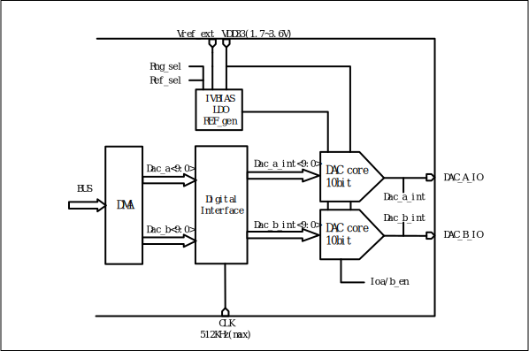

==========
DAC
==========

Overview
===========
The chip integrates a 10bits digital-to-analog converter (DAC) with FIFO depth of 1, and supports two DAC modulation outputs. DAC can be used for playing audio and modulating transmitter voltage.

Features
=========
- Modulation accuracy of 10bits

- Optional input clocks of 32k, 16k, 8k or 512k

- Allows DMA to transfer memory to DAC modulation registers

- Supports dual-channel playback and DMA transfer mode

- Output pins of DAC are fixed as GPIO4 for ChannelA and GPIO11 for ChannelB

Functional Description
=============================
The block diagram of DAC is shown as follows.

   Block Diagram of DAC

- Supports up to two modulated outputs

- Supports dual-channel playback and DMA data transfer

- Supports the DMA data interface with a length of 32bit, in which the high 16 bits will be modulated on the pin of ChannelA and the low 16 bits will be modulated on the pin of ChannelB

.. only:: html

   .. include:: dac_register.rst

.. raw:: latex

   \input{../../en/content/dac}

