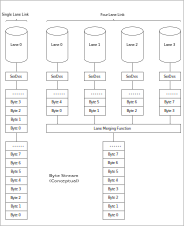

===========
DSI
===========

Overview
=====
The Display Serial Interface (DSI) is an interface protocol defined by MIPI Alliance for communicating with display screens. It sends pixels or commands to peripherals and can read status or pixel information from peripherals. All data lanes of DSI are unidirectional in High-Speed Mode, while in Low-Speed Mode only the first data lane is bidirectional and other lanes are unidirectional. The clock lane is dedicated to transmitting synchronous clock signals during high-speed data transmission. In addition, one master side allows communication with multiple slave sides at the same time. This chip has a built-in DSI controller and DPHY, which enable communication with DSI-compatible displays so that data can be displayed on the screen.

Features
===========

- Meets MIPI® Alliance standard

- MIPI® DPHY interface with maximum speed of 800 Mbps

- One Clock Lane, up to 4 Data Lanes

- Four sequences for Data Lanes

- Supports Ultra Low Power Mode and High Speed Mode

- Data Lane 0 supports bidirectional communication and Escape Mode

- Supports LPDT/ULPS/Trigger in the Escape Mode

- Supports short and long packet sending in the LPDT Mode

- Supports error correction code (ECC) and check function

- Supports data length error and data overflow error interrupt

- Supports Command Mode and Video Mode

- Supports Event and Pulse Modes in the Video Mode

- Data formats supported by the display interface:
  
  - YUV422, 8 bit
  
  - RGB565
  
  - RGB666, loosely packed
  
  - RGB888

- Rich and diverse interrupt mechanisms and status query

- Supports DMA transmission in the LPDT Mode

- Use with OSD

Functional Description
===========

The block diagram of the DSI Module is shown as follows:

.. figure:: ../../picture/DSIBlock.svg
   :align: center

   Block Diagram of DSI

DSI Protocol Layering
----------------
The DSI protocol is divided into 4 layers from bottom to top, namely, physical layer, lane management layer, protocol layer, and application layer, as shown below:

.. figure:: ../../picture/DSILayer.svg
   :align: center

   Protocol Layering

Physical layer: It specifies the transmission medium (electrical conductor), the input/output circuit, and the clock mechanism for capturing "1" and "0" from the serial bit stream. In addition, it also specifies the signaling mechanism of start of transmission (SoT) and end of transmission (EoT) and other "out-of-band" information that can be transmitted between transmitting and receiving PHY.

Lane management layer: DSI can expand lanes to improve performance. The number of data lanes can be 1, 2, 3 or 4 depending on the bandwidth requirements of the application. The lane management layer aims to transfer the to-be-sent data from the transmitter (TX) end to the corresponding data lanes by groups according to the lane order, collect the data from each lane at the receiver (RX) end, and then merge them into a recombined data stream, thus recovering the original stream sequence.

Protocol layer: The DSI protocol defines packet formats, including short and long packets. The protocol layer aims to pack packets at the TX end according to the type and content of data, add the ECC and CRC codes, and transmit them to the lane management layer. At the RX end, it checks and corrects the received packet based on the ECC and CRC codes, decodes the packet header and data content, and transmits them to the application layer.

Application layer: Depending on the needs of application modules, at the TX end, it initially encodes the to-be-sent commands and data and converts them into the format specified by DSI; at the RX end, it restores the received data to the data format and timing supported by application modules.

Physical Layer
----------
According to the DPHY protocol, synchronous connection is used between the master and the slave in the physical layer. The clock lane is used to transmit high-speed clocks, and one or more data lanes are used to transmit low-power or high-speed data signals. Each lane uses two interconnected lines to connect the master and the slave, and supports both High-Speed (HS) and Low-Power (LP) Modes. In the HS Mode, TX simultaneously drives two interconnected lines of the lane to output a low-swing differential signal, such as 200 mV. In the LP Mode, TX drives the interconnected lines respectively, to output a single-ended signal with a relatively large swing respectively, such as 1.2 V. The levels of interconnected lines in the two modes are shown as follows:

.. figure:: ../../picture/DSILevel.svg
   :align: center

   Levels in HS and LP Modes

The two ends of the interconnected line are a driving unit and a receiving unit. The driving unit includes a differential transmitting module (HS\_TX) and a low-power single-ended transmitting module (LP\_TX), and the receiving unit includes a differential receiving module (HS\_RX) and a low-power single-ended receiving module (LP\_RX). HS\_TX drives the interconnected line with differential signals, and there are two statuses on the high-speed lane: Differential0 and Differential1. LP\_TX independently drives two interconnected lines, and there are four statuses on the lane: LP00, LP01, LP10, and LP11. The protocol clearly defines the line levels and configures the HS Mode, Control Mode, and Escape Mode, as shown below:

.. figure:: ../../picture/DSILaneState.svg
   :align: center

   Lane Status Code

Clock Lane
----------------------
The clock lane can be driven to Low Power Mode (LPM), UltraLow Power Mode (ULPM), and High Speed Clock Mode (HSCM). The flow chart of switching between different power modes of the clock lane is as follows:

.. figure:: ../../picture/DSIClockMode.svg
   :align: center

   Clock Lane Mode Switching

Low Power Mode (LPM, LP11)
*************************
Three ways for switching:

1. After the software reset, hardware reset and power-on sequence, the clock lane automatically changes to LP11 (LPM).

2. After leaving LP00 (ULPM), the clock lane changes to LP10 first and then to LP11 (LPM), as shown below:

.. figure:: ../../picture/DSIULPM2LPM.svg
   :align: center

   Switching from ULPM to LPM

3. After leaving HS0 or HS1 (HSCM), the clock lane changes to HS0 first and then to LP11 (LPM), as shown below:

.. figure:: ../../picture/DSIHSCM2LPM.svg
   :align: center

   Switching from HSCM to LPM

UltraLow Power Mode (ULPM, LP00)
***************************
One way for switching: The clock lane switches from LP11 (LPM) to LP10 first and then to LP00 (ULPM), as shown below:

.. figure:: ../../picture/DSILPM2ULPM.svg
   :align: center

   Switching from LPM to ULPM

High Speed Clock Mode (HSCM, HS0/1)
****************************
One way for switching: The clock lane switches from LP11 (LPM) to LP01, LP00, HS0, and HS0/1 (HSCM) in sequence, as shown below:

.. figure:: ../../picture/DSILPM2HSCM.svg
   :align: center

   Switching from LPM to HSCM

Data Lanes
------------------------
All data lanes (D3P/N, D2P/N, D1P/N, and D0P/N) can be driven to HighSpeed Data Transmission (HSDT) Mode, but only data lane 0 (D0P/N) can switch to the Escape Mode and Bus TurnAround Request (BTA) Mode. The entering and leaving sequences of the three modes are shown as follows:

   Entering and Leaving Sequences of Three Modes of Data Lanes

HighSpeed Data Transmission (HSDT)
**********************
When the clock lane of the MCU has switched to the HSCM Mode, the Display Module can switch to the HSDT Mode. The sequence of switching to the HSDT Mode is shown as follows:

.. figure:: ../../picture/DSIHSDTStart.svg
   :align: center

   Sequence of Entering HSDT Mode

Sequence:

- Start: LP-11

- HS request: LP01

- HS determination: LP-00=>HS-0 (RX: enabled lane terminal)

- RX synchronization: 011101 (by order of transmitted bits); TX synchronization: 00011101 (by order of transmitted bits)

- End: HSDT, ready to receive loaded high-speed data.

When the clock lane of the MCU is in the HSCM Mode, the Display Module can leave the HSDT Mode, and the clock lane must stay in HSCM until all data lanes switch to the LP11 Mode. The sequence of leaving the HSDT Mode is shown as follows:

.. figure:: ../../picture/DSIHSDTEnd.svg
   :align: center

   Sequence of Leaving HSDT Mode

Sequence:

- Start: HSDT.

- Stop HSDT: If the last loading bit is HS-0, the MCU changes to HS-1; if the last loading bit is HS-1, MCU changes to HS-0.

- End: LP-11 (RX: disabled lane terminal).

The burst operation of HSDT can be composed of one or multiple packets, which can be either short or long packets. Here are some different burst examples of HSDT:

.. figure:: ../../picture/DSIHSDTBurst.svg
   :align: center

   HSDT Burst Sequence

Bus Turn-Around(BTA)
*************************
When the MCU or Display Module that is controlling the lane D0P/N wants to get information from the RX end, it can initiate a bus turnaround request to reverse the bus control. The MCU and the Display Module initiate the bus turnaround request using the same sequence, as shown below:

   Bus Turnaround Sequence

Sequence:

 - Start: LP-11
 - Turnaround request (MCU): LP-11=>LP-10=>LP-00=>LP-10=>LP-00
 - MCU waits until the Display Module starts to control the lane D0P/N, while the MCU stops controlling the lane D0P/N and sets it to the high-impedance state.
 - The Display Module changes to the Stop Mode: LP-00=>LP-10=>LP-11

Escape Mode
*************
The Escape Mode, a special mode under LPM, has the following features:

1. Send LPDT command from the MCU to the Display Module.

2. Drive data lanes to the ULPS state.

3. Send a RAR command to reset the Display Module.

4. Send an ACK signal for transmitting non-error events from the Display Module to the MCU.

The basic sequence of the Escape Mode is shown as follows:

.. figure:: ../../picture/DSIEscape.svg
   :align: center

   Escape Mode Sequence

Sequence:

- Start: LP-11
- Switch to the Escape Mode (EME): LP-11=>LP-10=>LP-00=>LP-01=>LP-00
- Escape command (EC): When one of the data lanes changes from Low to High and then goes Low, this change shows the value of the current data bit (D0P = 1, D0N = 0)
- When the data lane 0 changes from Low to High and then goes Low, the receiver latches 1 bit data, that is, logic 0. The receiver takes the transmission from Low to High and then to Low
- as its internal clock
- If necessary, load the data
- Leave the Escape Mode: LP-00=>LP-10=>LP-11
- End: LP-11

Escape command types are shown in the following table:

.. figure:: ../../picture/DSIEscapeCommand.svg
   :align: center

   Escape Commands

Low Power Data Transmission (LPDT)
*************************
When the data lane changes to the Escape Mode and the MCU has sent the LPDT command to the Display Module, the MCU can send the data to the Display Module in the LPM. The Display Module also uses the same sequence when sending data to the MCU. The LPDT sequence is shown as follows:

   LPDT Sequence

Sequence:

- Start: LP-11
- Switch to the Escape Mode (EME): LP-11=>LP-10=>LP-00=>LP-01=>LP-00
- Send the LPDT command in the Escape Mode: 0x87 (LSBfirst).
- Data loading: One or more bytes, which are in a suspended state when the data lane stops between bytes (all lanes are Low).
- Leave the Escape Mode: LP-00=>LP-10=>LP-11
- End: LP-11

UltraLow Power State (ULPS)
***********************
When the data lane switches to the Escape Mode, MCU can mandatorily change the data lane to the ULPS. The ULPS sequence is shown as follows:

   ULPS Sequence

Sequence:

- Start: LP-11
- Switch to the Escape Mode (EME): LP-11=>LP-10=>LP-00=>LP-01=>LP-00
- Send the ULPS command in the Escape Mode: 0x78 (LSBfirst)
- ULPS: The MCU keeps the data lane Low
- Leave the Escape Mode: LP-00=>LP-10=>LP-11
- End: LP-11(after the data lane exits ULPS, wait 100 us before sending the next command)

Remote Application Reset (RAR)
***************
RAR is one of the Trigger commands. When the data lane switches to the Escape Mode, the MCU can inform the Display Module to reset in the remote application reset trigger. The RAR sequence is shown as follows:

.. figure:: ../../picture/DSIRAR.svg
   :align: center

   RAR Sequence

Sequence:

- Start: LP-11
- Switch to the Escape Mode (EME): LP-11=>LP-10=>LP-00=>LP-01=>LP-00
- Send the RAR command in the Escape Mode: 0x46 (LSBfirst)
- Leave the Escape Mode: LP-00=>LP-10=>LP-11
- End: LP-11

Acknowledgement (ACK)
************
ACK is one of the Trigger commands. The Display Module can notify the MCU of unrecognized errors through ACK. The Display Module sends ACK in a sequence shown in the following figure:

.. figure:: ../../picture/DSIACK.svg
   :align: center

   ACK Sequence

Sequence:

- Start: LP-11
- Switch to the Escape Mode (EME): LP-11=>LP-10=>LP-00=>LP-01=>LP-00
- Send the ACK command in the Escape Mode: 0x84 (LSBfirst)
- Leave the Escape Mode: LP-00=>LP-10=>LP-11
- End: LP-11

Lane Management Layer
-----------------
The lanes of DSI are expandable. The number of data lanes can be one, two, three, or four as expanded based on the bandwidth requirements of practical applications, and the peak bus bandwidth can gain an approximate linear increase. At the TX end, this layer aims to distribute the data from the protocol layer to each data lane in a certain order. At the RX end, this layer aims to collect transmitted bytes from each lane and merge them into a complete packet. All data lanes share a clock signal, but data transfer on each lane may not be completed simultaneously. When the number of bytes transmitted is not an integral multiple of the number of lanes, some lanes will finish data transfer before others. Except for Lane0, the order of the other three lanes can be configured by \<CR\_LANE\_MUX\_SEL>.

There are four orders:

- Lane0, Lane1, Lane2, Lane3

- Lane0, Lane3, Lane1, Lane2

- Lane0, Lane2, Lane3, Lane1

- Lane0, Lane2, Lane1, Lane3

Taking the single lane and four lanes (Lane0, Lane1, Lane2, Lane3) as examples, the TX end is shown as follows:

.. figure:: ../../picture/DSILaneDistributor.svg
   :align: center

   TX End Distribution

The RX end is shown as follows:

   RX End Merging

The lane distributor accepts HS transmission with arbitrary byte length, buffers N bytes, where N is the number of lanes implemented in the interface, and sends N byte arrays on N lanes in parallel. Before sending data, all lanes execute the SoT sequence in parallel to indicate the start of the first byte of the packet to the corresponding receiving unit. After the SoT, the lane sends N byte arrays from the first packet in parallel through a cyclic process. For a four-lane system, Byte 0 of the packet enters Lane 0, Byte 1 enters Lane 1, Byte 2 enters Lane 2, Byte 3 enters Lane 3, Byte 4 enters Lane 0, and so on. As HS transmission involves any number of bytes, which may not be an integral multiple of the number of lanes, some lanes will finish data transfer before others. Although all lanes start transmission at the same time by executing SoT in parallel, each lane runs independently and some lanes may complete HS transmission before others and send EoT one byte in advance. It is as shown below:

.. figure:: ../../picture/DSINotMultiple.svg
   :align: center

   Transmission of Bytes (Non-integral Multiple of the Number of Lanes)

Protocol Layer
-------------
DSI is a communication protocol based on packet transmission. Essentially, the commands and data are transmitted between the MCU and the Display Module in the packet format. DSI defines short packet (SPa) and long packet (LPa). The type of packet (SPa or LPa) can be identified from its header (PH).

Short Packet
************
A short packet consists of 8-bit data identification (DI), two bytes of commands or data, and 8-bit ECC. The length of a short packet is 4 bytes including ECC. Short packets are mainly used for most command pattern commands and related parameters and also used to transmit events like H-sync and V-sync edges. Due to short length, the timing information can be accurately transmitted to the peripheral logic. The structure of a short packet is shown as follows:

   Structure of Short Packet

- LP-11: low power stop state
- SoT: start of transmission
- DI: 8-bit, data identification
- Data 0: 8-bit, packet data 0
- Data 1: 8-bit, packet data 1
- ECC: 8-bit, error correction code
- EoT: end of transmission

Long Packet
************
The long packet consists of a 32-bit packet header (PH), a data payload with a variable number of bytes, and a 16-bit packet footer (PF). The packet header consists of 8-bit data identification, 16-bit word count (WC), and 8-bit ECC. Since the WC that records the payload length is two bytes, and the value ranges from 0 to 65,535, the length of a long packet ranges from 6 to 65,541 bytes. Long packets are mainly used to transmit a large amount of image data or some control commands. The structure of a long packet is shown as follows:

.. figure:: ../../picture/DSILpa.svg
   :align: center

   Structure of Long Packet

- LP-11: low power stop state
- SoT: start of transmission
- DI: 8-bit, data identification
- WC: 16-bit, word count
- ECC: 8-bit, error correction code
- Data 0, Data 1...: packet data (0–65535 bytes)
- CS: 16-bit, checksum
- EoT: end of transmission

Multiple Packets per Transmission
********************
In the above structural diagrams of short and long packets, the transmission contains only one packet. For multiple packets, if only one packet is sent in each transmission, the overhead of frequent switching between LPS and HS Mode will greatly limit the bandwidth. DSI allows multiple packets to be concatenated and sent without SoT, EoT and LP11 between packets, as shown below:

   Multiple Packets per Transmission

Bit Order of Bytes in a Packet
********************
The bit order of the bytes used in a packet is that the LSB is sent first and the MSB is sent last. The following figure shows an example:

.. figure:: ../../picture/DSIBitOrder.svg
   :align: center

   Bit Order of Bytes in a Packet

Byte Order in a Packet
********************
The byte order of multi-byte information used in a packet is that the LSB is sent first and the MSB is sent last. For example, the word count (WC) consists of 2 bytes. LSB is sent before the MSB, as shown below:

   Byte Order in a Packet

Packet Header (PH)
**************
The packet header always consists of 4 bytes, and the contents of the 4 bytes are different for short and long packets. The short packet consists of 1-byte data identification (DI), 2-byte packet data (PD0, PD1), and 1-byte ECC. The long packet consists of 1-byte data identification (DI), 2-byte word count (WC), and 1-byte ECC.

Data Identification (DI)
**************
DI, a part of the PH, consists of two parts:

- Virtual channel (VC), 2-bit, DI\[7:6]
- Data type (DT), 6-bit, DI\[5:0]

Virtual Channel (VC)
**************
VC, a part of data identification (DI\[7:6]) structure, is used to determine the destination to which MCU packets are sent. The virtual channel can allocate 4 different lanes to 4 different Display Modules, and each module uses the same virtual channel used by the MCU to send packets to it.

Data Type (DT)
**************
DT, a part of data identification (DI\[5:0]) structure, is used to define a short or long packet type and the packet format. The data types from the MCU to the Display Module are defined in the following table:

.. figure:: ../../picture/DSIDTMCU.svg
   :align: center

   Data Types from the MCU to the Display Module

The data types from the Display Module to the MCU are defined in the following table:

   Data Types from the Display Module to the MCU

Packet Data (PD)
**************
For short packets, PD is a part of the PH, located after the data identification, and is fixed to 2 bytes, namely data 0 and data 1. The order of sending PD is sending data 0 before data 1. If the length of information is 1 byte, the value of data 1 is 0. For long packets, PD is located after the PH, and the byte length depends on the WC.

Word Count (WC)
**************
WC is a part of the header of a long packet and located after the data identification. It is used to determine the total number of bytes in the PD of a long packet. WC is fixed to 2 bytes. The LSB is sent before the MSB.

Error Correction Code (ECC)
**************
ECC, a part of the PH, can identify one or more errors and correct only one error. ECC protects the following fields:

- short packet: DI (8-bit), PD (16-bit) and ECC (8-bit)
- long packet: DI (8-bit), WC (16-bit) and ECC (8-bit)

Taking short packets as an example, the ECC calculation method for each byte is shown as follows ("\^" indicates exclusive OR operation).

.. figure:: ../../picture/DSIECC.svg
   :align: center

   Example of ECC Calculation

Formula:

 - ECC[7] = 0
 - ECC[6] = 0
 - ECC[5] = D10^D11^D12^D13^D14^D15^D16^D17^D18^D19^D21^D22^D23
 - ECC[4] = D4^D5^D6^D7^D8^D9^D16^D17^D18^D19^D20^D22^D23
 - ECC[3] = D1^D2^D3^D7^D8^D9^D13^D14^D15^D19^D20^D21^D23
 - ECC[2] = D0^D2^D3^D5^D6^D9^D11^D12^D15^D18^D20^D21^D22
 - ECC[1] = D0^D1^D3^D4^D6^D8^D10^D12^D14^D17^D20^D21^D22^D23
 - ECC[0] = D0^D1^D2^D4^D5^D7^D10^D11^D13^D16^D20^D21^D22^D23

Packet Footer (PF)
**************
PF, a part of a long packet, is located after the packet data. PF is a checksum calculated from the packet data of a long packet. The checksum is a 16-bit cyclic redundancy check (CRC) value generated by the polynomial X16+X12+X5+X0, as shown below:

.. figure:: ../../picture/DSICRC.svg
   :align: center

   CRC Calculation Method

The initial value of the 16-bit CRC generator before calculation is 0xFFFF, and the LSB of packet data is the first bit of the input CRC. The following figure illustrates the steps of CRC calculation by citing the data 0x01 as an example:

.. figure:: ../../picture/DSICRCCal.svg
   :align: center

   Example of CRC Calculation

Application Layer
-------------
This layer describes the higher-level encoding and interpretation of data contained in the data stream. Depending on the display subsystem architecture, it may consist of pixels or coded bit streams having a prescribed format, or of commands that are interpreted by the display controller inside a Display Module. The DSI specification describes the mapping of pixel values, bit streams, commands and command parameters to bytes in the packet assembly. (For more details, see the Display Command Set (DCS) specification, which will not be presented here).

Command Mode
-------------
Command Mode refers to that the interaction between MCU and peripherals including the display controller (such as Display Module) by sending commands and data. The display controller may include local registers and compressed or uncompressed frame buffers. Systems using Command Mode write to, and read from, the registers and frame buffer memory. The MCU indirectly controls the activities at peripherals by sending commands, parameters and data to the display controller. The MCU can also read Display Module status information or the contents of the frame memory. Command Mode operation requires a bidirectional interface.

Video Mode
-------------
Video Mode refers to operation in which the transfer from the MCU to the peripheral takes the form of a real-time pixel stream. The Display Module relies on the MCU to provide image data at sufficient bandwidth to avoid flicker or other visible artifacts in the displayed image. Video information can only be transmitted in the HS Mode. Video Mode involves three modes: NonBurst Mode with SYNC Pulses, NonBurst Mode with SYNC Events, and Burst Mode. The three modes have different packet sequences, and the timing requirements of peripherals determine which mode is appropriate.

Non-Burst Mode with SYNC Pulses
***********************************************************
It enables the peripheral to reconstruct the original video timing accurately, including sync pulse widths. In this mode, the goal is to convey DPI-type timing over the DSI serial Link. It includes matching DPI pixel-transmission rates, and widths of timing events like sync pulses. Accordingly, synchronization periods are defined using packets transmitting both start and end of sync pulses. The following figure shows an example of the mode. Periods shown as Horizontal Sync Active (HSA), Horizontal Back Porch (HBP) and Horizontal Front Porch (HFP) are filled by the timing intervals in LP Mode. DSI switches from HS to LP Mode at the beginning of HSA, HBP and HFP, stays in the LP11 state during the periods, and switches back to HS Mode at the end:

.. figure:: ../../picture/DSIVideoPulse.svg
   :align: center

   Timing of NonBurst Mode with SYNC Pulses

Non-Burst Mode with SYNC Events
***********************************************************
It is similar to the NonBurst Mode with SYNC Pulses. But an accurate reconstruction of sync pulse widths is not required, and hence the sync pulse is substituted by a single sync event, which is a simplification of the above NonBurst Mode with SYNC Pulses. In this mode, only the start of each sync pulse is transmitted. The peripheral may regenerate sync pulses as needed from each Sync Event packet received. Pixels are transmitted at the same rate as they would in a corresponding parallel display interface such as DPI-2. The following figure shows an example of the mode. Periods shown as Horizontal Sync Active (HSA), Horizontal Back Porch (HBP) and Horizontal Front Porch (HFP) are filled by the timing intervals in LP Mode. DSI switches from HS to LP Mode at the beginning of HSA, HBP and HFP, stays in the LP11 state during the periods, and switches back to HS Mode at the end:

   Timing of NonBurst Mode with SYNC Events

Burst Mode
***********************
In this mode, the pixel packets are time-compressed, so that transmission can be completed in a short time. This strategy reduces overall DSI power consumption and enables larger blocks of time for other data transmissions over the Link in either direction. After the transmission of HS pixel data is completed, the bus switches to LP Mode. During this period, the bus may remain idle, i.e. staying in the LP11 state, or LP transmission can be performed in either direction. If the peripheral controls the bus that sends data to the MCU, its transmission time shall be limited to ensure that data will not flow from its internal buffer memory to the display device. The following figure shows an example of the mode. Periods shown as Horizontal Sync Active (HSA), Horizontal Back Porch (HBP) and Horizontal Front Porch (HFP) are filled by the timing intervals in LP Mode. DSI switches from HS to LP Mode at the beginning of HSA, HBP and HFP, stays in the LP11 state during the periods, and switches back to HS Mode at the end:

.. figure:: ../../picture/DSIVideoBurst.svg
   :align: center

   Timing of Burst Mode

Line Buffer
----------------
Because the speed at which the frontend module inputs data to the DSI does not match the speed at which the DSI outputs data, it is necessary to buffer the data. Inside the DSI, there is a Line Buffer that can hold up to 1280\*3 bytes and is used to cache the data input to the DSI in Video Mode. Users need to set a threshold through \<CR\_HSTX\_OUT\_TH>. Then, for each row (H-Sync) of image data in Video Mode, the DSI will not send the data immediately after receiving the data input from its frontend module, but will cache it in Line Buffer first. When the pixels cached in Line Buffer reach the set threshold, the DSI starts to send data to the Display Module. In this way, when the DSI's input speed is greater than the output speed, the input data that cannot be sent out timely will be cached in Line Buffer first. When that is lower than the output speed, Line Buffer will cache some data first, and the DSI will start sending data after the pixel threshold is met. This can ensure that the time of sending the whole row of pixels by the DSI matches the time of inputting the remaining pixels. The formula for calculating the threshold is as follows:

    Threshold = ceil(Width * (1 - Fdp * BPP / Fhs / LN))

- ceil() is rounded up.

- Width is the number of pixels in one row of the image.

- Fdp is the work clock of the previous-level module of DSI (data input module dp\_dvp\_tsrc of DSI).

- Byte Per Pixel (BPP) refers to the number of bytes in a pixel format, such as 3 for RGB888/RGB666 and 2 for RGB565/YUV422\_8.

- Lane Number (LN) is the number of data lanes.

- Threshold is to be calculated and its minimum value is 6. When the calculated value is less than 6, it shall be set to 6.

Display Data Format
-----------------
The display data formats support YUV422 (8-bit), RGB565, RGB666 (loosely packed), and RGB888, which are configured in \<CR\_DT>.

YUV422(8-bit)
****************
In YUV422 (8-bit) format, the Y, U and V components of one pixel are 8 bits each, in which two pixels share a set of UV. The long packet in YUV422 (8-bit) format consists of 1-byte DI, 2-byte non-zero WC, 1-byte ECC, payload with length in WC bytes, and 2-byte CRC. With this format, pixel boundaries are aligned with some byte boundaries, and the value in WC shall be any non-zero value divisible by 4. The structure of a long packet in YUV422 (8-bit) format is shown as follows:

.. figure:: ../../picture/DSIYUV422.svg
   :align: center

   YUV422 Pixel Format

RGB565
*********
The R, G and B components of one pixel in RGB565 format are 5-bit, 6-bit and 5-bit respectively. The long packet in RGB565 format consists of 1-byte DI, 2-byte WC, 1-byte ECC, payload with length in WC bytes, and 2-byte CRC. With this format, the pixel boundary is aligned with the byte boundary every two bytes, and the value in WC shall be a multiple of 2. The structure of a long packet in RGB565 format is shown as follows:

.. figure:: ../../picture/DSIRGB565.svg
   :align: center

   RGB565 Pixel Format

RGB666(loosely packed)
*************************
The R, G and B components of one pixel in RGB666 (loosely packed) format are 6 bits each, but they will move to the high bit of the byte, so that the significant BPP occupies the bits \[7:2] of each byte, while the bits \[1:0] will be ignored. Accordingly, it takes three bytes for each pixel to be transmitted on the channel. The long packet in RGB666 format consists of 1-byte DI, 2-byte WC, 1-byte ECC, payload with length in WC bytes, and 2-byte CRC. With this format, the pixel boundary is aligned with the byte boundary every three bytes, and the value in WC shall be a multiple of 3. The structure of a long packet in RGB666 (loosely packed) format is shown as follows:

.. figure:: ../../picture/DSIRGB666.svg
   :align: center

   RGB666 Pixel Format

RGB888
*********
The R, G and B components of one pixel in RGB888 format are 8 bits each. The long packet in RGB888 format consists of 1-byte DI, 2-byte WC, 1-byte ECC, payload with length in WC bytes, and 2-byte CRC. With this format, the pixel boundary is aligned with the byte boundary every three bytes, and the value in WC shall be a multiple of 3. The structure of a long packet in RGB888 format is shown as follows:

.. figure:: ../../picture/DSIRGB888.svg
   :align: center

   RGB888 Pixel Format

Interrupt
-------------
DSI supports the following interrupts:

- TX Escape command end interrupt

- RX LPDT end interrupt

- RX ULPS command interrupt

- RX Trigger 0 command interrupt

- RX Trigger 1 command interrupt

- RX Trigger 2 command interrupt

- RX Trigger 3 command interrupt

- TX LPDT FIFO request interrupt

- RX LPDT FIFO request interrupt

- Buffer Overrun error interrupt

- Buffer Underrun error interrupt

- Too few pixel error interrupt

- Excessive pixel error interrupt

- FIFO overflow error interrupt

The TX Escape command end interrupt is triggered when any Escape command is sent.

RX LPDT end interrupt, RX ULPS command interrupt, RX Trigger 0 command interrupt, RX Trigger 1 command interrupt, RX Trigger 2 command interrupt, and RX Trigger 3 command interrupt will be triggered after the corresponding command is sent out and the ACK replied by the other side is received.

When TFICNT in DSI\_FIFO\_CONFIG\_1 is greater than TFITH, the TX FIFO request interrupt will be generated, and the interrupt flag will be automatically cleared when the condition is not met.

When RFICNT in DSI\_FIFO\_CONFIG\_1 is greater than RFITH, the RX FIFO request interrupt will be generated, and the interrupt flag will be automatically cleared when the condition is not met.

The Buffer Overrun error interrupt will be generated at Line Buffer Overrun, which means that the data cached in Line Buffer cannot be sent out timely and Line Buffer is full.

The Buffer Underrun error interrupt will be generated at Line Buffer Underrun, which means that the data in Line Buffer is completely read out and no new data is filled in timely.

The "too few pixel error interrupt" is be generated when the number of pixels sent during HSync is smaller than the value configured by \<CR\_HSTX\_PC>.

The "excessive pixel error interrupt" is generated when the number of pixels sent during HSync is greater than the value configured by \<CR\_HSTX\_PC>.

The FIFO overflow error interrupt is be generated in the case of Overflow or Underflow of TX or RX.

DMA
-------------
DSI LPDT supports the DMA transfer mode, which requires to set the thresholds of TX FIFO and RX FIFO respectively by configuring the \<TFITH> and \<RFITH> bits in the register DSI\_FIFO\_CONFIG\_1. When this mode is enabled, if \<TFICNT> is greater than \<TFITH>, the DMA TX request is triggered. After DMA is configured, when receiving this request, DMA transfers data from memory to TX FIFO as configured. If \<RFICNT> is greater than \<RFITH>, the DMA RX request will be triggered. After DMA is configured, when receiving this request, DMA transfers the data in RX FIFO to the memory as configured.

Use with OSD
----------------
The input data of DSI can be configured to be processed by the OSD first. See the OSD Module section for functional description.

.. only:: html

   .. include:: dsi_register.rst

.. raw:: latex

   \input{../../en/content/dsi}
