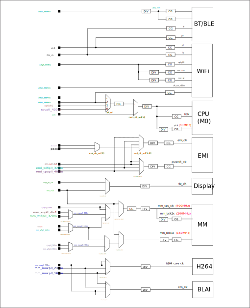

============
Reset and Clock
============
Overview
========
The clock sources in the chip include XTAL, PLL, and RC. They are sent to each module along with frequency division configuration.

Reset Management
===========
.. table:: Software reset function table 1 

    +------------+--------------------------------------+-------------------+--------------------------------+--------------------+-------------+
    | BL808      | RST_PIN /Watch Dog / PDS             | SW.Reset          | System Reset (swrst_cfg2[2])/  | PDS /CPU           | PDS         |
    +            +                                      +                   +                                +                    +             +
    |            | Software Power On                    | (swrst_cfg1)      | PDS                            |                    |             |
    +            +                                      +                   +                                +                    +             +
    |            |  (swrst_cfg2[0])                     |                   |                                |                    |             |
    +============+======================================+===================+================================+====================+=============+
    | CPU(M0)    | ✔                                    |                   |                                | ✔                  |             |
    +------------+--------------------------------------+-------------------+--------------------------------+--------------------+-------------+
    | CPU(LP)    | ✔                                    |                   |                                |                    |             |
    +------------+--------------------------------------+-------------------+--------------------------------+--------------------+-------------+
    | bus        | ✔                                    |                   | ✔                              |                    |             |
    +------------+--------------------------------------+-------------------+--------------------------------+--------------------+-------------+
    | glb        | ✔                                    | swrst_s1[0]       |                                |                    |             |
    +------------+--------------------------------------+-------------------+--------------------------------+--------------------+-------------+
    | mix        | ✔                                    | swrst_s1[1]       |                                |                    | ✔           |
    +------------+--------------------------------------+-------------------+--------------------------------+--------------------+-------------+
    | gpip       | ✔                                    | swrst_s1[2]       | ✔                              |                    |             |
    +------------+--------------------------------------+-------------------+--------------------------------+--------------------+-------------+
    | sec_eng    | ✔                                    | swrst_s1[4]       | ✔                              |                    |             |
    +------------+--------------------------------------+-------------------+--------------------------------+--------------------+-------------+
    | TZ         | ✔                                    |                   | ✔                              |                    |             |
    +------------+--------------------------------------+-------------------+--------------------------------+--------------------+-------------+
    | efuse      | ✔                                    |                   |                                |                    |             |
    +------------+--------------------------------------+-------------------+--------------------------------+--------------------+-------------+
    | dma        | ✔                                    | swrst_s1[12]      | ✔                              |                    |             |
    +------------+--------------------------------------+-------------------+--------------------------------+--------------------+-------------+
    | psram      | ✔                                    | swrst_s1_ext[2]   | ✔                              |                    |             |
    +------------+--------------------------------------+-------------------+--------------------------------+--------------------+-------------+
    | usb        | ✔                                    | swrst_s1_ext[3]   | ✔                              |                    |             |
    +------------+--------------------------------------+-------------------+--------------------------------+--------------------+-------------+
    | emac       | ✔                                    | swrst_s1_ext[3]   | ✔                              |                    |             |
    +------------+--------------------------------------+-------------------+--------------------------------+--------------------+-------------+
    | audio      | ✔                                    | swrst_s1_ext[5]   | ✔                              |                    |             |
    +------------+--------------------------------------+-------------------+--------------------------------+--------------------+-------------+
    | dma2       | ✔                                    | swrst_s1_ext[8]   | ✔                              |                    |             |
    +------------+--------------------------------------+-------------------+--------------------------------+--------------------+-------------+
    | pds        |                                      | swrst_s1[14]      |                                |                    |             |
    +------------+--------------------------------------+-------------------+--------------------------------+--------------------+-------------+
    | uart0      | ✔                                    | swrst_s1a[0]      | ✔                              |                    |             |
    +------------+--------------------------------------+-------------------+--------------------------------+--------------------+-------------+
    | uart1      | ✔                                    | swrst_s1a[1]      | ✔                              |                    |             |
    +------------+--------------------------------------+-------------------+--------------------------------+--------------------+-------------+
    | spi        | ✔                                    | swrst_s1a[2]      | ✔                              |                    |             |
    +------------+--------------------------------------+-------------------+--------------------------------+--------------------+-------------+
    | i2c        | ✔                                    | swrst_s1a[3]      | ✔                              |                    |             |
    +------------+--------------------------------------+-------------------+--------------------------------+--------------------+-------------+
    | pwm        | ✔                                    | swrst_s1a[4]      | ✔                              |                    |             |
    +------------+--------------------------------------+-------------------+--------------------------------+--------------------+-------------+
    | timer      | ✔                                    | swrst_s1a[5]      | ✔                              |                    |             |
    +------------+--------------------------------------+-------------------+--------------------------------+--------------------+-------------+
    | irr        | ✔                                    | swrst_s1a[6]      | ✔                              |                    |             |
    +------------+--------------------------------------+-------------------+--------------------------------+--------------------+-------------+
    | uart2      | ✔                                    | swrst_s1a[10]     | ✔                              |                    |             |
    +------------+--------------------------------------+-------------------+--------------------------------+--------------------+-------------+
    | i2s        | ✔                                    | swrst_s1a[11]     | ✔                              |                    |             |
    +------------+--------------------------------------+-------------------+--------------------------------+--------------------+-------------+
    | pdm        | ✔                                    | swrst_s1a[12]     | ✔                              |                    |             |
    +------------+--------------------------------------+-------------------+--------------------------------+--------------------+-------------+
    | wifi       | ✔                                    | swrst_s2[0]       |                                |                    | ✔           |
    +------------+--------------------------------------+-------------------+--------------------------------+--------------------+-------------+
    | ble        | ✔                                    | swrst_s3[0][2]    |                                |                    | ✔           |
    +------------+--------------------------------------+-------------------+--------------------------------+--------------------+-------------+

.. table:: Software reset function table 2 

    +------------+------------------------------------+-------------------+------------------------+--------------------+
    | BL808_MM   |  Watch Dog /                       | SW.Reset          | System Reset           | MMCPU0             |
    +            +                                    +                   +                        +                    +
    |            | Software Power On (swrst_cfg2[0])  | (swrst_cfg1)      | (swrst_cfg2[2])        |                    |
    +============+====================================+===================+========================+====================+
    | CPU(D0)    | ✔                                  |                   |                        | ✔                  |
    +------------+------------------------------------+-------------------+------------------------+--------------------+
    | bus        | ✔                                  |                   | ✔                      |                    |
    +------------+------------------------------------+-------------------+------------------------+--------------------+
    | mm_misc    | ✔                                  | swrst_mm_misc     | ✔                      |                    |
    +------------+------------------------------------+-------------------+------------------------+--------------------+
    | mm_dma     | ✔                                  | swrst_dma         | ✔                      |                    |
    +------------+------------------------------------+-------------------+------------------------+--------------------+
    | mm_2ddma   | ✔                                  | swrst_dma2d       | ✔                      |                    |
    +------------+------------------------------------+-------------------+------------------------+--------------------+
    | mm_uart    | ✔                                  | swrst_uart0       | ✔                      |                    |
    +------------+------------------------------------+-------------------+------------------------+--------------------+
    | mm_i2c     | ✔                                  | swrst_i2c0        | ✔                      |                    |
    +------------+------------------------------------+-------------------+------------------------+--------------------+
    | mm_ipc     | ✔                                  | swrst_i2c1        | ✔                      |                    |
    +------------+------------------------------------+-------------------+------------------------+--------------------+
    | mm_timer   | ✔                                  | swrst_timer       | ✔                      |                    | 
    +------------+------------------------------------+-------------------+------------------------+--------------------+
    | uhs_ctrl   | ✔                                  | swrst_pUHS        | ✔                      |                    |
    +------------+------------------------------------+-------------------+------------------------+--------------------+
    | disp_tsrc  | ✔                                  | swrst_dp_tsrc     | ✔                      |                    |
    +------------+------------------------------------+-------------------+------------------------+--------------------+
    | nr3d_ctrl  | ✔                                  | swrst_nr3d_ctrl   | ✔                      |                    |
    +------------+------------------------------------+-------------------+------------------------+--------------------+
    | dvp2busA   | ✔                                  | swrst_dvp2busA    | ✔                      |                    |
    +------------+------------------------------------+-------------------+------------------------+--------------------+
    | dvp2busB   | ✔                                  | swrst_dvp2busB    | ✔                      |                    |
    +------------+------------------------------------+-------------------+------------------------+--------------------+
    | dvp2busC   | ✔                                  | swrst_dvp2busC    | ✔                      |                    |
    +------------+------------------------------------+-------------------+------------------------+--------------------+
    | dvp2busD   | ✔                                  | swrst_dvp2busD    | ✔                      |                    |
    +------------+------------------------------------+-------------------+------------------------+--------------------+
    | dvp2busE   | ✔                                  | swrst_dvp2busE    | ✔                      |                    |
    +------------+------------------------------------+-------------------+------------------------+--------------------+
    | dvp2busF   | ✔                                  | swrst_dvp2busF    | ✔                      |                    |
    +------------+------------------------------------+-------------------+------------------------+--------------------+
    | dvp2busG   | ✔                                  | swrst_dvp2busG    | ✔                      |                    |
    +------------+------------------------------------+-------------------+------------------------+--------------------+
    | dvp2busH   | ✔                                  | swrst_dvp2busH    | ✔                      |                    |
    +------------+------------------------------------+-------------------+------------------------+--------------------+
    | jdec       | ✔                                  | swrst_mjpeg_dec   | ✔                      |                    |
    +------------+------------------------------------+-------------------+------------------------+--------------------+
    | blai       | ✔                                  | swrst_cnn         | ✔                      |                    |
    +------------+------------------------------------+-------------------+------------------------+--------------------+

Clock Source
===========

Types:

- XTAL: external crystal oscillator clock, with optional frequencies of 24, 32, 38.4, and 40 MHz depending on system requirements
- XTAL32K: external crystal oscillator clock, with frequency of 32 kHz
- RC32K: RC oscillator clock with frequency of 32 kHz and calibration
- RC32M: RC oscillator clock with frequency of 32 MHz and calibration
- PLL: multiple PLL modules, which can generate several clocks with different frequencies to meet various application scenarios

The clock control unit distributes the clocks from the oscillator to the core and peripheral devices. You can choose the system clock source, dynamic frequency divider, and clock configuration, and use the 32 kHz clock in sleep to achieve low-power clock management.

Peripheral clocks include Flash, UART, I2C, SPI, PWM, IR-remote, ADC, and DAC.

.. figure:: ../../picture/SystemClock.svg
   :align: center

   System Clock Architecture
   

   Module Clock Architecture
   
.. figure:: ../../picture/PeripheralClock.svg
   :align: center
   :scale: 95%

   Peripheral Clock Architecture

