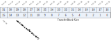
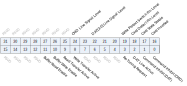

Register description
==========================

+----------------------------------------------------+-------------+
| Name                                               | Description |
+----------------------------------------------------+-------------+
| `SDMA_System_Address_Argument_2`_                  |             |
+----------------------------------------------------+-------------+
| `Block_Size`_                                      |             |
+----------------------------------------------------+-------------+
| `Block_Count`_                                     |             |
+----------------------------------------------------+-------------+
| `Argument_1`_                                      |             |
+----------------------------------------------------+-------------+
| `Transfer_Mode`_                                   |             |
+----------------------------------------------------+-------------+
| `Command`_                                         |             |
+----------------------------------------------------+-------------+
| `Response_1`_                                      |             |
+----------------------------------------------------+-------------+
| `Response_2`_                                      |             |
+----------------------------------------------------+-------------+
| `Response_3`_                                      |             |
+----------------------------------------------------+-------------+
| `Response_4`_                                      |             |
+----------------------------------------------------+-------------+
| `Buffer_Data_Port`_                                |             |
+----------------------------------------------------+-------------+
| `Present_State`_                                   |             |
+----------------------------------------------------+-------------+
| `Host_Control_1`_                                  |             |
+----------------------------------------------------+-------------+
| `Power_Control`_                                   |             |
+----------------------------------------------------+-------------+
| `Block_Gap_Control`_                               |             |
+----------------------------------------------------+-------------+
| `Wakeup_Control`_                                  |             |
+----------------------------------------------------+-------------+
| `Clock_Control`_                                   |             |
+----------------------------------------------------+-------------+
| `Timeout_Control`_                                 |             |
+----------------------------------------------------+-------------+
| `Software_Reset`_                                  |             |
+----------------------------------------------------+-------------+
| `Normal_Interrupt_Status`_                         |             |
+----------------------------------------------------+-------------+
| `Error_Interrupt_Status`_                          |             |
+----------------------------------------------------+-------------+
| `Normal_Interrupt_Status_Enable`_                  |             |
+----------------------------------------------------+-------------+
| `Error_Interrupt_Status_Enable`_                   |             |
+----------------------------------------------------+-------------+
| `Normal_Interrupt_Signal_Enable`_                  |             |
+----------------------------------------------------+-------------+
| `Error_Interrupt_Signal_Enable`_                   |             |
+----------------------------------------------------+-------------+
| `Auto_CMD_Error_Status`_                           |             |
+----------------------------------------------------+-------------+
| `Host_Control_2`_                                  |             |
+----------------------------------------------------+-------------+
| `Capabilities_1`_                                  |             |
+----------------------------------------------------+-------------+
| `Capabilities_2`_                                  |             |
+----------------------------------------------------+-------------+
| `Maximum_Current_Capabilities`_                    |             |
+----------------------------------------------------+-------------+
| `Force_Event_Register_for_Auto_CMD_Error_Status`_  |             |
+----------------------------------------------------+-------------+
| `Force_Event_Register_for_Error_Interrupt_Status`_ |             |
+----------------------------------------------------+-------------+
| `ADMA_Error_Status`_                               |             |
+----------------------------------------------------+-------------+
| `Shared_Bus_Control`_                              |             |
+----------------------------------------------------+-------------+
| `Slot_Interrupt_Status`_                           |             |
+----------------------------------------------------+-------------+
| `Host_Controller_Version`_                         |             |
+----------------------------------------------------+-------------+

SDMA_System_Address_Argument_2
--------------------------------
 
**Address：**  0x20060000
 

.. table::
    :widths: 10, 15,10,10,55
    :width: 100%
    :align: center
     
    +----------+------------------------------+--------+-------------+------------------------------------------------------------------------------------------------------------------------------------------------------------------------------------------------------------------------------------------------------------------------------------------------------------------------------------------------------------------------------------------------------------------------------------------------------------------------------------------------------------------------------------------------------------------------------------------------------------------------------------------------------------------------------------------------------------------------------+
    | Bit      | Name                         |Type    | Reset       | Description                                                                                                                                                                                                                                                                                                                                                                                                                                                                                                                                                                                                                                                                                                                  |
    +==========+==============================+========+=============+==============================================================================================================================================================================================================================================================================================================================================================================================================================================================================================================================================================================================================================================================================================================================+
    | 31:0     | SDMASystem                   | r/w    | 32'd0       | SDMA System Address / Argument 2                                                                                                                                                                                                                                                                                                                                                                                                                                                                                                                                                                                                                                                                                             |
    +          +                              +        +             +                                                                                                                                                                                                                                                                                                                                                                                                                                                                                                                                                                                                                                                                                                                              +
    |          |                              |        |             | This register contains the physical system memory address used for DMA transfers                                                                                                                                                                                                                                                                                                                                                                                                                                                                                                                                                                                                                                             |
    +          +                              +        +             +                                                                                                                                                                                                                                                                                                                                                                                                                                                                                                                                                                                                                                                                                                                              +
    |          |                              |        |             | or the second argument for the Auto CMD23.                                                                                                                                                                                                                                                                                                                                                                                                                                                                                                                                                                                                                                                                                   |
    +          +                              +        +             +                                                                                                                                                                                                                                                                                                                                                                                                                                                                                                                                                                                                                                                                                                                              +
    |          |                              |        |             | (1) SDMA System Address                                                                                                                                                                                                                                                                                                                                                                                                                                                                                                                                                                                                                                                                                                      |
    +          +                              +        +             +                                                                                                                                                                                                                                                                                                                                                                                                                                                                                                                                                                                                                                                                                                                              +
    |          |                              |        |             | This register contains the system memory address for a SDMA transfer. When                                                                                                                                                                                                                                                                                                                                                                                                                                                                                                                                                                                                                                                   |
    +          +                              +        +             +                                                                                                                                                                                                                                                                                                                                                                                                                                                                                                                                                                                                                                                                                                                              +
    |          |                              |        |             | the Host Controller stops a SDMA transfer, this register shall point to the system                                                                                                                                                                                                                                                                                                                                                                                                                                                                                                                                                                                                                                           |
    +          +                              +        +             +                                                                                                                                                                                                                                                                                                                                                                                                                                                                                                                                                                                                                                                                                                                              +
    |          |                              |        |             | address of the next contiguous data position. It can be accessed only if no                                                                                                                                                                                                                                                                                                                                                                                                                                                                                                                                                                                                                                                  |
    +          +                              +        +             +                                                                                                                                                                                                                                                                                                                                                                                                                                                                                                                                                                                                                                                                                                                              +
    |          |                              |        |             | transaction is executing (i.e., after a transaction has stopped). Read operations                                                                                                                                                                                                                                                                                                                                                                                                                                                                                                                                                                                                                                            |
    +          +                              +        +             +                                                                                                                                                                                                                                                                                                                                                                                                                                                                                                                                                                                                                                                                                                                              +
    |          |                              |        |             | during transfers may return an invalid value.                                                                                                                                                                                                                                                                                                                                                                                                                                                                                                                                                                                                                                                                                |
    +          +                              +        +             +                                                                                                                                                                                                                                                                                                                                                                                                                                                                                                                                                                                                                                                                                                                              +
    |          |                              |        |             | (2) Argument 2                                                                                                                                                                                                                                                                                                                                                                                                                                                                                                                                                                                                                                                                                                               |
    +          +                              +        +             +                                                                                                                                                                                                                                                                                                                                                                                                                                                                                                                                                                                                                                                                                                                              +
    |          |                              |        |             | This register is used with the Auto CMD23 to set a 32-bit block count value to                                                                                                                                                                                                                                                                                                                                                                                                                                                                                                                                                                                                                                               |
    +          +                              +        +             +                                                                                                                                                                                                                                                                                                                                                                                                                                                                                                                                                                                                                                                                                                                              +
    |          |                              |        |             | the argument of the CMD23 while executing Auto CMD23.                                                                                                                                                                                                                                                                                                                                                                                                                                                                                                                                                                                                                                                                        |
    +----------+------------------------------+--------+-------------+------------------------------------------------------------------------------------------------------------------------------------------------------------------------------------------------------------------------------------------------------------------------------------------------------------------------------------------------------------------------------------------------------------------------------------------------------------------------------------------------------------------------------------------------------------------------------------------------------------------------------------------------------------------------------------------------------------------------------+

Block_Size
------------
 
**Address：**  0x20060004
 

.. table::
    :widths: 10, 15,10,10,55
    :width: 100%
    :align: center
     
    +----------+------------------------------+--------+-------------+---------------------------------------------------------------------------------------------------------------------------------------------------------------------------------------------------------------------------------------------------------------------------------------------------------------------------------------------------------------------------------------------------------------------------------------------------------------------------------------------------------------------------------------------------------------------------------------------------------------------------------------------------------------------------------------------------------------------------------------------------------------------------------------------------------------------------------------------------------------------------------------------------------------------------------------------------------------------------------------------------------------------------------------------------------------------------------------------------------------------------------------------------------------------------------------------------------------------------------------------------------------------------------+
    | Bit      | Name                         |Type    | Reset       | Description                                                                                                                                                                                                                                                                                                                                                                                                                                                                                                                                                                                                                                                                                                                                                                                                                                                                                                                                                                                                                                                                                                                                                                                                                                                                     |
    +==========+==============================+========+=============+=================================================================================================================================================================================================================================================================================================================================================================================================================================================================================================================================================================================================================================================================================================================================================================================================================================================================================================================================================================================================================================================================================================================================================================================================================================================================================+
    | 31:15    | RSVD                         |        |             |                                                                                                                                                                                                                                                                                                                                                                                                                                                                                                                                                                                                                                                                                                                                                                                                                                                                                                                                                                                                                                                                                                                                                                                                                                                                                 |
    +----------+------------------------------+--------+-------------+---------------------------------------------------------------------------------------------------------------------------------------------------------------------------------------------------------------------------------------------------------------------------------------------------------------------------------------------------------------------------------------------------------------------------------------------------------------------------------------------------------------------------------------------------------------------------------------------------------------------------------------------------------------------------------------------------------------------------------------------------------------------------------------------------------------------------------------------------------------------------------------------------------------------------------------------------------------------------------------------------------------------------------------------------------------------------------------------------------------------------------------------------------------------------------------------------------------------------------------------------------------------------------+
    | 14:12    | HostSDMA                     | r/w    | 3'd0        | Host SDMA Buffer Boundary                                                                                                                                                                                                                                                                                                                                                                                                                                                                                                                                                                                                                                                                                                                                                                                                                                                                                                                                                                                                                                                                                                                                                                                                                                                       |
    +          +                              +        +             +                                                                                                                                                                                                                                                                                                                                                                                                                                                                                                                                                                                                                                                                                                                                                                                                                                                                                                                                                                                                                                                                                                                                                                                                                                                                                 +
    |          |                              |        |             | The large contiguous memory space may not be available in the virtual memory                                                                                                                                                                                                                                                                                                                                                                                                                                                                                                                                                                                                                                                                                                                                                                                                                                                                                                                                                                                                                                                                                                                                                                                                    |
    +          +                              +        +             +                                                                                                                                                                                                                                                                                                                                                                                                                                                                                                                                                                                                                                                                                                                                                                                                                                                                                                                                                                                                                                                                                                                                                                                                                                                                                 +
    |          |                              |        |             | system. To perform long SDMA transfer, SDMA System Address register shall be                                                                                                                                                                                                                                                                                                                                                                                                                                                                                                                                                                                                                                                                                                                                                                                                                                                                                                                                                                                                                                                                                                                                                                                                    |
    +          +                              +        +             +                                                                                                                                                                                                                                                                                                                                                                                                                                                                                                                                                                                                                                                                                                                                                                                                                                                                                                                                                                                                                                                                                                                                                                                                                                                                                 +
    |          |                              |        |             | updated at every system memory boundary during SDMA transfer.                                                                                                                                                                                                                                                                                                                                                                                                                                                                                                                                                                                                                                                                                                                                                                                                                                                                                                                                                                                                                                                                                                                                                                                                                   |
    +          +                              +        +             +                                                                                                                                                                                                                                                                                                                                                                                                                                                                                                                                                                                                                                                                                                                                                                                                                                                                                                                                                                                                                                                                                                                                                                                                                                                                                 +
    |          |                              |        |             | These bits specify the size of contiguous buffer in the system memory. The                                                                                                                                                                                                                                                                                                                                                                                                                                                                                                                                                                                                                                                                                                                                                                                                                                                                                                                                                                                                                                                                                                                                                                                                      |
    +          +                              +        +             +                                                                                                                                                                                                                                                                                                                                                                                                                                                                                                                                                                                                                                                                                                                                                                                                                                                                                                                                                                                                                                                                                                                                                                                                                                                                                 +
    |          |                              |        |             | SDMA transfer shall wait at the every boundary specified by these fields and the                                                                                                                                                                                                                                                                                                                                                                                                                                                                                                                                                                                                                                                                                                                                                                                                                                                                                                                                                                                                                                                                                                                                                                                                |
    +          +                              +        +             +                                                                                                                                                                                                                                                                                                                                                                                                                                                                                                                                                                                                                                                                                                                                                                                                                                                                                                                                                                                                                                                                                                                                                                                                                                                                                 +
    |          |                              |        |             | Host Controller generates the DMA Interrupt to request the Host Driver to                                                                                                                                                                                                                                                                                                                                                                                                                                                                                                                                                                                                                                                                                                                                                                                                                                                                                                                                                                                                                                                                                                                                                                                                       |
    +          +                              +        +             +                                                                                                                                                                                                                                                                                                                                                                                                                                                                                                                                                                                                                                                                                                                                                                                                                                                                                                                                                                                                                                                                                                                                                                                                                                                                                 +
    |          |                              |        |             | update the SDMA System Address register. At the end of transfer, the Host                                                                                                                                                                                                                                                                                                                                                                                                                                                                                                                                                                                                                                                                                                                                                                                                                                                                                                                                                                                                                                                                                                                                                                                                       |
    +          +                              +        +             +                                                                                                                                                                                                                                                                                                                                                                                                                                                                                                                                                                                                                                                                                                                                                                                                                                                                                                                                                                                                                                                                                                                                                                                                                                                                                 +
    |          |                              |        |             | Controller may issue or may not issue DMA Interrupt. In particular, DMA                                                                                                                                                                                                                                                                                                                                                                                                                                                                                                                                                                                                                                                                                                                                                                                                                                                                                                                                                                                                                                                                                                                                                                                                         |
    +          +                              +        +             +                                                                                                                                                                                                                                                                                                                                                                                                                                                                                                                                                                                                                                                                                                                                                                                                                                                                                                                                                                                                                                                                                                                                                                                                                                                                                 +
    |          |                              |        |             | Interrupt shall not be issued after Transfer Complete Interrupt is issued.                                                                                                                                                                                                                                                                                                                                                                                                                                                                                                                                                                                                                                                                                                                                                                                                                                                                                                                                                                                                                                                                                                                                                                                                      |
    +          +                              +        +             +                                                                                                                                                                                                                                                                                                                                                                                                                                                                                                                                                                                                                                                                                                                                                                                                                                                                                                                                                                                                                                                                                                                                                                                                                                                                                 +
    |          |                              |        |             | In case of this register is set to 0 (buffer size = 4K bytes), lower 12-bit of byte                                                                                                                                                                                                                                                                                                                                                                                                                                                                                                                                                                                                                                                                                                                                                                                                                                                                                                                                                                                                                                                                                                                                                                                             |
    +          +                              +        +             +                                                                                                                                                                                                                                                                                                                                                                                                                                                                                                                                                                                                                                                                                                                                                                                                                                                                                                                                                                                                                                                                                                                                                                                                                                                                                 +
    |          |                              |        |             | address points data in the contiguous buffer and the upper 20-bit points the                                                                                                                                                                                                                                                                                                                                                                                                                                                                                                                                                                                                                                                                                                                                                                                                                                                                                                                                                                                                                                                                                                                                                                                                    |
    +          +                              +        +             +                                                                                                                                                                                                                                                                                                                                                                                                                                                                                                                                                                                                                                                                                                                                                                                                                                                                                                                                                                                                                                                                                                                                                                                                                                                                                 +
    |          |                              |        |             | location of the buffer in the system memory. The SDMA transfer stops when the                                                                                                                                                                                                                                                                                                                                                                                                                                                                                                                                                                                                                                                                                                                                                                                                                                                                                                                                                                                                                                                                                                                                                                                                   |
    +          +                              +        +             +                                                                                                                                                                                                                                                                                                                                                                                                                                                                                                                                                                                                                                                                                                                                                                                                                                                                                                                                                                                                                                                                                                                                                                                                                                                                                 +
    |          |                              |        |             | Host Controller detects carry out of the address from bit 11 to 12.                                                                                                                                                                                                                                                                                                                                                                                                                                                                                                                                                                                                                                                                                                                                                                                                                                                                                                                                                                                                                                                                                                                                                                                                             |
    +          +                              +        +             +                                                                                                                                                                                                                                                                                                                                                                                                                                                                                                                                                                                                                                                                                                                                                                                                                                                                                                                                                                                                                                                                                                                                                                                                                                                                                 +
    |          |                              |        |             | These bits shall be supported when the SDMA Support in the Capabilities                                                                                                                                                                                                                                                                                                                                                                                                                                                                                                                                                                                                                                                                                                                                                                                                                                                                                                                                                                                                                                                                                                                                                                                                         |
    +          +                              +        +             +                                                                                                                                                                                                                                                                                                                                                                                                                                                                                                                                                                                                                                                                                                                                                                                                                                                                                                                                                                                                                                                                                                                                                                                                                                                                                 +
    |          |                              |        |             | register is set to 1 and this function is active when the DMA Enable in the                                                                                                                                                                                                                                                                                                                                                                                                                                                                                                                                                                                                                                                                                                                                                                                                                                                                                                                                                                                                                                                                                                                                                                                                     |
    +          +                              +        +             +                                                                                                                                                                                                                                                                                                                                                                                                                                                                                                                                                                                                                                                                                                                                                                                                                                                                                                                                                                                                                                                                                                                                                                                                                                                                                 +
    |          |                              |        |             | Transfer Mode register is set to 1. ADMA does not use this register.                                                                                                                                                                                                                                                                                                                                                                                                                                                                                                                                                                                                                                                                                                                                                                                                                                                                                                                                                                                                                                                                                                                                                                                                            |
    +----------+------------------------------+--------+-------------+---------------------------------------------------------------------------------------------------------------------------------------------------------------------------------------------------------------------------------------------------------------------------------------------------------------------------------------------------------------------------------------------------------------------------------------------------------------------------------------------------------------------------------------------------------------------------------------------------------------------------------------------------------------------------------------------------------------------------------------------------------------------------------------------------------------------------------------------------------------------------------------------------------------------------------------------------------------------------------------------------------------------------------------------------------------------------------------------------------------------------------------------------------------------------------------------------------------------------------------------------------------------------------+
    | 11:0     | TransferBlock                | r/w    | 12'b0       | Transfer Block Size                                                                                                                                                                                                                                                                                                                                                                                                                                                                                                                                                                                                                                                                                                                                                                                                                                                                                                                                                                                                                                                                                                                                                                                                                                                             |
    +          +                              +        +             +                                                                                                                                                                                                                                                                                                                                                                                                                                                                                                                                                                                                                                                                                                                                                                                                                                                                                                                                                                                                                                                                                                                                                                                                                                                                                 +
    |          |                              |        |             | This register specifies the block size of data transfers for CMD17, CMD18,                                                                                                                                                                                                                                                                                                                                                                                                                                                                                                                                                                                                                                                                                                                                                                                                                                                                                                                                                                                                                                                                                                                                                                                                      |
    +          +                              +        +             +                                                                                                                                                                                                                                                                                                                                                                                                                                                                                                                                                                                                                                                                                                                                                                                                                                                                                                                                                                                                                                                                                                                                                                                                                                                                                 +
    |          |                              |        |             | CMD24, CMD25, and CMD53. Values ranging from 1 up to the maximum buffer                                                                                                                                                                                                                                                                                                                                                                                                                                                                                                                                                                                                                                                                                                                                                                                                                                                                                                                                                                                                                                                                                                                                                                                                         |
    +          +                              +        +             +                                                                                                                                                                                                                                                                                                                                                                                                                                                                                                                                                                                                                                                                                                                                                                                                                                                                                                                                                                                                                                                                                                                                                                                                                                                                                 +
    |          |                              |        |             | size can be set. In case of memory, it shall be set up to 512 bytes (Refer to                                                                                                                                                                                                                                                                                                                                                                                                                                                                                                                                                                                                                                                                                                                                                                                                                                                                                                                                                                                                                                                                                                                                                                                                   |
    +          +                              +        +             +                                                                                                                                                                                                                                                                                                                                                                                                                                                                                                                                                                                                                                                                                                                                                                                                                                                                                                                                                                                                                                                                                                                                                                                                                                                                                 +
    |          |                              |        |             | Implementation Note in Section 1.7.2). It can be accessed only if no transaction                                                                                                                                                                                                                                                                                                                                                                                                                                                                                                                                                                                                                                                                                                                                                                                                                                                                                                                                                                                                                                                                                                                                                                                                |
    +          +                              +        +             +                                                                                                                                                                                                                                                                                                                                                                                                                                                                                                                                                                                                                                                                                                                                                                                                                                                                                                                                                                                                                                                                                                                                                                                                                                                                                 +
    |          |                              |        |             | is executing (i.e., after a transaction has stopped). Read operations during                                                                                                                                                                                                                                                                                                                                                                                                                                                                                                                                                                                                                                                                                                                                                                                                                                                                                                                                                                                                                                                                                                                                                                                                    |
    +          +                              +        +             +                                                                                                                                                                                                                                                                                                                                                                                                                                                                                                                                                                                                                                                                                                                                                                                                                                                                                                                                                                                                                                                                                                                                                                                                                                                                                 +
    |          |                              |        |             | transfers may return an invalid value, and write operations shall be ignored.                                                                                                                                                                                                                                                                                                                                                                                                                                                                                                                                                                                                                                                                                                                                                                                                                                                                                                                                                                                                                                                                                                                                                                                                   |
    +----------+------------------------------+--------+-------------+---------------------------------------------------------------------------------------------------------------------------------------------------------------------------------------------------------------------------------------------------------------------------------------------------------------------------------------------------------------------------------------------------------------------------------------------------------------------------------------------------------------------------------------------------------------------------------------------------------------------------------------------------------------------------------------------------------------------------------------------------------------------------------------------------------------------------------------------------------------------------------------------------------------------------------------------------------------------------------------------------------------------------------------------------------------------------------------------------------------------------------------------------------------------------------------------------------------------------------------------------------------------------------+

Block_Count
-------------
 
**Address：**  0x20060006
 
.. figure:: ../../picture/SDH_Block_Count.svg
   :align: center

.. table::
    :widths: 10, 15,10,10,55
    :width: 100%
    :align: center
     
    +----------+------------------------------+--------+-------------+--------------------------------------------------------------------------------------------------------------------------------------------------------------------------------------------------------------------------------------------------------------------------------------------------------------------------------------------------------------------------------------------------------------------------------------------------------------------------------------------------------------------------------------------------------------------------------------------------------------------------------------------------------------------------------------------------------------------------------------------------------------------------------------------------------------------------------------------------------------------------------------------------------------------------------------------+
    | Bit      | Name                         |Type    | Reset       | Description                                                                                                                                                                                                                                                                                                                                                                                                                                                                                                                                                                                                                                                                                                                                                                                                                                                                                                                                |
    +==========+==============================+========+=============+============================================================================================================================================================================================================================================================================================================================================================================================================================================================================================================================================================================================================================================================================================================================================================================================================================================================================================================================================+
    | 31:16    | RSVD                         |        |             |                                                                                                                                                                                                                                                                                                                                                                                                                                                                                                                                                                                                                                                                                                                                                                                                                                                                                                                                            |
    +----------+------------------------------+--------+-------------+--------------------------------------------------------------------------------------------------------------------------------------------------------------------------------------------------------------------------------------------------------------------------------------------------------------------------------------------------------------------------------------------------------------------------------------------------------------------------------------------------------------------------------------------------------------------------------------------------------------------------------------------------------------------------------------------------------------------------------------------------------------------------------------------------------------------------------------------------------------------------------------------------------------------------------------------+
    | 15:0     | BlocksCount                  | r/w    | 16'd0       | Blocks Count For Current Transfer                                                                                                                                                                                                                                                                                                                                                                                                                                                                                                                                                                                                                                                                                                                                                                                                                                                                                                          |
    +          +                              +        +             +                                                                                                                                                                                                                                                                                                                                                                                                                                                                                                                                                                                                                                                                                                                                                                                                                                                                                                                                            +
    |          |                              |        |             | This register is enabled when Block Count Enable in the Transfer Mode register is                                                                                                                                                                                                                                                                                                                                                                                                                                                                                                                                                                                                                                                                                                                                                                                                                                                          |
    +          +                              +        +             +                                                                                                                                                                                                                                                                                                                                                                                                                                                                                                                                                                                                                                                                                                                                                                                                                                                                                                                                            +
    |          |                              |        |             | set to 1 and is valid only for multiple block transfers. The Host Driver shall set this                                                                                                                                                                                                                                                                                                                                                                                                                                                                                                                                                                                                                                                                                                                                                                                                                                                    |
    +          +                              +        +             +                                                                                                                                                                                                                                                                                                                                                                                                                                                                                                                                                                                                                                                                                                                                                                                                                                                                                                                                            +
    |          |                              |        |             | register to a value between 1 and the maximum block count. The Host Controller                                                                                                                                                                                                                                                                                                                                                                                                                                                                                                                                                                                                                                                                                                                                                                                                                                                             |
    +          +                              +        +             +                                                                                                                                                                                                                                                                                                                                                                                                                                                                                                                                                                                                                                                                                                                                                                                                                                                                                                                                            +
    |          |                              |        |             | decrements the block count after each block transfer and stops when the count                                                                                                                                                                                                                                                                                                                                                                                                                                                                                                                                                                                                                                                                                                                                                                                                                                                              |
    +          +                              +        +             +                                                                                                                                                                                                                                                                                                                                                                                                                                                                                                                                                                                                                                                                                                                                                                                                                                                                                                                                            +
    |          |                              |        |             | reaches zero. Setting the block count to 0 results in no data blocks is transferred.                                                                                                                                                                                                                                                                                                                                                                                                                                                                                                                                                                                                                                                                                                                                                                                                                                                       |
    +          +                              +        +             +                                                                                                                                                                                                                                                                                                                                                                                                                                                                                                                                                                                                                                                                                                                                                                                                                                                                                                                                            +
    |          |                              |        |             | This register should be accessed only when no transaction is executing (i.e., after                                                                                                                                                                                                                                                                                                                                                                                                                                                                                                                                                                                                                                                                                                                                                                                                                                                        |
    +          +                              +        +             +                                                                                                                                                                                                                                                                                                                                                                                                                                                                                                                                                                                                                                                                                                                                                                                                                                                                                                                                            +
    |          |                              |        |             | transactions are stopped). During data transfer, read operations on this register may                                                                                                                                                                                                                                                                                                                                                                                                                                                                                                                                                                                                                                                                                                                                                                                                                                                      |
    +          +                              +        +             +                                                                                                                                                                                                                                                                                                                                                                                                                                                                                                                                                                                                                                                                                                                                                                                                                                                                                                                                            +
    |          |                              |        |             | return an invalid value and write operations are ignored.                                                                                                                                                                                                                                                                                                                                                                                                                                                                                                                                                                                                                                                                                                                                                                                                                                                                                  |
    +          +                              +        +             +                                                                                                                                                                                                                                                                                                                                                                                                                                                                                                                                                                                                                                                                                                                                                                                                                                                                                                                                            +
    |          |                              |        |             | When a suspend command is completed, the number of blocks yet to be transferred                                                                                                                                                                                                                                                                                                                                                                                                                                                                                                                                                                                                                                                                                                                                                                                                                                                            |
    +          +                              +        +             +                                                                                                                                                                                                                                                                                                                                                                                                                                                                                                                                                                                                                                                                                                                                                                                                                                                                                                                                            +
    |          |                              |        |             | can be determined by reading this register. Before issuing a resume command, the                                                                                                                                                                                                                                                                                                                                                                                                                                                                                                                                                                                                                                                                                                                                                                                                                                                           |
    +          +                              +        +             +                                                                                                                                                                                                                                                                                                                                                                                                                                                                                                                                                                                                                                                                                                                                                                                                                                                                                                                                            +
    |          |                              |        |             | Host Driver shall restore the previously saved block count.                                                                                                                                                                                                                                                                                                                                                                                                                                                                                                                                                                                                                                                                                                                                                                                                                                                                                |
    +----------+------------------------------+--------+-------------+--------------------------------------------------------------------------------------------------------------------------------------------------------------------------------------------------------------------------------------------------------------------------------------------------------------------------------------------------------------------------------------------------------------------------------------------------------------------------------------------------------------------------------------------------------------------------------------------------------------------------------------------------------------------------------------------------------------------------------------------------------------------------------------------------------------------------------------------------------------------------------------------------------------------------------------------+

Argument_1
-------------
 
**Address：**  0x20060008
 

.. table::
    :widths: 10, 15,10,10,55
    :width: 100%
    :align: center
     
    +----------+------------------------------+--------+-------------+-----------------------------------------------------------------------------------------------------------------------------+
    | Bit      | Name                         |Type    | Reset       | Description                                                                                                                 |
    +==========+==============================+========+=============+=============================================================================================================================+
    | 31:0     | CommandArgument              | r/w    | 32'h0       | Command Argument 1                                                                                                          |
    +          +                              +        +             +                                                                                                                             +
    |          |                              |        |             | The SD command argument is specified as bit39-8 of Command-Format in the                                                    |
    +          +                              +        +             +                                                                                                                             +
    |          |                              |        |             | Physical Layer Specification.                                                                                               |
    +----------+------------------------------+--------+-------------+-----------------------------------------------------------------------------------------------------------------------------+

Transfer_Mode
---------------
 
**Address：**  0x2006000c
 
.. figure:: ../../picture/SDH_Transfer_Mode.svg
   :align: center

.. table::
    :widths: 10, 15,10,10,55
    :width: 100%
    :align: center
     
    +----------+------------------------------+--------+-------------+--------------------------------------------------------------------------------------------------------------------------------------------------------------------------------------------------------------------------------------------------------------------------------------------------------------------------------------------------------------------------------------------------------------------------------------------------------+
    | Bit      | Name                         |Type    | Reset       | Description                                                                                                                                                                                                                                                                                                                                                                                                                                            |
    +==========+==============================+========+=============+========================================================================================================================================================================================================================================================================================================================================================================================================================================================+
    | 31:6     | RSVD                         |        |             |                                                                                                                                                                                                                                                                                                                                                                                                                                                        |
    +----------+------------------------------+--------+-------------+--------------------------------------------------------------------------------------------------------------------------------------------------------------------------------------------------------------------------------------------------------------------------------------------------------------------------------------------------------------------------------------------------------------------------------------------------------+
    | 5        | Multi/                       | r/w    | 1'b0        | Multi / Single Block Select                                                                                                                                                                                                                                                                                                                                                                                                                            |
    +          +                              +        +             +                                                                                                                                                                                                                                                                                                                                                                                                                                                        +
    |          |                              |        |             | This bit is set when issuing multiple-block transfer commands using DAT line. For                                                                                                                                                                                                                                                                                                                                                                      |
    +          +                              +        +             +                                                                                                                                                                                                                                                                                                                                                                                                                                                        +
    |          |                              |        |             | any other commands, this bit shall be set to 0. If this bit is 0, it is not necessary to                                                                                                                                                                                                                                                                                                                                                               |
    +          +                              +        +             +                                                                                                                                                                                                                                                                                                                                                                                                                                                        +
    |          |                              |        |             | set the Block Count register. (Refer to Table 2-8)                                                                                                                                                                                                                                                                                                                                                                                                     |
    +----------+------------------------------+--------+-------------+--------------------------------------------------------------------------------------------------------------------------------------------------------------------------------------------------------------------------------------------------------------------------------------------------------------------------------------------------------------------------------------------------------------------------------------------------------+
    | 4        | DataTransfer                 | r/w    | 1'b0        | Data Transfer Direction Select                                                                                                                                                                                                                                                                                                                                                                                                                         |
    +          +                              +        +             +                                                                                                                                                                                                                                                                                                                                                                                                                                                        +
    |          |                              |        |             | This bit defines the direction of DAT line data transfers. The bit is set to 1 by the                                                                                                                                                                                                                                                                                                                                                                  |
    +          +                              +        +             +                                                                                                                                                                                                                                                                                                                                                                                                                                                        +
    |          |                              |        |             | Host Driver to transfer data from the SD card to the SD Host Controller and it is                                                                                                                                                                                                                                                                                                                                                                      |
    +          +                              +        +             +                                                                                                                                                                                                                                                                                                                                                                                                                                                        +
    |          |                              |        |             | set to 0 for all other commands.                                                                                                                                                                                                                                                                                                                                                                                                                       |
    +----------+------------------------------+--------+-------------+--------------------------------------------------------------------------------------------------------------------------------------------------------------------------------------------------------------------------------------------------------------------------------------------------------------------------------------------------------------------------------------------------------------------------------------------------------+
    | 3:2      | AutoCMD                      | r/w    | 2'd0        | Auto CMD Enable                                                                                                                                                                                                                                                                                                                                                                                                                                        |
    +          +                              +        +             +                                                                                                                                                                                                                                                                                                                                                                                                                                                        +
    |          |                              |        |             | This field determines use of auto command functions.                                                                                                                                                                                                                                                                                                                                                                                                   |
    +          +                              +        +             +                                                                                                                                                                                                                                                                                                                                                                                                                                                        +
    |          |                              |        |             | (1) Auto CMD12 Enable                                                                                                                                                                                                                                                                                                                                                                                                                                  |
    +          +                              +        +             +                                                                                                                                                                                                                                                                                                                                                                                                                                                        +
    |          |                              |        |             | (2) Auto CMD23 Enable                                                                                                                                                                                                                                                                                                                                                                                                                                  |
    +----------+------------------------------+--------+-------------+--------------------------------------------------------------------------------------------------------------------------------------------------------------------------------------------------------------------------------------------------------------------------------------------------------------------------------------------------------------------------------------------------------------------------------------------------------+
    | 1        | BlockCount                   | r/w    | 1'b0        | This bit is used to enable the Block Count register, which is only relevant for                                                                                                                                                                                                                                                                                                                                                                        |
    +          +                              +        +             +                                                                                                                                                                                                                                                                                                                                                                                                                                                        +
    |          |                              |        |             | multiple block transfers. When this bit is 0, the Block Count register is disabled,                                                                                                                                                                                                                                                                                                                                                                    |
    +          +                              +        +             +                                                                                                                                                                                                                                                                                                                                                                                                                                                        +
    |          |                              |        |             | which is useful in executing an infinite transfer.                                                                                                                                                                                                                                                                                                                                                                                                     |
    +          +                              +        +             +                                                                                                                                                                                                                                                                                                                                                                                                                                                        +
    |          |                              |        |             | If ADMA2 data transfer is more than 65535 blocks, this bit shall be set to 0. In this                                                                                                                                                                                                                                                                                                                                                                  |
    +          +                              +        +             +                                                                                                                                                                                                                                                                                                                                                                                                                                                        +
    |          |                              |        |             | case, data transfer length is designated by Descriptor Table.                                                                                                                                                                                                                                                                                                                                                                                          |
    +----------+------------------------------+--------+-------------+--------------------------------------------------------------------------------------------------------------------------------------------------------------------------------------------------------------------------------------------------------------------------------------------------------------------------------------------------------------------------------------------------------------------------------------------------------+
    | 0        | DMAEnable                    | r/w    | 1'b0        | This bit enables DMA functionality as described in section 1.4. DMA can be                                                                                                                                                                                                                                                                                                                                                                             |
    +          +                              +        +             +                                                                                                                                                                                                                                                                                                                                                                                                                                                        +
    |          |                              |        |             | enabled only if it is supported as indicated in the Capabilities register. One of the                                                                                                                                                                                                                                                                                                                                                                  |
    +          +                              +        +             +                                                                                                                                                                                                                                                                                                                                                                                                                                                        +
    |          |                              |        |             | DMA modes can be selected by DMA Select in the Host Control 1 register. If                                                                                                                                                                                                                                                                                                                                                                             |
    +          +                              +        +             +                                                                                                                                                                                                                                                                                                                                                                                                                                                        +
    |          |                              |        |             | DMA is not supported, this bit is meaningless and shall always read 0. If this bit is                                                                                                                                                                                                                                                                                                                                                                  |
    +          +                              +        +             +                                                                                                                                                                                                                                                                                                                                                                                                                                                        +
    |          |                              |        |             | set to 1, a DMA operation shall begin when the Host Driver writes to the upper                                                                                                                                                                                                                                                                                                                                                                         |
    +          +                              +        +             +                                                                                                                                                                                                                                                                                                                                                                                                                                                        +
    |          |                              |        |             | byte of Command register (00Fh).                                                                                                                                                                                                                                                                                                                                                                                                                       |
    +----------+------------------------------+--------+-------------+--------------------------------------------------------------------------------------------------------------------------------------------------------------------------------------------------------------------------------------------------------------------------------------------------------------------------------------------------------------------------------------------------------------------------------------------------------+

Command
---------
 
**Address：**  0x2006000e
 
.. figure:: ../../picture/SDH_Command.svg
   :align: center

.. table::
    :widths: 10, 15,10,10,55
    :width: 100%
    :align: center
     
    +----------+------------------------------+--------+-------------+------------------------------------------------------------------------------------------------------------------------------------------------------------------------------------------------------------------------------------------------------------------------------------------------------------------------------------------------------------+
    | Bit      | Name                         |Type    | Reset       | Description                                                                                                                                                                                                                                                                                                                                                |
    +==========+==============================+========+=============+============================================================================================================================================================================================================================================================================================================================================================+
    | 31:14    | RSVD                         |        |             |                                                                                                                                                                                                                                                                                                                                                            |
    +----------+------------------------------+--------+-------------+------------------------------------------------------------------------------------------------------------------------------------------------------------------------------------------------------------------------------------------------------------------------------------------------------------------------------------------------------------+
    | 13:8     | CommandIndex                 | r/w    | 6'd0        | These bits shall be set to the command number (CMD0-63, ACMD0-63) that is                                                                                                                                                                                                                                                                                  |
    +          +                              +        +             +                                                                                                                                                                                                                                                                                                                                                            +
    |          |                              |        |             | specified in bits 45-40 of the Command-Format in the Physical Layer                                                                                                                                                                                                                                                                                        |
    +          +                              +        +             +                                                                                                                                                                                                                                                                                                                                                            +
    |          |                              |        |             | Specification and SDIO Card Specification.                                                                                                                                                                                                                                                                                                                 |
    +----------+------------------------------+--------+-------------+------------------------------------------------------------------------------------------------------------------------------------------------------------------------------------------------------------------------------------------------------------------------------------------------------------------------------------------------------------+
    | 7:6      | CommandType                  | r/w    | 2'd0        | There are three types of special commands: Suspend, Resume and Abort.                                                                                                                                                                                                                                                                                      |
    +          +                              +        +             +                                                                                                                                                                                                                                                                                                                                                            +
    |          |                              |        |             | These bits shall be set to 00b for all other commands.                                                                                                                                                                                                                                                                                                     |
    +          +                              +        +             +                                                                                                                                                                                                                                                                                                                                                            +
    |          |                              |        |             | (1) Suspend Command                                                                                                                                                                                                                                                                                                                                        |
    +          +                              +        +             +                                                                                                                                                                                                                                                                                                                                                            +
    |          |                              |        |             | (2) Resume Command                                                                                                                                                                                                                                                                                                                                         |
    +          +                              +        +             +                                                                                                                                                                                                                                                                                                                                                            +
    |          |                              |        |             | (3) Abort Command                                                                                                                                                                                                                                                                                                                                          |
    +----------+------------------------------+--------+-------------+------------------------------------------------------------------------------------------------------------------------------------------------------------------------------------------------------------------------------------------------------------------------------------------------------------------------------------------------------------+
    | 5        | DataPresent                  | r/w    | 1'b0        | This bit is set to 1 to indicate that data is present and shall be transferred using                                                                                                                                                                                                                                                                       |
    +          +                              +        +             +                                                                                                                                                                                                                                                                                                                                                            +
    |          |                              |        |             | the DAT line. It is set to 0 for the following:                                                                                                                                                                                                                                                                                                            |
    +          +                              +        +             +                                                                                                                                                                                                                                                                                                                                                            +
    |          |                              |        |             | (1) Commands using only CMD line (ex. CMD52).                                                                                                                                                                                                                                                                                                              |
    +          +                              +        +             +                                                                                                                                                                                                                                                                                                                                                            +
    |          |                              |        |             | (2) Commands with no data transfer but using busy signal on DAT[0] line                                                                                                                                                                                                                                                                                    |
    +          +                              +        +             +                                                                                                                                                                                                                                                                                                                                                            +
    |          |                              |        |             | (R1b or R5b ex. CMD38)                                                                                                                                                                                                                                                                                                                                     |
    +          +                              +        +             +                                                                                                                                                                                                                                                                                                                                                            +
    |          |                              |        |             | (3) Resume command                                                                                                                                                                                                                                                                                                                                         |
    +----------+------------------------------+--------+-------------+------------------------------------------------------------------------------------------------------------------------------------------------------------------------------------------------------------------------------------------------------------------------------------------------------------------------------------------------------------+
    | 4        | CommandIndex                 | r/w    | 1'b0        | If this bit is set to 1, the Host Controller shall check the Index field in the                                                                                                                                                                                                                                                                            |
    +          +                              +        +             +                                                                                                                                                                                                                                                                                                                                                            +
    |          |                              |        |             | response to see if it has the same value as the command index. If it is not, it is                                                                                                                                                                                                                                                                         |
    +          +                              +        +             +                                                                                                                                                                                                                                                                                                                                                            +
    |          |                              |        |             | reported as a Command Index Error. If this bit is set to 0, the Index field is not                                                                                                                                                                                                                                                                         |
    +          +                              +        +             +                                                                                                                                                                                                                                                                                                                                                            +
    |          |                              |        |             | checked.                                                                                                                                                                                                                                                                                                                                                   |
    +----------+------------------------------+--------+-------------+------------------------------------------------------------------------------------------------------------------------------------------------------------------------------------------------------------------------------------------------------------------------------------------------------------------------------------------------------------+
    | 3        | CommandCRC                   | r/w    | 1'b0        | If this bit is set to 1, the Host Controller shall check the CRC field in the                                                                                                                                                                                                                                                                              |
    +          +                              +        +             +                                                                                                                                                                                                                                                                                                                                                            +
    |          |                              |        |             | response. If an error is detected, it is reported as a Command CRC Error. If this                                                                                                                                                                                                                                                                          |
    +          +                              +        +             +                                                                                                                                                                                                                                                                                                                                                            +
    |          |                              |        |             | bit is set to 0, the CRC field is not checked. The position of CRC field is                                                                                                                                                                                                                                                                                |
    +          +                              +        +             +                                                                                                                                                                                                                                                                                                                                                            +
    |          |                              |        |             | determined according to the length of the response. (Refer to definition in                                                                                                                                                                                                                                                                                |
    +          +                              +        +             +                                                                                                                                                                                                                                                                                                                                                            +
    |          |                              |        |             | D01-00 and Table 2-10 below.)                                                                                                                                                                                                                                                                                                                              |
    +----------+------------------------------+--------+-------------+------------------------------------------------------------------------------------------------------------------------------------------------------------------------------------------------------------------------------------------------------------------------------------------------------------------------------------------------------------+
    | 2        | RSVD                         |        |             |                                                                                                                                                                                                                                                                                                                                                            |
    +----------+------------------------------+--------+-------------+------------------------------------------------------------------------------------------------------------------------------------------------------------------------------------------------------------------------------------------------------------------------------------------------------------------------------------------------------------+
    | 1:0      | ResponseType                 | r/w    | 2'd0        | 00: No Response                                                                                                                                                                                                                                                                                                                                            |
    +          +                              +        +             +                                                                                                                                                                                                                                                                                                                                                            +
    |          |                              |        |             | 01: Response Length 136                                                                                                                                                                                                                                                                                                                                    |
    +          +                              +        +             +                                                                                                                                                                                                                                                                                                                                                            +
    |          |                              |        |             | 10: Response Length 48                                                                                                                                                                                                                                                                                                                                     |
    +          +                              +        +             +                                                                                                                                                                                                                                                                                                                                                            +
    |          |                              |        |             | 11: Response Length 48 check Busy after response                                                                                                                                                                                                                                                                                                           |
    +----------+------------------------------+--------+-------------+------------------------------------------------------------------------------------------------------------------------------------------------------------------------------------------------------------------------------------------------------------------------------------------------------------------------------------------------------------+

Response_1
------------
 
**Address：**  0x20060010
 
.. figure:: ../../picture/SDH_Response_1.svg
   :align: center

.. table::
    :widths: 10, 15,10,10,55
    :width: 100%
    :align: center
     
    +----------+------------------------------+--------+-------------+-------------------+
    | Bit      | Name                         |Type    | Reset       | Description       |
    +==========+==============================+========+=============+===================+
    | 31:0     | CommandResponse              | r/w    | 32'h0       | Command Response  |
    +----------+------------------------------+--------+-------------+-------------------+

Response_2
------------
 
**Address：**  0x20060014
 
.. figure:: ../../picture/SDH_Response_2.svg
   :align: center

.. table::
    :widths: 10, 15,10,10,55
    :width: 100%
    :align: center
     
    +----------+------------------------------+--------+-------------+-------------------+
    | Bit      | Name                         |Type    | Reset       | Description       |
    +==========+==============================+========+=============+===================+
    | 31:0     | CommandResponse              | r/w    | 32'h0       | Command Response  |
    +----------+------------------------------+--------+-------------+-------------------+

Response_3
------------
 
**Address：**  0x20060018
 
.. figure:: ../../picture/SDH_Response_3.svg
   :align: center

.. table::
    :widths: 10, 15,10,10,55
    :width: 100%
    :align: center
     
    +----------+------------------------------+--------+-------------+-------------------+
    | Bit      | Name                         |Type    | Reset       | Description       |
    +==========+==============================+========+=============+===================+
    | 31:0     | CommandResponse              | r/w    | 32'h0       | Command Response  |
    +----------+------------------------------+--------+-------------+-------------------+

Response_4
------------
 
**Address：**  0x2006001c
 

.. table::
    :widths: 10, 15,10,10,55
    :width: 100%
    :align: center
     
    +----------+------------------------------+--------+-------------+-------------------+
    | Bit      | Name                         |Type    | Reset       | Description       |
    +==========+==============================+========+=============+===================+
    | 31:0     | CommandResponse              | r/w    | 32'h0       | Command Response  |
    +----------+------------------------------+--------+-------------+-------------------+

Buffer_Data_Port
------------------
 
**Address：**  0x20060020
 
.. figure:: ../../picture/SDH_Buffer_Data_Port.svg
   :align: center

.. table::
    :widths: 10, 15,10,10,55
    :width: 100%
    :align: center
     
    +----------+------------------------------+--------+-------------+--------------------------------------------------------------------------------------------------+
    | Bit      | Name                         |Type    | Reset       | Description                                                                                      |
    +==========+==============================+========+=============+==================================================================================================+
    | 31:0     | BufferData                   | r/w    | 32'h0       | Buffer Data                                                                                      |
    +          +                              +        +             +                                                                                                  +
    |          |                              |        |             | The Host Controller buffer can be accessed through this 32-bit Data Port register.               |
    +----------+------------------------------+--------+-------------+--------------------------------------------------------------------------------------------------+

Present_State
---------------
 
**Address：**  0x20060024
 

.. table::
    :widths: 10, 15,10,10,55
    :width: 100%
    :align: center
     
    +----------+------------------------------+--------+-------------+-------------------------------------------------------------------------------------------------------------------------------------------------------------------------------------------------------------------------------------------------------------------------------------------------------------------------------------------------------------------------------------------------------------------------------------------------------------------------------------------------------------------------------------------------------------------------------------------------------------------------------------------------------------------------------------------------------------------------------------------------------------------------------------------------------------------------------------------------------------------------------------------------------------------------------------------------------------------------------------------------------------------------------------------------------------------------------------------------------------+
    | Bit      | Name                         |Type    | Reset       | Description                                                                                                                                                                                                                                                                                                                                                                                                                                                                                                                                                                                                                                                                                                                                                                                                                                                                                                                                                                                                                                                                                                 |
    +==========+==============================+========+=============+=============================================================================================================================================================================================================================================================================================================================================================================================================================================================================================================================================================================================================================================================================================================================================================================================================================================================================================================================================================================================================================================================================================================+
    | 31:25    | RSVD                         |        |             |                                                                                                                                                                                                                                                                                                                                                                                                                                                                                                                                                                                                                                                                                                                                                                                                                                                                                                                                                                                                                                                                                                             |
    +----------+------------------------------+--------+-------------+-------------------------------------------------------------------------------------------------------------------------------------------------------------------------------------------------------------------------------------------------------------------------------------------------------------------------------------------------------------------------------------------------------------------------------------------------------------------------------------------------------------------------------------------------------------------------------------------------------------------------------------------------------------------------------------------------------------------------------------------------------------------------------------------------------------------------------------------------------------------------------------------------------------------------------------------------------------------------------------------------------------------------------------------------------------------------------------------------------------+
    | 24       | CMDLine                      | r      | 1'b0        | CMD Line Signal Level                                                                                                                                                                                                                                                                                                                                                                                                                                                                                                                                                                                                                                                                                                                                                                                                                                                                                                                                                                                                                                                                                       |
    +          +                              +        +             +                                                                                                                                                                                                                                                                                                                                                                                                                                                                                                                                                                                                                                                                                                                                                                                                                                                                                                                                                                                                                                                                                                             +
    |          |                              |        |             | This status is used to check the CMD line level to recover from errors, and                                                                                                                                                                                                                                                                                                                                                                                                                                                                                                                                                                                                                                                                                                                                                                                                                                                                                                                                                                                                                                 |
    +          +                              +        +             +                                                                                                                                                                                                                                                                                                                                                                                                                                                                                                                                                                                                                                                                                                                                                                                                                                                                                                                                                                                                                                                                                                             +
    |          |                              |        |             | for debugging.                                                                                                                                                                                                                                                                                                                                                                                                                                                                                                                                                                                                                                                                                                                                                                                                                                                                                                                                                                                                                                                                                              |
    +----------+------------------------------+--------+-------------+-------------------------------------------------------------------------------------------------------------------------------------------------------------------------------------------------------------------------------------------------------------------------------------------------------------------------------------------------------------------------------------------------------------------------------------------------------------------------------------------------------------------------------------------------------------------------------------------------------------------------------------------------------------------------------------------------------------------------------------------------------------------------------------------------------------------------------------------------------------------------------------------------------------------------------------------------------------------------------------------------------------------------------------------------------------------------------------------------------------+
    | 23:20    | DAT[3:0]Line                 | r      | 4'd0        | DAT[3:0] Line Signal Level                                                                                                                                                                                                                                                                                                                                                                                                                                                                                                                                                                                                                                                                                                                                                                                                                                                                                                                                                                                                                                                                                  |
    +          +                              +        +             +                                                                                                                                                                                                                                                                                                                                                                                                                                                                                                                                                                                                                                                                                                                                                                                                                                                                                                                                                                                                                                                                                                             +
    |          |                              |        |             | This status is used to check the DAT line level to recover from errors, and for                                                                                                                                                                                                                                                                                                                                                                                                                                                                                                                                                                                                                                                                                                                                                                                                                                                                                                                                                                                                                             |
    +          +                              +        +             +                                                                                                                                                                                                                                                                                                                                                                                                                                                                                                                                                                                                                                                                                                                                                                                                                                                                                                                                                                                                                                                                                                             +
    |          |                              |        |             | debugging. This is especially useful in detecting the busy signal level from                                                                                                                                                                                                                                                                                                                                                                                                                                                                                                                                                                                                                                                                                                                                                                                                                                                                                                                                                                                                                                |
    +          +                              +        +             +                                                                                                                                                                                                                                                                                                                                                                                                                                                                                                                                                                                                                                                                                                                                                                                                                                                                                                                                                                                                                                                                                                             +
    |          |                              |        |             | DAT[0].                                                                                                                                                                                                                                                                                                                                                                                                                                                                                                                                                                                                                                                                                                                                                                                                                                                                                                                                                                                                                                                                                                     |
    +----------+------------------------------+--------+-------------+-------------------------------------------------------------------------------------------------------------------------------------------------------------------------------------------------------------------------------------------------------------------------------------------------------------------------------------------------------------------------------------------------------------------------------------------------------------------------------------------------------------------------------------------------------------------------------------------------------------------------------------------------------------------------------------------------------------------------------------------------------------------------------------------------------------------------------------------------------------------------------------------------------------------------------------------------------------------------------------------------------------------------------------------------------------------------------------------------------------+
    | 19       | WriteProtect                 | r      | 1'b0        | The Write Protect Switch is supported for memory and combo cards.                                                                                                                                                                                                                                                                                                                                                                                                                                                                                                                                                                                                                                                                                                                                                                                                                                                                                                                                                                                                                                           |
    +          +                              +        +             +                                                                                                                                                                                                                                                                                                                                                                                                                                                                                                                                                                                                                                                                                                                                                                                                                                                                                                                                                                                                                                                                                                             +
    |          |                              |        |             | This bit reflects the SDWP# pin.                                                                                                                                                                                                                                                                                                                                                                                                                                                                                                                                                                                                                                                                                                                                                                                                                                                                                                                                                                                                                                                                            |
    +----------+------------------------------+--------+-------------+-------------------------------------------------------------------------------------------------------------------------------------------------------------------------------------------------------------------------------------------------------------------------------------------------------------------------------------------------------------------------------------------------------------------------------------------------------------------------------------------------------------------------------------------------------------------------------------------------------------------------------------------------------------------------------------------------------------------------------------------------------------------------------------------------------------------------------------------------------------------------------------------------------------------------------------------------------------------------------------------------------------------------------------------------------------------------------------------------------------+
    | 18       | CardDetect                   | r      | 1'b0        | This bit reflects the inverse value of the SDCD# pin. Debouncing is not                                                                                                                                                                                                                                                                                                                                                                                                                                                                                                                                                                                                                                                                                                                                                                                                                                                                                                                                                                                                                                     |
    +          +                              +        +             +                                                                                                                                                                                                                                                                                                                                                                                                                                                                                                                                                                                                                                                                                                                                                                                                                                                                                                                                                                                                                                                                                                             +
    |          |                              |        |             | performed on this bit. This bit may be valid when Card State Stable is set to                                                                                                                                                                                                                                                                                                                                                                                                                                                                                                                                                                                                                                                                                                                                                                                                                                                                                                                                                                                                                               |
    +          +                              +        +             +                                                                                                                                                                                                                                                                                                                                                                                                                                                                                                                                                                                                                                                                                                                                                                                                                                                                                                                                                                                                                                                                                                             +
    |          |                              |        |             | 1, but it is not guaranteed because of propagation delay. Use of this bit is                                                                                                                                                                                                                                                                                                                                                                                                                                                                                                                                                                                                                                                                                                                                                                                                                                                                                                                                                                                                                                |
    +          +                              +        +             +                                                                                                                                                                                                                                                                                                                                                                                                                                                                                                                                                                                                                                                                                                                                                                                                                                                                                                                                                                                                                                                                                                             +
    |          |                              |        |             | limited to testing since it must be debounced by software.                                                                                                                                                                                                                                                                                                                                                                                                                                                                                                                                                                                                                                                                                                                                                                                                                                                                                                                                                                                                                                                  |
    +----------+------------------------------+--------+-------------+-------------------------------------------------------------------------------------------------------------------------------------------------------------------------------------------------------------------------------------------------------------------------------------------------------------------------------------------------------------------------------------------------------------------------------------------------------------------------------------------------------------------------------------------------------------------------------------------------------------------------------------------------------------------------------------------------------------------------------------------------------------------------------------------------------------------------------------------------------------------------------------------------------------------------------------------------------------------------------------------------------------------------------------------------------------------------------------------------------------+
    | 17       | CardState                    | r      | 1'b0        | This bit is used for testing. If it is 0, the Card Detect Pin Level is not stable.                                                                                                                                                                                                                                                                                                                                                                                                                                                                                                                                                                                                                                                                                                                                                                                                                                                                                                                                                                                                                          |
    +          +                              +        +             +                                                                                                                                                                                                                                                                                                                                                                                                                                                                                                                                                                                                                                                                                                                                                                                                                                                                                                                                                                                                                                                                                                             +
    |          |                              |        |             | If this bit is set to 1, it means the Card Detect Pin Level is stable. No Card                                                                                                                                                                                                                                                                                                                                                                                                                                                                                                                                                                                                                                                                                                                                                                                                                                                                                                                                                                                                                              |
    +          +                              +        +             +                                                                                                                                                                                                                                                                                                                                                                                                                                                                                                                                                                                                                                                                                                                                                                                                                                                                                                                                                                                                                                                                                                             +
    |          |                              |        |             | state can be detected by this bit is set to 1 and Card Inserted is set to 0. The                                                                                                                                                                                                                                                                                                                                                                                                                                                                                                                                                                                                                                                                                                                                                                                                                                                                                                                                                                                                                            |
    +          +                              +        +             +                                                                                                                                                                                                                                                                                                                                                                                                                                                                                                                                                                                                                                                                                                                                                                                                                                                                                                                                                                                                                                                                                                             +
    |          |                              |        |             | Software Reset For All in the Software Reset register shall not affect this                                                                                                                                                                                                                                                                                                                                                                                                                                                                                                                                                                                                                                                                                                                                                                                                                                                                                                                                                                                                                                 |
    +          +                              +        +             +                                                                                                                                                                                                                                                                                                                                                                                                                                                                                                                                                                                                                                                                                                                                                                                                                                                                                                                                                                                                                                                                                                             +
    |          |                              |        |             | bit.                                                                                                                                                                                                                                                                                                                                                                                                                                                                                                                                                                                                                                                                                                                                                                                                                                                                                                                                                                                                                                                                                                        |
    +----------+------------------------------+--------+-------------+-------------------------------------------------------------------------------------------------------------------------------------------------------------------------------------------------------------------------------------------------------------------------------------------------------------------------------------------------------------------------------------------------------------------------------------------------------------------------------------------------------------------------------------------------------------------------------------------------------------------------------------------------------------------------------------------------------------------------------------------------------------------------------------------------------------------------------------------------------------------------------------------------------------------------------------------------------------------------------------------------------------------------------------------------------------------------------------------------------------+
    | 16       | CardInserted                 | r      | 1'b0        | This bit indicates whether a card has been inserted. The Host Controller                                                                                                                                                                                                                                                                                                                                                                                                                                                                                                                                                                                                                                                                                                                                                                                                                                                                                                                                                                                                                                    |
    +          +                              +        +             +                                                                                                                                                                                                                                                                                                                                                                                                                                                                                                                                                                                                                                                                                                                                                                                                                                                                                                                                                                                                                                                                                                             +
    |          |                              |        |             | shall debounce this signal so that the Host Driver will not need to wait for it to                                                                                                                                                                                                                                                                                                                                                                                                                                                                                                                                                                                                                                                                                                                                                                                                                                                                                                                                                                                                                          |
    +          +                              +        +             +                                                                                                                                                                                                                                                                                                                                                                                                                                                                                                                                                                                                                                                                                                                                                                                                                                                                                                                                                                                                                                                                                                             +
    |          |                              |        |             | stabilize. Changing from 0 to 1 generates a Card Insertion interrupt in the                                                                                                                                                                                                                                                                                                                                                                                                                                                                                                                                                                                                                                                                                                                                                                                                                                                                                                                                                                                                                                 |
    +          +                              +        +             +                                                                                                                                                                                                                                                                                                                                                                                                                                                                                                                                                                                                                                                                                                                                                                                                                                                                                                                                                                                                                                                                                                             +
    |          |                              |        |             | Normal Interrupt Status register and changing from 1 to 0 generates a Card                                                                                                                                                                                                                                                                                                                                                                                                                                                                                                                                                                                                                                                                                                                                                                                                                                                                                                                                                                                                                                  |
    +          +                              +        +             +                                                                                                                                                                                                                                                                                                                                                                                                                                                                                                                                                                                                                                                                                                                                                                                                                                                                                                                                                                                                                                                                                                             +
    |          |                              |        |             | Removal interrupt in the Normal Interrupt Status register. The Software                                                                                                                                                                                                                                                                                                                                                                                                                                                                                                                                                                                                                                                                                                                                                                                                                                                                                                                                                                                                                                     |
    +          +                              +        +             +                                                                                                                                                                                                                                                                                                                                                                                                                                                                                                                                                                                                                                                                                                                                                                                                                                                                                                                                                                                                                                                                                                             +
    |          |                              |        |             | Reset For All in the Software Reset register shall not affect this bit.                                                                                                                                                                                                                                                                                                                                                                                                                                                                                                                                                                                                                                                                                                                                                                                                                                                                                                                                                                                                                                     |
    +          +                              +        +             +                                                                                                                                                                                                                                                                                                                                                                                                                                                                                                                                                                                                                                                                                                                                                                                                                                                                                                                                                                                                                                                                                                             +
    |          |                              |        |             | If a card is removed while its power is on and its clock is oscillating, the Host                                                                                                                                                                                                                                                                                                                                                                                                                                                                                                                                                                                                                                                                                                                                                                                                                                                                                                                                                                                                                           |
    +          +                              +        +             +                                                                                                                                                                                                                                                                                                                                                                                                                                                                                                                                                                                                                                                                                                                                                                                                                                                                                                                                                                                                                                                                                                             +
    |          |                              |        |             | Controller shall clear SD Bus Power in the Power Control register and SD Clock Enable in the Clock Control register                                                                                                                                                                                                                                                                                                                                                                                                                                                                                                                                                                                                                                                                                                                                                                                                                                                                                                                                                                                         |
    +          +                              +        +             +                                                                                                                                                                                                                                                                                                                                                                                                                                                                                                                                                                                                                                                                                                                                                                                                                                                                                                                                                                                                                                                                                                             +
    |          |                              |        |             | When this bit is changed from 1 to 0, the Host Controller shall immediately                                                                                                                                                                                                                                                                                                                                                                                                                                                                                                                                                                                                                                                                                                                                                                                                                                                                                                                                                                                                                                 |
    +          +                              +        +             +                                                                                                                                                                                                                                                                                                                                                                                                                                                                                                                                                                                                                                                                                                                                                                                                                                                                                                                                                                                                                                                                                                             +
    |          |                              |        |             | stop driving CMD and DAT[3:0] (tri-state).                                                                                                                                                                                                                                                                                                                                                                                                                                                                                                                                                                                                                                                                                                                                                                                                                                                                                                                                                                                                                                                                  |
    +          +                              +        +             +                                                                                                                                                                                                                                                                                                                                                                                                                                                                                                                                                                                                                                                                                                                                                                                                                                                                                                                                                                                                                                                                                                             +
    |          |                              |        |             | In addition, the Host Driver should clear the Host Controller by the Software                                                                                                                                                                                                                                                                                                                                                                                                                                                                                                                                                                                                                                                                                                                                                                                                                                                                                                                                                                                                                               |
    +          +                              +        +             +                                                                                                                                                                                                                                                                                                                                                                                                                                                                                                                                                                                                                                                                                                                                                                                                                                                                                                                                                                                                                                                                                                             +
    |          |                              |        |             | Reset For All in Software Reset register. The card detect is active                                                                                                                                                                                                                                                                                                                                                                                                                                                                                                                                                                                                                                                                                                                                                                                                                                                                                                                                                                                                                                         |
    +          +                              +        +             +                                                                                                                                                                                                                                                                                                                                                                                                                                                                                                                                                                                                                                                                                                                                                                                                                                                                                                                                                                                                                                                                                                             +
    |          |                              |        |             | regardless of the SD Bus Power.                                                                                                                                                                                                                                                                                                                                                                                                                                                                                                                                                                                                                                                                                                                                                                                                                                                                                                                                                                                                                                                                             |
    +----------+------------------------------+--------+-------------+-------------------------------------------------------------------------------------------------------------------------------------------------------------------------------------------------------------------------------------------------------------------------------------------------------------------------------------------------------------------------------------------------------------------------------------------------------------------------------------------------------------------------------------------------------------------------------------------------------------------------------------------------------------------------------------------------------------------------------------------------------------------------------------------------------------------------------------------------------------------------------------------------------------------------------------------------------------------------------------------------------------------------------------------------------------------------------------------------------------+
    | 15:12    | RSVD                         |        |             |                                                                                                                                                                                                                                                                                                                                                                                                                                                                                                                                                                                                                                                                                                                                                                                                                                                                                                                                                                                                                                                                                                             |
    +----------+------------------------------+--------+-------------+-------------------------------------------------------------------------------------------------------------------------------------------------------------------------------------------------------------------------------------------------------------------------------------------------------------------------------------------------------------------------------------------------------------------------------------------------------------------------------------------------------------------------------------------------------------------------------------------------------------------------------------------------------------------------------------------------------------------------------------------------------------------------------------------------------------------------------------------------------------------------------------------------------------------------------------------------------------------------------------------------------------------------------------------------------------------------------------------------------------+
    | 11       | BufferRead                   | roc    | 1'b0        | Buffer Read Enable                                                                                                                                                                                                                                                                                                                                                                                                                                                                                                                                                                                                                                                                                                                                                                                                                                                                                                                                                                                                                                                                                          |
    +          +                              +        +             +                                                                                                                                                                                                                                                                                                                                                                                                                                                                                                                                                                                                                                                                                                                                                                                                                                                                                                                                                                                                                                                                                                             +
    |          |                              |        |             | This status is used for non-DMA read transfers.                                                                                                                                                                                                                                                                                                                                                                                                                                                                                                                                                                                                                                                                                                                                                                                                                                                                                                                                                                                                                                                             |
    +          +                              +        +             +                                                                                                                                                                                                                                                                                                                                                                                                                                                                                                                                                                                                                                                                                                                                                                                                                                                                                                                                                                                                                                                                                                             +
    |          |                              |        |             | The Host Controller may implement multiple buffers to transfer data efficiently. This                                                                                                                                                                                                                                                                                                                                                                                                                                                                                                                                                                                                                                                                                                                                                                                                                                                                                                                                                                                                                       |
    +          +                              +        +             +                                                                                                                                                                                                                                                                                                                                                                                                                                                                                                                                                                                                                                                                                                                                                                                                                                                                                                                                                                                                                                                                                                             +
    |          |                              |        |             | read only flag indicates that valid data exists in the host side buffer. If this bit is 1,                                                                                                                                                                                                                                                                                                                                                                                                                                                                                                                                                                                                                                                                                                                                                                                                                                                                                                                                                                                                                  |
    +          +                              +        +             +                                                                                                                                                                                                                                                                                                                                                                                                                                                                                                                                                                                                                                                                                                                                                                                                                                                                                                                                                                                                                                                                                                             +
    |          |                              |        |             | readable data exists in the buffer. A change of this bit from 1 to 0 occurs when all                                                                                                                                                                                                                                                                                                                                                                                                                                                                                                                                                                                                                                                                                                                                                                                                                                                                                                                                                                                                                        |
    +          +                              +        +             +                                                                                                                                                                                                                                                                                                                                                                                                                                                                                                                                                                                                                                                                                                                                                                                                                                                                                                                                                                                                                                                                                                             +
    |          |                              |        |             | the block data is read from the buffer. A change of this bit from 0 to 1 occurs when                                                                                                                                                                                                                                                                                                                                                                                                                                                                                                                                                                                                                                                                                                                                                                                                                                                                                                                                                                                                                        |
    +          +                              +        +             +                                                                                                                                                                                                                                                                                                                                                                                                                                                                                                                                                                                                                                                                                                                                                                                                                                                                                                                                                                                                                                                                                                             +
    |          |                              |        |             | block data is ready in the buffer and generates the Buffer Read Ready interrupt.                                                                                                                                                                                                                                                                                                                                                                                                                                                                                                                                                                                                                                                                                                                                                                                                                                                                                                                                                                                                                            |
    +----------+------------------------------+--------+-------------+-------------------------------------------------------------------------------------------------------------------------------------------------------------------------------------------------------------------------------------------------------------------------------------------------------------------------------------------------------------------------------------------------------------------------------------------------------------------------------------------------------------------------------------------------------------------------------------------------------------------------------------------------------------------------------------------------------------------------------------------------------------------------------------------------------------------------------------------------------------------------------------------------------------------------------------------------------------------------------------------------------------------------------------------------------------------------------------------------------------+
    | 10       | BufferWrite                  | roc    | 1'b0        | Buffer Write Enable                                                                                                                                                                                                                                                                                                                                                                                                                                                                                                                                                                                                                                                                                                                                                                                                                                                                                                                                                                                                                                                                                         |
    +          +                              +        +             +                                                                                                                                                                                                                                                                                                                                                                                                                                                                                                                                                                                                                                                                                                                                                                                                                                                                                                                                                                                                                                                                                                             +
    |          |                              |        |             | This status is used for non-DMA write transfers.                                                                                                                                                                                                                                                                                                                                                                                                                                                                                                                                                                                                                                                                                                                                                                                                                                                                                                                                                                                                                                                            |
    +          +                              +        +             +                                                                                                                                                                                                                                                                                                                                                                                                                                                                                                                                                                                                                                                                                                                                                                                                                                                                                                                                                                                                                                                                                                             +
    |          |                              |        |             | The Host Controller can implement multiple buffers to transfer data efficiently. This                                                                                                                                                                                                                                                                                                                                                                                                                                                                                                                                                                                                                                                                                                                                                                                                                                                                                                                                                                                                                       |
    +          +                              +        +             +                                                                                                                                                                                                                                                                                                                                                                                                                                                                                                                                                                                                                                                                                                                                                                                                                                                                                                                                                                                                                                                                                                             +
    |          |                              |        |             | read only flag indicates if space is available for write data. If this bit is 1, data can be                                                                                                                                                                                                                                                                                                                                                                                                                                                                                                                                                                                                                                                                                                                                                                                                                                                                                                                                                                                                                |
    +          +                              +        +             +                                                                                                                                                                                                                                                                                                                                                                                                                                                                                                                                                                                                                                                                                                                                                                                                                                                                                                                                                                                                                                                                                                             +
    |          |                              |        |             | written to the buffer. A change of this bit from 1 to 0 occurs when all the block data is                                                                                                                                                                                                                                                                                                                                                                                                                                                                                                                                                                                                                                                                                                                                                                                                                                                                                                                                                                                                                   |
    +          +                              +        +             +                                                                                                                                                                                                                                                                                                                                                                                                                                                                                                                                                                                                                                                                                                                                                                                                                                                                                                                                                                                                                                                                                                             +
    |          |                              |        |             | written to the buffer. A change of this bit from 0 to 1 occurs when top of block data                                                                                                                                                                                                                                                                                                                                                                                                                                                                                                                                                                                                                                                                                                                                                                                                                                                                                                                                                                                                                       |
    +          +                              +        +             +                                                                                                                                                                                                                                                                                                                                                                                                                                                                                                                                                                                                                                                                                                                                                                                                                                                                                                                                                                                                                                                                                                             +
    |          |                              |        |             | can be written to the buffer and generates the Buffer Write Ready interrupt. The                                                                                                                                                                                                                                                                                                                                                                                                                                                                                                                                                                                                                                                                                                                                                                                                                                                                                                                                                                                                                            |
    +          +                              +        +             +                                                                                                                                                                                                                                                                                                                                                                                                                                                                                                                                                                                                                                                                                                                                                                                                                                                                                                                                                                                                                                                                                                             +
    |          |                              |        |             | Host Controller should neither set Buffer Write Enable nor generate Buffer Write                                                                                                                                                                                                                                                                                                                                                                                                                                                                                                                                                                                                                                                                                                                                                                                                                                                                                                                                                                                                                            |
    +          +                              +        +             +                                                                                                                                                                                                                                                                                                                                                                                                                                                                                                                                                                                                                                                                                                                                                                                                                                                                                                                                                                                                                                                                                                             +
    |          |                              |        |             | Ready Interrupt after the last block data is written to the Buffer Data Port Register.                                                                                                                                                                                                                                                                                                                                                                                                                                                                                                                                                                                                                                                                                                                                                                                                                                                                                                                                                                                                                      |
    +----------+------------------------------+--------+-------------+-------------------------------------------------------------------------------------------------------------------------------------------------------------------------------------------------------------------------------------------------------------------------------------------------------------------------------------------------------------------------------------------------------------------------------------------------------------------------------------------------------------------------------------------------------------------------------------------------------------------------------------------------------------------------------------------------------------------------------------------------------------------------------------------------------------------------------------------------------------------------------------------------------------------------------------------------------------------------------------------------------------------------------------------------------------------------------------------------------------+
    | 9        | ReadTransfer                 | roc    | 1'b0        | Read Transfer Active                                                                                                                                                                                                                                                                                                                                                                                                                                                                                                                                                                                                                                                                                                                                                                                                                                                                                                                                                                                                                                                                                        |
    +          +                              +        +             +                                                                                                                                                                                                                                                                                                                                                                                                                                                                                                                                                                                                                                                                                                                                                                                                                                                                                                                                                                                                                                                                                                             +
    |          |                              |        |             | This status is used for detecting completion of a read transfer.                                                                                                                                                                                                                                                                                                                                                                                                                                                                                                                                                                                                                                                                                                                                                                                                                                                                                                                                                                                                                                            |
    +          +                              +        +             +                                                                                                                                                                                                                                                                                                                                                                                                                                                                                                                                                                                                                                                                                                                                                                                                                                                                                                                                                                                                                                                                                                             +
    |          |                              |        |             | This bit is set to 1 for either of the following conditions:                                                                                                                                                                                                                                                                                                                                                                                                                                                                                                                                                                                                                                                                                                                                                                                                                                                                                                                                                                                                                                                |
    +          +                              +        +             +                                                                                                                                                                                                                                                                                                                                                                                                                                                                                                                                                                                                                                                                                                                                                                                                                                                                                                                                                                                                                                                                                                             +
    |          |                              |        |             | (1) After the end bit of the read command.                                                                                                                                                                                                                                                                                                                                                                                                                                                                                                                                                                                                                                                                                                                                                                                                                                                                                                                                                                                                                                                                  |
    +          +                              +        +             +                                                                                                                                                                                                                                                                                                                                                                                                                                                                                                                                                                                                                                                                                                                                                                                                                                                                                                                                                                                                                                                                                                             +
    |          |                              |        |             | (2) When read operation is restarted by writing a 1 to Continue Request in the                                                                                                                                                                                                                                                                                                                                                                                                                                                                                                                                                                                                                                                                                                                                                                                                                                                                                                                                                                                                                              |
    +          +                              +        +             +                                                                                                                                                                                                                                                                                                                                                                                                                                                                                                                                                                                                                                                                                                                                                                                                                                                                                                                                                                                                                                                                                                             +
    |          |                              |        |             | Block Gap Control register.                                                                                                                                                                                                                                                                                                                                                                                                                                                                                                                                                                                                                                                                                                                                                                                                                                                                                                                                                                                                                                                                                 |
    +          +                              +        +             +                                                                                                                                                                                                                                                                                                                                                                                                                                                                                                                                                                                                                                                                                                                                                                                                                                                                                                                                                                                                                                                                                                             +
    |          |                              |        |             | This bit is cleared to 0 for either of the following conditions::                                                                                                                                                                                                                                                                                                                                                                                                                                                                                                                                                                                                                                                                                                                                                                                                                                                                                                                                                                                                                                           |
    +          +                              +        +             +                                                                                                                                                                                                                                                                                                                                                                                                                                                                                                                                                                                                                                                                                                                                                                                                                                                                                                                                                                                                                                                                                                             +
    |          |                              |        |             | (1) When the last data block as specified by block length is transferred to the                                                                                                                                                                                                                                                                                                                                                                                                                                                                                                                                                                                                                                                                                                                                                                                                                                                                                                                                                                                                                             |
    +          +                              +        +             +                                                                                                                                                                                                                                                                                                                                                                                                                                                                                                                                                                                                                                                                                                                                                                                                                                                                                                                                                                                                                                                                                                             +
    |          |                              |        |             | System.                                                                                                                                                                                                                                                                                                                                                                                                                                                                                                                                                                                                                                                                                                                                                                                                                                                                                                                                                                                                                                                                                                     |
    +          +                              +        +             +                                                                                                                                                                                                                                                                                                                                                                                                                                                                                                                                                                                                                                                                                                                                                                                                                                                                                                                                                                                                                                                                                                             +
    |          |                              |        |             | (2) In case of ADMA2, end of read operation is designated by Descriptor Table.                                                                                                                                                                                                                                                                                                                                                                                                                                                                                                                                                                                                                                                                                                                                                                                                                                                                                                                                                                                                                              |
    +          +                              +        +             +                                                                                                                                                                                                                                                                                                                                                                                                                                                                                                                                                                                                                                                                                                                                                                                                                                                                                                                                                                                                                                                                                                             +
    |          |                              |        |             | (3) When all valid data blocks in the Host Controller have been transferred to the                                                                                                                                                                                                                                                                                                                                                                                                                                                                                                                                                                                                                                                                                                                                                                                                                                                                                                                                                                                                                          |
    +          +                              +        +             +                                                                                                                                                                                                                                                                                                                                                                                                                                                                                                                                                                                                                                                                                                                                                                                                                                                                                                                                                                                                                                                                                                             +
    |          |                              |        |             | System and no current block transfers are being sent as a result of the Stop                                                                                                                                                                                                                                                                                                                                                                                                                                                                                                                                                                                                                                                                                                                                                                                                                                                                                                                                                                                                                                |
    +          +                              +        +             +                                                                                                                                                                                                                                                                                                                                                                                                                                                                                                                                                                                                                                                                                                                                                                                                                                                                                                                                                                                                                                                                                                             +
    |          |                              |        |             | At Block Gap Request being set to 1.                                                                                                                                                                                                                                                                                                                                                                                                                                                                                                                                                                                                                                                                                                                                                                                                                                                                                                                                                                                                                                                                        |
    +          +                              +        +             +                                                                                                                                                                                                                                                                                                                                                                                                                                                                                                                                                                                                                                                                                                                                                                                                                                                                                                                                                                                                                                                                                                             +
    |          |                              |        |             | A Transfer Complete interrupt is generated when this bit changes to 0.                                                                                                                                                                                                                                                                                                                                                                                                                                                                                                                                                                                                                                                                                                                                                                                                                                                                                                                                                                                                                                      |
    +----------+------------------------------+--------+-------------+-------------------------------------------------------------------------------------------------------------------------------------------------------------------------------------------------------------------------------------------------------------------------------------------------------------------------------------------------------------------------------------------------------------------------------------------------------------------------------------------------------------------------------------------------------------------------------------------------------------------------------------------------------------------------------------------------------------------------------------------------------------------------------------------------------------------------------------------------------------------------------------------------------------------------------------------------------------------------------------------------------------------------------------------------------------------------------------------------------------+
    | 8        | WriteTransfer                | roc    | 1'b0        | Write Transfer Active                                                                                                                                                                                                                                                                                                                                                                                                                                                                                                                                                                                                                                                                                                                                                                                                                                                                                                                                                                                                                                                                                       |
    +          +                              +        +             +                                                                                                                                                                                                                                                                                                                                                                                                                                                                                                                                                                                                                                                                                                                                                                                                                                                                                                                                                                                                                                                                                                             +
    |          |                              |        |             | This status indicates a write transfer is active. If this bit is 0, it means no valid write                                                                                                                                                                                                                                                                                                                                                                                                                                                                                                                                                                                                                                                                                                                                                                                                                                                                                                                                                                                                                 |
    +          +                              +        +             +                                                                                                                                                                                                                                                                                                                                                                                                                                                                                                                                                                                                                                                                                                                                                                                                                                                                                                                                                                                                                                                                                                             +
    |          |                              |        |             | data exists in the Host Controller. Refer to Section 3.12.4 for more details on the                                                                                                                                                                                                                                                                                                                                                                                                                                                                                                                                                                                                                                                                                                                                                                                                                                                                                                                                                                                                                         |
    +          +                              +        +             +                                                                                                                                                                                                                                                                                                                                                                                                                                                                                                                                                                                                                                                                                                                                                                                                                                                                                                                                                                                                                                                                                                             +
    |          |                              |        |             | sequence of events.                                                                                                                                                                                                                                                                                                                                                                                                                                                                                                                                                                                                                                                                                                                                                                                                                                                                                                                                                                                                                                                                                         |
    +          +                              +        +             +                                                                                                                                                                                                                                                                                                                                                                                                                                                                                                                                                                                                                                                                                                                                                                                                                                                                                                                                                                                                                                                                                                             +
    |          |                              |        |             | This bit is set in either of the following cases:                                                                                                                                                                                                                                                                                                                                                                                                                                                                                                                                                                                                                                                                                                                                                                                                                                                                                                                                                                                                                                                           |
    +          +                              +        +             +                                                                                                                                                                                                                                                                                                                                                                                                                                                                                                                                                                                                                                                                                                                                                                                                                                                                                                                                                                                                                                                                                                             +
    |          |                              |        |             | (1) After the end bit of the write command.                                                                                                                                                                                                                                                                                                                                                                                                                                                                                                                                                                                                                                                                                                                                                                                                                                                                                                                                                                                                                                                                 |
    +          +                              +        +             +                                                                                                                                                                                                                                                                                                                                                                                                                                                                                                                                                                                                                                                                                                                                                                                                                                                                                                                                                                                                                                                                                                             +
    |          |                              |        |             | (2) When write operation is restarted by writing a 1 to Continue Request in the                                                                                                                                                                                                                                                                                                                                                                                                                                                                                                                                                                                                                                                                                                                                                                                                                                                                                                                                                                                                                             |
    +          +                              +        +             +                                                                                                                                                                                                                                                                                                                                                                                                                                                                                                                                                                                                                                                                                                                                                                                                                                                                                                                                                                                                                                                                                                             +
    |          |                              |        |             | Block Gap Control register.                                                                                                                                                                                                                                                                                                                                                                                                                                                                                                                                                                                                                                                                                                                                                                                                                                                                                                                                                                                                                                                                                 |
    +          +                              +        +             +                                                                                                                                                                                                                                                                                                                                                                                                                                                                                                                                                                                                                                                                                                                                                                                                                                                                                                                                                                                                                                                                                                             +
    |          |                              |        |             | This bit is cleared in either of the following cases:                                                                                                                                                                                                                                                                                                                                                                                                                                                                                                                                                                                                                                                                                                                                                                                                                                                                                                                                                                                                                                                       |
    +          +                              +        +             +                                                                                                                                                                                                                                                                                                                                                                                                                                                                                                                                                                                                                                                                                                                                                                                                                                                                                                                                                                                                                                                                                                             +
    |          |                              |        |             | (1) After getting the CRC status of the last data block as specified by the transfer                                                                                                                                                                                                                                                                                                                                                                                                                                                                                                                                                                                                                                                                                                                                                                                                                                                                                                                                                                                                                        |
    +          +                              +        +             +                                                                                                                                                                                                                                                                                                                                                                                                                                                                                                                                                                                                                                                                                                                                                                                                                                                                                                                                                                                                                                                                                                             +
    |          |                              |        |             | count (Single and Multiple) In case of ADMA2, transfer count is designated by                                                                                                                                                                                                                                                                                                                                                                                                                                                                                                                                                                                                                                                                                                                                                                                                                                                                                                                                                                                                                               |
    +          +                              +        +             +                                                                                                                                                                                                                                                                                                                                                                                                                                                                                                                                                                                                                                                                                                                                                                                                                                                                                                                                                                                                                                                                                                             +
    |          |                              |        |             | Descriptor Table.                                                                                                                                                                                                                                                                                                                                                                                                                                                                                                                                                                                                                                                                                                                                                                                                                                                                                                                                                                                                                                                                                           |
    +          +                              +        +             +                                                                                                                                                                                                                                                                                                                                                                                                                                                                                                                                                                                                                                                                                                                                                                                                                                                                                                                                                                                                                                                                                                             +
    |          |                              |        |             | (2) After getting the CRC status of any block where data transmission is about to                                                                                                                                                                                                                                                                                                                                                                                                                                                                                                                                                                                                                                                                                                                                                                                                                                                                                                                                                                                                                           |
    +          +                              +        +             +                                                                                                                                                                                                                                                                                                                                                                                                                                                                                                                                                                                                                                                                                                                                                                                                                                                                                                                                                                                                                                                                                                             +
    |          |                              |        |             | be stopped by a Stop At Block Gap Request.                                                                                                                                                                                                                                                                                                                                                                                                                                                                                                                                                                                                                                                                                                                                                                                                                                                                                                                                                                                                                                                                  |
    +          +                              +        +             +                                                                                                                                                                                                                                                                                                                                                                                                                                                                                                                                                                                                                                                                                                                                                                                                                                                                                                                                                                                                                                                                                                             +
    |          |                              |        |             | During a write transaction, a Block Gap Event interrupt is generated when this bit                                                                                                                                                                                                                                                                                                                                                                                                                                                                                                                                                                                                                                                                                                                                                                                                                                                                                                                                                                                                                          |
    +          +                              +        +             +                                                                                                                                                                                                                                                                                                                                                                                                                                                                                                                                                                                                                                                                                                                                                                                                                                                                                                                                                                                                                                                                                                             +
    |          |                              |        |             | is changed to 0, as the result of the Stop At Block Gap Request being set. This                                                                                                                                                                                                                                                                                                                                                                                                                                                                                                                                                                                                                                                                                                                                                                                                                                                                                                                                                                                                                             |
    +          +                              +        +             +                                                                                                                                                                                                                                                                                                                                                                                                                                                                                                                                                                                                                                                                                                                                                                                                                                                                                                                                                                                                                                                                                                             +
    |          |                              |        |             | status is useful for the Host Driver in determining non DAT line commands can be                                                                                                                                                                                                                                                                                                                                                                                                                                                                                                                                                                                                                                                                                                                                                                                                                                                                                                                                                                                                                            |
    +          +                              +        +             +                                                                                                                                                                                                                                                                                                                                                                                                                                                                                                                                                                                                                                                                                                                                                                                                                                                                                                                                                                                                                                                                                                             +
    |          |                              |        |             | issued during write busy.                                                                                                                                                                                                                                                                                                                                                                                                                                                                                                                                                                                                                                                                                                                                                                                                                                                                                                                                                                                                                                                                                   |
    +----------+------------------------------+--------+-------------+-------------------------------------------------------------------------------------------------------------------------------------------------------------------------------------------------------------------------------------------------------------------------------------------------------------------------------------------------------------------------------------------------------------------------------------------------------------------------------------------------------------------------------------------------------------------------------------------------------------------------------------------------------------------------------------------------------------------------------------------------------------------------------------------------------------------------------------------------------------------------------------------------------------------------------------------------------------------------------------------------------------------------------------------------------------------------------------------------------------+
    | 7:4      | RSVD                         |        |             |                                                                                                                                                                                                                                                                                                                                                                                                                                                                                                                                                                                                                                                                                                                                                                                                                                                                                                                                                                                                                                                                                                             |
    +----------+------------------------------+--------+-------------+-------------------------------------------------------------------------------------------------------------------------------------------------------------------------------------------------------------------------------------------------------------------------------------------------------------------------------------------------------------------------------------------------------------------------------------------------------------------------------------------------------------------------------------------------------------------------------------------------------------------------------------------------------------------------------------------------------------------------------------------------------------------------------------------------------------------------------------------------------------------------------------------------------------------------------------------------------------------------------------------------------------------------------------------------------------------------------------------------------------+
    | 3        | Re-TuningRequest             | roc    | 1'b0        | Re-Tuning Request                                                                                                                                                                                                                                                                                                                                                                                                                                                                                                                                                                                                                                                                                                                                                                                                                                                                                                                                                                                                                                                                                           |
    +          +                              +        +             +                                                                                                                                                                                                                                                                                                                                                                                                                                                                                                                                                                                                                                                                                                                                                                                                                                                                                                                                                                                                                                                                                                             +
    |          |                              |        |             | Host Controller may request Host Driver to execute re-tuning sequence by setting                                                                                                                                                                                                                                                                                                                                                                                                                                                                                                                                                                                                                                                                                                                                                                                                                                                                                                                                                                                                                            |
    +          +                              +        +             +                                                                                                                                                                                                                                                                                                                                                                                                                                                                                                                                                                                                                                                                                                                                                                                                                                                                                                                                                                                                                                                                                                             +
    |          |                              |        |             | this bit when the data window is shifted by temperature drift and a tuned sampling                                                                                                                                                                                                                                                                                                                                                                                                                                                                                                                                                                                                                                                                                                                                                                                                                                                                                                                                                                                                                          |
    +          +                              +        +             +                                                                                                                                                                                                                                                                                                                                                                                                                                                                                                                                                                                                                                                                                                                                                                                                                                                                                                                                                                                                                                                                                                             +
    |          |                              |        |             | point does not have a good margin to receive correct data.                                                                                                                                                                                                                                                                                                                                                                                                                                                                                                                                                                                                                                                                                                                                                                                                                                                                                                                                                                                                                                                  |
    +          +                              +        +             +                                                                                                                                                                                                                                                                                                                                                                                                                                                                                                                                                                                                                                                                                                                                                                                                                                                                                                                                                                                                                                                                                                             +
    |          |                              |        |             | This bit is cleared when a command is issued with setting Execute Tuning in the                                                                                                                                                                                                                                                                                                                                                                                                                                                                                                                                                                                                                                                                                                                                                                                                                                                                                                                                                                                                                             |
    +          +                              +        +             +                                                                                                                                                                                                                                                                                                                                                                                                                                                                                                                                                                                                                                                                                                                                                                                                                                                                                                                                                                                                                                                                                                             +
    |          |                              |        |             | Host Control 2 register.                                                                                                                                                                                                                                                                                                                                                                                                                                                                                                                                                                                                                                                                                                                                                                                                                                                                                                                                                                                                                                                                                    |
    +          +                              +        +             +                                                                                                                                                                                                                                                                                                                                                                                                                                                                                                                                                                                                                                                                                                                                                                                                                                                                                                                                                                                                                                                                                                             +
    |          |                              |        |             | Changing of this bit from 0 to 1 generates Re-Tuning Event. Refer to Normal                                                                                                                                                                                                                                                                                                                                                                                                                                                                                                                                                                                                                                                                                                                                                                                                                                                                                                                                                                                                                                 |
    +          +                              +        +             +                                                                                                                                                                                                                                                                                                                                                                                                                                                                                                                                                                                                                                                                                                                                                                                                                                                                                                                                                                                                                                                                                                             +
    |          |                              |        |             | Interrupt Status registers for more detail.                                                                                                                                                                                                                                                                                                                                                                                                                                                                                                                                                                                                                                                                                                                                                                                                                                                                                                                                                                                                                                                                 |
    +          +                              +        +             +                                                                                                                                                                                                                                                                                                                                                                                                                                                                                                                                                                                                                                                                                                                                                                                                                                                                                                                                                                                                                                                                                                             +
    |          |                              |        |             | This bit isn't set to 1 if Sampling Clock Select in the Host Control 2 register is set                                                                                                                                                                                                                                                                                                                                                                                                                                                                                                                                                                                                                                                                                                                                                                                                                                                                                                                                                                                                                      |
    +          +                              +        +             +                                                                                                                                                                                                                                                                                                                                                                                                                                                                                                                                                                                                                                                                                                                                                                                                                                                                                                                                                                                                                                                                                                             +
    |          |                              |        |             | to 0 (using fixed sampling clock). Refer to Re-Tuning Modes in the Capabilities                                                                                                                                                                                                                                                                                                                                                                                                                                                                                                                                                                                                                                                                                                                                                                                                                                                                                                                                                                                                                             |
    +          +                              +        +             +                                                                                                                                                                                                                                                                                                                                                                                                                                                                                                                                                                                                                                                                                                                                                                                                                                                                                                                                                                                                                                                                                                             +
    |          |                              |        |             | register for more detail.                                                                                                                                                                                                                                                                                                                                                                                                                                                                                                                                                                                                                                                                                                                                                                                                                                                                                                                                                                                                                                                                                   |
    +----------+------------------------------+--------+-------------+-------------------------------------------------------------------------------------------------------------------------------------------------------------------------------------------------------------------------------------------------------------------------------------------------------------------------------------------------------------------------------------------------------------------------------------------------------------------------------------------------------------------------------------------------------------------------------------------------------------------------------------------------------------------------------------------------------------------------------------------------------------------------------------------------------------------------------------------------------------------------------------------------------------------------------------------------------------------------------------------------------------------------------------------------------------------------------------------------------------+
    | 2        | DATLine                      | roc    | 1'b0        | DAT Line Active                                                                                                                                                                                                                                                                                                                                                                                                                                                                                                                                                                                                                                                                                                                                                                                                                                                                                                                                                                                                                                                                                             |
    +          +                              +        +             +                                                                                                                                                                                                                                                                                                                                                                                                                                                                                                                                                                                                                                                                                                                                                                                                                                                                                                                                                                                                                                                                                                             +
    |          |                              |        |             | This bit indicates whether one of the DAT line on SD Bus is in use.                                                                                                                                                                                                                                                                                                                                                                                                                                                                                                                                                                                                                                                                                                                                                                                                                                                                                                                                                                                                                                         |
    +          +                              +        +             +                                                                                                                                                                                                                                                                                                                                                                                                                                                                                                                                                                                                                                                                                                                                                                                                                                                                                                                                                                                                                                                                                                             +
    |          |                              |        |             |                                                                                                                                                                                                                                                                                                                                                                                                                                                                                                                                                                                                                                                                                                                                                                                                                                                                                                                                                                                                                                                                                                             |
    +----------+------------------------------+--------+-------------+-------------------------------------------------------------------------------------------------------------------------------------------------------------------------------------------------------------------------------------------------------------------------------------------------------------------------------------------------------------------------------------------------------------------------------------------------------------------------------------------------------------------------------------------------------------------------------------------------------------------------------------------------------------------------------------------------------------------------------------------------------------------------------------------------------------------------------------------------------------------------------------------------------------------------------------------------------------------------------------------------------------------------------------------------------------------------------------------------------------+
    | 1        | CommandInhibit               | roc    | 1'b0        | This status bit is generated if either the DAT Line Active or the Read Transfer                                                                                                                                                                                                                                                                                                                                                                                                                                                                                                                                                                                                                                                                                                                                                                                                                                                                                                                                                                                                                             |
    +          +                              +        +             +                                                                                                                                                                                                                                                                                                                                                                                                                                                                                                                                                                                                                                                                                                                                                                                                                                                                                                                                                                                                                                                                                                             +
    |          |                              |        |             | Active is set to 1. If this bit is 0, it indicates the Host Controller can issue the next                                                                                                                                                                                                                                                                                                                                                                                                                                                                                                                                                                                                                                                                                                                                                                                                                                                                                                                                                                                                                   |
    +          +                              +        +             +                                                                                                                                                                                                                                                                                                                                                                                                                                                                                                                                                                                                                                                                                                                                                                                                                                                                                                                                                                                                                                                                                                             +
    |          |                              |        |             | SD Command. Commands with busy signal belong to Command Inhibit (DAT)                                                                                                                                                                                                                                                                                                                                                                                                                                                                                                                                                                                                                                                                                                                                                                                                                                                                                                                                                                                                                                       |
    +          +                              +        +             +                                                                                                                                                                                                                                                                                                                                                                                                                                                                                                                                                                                                                                                                                                                                                                                                                                                                                                                                                                                                                                                                                                             +
    |          |                              |        |             | (ex. R1b, R5b type). Changing from 1 to 0 generates a Transfer Complete                                                                                                                                                                                                                                                                                                                                                                                                                                                                                                                                                                                                                                                                                                                                                                                                                                                                                                                                                                                                                                     |
    +          +                              +        +             +                                                                                                                                                                                                                                                                                                                                                                                                                                                                                                                                                                                                                                                                                                                                                                                                                                                                                                                                                                                                                                                                                                             +
    |          |                              |        |             | interrupt in the Normal Interrupt Status register.                                                                                                                                                                                                                                                                                                                                                                                                                                                                                                                                                                                                                                                                                                                                                                                                                                                                                                                                                                                                                                                          |
    +          +                              +        +             +                                                                                                                                                                                                                                                                                                                                                                                                                                                                                                                                                                                                                                                                                                                                                                                                                                                                                                                                                                                                                                                                                                             +
    |          |                              |        |             | Note: The SD Host Driver can save registers in the range of 000-00Dh for a                                                                                                                                                                                                                                                                                                                                                                                                                                                                                                                                                                                                                                                                                                                                                                                                                                                                                                                                                                                                                                  |
    +          +                              +        +             +                                                                                                                                                                                                                                                                                                                                                                                                                                                                                                                                                                                                                                                                                                                                                                                                                                                                                                                                                                                                                                                                                                             +
    |          |                              |        |             | suspend transaction after this bit has changed from 1 to 0.                                                                                                                                                                                                                                                                                                                                                                                                                                                                                                                                                                                                                                                                                                                                                                                                                                                                                                                                                                                                                                                 |
    +----------+------------------------------+--------+-------------+-------------------------------------------------------------------------------------------------------------------------------------------------------------------------------------------------------------------------------------------------------------------------------------------------------------------------------------------------------------------------------------------------------------------------------------------------------------------------------------------------------------------------------------------------------------------------------------------------------------------------------------------------------------------------------------------------------------------------------------------------------------------------------------------------------------------------------------------------------------------------------------------------------------------------------------------------------------------------------------------------------------------------------------------------------------------------------------------------------------+
    | 0        | CommandInhibit               | roc    | 1'b0        | If this bit is 0, it indicates the CMD line is not in use and the Host Controller can                                                                                                                                                                                                                                                                                                                                                                                                                                                                                                                                                                                                                                                                                                                                                                                                                                                                                                                                                                                                                       |
    +          +                              +        +             +                                                                                                                                                                                                                                                                                                                                                                                                                                                                                                                                                                                                                                                                                                                                                                                                                                                                                                                                                                                                                                                                                                             +
    |          |                              |        |             | issue a SD Command using the CMD line.                                                                                                                                                                                                                                                                                                                                                                                                                                                                                                                                                                                                                                                                                                                                                                                                                                                                                                                                                                                                                                                                      |
    +          +                              +        +             +                                                                                                                                                                                                                                                                                                                                                                                                                                                                                                                                                                                                                                                                                                                                                                                                                                                                                                                                                                                                                                                                                                             +
    |          |                              |        |             | This bit is set immediately after the Command register (00Fh) is written. This bit is                                                                                                                                                                                                                                                                                                                                                                                                                                                                                                                                                                                                                                                                                                                                                                                                                                                                                                                                                                                                                       |
    +          +                              +        +             +                                                                                                                                                                                                                                                                                                                                                                                                                                                                                                                                                                                                                                                                                                                                                                                                                                                                                                                                                                                                                                                                                                             +
    |          |                              |        |             | cleared when the command response is received. Auto CMD12 and Auto CMD23                                                                                                                                                                                                                                                                                                                                                                                                                                                                                                                                                                                                                                                                                                                                                                                                                                                                                                                                                                                                                                    |
    +          +                              +        +             +                                                                                                                                                                                                                                                                                                                                                                                                                                                                                                                                                                                                                                                                                                                                                                                                                                                                                                                                                                                                                                                                                                             +
    |          |                              |        |             | consist of two responses. In this case, this bit is not cleared by the response of                                                                                                                                                                                                                                                                                                                                                                                                                                                                                                                                                                                                                                                                                                                                                                                                                                                                                                                                                                                                                          |
    +          +                              +        +             +                                                                                                                                                                                                                                                                                                                                                                                                                                                                                                                                                                                                                                                                                                                                                                                                                                                                                                                                                                                                                                                                                                             +
    |          |                              |        |             | CMD12 or CMD23 but cleared by the response of a read/write command.                                                                                                                                                                                                                                                                                                                                                                                                                                                                                                                                                                                                                                                                                                                                                                                                                                                                                                                                                                                                                                         |
    +          +                              +        +             +                                                                                                                                                                                                                                                                                                                                                                                                                                                                                                                                                                                                                                                                                                                                                                                                                                                                                                                                                                                                                                                                                                             +
    |          |                              |        |             | Status issuing Auto CMD12 is not read from this bit. So if a command is issued                                                                                                                                                                                                                                                                                                                                                                                                                                                                                                                                                                                                                                                                                                                                                                                                                                                                                                                                                                                                                              |
    +          +                              +        +             +                                                                                                                                                                                                                                                                                                                                                                                                                                                                                                                                                                                                                                                                                                                                                                                                                                                                                                                                                                                                                                                                                                             +
    |          |                              |        |             | during Auto CMD12 operation, Host Controller shall manage to issue two                                                                                                                                                                                                                                                                                                                                                                                                                                                                                                                                                                                                                                                                                                                                                                                                                                                                                                                                                                                                                                      |
    +          +                              +        +             +                                                                                                                                                                                                                                                                                                                                                                                                                                                                                                                                                                                                                                                                                                                                                                                                                                                                                                                                                                                                                                                                                                             +
    |          |                              |        |             | commands: CMD12 and a command set by Command register.                                                                                                                                                                                                                                                                                                                                                                                                                                                                                                                                                                                                                                                                                                                                                                                                                                                                                                                                                                                                                                                      |
    +          +                              +        +             +                                                                                                                                                                                                                                                                                                                                                                                                                                                                                                                                                                                                                                                                                                                                                                                                                                                                                                                                                                                                                                                                                                             +
    |          |                              |        |             | Even if the Command Inhibit (DAT) is set to 1, commands using only the CMD line                                                                                                                                                                                                                                                                                                                                                                                                                                                                                                                                                                                                                                                                                                                                                                                                                                                                                                                                                                                                                             |
    +          +                              +        +             +                                                                                                                                                                                                                                                                                                                                                                                                                                                                                                                                                                                                                                                                                                                                                                                                                                                                                                                                                                                                                                                                                                             +
    |          |                              |        |             | can be issued if this bit is 0. Changing from 1 to 0 generates a Command                                                                                                                                                                                                                                                                                                                                                                                                                                                                                                                                                                                                                                                                                                                                                                                                                                                                                                                                                                                                                                    |
    +          +                              +        +             +                                                                                                                                                                                                                                                                                                                                                                                                                                                                                                                                                                                                                                                                                                                                                                                                                                                                                                                                                                                                                                                                                                             +
    |          |                              |        |             | Complete Interrupt in the Normal Interrupt Status register.                                                                                                                                                                                                                                                                                                                                                                                                                                                                                                                                                                                                                                                                                                                                                                                                                                                                                                                                                                                                                                                 |
    +          +                              +        +             +                                                                                                                                                                                                                                                                                                                                                                                                                                                                                                                                                                                                                                                                                                                                                                                                                                                                                                                                                                                                                                                                                                             +
    |          |                              |        |             | If the Host Controller cannot issue the command because of a command conflict                                                                                                                                                                                                                                                                                                                                                                                                                                                                                                                                                                                                                                                                                                                                                                                                                                                                                                                                                                                                                               |
    +          +                              +        +             +                                                                                                                                                                                                                                                                                                                                                                                                                                                                                                                                                                                                                                                                                                                                                                                                                                                                                                                                                                                                                                                                                                             +
    |          |                              |        |             | error or because of Command                                                                                                                                                                                                                                                                                                                                                                                                                                                                                                                                                                                                                                                                                                                                                                                                                                                                                                                                                                                                                                                                                 |
    +          +                              +        +             +                                                                                                                                                                                                                                                                                                                                                                                                                                                                                                                                                                                                                                                                                                                                                                                                                                                                                                                                                                                                                                                                                                             +
    |          |                              |        |             | Not Issued By Auto CMD12 Error, this bit shall remain 1                                                                                                                                                                                                                                                                                                                                                                                                                                                                                                                                                                                                                                                                                                                                                                                                                                                                                                                                                                                                                                                     |
    +          +                              +        +             +                                                                                                                                                                                                                                                                                                                                                                                                                                                                                                                                                                                                                                                                                                                                                                                                                                                                                                                                                                                                                                                                                                             +
    |          |                              |        |             | and the Command Complete is not set.                                                                                                                                                                                                                                                                                                                                                                                                                                                                                                                                                                                                                                                                                                                                                                                                                                                                                                                                                                                                                                                                        |
    +----------+------------------------------+--------+-------------+-------------------------------------------------------------------------------------------------------------------------------------------------------------------------------------------------------------------------------------------------------------------------------------------------------------------------------------------------------------------------------------------------------------------------------------------------------------------------------------------------------------------------------------------------------------------------------------------------------------------------------------------------------------------------------------------------------------------------------------------------------------------------------------------------------------------------------------------------------------------------------------------------------------------------------------------------------------------------------------------------------------------------------------------------------------------------------------------------------------+

Host_Control_1
----------------
 
**Address：**  0x20060028
 

.. table::
    :widths: 10, 15,10,10,55
    :width: 100%
    :align: center
     
    +----------+------------------------------+--------+-------------+---------------------------------------------------------------------------------------------------------------------------------------------------------------------------------------------------------------------------------------------------------------------------------------------------------------------------------------------------------------------------------------------------------------------------------------------------------------------------------------------------------------------------------------------------------------------------------------------------------------------------------------------------------------------------------------------------------------+
    | Bit      | Name                         |Type    | Reset       | Description                                                                                                                                                                                                                                                                                                                                                                                                                                                                                                                                                                                                                                                                                                   |
    +==========+==============================+========+=============+===============================================================================================================================================================================================================================================================================================================================================================================================================================================================================================================================================================================================================================================================================================================+
    | 31:8     | RSVD                         |        |             |                                                                                                                                                                                                                                                                                                                                                                                                                                                                                                                                                                                                                                                                                                               |
    +----------+------------------------------+--------+-------------+---------------------------------------------------------------------------------------------------------------------------------------------------------------------------------------------------------------------------------------------------------------------------------------------------------------------------------------------------------------------------------------------------------------------------------------------------------------------------------------------------------------------------------------------------------------------------------------------------------------------------------------------------------------------------------------------------------------+
    | 7        | CardDetect                   | r/w    | 1'b0        | This bit selects source for the card detection.                                                                                                                                                                                                                                                                                                                                                                                                                                                                                                                                                                                                                                                               |
    +          +                              +        +             +                                                                                                                                                                                                                                                                                                                                                                                                                                                                                                                                                                                                                                                                                                               +
    |          |                              |        |             |                                                                                                                                                                                                                                                                                                                                                                                                                                                                                                                                                                                                                                                                                                               |
    +          +                              +        +             +                                                                                                                                                                                                                                                                                                                                                                                                                                                                                                                                                                                                                                                                                                               +
    |          |                              |        |             | 1: The Card Detect Test Level is selected (for test purpose)                                                                                                                                                                                                                                                                                                                                                                                                                                                                                                                                                                                                                                                  |
    +          +                              +        +             +                                                                                                                                                                                                                                                                                                                                                                                                                                                                                                                                                                                                                                                                                                               +
    |          |                              |        |             | 0: SDCD# is selected (for normal use)                                                                                                                                                                                                                                                                                                                                                                                                                                                                                                                                                                                                                                                                         |
    +          +                              +        +             +                                                                                                                                                                                                                                                                                                                                                                                                                                                                                                                                                                                                                                                                                                               +
    |          |                              |        |             |                                                                                                                                                                                                                                                                                                                                                                                                                                                                                                                                                                                                                                                                                                               |
    +          +                              +        +             +                                                                                                                                                                                                                                                                                                                                                                                                                                                                                                                                                                                                                                                                                                               +
    |          |                              |        |             | When the source for the card detection is switched, the interrupt should be disabled                                                                                                                                                                                                                                                                                                                                                                                                                                                                                                                                                                                                                          |
    +          +                              +        +             +                                                                                                                                                                                                                                                                                                                                                                                                                                                                                                                                                                                                                                                                                                               +
    |          |                              |        |             | during the switching period by clearing the Interrupt Status/Signal Enable register                                                                                                                                                                                                                                                                                                                                                                                                                                                                                                                                                                                                                           |
    +          +                              +        +             +                                                                                                                                                                                                                                                                                                                                                                                                                                                                                                                                                                                                                                                                                                               +
    |          |                              |        |             | in order to mask unexpected interrupt being caused by the glitch.                                                                                                                                                                                                                                                                                                                                                                                                                                                                                                                                                                                                                                             |
    +          +                              +        +             +                                                                                                                                                                                                                                                                                                                                                                                                                                                                                                                                                                                                                                                                                                               +
    |          |                              |        |             | The Interrupt Status/Signal Enable should be disabled during over the period of                                                                                                                                                                                                                                                                                                                                                                                                                                                                                                                                                                                                                               |
    +          +                              +        +             +                                                                                                                                                                                                                                                                                                                                                                                                                                                                                                                                                                                                                                                                                                               +
    |          |                              |        |             | debouncing.                                                                                                                                                                                                                                                                                                                                                                                                                                                                                                                                                                                                                                                                                                   |
    +----------+------------------------------+--------+-------------+---------------------------------------------------------------------------------------------------------------------------------------------------------------------------------------------------------------------------------------------------------------------------------------------------------------------------------------------------------------------------------------------------------------------------------------------------------------------------------------------------------------------------------------------------------------------------------------------------------------------------------------------------------------------------------------------------------------+
    | 6        | CardDetect                   | r/w    | 1'b0        | This bit is enabled while the Card Detect Signal Selection is set to 1 and it indicates                                                                                                                                                                                                                                                                                                                                                                                                                                                                                                                                                                                                                       |
    +          +                              +        +             +                                                                                                                                                                                                                                                                                                                                                                                                                                                                                                                                                                                                                                                                                                               +
    |          |                              |        |             | card inserted or not.                                                                                                                                                                                                                                                                                                                                                                                                                                                                                                                                                                                                                                                                                         |
    +          +                              +        +             +                                                                                                                                                                                                                                                                                                                                                                                                                                                                                                                                                                                                                                                                                                               +
    |          |                              |        |             | 1 Card Inserted                                                                                                                                                                                                                                                                                                                                                                                                                                                                                                                                                                                                                                                                                               |
    +          +                              +        +             +                                                                                                                                                                                                                                                                                                                                                                                                                                                                                                                                                                                                                                                                                                               +
    |          |                              |        |             | 0 No Card                                                                                                                                                                                                                                                                                                                                                                                                                                                                                                                                                                                                                                                                                                     |
    +----------+------------------------------+--------+-------------+---------------------------------------------------------------------------------------------------------------------------------------------------------------------------------------------------------------------------------------------------------------------------------------------------------------------------------------------------------------------------------------------------------------------------------------------------------------------------------------------------------------------------------------------------------------------------------------------------------------------------------------------------------------------------------------------------------------+
    | 5        | ExtendedData                 | r/w    | 1'b0        | This bit controls 8-bit bus width mode for embedded device. Support of this function                                                                                                                                                                                                                                                                                                                                                                                                                                                                                                                                                                                                                          |
    +          +                              +        +             +                                                                                                                                                                                                                                                                                                                                                                                                                                                                                                                                                                                                                                                                                                               +
    |          |                              |        |             | is indicated in 8-bit Support for Embedded Device in the Capabilities register. If a                                                                                                                                                                                                                                                                                                                                                                                                                                                                                                                                                                                                                          |
    +          +                              +        +             +                                                                                                                                                                                                                                                                                                                                                                                                                                                                                                                                                                                                                                                                                                               +
    |          |                              |        |             | device supports 8-bit bus mode, this bit may be set to 1. If this bit is 0, bus width is                                                                                                                                                                                                                                                                                                                                                                                                                                                                                                                                                                                                                      |
    +          +                              +        +             +                                                                                                                                                                                                                                                                                                                                                                                                                                                                                                                                                                                                                                                                                                               +
    |          |                              |        |             | controlled by Data Transfer Width in the Host Control 1 register.                                                                                                                                                                                                                                                                                                                                                                                                                                                                                                                                                                                                                                             |
    +          +                              +        +             +                                                                                                                                                                                                                                                                                                                                                                                                                                                                                                                                                                                                                                                                                                               +
    |          |                              |        |             | This bit is not effective when multiple devices are installed on a bus slot (Slot Type                                                                                                                                                                                                                                                                                                                                                                                                                                                                                                                                                                                                                        |
    +          +                              +        +             +                                                                                                                                                                                                                                                                                                                                                                                                                                                                                                                                                                                                                                                                                                               +
    |          |                              |        |             | is set to 10b in the Capabilities register). In this case, each device bus width is                                                                                                                                                                                                                                                                                                                                                                                                                                                                                                                                                                                                                           |
    +          +                              +        +             +                                                                                                                                                                                                                                                                                                                                                                                                                                                                                                                                                                                                                                                                                                               +
    |          |                              |        |             | controlled by Bus Width Preset field in the Shared Bus Control register.                                                                                                                                                                                                                                                                                                                                                                                                                                                                                                                                                                                                                                      |
    +          +                              +        +             +                                                                                                                                                                                                                                                                                                                                                                                                                                                                                                                                                                                                                                                                                                               +
    |          |                              |        |             | 1: 8-bit Bus Width                                                                                                                                                                                                                                                                                                                                                                                                                                                                                                                                                                                                                                                                                            |
    +          +                              +        +             +                                                                                                                                                                                                                                                                                                                                                                                                                                                                                                                                                                                                                                                                                                               +
    |          |                              |        |             | 0 :Bus Width is Selected by Data Transfer Width                                                                                                                                                                                                                                                                                                                                                                                                                                                                                                                                                                                                                                                               |
    +----------+------------------------------+--------+-------------+---------------------------------------------------------------------------------------------------------------------------------------------------------------------------------------------------------------------------------------------------------------------------------------------------------------------------------------------------------------------------------------------------------------------------------------------------------------------------------------------------------------------------------------------------------------------------------------------------------------------------------------------------------------------------------------------------------------+
    | 4:3      | DMASelect                    | r/w    | 2'd0        | One of supported DMA modes can be selected. The host driver shall check support                                                                                                                                                                                                                                                                                                                                                                                                                                                                                                                                                                                                                               |
    +          +                              +        +             +                                                                                                                                                                                                                                                                                                                                                                                                                                                                                                                                                                                                                                                                                                               +
    |          |                              |        |             | of DMA modes by referring the Capabilities register. Use of selected DMA is                                                                                                                                                                                                                                                                                                                                                                                                                                                                                                                                                                                                                                   |
    +          +                              +        +             +                                                                                                                                                                                                                                                                                                                                                                                                                                                                                                                                                                                                                                                                                                               +
    |          |                              |        |             | determined by DMA Enable of the Transfer Mode register.                                                                                                                                                                                                                                                                                                                                                                                                                                                                                                                                                                                                                                                       |
    +          +                              +        +             +                                                                                                                                                                                                                                                                                                                                                                                                                                                                                                                                                                                                                                                                                                               +
    |          |                              |        |             | 00 SDMA is selected                                                                                                                                                                                                                                                                                                                                                                                                                                                                                                                                                                                                                                                                                           |
    +          +                              +        +             +                                                                                                                                                                                                                                                                                                                                                                                                                                                                                                                                                                                                                                                                                                               +
    |          |                              |        |             | 01 Reserved (New assignment is not allowed)                                                                                                                                                                                                                                                                                                                                                                                                                                                                                                                                                                                                                                                                   |
    +          +                              +        +             +                                                                                                                                                                                                                                                                                                                                                                                                                                                                                                                                                                                                                                                                                                               +
    |          |                              |        |             | 10 32-bit Address ADMA2 is selected                                                                                                                                                                                                                                                                                                                                                                                                                                                                                                                                                                                                                                                                           |
    +          +                              +        +             +                                                                                                                                                                                                                                                                                                                                                                                                                                                                                                                                                                                                                                                                                                               +
    |          |                              |        |             | 11 Reserved (will be modified by Version 4.00)                                                                                                                                                                                                                                                                                                                                                                                                                                                                                                                                                                                                                                                                |
    +----------+------------------------------+--------+-------------+---------------------------------------------------------------------------------------------------------------------------------------------------------------------------------------------------------------------------------------------------------------------------------------------------------------------------------------------------------------------------------------------------------------------------------------------------------------------------------------------------------------------------------------------------------------------------------------------------------------------------------------------------------------------------------------------------------------+
    | 2        | HighSpeed                    | r/w    | 1'b0        |                                                                                                                                                                                                                                                                                                                                                                                                                                                                                                                                                                                                                                                                                                               |
    +          +                              +        +             +                                                                                                                                                                                                                                                                                                                                                                                                                                                                                                                                                                                                                                                                                                               +
    |          |                              |        |             | This bit is optional. Before setting this bit, the Host Driver shall check the High                                                                                                                                                                                                                                                                                                                                                                                                                                                                                                                                                                                                                           |
    +          +                              +        +             +                                                                                                                                                                                                                                                                                                                                                                                                                                                                                                                                                                                                                                                                                                               +
    |          |                              |        |             | Speed Support in the Capabilities register. If this bit is set to 0 (default), the Host                                                                                                                                                                                                                                                                                                                                                                                                                                                                                                                                                                                                                       |
    +          +                              +        +             +                                                                                                                                                                                                                                                                                                                                                                                                                                                                                                                                                                                                                                                                                                               +
    |          |                              |        |             | Controller outputs CMD line and DAT lines at the falling edge of the SD Clock (up to                                                                                                                                                                                                                                                                                                                                                                                                                                                                                                                                                                                                                          |
    +          +                              +        +             +                                                                                                                                                                                                                                                                                                                                                                                                                                                                                                                                                                                                                                                                                                               +
    |          |                              |        |             | 25MHz). If this bit is set to 1, the Host Controller outputs CMD line and DAT lines at                                                                                                                                                                                                                                                                                                                                                                                                                                                                                                                                                                                                                        |
    +          +                              +        +             +                                                                                                                                                                                                                                                                                                                                                                                                                                                                                                                                                                                                                                                                                                               +
    |          |                              |        |             | the rising edge of the SD Clock (up to 50MHz).                                                                                                                                                                                                                                                                                                                                                                                                                                                                                                                                                                                                                                                                |
    +          +                              +        +             +                                                                                                                                                                                                                                                                                                                                                                                                                                                                                                                                                                                                                                                                                                               +
    |          |                              |        |             | If Preset Value Enable in the Host Control 2 register is set to 1, Host Driver needs                                                                                                                                                                                                                                                                                                                                                                                                                                                                                                                                                                                                                          |
    +          +                              +        +             +                                                                                                                                                                                                                                                                                                                                                                                                                                                                                                                                                                                                                                                                                                               +
    |          |                              |        |             | to reset SD Clock Enable before changing this field to avoid generating clock                                                                                                                                                                                                                                                                                                                                                                                                                                                                                                                                                                                                                                 |
    +          +                              +        +             +                                                                                                                                                                                                                                                                                                                                                                                                                                                                                                                                                                                                                                                                                                               +
    |          |                              |        |             | glitches. After setting this field, the Host Driver sets SD Clock Enable again.                                                                                                                                                                                                                                                                                                                                                                                                                                                                                                                                                                                                                               |
    +          +                              +        +             +                                                                                                                                                                                                                                                                                                                                                                                                                                                                                                                                                                                                                                                                                                               +
    |          |                              |        |             | 1 :High Speed mode                                                                                                                                                                                                                                                                                                                                                                                                                                                                                                                                                                                                                                                                                            |
    +          +                              +        +             +                                                                                                                                                                                                                                                                                                                                                                                                                                                                                                                                                                                                                                                                                                               +
    |          |                              |        |             | 0 :Normal Speed mode                                                                                                                                                                                                                                                                                                                                                                                                                                                                                                                                                                                                                                                                                          |
    +          +                              +        +             +                                                                                                                                                                                                                                                                                                                                                                                                                                                                                                                                                                                                                                                                                                               +
    |          |                              |        |             |                                                                                                                                                                                                                                                                                                                                                                                                                                                                                                                                                                                                                                                                                                               |
    +----------+------------------------------+--------+-------------+---------------------------------------------------------------------------------------------------------------------------------------------------------------------------------------------------------------------------------------------------------------------------------------------------------------------------------------------------------------------------------------------------------------------------------------------------------------------------------------------------------------------------------------------------------------------------------------------------------------------------------------------------------------------------------------------------------------+
    | 1        | DataTransfer                 | r/w    | 1'b0        | This bit selects the data width of the Host Controller. The Host Driver shall set it to                                                                                                                                                                                                                                                                                                                                                                                                                                                                                                                                                                                                                       |
    +          +                              +        +             +                                                                                                                                                                                                                                                                                                                                                                                                                                                                                                                                                                                                                                                                                                               +
    |          |                              |        |             | match the data width of the SD card.                                                                                                                                                                                                                                                                                                                                                                                                                                                                                                                                                                                                                                                                          |
    +          +                              +        +             +                                                                                                                                                                                                                                                                                                                                                                                                                                                                                                                                                                                                                                                                                                               +
    |          |                              |        |             | 1: 4-bit mode                                                                                                                                                                                                                                                                                                                                                                                                                                                                                                                                                                                                                                                                                                 |
    +          +                              +        +             +                                                                                                                                                                                                                                                                                                                                                                                                                                                                                                                                                                                                                                                                                                               +
    |          |                              |        |             | 0 :1-bit mode                                                                                                                                                                                                                                                                                                                                                                                                                                                                                                                                                                                                                                                                                                 |
    +----------+------------------------------+--------+-------------+---------------------------------------------------------------------------------------------------------------------------------------------------------------------------------------------------------------------------------------------------------------------------------------------------------------------------------------------------------------------------------------------------------------------------------------------------------------------------------------------------------------------------------------------------------------------------------------------------------------------------------------------------------------------------------------------------------------+
    | 0        | LEDControl                   | r/w    | 1'b0        | This bit is used to caution the user not to remove the card while the SD card is                                                                                                                                                                                                                                                                                                                                                                                                                                                                                                                                                                                                                              |
    +          +                              +        +             +                                                                                                                                                                                                                                                                                                                                                                                                                                                                                                                                                                                                                                                                                                               +
    |          |                              |        |             | being accessed. If the software is going to issue multiple SD commands, this bit                                                                                                                                                                                                                                                                                                                                                                                                                                                                                                                                                                                                                              |
    +          +                              +        +             +                                                                                                                                                                                                                                                                                                                                                                                                                                                                                                                                                                                                                                                                                                               +
    |          |                              |        |             | can be set during all these transactions. It is not necessary to change for each                                                                                                                                                                                                                                                                                                                                                                                                                                                                                                                                                                                                                              |
    +          +                              +        +             +                                                                                                                                                                                                                                                                                                                                                                                                                                                                                                                                                                                                                                                                                                               +
    |          |                              |        |             | transaction.                                                                                                                                                                                                                                                                                                                                                                                                                                                                                                                                                                                                                                                                                                  |
    +          +                              +        +             +                                                                                                                                                                                                                                                                                                                                                                                                                                                                                                                                                                                                                                                                                                               +
    |          |                              |        |             | 1 :LED on                                                                                                                                                                                                                                                                                                                                                                                                                                                                                                                                                                                                                                                                                                     |
    +          +                              +        +             +                                                                                                                                                                                                                                                                                                                                                                                                                                                                                                                                                                                                                                                                                                               +
    |          |                              |        |             | 0 :LED off                                                                                                                                                                                                                                                                                                                                                                                                                                                                                                                                                                                                                                                                                                    |
    +----------+------------------------------+--------+-------------+---------------------------------------------------------------------------------------------------------------------------------------------------------------------------------------------------------------------------------------------------------------------------------------------------------------------------------------------------------------------------------------------------------------------------------------------------------------------------------------------------------------------------------------------------------------------------------------------------------------------------------------------------------------------------------------------------------------+

Power_Control
---------------
 
**Address：**  0x20060029
 

.. table::
    :widths: 10, 15,10,10,55
    :width: 100%
    :align: center
     
    +----------+------------------------------+--------+-------------+---------------------------------------------------------------------------------------------------------------------------------------------------------------------------------------------------------------------------------------------------------------------------------------------------------------------------------------------------------------------------------------------------+
    | Bit      | Name                         |Type    | Reset       | Description                                                                                                                                                                                                                                                                                                                                                                                       |
    +==========+==============================+========+=============+===================================================================================================================================================================================================================================================================================================================================================================================================+
    | 31:4     | RSVD                         |        |             |                                                                                                                                                                                                                                                                                                                                                                                                   |
    +----------+------------------------------+--------+-------------+---------------------------------------------------------------------------------------------------------------------------------------------------------------------------------------------------------------------------------------------------------------------------------------------------------------------------------------------------------------------------------------------------+
    | 3:1      | SDBus                        | r/w    | 2'd0        | SD Bus Voltage Select                                                                                                                                                                                                                                                                                                                                                                             |
    +          +                              +        +             +                                                                                                                                                                                                                                                                                                                                                                                                   +
    |          |                              |        |             | By setting these bits, the Host Driver selects the voltage level for the SD card.                                                                                                                                                                                                                                                                                                                 |
    +          +                              +        +             +                                                                                                                                                                                                                                                                                                                                                                                                   +
    |          |                              |        |             | Before setting this register, the Host Driver shall check the Voltage Support bits in                                                                                                                                                                                                                                                                                                             |
    +          +                              +        +             +                                                                                                                                                                                                                                                                                                                                                                                                   +
    |          |                              |        |             | the Capabilities register. If an unsupported voltage is selected, the Host System                                                                                                                                                                                                                                                                                                                 |
    +          +                              +        +             +                                                                                                                                                                                                                                                                                                                                                                                                   +
    |          |                              |        |             | shall not supply SD Bus voltage.                                                                                                                                                                                                                                                                                                                                                                  |
    +          +                              +        +             +                                                                                                                                                                                                                                                                                                                                                                                                   +
    |          |                              |        |             | 111b 3.3V (Typ.)                                                                                                                                                                                                                                                                                                                                                                                  |
    +          +                              +        +             +                                                                                                                                                                                                                                                                                                                                                                                                   +
    |          |                              |        |             | 110b 3.0V (Typ.)                                                                                                                                                                                                                                                                                                                                                                                  |
    +          +                              +        +             +                                                                                                                                                                                                                                                                                                                                                                                                   +
    |          |                              |        |             | 101b 1.8V (Typ.)                                                                                                                                                                                                                                                                                                                                                                                  |
    +          +                              +        +             +                                                                                                                                                                                                                                                                                                                                                                                                   +
    |          |                              |        |             | 100b – 000b Reserved                                                                                                                                                                                                                                                                                                                                                                              |
    +----------+------------------------------+--------+-------------+---------------------------------------------------------------------------------------------------------------------------------------------------------------------------------------------------------------------------------------------------------------------------------------------------------------------------------------------------------------------------------------------------+
    | 0        | SDBus                        | r/w    | 1'b0        | SD Bus Power                                                                                                                                                                                                                                                                                                                                                                                      |
    +          +                              +        +             +                                                                                                                                                                                                                                                                                                                                                                                                   +
    |          |                              |        |             | Before setting this bit, the SD Host Driver shall set SD Bus Voltage Select. If the                                                                                                                                                                                                                                                                                                               |
    +          +                              +        +             +                                                                                                                                                                                                                                                                                                                                                                                                   +
    |          |                              |        |             | Host Controller detects the No Card state, this bit shall be cleared.                                                                                                                                                                                                                                                                                                                             |
    +          +                              +        +             +                                                                                                                                                                                                                                                                                                                                                                                                   +
    |          |                              |        |             | If this bit is cleared, the Host Controller shall immediately stop driving CMD and                                                                                                                                                                                                                                                                                                                |
    +          +                              +        +             +                                                                                                                                                                                                                                                                                                                                                                                                   +
    |          |                              |        |             | DAT[3:0] (tri-state) and drive SDCLK to low level .                                                                                                                                                                                                                                                                                                                                               |
    +----------+------------------------------+--------+-------------+---------------------------------------------------------------------------------------------------------------------------------------------------------------------------------------------------------------------------------------------------------------------------------------------------------------------------------------------------------------------------------------------------+

Block_Gap_Control
-------------------
 
**Address：**  0x2006002a
 
.. figure:: ../../picture/SDH_Block_Gap_Control.svg
   :align: center

.. table::
    :widths: 10, 15,10,10,55
    :width: 100%
    :align: center
     
    +----------+------------------------------+--------+-------------+---------------------------------------------------------------------------------------------------------------------------------------------------------------------------------------------------------------------------------------------------------------------------------------------------------------------------------------------------------------------------------------------------------------------------------------------------------------------------------------------------------------------------------------------------------------------------------------------------------------------------------------------------------------------------------------------------------------------------------------------------------------------------------------------------------------------------------------------------------------------------------------------------------------------------------------------------------------------------------------------------------------------------------------------------------------------------------------+
    | Bit      | Name                         |Type    | Reset       | Description                                                                                                                                                                                                                                                                                                                                                                                                                                                                                                                                                                                                                                                                                                                                                                                                                                                                                                                                                                                                                                                                           |
    +==========+==============================+========+=============+=======================================================================================================================================================================================================================================================================================================================================================================================================================================================================================================================================================================================================================================================================================================================================================================================================================================================================================================================================================================================================================================================================================+
    | 31:4     | RSVD                         |        |             |                                                                                                                                                                                                                                                                                                                                                                                                                                                                                                                                                                                                                                                                                                                                                                                                                                                                                                                                                                                                                                                                                       |
    +----------+------------------------------+--------+-------------+---------------------------------------------------------------------------------------------------------------------------------------------------------------------------------------------------------------------------------------------------------------------------------------------------------------------------------------------------------------------------------------------------------------------------------------------------------------------------------------------------------------------------------------------------------------------------------------------------------------------------------------------------------------------------------------------------------------------------------------------------------------------------------------------------------------------------------------------------------------------------------------------------------------------------------------------------------------------------------------------------------------------------------------------------------------------------------------+
    | 3        | InterruptAt                  | r/w    | 1'b0        | Interrupt At Block Gap                                                                                                                                                                                                                                                                                                                                                                                                                                                                                                                                                                                                                                                                                                                                                                                                                                                                                                                                                                                                                                                                |
    +          +                              +        +             +                                                                                                                                                                                                                                                                                                                                                                                                                                                                                                                                                                                                                                                                                                                                                                                                                                                                                                                                                                                                                                                                                       +
    |          |                              |        |             | This bit is valid only in 4-bit mode of the SDIO card and selects a sample point in                                                                                                                                                                                                                                                                                                                                                                                                                                                                                                                                                                                                                                                                                                                                                                                                                                                                                                                                                                                                   |
    +          +                              +        +             +                                                                                                                                                                                                                                                                                                                                                                                                                                                                                                                                                                                                                                                                                                                                                                                                                                                                                                                                                                                                                                                                                       +
    |          |                              |        |             | the interrupt cycle. Setting to 1 enables interrupt detection at the block gap for a                                                                                                                                                                                                                                                                                                                                                                                                                                                                                                                                                                                                                                                                                                                                                                                                                                                                                                                                                                                                  |
    +          +                              +        +             +                                                                                                                                                                                                                                                                                                                                                                                                                                                                                                                                                                                                                                                                                                                                                                                                                                                                                                                                                                                                                                                                                       +
    |          |                              |        |             | multiple block transfer. Setting to 0 disables interrupt detection during a multiple                                                                                                                                                                                                                                                                                                                                                                                                                                                                                                                                                                                                                                                                                                                                                                                                                                                                                                                                                                                                  |
    +          +                              +        +             +                                                                                                                                                                                                                                                                                                                                                                                                                                                                                                                                                                                                                                                                                                                                                                                                                                                                                                                                                                                                                                                                                       +
    |          |                              |        |             | block transfer. If the SD card cannot signal an interrupt during a multiple block                                                                                                                                                                                                                                                                                                                                                                                                                                                                                                                                                                                                                                                                                                                                                                                                                                                                                                                                                                                                     |
    +          +                              +        +             +                                                                                                                                                                                                                                                                                                                                                                                                                                                                                                                                                                                                                                                                                                                                                                                                                                                                                                                                                                                                                                                                                       +
    |          |                              |        |             | transfer, this bit should be set to 0. When the Host Driver detects an SD card                                                                                                                                                                                                                                                                                                                                                                                                                                                                                                                                                                                                                                                                                                                                                                                                                                                                                                                                                                                                        |
    +          +                              +        +             +                                                                                                                                                                                                                                                                                                                                                                                                                                                                                                                                                                                                                                                                                                                                                                                                                                                                                                                                                                                                                                                                                       +
    |          |                              |        |             | insertion, it shall set this bit according to the CCCR of the SDIO card.                                                                                                                                                                                                                                                                                                                                                                                                                                                                                                                                                                                                                                                                                                                                                                                                                                                                                                                                                                                                              |
    +----------+------------------------------+--------+-------------+---------------------------------------------------------------------------------------------------------------------------------------------------------------------------------------------------------------------------------------------------------------------------------------------------------------------------------------------------------------------------------------------------------------------------------------------------------------------------------------------------------------------------------------------------------------------------------------------------------------------------------------------------------------------------------------------------------------------------------------------------------------------------------------------------------------------------------------------------------------------------------------------------------------------------------------------------------------------------------------------------------------------------------------------------------------------------------------+
    | 2        | ReadWait                     | r/w    | 1'b0        | Read Wait Control                                                                                                                                                                                                                                                                                                                                                                                                                                                                                                                                                                                                                                                                                                                                                                                                                                                                                                                                                                                                                                                                     |
    +          +                              +        +             +                                                                                                                                                                                                                                                                                                                                                                                                                                                                                                                                                                                                                                                                                                                                                                                                                                                                                                                                                                                                                                                                                       +
    |          |                              |        |             | The read wait function is optional for SDIO cards. If the card supports read wait,                                                                                                                                                                                                                                                                                                                                                                                                                                                                                                                                                                                                                                                                                                                                                                                                                                                                                                                                                                                                    |
    +          +                              +        +             +                                                                                                                                                                                                                                                                                                                                                                                                                                                                                                                                                                                                                                                                                                                                                                                                                                                                                                                                                                                                                                                                                       +
    |          |                              |        |             | set this bit to enable use of the read wait protocol to stop read data using the                                                                                                                                                                                                                                                                                                                                                                                                                                                                                                                                                                                                                                                                                                                                                                                                                                                                                                                                                                                                      |
    +          +                              +        +             +                                                                                                                                                                                                                                                                                                                                                                                                                                                                                                                                                                                                                                                                                                                                                                                                                                                                                                                                                                                                                                                                                       +
    |          |                              |        |             | DAT[2] line. Otherwise, the Host Controller has to stop the SD Clock to hold read                                                                                                                                                                                                                                                                                                                                                                                                                                                                                                                                                                                                                                                                                                                                                                                                                                                                                                                                                                                                     |
    +          +                              +        +             +                                                                                                                                                                                                                                                                                                                                                                                                                                                                                                                                                                                                                                                                                                                                                                                                                                                                                                                                                                                                                                                                                       +
    |          |                              |        |             | data, which restricts commands generation. When the Host Driver detects an SD                                                                                                                                                                                                                                                                                                                                                                                                                                                                                                                                                                                                                                                                                                                                                                                                                                                                                                                                                                                                         |
    +          +                              +        +             +                                                                                                                                                                                                                                                                                                                                                                                                                                                                                                                                                                                                                                                                                                                                                                                                                                                                                                                                                                                                                                                                                       +
    |          |                              |        |             | card insertion, it shall set this bit according to the CCCR of the SDIO card. If the                                                                                                                                                                                                                                                                                                                                                                                                                                                                                                                                                                                                                                                                                                                                                                                                                                                                                                                                                                                                  |
    +          +                              +        +             +                                                                                                                                                                                                                                                                                                                                                                                                                                                                                                                                                                                                                                                                                                                                                                                                                                                                                                                                                                                                                                                                                       +
    |          |                              |        |             | card does not support read wait, this bit shall never be set to 1 otherwise DAT line                                                                                                                                                                                                                                                                                                                                                                                                                                                                                                                                                                                                                                                                                                                                                                                                                                                                                                                                                                                                  |
    +          +                              +        +             +                                                                                                                                                                                                                                                                                                                                                                                                                                                                                                                                                                                                                                                                                                                                                                                                                                                                                                                                                                                                                                                                                       +
    |          |                              |        |             | conflict may occur. If this bit is set to 0, Suspend/Resume cannot be supported.                                                                                                                                                                                                                                                                                                                                                                                                                                                                                                                                                                                                                                                                                                                                                                                                                                                                                                                                                                                                      |
    +----------+------------------------------+--------+-------------+---------------------------------------------------------------------------------------------------------------------------------------------------------------------------------------------------------------------------------------------------------------------------------------------------------------------------------------------------------------------------------------------------------------------------------------------------------------------------------------------------------------------------------------------------------------------------------------------------------------------------------------------------------------------------------------------------------------------------------------------------------------------------------------------------------------------------------------------------------------------------------------------------------------------------------------------------------------------------------------------------------------------------------------------------------------------------------------+
    | 1        | ContinueRequest              | r/w    | 1'b0        | This bit is used to restart a transaction, which was stopped using the Stop At                                                                                                                                                                                                                                                                                                                                                                                                                                                                                                                                                                                                                                                                                                                                                                                                                                                                                                                                                                                                        |
    +          +                              +        +             +                                                                                                                                                                                                                                                                                                                                                                                                                                                                                                                                                                                                                                                                                                                                                                                                                                                                                                                                                                                                                                                                                       +
    |          |                              |        |             | Block Gap Request. To cancel stop at the block gap, set Stop At Block Gap                                                                                                                                                                                                                                                                                                                                                                                                                                                                                                                                                                                                                                                                                                                                                                                                                                                                                                                                                                                                             |
    +          +                              +        +             +                                                                                                                                                                                                                                                                                                                                                                                                                                                                                                                                                                                                                                                                                                                                                                                                                                                                                                                                                                                                                                                                                       +
    |          |                              |        |             | Request to 0 and set this bit 1 to restart the transfer.                                                                                                                                                                                                                                                                                                                                                                                                                                                                                                                                                                                                                                                                                                                                                                                                                                                                                                                                                                                                                              |
    +          +                              +        +             +                                                                                                                                                                                                                                                                                                                                                                                                                                                                                                                                                                                                                                                                                                                                                                                                                                                                                                                                                                                                                                                                                       +
    |          |                              |        |             | The Host Controller automatically clears this bit in either of the following cases:                                                                                                                                                                                                                                                                                                                                                                                                                                                                                                                                                                                                                                                                                                                                                                                                                                                                                                                                                                                                   |
    +          +                              +        +             +                                                                                                                                                                                                                                                                                                                                                                                                                                                                                                                                                                                                                                                                                                                                                                                                                                                                                                                                                                                                                                                                                       +
    |          |                              |        |             | (1) In the case of a read transaction, the DAT Line Active changes from 0 to 1                                                                                                                                                                                                                                                                                                                                                                                                                                                                                                                                                                                                                                                                                                                                                                                                                                                                                                                                                                                                        |
    +          +                              +        +             +                                                                                                                                                                                                                                                                                                                                                                                                                                                                                                                                                                                                                                                                                                                                                                                                                                                                                                                                                                                                                                                                                       +
    |          |                              |        |             | as a read transaction restarts.                                                                                                                                                                                                                                                                                                                                                                                                                                                                                                                                                                                                                                                                                                                                                                                                                                                                                                                                                                                                                                                       |
    +          +                              +        +             +                                                                                                                                                                                                                                                                                                                                                                                                                                                                                                                                                                                                                                                                                                                                                                                                                                                                                                                                                                                                                                                                                       +
    |          |                              |        |             | (2) In the case of a write transaction, the Write Transfer Active changes from 0                                                                                                                                                                                                                                                                                                                                                                                                                                                                                                                                                                                                                                                                                                                                                                                                                                                                                                                                                                                                      |
    +          +                              +        +             +                                                                                                                                                                                                                                                                                                                                                                                                                                                                                                                                                                                                                                                                                                                                                                                                                                                                                                                                                                                                                                                                                       +
    |          |                              |        |             | to 1 as the write transaction restarts.                                                                                                                                                                                                                                                                                                                                                                                                                                                                                                                                                                                                                                                                                                                                                                                                                                                                                                                                                                                                                                               |
    +          +                              +        +             +                                                                                                                                                                                                                                                                                                                                                                                                                                                                                                                                                                                                                                                                                                                                                                                                                                                                                                                                                                                                                                                                                       +
    |          |                              |        |             | Therefore, it is not necessary for Host Driver to set this bit to 0. If Stop At Block                                                                                                                                                                                                                                                                                                                                                                                                                                                                                                                                                                                                                                                                                                                                                                                                                                                                                                                                                                                                 |
    +          +                              +        +             +                                                                                                                                                                                                                                                                                                                                                                                                                                                                                                                                                                                                                                                                                                                                                                                                                                                                                                                                                                                                                                                                                       +
    |          |                              |        |             | Gap Request is set to 1, any write to this bit is ignored.                                                                                                                                                                                                                                                                                                                                                                                                                                                                                                                                                                                                                                                                                                                                                                                                                                                                                                                                                                                                                            |
    +----------+------------------------------+--------+-------------+---------------------------------------------------------------------------------------------------------------------------------------------------------------------------------------------------------------------------------------------------------------------------------------------------------------------------------------------------------------------------------------------------------------------------------------------------------------------------------------------------------------------------------------------------------------------------------------------------------------------------------------------------------------------------------------------------------------------------------------------------------------------------------------------------------------------------------------------------------------------------------------------------------------------------------------------------------------------------------------------------------------------------------------------------------------------------------------+
    | 0        | StopAt                       | r/w    | 1'b0        | This bit is used to stop executing read and write transaction at the next block gap                                                                                                                                                                                                                                                                                                                                                                                                                                                                                                                                                                                                                                                                                                                                                                                                                                                                                                                                                                                                   |
    +          +                              +        +             +                                                                                                                                                                                                                                                                                                                                                                                                                                                                                                                                                                                                                                                                                                                                                                                                                                                                                                                                                                                                                                                                                       +
    |          |                              |        |             | for non-DMA, SDMA and ADMA transfers. The Host Driver shall leave this bit set                                                                                                                                                                                                                                                                                                                                                                                                                                                                                                                                                                                                                                                                                                                                                                                                                                                                                                                                                                                                        |
    +          +                              +        +             +                                                                                                                                                                                                                                                                                                                                                                                                                                                                                                                                                                                                                                                                                                                                                                                                                                                                                                                                                                                                                                                                                       +
    |          |                              |        |             | to 1 until the Transfer Complete is set to 1. Clearing both Stop At Block Gap                                                                                                                                                                                                                                                                                                                                                                                                                                                                                                                                                                                                                                                                                                                                                                                                                                                                                                                                                                                                         |
    +          +                              +        +             +                                                                                                                                                                                                                                                                                                                                                                                                                                                                                                                                                                                                                                                                                                                                                                                                                                                                                                                                                                                                                                                                                       +
    |          |                              |        |             | Request and Continue Request shall not cause the transaction to restart. When                                                                                                                                                                                                                                                                                                                                                                                                                                                                                                                                                                                                                                                                                                                                                                                                                                                                                                                                                                                                         |
    +          +                              +        +             +                                                                                                                                                                                                                                                                                                                                                                                                                                                                                                                                                                                                                                                                                                                                                                                                                                                                                                                                                                                                                                                                                       +
    |          |                              |        |             | Host Controller version is 1.00, the Host Driver can set this bit if the card supports                                                                                                                                                                                                                                                                                                                                                                                                                                                                                                                                                                                                                                                                                                                                                                                                                                                                                                                                                                                                |
    +          +                              +        +             +                                                                                                                                                                                                                                                                                                                                                                                                                                                                                                                                                                                                                                                                                                                                                                                                                                                                                                                                                                                                                                                                                       +
    |          |                              |        |             | Read Wait Control. When Host Controller version is 2.00 or later, the Host Driver                                                                                                                                                                                                                                                                                                                                                                                                                                                                                                                                                                                                                                                                                                                                                                                                                                                                                                                                                                                                     |
    +          +                              +        +             +                                                                                                                                                                                                                                                                                                                                                                                                                                                                                                                                                                                                                                                                                                                                                                                                                                                                                                                                                                                                                                                                                       +
    |          |                              |        |             | can set this bit regardless of the card supports Read Wait Control. The Host                                                                                                                                                                                                                                                                                                                                                                                                                                                                                                                                                                                                                                                                                                                                                                                                                                                                                                                                                                                                          |
    +          +                              +        +             +                                                                                                                                                                                                                                                                                                                                                                                                                                                                                                                                                                                                                                                                                                                                                                                                                                                                                                                                                                                                                                                                                       +
    |          |                              |        |             | Controller shall stop read transfer by using Read Wait or stopping SD clock. In                                                                                                                                                                                                                                                                                                                                                                                                                                                                                                                                                                                                                                                                                                                                                                                                                                                                                                                                                                                                       |
    +          +                              +        +             +                                                                                                                                                                                                                                                                                                                                                                                                                                                                                                                                                                                                                                                                                                                                                                                                                                                                                                                                                                                                                                                                                       +
    |          |                              |        |             | case of write transfers in which the Host Driver writes data to the Buffer Data Port                                                                                                                                                                                                                                                                                                                                                                                                                                                                                                                                                                                                                                                                                                                                                                                                                                                                                                                                                                                                  |
    +          +                              +        +             +                                                                                                                                                                                                                                                                                                                                                                                                                                                                                                                                                                                                                                                                                                                                                                                                                                                                                                                                                                                                                                                                                       +
    |          |                              |        |             | register, the Host Driver shall set this bit after all block data is written. If this bit is                                                                                                                                                                                                                                                                                                                                                                                                                                                                                                                                                                                                                                                                                                                                                                                                                                                                                                                                                                                          |
    +          +                              +        +             +                                                                                                                                                                                                                                                                                                                                                                                                                                                                                                                                                                                                                                                                                                                                                                                                                                                                                                                                                                                                                                                                                       +
    |          |                              |        |             | set to 1, the Host Driver shall not write data to Buffer Data Port register.                                                                                                                                                                                                                                                                                                                                                                                                                                                                                                                                                                                                                                                                                                                                                                                                                                                                                                                                                                                                          |
    +          +                              +        +             +                                                                                                                                                                                                                                                                                                                                                                                                                                                                                                                                                                                                                                                                                                                                                                                                                                                                                                                                                                                                                                                                                       +
    |          |                              |        |             | This bit affects Read Transfer Active, Write Transfer Active, DAT Line Active                                                                                                                                                                                                                                                                                                                                                                                                                                                                                                                                                                                                                                                                                                                                                                                                                                                                                                                                                                                                         |
    +          +                              +        +             +                                                                                                                                                                                                                                                                                                                                                                                                                                                                                                                                                                                                                                                                                                                                                                                                                                                                                                                                                                                                                                                                                       +
    |          |                              |        |             | and Command Inhibit (DAT) in the Present State register.                                                                                                                                                                                                                                                                                                                                                                                                                                                                                                                                                                                                                                                                                                                                                                                                                                                                                                                                                                                                                              |
    +          +                              +        +             +                                                                                                                                                                                                                                                                                                                                                                                                                                                                                                                                                                                                                                                                                                                                                                                                                                                                                                                                                                                                                                                                                       +
    |          |                              |        |             |                                                                                                                                                                                                                                                                                                                                                                                                                                                                                                                                                                                                                                                                                                                                                                                                                                                                                                                                                                                                                                                                                       |
    +----------+------------------------------+--------+-------------+---------------------------------------------------------------------------------------------------------------------------------------------------------------------------------------------------------------------------------------------------------------------------------------------------------------------------------------------------------------------------------------------------------------------------------------------------------------------------------------------------------------------------------------------------------------------------------------------------------------------------------------------------------------------------------------------------------------------------------------------------------------------------------------------------------------------------------------------------------------------------------------------------------------------------------------------------------------------------------------------------------------------------------------------------------------------------------------+

Wakeup_Control
----------------
 
**Address：**  0x2006002b
 
.. figure:: ../../picture/SDH_Wakeup_Control.svg
   :align: center

.. table::
    :widths: 10, 15,10,10,55
    :width: 100%
    :align: center
     
    +----------+------------------------------+--------+-------------+-----------------------------------------------------------------------------------------------------------------------------------------------------------------------------------------------------------------------+
    | Bit      | Name                         |Type    | Reset       | Description                                                                                                                                                                                                           |
    +==========+==============================+========+=============+=======================================================================================================================================================================================================================+
    | 31:3     | RSVD                         |        |             |                                                                                                                                                                                                                       |
    +----------+------------------------------+--------+-------------+-----------------------------------------------------------------------------------------------------------------------------------------------------------------------------------------------------------------------+
    | 2        | WakeupEvent                  | r/w    | 1'b0        | Wakeup Event Enable On SD Card Removal                                                                                                                                                                                |
    +          +                              +        +             +                                                                                                                                                                                                                       +
    |          |                              |        |             | This bit enables wakeup event via Card Removal assertion in the Normal Interrupt                                                                                                                                      |
    +          +                              +        +             +                                                                                                                                                                                                                       +
    |          |                              |        |             | Status register. FN_WUS (Wake Up Support) in CIS does not affect this bit.                                                                                                                                            |
    +----------+------------------------------+--------+-------------+-----------------------------------------------------------------------------------------------------------------------------------------------------------------------------------------------------------------------+
    | 1        | WakeupEvent                  | r/w    | 1'b0        | Wakeup Event Enable On SD Card Insertion                                                                                                                                                                              |
    +          +                              +        +             +                                                                                                                                                                                                                       +
    |          |                              |        |             | This bit enables wakeup event via Card Insertion assertion in the Normal Interrupt                                                                                                                                    |
    +          +                              +        +             +                                                                                                                                                                                                                       +
    |          |                              |        |             | Status register. FN_WUS (Wake Up Support) in CIS does not affect this bit.                                                                                                                                            |
    +----------+------------------------------+--------+-------------+-----------------------------------------------------------------------------------------------------------------------------------------------------------------------------------------------------------------------+
    | 0        | WakeupEvent                  | r/w    | 1'b0        | Wakeup Event Enable On Card Interrupt                                                                                                                                                                                 |
    +          +                              +        +             +                                                                                                                                                                                                                       +
    |          |                              |        |             | This bit enables wakeup event via Card Interrupt assertion in the Normal Interrupt                                                                                                                                    |
    +          +                              +        +             +                                                                                                                                                                                                                       +
    |          |                              |        |             | Status register. This bit can be set to 1 if FN_WUS (Wake Up Support) in CIS is set                                                                                                                                   |
    +          +                              +        +             +                                                                                                                                                                                                                       +
    |          |                              |        |             | to 1.                                                                                                                                                                                                                 |
    +----------+------------------------------+--------+-------------+-----------------------------------------------------------------------------------------------------------------------------------------------------------------------------------------------------------------------+

Clock_Control
---------------
 
**Address：**  0x2006002c
 

.. table::
    :widths: 10, 15,10,10,55
    :width: 100%
    :align: center
     
    +----------+------------------------------+--------+-------------+-----------------------------------------------------------------------------------------------------------------------------------------------------------------------------------------------------------------------------------------------------------------------------------------------------------------------------------------------------------------------------------------------------------------------------------------------------------------------------------------------------------------------------------------------------------------------------------------------------------------------------------------------------------------------------------------------------------+
    | Bit      | Name                         |Type    | Reset       | Description                                                                                                                                                                                                                                                                                                                                                                                                                                                                                                                                                                                                                                                                                               |
    +==========+==============================+========+=============+===========================================================================================================================================================================================================================================================================================================================================================================================================================================================================================================================================================================================================================================================================================================+
    | 31:16    | RSVD                         |        |             |                                                                                                                                                                                                                                                                                                                                                                                                                                                                                                                                                                                                                                                                                                           |
    +----------+------------------------------+--------+-------------+-----------------------------------------------------------------------------------------------------------------------------------------------------------------------------------------------------------------------------------------------------------------------------------------------------------------------------------------------------------------------------------------------------------------------------------------------------------------------------------------------------------------------------------------------------------------------------------------------------------------------------------------------------------------------------------------------------------+
    | 15:8     | SDCLKFrequency               | r/w    | 8'd0        | SDCLK Frequency Select                                                                                                                                                                                                                                                                                                                                                                                                                                                                                                                                                                                                                                                                                    |
    +          +                              +        +             +                                                                                                                                                                                                                                                                                                                                                                                                                                                                                                                                                                                                                                                                                                           +
    |          |                              |        |             | This register is used to select the frequency of SDCLK pin. The definition of this                                                                                                                                                                                                                                                                                                                                                                                                                                                                                                                                                                                                                        |
    +          +                              +        +             +                                                                                                                                                                                                                                                                                                                                                                                                                                                                                                                                                                                                                                                                                                           +
    |          |                              |        |             | field is dependent on the Host Controller Version.                                                                                                                                                                                                                                                                                                                                                                                                                                                                                                                                                                                                                                                        |
    +----------+------------------------------+--------+-------------+-----------------------------------------------------------------------------------------------------------------------------------------------------------------------------------------------------------------------------------------------------------------------------------------------------------------------------------------------------------------------------------------------------------------------------------------------------------------------------------------------------------------------------------------------------------------------------------------------------------------------------------------------------------------------------------------------------------+
    | 7:6      | UpperBits                    | roc/rw | 2'd0        | Upper Bits of SDCLK Frequency Select                                                                                                                                                                                                                                                                                                                                                                                                                                                                                                                                                                                                                                                                      |
    +          +                              +        +             +                                                                                                                                                                                                                                                                                                                                                                                                                                                                                                                                                                                                                                                                                                           +
    |          |                              |        |             | Host Controller Version 1.00 and 2.00 do not support these bits and they are                                                                                                                                                                                                                                                                                                                                                                                                                                                                                                                                                                                                                              |
    +          +                              +        +             +                                                                                                                                                                                                                                                                                                                                                                                                                                                                                                                                                                                                                                                                                                           +
    |          |                              |        |             | treated as 00b fixed value (ROC).                                                                                                                                                                                                                                                                                                                                                                                                                                                                                                                                                                                                                                                                         |
    +          +                              +        +             +                                                                                                                                                                                                                                                                                                                                                                                                                                                                                                                                                                                                                                                                                                           +
    |          |                              |        |             | Host Controller Version 3.00 shall support these bits to expand SDCLK                                                                                                                                                                                                                                                                                                                                                                                                                                                                                                                                                                                                                                     |
    +          +                              +        +             +                                                                                                                                                                                                                                                                                                                                                                                                                                                                                                                                                                                                                                                                                                           +
    |          |                              |        |             | Frequency Select to 10-bit. Bit 07-06 is assigned to bit 09-08 of clock divider in                                                                                                                                                                                                                                                                                                                                                                                                                                                                                                                                                                                                                        |
    +          +                              +        +             +                                                                                                                                                                                                                                                                                                                                                                                                                                                                                                                                                                                                                                                                                                           +
    |          |                              |        |             | SDCLK Frequency Select.                                                                                                                                                                                                                                                                                                                                                                                                                                                                                                                                                                                                                                                                                   |
    +----------+------------------------------+--------+-------------+-----------------------------------------------------------------------------------------------------------------------------------------------------------------------------------------------------------------------------------------------------------------------------------------------------------------------------------------------------------------------------------------------------------------------------------------------------------------------------------------------------------------------------------------------------------------------------------------------------------------------------------------------------------------------------------------------------------+
    | 5        | ClockGenerator               | roc/rw | 1'b0        | Clock Generator Select                                                                                                                                                                                                                                                                                                                                                                                                                                                                                                                                                                                                                                                                                    |
    +          +                              +        +             +                                                                                                                                                                                                                                                                                                                                                                                                                                                                                                                                                                                                                                                                                                           +
    |          |                              |        |             | Host Controller Version 3.00 supports this bit. This bit is used to select the clock                                                                                                                                                                                                                                                                                                                                                                                                                                                                                                                                                                                                                      |
    +          +                              +        +             +                                                                                                                                                                                                                                                                                                                                                                                                                                                                                                                                                                                                                                                                                                           +
    |          |                              |        |             | generator mode in SDCLK Frequency Select.                                                                                                                                                                                                                                                                                                                                                                                                                                                                                                                                                                                                                                                                 |
    +          +                              +        +             +                                                                                                                                                                                                                                                                                                                                                                                                                                                                                                                                                                                                                                                                                                           +
    |          |                              |        |             | If the Programmable Clock Mode is supported (non-zero value is set to Clock                                                                                                                                                                                                                                                                                                                                                                                                                                                                                                                                                                                                                               |
    +          +                              +        +             +                                                                                                                                                                                                                                                                                                                                                                                                                                                                                                                                                                                                                                                                                                           +
    |          |                              |        |             | Multiplier in the Capabilities register), this bit attribute is RW, and if not                                                                                                                                                                                                                                                                                                                                                                                                                                                                                                                                                                                                                            |
    +          +                              +        +             +                                                                                                                                                                                                                                                                                                                                                                                                                                                                                                                                                                                                                                                                                                           +
    |          |                              |        |             | supported, this bit attribute is RO and zero is read.                                                                                                                                                                                                                                                                                                                                                                                                                                                                                                                                                                                                                                                     |
    +          +                              +        +             +                                                                                                                                                                                                                                                                                                                                                                                                                                                                                                                                                                                                                                                                                                           +
    |          |                              |        |             | This bit depends on the setting of Preset Value Enable in the Host Control 2                                                                                                                                                                                                                                                                                                                                                                                                                                                                                                                                                                                                                              |
    +          +                              +        +             +                                                                                                                                                                                                                                                                                                                                                                                                                                                                                                                                                                                                                                                                                                           +
    |          |                              |        |             | register.                                                                                                                                                                                                                                                                                                                                                                                                                                                                                                                                                                                                                                                                                                 |
    +          +                              +        +             +                                                                                                                                                                                                                                                                                                                                                                                                                                                                                                                                                                                                                                                                                                           +
    |          |                              |        |             | If the Preset Value Enable = 0, this bit is set by Host Driver.                                                                                                                                                                                                                                                                                                                                                                                                                                                                                                                                                                                                                                           |
    +          +                              +        +             +                                                                                                                                                                                                                                                                                                                                                                                                                                                                                                                                                                                                                                                                                                           +
    |          |                              |        |             | If the Preset Value Enable = 1, this bit is automatically set to a value specified                                                                                                                                                                                                                                                                                                                                                                                                                                                                                                                                                                                                                        |
    +          +                              +        +             +                                                                                                                                                                                                                                                                                                                                                                                                                                                                                                                                                                                                                                                                                                           +
    |          |                              |        |             | in one of Preset Value registers.                                                                                                                                                                                                                                                                                                                                                                                                                                                                                                                                                                                                                                                                         |
    +          +                              +        +             +                                                                                                                                                                                                                                                                                                                                                                                                                                                                                                                                                                                                                                                                                                           +
    |          |                              |        |             | 1 Programmable Clock Mode                                                                                                                                                                                                                                                                                                                                                                                                                                                                                                                                                                                                                                                                                 |
    +          +                              +        +             +                                                                                                                                                                                                                                                                                                                                                                                                                                                                                                                                                                                                                                                                                                           +
    |          |                              |        |             | 0 Divided Clock Mode                                                                                                                                                                                                                                                                                                                                                                                                                                                                                                                                                                                                                                                                                      |
    +----------+------------------------------+--------+-------------+-----------------------------------------------------------------------------------------------------------------------------------------------------------------------------------------------------------------------------------------------------------------------------------------------------------------------------------------------------------------------------------------------------------------------------------------------------------------------------------------------------------------------------------------------------------------------------------------------------------------------------------------------------------------------------------------------------------+
    | 4:3      | RSVD                         |        |             |                                                                                                                                                                                                                                                                                                                                                                                                                                                                                                                                                                                                                                                                                                           |
    +----------+------------------------------+--------+-------------+-----------------------------------------------------------------------------------------------------------------------------------------------------------------------------------------------------------------------------------------------------------------------------------------------------------------------------------------------------------------------------------------------------------------------------------------------------------------------------------------------------------------------------------------------------------------------------------------------------------------------------------------------------------------------------------------------------------+
    | 2        | SDClock                      | rw     | 1'b0        | SD Clock Enable                                                                                                                                                                                                                                                                                                                                                                                                                                                                                                                                                                                                                                                                                           |
    +          +                              +        +             +                                                                                                                                                                                                                                                                                                                                                                                                                                                                                                                                                                                                                                                                                                           +
    |          |                              |        |             | The Host Controller shall stop SDCLK when writing this bit to 0. SDCLK                                                                                                                                                                                                                                                                                                                                                                                                                                                                                                                                                                                                                                    |
    +          +                              +        +             +                                                                                                                                                                                                                                                                                                                                                                                                                                                                                                                                                                                                                                                                                                           +
    |          |                              |        |             | Frequency Select can be changed when this bit is 0. Then, the Host Controller                                                                                                                                                                                                                                                                                                                                                                                                                                                                                                                                                                                                                             |
    +          +                              +        +             +                                                                                                                                                                                                                                                                                                                                                                                                                                                                                                                                                                                                                                                                                                           +
    |          |                              |        |             | shall maintain the same clock frequency until SDCLK is stopped (Stop at                                                                                                                                                                                                                                                                                                                                                                                                                                                                                                                                                                                                                                   |
    +          +                              +        +             +                                                                                                                                                                                                                                                                                                                                                                                                                                                                                                                                                                                                                                                                                                           +
    |          |                              |        |             | SDCLK=0). If the Card Inserted in the Present State register is cleared, this bit                                                                                                                                                                                                                                                                                                                                                                                                                                                                                                                                                                                                                         |
    +          +                              +        +             +                                                                                                                                                                                                                                                                                                                                                                                                                                                                                                                                                                                                                                                                                                           +
    |          |                              |        |             | shall be cleared.                                                                                                                                                                                                                                                                                                                                                                                                                                                                                                                                                                                                                                                                                         |
    +----------+------------------------------+--------+-------------+-----------------------------------------------------------------------------------------------------------------------------------------------------------------------------------------------------------------------------------------------------------------------------------------------------------------------------------------------------------------------------------------------------------------------------------------------------------------------------------------------------------------------------------------------------------------------------------------------------------------------------------------------------------------------------------------------------------+
    | 1        | InternalClock                | roc    | 1'b0        | Internal Clock Stable                                                                                                                                                                                                                                                                                                                                                                                                                                                                                                                                                                                                                                                                                     |
    +          +                              +        +             +                                                                                                                                                                                                                                                                                                                                                                                                                                                                                                                                                                                                                                                                                                           +
    |          |                              |        |             | This bit is set to 1 when SD Clock is stable after writing to Internal Clock                                                                                                                                                                                                                                                                                                                                                                                                                                                                                                                                                                                                                              |
    +          +                              +        +             +                                                                                                                                                                                                                                                                                                                                                                                                                                                                                                                                                                                                                                                                                                           +
    |          |                              |        |             | Enable in this register to 1. The SD Host Driver shall wait to set SD Clock                                                                                                                                                                                                                                                                                                                                                                                                                                                                                                                                                                                                                               |
    +          +                              +        +             +                                                                                                                                                                                                                                                                                                                                                                                                                                                                                                                                                                                                                                                                                                           +
    |          |                              |        |             | Enable until this bit is set to 1.                                                                                                                                                                                                                                                                                                                                                                                                                                                                                                                                                                                                                                                                        |
    +          +                              +        +             +                                                                                                                                                                                                                                                                                                                                                                                                                                                                                                                                                                                                                                                                                                           +
    |          |                              |        |             | Note: This is useful when using PLL for a clock oscillator that requires setup                                                                                                                                                                                                                                                                                                                                                                                                                                                                                                                                                                                                                            |
    +          +                              +        +             +                                                                                                                                                                                                                                                                                                                                                                                                                                                                                                                                                                                                                                                                                                           +
    |          |                              |        |             | time.                                                                                                                                                                                                                                                                                                                                                                                                                                                                                                                                                                                                                                                                                                     |
    +----------+------------------------------+--------+-------------+-----------------------------------------------------------------------------------------------------------------------------------------------------------------------------------------------------------------------------------------------------------------------------------------------------------------------------------------------------------------------------------------------------------------------------------------------------------------------------------------------------------------------------------------------------------------------------------------------------------------------------------------------------------------------------------------------------------+
    | 0        | InternalClock                | r/w    | 1'b0        | Internal Clock Enable                                                                                                                                                                                                                                                                                                                                                                                                                                                                                                                                                                                                                                                                                     |
    +          +                              +        +             +                                                                                                                                                                                                                                                                                                                                                                                                                                                                                                                                                                                                                                                                                                           +
    |          |                              |        |             | This bit is set to 0 when the Host Driver is not using the Host Controller or the                                                                                                                                                                                                                                                                                                                                                                                                                                                                                                                                                                                                                         |
    +          +                              +        +             +                                                                                                                                                                                                                                                                                                                                                                                                                                                                                                                                                                                                                                                                                                           +
    |          |                              |        |             | Host Controller awaits a wakeup interrupt. The Host Controller should stop its                                                                                                                                                                                                                                                                                                                                                                                                                                                                                                                                                                                                                            |
    +          +                              +        +             +                                                                                                                                                                                                                                                                                                                                                                                                                                                                                                                                                                                                                                                                                                           +
    |          |                              |        |             | internal clock to go very low power state. Still, registers shall be able to be read                                                                                                                                                                                                                                                                                                                                                                                                                                                                                                                                                                                                                      |
    +          +                              +        +             +                                                                                                                                                                                                                                                                                                                                                                                                                                                                                                                                                                                                                                                                                                           +
    |          |                              |        |             | and written. Clock starts to oscillate when this bit is set to 1. When clock                                                                                                                                                                                                                                                                                                                                                                                                                                                                                                                                                                                                                              |
    +          +                              +        +             +                                                                                                                                                                                                                                                                                                                                                                                                                                                                                                                                                                                                                                                                                                           +
    |          |                              |        |             | oscillation is stable, the Host Controller shall set Internal Clock Stable in this                                                                                                                                                                                                                                                                                                                                                                                                                                                                                                                                                                                                                        |
    +          +                              +        +             +                                                                                                                                                                                                                                                                                                                                                                                                                                                                                                                                                                                                                                                                                                           +
    |          |                              |        |             | register to 1. This bit shall not affect card detection.                                                                                                                                                                                                                                                                                                                                                                                                                                                                                                                                                                                                                                                  |
    +----------+------------------------------+--------+-------------+-----------------------------------------------------------------------------------------------------------------------------------------------------------------------------------------------------------------------------------------------------------------------------------------------------------------------------------------------------------------------------------------------------------------------------------------------------------------------------------------------------------------------------------------------------------------------------------------------------------------------------------------------------------------------------------------------------------+

Timeout_Control
-----------------
 
**Address：**  0x2006002e
 
.. figure:: ../../picture/SDH_Timeout_Control.svg
   :align: center

.. table::
    :widths: 10, 15,10,10,55
    :width: 100%
    :align: center
     
    +----------+------------------------------+--------+-------------+-------------------------------------------------------------------------------------------------------------------------------------------------------------------------------------------------------------------------------------------------------------------------------------------------------------------------------------------------------------------------------------------------------------------------------------------------------------------------------------------------------+
    | Bit      | Name                         |Type    | Reset       | Description                                                                                                                                                                                                                                                                                                                                                                                                                                                                                           |
    +==========+==============================+========+=============+=======================================================================================================================================================================================================================================================================================================================================================================================================================================================================================================+
    | 31:4     | RSVD                         |        |             |                                                                                                                                                                                                                                                                                                                                                                                                                                                                                                       |
    +----------+------------------------------+--------+-------------+-------------------------------------------------------------------------------------------------------------------------------------------------------------------------------------------------------------------------------------------------------------------------------------------------------------------------------------------------------------------------------------------------------------------------------------------------------------------------------------------------------+
    | 3:0      | DataTimeout                  | r/w    | 4'd0        | Data Timeout Counter Value                                                                                                                                                                                                                                                                                                                                                                                                                                                                            |
    +          +                              +        +             +                                                                                                                                                                                                                                                                                                                                                                                                                                                                                                       +
    |          |                              |        |             | This value determines the interval by which DAT line timeouts are detected. For                                                                                                                                                                                                                                                                                                                                                                                                                       |
    +          +                              +        +             +                                                                                                                                                                                                                                                                                                                                                                                                                                                                                                       +
    |          |                              |        |             | more information about timeout generation, refer to the Data Timeout Error in the                                                                                                                                                                                                                                                                                                                                                                                                                     |
    +          +                              +        +             +                                                                                                                                                                                                                                                                                                                                                                                                                                                                                                       +
    |          |                              |        |             | Error Interrupt Status register. Timeout clock frequency will be generated by                                                                                                                                                                                                                                                                                                                                                                                                                         |
    +          +                              +        +             +                                                                                                                                                                                                                                                                                                                                                                                                                                                                                                       +
    |          |                              |        |             | dividing the base clock TMCLK value by this value. When setting this register,                                                                                                                                                                                                                                                                                                                                                                                                                        |
    +          +                              +        +             +                                                                                                                                                                                                                                                                                                                                                                                                                                                                                                       +
    |          |                              |        |             | prevent inadvertent timeout events by clearing the Data Timeout Error Status                                                                                                                                                                                                                                                                                                                                                                                                                          |
    +          +                              +        +             +                                                                                                                                                                                                                                                                                                                                                                                                                                                                                                       +
    |          |                              |        |             | Enable (in the Error Interrupt Status Enable register)                                                                                                                                                                                                                                                                                                                                                                                                                                                |
    +          +                              +        +             +                                                                                                                                                                                                                                                                                                                                                                                                                                                                                                       +
    |          |                              |        |             |                                                                                                                                                                                                                                                                                                                                                                                                                                                                                                       |
    +----------+------------------------------+--------+-------------+-------------------------------------------------------------------------------------------------------------------------------------------------------------------------------------------------------------------------------------------------------------------------------------------------------------------------------------------------------------------------------------------------------------------------------------------------------------------------------------------------------+

Software_Reset
----------------
 
**Address：**  0x2006002f
 

.. table::
    :widths: 10, 15,10,10,55
    :width: 100%
    :align: center
     
    +----------+------------------------------+--------+-------------+------------------------------------------------------------------------------------------------------------------------------------------------------------------------------------------------------------------------------------------------------------------------------------------------------------------------------------------------------------------------------------------------------------------------------------------------------------------------------------------------------------------------------------------------------------------------------------------------------------+
    | Bit      | Name                         |Type    | Reset       | Description                                                                                                                                                                                                                                                                                                                                                                                                                                                                                                                                                                                                |
    +==========+==============================+========+=============+============================================================================================================================================================================================================================================================================================================================================================================================================================================================================================================================================================================================================+
    | 31:3     | RSVD                         |        |             |                                                                                                                                                                                                                                                                                                                                                                                                                                                                                                                                                                                                            |
    +----------+------------------------------+--------+-------------+------------------------------------------------------------------------------------------------------------------------------------------------------------------------------------------------------------------------------------------------------------------------------------------------------------------------------------------------------------------------------------------------------------------------------------------------------------------------------------------------------------------------------------------------------------------------------------------------------------+
    | 2        | SoftwareReset                | rwac   | 1'b0        | Software Reset For DAT Line                                                                                                                                                                                                                                                                                                                                                                                                                                                                                                                                                                                |
    +          +                              +        +             +                                                                                                                                                                                                                                                                                                                                                                                                                                                                                                                                                                                                            +
    |          |                              |        |             | Only part of data circuit is reset. DMA circuit is also reset.                                                                                                                                                                                                                                                                                                                                                                                                                                                                                                                                             |
    +----------+------------------------------+--------+-------------+------------------------------------------------------------------------------------------------------------------------------------------------------------------------------------------------------------------------------------------------------------------------------------------------------------------------------------------------------------------------------------------------------------------------------------------------------------------------------------------------------------------------------------------------------------------------------------------------------------+
    | 1        | SoftwareReset                | rwac   | 1'b0        | Software Reset For CMD Line                                                                                                                                                                                                                                                                                                                                                                                                                                                                                                                                                                                |
    +          +                              +        +             +                                                                                                                                                                                                                                                                                                                                                                                                                                                                                                                                                                                                            +
    |          |                              |        |             | Only part of command circuit is reset.                                                                                                                                                                                                                                                                                                                                                                                                                                                                                                                                                                     |
    +          +                              +        +             +                                                                                                                                                                                                                                                                                                                                                                                                                                                                                                                                                                                                            +
    |          |                              |        |             | The following registers and bits are cleared by this bit:                                                                                                                                                                                                                                                                                                                                                                                                                                                                                                                                                  |
    +          +                              +        +             +                                                                                                                                                                                                                                                                                                                                                                                                                                                                                                                                                                                                            +
    |          |                              |        |             | Present State register                                                                                                                                                                                                                                                                                                                                                                                                                                                                                                                                                                                     |
    +          +                              +        +             +                                                                                                                                                                                                                                                                                                                                                                                                                                                                                                                                                                                                            +
    |          |                              |        |             | Command Inhibit (CMD)                                                                                                                                                                                                                                                                                                                                                                                                                                                                                                                                                                                      |
    +          +                              +        +             +                                                                                                                                                                                                                                                                                                                                                                                                                                                                                                                                                                                                            +
    |          |                              |        |             | Normal Interrupt Status register                                                                                                                                                                                                                                                                                                                                                                                                                                                                                                                                                                           |
    +          +                              +        +             +                                                                                                                                                                                                                                                                                                                                                                                                                                                                                                                                                                                                            +
    |          |                              |        |             | Command Complete                                                                                                                                                                                                                                                                                                                                                                                                                                                                                                                                                                                           |
    +----------+------------------------------+--------+-------------+------------------------------------------------------------------------------------------------------------------------------------------------------------------------------------------------------------------------------------------------------------------------------------------------------------------------------------------------------------------------------------------------------------------------------------------------------------------------------------------------------------------------------------------------------------------------------------------------------------+
    | 0        | SoftwareReset                | rwac   | 1'b0        | Software Reset For All                                                                                                                                                                                                                                                                                                                                                                                                                                                                                                                                                                                     |
    +          +                              +        +             +                                                                                                                                                                                                                                                                                                                                                                                                                                                                                                                                                                                                            +
    |          |                              |        |             | This reset affects the entire Host Controller except for the card detection circuit.                                                                                                                                                                                                                                                                                                                                                                                                                                                                                                                       |
    +          +                              +        +             +                                                                                                                                                                                                                                                                                                                                                                                                                                                                                                                                                                                                            +
    |          |                              |        |             | Register bits of type ROC, RW, RW1C, RWAC are cleared to 0. During its                                                                                                                                                                                                                                                                                                                                                                                                                                                                                                                                     |
    +          +                              +        +             +                                                                                                                                                                                                                                                                                                                                                                                                                                                                                                                                                                                                            +
    |          |                              |        |             | initialization, the Host Driver shall set this bit to 1 to reset the Host Controller. The                                                                                                                                                                                                                                                                                                                                                                                                                                                                                                                  |
    +          +                              +        +             +                                                                                                                                                                                                                                                                                                                                                                                                                                                                                                                                                                                                            +
    |          |                              |        |             | Host Controller shall reset this bit to 0 when Capabilities registers are valid and                                                                                                                                                                                                                                                                                                                                                                                                                                                                                                                        |
    +          +                              +        +             +                                                                                                                                                                                                                                                                                                                                                                                                                                                                                                                                                                                                            +
    |          |                              |        |             | the Host Driver can read them. Additional use of Software Reset For All may not                                                                                                                                                                                                                                                                                                                                                                                                                                                                                                                            |
    +          +                              +        +             +                                                                                                                                                                                                                                                                                                                                                                                                                                                                                                                                                                                                            +
    |          |                              |        |             | affect the value of the Capabilities registers. If this bit is set to 1, the host driver                                                                                                                                                                                                                                                                                                                                                                                                                                                                                                                   |
    +          +                              +        +             +                                                                                                                                                                                                                                                                                                                                                                                                                                                                                                                                                                                                            +
    |          |                              |        |             | should issue reset command and reinitialize the SD card.                                                                                                                                                                                                                                                                                                                                                                                                                                                                                                                                                   |
    +----------+------------------------------+--------+-------------+------------------------------------------------------------------------------------------------------------------------------------------------------------------------------------------------------------------------------------------------------------------------------------------------------------------------------------------------------------------------------------------------------------------------------------------------------------------------------------------------------------------------------------------------------------------------------------------------------------+

Normal_Interrupt_Status
-------------------------
 
**Address：**  0x20060030
 
.. figure:: ../../picture/SDH_Normal_Interrupt_Status.svg
   :align: center

.. table::
    :widths: 10, 15,10,10,55
    :width: 100%
    :align: center
     
    +----------+------------------------------+--------+-------------+-------------------------------------------------------------------------------------------------------------------------------------------------------------------------------------------------------------------------------------------------------------------------------------------------------------------------------------------------------------------------------------------------------------------------------------------------------------------------------------------------------------------------------------------------------------------------------------------------------------------------------------------------------------------------------------------------------------------------------------------------------------------------------------------------------------------------------------------------------------------------------------------------------------------------------------------------------------------------------------------------------------------------------------------------------------------------------------------------------------------------------------------------------------------------------------------------------------------------------------------------------------------------------------------------------------------------------------------------------------------------------------+
    | Bit      | Name                         |Type    | Reset       | Description                                                                                                                                                                                                                                                                                                                                                                                                                                                                                                                                                                                                                                                                                                                                                                                                                                                                                                                                                                                                                                                                                                                                                                                                                                                                                                                                                                         |
    +==========+==============================+========+=============+=====================================================================================================================================================================================================================================================================================================================================================================================================================================================================================================================================================================================================================================================================================================================================================================================================================================================================================================================================================================================================================================================================================================================================================================================================================================================================================================================================================================================+
    | 31:16    | RSVD                         |        |             |                                                                                                                                                                                                                                                                                                                                                                                                                                                                                                                                                                                                                                                                                                                                                                                                                                                                                                                                                                                                                                                                                                                                                                                                                                                                                                                                                                                     |
    +----------+------------------------------+--------+-------------+-------------------------------------------------------------------------------------------------------------------------------------------------------------------------------------------------------------------------------------------------------------------------------------------------------------------------------------------------------------------------------------------------------------------------------------------------------------------------------------------------------------------------------------------------------------------------------------------------------------------------------------------------------------------------------------------------------------------------------------------------------------------------------------------------------------------------------------------------------------------------------------------------------------------------------------------------------------------------------------------------------------------------------------------------------------------------------------------------------------------------------------------------------------------------------------------------------------------------------------------------------------------------------------------------------------------------------------------------------------------------------------+
    | 15       | ErrorInterrupt               | roc    | 1'b0        | Error Interrupt                                                                                                                                                                                                                                                                                                                                                                                                                                                                                                                                                                                                                                                                                                                                                                                                                                                                                                                                                                                                                                                                                                                                                                                                                                                                                                                                                                     |
    +          +                              +        +             +                                                                                                                                                                                                                                                                                                                                                                                                                                                                                                                                                                                                                                                                                                                                                                                                                                                                                                                                                                                                                                                                                                                                                                                                                                                                                                                                                                                     +
    |          |                              |        |             | If any of the bits in the Error Interrupt Status register are set, then this bit is                                                                                                                                                                                                                                                                                                                                                                                                                                                                                                                                                                                                                                                                                                                                                                                                                                                                                                                                                                                                                                                                                                                                                                                                                                                                                                 |
    +          +                              +        +             +                                                                                                                                                                                                                                                                                                                                                                                                                                                                                                                                                                                                                                                                                                                                                                                                                                                                                                                                                                                                                                                                                                                                                                                                                                                                                                                                                                                     +
    |          |                              |        |             | set. Therefore the Host Driver can efficiently test for an error by checking                                                                                                                                                                                                                                                                                                                                                                                                                                                                                                                                                                                                                                                                                                                                                                                                                                                                                                                                                                                                                                                                                                                                                                                                                                                                                                        |
    +          +                              +        +             +                                                                                                                                                                                                                                                                                                                                                                                                                                                                                                                                                                                                                                                                                                                                                                                                                                                                                                                                                                                                                                                                                                                                                                                                                                                                                                                                                                                     +
    |          |                              |        |             | this bit first. This bit is read only.                                                                                                                                                                                                                                                                                                                                                                                                                                                                                                                                                                                                                                                                                                                                                                                                                                                                                                                                                                                                                                                                                                                                                                                                                                                                                                                                              |
    +----------+------------------------------+--------+-------------+-------------------------------------------------------------------------------------------------------------------------------------------------------------------------------------------------------------------------------------------------------------------------------------------------------------------------------------------------------------------------------------------------------------------------------------------------------------------------------------------------------------------------------------------------------------------------------------------------------------------------------------------------------------------------------------------------------------------------------------------------------------------------------------------------------------------------------------------------------------------------------------------------------------------------------------------------------------------------------------------------------------------------------------------------------------------------------------------------------------------------------------------------------------------------------------------------------------------------------------------------------------------------------------------------------------------------------------------------------------------------------------+
    | 14:13    | RSVD                         |        |             |                                                                                                                                                                                                                                                                                                                                                                                                                                                                                                                                                                                                                                                                                                                                                                                                                                                                                                                                                                                                                                                                                                                                                                                                                                                                                                                                                                                     |
    +----------+------------------------------+--------+-------------+-------------------------------------------------------------------------------------------------------------------------------------------------------------------------------------------------------------------------------------------------------------------------------------------------------------------------------------------------------------------------------------------------------------------------------------------------------------------------------------------------------------------------------------------------------------------------------------------------------------------------------------------------------------------------------------------------------------------------------------------------------------------------------------------------------------------------------------------------------------------------------------------------------------------------------------------------------------------------------------------------------------------------------------------------------------------------------------------------------------------------------------------------------------------------------------------------------------------------------------------------------------------------------------------------------------------------------------------------------------------------------------+
    | 12       | Re-TuningEvent               | roc    | 1'b0        | Re-Tuning Event                                                                                                                                                                                                                                                                                                                                                                                                                                                                                                                                                                                                                                                                                                                                                                                                                                                                                                                                                                                                                                                                                                                                                                                                                                                                                                                                                                     |
    +          +                              +        +             +                                                                                                                                                                                                                                                                                                                                                                                                                                                                                                                                                                                                                                                                                                                                                                                                                                                                                                                                                                                                                                                                                                                                                                                                                                                                                                                                                                                     +
    |          |                              |        |             | This status is set if Re-Tuning Request in the Present State register                                                                                                                                                                                                                                                                                                                                                                                                                                                                                                                                                                                                                                                                                                                                                                                                                                                                                                                                                                                                                                                                                                                                                                                                                                                                                                               |
    +          +                              +        +             +                                                                                                                                                                                                                                                                                                                                                                                                                                                                                                                                                                                                                                                                                                                                                                                                                                                                                                                                                                                                                                                                                                                                                                                                                                                                                                                                                                                     +
    |          |                              |        |             | changes from 0 to 1.                                                                                                                                                                                                                                                                                                                                                                                                                                                                                                                                                                                                                                                                                                                                                                                                                                                                                                                                                                                                                                                                                                                                                                                                                                                                                                                                                                |
    +          +                              +        +             +                                                                                                                                                                                                                                                                                                                                                                                                                                                                                                                                                                                                                                                                                                                                                                                                                                                                                                                                                                                                                                                                                                                                                                                                                                                                                                                                                                                     +
    |          |                              |        |             | Host Controller requests Host Driver to perform re-tuning for next data                                                                                                                                                                                                                                                                                                                                                                                                                                                                                                                                                                                                                                                                                                                                                                                                                                                                                                                                                                                                                                                                                                                                                                                                                                                                                                             |
    +          +                              +        +             +                                                                                                                                                                                                                                                                                                                                                                                                                                                                                                                                                                                                                                                                                                                                                                                                                                                                                                                                                                                                                                                                                                                                                                                                                                                                                                                                                                                     +
    |          |                              |        |             | transfer. Current data transfer (not large block count) can be completed                                                                                                                                                                                                                                                                                                                                                                                                                                                                                                                                                                                                                                                                                                                                                                                                                                                                                                                                                                                                                                                                                                                                                                                                                                                                                                            |
    +          +                              +        +             +                                                                                                                                                                                                                                                                                                                                                                                                                                                                                                                                                                                                                                                                                                                                                                                                                                                                                                                                                                                                                                                                                                                                                                                                                                                                                                                                                                                     +
    |          |                              |        |             | without re-tuning.                                                                                                                                                                                                                                                                                                                                                                                                                                                                                                                                                                                                                                                                                                                                                                                                                                                                                                                                                                                                                                                                                                                                                                                                                                                                                                                                                                  |
    +----------+------------------------------+--------+-------------+-------------------------------------------------------------------------------------------------------------------------------------------------------------------------------------------------------------------------------------------------------------------------------------------------------------------------------------------------------------------------------------------------------------------------------------------------------------------------------------------------------------------------------------------------------------------------------------------------------------------------------------------------------------------------------------------------------------------------------------------------------------------------------------------------------------------------------------------------------------------------------------------------------------------------------------------------------------------------------------------------------------------------------------------------------------------------------------------------------------------------------------------------------------------------------------------------------------------------------------------------------------------------------------------------------------------------------------------------------------------------------------+
    | 11       | INT_C                        | roc    | 1'b0        | INT_C                                                                                                                                                                                                                                                                                                                                                                                                                                                                                                                                                                                                                                                                                                                                                                                                                                                                                                                                                                                                                                                                                                                                                                                                                                                                                                                                                                               |
    +          +                              +        +             +                                                                                                                                                                                                                                                                                                                                                                                                                                                                                                                                                                                                                                                                                                                                                                                                                                                                                                                                                                                                                                                                                                                                                                                                                                                                                                                                                                                     +
    |          |                              |        |             | This status is set if INT_C is enabled and INT_C# pin is in low level. Writing                                                                                                                                                                                                                                                                                                                                                                                                                                                                                                                                                                                                                                                                                                                                                                                                                                                                                                                                                                                                                                                                                                                                                                                                                                                                                                      |
    +          +                              +        +             +                                                                                                                                                                                                                                                                                                                                                                                                                                                                                                                                                                                                                                                                                                                                                                                                                                                                                                                                                                                                                                                                                                                                                                                                                                                                                                                                                                                     +
    |          |                              |        |             | this bit to 1 does not clear this bit. It is cleared by resetting the INT_C                                                                                                                                                                                                                                                                                                                                                                                                                                                                                                                                                                                                                                                                                                                                                                                                                                                                                                                                                                                                                                                                                                                                                                                                                                                                                                         |
    +          +                              +        +             +                                                                                                                                                                                                                                                                                                                                                                                                                                                                                                                                                                                                                                                                                                                                                                                                                                                                                                                                                                                                                                                                                                                                                                                                                                                                                                                                                                                     +
    |          |                              |        |             | interrupt factor. Refer to the Shared Bus Control register.                                                                                                                                                                                                                                                                                                                                                                                                                                                                                                                                                                                                                                                                                                                                                                                                                                                                                                                                                                                                                                                                                                                                                                                                                                                                                                                         |
    +----------+------------------------------+--------+-------------+-------------------------------------------------------------------------------------------------------------------------------------------------------------------------------------------------------------------------------------------------------------------------------------------------------------------------------------------------------------------------------------------------------------------------------------------------------------------------------------------------------------------------------------------------------------------------------------------------------------------------------------------------------------------------------------------------------------------------------------------------------------------------------------------------------------------------------------------------------------------------------------------------------------------------------------------------------------------------------------------------------------------------------------------------------------------------------------------------------------------------------------------------------------------------------------------------------------------------------------------------------------------------------------------------------------------------------------------------------------------------------------+
    | 10       | INT_B                        | roc    | 1'b0        | INT_B                                                                                                                                                                                                                                                                                                                                                                                                                                                                                                                                                                                                                                                                                                                                                                                                                                                                                                                                                                                                                                                                                                                                                                                                                                                                                                                                                                               |
    +          +                              +        +             +                                                                                                                                                                                                                                                                                                                                                                                                                                                                                                                                                                                                                                                                                                                                                                                                                                                                                                                                                                                                                                                                                                                                                                                                                                                                                                                                                                                     +
    |          |                              |        |             | This status is set if INT_B is enabled and INT_B# pin is in low level. Writing                                                                                                                                                                                                                                                                                                                                                                                                                                                                                                                                                                                                                                                                                                                                                                                                                                                                                                                                                                                                                                                                                                                                                                                                                                                                                                      |
    +          +                              +        +             +                                                                                                                                                                                                                                                                                                                                                                                                                                                                                                                                                                                                                                                                                                                                                                                                                                                                                                                                                                                                                                                                                                                                                                                                                                                                                                                                                                                     +
    |          |                              |        |             | this bit to 1 does not clear this bit. It is cleared by resetting the INT_B                                                                                                                                                                                                                                                                                                                                                                                                                                                                                                                                                                                                                                                                                                                                                                                                                                                                                                                                                                                                                                                                                                                                                                                                                                                                                                         |
    +          +                              +        +             +                                                                                                                                                                                                                                                                                                                                                                                                                                                                                                                                                                                                                                                                                                                                                                                                                                                                                                                                                                                                                                                                                                                                                                                                                                                                                                                                                                                     +
    |          |                              |        |             | interrupt factor. Refer to the Shared Bus Control register.                                                                                                                                                                                                                                                                                                                                                                                                                                                                                                                                                                                                                                                                                                                                                                                                                                                                                                                                                                                                                                                                                                                                                                                                                                                                                                                         |
    +----------+------------------------------+--------+-------------+-------------------------------------------------------------------------------------------------------------------------------------------------------------------------------------------------------------------------------------------------------------------------------------------------------------------------------------------------------------------------------------------------------------------------------------------------------------------------------------------------------------------------------------------------------------------------------------------------------------------------------------------------------------------------------------------------------------------------------------------------------------------------------------------------------------------------------------------------------------------------------------------------------------------------------------------------------------------------------------------------------------------------------------------------------------------------------------------------------------------------------------------------------------------------------------------------------------------------------------------------------------------------------------------------------------------------------------------------------------------------------------+
    | 9        | INT_A                        | roc    | 1'b0        | INT_A                                                                                                                                                                                                                                                                                                                                                                                                                                                                                                                                                                                                                                                                                                                                                                                                                                                                                                                                                                                                                                                                                                                                                                                                                                                                                                                                                                               |
    +          +                              +        +             +                                                                                                                                                                                                                                                                                                                                                                                                                                                                                                                                                                                                                                                                                                                                                                                                                                                                                                                                                                                                                                                                                                                                                                                                                                                                                                                                                                                     +
    |          |                              |        |             | This status is set if INT_A is enabled and INT_A# pin is in low level. Writing                                                                                                                                                                                                                                                                                                                                                                                                                                                                                                                                                                                                                                                                                                                                                                                                                                                                                                                                                                                                                                                                                                                                                                                                                                                                                                      |
    +          +                              +        +             +                                                                                                                                                                                                                                                                                                                                                                                                                                                                                                                                                                                                                                                                                                                                                                                                                                                                                                                                                                                                                                                                                                                                                                                                                                                                                                                                                                                     +
    |          |                              |        |             | this bit to 1 does not clear this bit. It is cleared by resetting the INT_A                                                                                                                                                                                                                                                                                                                                                                                                                                                                                                                                                                                                                                                                                                                                                                                                                                                                                                                                                                                                                                                                                                                                                                                                                                                                                                         |
    +          +                              +        +             +                                                                                                                                                                                                                                                                                                                                                                                                                                                                                                                                                                                                                                                                                                                                                                                                                                                                                                                                                                                                                                                                                                                                                                                                                                                                                                                                                                                     +
    |          |                              |        |             | interrupt factor. Refer to the Shared Bus Control register.                                                                                                                                                                                                                                                                                                                                                                                                                                                                                                                                                                                                                                                                                                                                                                                                                                                                                                                                                                                                                                                                                                                                                                                                                                                                                                                         |
    +----------+------------------------------+--------+-------------+-------------------------------------------------------------------------------------------------------------------------------------------------------------------------------------------------------------------------------------------------------------------------------------------------------------------------------------------------------------------------------------------------------------------------------------------------------------------------------------------------------------------------------------------------------------------------------------------------------------------------------------------------------------------------------------------------------------------------------------------------------------------------------------------------------------------------------------------------------------------------------------------------------------------------------------------------------------------------------------------------------------------------------------------------------------------------------------------------------------------------------------------------------------------------------------------------------------------------------------------------------------------------------------------------------------------------------------------------------------------------------------+
    | 8        | CardInterrupt                | roc    | 1'b0        | Card Interrupt                                                                                                                                                                                                                                                                                                                                                                                                                                                                                                                                                                                                                                                                                                                                                                                                                                                                                                                                                                                                                                                                                                                                                                                                                                                                                                                                                                      |
    +          +                              +        +             +                                                                                                                                                                                                                                                                                                                                                                                                                                                                                                                                                                                                                                                                                                                                                                                                                                                                                                                                                                                                                                                                                                                                                                                                                                                                                                                                                                                     +
    |          |                              |        |             | Writing this bit to 1 does not clear this bit. It is cleared by resetting the SD                                                                                                                                                                                                                                                                                                                                                                                                                                                                                                                                                                                                                                                                                                                                                                                                                                                                                                                                                                                                                                                                                                                                                                                                                                                                                                    |
    +          +                              +        +             +                                                                                                                                                                                                                                                                                                                                                                                                                                                                                                                                                                                                                                                                                                                                                                                                                                                                                                                                                                                                                                                                                                                                                                                                                                                                                                                                                                                     +
    |          |                              |        |             | card interrupt factor. In 1-bit mode, the Host Controller shall detect the Card                                                                                                                                                                                                                                                                                                                                                                                                                                                                                                                                                                                                                                                                                                                                                                                                                                                                                                                                                                                                                                                                                                                                                                                                                                                                                                     |
    +          +                              +        +             +                                                                                                                                                                                                                                                                                                                                                                                                                                                                                                                                                                                                                                                                                                                                                                                                                                                                                                                                                                                                                                                                                                                                                                                                                                                                                                                                                                                     +
    |          |                              |        |             | Interrupt without SD Clock to support wakeup. In 4-bit mode, the card                                                                                                                                                                                                                                                                                                                                                                                                                                                                                                                                                                                                                                                                                                                                                                                                                                                                                                                                                                                                                                                                                                                                                                                                                                                                                                               |
    +          +                              +        +             +                                                                                                                                                                                                                                                                                                                                                                                                                                                                                                                                                                                                                                                                                                                                                                                                                                                                                                                                                                                                                                                                                                                                                                                                                                                                                                                                                                                     +
    |          |                              |        |             | interrupt signal is sampled during the interrupt cycle, so there are some                                                                                                                                                                                                                                                                                                                                                                                                                                                                                                                                                                                                                                                                                                                                                                                                                                                                                                                                                                                                                                                                                                                                                                                                                                                                                                           |
    +          +                              +        +             +                                                                                                                                                                                                                                                                                                                                                                                                                                                                                                                                                                                                                                                                                                                                                                                                                                                                                                                                                                                                                                                                                                                                                                                                                                                                                                                                                                                     +
    |          |                              |        |             | sample delays between the interrupt signal from the SD card and the                                                                                                                                                                                                                                                                                                                                                                                                                                                                                                                                                                                                                                                                                                                                                                                                                                                                                                                                                                                                                                                                                                                                                                                                                                                                                                                 |
    +          +                              +        +             +                                                                                                                                                                                                                                                                                                                                                                                                                                                                                                                                                                                                                                                                                                                                                                                                                                                                                                                                                                                                                                                                                                                                                                                                                                                                                                                                                                                     +
    |          |                              |        |             | interrupt to the Host System.                                                                                                                                                                                                                                                                                                                                                                                                                                                                                                                                                                                                                                                                                                                                                                                                                                                                                                                                                                                                                                                                                                                                                                                                                                                                                                                                                       |
    +          +                              +        +             +                                                                                                                                                                                                                                                                                                                                                                                                                                                                                                                                                                                                                                                                                                                                                                                                                                                                                                                                                                                                                                                                                                                                                                                                                                                                                                                                                                                     +
    |          |                              |        |             | When this status has been set and the Host Driver needs to start this                                                                                                                                                                                                                                                                                                                                                                                                                                                                                                                                                                                                                                                                                                                                                                                                                                                                                                                                                                                                                                                                                                                                                                                                                                                                                                               |
    +          +                              +        +             +                                                                                                                                                                                                                                                                                                                                                                                                                                                                                                                                                                                                                                                                                                                                                                                                                                                                                                                                                                                                                                                                                                                                                                                                                                                                                                                                                                                     +
    |          |                              |        |             | interrupt service, Card Interrupt Status Enable in the Normal Interrupt                                                                                                                                                                                                                                                                                                                                                                                                                                                                                                                                                                                                                                                                                                                                                                                                                                                                                                                                                                                                                                                                                                                                                                                                                                                                                                             |
    +          +                              +        +             +                                                                                                                                                                                                                                                                                                                                                                                                                                                                                                                                                                                                                                                                                                                                                                                                                                                                                                                                                                                                                                                                                                                                                                                                                                                                                                                                                                                     +
    |          |                              |        |             | Status Enable register may be set to 0 in order to clear the card interrupt                                                                                                                                                                                                                                                                                                                                                                                                                                                                                                                                                                                                                                                                                                                                                                                                                                                                                                                                                                                                                                                                                                                                                                                                                                                                                                         |
    +          +                              +        +             +                                                                                                                                                                                                                                                                                                                                                                                                                                                                                                                                                                                                                                                                                                                                                                                                                                                                                                                                                                                                                                                                                                                                                                                                                                                                                                                                                                                     +
    |          |                              |        |             | statuses latched in the Host Controller and to stop driving the interrupt                                                                                                                                                                                                                                                                                                                                                                                                                                                                                                                                                                                                                                                                                                                                                                                                                                                                                                                                                                                                                                                                                                                                                                                                                                                                                                           |
    +          +                              +        +             +                                                                                                                                                                                                                                                                                                                                                                                                                                                                                                                                                                                                                                                                                                                                                                                                                                                                                                                                                                                                                                                                                                                                                                                                                                                                                                                                                                                     +
    |          |                              |        |             | signal to the Host System. After completion of the card interrupt service (It                                                                                                                                                                                                                                                                                                                                                                                                                                                                                                                                                                                                                                                                                                                                                                                                                                                                                                                                                                                                                                                                                                                                                                                                                                                                                                       |
    +          +                              +        +             +                                                                                                                                                                                                                                                                                                                                                                                                                                                                                                                                                                                                                                                                                                                                                                                                                                                                                                                                                                                                                                                                                                                                                                                                                                                                                                                                                                                     +
    |          |                              |        |             | should reset interrupt factors in the SD card and the interrupt signal may                                                                                                                                                                                                                                                                                                                                                                                                                                                                                                                                                                                                                                                                                                                                                                                                                                                                                                                                                                                                                                                                                                                                                                                                                                                                                                          |
    +          +                              +        +             +                                                                                                                                                                                                                                                                                                                                                                                                                                                                                                                                                                                                                                                                                                                                                                                                                                                                                                                                                                                                                                                                                                                                                                                                                                                                                                                                                                                     +
    |          |                              |        |             | not be asserted), set Card Interrupt Status Enable to 1 and start sampling                                                                                                                                                                                                                                                                                                                                                                                                                                                                                                                                                                                                                                                                                                                                                                                                                                                                                                                                                                                                                                                                                                                                                                                                                                                                                                          |
    +          +                              +        +             +                                                                                                                                                                                                                                                                                                                                                                                                                                                                                                                                                                                                                                                                                                                                                                                                                                                                                                                                                                                                                                                                                                                                                                                                                                                                                                                                                                                     +
    |          |                              |        |             | the interrupt signal again.                                                                                                                                                                                                                                                                                                                                                                                                                                                                                                                                                                                                                                                                                                                                                                                                                                                                                                                                                                                                                                                                                                                                                                                                                                                                                                                                                         |
    +          +                              +        +             +                                                                                                                                                                                                                                                                                                                                                                                                                                                                                                                                                                                                                                                                                                                                                                                                                                                                                                                                                                                                                                                                                                                                                                                                                                                                                                                                                                                     +
    |          |                              |        |             | Interrupt detected by DAT[1] is supported when there is a card per slot. In                                                                                                                                                                                                                                                                                                                                                                                                                                                                                                                                                                                                                                                                                                                                                                                                                                                                                                                                                                                                                                                                                                                                                                                                                                                                                                         |
    +          +                              +        +             +                                                                                                                                                                                                                                                                                                                                                                                                                                                                                                                                                                                                                                                                                                                                                                                                                                                                                                                                                                                                                                                                                                                                                                                                                                                                                                                                                                                     +
    |          |                              |        |             | case of shared bus, interrupt pins are used to detect interrupts. If 000b is                                                                                                                                                                                                                                                                                                                                                                                                                                                                                                                                                                                                                                                                                                                                                                                                                                                                                                                                                                                                                                                                                                                                                                                                                                                                                                        |
    +          +                              +        +             +                                                                                                                                                                                                                                                                                                                                                                                                                                                                                                                                                                                                                                                                                                                                                                                                                                                                                                                                                                                                                                                                                                                                                                                                                                                                                                                                                                                     +
    |          |                              |        |             | set to Interrupt Pin Select in the Shared Bus Control register, this status is                                                                                                                                                                                                                                                                                                                                                                                                                                                                                                                                                                                                                                                                                                                                                                                                                                                                                                                                                                                                                                                                                                                                                                                                                                                                                                      |
    +          +                              +        +             +                                                                                                                                                                                                                                                                                                                                                                                                                                                                                                                                                                                                                                                                                                                                                                                                                                                                                                                                                                                                                                                                                                                                                                                                                                                                                                                                                                                     +
    |          |                              |        |             | effective. Non-zero value is set to Interrupt Pin Select, INT_A, INT_B or                                                                                                                                                                                                                                                                                                                                                                                                                                                                                                                                                                                                                                                                                                                                                                                                                                                                                                                                                                                                                                                                                                                                                                                                                                                                                                           |
    +          +                              +        +             +                                                                                                                                                                                                                                                                                                                                                                                                                                                                                                                                                                                                                                                                                                                                                                                                                                                                                                                                                                                                                                                                                                                                                                                                                                                                                                                                                                                     +
    |          |                              |        |             | INT_C is then used to device interrupts.                                                                                                                                                                                                                                                                                                                                                                                                                                                                                                                                                                                                                                                                                                                                                                                                                                                                                                                                                                                                                                                                                                                                                                                                                                                                                                                                            |
    +----------+------------------------------+--------+-------------+-------------------------------------------------------------------------------------------------------------------------------------------------------------------------------------------------------------------------------------------------------------------------------------------------------------------------------------------------------------------------------------------------------------------------------------------------------------------------------------------------------------------------------------------------------------------------------------------------------------------------------------------------------------------------------------------------------------------------------------------------------------------------------------------------------------------------------------------------------------------------------------------------------------------------------------------------------------------------------------------------------------------------------------------------------------------------------------------------------------------------------------------------------------------------------------------------------------------------------------------------------------------------------------------------------------------------------------------------------------------------------------+
    | 7        | CardRemoval                  | rw1c   | 1'b0        | Card Removal                                                                                                                                                                                                                                                                                                                                                                                                                                                                                                                                                                                                                                                                                                                                                                                                                                                                                                                                                                                                                                                                                                                                                                                                                                                                                                                                                                        |
    +          +                              +        +             +                                                                                                                                                                                                                                                                                                                                                                                                                                                                                                                                                                                                                                                                                                                                                                                                                                                                                                                                                                                                                                                                                                                                                                                                                                                                                                                                                                                     +
    |          |                              |        |             | This status is set if the Card Inserted in the Present State register changes                                                                                                                                                                                                                                                                                                                                                                                                                                                                                                                                                                                                                                                                                                                                                                                                                                                                                                                                                                                                                                                                                                                                                                                                                                                                                                       |
    +          +                              +        +             +                                                                                                                                                                                                                                                                                                                                                                                                                                                                                                                                                                                                                                                                                                                                                                                                                                                                                                                                                                                                                                                                                                                                                                                                                                                                                                                                                                                     +
    |          |                              |        |             | from 1 to 0.                                                                                                                                                                                                                                                                                                                                                                                                                                                                                                                                                                                                                                                                                                                                                                                                                                                                                                                                                                                                                                                                                                                                                                                                                                                                                                                                                                        |
    +          +                              +        +             +                                                                                                                                                                                                                                                                                                                                                                                                                                                                                                                                                                                                                                                                                                                                                                                                                                                                                                                                                                                                                                                                                                                                                                                                                                                                                                                                                                                     +
    |          |                              |        |             | When the Host Driver writes this bit to 1 to clear this status, the status of the                                                                                                                                                                                                                                                                                                                                                                                                                                                                                                                                                                                                                                                                                                                                                                                                                                                                                                                                                                                                                                                                                                                                                                                                                                                                                                   |
    +          +                              +        +             +                                                                                                                                                                                                                                                                                                                                                                                                                                                                                                                                                                                                                                                                                                                                                                                                                                                                                                                                                                                                                                                                                                                                                                                                                                                                                                                                                                                     +
    |          |                              |        |             | Card Inserted in the Present State register should be confirmed. Because                                                                                                                                                                                                                                                                                                                                                                                                                                                                                                                                                                                                                                                                                                                                                                                                                                                                                                                                                                                                                                                                                                                                                                                                                                                                                                            |
    +          +                              +        +             +                                                                                                                                                                                                                                                                                                                                                                                                                                                                                                                                                                                                                                                                                                                                                                                                                                                                                                                                                                                                                                                                                                                                                                                                                                                                                                                                                                                     +
    |          |                              |        |             | the card detect state may possibly be changed when the Host Driver clear                                                                                                                                                                                                                                                                                                                                                                                                                                                                                                                                                                                                                                                                                                                                                                                                                                                                                                                                                                                                                                                                                                                                                                                                                                                                                                            |
    +          +                              +        +             +                                                                                                                                                                                                                                                                                                                                                                                                                                                                                                                                                                                                                                                                                                                                                                                                                                                                                                                                                                                                                                                                                                                                                                                                                                                                                                                                                                                     +
    |          |                              |        |             | this bit and interrupt event may not be generated.                                                                                                                                                                                                                                                                                                                                                                                                                                                                                                                                                                                                                                                                                                                                                                                                                                                                                                                                                                                                                                                                                                                                                                                                                                                                                                                                  |
    +----------+------------------------------+--------+-------------+-------------------------------------------------------------------------------------------------------------------------------------------------------------------------------------------------------------------------------------------------------------------------------------------------------------------------------------------------------------------------------------------------------------------------------------------------------------------------------------------------------------------------------------------------------------------------------------------------------------------------------------------------------------------------------------------------------------------------------------------------------------------------------------------------------------------------------------------------------------------------------------------------------------------------------------------------------------------------------------------------------------------------------------------------------------------------------------------------------------------------------------------------------------------------------------------------------------------------------------------------------------------------------------------------------------------------------------------------------------------------------------+
    | 6        | CardInsertion                | rw1c   | 1'b0        | Card Insertion                                                                                                                                                                                                                                                                                                                                                                                                                                                                                                                                                                                                                                                                                                                                                                                                                                                                                                                                                                                                                                                                                                                                                                                                                                                                                                                                                                      |
    +          +                              +        +             +                                                                                                                                                                                                                                                                                                                                                                                                                                                                                                                                                                                                                                                                                                                                                                                                                                                                                                                                                                                                                                                                                                                                                                                                                                                                                                                                                                                     +
    |          |                              |        |             | This status is set if the Card Inserted in the Present State register changes                                                                                                                                                                                                                                                                                                                                                                                                                                                                                                                                                                                                                                                                                                                                                                                                                                                                                                                                                                                                                                                                                                                                                                                                                                                                                                       |
    +          +                              +        +             +                                                                                                                                                                                                                                                                                                                                                                                                                                                                                                                                                                                                                                                                                                                                                                                                                                                                                                                                                                                                                                                                                                                                                                                                                                                                                                                                                                                     +
    |          |                              |        |             | from 0 to 1.                                                                                                                                                                                                                                                                                                                                                                                                                                                                                                                                                                                                                                                                                                                                                                                                                                                                                                                                                                                                                                                                                                                                                                                                                                                                                                                                                                        |
    +          +                              +        +             +                                                                                                                                                                                                                                                                                                                                                                                                                                                                                                                                                                                                                                                                                                                                                                                                                                                                                                                                                                                                                                                                                                                                                                                                                                                                                                                                                                                     +
    |          |                              |        |             | When the Host Driver writes this bit to 1 to clear this status, the status of the                                                                                                                                                                                                                                                                                                                                                                                                                                                                                                                                                                                                                                                                                                                                                                                                                                                                                                                                                                                                                                                                                                                                                                                                                                                                                                   |
    +          +                              +        +             +                                                                                                                                                                                                                                                                                                                                                                                                                                                                                                                                                                                                                                                                                                                                                                                                                                                                                                                                                                                                                                                                                                                                                                                                                                                                                                                                                                                     +
    |          |                              |        |             | Card Inserted in the Present State register should be confirmed. Because                                                                                                                                                                                                                                                                                                                                                                                                                                                                                                                                                                                                                                                                                                                                                                                                                                                                                                                                                                                                                                                                                                                                                                                                                                                                                                            |
    +          +                              +        +             +                                                                                                                                                                                                                                                                                                                                                                                                                                                                                                                                                                                                                                                                                                                                                                                                                                                                                                                                                                                                                                                                                                                                                                                                                                                                                                                                                                                     +
    |          |                              |        |             | the card detect state may possibly be changed when the Host Driver clear                                                                                                                                                                                                                                                                                                                                                                                                                                                                                                                                                                                                                                                                                                                                                                                                                                                                                                                                                                                                                                                                                                                                                                                                                                                                                                            |
    +          +                              +        +             +                                                                                                                                                                                                                                                                                                                                                                                                                                                                                                                                                                                                                                                                                                                                                                                                                                                                                                                                                                                                                                                                                                                                                                                                                                                                                                                                                                                     +
    |          |                              |        |             | this bit and interrupt event may not be generated.                                                                                                                                                                                                                                                                                                                                                                                                                                                                                                                                                                                                                                                                                                                                                                                                                                                                                                                                                                                                                                                                                                                                                                                                                                                                                                                                  |
    +----------+------------------------------+--------+-------------+-------------------------------------------------------------------------------------------------------------------------------------------------------------------------------------------------------------------------------------------------------------------------------------------------------------------------------------------------------------------------------------------------------------------------------------------------------------------------------------------------------------------------------------------------------------------------------------------------------------------------------------------------------------------------------------------------------------------------------------------------------------------------------------------------------------------------------------------------------------------------------------------------------------------------------------------------------------------------------------------------------------------------------------------------------------------------------------------------------------------------------------------------------------------------------------------------------------------------------------------------------------------------------------------------------------------------------------------------------------------------------------+
    | 5        | BufferRead                   | rw1c   | 1'b0        | Buffer Read Ready                                                                                                                                                                                                                                                                                                                                                                                                                                                                                                                                                                                                                                                                                                                                                                                                                                                                                                                                                                                                                                                                                                                                                                                                                                                                                                                                                                   |
    +          +                              +        +             +                                                                                                                                                                                                                                                                                                                                                                                                                                                                                                                                                                                                                                                                                                                                                                                                                                                                                                                                                                                                                                                                                                                                                                                                                                                                                                                                                                                     +
    |          |                              |        |             | This status is set if the Buffer Read Enable changes from 0 to 1. Refer to                                                                                                                                                                                                                                                                                                                                                                                                                                                                                                                                                                                                                                                                                                                                                                                                                                                                                                                                                                                                                                                                                                                                                                                                                                                                                                          |
    +          +                              +        +             +                                                                                                                                                                                                                                                                                                                                                                                                                                                                                                                                                                                                                                                                                                                                                                                                                                                                                                                                                                                                                                                                                                                                                                                                                                                                                                                                                                                     +
    |          |                              |        |             | the Buffer Read Enable in the Present State register.                                                                                                                                                                                                                                                                                                                                                                                                                                                                                                                                                                                                                                                                                                                                                                                                                                                                                                                                                                                                                                                                                                                                                                                                                                                                                                                               |
    +          +                              +        +             +                                                                                                                                                                                                                                                                                                                                                                                                                                                                                                                                                                                                                                                                                                                                                                                                                                                                                                                                                                                                                                                                                                                                                                                                                                                                                                                                                                                     +
    |          |                              |        |             | While performing tuning procedure (Execute Tuning is set to 1), Buffer                                                                                                                                                                                                                                                                                                                                                                                                                                                                                                                                                                                                                                                                                                                                                                                                                                                                                                                                                                                                                                                                                                                                                                                                                                                                                                              |
    +          +                              +        +             +                                                                                                                                                                                                                                                                                                                                                                                                                                                                                                                                                                                                                                                                                                                                                                                                                                                                                                                                                                                                                                                                                                                                                                                                                                                                                                                                                                                     +
    |          |                              |        |             | Read Ready is set to 1 for every CMD19 execution.                                                                                                                                                                                                                                                                                                                                                                                                                                                                                                                                                                                                                                                                                                                                                                                                                                                                                                                                                                                                                                                                                                                                                                                                                                                                                                                                   |
    +----------+------------------------------+--------+-------------+-------------------------------------------------------------------------------------------------------------------------------------------------------------------------------------------------------------------------------------------------------------------------------------------------------------------------------------------------------------------------------------------------------------------------------------------------------------------------------------------------------------------------------------------------------------------------------------------------------------------------------------------------------------------------------------------------------------------------------------------------------------------------------------------------------------------------------------------------------------------------------------------------------------------------------------------------------------------------------------------------------------------------------------------------------------------------------------------------------------------------------------------------------------------------------------------------------------------------------------------------------------------------------------------------------------------------------------------------------------------------------------+
    | 4        | BufferWrite                  | rw1c   | 1'b0        | Buffer Write Ready                                                                                                                                                                                                                                                                                                                                                                                                                                                                                                                                                                                                                                                                                                                                                                                                                                                                                                                                                                                                                                                                                                                                                                                                                                                                                                                                                                  |
    +          +                              +        +             +                                                                                                                                                                                                                                                                                                                                                                                                                                                                                                                                                                                                                                                                                                                                                                                                                                                                                                                                                                                                                                                                                                                                                                                                                                                                                                                                                                                     +
    |          |                              |        |             | This status is set if the Buffer Write Enable changes from 0 to 1. Refer to                                                                                                                                                                                                                                                                                                                                                                                                                                                                                                                                                                                                                                                                                                                                                                                                                                                                                                                                                                                                                                                                                                                                                                                                                                                                                                         |
    +          +                              +        +             +                                                                                                                                                                                                                                                                                                                                                                                                                                                                                                                                                                                                                                                                                                                                                                                                                                                                                                                                                                                                                                                                                                                                                                                                                                                                                                                                                                                     +
    |          |                              |        |             | the Buffer Write Enable in the Present State register.                                                                                                                                                                                                                                                                                                                                                                                                                                                                                                                                                                                                                                                                                                                                                                                                                                                                                                                                                                                                                                                                                                                                                                                                                                                                                                                              |
    +----------+------------------------------+--------+-------------+-------------------------------------------------------------------------------------------------------------------------------------------------------------------------------------------------------------------------------------------------------------------------------------------------------------------------------------------------------------------------------------------------------------------------------------------------------------------------------------------------------------------------------------------------------------------------------------------------------------------------------------------------------------------------------------------------------------------------------------------------------------------------------------------------------------------------------------------------------------------------------------------------------------------------------------------------------------------------------------------------------------------------------------------------------------------------------------------------------------------------------------------------------------------------------------------------------------------------------------------------------------------------------------------------------------------------------------------------------------------------------------+
    | 3        | DMAInterrupt                 | rw1c   | 1'b0        | DMA Interrupt                                                                                                                                                                                                                                                                                                                                                                                                                                                                                                                                                                                                                                                                                                                                                                                                                                                                                                                                                                                                                                                                                                                                                                                                                                                                                                                                                                       |
    +          +                              +        +             +                                                                                                                                                                                                                                                                                                                                                                                                                                                                                                                                                                                                                                                                                                                                                                                                                                                                                                                                                                                                                                                                                                                                                                                                                                                                                                                                                                                     +
    |          |                              |        |             | This status is set if the Host Controller detects the Host SDMA Buffer                                                                                                                                                                                                                                                                                                                                                                                                                                                                                                                                                                                                                                                                                                                                                                                                                                                                                                                                                                                                                                                                                                                                                                                                                                                                                                              |
    +          +                              +        +             +                                                                                                                                                                                                                                                                                                                                                                                                                                                                                                                                                                                                                                                                                                                                                                                                                                                                                                                                                                                                                                                                                                                                                                                                                                                                                                                                                                                     +
    |          |                              |        |             | boundary during transfer. Refer to the Host SDMA Buffer Boundary in the                                                                                                                                                                                                                                                                                                                                                                                                                                                                                                                                                                                                                                                                                                                                                                                                                                                                                                                                                                                                                                                                                                                                                                                                                                                                                                             |
    +          +                              +        +             +                                                                                                                                                                                                                                                                                                                                                                                                                                                                                                                                                                                                                                                                                                                                                                                                                                                                                                                                                                                                                                                                                                                                                                                                                                                                                                                                                                                     +
    |          |                              |        |             | Block Size register.                                                                                                                                                                                                                                                                                                                                                                                                                                                                                                                                                                                                                                                                                                                                                                                                                                                                                                                                                                                                                                                                                                                                                                                                                                                                                                                                                                |
    +          +                              +        +             +                                                                                                                                                                                                                                                                                                                                                                                                                                                                                                                                                                                                                                                                                                                                                                                                                                                                                                                                                                                                                                                                                                                                                                                                                                                                                                                                                                                     +
    |          |                              |        |             | Other DMA interrupt factors may be added in the future.                                                                                                                                                                                                                                                                                                                                                                                                                                                                                                                                                                                                                                                                                                                                                                                                                                                                                                                                                                                                                                                                                                                                                                                                                                                                                                                             |
    +          +                              +        +             +                                                                                                                                                                                                                                                                                                                                                                                                                                                                                                                                                                                                                                                                                                                                                                                                                                                                                                                                                                                                                                                                                                                                                                                                                                                                                                                                                                                     +
    |          |                              |        |             | In case of ADMA, by setting Int field in the descriptor table, Host Controller                                                                                                                                                                                                                                                                                                                                                                                                                                                                                                                                                                                                                                                                                                                                                                                                                                                                                                                                                                                                                                                                                                                                                                                                                                                                                                      |
    +          +                              +        +             +                                                                                                                                                                                                                                                                                                                                                                                                                                                                                                                                                                                                                                                                                                                                                                                                                                                                                                                                                                                                                                                                                                                                                                                                                                                                                                                                                                                     +
    |          |                              |        |             | generates this interrupt. Suppose that it is used for debugging.                                                                                                                                                                                                                                                                                                                                                                                                                                                                                                                                                                                                                                                                                                                                                                                                                                                                                                                                                                                                                                                                                                                                                                                                                                                                                                                    |
    +          +                              +        +             +                                                                                                                                                                                                                                                                                                                                                                                                                                                                                                                                                                                                                                                                                                                                                                                                                                                                                                                                                                                                                                                                                                                                                                                                                                                                                                                                                                                     +
    |          |                              |        |             | This interrupt shall not be generated after the Transfer Complete.                                                                                                                                                                                                                                                                                                                                                                                                                                                                                                                                                                                                                                                                                                                                                                                                                                                                                                                                                                                                                                                                                                                                                                                                                                                                                                                  |
    +----------+------------------------------+--------+-------------+-------------------------------------------------------------------------------------------------------------------------------------------------------------------------------------------------------------------------------------------------------------------------------------------------------------------------------------------------------------------------------------------------------------------------------------------------------------------------------------------------------------------------------------------------------------------------------------------------------------------------------------------------------------------------------------------------------------------------------------------------------------------------------------------------------------------------------------------------------------------------------------------------------------------------------------------------------------------------------------------------------------------------------------------------------------------------------------------------------------------------------------------------------------------------------------------------------------------------------------------------------------------------------------------------------------------------------------------------------------------------------------+
    | 2        | BlockGap                     | rw1c   | 1'b0        | Block Gap Event                                                                                                                                                                                                                                                                                                                                                                                                                                                                                                                                                                                                                                                                                                                                                                                                                                                                                                                                                                                                                                                                                                                                                                                                                                                                                                                                                                     |
    +          +                              +        +             +                                                                                                                                                                                                                                                                                                                                                                                                                                                                                                                                                                                                                                                                                                                                                                                                                                                                                                                                                                                                                                                                                                                                                                                                                                                                                                                                                                                     +
    |          |                              |        |             | If the Stop At Block Gap Request in the Block Gap Control register is set,                                                                                                                                                                                                                                                                                                                                                                                                                                                                                                                                                                                                                                                                                                                                                                                                                                                                                                                                                                                                                                                                                                                                                                                                                                                                                                          |
    +          +                              +        +             +                                                                                                                                                                                                                                                                                                                                                                                                                                                                                                                                                                                                                                                                                                                                                                                                                                                                                                                                                                                                                                                                                                                                                                                                                                                                                                                                                                                     +
    |          |                              |        |             | this bit is set when both a read / write transaction is stopped at a block gap.                                                                                                                                                                                                                                                                                                                                                                                                                                                                                                                                                                                                                                                                                                                                                                                                                                                                                                                                                                                                                                                                                                                                                                                                                                                                                                     |
    +          +                              +        +             +                                                                                                                                                                                                                                                                                                                                                                                                                                                                                                                                                                                                                                                                                                                                                                                                                                                                                                                                                                                                                                                                                                                                                                                                                                                                                                                                                                                     +
    |          |                              |        |             | If Stop At Block Gap Request is not set to 1, this bit is not set to 1.                                                                                                                                                                                                                                                                                                                                                                                                                                                                                                                                                                                                                                                                                                                                                                                                                                                                                                                                                                                                                                                                                                                                                                                                                                                                                                             |
    +          +                              +        +             +                                                                                                                                                                                                                                                                                                                                                                                                                                                                                                                                                                                                                                                                                                                                                                                                                                                                                                                                                                                                                                                                                                                                                                                                                                                                                                                                                                                     +
    |          |                              |        |             | (1) In the case of a Read Transaction                                                                                                                                                                                                                                                                                                                                                                                                                                                                                                                                                                                                                                                                                                                                                                                                                                                                                                                                                                                                                                                                                                                                                                                                                                                                                                                                               |
    +          +                              +        +             +                                                                                                                                                                                                                                                                                                                                                                                                                                                                                                                                                                                                                                                                                                                                                                                                                                                                                                                                                                                                                                                                                                                                                                                                                                                                                                                                                                                     +
    |          |                              |        |             | This bit is set at the falling edge of the DAT Line Active Status (When                                                                                                                                                                                                                                                                                                                                                                                                                                                                                                                                                                                                                                                                                                                                                                                                                                                                                                                                                                                                                                                                                                                                                                                                                                                                                                             |
    +          +                              +        +             +                                                                                                                                                                                                                                                                                                                                                                                                                                                                                                                                                                                                                                                                                                                                                                                                                                                                                                                                                                                                                                                                                                                                                                                                                                                                                                                                                                                     +
    |          |                              |        |             | the transaction is stopped at SD Bus timing. The Read Wait shall be                                                                                                                                                                                                                                                                                                                                                                                                                                                                                                                                                                                                                                                                                                                                                                                                                                                                                                                                                                                                                                                                                                                                                                                                                                                                                                                 |
    +          +                              +        +             +                                                                                                                                                                                                                                                                                                                                                                                                                                                                                                                                                                                                                                                                                                                                                                                                                                                                                                                                                                                                                                                                                                                                                                                                                                                                                                                                                                                     +
    |          |                              |        |             | supported in order to use this function. Refer to Section 3.12.3 about                                                                                                                                                                                                                                                                                                                                                                                                                                                                                                                                                                                                                                                                                                                                                                                                                                                                                                                                                                                                                                                                                                                                                                                                                                                                                                              |
    +          +                              +        +             +                                                                                                                                                                                                                                                                                                                                                                                                                                                                                                                                                                                                                                                                                                                                                                                                                                                                                                                                                                                                                                                                                                                                                                                                                                                                                                                                                                                     +
    |          |                              |        |             | the detail timing.                                                                                                                                                                                                                                                                                                                                                                                                                                                                                                                                                                                                                                                                                                                                                                                                                                                                                                                                                                                                                                                                                                                                                                                                                                                                                                                                                                  |
    +          +                              +        +             +                                                                                                                                                                                                                                                                                                                                                                                                                                                                                                                                                                                                                                                                                                                                                                                                                                                                                                                                                                                                                                                                                                                                                                                                                                                                                                                                                                                     +
    |          |                              |        |             | (2) Case of Write Transaction                                                                                                                                                                                                                                                                                                                                                                                                                                                                                                                                                                                                                                                                                                                                                                                                                                                                                                                                                                                                                                                                                                                                                                                                                                                                                                                                                       |
    +          +                              +        +             +                                                                                                                                                                                                                                                                                                                                                                                                                                                                                                                                                                                                                                                                                                                                                                                                                                                                                                                                                                                                                                                                                                                                                                                                                                                                                                                                                                                     +
    |          |                              |        |             | This bit is set at the falling edge of Write Transfer Active Status (After                                                                                                                                                                                                                                                                                                                                                                                                                                                                                                                                                                                                                                                                                                                                                                                                                                                                                                                                                                                                                                                                                                                                                                                                                                                                                                          |
    +          +                              +        +             +                                                                                                                                                                                                                                                                                                                                                                                                                                                                                                                                                                                                                                                                                                                                                                                                                                                                                                                                                                                                                                                                                                                                                                                                                                                                                                                                                                                     +
    |          |                              |        |             | getting CRC status at SD Bus timing). Refer to Section 3.12.4 for more                                                                                                                                                                                                                                                                                                                                                                                                                                                                                                                                                                                                                                                                                                                                                                                                                                                                                                                                                                                                                                                                                                                                                                                                                                                                                                              |
    +          +                              +        +             +                                                                                                                                                                                                                                                                                                                                                                                                                                                                                                                                                                                                                                                                                                                                                                                                                                                                                                                                                                                                                                                                                                                                                                                                                                                                                                                                                                                     +
    |          |                              |        |             | details on the sequence of events.                                                                                                                                                                                                                                                                                                                                                                                                                                                                                                                                                                                                                                                                                                                                                                                                                                                                                                                                                                                                                                                                                                                                                                                                                                                                                                                                                  |
    +----------+------------------------------+--------+-------------+-------------------------------------------------------------------------------------------------------------------------------------------------------------------------------------------------------------------------------------------------------------------------------------------------------------------------------------------------------------------------------------------------------------------------------------------------------------------------------------------------------------------------------------------------------------------------------------------------------------------------------------------------------------------------------------------------------------------------------------------------------------------------------------------------------------------------------------------------------------------------------------------------------------------------------------------------------------------------------------------------------------------------------------------------------------------------------------------------------------------------------------------------------------------------------------------------------------------------------------------------------------------------------------------------------------------------------------------------------------------------------------+
    | 1        | TransferComplete             | rw1c   | 1'b0        | Transfer Complete                                                                                                                                                                                                                                                                                                                                                                                                                                                                                                                                                                                                                                                                                                                                                                                                                                                                                                                                                                                                                                                                                                                                                                                                                                                                                                                                                                   |
    +          +                              +        +             +                                                                                                                                                                                                                                                                                                                                                                                                                                                                                                                                                                                                                                                                                                                                                                                                                                                                                                                                                                                                                                                                                                                                                                                                                                                                                                                                                                                     +
    |          |                              |        |             | This bit is set when a read / write transfer and a command with busy is                                                                                                                                                                                                                                                                                                                                                                                                                                                                                                                                                                                                                                                                                                                                                                                                                                                                                                                                                                                                                                                                                                                                                                                                                                                                                                             |
    +          +                              +        +             +                                                                                                                                                                                                                                                                                                                                                                                                                                                                                                                                                                                                                                                                                                                                                                                                                                                                                                                                                                                                                                                                                                                                                                                                                                                                                                                                                                                     +
    |          |                              |        |             | completed.                                                                                                                                                                                                                                                                                                                                                                                                                                                                                                                                                                                                                                                                                                                                                                                                                                                                                                                                                                                                                                                                                                                                                                                                                                                                                                                                                                          |
    +          +                              +        +             +                                                                                                                                                                                                                                                                                                                                                                                                                                                                                                                                                                                                                                                                                                                                                                                                                                                                                                                                                                                                                                                                                                                                                                                                                                                                                                                                                                                     +
    |          |                              |        |             | (1) In the case of a Read Transaction                                                                                                                                                                                                                                                                                                                                                                                                                                                                                                                                                                                                                                                                                                                                                                                                                                                                                                                                                                                                                                                                                                                                                                                                                                                                                                                                               |
    +          +                              +        +             +                                                                                                                                                                                                                                                                                                                                                                                                                                                                                                                                                                                                                                                                                                                                                                                                                                                                                                                                                                                                                                                                                                                                                                                                                                                                                                                                                                                     +
    |          |                              |        |             | This bit is set at the falling edge of Read Transfer Active Status.                                                                                                                                                                                                                                                                                                                                                                                                                                                                                                                                                                                                                                                                                                                                                                                                                                                                                                                                                                                                                                                                                                                                                                                                                                                                                                                 |
    +          +                              +        +             +                                                                                                                                                                                                                                                                                                                                                                                                                                                                                                                                                                                                                                                                                                                                                                                                                                                                                                                                                                                                                                                                                                                                                                                                                                                                                                                                                                                     +
    |          |                              |        |             | This interrupt is generated in two cases. The first is when a data                                                                                                                                                                                                                                                                                                                                                                                                                                                                                                                                                                                                                                                                                                                                                                                                                                                                                                                                                                                                                                                                                                                                                                                                                                                                                                                  |
    +          +                              +        +             +                                                                                                                                                                                                                                                                                                                                                                                                                                                                                                                                                                                                                                                                                                                                                                                                                                                                                                                                                                                                                                                                                                                                                                                                                                                                                                                                                                                     +
    |          |                              |        |             | transfer is completed as specified by data length (After the last data                                                                                                                                                                                                                                                                                                                                                                                                                                                                                                                                                                                                                                                                                                                                                                                                                                                                                                                                                                                                                                                                                                                                                                                                                                                                                                              |
    +          +                              +        +             +                                                                                                                                                                                                                                                                                                                                                                                                                                                                                                                                                                                                                                                                                                                                                                                                                                                                                                                                                                                                                                                                                                                                                                                                                                                                                                                                                                                     +
    |          |                              |        |             | has been read to the Host System). The second is when data has                                                                                                                                                                                                                                                                                                                                                                                                                                                                                                                                                                                                                                                                                                                                                                                                                                                                                                                                                                                                                                                                                                                                                                                                                                                                                                                      |
    +          +                              +        +             +                                                                                                                                                                                                                                                                                                                                                                                                                                                                                                                                                                                                                                                                                                                                                                                                                                                                                                                                                                                                                                                                                                                                                                                                                                                                                                                                                                                     +
    |          |                              |        |             | stopped at the block gap and completed the data transfer by setting                                                                                                                                                                                                                                                                                                                                                                                                                                                                                                                                                                                                                                                                                                                                                                                                                                                                                                                                                                                                                                                                                                                                                                                                                                                                                                                 |
    +          +                              +        +             +                                                                                                                                                                                                                                                                                                                                                                                                                                                                                                                                                                                                                                                                                                                                                                                                                                                                                                                                                                                                                                                                                                                                                                                                                                                                                                                                                                                     +
    |          |                              |        |             | the Stop At Block Gap Request in the Block Gap Control register                                                                                                                                                                                                                                                                                                                                                                                                                                                                                                                                                                                                                                                                                                                                                                                                                                                                                                                                                                                                                                                                                                                                                                                                                                                                                                                     |
    +          +                              +        +             +                                                                                                                                                                                                                                                                                                                                                                                                                                                                                                                                                                                                                                                                                                                                                                                                                                                                                                                                                                                                                                                                                                                                                                                                                                                                                                                                                                                     +
    |          |                              |        |             | (After valid data has been read to the Host System).                                                                                                                                                                                                                                                                                                                                                                                                                                                                                                                                                                                                                                                                                                                                                                                                                                                                                                                                                                                                                                                                                                                                                                                                                                                                                                                                |
    +          +                              +        +             +                                                                                                                                                                                                                                                                                                                                                                                                                                                                                                                                                                                                                                                                                                                                                                                                                                                                                                                                                                                                                                                                                                                                                                                                                                                                                                                                                                                     +
    |          |                              |        |             | (2) In the case of a Write Transaction                                                                                                                                                                                                                                                                                                                                                                                                                                                                                                                                                                                                                                                                                                                                                                                                                                                                                                                                                                                                                                                                                                                                                                                                                                                                                                                                              |
    +          +                              +        +             +                                                                                                                                                                                                                                                                                                                                                                                                                                                                                                                                                                                                                                                                                                                                                                                                                                                                                                                                                                                                                                                                                                                                                                                                                                                                                                                                                                                     +
    |          |                              |        |             | This bit is set at the falling edge of the DAT Line Active Status. This                                                                                                                                                                                                                                                                                                                                                                                                                                                                                                                                                                                                                                                                                                                                                                                                                                                                                                                                                                                                                                                                                                                                                                                                                                                                                                             |
    +          +                              +        +             +                                                                                                                                                                                                                                                                                                                                                                                                                                                                                                                                                                                                                                                                                                                                                                                                                                                                                                                                                                                                                                                                                                                                                                                                                                                                                                                                                                                     +
    |          |                              |        |             | interrupt is generated in two cases. The first is when the last data is                                                                                                                                                                                                                                                                                                                                                                                                                                                                                                                                                                                                                                                                                                                                                                                                                                                                                                                                                                                                                                                                                                                                                                                                                                                                                                             |
    +          +                              +        +             +                                                                                                                                                                                                                                                                                                                                                                                                                                                                                                                                                                                                                                                                                                                                                                                                                                                                                                                                                                                                                                                                                                                                                                                                                                                                                                                                                                                     +
    |          |                              |        |             | written to the SD card as specified by data length and the busy signal                                                                                                                                                                                                                                                                                                                                                                                                                                                                                                                                                                                                                                                                                                                                                                                                                                                                                                                                                                                                                                                                                                                                                                                                                                                                                                              |
    +          +                              +        +             +                                                                                                                                                                                                                                                                                                                                                                                                                                                                                                                                                                                                                                                                                                                                                                                                                                                                                                                                                                                                                                                                                                                                                                                                                                                                                                                                                                                     +
    |          |                              |        |             | released. The second is when data transfers are stopped at the block                                                                                                                                                                                                                                                                                                                                                                                                                                                                                                                                                                                                                                                                                                                                                                                                                                                                                                                                                                                                                                                                                                                                                                                                                                                                                                                |
    +          +                              +        +             +                                                                                                                                                                                                                                                                                                                                                                                                                                                                                                                                                                                                                                                                                                                                                                                                                                                                                                                                                                                                                                                                                                                                                                                                                                                                                                                                                                                     +
    |          |                              |        |             | gap by setting Stop At Block Gap Request in the Block Gap Control                                                                                                                                                                                                                                                                                                                                                                                                                                                                                                                                                                                                                                                                                                                                                                                                                                                                                                                                                                                                                                                                                                                                                                                                                                                                                                                   |
    +          +                              +        +             +                                                                                                                                                                                                                                                                                                                                                                                                                                                                                                                                                                                                                                                                                                                                                                                                                                                                                                                                                                                                                                                                                                                                                                                                                                                                                                                                                                                     +
    |          |                              |        |             | register and data transfers completed. (After valid data is written to                                                                                                                                                                                                                                                                                                                                                                                                                                                                                                                                                                                                                                                                                                                                                                                                                                                                                                                                                                                                                                                                                                                                                                                                                                                                                                              |
    +          +                              +        +             +                                                                                                                                                                                                                                                                                                                                                                                                                                                                                                                                                                                                                                                                                                                                                                                                                                                                                                                                                                                                                                                                                                                                                                                                                                                                                                                                                                                     +
    |          |                              |        |             | the SD card and the busy signal released).                                                                                                                                                                                                                                                                                                                                                                                                                                                                                                                                                                                                                                                                                                                                                                                                                                                                                                                                                                                                                                                                                                                                                                                                                                                                                                                                          |
    +          +                              +        +             +                                                                                                                                                                                                                                                                                                                                                                                                                                                                                                                                                                                                                                                                                                                                                                                                                                                                                                                                                                                                                                                                                                                                                                                                                                                                                                                                                                                     +
    |          |                              |        |             | (3) In the case of a command with busy                                                                                                                                                                                                                                                                                                                                                                                                                                                                                                                                                                                                                                                                                                                                                                                                                                                                                                                                                                                                                                                                                                                                                                                                                                                                                                                                              |
    +          +                              +        +             +                                                                                                                                                                                                                                                                                                                                                                                                                                                                                                                                                                                                                                                                                                                                                                                                                                                                                                                                                                                                                                                                                                                                                                                                                                                                                                                                                                                     +
    |          |                              |        |             | This bit is set when busy is de-asserted. Refer to DAT Line Active                                                                                                                                                                                                                                                                                                                                                                                                                                                                                                                                                                                                                                                                                                                                                                                                                                                                                                                                                                                                                                                                                                                                                                                                                                                                                                                  |
    +          +                              +        +             +                                                                                                                                                                                                                                                                                                                                                                                                                                                                                                                                                                                                                                                                                                                                                                                                                                                                                                                                                                                                                                                                                                                                                                                                                                                                                                                                                                                     +
    |          |                              |        |             | and Command Inhibit (DAT) in the Present State register.                                                                                                                                                                                                                                                                                                                                                                                                                                                                                                                                                                                                                                                                                                                                                                                                                                                                                                                                                                                                                                                                                                                                                                                                                                                                                                                            |
    +----------+------------------------------+--------+-------------+-------------------------------------------------------------------------------------------------------------------------------------------------------------------------------------------------------------------------------------------------------------------------------------------------------------------------------------------------------------------------------------------------------------------------------------------------------------------------------------------------------------------------------------------------------------------------------------------------------------------------------------------------------------------------------------------------------------------------------------------------------------------------------------------------------------------------------------------------------------------------------------------------------------------------------------------------------------------------------------------------------------------------------------------------------------------------------------------------------------------------------------------------------------------------------------------------------------------------------------------------------------------------------------------------------------------------------------------------------------------------------------+
    | 0        | CommandComplete              | rw1c   | 1'b0        | Command Complete                                                                                                                                                                                                                                                                                                                                                                                                                                                                                                                                                                                                                                                                                                                                                                                                                                                                                                                                                                                                                                                                                                                                                                                                                                                                                                                                                                    |
    +          +                              +        +             +                                                                                                                                                                                                                                                                                                                                                                                                                                                                                                                                                                                                                                                                                                                                                                                                                                                                                                                                                                                                                                                                                                                                                                                                                                                                                                                                                                                     +
    |          |                              |        |             | This bit is set when get the end bit of the command response. Auto CMD12                                                                                                                                                                                                                                                                                                                                                                                                                                                                                                                                                                                                                                                                                                                                                                                                                                                                                                                                                                                                                                                                                                                                                                                                                                                                                                            |
    +          +                              +        +             +                                                                                                                                                                                                                                                                                                                                                                                                                                                                                                                                                                                                                                                                                                                                                                                                                                                                                                                                                                                                                                                                                                                                                                                                                                                                                                                                                                                     +
    |          |                              |        |             | and Auto CMD23 consist of two responses. Command Complete is not                                                                                                                                                                                                                                                                                                                                                                                                                                                                                                                                                                                                                                                                                                                                                                                                                                                                                                                                                                                                                                                                                                                                                                                                                                                                                                                    |
    +          +                              +        +             +                                                                                                                                                                                                                                                                                                                                                                                                                                                                                                                                                                                                                                                                                                                                                                                                                                                                                                                                                                                                                                                                                                                                                                                                                                                                                                                                                                                     +
    |          |                              |        |             | generated by the response of CMD12 or CMD23 but generated by the                                                                                                                                                                                                                                                                                                                                                                                                                                                                                                                                                                                                                                                                                                                                                                                                                                                                                                                                                                                                                                                                                                                                                                                                                                                                                                                    |
    +          +                              +        +             +                                                                                                                                                                                                                                                                                                                                                                                                                                                                                                                                                                                                                                                                                                                                                                                                                                                                                                                                                                                                                                                                                                                                                                                                                                                                                                                                                                                     +
    |          |                              |        |             | response of a read/write command.                                                                                                                                                                                                                                                                                                                                                                                                                                                                                                                                                                                                                                                                                                                                                                                                                                                                                                                                                                                                                                                                                                                                                                                                                                                                                                                                                   |
    +          +                              +        +             +                                                                                                                                                                                                                                                                                                                                                                                                                                                                                                                                                                                                                                                                                                                                                                                                                                                                                                                                                                                                                                                                                                                                                                                                                                                                                                                                                                                     +
    |          |                              |        |             | Refer to Command Inhibit (CMD) in the Present State register for how to                                                                                                                                                                                                                                                                                                                                                                                                                                                                                                                                                                                                                                                                                                                                                                                                                                                                                                                                                                                                                                                                                                                                                                                                                                                                                                             |
    +          +                              +        +             +                                                                                                                                                                                                                                                                                                                                                                                                                                                                                                                                                                                                                                                                                                                                                                                                                                                                                                                                                                                                                                                                                                                                                                                                                                                                                                                                                                                     +
    |          |                              |        |             | control this bit.                                                                                                                                                                                                                                                                                                                                                                                                                                                                                                                                                                                                                                                                                                                                                                                                                                                                                                                                                                                                                                                                                                                                                                                                                                                                                                                                                                   |
    +          +                              +        +             +                                                                                                                                                                                                                                                                                                                                                                                                                                                                                                                                                                                                                                                                                                                                                                                                                                                                                                                                                                                                                                                                                                                                                                                                                                                                                                                                                                                     +
    |          |                              |        |             | The table below shows that Command Timeout Error has higher priority                                                                                                                                                                                                                                                                                                                                                                                                                                                                                                                                                                                                                                                                                                                                                                                                                                                                                                                                                                                                                                                                                                                                                                                                                                                                                                                |
    +          +                              +        +             +                                                                                                                                                                                                                                                                                                                                                                                                                                                                                                                                                                                                                                                                                                                                                                                                                                                                                                                                                                                                                                                                                                                                                                                                                                                                                                                                                                                     +
    |          |                              |        |             | than Command Complete. If both bits are set to 1, it can be considered                                                                                                                                                                                                                                                                                                                                                                                                                                                                                                                                                                                                                                                                                                                                                                                                                                                                                                                                                                                                                                                                                                                                                                                                                                                                                                              |
    +          +                              +        +             +                                                                                                                                                                                                                                                                                                                                                                                                                                                                                                                                                                                                                                                                                                                                                                                                                                                                                                                                                                                                                                                                                                                                                                                                                                                                                                                                                                                     +
    |          |                              |        |             | that the response was not received correctly.                                                                                                                                                                                                                                                                                                                                                                                                                                                                                                                                                                                                                                                                                                                                                                                                                                                                                                                                                                                                                                                                                                                                                                                                                                                                                                                                       |
    +----------+------------------------------+--------+-------------+-------------------------------------------------------------------------------------------------------------------------------------------------------------------------------------------------------------------------------------------------------------------------------------------------------------------------------------------------------------------------------------------------------------------------------------------------------------------------------------------------------------------------------------------------------------------------------------------------------------------------------------------------------------------------------------------------------------------------------------------------------------------------------------------------------------------------------------------------------------------------------------------------------------------------------------------------------------------------------------------------------------------------------------------------------------------------------------------------------------------------------------------------------------------------------------------------------------------------------------------------------------------------------------------------------------------------------------------------------------------------------------+

Error_Interrupt_Status
------------------------
 
**Address：**  0x20060032
 
.. figure:: ../../picture/SDH_Error_Interrupt_Status.svg
   :align: center

.. table::
    :widths: 10, 15,10,10,55
    :width: 100%
    :align: center
     
    +----------+------------------------------+--------+-------------+------------------------------------------------------------------------------------------------------------------------------------------------------------------------------------------------------------------------------------------------------------------------------------------------------------------------------------------------------------------------------------------------------------------------------------------------------------------------------------------------------------------------------------------------------------------------------------------------------------------------------------------------------------------------------------------------------------------------+
    | Bit      | Name                         |Type    | Reset       | Description                                                                                                                                                                                                                                                                                                                                                                                                                                                                                                                                                                                                                                                                                                            |
    +==========+==============================+========+=============+========================================================================================================================================================================================================================================================================================================================================================================================================================================================================================================================================================================================================================================================================================================================+
    | 31:16    | RSVD                         |        |             |                                                                                                                                                                                                                                                                                                                                                                                                                                                                                                                                                                                                                                                                                                                        |
    +----------+------------------------------+--------+-------------+------------------------------------------------------------------------------------------------------------------------------------------------------------------------------------------------------------------------------------------------------------------------------------------------------------------------------------------------------------------------------------------------------------------------------------------------------------------------------------------------------------------------------------------------------------------------------------------------------------------------------------------------------------------------------------------------------------------------+
    | 15:12    | VendorSpecific               | rw1c   | 4'd0        | Vendor Specific Error Status                                                                                                                                                                                                                                                                                                                                                                                                                                                                                                                                                                                                                                                                                           |
    +          +                              +        +             +                                                                                                                                                                                                                                                                                                                                                                                                                                                                                                                                                                                                                                                                                                                        +
    |          |                              |        |             | Additional status bits can be defined in this register by the vendor.                                                                                                                                                                                                                                                                                                                                                                                                                                                                                                                                                                                                                                                  |
    +----------+------------------------------+--------+-------------+------------------------------------------------------------------------------------------------------------------------------------------------------------------------------------------------------------------------------------------------------------------------------------------------------------------------------------------------------------------------------------------------------------------------------------------------------------------------------------------------------------------------------------------------------------------------------------------------------------------------------------------------------------------------------------------------------------------------+
    | 11       | RSVD                         |        |             |                                                                                                                                                                                                                                                                                                                                                                                                                                                                                                                                                                                                                                                                                                                        |
    +----------+------------------------------+--------+-------------+------------------------------------------------------------------------------------------------------------------------------------------------------------------------------------------------------------------------------------------------------------------------------------------------------------------------------------------------------------------------------------------------------------------------------------------------------------------------------------------------------------------------------------------------------------------------------------------------------------------------------------------------------------------------------------------------------------------------+
    | 10       | TuningError                  | rw1c   | 1'b0        | Tuning Error                                                                                                                                                                                                                                                                                                                                                                                                                                                                                                                                                                                                                                                                                                           |
    +          +                              +        +             +                                                                                                                                                                                                                                                                                                                                                                                                                                                                                                                                                                                                                                                                                                                        +
    |          |                              |        |             | This bit is set when an unrecoverable error is detected in a tuning circuit                                                                                                                                                                                                                                                                                                                                                                                                                                                                                                                                                                                                                                            |
    +          +                              +        +             +                                                                                                                                                                                                                                                                                                                                                                                                                                                                                                                                                                                                                                                                                                                        +
    |          |                              |        |             | except during tuning procedure (Occurrence of an error during tuning                                                                                                                                                                                                                                                                                                                                                                                                                                                                                                                                                                                                                                                   |
    +          +                              +        +             +                                                                                                                                                                                                                                                                                                                                                                                                                                                                                                                                                                                                                                                                                                                        +
    |          |                              |        |             | procedure is indicated by Sampling Select). By detecting Tuning Error, Host                                                                                                                                                                                                                                                                                                                                                                                                                                                                                                                                                                                                                                            |
    +          +                              +        +             +                                                                                                                                                                                                                                                                                                                                                                                                                                                                                                                                                                                                                                                                                                                        +
    |          |                              |        |             | Driver needs to abort a command executing and perform tuning. To reset                                                                                                                                                                                                                                                                                                                                                                                                                                                                                                                                                                                                                                                 |
    +          +                              +        +             +                                                                                                                                                                                                                                                                                                                                                                                                                                                                                                                                                                                                                                                                                                                        +
    |          |                              |        |             | tuning circuit, Sampling Clock shall be set to 0 before executing tuning                                                                                                                                                                                                                                                                                                                                                                                                                                                                                                                                                                                                                                               |
    +          +                              +        +             +                                                                                                                                                                                                                                                                                                                                                                                                                                                                                                                                                                                                                                                                                                                        +
    |          |                              |        |             | procedure . The Tuning Error is higher priority than the                                                                                                                                                                                                                                                                                                                                                                                                                                                                                                                                                                                                                                                               |
    +          +                              +        +             +                                                                                                                                                                                                                                                                                                                                                                                                                                                                                                                                                                                                                                                                                                                        +
    |          |                              |        |             | other error interrupts generated during data transfer. By detecting Tuning                                                                                                                                                                                                                                                                                                                                                                                                                                                                                                                                                                                                                                             |
    +          +                              +        +             +                                                                                                                                                                                                                                                                                                                                                                                                                                                                                                                                                                                                                                                                                                                        +
    |          |                              |        |             | Error, the Host Driver should discard data transferred by a current read/write                                                                                                                                                                                                                                                                                                                                                                                                                                                                                                                                                                                                                                         |
    +          +                              +        +             +                                                                                                                                                                                                                                                                                                                                                                                                                                                                                                                                                                                                                                                                                                                        +
    |          |                              |        |             | command and retry data transfer after the Host Controller retrieved from                                                                                                                                                                                                                                                                                                                                                                                                                                                                                                                                                                                                                                               |
    +          +                              +        +             +                                                                                                                                                                                                                                                                                                                                                                                                                                                                                                                                                                                                                                                                                                                        +
    |          |                              |        |             | tuning circuit error.                                                                                                                                                                                                                                                                                                                                                                                                                                                                                                                                                                                                                                                                                                  |
    +----------+------------------------------+--------+-------------+------------------------------------------------------------------------------------------------------------------------------------------------------------------------------------------------------------------------------------------------------------------------------------------------------------------------------------------------------------------------------------------------------------------------------------------------------------------------------------------------------------------------------------------------------------------------------------------------------------------------------------------------------------------------------------------------------------------------+
    | 9        | ADMAError                    | rw1c   | 1'b0        | ADMA Error                                                                                                                                                                                                                                                                                                                                                                                                                                                                                                                                                                                                                                                                                                             |
    +          +                              +        +             +                                                                                                                                                                                                                                                                                                                                                                                                                                                                                                                                                                                                                                                                                                                        +
    |          |                              |        |             | This bit is set when the Host Controller detects errors during ADMA based data                                                                                                                                                                                                                                                                                                                                                                                                                                                                                                                                                                                                                                         |
    +          +                              +        +             +                                                                                                                                                                                                                                                                                                                                                                                                                                                                                                                                                                                                                                                                                                                        +
    |          |                              |        |             | transfer. The state of the ADMA at an error occurrence is saved in the ADMA                                                                                                                                                                                                                                                                                                                                                                                                                                                                                                                                                                                                                                            |
    +          +                              +        +             +                                                                                                                                                                                                                                                                                                                                                                                                                                                                                                                                                                                                                                                                                                                        +
    |          |                              |        |             | Error Status Register,                                                                                                                                                                                                                                                                                                                                                                                                                                                                                                                                                                                                                                                                                                 |
    +          +                              +        +             +                                                                                                                                                                                                                                                                                                                                                                                                                                                                                                                                                                                                                                                                                                                        +
    |          |                              |        |             | In addition, the Host Controller generates this Interrupt when it detects invalid                                                                                                                                                                                                                                                                                                                                                                                                                                                                                                                                                                                                                                      |
    +          +                              +        +             +                                                                                                                                                                                                                                                                                                                                                                                                                                                                                                                                                                                                                                                                                                                        +
    |          |                              |        |             | descriptor data (Valid=0) at the ST_FDS state. ADMA Error State in the                                                                                                                                                                                                                                                                                                                                                                                                                                                                                                                                                                                                                                                 |
    +          +                              +        +             +                                                                                                                                                                                                                                                                                                                                                                                                                                                                                                                                                                                                                                                                                                                        +
    |          |                              |        |             | ADMA Error Status indicates that an error occurs in ST_FDS state. The Host                                                                                                                                                                                                                                                                                                                                                                                                                                                                                                                                                                                                                                             |
    +          +                              +        +             +                                                                                                                                                                                                                                                                                                                                                                                                                                                                                                                                                                                                                                                                                                                        +
    |          |                              |        |             | Driver may find that Valid bit is not set at the error descriptor.                                                                                                                                                                                                                                                                                                                                                                                                                                                                                                                                                                                                                                                     |
    +----------+------------------------------+--------+-------------+------------------------------------------------------------------------------------------------------------------------------------------------------------------------------------------------------------------------------------------------------------------------------------------------------------------------------------------------------------------------------------------------------------------------------------------------------------------------------------------------------------------------------------------------------------------------------------------------------------------------------------------------------------------------------------------------------------------------+
    | 8        | AutoCMD                      | rw1c   | 1'b0        | Auto CMD Error                                                                                                                                                                                                                                                                                                                                                                                                                                                                                                                                                                                                                                                                                                         |
    +          +                              +        +             +                                                                                                                                                                                                                                                                                                                                                                                                                                                                                                                                                                                                                                                                                                                        +
    |          |                              |        |             | Auto CMD12 and Auto CMD23 use this error status. This bit is set when                                                                                                                                                                                                                                                                                                                                                                                                                                                                                                                                                                                                                                                  |
    +          +                              +        +             +                                                                                                                                                                                                                                                                                                                                                                                                                                                                                                                                                                                                                                                                                                                        +
    |          |                              |        |             | detecting that one of the bits D00-D04 in Auto CMD Error Status register has                                                                                                                                                                                                                                                                                                                                                                                                                                                                                                                                                                                                                                           |
    +          +                              +        +             +                                                                                                                                                                                                                                                                                                                                                                                                                                                                                                                                                                                                                                                                                                                        +
    |          |                              |        |             | changed from 0 to 1. In case of Auto CMD12, this bit is set to 1, not only when                                                                                                                                                                                                                                                                                                                                                                                                                                                                                                                                                                                                                                        |
    +          +                              +        +             +                                                                                                                                                                                                                                                                                                                                                                                                                                                                                                                                                                                                                                                                                                                        +
    |          |                              |        |             | the errors in Auto CMD12 occur but also when Auto CMD12 is not executed                                                                                                                                                                                                                                                                                                                                                                                                                                                                                                                                                                                                                                                |
    +          +                              +        +             +                                                                                                                                                                                                                                                                                                                                                                                                                                                                                                                                                                                                                                                                                                                        +
    |          |                              |        |             | due to the previous command error.                                                                                                                                                                                                                                                                                                                                                                                                                                                                                                                                                                                                                                                                                     |
    +----------+------------------------------+--------+-------------+------------------------------------------------------------------------------------------------------------------------------------------------------------------------------------------------------------------------------------------------------------------------------------------------------------------------------------------------------------------------------------------------------------------------------------------------------------------------------------------------------------------------------------------------------------------------------------------------------------------------------------------------------------------------------------------------------------------------+
    | 7        | CurrentLimit                 | rw1c   | 1'b0        | Current Limit Error                                                                                                                                                                                                                                                                                                                                                                                                                                                                                                                                                                                                                                                                                                    |
    +          +                              +        +             +                                                                                                                                                                                                                                                                                                                                                                                                                                                                                                                                                                                                                                                                                                                        +
    |          |                              |        |             | By setting the SD Bus Power bit in the Power Control register, the Host                                                                                                                                                                                                                                                                                                                                                                                                                                                                                                                                                                                                                                                |
    +          +                              +        +             +                                                                                                                                                                                                                                                                                                                                                                                                                                                                                                                                                                                                                                                                                                                        +
    |          |                              |        |             | Controller is requested to supply power for the SD Bus. If the Host Controller                                                                                                                                                                                                                                                                                                                                                                                                                                                                                                                                                                                                                                         |
    +          +                              +        +             +                                                                                                                                                                                                                                                                                                                                                                                                                                                                                                                                                                                                                                                                                                                        +
    |          |                              |        |             | supports the Current Limit function, it can be protected from an illegal card by                                                                                                                                                                                                                                                                                                                                                                                                                                                                                                                                                                                                                                       |
    +          +                              +        +             +                                                                                                                                                                                                                                                                                                                                                                                                                                                                                                                                                                                                                                                                                                                        +
    |          |                              |        |             | stopping power supply to the card in which case this bit indicates a failure                                                                                                                                                                                                                                                                                                                                                                                                                                                                                                                                                                                                                                           |
    +          +                              +        +             +                                                                                                                                                                                                                                                                                                                                                                                                                                                                                                                                                                                                                                                                                                                        +
    |          |                              |        |             | status. Reading 1 means the Host Controller is not supplying power to SD card                                                                                                                                                                                                                                                                                                                                                                                                                                                                                                                                                                                                                                          |
    +          +                              +        +             +                                                                                                                                                                                                                                                                                                                                                                                                                                                                                                                                                                                                                                                                                                                        +
    |          |                              |        |             | due to some failure. Reading 0 means that the Host Controller is supplying                                                                                                                                                                                                                                                                                                                                                                                                                                                                                                                                                                                                                                             |
    +          +                              +        +             +                                                                                                                                                                                                                                                                                                                                                                                                                                                                                                                                                                                                                                                                                                                        +
    |          |                              |        |             | power and no error has occurred. The Host Controller may require some                                                                                                                                                                                                                                                                                                                                                                                                                                                                                                                                                                                                                                                  |
    +          +                              +        +             +                                                                                                                                                                                                                                                                                                                                                                                                                                                                                                                                                                                                                                                                                                                        +
    |          |                              |        |             | sampling time to detect the current limit. If the Host Controller does not support                                                                                                                                                                                                                                                                                                                                                                                                                                                                                                                                                                                                                                     |
    +          +                              +        +             +                                                                                                                                                                                                                                                                                                                                                                                                                                                                                                                                                                                                                                                                                                                        +
    |          |                              |        |             | this function, this bit shall always be set to 0.                                                                                                                                                                                                                                                                                                                                                                                                                                                                                                                                                                                                                                                                      |
    +----------+------------------------------+--------+-------------+------------------------------------------------------------------------------------------------------------------------------------------------------------------------------------------------------------------------------------------------------------------------------------------------------------------------------------------------------------------------------------------------------------------------------------------------------------------------------------------------------------------------------------------------------------------------------------------------------------------------------------------------------------------------------------------------------------------------+
    | 6        | DataEnd                      | rw1c   | 1'b0        | Data End Bit Error                                                                                                                                                                                                                                                                                                                                                                                                                                                                                                                                                                                                                                                                                                     |
    +          +                              +        +             +                                                                                                                                                                                                                                                                                                                                                                                                                                                                                                                                                                                                                                                                                                                        +
    |          |                              |        |             | Occurs either when detecting 0 at the end bit position of read data which uses                                                                                                                                                                                                                                                                                                                                                                                                                                                                                                                                                                                                                                         |
    +          +                              +        +             +                                                                                                                                                                                                                                                                                                                                                                                                                                                                                                                                                                                                                                                                                                                        +
    |          |                              |        |             | the DAT line or at the end bit position of the CRC Status.                                                                                                                                                                                                                                                                                                                                                                                                                                                                                                                                                                                                                                                             |
    +----------+------------------------------+--------+-------------+------------------------------------------------------------------------------------------------------------------------------------------------------------------------------------------------------------------------------------------------------------------------------------------------------------------------------------------------------------------------------------------------------------------------------------------------------------------------------------------------------------------------------------------------------------------------------------------------------------------------------------------------------------------------------------------------------------------------+
    | 5        | DataCRC                      | rw1c   | 1'b0        | Data CRC Error                                                                                                                                                                                                                                                                                                                                                                                                                                                                                                                                                                                                                                                                                                         |
    +          +                              +        +             +                                                                                                                                                                                                                                                                                                                                                                                                                                                                                                                                                                                                                                                                                                                        +
    |          |                              |        |             | Occurs when detecting CRC error when transferring read data which uses the                                                                                                                                                                                                                                                                                                                                                                                                                                                                                                                                                                                                                                             |
    +          +                              +        +             +                                                                                                                                                                                                                                                                                                                                                                                                                                                                                                                                                                                                                                                                                                                        +
    |          |                              |        |             | DAT line or when detecting the Write CRC status having a value of other than                                                                                                                                                                                                                                                                                                                                                                                                                                                                                                                                                                                                                                           |
    +          +                              +        +             +                                                                                                                                                                                                                                                                                                                                                                                                                                                                                                                                                                                                                                                                                                                        +
    |          |                              |        |             | "010".                                                                                                                                                                                                                                                                                                                                                                                                                                                                                                                                                                                                                                                                                                                 |
    +----------+------------------------------+--------+-------------+------------------------------------------------------------------------------------------------------------------------------------------------------------------------------------------------------------------------------------------------------------------------------------------------------------------------------------------------------------------------------------------------------------------------------------------------------------------------------------------------------------------------------------------------------------------------------------------------------------------------------------------------------------------------------------------------------------------------+
    | 4        | DataTimeout                  | rw1c   | 1'b0        | Data Timeout Error                                                                                                                                                                                                                                                                                                                                                                                                                                                                                                                                                                                                                                                                                                     |
    +          +                              +        +             +                                                                                                                                                                                                                                                                                                                                                                                                                                                                                                                                                                                                                                                                                                                        +
    |          |                              |        |             | This bit is set when detecting one of following timeout conditions.                                                                                                                                                                                                                                                                                                                                                                                                                                                                                                                                                                                                                                                    |
    +          +                              +        +             +                                                                                                                                                                                                                                                                                                                                                                                                                                                                                                                                                                                                                                                                                                                        +
    |          |                              |        |             | (1) Busy timeout for R1b,R5b type                                                                                                                                                                                                                                                                                                                                                                                                                                                                                                                                                                                                                                                                                      |
    +          +                              +        +             +                                                                                                                                                                                                                                                                                                                                                                                                                                                                                                                                                                                                                                                                                                                        +
    |          |                              |        |             | (2) Busy timeout after Write CRC status                                                                                                                                                                                                                                                                                                                                                                                                                                                                                                                                                                                                                                                                                |
    +          +                              +        +             +                                                                                                                                                                                                                                                                                                                                                                                                                                                                                                                                                                                                                                                                                                                        +
    |          |                              |        |             | (3) Write CRC Status timeout                                                                                                                                                                                                                                                                                                                                                                                                                                                                                                                                                                                                                                                                                           |
    +          +                              +        +             +                                                                                                                                                                                                                                                                                                                                                                                                                                                                                                                                                                                                                                                                                                                        +
    |          |                              |        |             | (4) Read Data timeout.                                                                                                                                                                                                                                                                                                                                                                                                                                                                                                                                                                                                                                                                                                 |
    +----------+------------------------------+--------+-------------+------------------------------------------------------------------------------------------------------------------------------------------------------------------------------------------------------------------------------------------------------------------------------------------------------------------------------------------------------------------------------------------------------------------------------------------------------------------------------------------------------------------------------------------------------------------------------------------------------------------------------------------------------------------------------------------------------------------------+
    | 3        | CommandIndex                 | rw1c   | 1'b0        | Command Index Error                                                                                                                                                                                                                                                                                                                                                                                                                                                                                                                                                                                                                                                                                                    |
    +          +                              +        +             +                                                                                                                                                                                                                                                                                                                                                                                                                                                                                                                                                                                                                                                                                                                        +
    |          |                              |        |             | This bit is set if a Command Index error occurs in the command response.                                                                                                                                                                                                                                                                                                                                                                                                                                                                                                                                                                                                                                               |
    +----------+------------------------------+--------+-------------+------------------------------------------------------------------------------------------------------------------------------------------------------------------------------------------------------------------------------------------------------------------------------------------------------------------------------------------------------------------------------------------------------------------------------------------------------------------------------------------------------------------------------------------------------------------------------------------------------------------------------------------------------------------------------------------------------------------------+
    | 2        | CommandEnd                   | rw1c   | 1'b0        | Command End Bit Error                                                                                                                                                                                                                                                                                                                                                                                                                                                                                                                                                                                                                                                                                                  |
    +          +                              +        +             +                                                                                                                                                                                                                                                                                                                                                                                                                                                                                                                                                                                                                                                                                                                        +
    |          |                              |        |             | This bit is set when detecting that the end bit of a command response is 0.                                                                                                                                                                                                                                                                                                                                                                                                                                                                                                                                                                                                                                            |
    +----------+------------------------------+--------+-------------+------------------------------------------------------------------------------------------------------------------------------------------------------------------------------------------------------------------------------------------------------------------------------------------------------------------------------------------------------------------------------------------------------------------------------------------------------------------------------------------------------------------------------------------------------------------------------------------------------------------------------------------------------------------------------------------------------------------------+
    | 1        | CommandEnd                   | rw1c   | 1'b0        | Command CRC Error                                                                                                                                                                                                                                                                                                                                                                                                                                                                                                                                                                                                                                                                                                      |
    +          +                              +        +             +                                                                                                                                                                                                                                                                                                                                                                                                                                                                                                                                                                                                                                                                                                                        +
    |          |                              |        |             | Command CRC Error is generated in two cases.                                                                                                                                                                                                                                                                                                                                                                                                                                                                                                                                                                                                                                                                           |
    +          +                              +        +             +                                                                                                                                                                                                                                                                                                                                                                                                                                                                                                                                                                                                                                                                                                                        +
    |          |                              |        |             | If a response is returned and the Command Timeout Error is set to 0                                                                                                                                                                                                                                                                                                                                                                                                                                                                                                                                                                                                                                                    |
    +          +                              +        +             +                                                                                                                                                                                                                                                                                                                                                                                                                                                                                                                                                                                                                                                                                                                        +
    |          |                              |        |             | (indicating no timeout), this bit is set to 1 when detecting a CRC error in the                                                                                                                                                                                                                                                                                                                                                                                                                                                                                                                                                                                                                                        |
    +          +                              +        +             +                                                                                                                                                                                                                                                                                                                                                                                                                                                                                                                                                                                                                                                                                                                        +
    |          |                              |        |             | command response.                                                                                                                                                                                                                                                                                                                                                                                                                                                                                                                                                                                                                                                                                                      |
    +          +                              +        +             +                                                                                                                                                                                                                                                                                                                                                                                                                                                                                                                                                                                                                                                                                                                        +
    |          |                              |        |             | The Host Controller detects a CMD line conflict by monitoring the CMD line                                                                                                                                                                                                                                                                                                                                                                                                                                                                                                                                                                                                                                             |
    +          +                              +        +             +                                                                                                                                                                                                                                                                                                                                                                                                                                                                                                                                                                                                                                                                                                                        +
    |          |                              |        |             | when a command is issued. If the Host Controller drives the CMD line to 1                                                                                                                                                                                                                                                                                                                                                                                                                                                                                                                                                                                                                                              |
    +          +                              +        +             +                                                                                                                                                                                                                                                                                                                                                                                                                                                                                                                                                                                                                                                                                                                        +
    |          |                              |        |             | level, but detects 0 level on the CMD line at the next SD clock edge, then the                                                                                                                                                                                                                                                                                                                                                                                                                                                                                                                                                                                                                                         |
    +          +                              +        +             +                                                                                                                                                                                                                                                                                                                                                                                                                                                                                                                                                                                                                                                                                                                        +
    |          |                              |        |             | Host Controller shall abort the command (Stop driving CMD line) and set this                                                                                                                                                                                                                                                                                                                                                                                                                                                                                                                                                                                                                                           |
    +          +                              +        +             +                                                                                                                                                                                                                                                                                                                                                                                                                                                                                                                                                                                                                                                                                                                        +
    |          |                              |        |             | bit to 1. The Command Timeout Error shall also be set to 1 to distinguish CMD                                                                                                                                                                                                                                                                                                                                                                                                                                                                                                                                                                                                                                          |
    +          +                              +        +             +                                                                                                                                                                                                                                                                                                                                                                                                                                                                                                                                                                                                                                                                                                                        +
    |          |                              |        |             | line conflict .                                                                                                                                                                                                                                                                                                                                                                                                                                                                                                                                                                                                                                                                                                        |
    +----------+------------------------------+--------+-------------+------------------------------------------------------------------------------------------------------------------------------------------------------------------------------------------------------------------------------------------------------------------------------------------------------------------------------------------------------------------------------------------------------------------------------------------------------------------------------------------------------------------------------------------------------------------------------------------------------------------------------------------------------------------------------------------------------------------------+
    | 0        | CommandTimeout               | rw1c   | 1'b0        | Command Timeout Error                                                                                                                                                                                                                                                                                                                                                                                                                                                                                                                                                                                                                                                                                                  |
    +          +                              +        +             +                                                                                                                                                                                                                                                                                                                                                                                                                                                                                                                                                                                                                                                                                                                        +
    |          |                              |        |             | This bit is set only if no response is returned within 64 SD clock cycles from the                                                                                                                                                                                                                                                                                                                                                                                                                                                                                                                                                                                                                                     |
    +          +                              +        +             +                                                                                                                                                                                                                                                                                                                                                                                                                                                                                                                                                                                                                                                                                                                        +
    |          |                              |        |             | end bit of the command.                                                                                                                                                                                                                                                                                                                                                                                                                                                                                                                                                                                                                                                                                                |
    +----------+------------------------------+--------+-------------+------------------------------------------------------------------------------------------------------------------------------------------------------------------------------------------------------------------------------------------------------------------------------------------------------------------------------------------------------------------------------------------------------------------------------------------------------------------------------------------------------------------------------------------------------------------------------------------------------------------------------------------------------------------------------------------------------------------------+

Normal_Interrupt_Status_Enable
--------------------------------
 
**Address：**  0x20060034
 
.. figure:: ../../picture/SDH_Normal_Interrupt_Status_Enable.svg
   :align: center

.. table::
    :widths: 10, 15,10,10,55
    :width: 100%
    :align: center
     
    +----------+------------------------------+--------+-------------+------------------------------------------------------------------------------------------------------------------------------------------------------------------------------------------------------------------------------------------------------------------------------------------------------------------------------------------------------------------------------------------------------------------------------+
    | Bit      | Name                         |Type    | Reset       | Description                                                                                                                                                                                                                                                                                                                                                                                                                  |
    +==========+==============================+========+=============+==============================================================================================================================================================================================================================================================================================================================================================================================================================+
    | 31:16    | RSVD                         |        |             |                                                                                                                                                                                                                                                                                                                                                                                                                              |
    +----------+------------------------------+--------+-------------+------------------------------------------------------------------------------------------------------------------------------------------------------------------------------------------------------------------------------------------------------------------------------------------------------------------------------------------------------------------------------------------------------------------------------+
    | 15       | Fixedto                      | r      | 1'b0        | Fixed to 0                                                                                                                                                                                                                                                                                                                                                                                                                   |
    +          +                              +        +             +                                                                                                                                                                                                                                                                                                                                                                                                                              +
    |          |                              |        |             | The Host Driver shall control error interrupts using the Error Interrupt Status                                                                                                                                                                                                                                                                                                                                              |
    +          +                              +        +             +                                                                                                                                                                                                                                                                                                                                                                                                                              +
    |          |                              |        |             | Enable register.                                                                                                                                                                                                                                                                                                                                                                                                             |
    +----------+------------------------------+--------+-------------+------------------------------------------------------------------------------------------------------------------------------------------------------------------------------------------------------------------------------------------------------------------------------------------------------------------------------------------------------------------------------------------------------------------------------+
    | 14:13    | RSVD                         |        |             |                                                                                                                                                                                                                                                                                                                                                                                                                              |
    +----------+------------------------------+--------+-------------+------------------------------------------------------------------------------------------------------------------------------------------------------------------------------------------------------------------------------------------------------------------------------------------------------------------------------------------------------------------------------------------------------------------------------+
    | 12       | Re-TuningEvent               | r/w    | 1'b0        | Re-Tuning Event Status Enable                                                                                                                                                                                                                                                                                                                                                                                                |
    +          +                              +        +             +                                                                                                                                                                                                                                                                                                                                                                                                                              +
    |          |                              |        |             | 1 Enabled                                                                                                                                                                                                                                                                                                                                                                                                                    |
    +          +                              +        +             +                                                                                                                                                                                                                                                                                                                                                                                                                              +
    |          |                              |        |             | 0 Masked                                                                                                                                                                                                                                                                                                                                                                                                                     |
    +----------+------------------------------+--------+-------------+------------------------------------------------------------------------------------------------------------------------------------------------------------------------------------------------------------------------------------------------------------------------------------------------------------------------------------------------------------------------------------------------------------------------------+
    | 11       | INT_CStatus                  | r/w    | 1'b0        | INT_C Status Enable                                                                                                                                                                                                                                                                                                                                                                                                          |
    +          +                              +        +             +                                                                                                                                                                                                                                                                                                                                                                                                                              +
    |          |                              |        |             | If this bit is set to 0, the Host Controller shall clear the interrupt request to the                                                                                                                                                                                                                                                                                                                                        |
    +          +                              +        +             +                                                                                                                                                                                                                                                                                                                                                                                                                              +
    |          |                              |        |             | System. The Host Driver may clear this bit before servicing the INT_C and                                                                                                                                                                                                                                                                                                                                                    |
    +          +                              +        +             +                                                                                                                                                                                                                                                                                                                                                                                                                              +
    |          |                              |        |             | may set this bit again after all interrupt requests to INT_C pin are cleared to                                                                                                                                                                                                                                                                                                                                              |
    +          +                              +        +             +                                                                                                                                                                                                                                                                                                                                                                                                                              +
    |          |                              |        |             | prevent inadvertent interrupts.                                                                                                                                                                                                                                                                                                                                                                                              |
    +----------+------------------------------+--------+-------------+------------------------------------------------------------------------------------------------------------------------------------------------------------------------------------------------------------------------------------------------------------------------------------------------------------------------------------------------------------------------------------------------------------------------------+
    | 10       | INT_BStatus                  | r/w    | 1'b0        | INT_B Status Enable                                                                                                                                                                                                                                                                                                                                                                                                          |
    +          +                              +        +             +                                                                                                                                                                                                                                                                                                                                                                                                                              +
    |          |                              |        |             | If this bit is set to 0, the Host Controller shall clear the interrupt request to the                                                                                                                                                                                                                                                                                                                                        |
    +          +                              +        +             +                                                                                                                                                                                                                                                                                                                                                                                                                              +
    |          |                              |        |             | System. The Host Driver may clear this bit before servicing the INT_B and                                                                                                                                                                                                                                                                                                                                                    |
    +          +                              +        +             +                                                                                                                                                                                                                                                                                                                                                                                                                              +
    |          |                              |        |             | may set this bit again after all interrupt requests to INT_B pin are cleared to                                                                                                                                                                                                                                                                                                                                              |
    +          +                              +        +             +                                                                                                                                                                                                                                                                                                                                                                                                                              +
    |          |                              |        |             | prevent inadvertent interrupts.                                                                                                                                                                                                                                                                                                                                                                                              |
    +----------+------------------------------+--------+-------------+------------------------------------------------------------------------------------------------------------------------------------------------------------------------------------------------------------------------------------------------------------------------------------------------------------------------------------------------------------------------------------------------------------------------------+
    | 9        | INT_AStatus                  | r/w    | 1'b0        | INT_A Status Enable                                                                                                                                                                                                                                                                                                                                                                                                          |
    +          +                              +        +             +                                                                                                                                                                                                                                                                                                                                                                                                                              +
    |          |                              |        |             | If this bit is set to 0, the Host Controller shall clear the interrupt request to the                                                                                                                                                                                                                                                                                                                                        |
    +          +                              +        +             +                                                                                                                                                                                                                                                                                                                                                                                                                              +
    |          |                              |        |             | System. The Host Driver may clear this bit before servicing the INT_A and                                                                                                                                                                                                                                                                                                                                                    |
    +          +                              +        +             +                                                                                                                                                                                                                                                                                                                                                                                                                              +
    |          |                              |        |             | may set this bit again after all interrupt requests to INT_A pin are cleared to                                                                                                                                                                                                                                                                                                                                              |
    +          +                              +        +             +                                                                                                                                                                                                                                                                                                                                                                                                                              +
    |          |                              |        |             | prevent inadvertent interrupts.                                                                                                                                                                                                                                                                                                                                                                                              |
    +----------+------------------------------+--------+-------------+------------------------------------------------------------------------------------------------------------------------------------------------------------------------------------------------------------------------------------------------------------------------------------------------------------------------------------------------------------------------------------------------------------------------------+
    | 8        | CardInterrupt                | r/w    | 1'b0        | If this bit is set to 0, the Host Controller shall clear interrupt request to the                                                                                                                                                                                                                                                                                                                                            |
    +          +                              +        +             +                                                                                                                                                                                                                                                                                                                                                                                                                              +
    |          |                              |        |             | System. The Card Interrupt detection is stopped when this bit is cleared                                                                                                                                                                                                                                                                                                                                                     |
    +          +                              +        +             +                                                                                                                                                                                                                                                                                                                                                                                                                              +
    |          |                              |        |             | and restarted when this bit is set to 1. The Host Driver may clear the Card                                                                                                                                                                                                                                                                                                                                                  |
    +          +                              +        +             +                                                                                                                                                                                                                                                                                                                                                                                                                              +
    |          |                              |        |             | Interrupt Status Enable before servicing the Card Interrupt and may set                                                                                                                                                                                                                                                                                                                                                      |
    +          +                              +        +             +                                                                                                                                                                                                                                                                                                                                                                                                                              +
    |          |                              |        |             | this bit again after all interrupt requests from the card are cleared to prevent                                                                                                                                                                                                                                                                                                                                             |
    +          +                              +        +             +                                                                                                                                                                                                                                                                                                                                                                                                                              +
    |          |                              |        |             | inadvertent interrupts.                                                                                                                                                                                                                                                                                                                                                                                                      |
    +----------+------------------------------+--------+-------------+------------------------------------------------------------------------------------------------------------------------------------------------------------------------------------------------------------------------------------------------------------------------------------------------------------------------------------------------------------------------------------------------------------------------------+
    | 7        | CardRemoval                  | r/w    | 1'b0        | Card Removal Status Enable                                                                                                                                                                                                                                                                                                                                                                                                   |
    +----------+------------------------------+--------+-------------+------------------------------------------------------------------------------------------------------------------------------------------------------------------------------------------------------------------------------------------------------------------------------------------------------------------------------------------------------------------------------------------------------------------------------+
    | 6        | CardInsertion                | r/w    | 1'b0        | Card Insertion Status Enable                                                                                                                                                                                                                                                                                                                                                                                                 |
    +----------+------------------------------+--------+-------------+------------------------------------------------------------------------------------------------------------------------------------------------------------------------------------------------------------------------------------------------------------------------------------------------------------------------------------------------------------------------------------------------------------------------------+
    | 5        | BufferRead                   | r/w    | 1'b0        | Buffer Read Ready Status Enable                                                                                                                                                                                                                                                                                                                                                                                              |
    +----------+------------------------------+--------+-------------+------------------------------------------------------------------------------------------------------------------------------------------------------------------------------------------------------------------------------------------------------------------------------------------------------------------------------------------------------------------------------------------------------------------------------+
    | 4        | BufferWrite                  | r/w    | 1'b0        | Buffer Write Ready Status Enable                                                                                                                                                                                                                                                                                                                                                                                             |
    +----------+------------------------------+--------+-------------+------------------------------------------------------------------------------------------------------------------------------------------------------------------------------------------------------------------------------------------------------------------------------------------------------------------------------------------------------------------------------------------------------------------------------+
    | 3        | DMAInterrupt                 | r/w    | 1'b0        | DMA Interrupt Status Enable                                                                                                                                                                                                                                                                                                                                                                                                  |
    +----------+------------------------------+--------+-------------+------------------------------------------------------------------------------------------------------------------------------------------------------------------------------------------------------------------------------------------------------------------------------------------------------------------------------------------------------------------------------------------------------------------------------+
    | 2        | BlockGap                     | r/w    | 1'b0        | Block Gap Event Status Enable                                                                                                                                                                                                                                                                                                                                                                                                |
    +----------+------------------------------+--------+-------------+------------------------------------------------------------------------------------------------------------------------------------------------------------------------------------------------------------------------------------------------------------------------------------------------------------------------------------------------------------------------------------------------------------------------------+
    | 1        | TransferComplete             | r/w    | 1'b0        | Transfer Complete Status Enable                                                                                                                                                                                                                                                                                                                                                                                              |
    +----------+------------------------------+--------+-------------+------------------------------------------------------------------------------------------------------------------------------------------------------------------------------------------------------------------------------------------------------------------------------------------------------------------------------------------------------------------------------------------------------------------------------+
    | 0        | CommandComplete              | r/w    | 1'b0        | Command Complete Status Enable                                                                                                                                                                                                                                                                                                                                                                                               |
    +----------+------------------------------+--------+-------------+------------------------------------------------------------------------------------------------------------------------------------------------------------------------------------------------------------------------------------------------------------------------------------------------------------------------------------------------------------------------------------------------------------------------------+

Error_Interrupt_Status_Enable
-------------------------------
 
**Address：**  0x20060036
 
.. figure:: ../../picture/SDH_Error_Interrupt_Status_Enable.svg
   :align: center

.. table::
    :widths: 10, 15,10,10,55
    :width: 100%
    :align: center
     
    +----------+------------------------------+--------+-------------+--------------------------------------+
    | Bit      | Name                         |Type    | Reset       | Description                          |
    +==========+==============================+========+=============+======================================+
    | 31:16    | RSVD                         |        |             |                                      |
    +----------+------------------------------+--------+-------------+--------------------------------------+
    | 15:12    | VendorSpecific               | r/w    | 4'd0        | Vendor Specific Error Status Enable  |
    +----------+------------------------------+--------+-------------+--------------------------------------+
    | 11       | RSVD                         |        |             |                                      |
    +----------+------------------------------+--------+-------------+--------------------------------------+
    | 10       | TuningError                  | r/w    | 1'b0        | Tuning Error Status Enable           |
    +----------+------------------------------+--------+-------------+--------------------------------------+
    | 9        | ADMAError                    | r/w    | 1'b0        | ADMA Error Status Enable             |
    +----------+------------------------------+--------+-------------+--------------------------------------+
    | 8        | AutoCMD                      | r/w    | 1'b0        | Auto CMD Error Status Enable         |
    +----------+------------------------------+--------+-------------+--------------------------------------+
    | 7        | CurrentLimit                 | r/w    | 1'b0        | Current Limit Error Status Enable    |
    +----------+------------------------------+--------+-------------+--------------------------------------+
    | 6        | DataEnd                      | r/w    | 1'b0        | Data End Bit Error Status Enable     |
    +----------+------------------------------+--------+-------------+--------------------------------------+
    | 5        | DataCRC                      | r/w    | 1'b0        | Data CRC Error Status Enable         |
    +----------+------------------------------+--------+-------------+--------------------------------------+
    | 4        | DataTimeout                  | r/w    | 1'b0        | Data Timeout Error Status Enable     |
    +----------+------------------------------+--------+-------------+--------------------------------------+
    | 3        | CommandIndex                 | r/w    | 1'b0        | Command Index Error Status Enable    |
    +----------+------------------------------+--------+-------------+--------------------------------------+
    | 2        | CommandEnd                   | r/w    | 1'b0        | Command End Bit Error Status Enable  |
    +----------+------------------------------+--------+-------------+--------------------------------------+
    | 1        | CommandCRC                   | r/w    | 1'b0        | Command CRC Error Status Enable      |
    +----------+------------------------------+--------+-------------+--------------------------------------+
    | 0        | CommandTimeout               | r/w    | 1'b0        | Command Timeout Error Status Enable  |
    +----------+------------------------------+--------+-------------+--------------------------------------+

Normal_Interrupt_Signal_Enable
--------------------------------
 
**Address：**  0x20060038
 

.. table::
    :widths: 10, 15,10,10,55
    :width: 100%
    :align: center
     
    +----------+------------------------------+--------+-------------+---------------------------------------------------------------------------------------------------------------+
    | Bit      | Name                         |Type    | Reset       | Description                                                                                                   |
    +==========+==============================+========+=============+===============================================================================================================+
    | 31:16    | RSVD                         |        |             |                                                                                                               |
    +----------+------------------------------+--------+-------------+---------------------------------------------------------------------------------------------------------------+
    | 15       | Fixedto                      | r      | 1'b0        | Fixed to 0                                                                                                    |
    +          +                              +        +             +                                                                                                               +
    |          |                              |        |             | The Host Driver shall control error interrupts using the Error Interrupt Signal                               |
    +          +                              +        +             +                                                                                                               +
    |          |                              |        |             | Enable register.                                                                                              |
    +----------+------------------------------+--------+-------------+---------------------------------------------------------------------------------------------------------------+
    | 14:13    | RSVD                         |        |             |                                                                                                               |
    +----------+------------------------------+--------+-------------+---------------------------------------------------------------------------------------------------------------+
    | 12       | Re-TuningEvent               | r/w    | 1'b0        | Re-Tuning Event Signal Enable                                                                                 |
    +----------+------------------------------+--------+-------------+---------------------------------------------------------------------------------------------------------------+
    | 11       | INT_CSignal                  | r/w    | 1'b0        | INT_C Signal Enable                                                                                           |
    +----------+------------------------------+--------+-------------+---------------------------------------------------------------------------------------------------------------+
    | 10       | INT_BSignal                  | r/w    | 1'b0        | INT_B Signal Enable                                                                                           |
    +----------+------------------------------+--------+-------------+---------------------------------------------------------------------------------------------------------------+
    | 9        | INT_ASignal                  | r/w    | 1'b0        | INT_A Signal Enable                                                                                           |
    +----------+------------------------------+--------+-------------+---------------------------------------------------------------------------------------------------------------+
    | 8        | CardInterrupt                | r/w    | 1'b0        | Card Interrupt Signal Enable                                                                                  |
    +----------+------------------------------+--------+-------------+---------------------------------------------------------------------------------------------------------------+
    | 7        | CardRemoval                  | r/w    | 1'b0        | Card Removal Signal Enable                                                                                    |
    +----------+------------------------------+--------+-------------+---------------------------------------------------------------------------------------------------------------+
    | 6        | CardInsertion                | r/w    | 1'b0        | Card Insertion Signal Enable                                                                                  |
    +----------+------------------------------+--------+-------------+---------------------------------------------------------------------------------------------------------------+
    | 5        | BufferRead                   | r/w    | 1'b0        | Buffer Read Ready Signal Enable                                                                               |
    +----------+------------------------------+--------+-------------+---------------------------------------------------------------------------------------------------------------+
    | 4        | BufferWrite                  | r/w    | 1'b0        | Buffer Write Ready Signal Enable                                                                              |
    +----------+------------------------------+--------+-------------+---------------------------------------------------------------------------------------------------------------+
    | 3        | DMAInterrupt                 | r/w    | 1'b0        | DMA Interrupt Signal Enable                                                                                   |
    +----------+------------------------------+--------+-------------+---------------------------------------------------------------------------------------------------------------+
    | 2        | BlockGap                     | r/w    | 1'b0        | Block Gap Event Signal Enable                                                                                 |
    +----------+------------------------------+--------+-------------+---------------------------------------------------------------------------------------------------------------+
    | 1        | TransferComplete             | r/w    | 1'b0        | Transfer Complete Signal Enable                                                                               |
    +----------+------------------------------+--------+-------------+---------------------------------------------------------------------------------------------------------------+
    | 0        | CommandComplete              | r/w    | 1'b0        | Command Complete Signal Enable                                                                                |
    +----------+------------------------------+--------+-------------+---------------------------------------------------------------------------------------------------------------+

Error_Interrupt_Signal_Enable
-------------------------------
 
**Address：**  0x2006003a
 
.. figure:: ../../picture/SDH_Error_Interrupt_Signal_Enable.svg
   :align: center

.. table::
    :widths: 10, 15,10,10,55
    :width: 100%
    :align: center
     
    +----------+------------------------------+--------+-------------+-------------------------------------+
    | Bit      | Name                         |Type    | Reset       | Description                         |
    +==========+==============================+========+=============+=====================================+
    | 31:16    | RSVD                         |        |             |                                     |
    +----------+------------------------------+--------+-------------+-------------------------------------+
    | 15:12    | VendorSpecific               | r/w    | 4'd0        | Vendor Specific Error Signal Enable |
    +----------+------------------------------+--------+-------------+-------------------------------------+
    | 11       | RSVD                         |        |             |                                     |
    +----------+------------------------------+--------+-------------+-------------------------------------+
    | 10       | TuningError                  | r/w    | 1'b0        | Tuning Error Signal Enable          |
    +----------+------------------------------+--------+-------------+-------------------------------------+
    | 9        | ADMAError                    | r/w    | 1'b0        | ADMA Error Signal Enable            |
    +----------+------------------------------+--------+-------------+-------------------------------------+
    | 8        | AutoCMD                      | r/w    | 1'b0        | Auto CMD Error Signal Enable        |
    +----------+------------------------------+--------+-------------+-------------------------------------+
    | 7        | CurrentLimit                 | r/w    | 1'b0        | Current Limit Error Signal Enable   |
    +----------+------------------------------+--------+-------------+-------------------------------------+
    | 6        | DataEnd                      | r/w    | 1'b0        | Data End Bit Error Signal Enable    |
    +----------+------------------------------+--------+-------------+-------------------------------------+
    | 5        | DataCRC                      | r/w    | 1'b0        | Data CRC Error Signal Enable        |
    +----------+------------------------------+--------+-------------+-------------------------------------+
    | 4        | DataTimeout                  | r/w    | 1'b0        | Data Timeout Error Signal Enable    |
    +----------+------------------------------+--------+-------------+-------------------------------------+
    | 3        | CommandIndex                 | r/w    | 1'b0        | Command Index Error Signal Enable   |
    +----------+------------------------------+--------+-------------+-------------------------------------+
    | 2        | CommandEnd                   | r/w    | 1'b0        | Command End Bit Error Signal Enable |
    +----------+------------------------------+--------+-------------+-------------------------------------+
    | 1        | CommandCRC                   | r/w    | 1'b0        | Command CRC Error Signal Enable     |
    +----------+------------------------------+--------+-------------+-------------------------------------+
    | 0        | CommandTimeout               | r/w    | 1'b0        | Command Timeout Error Signal Enable |
    +----------+------------------------------+--------+-------------+-------------------------------------+

Auto_CMD_Error_Status
-----------------------
 
**Address：**  0x2006003c
 

.. table::
    :widths: 10, 15,10,10,55
    :width: 100%
    :align: center
     
    +----------+------------------------------+--------+-------------+-------------------------------------------------------------------------------------------------------------------------------------------------------------------------------------------------------------------------------+
    | Bit      | Name                         |Type    | Reset       | Description                                                                                                                                                                                                                   |
    +==========+==============================+========+=============+===============================================================================================================================================================================================================================+
    | 31:8     | RSVD                         |        |             |                                                                                                                                                                                                                               |
    +----------+------------------------------+--------+-------------+-------------------------------------------------------------------------------------------------------------------------------------------------------------------------------------------------------------------------------+
    | 7        | CommandNot                   | roc    | 1'b0        | Command Not Issued By Auto CMD12 Error                                                                                                                                                                                        |
    +          +                              +        +             +                                                                                                                                                                                                                               +
    |          |                              |        |             | Setting this bit to 1 means CMD_wo_DAT is not executed due to an Auto                                                                                                                                                         |
    +          +                              +        +             +                                                                                                                                                                                                                               +
    |          |                              |        |             | CMD12 Error (D04-D01) in this register.                                                                                                                                                                                       |
    +          +                              +        +             +                                                                                                                                                                                                                               +
    |          |                              |        |             | This bit is set to 0 when Auto CMD Error is generated by Auto CMD23.                                                                                                                                                          |
    +----------+------------------------------+--------+-------------+-------------------------------------------------------------------------------------------------------------------------------------------------------------------------------------------------------------------------------+
    | 6:5      | RSVD                         |        |             |                                                                                                                                                                                                                               |
    +----------+------------------------------+--------+-------------+-------------------------------------------------------------------------------------------------------------------------------------------------------------------------------------------------------------------------------+
    | 4        | AutoCMD                      | roc    | 1'b0        | Auto CMD Index Error                                                                                                                                                                                                          |
    +          +                              +        +             +                                                                                                                                                                                                                               +
    |          |                              |        |             | This bit is set if the Command Index error occurs in response to a command.                                                                                                                                                   |
    +----------+------------------------------+--------+-------------+-------------------------------------------------------------------------------------------------------------------------------------------------------------------------------------------------------------------------------+
    | 3        | AutoCMD                      | roc    | 1'b0        | Auto CMD End Bit Error                                                                                                                                                                                                        |
    +          +                              +        +             +                                                                                                                                                                                                                               +
    |          |                              |        |             | This bit is set when detecting that the end bit of command response is 0.                                                                                                                                                     |
    +----------+------------------------------+--------+-------------+-------------------------------------------------------------------------------------------------------------------------------------------------------------------------------------------------------------------------------+
    | 2        | AutoCMD                      | roc    | 1'b0        | Auto CMD CRC Error                                                                                                                                                                                                            |
    +----------+------------------------------+--------+-------------+-------------------------------------------------------------------------------------------------------------------------------------------------------------------------------------------------------------------------------+
    | 1        | AutoCMD                      | roc    | 1'b0        | Auto CMD Timeout Error                                                                                                                                                                                                        |
    +----------+------------------------------+--------+-------------+-------------------------------------------------------------------------------------------------------------------------------------------------------------------------------------------------------------------------------+
    | 0        | AutoCMD12                    | roc    | 1'b0        | Auto CMD12 Not Executed                                                                                                                                                                                                       |
    +----------+------------------------------+--------+-------------+-------------------------------------------------------------------------------------------------------------------------------------------------------------------------------------------------------------------------------+

Host_Control_2
----------------
 
**Address：**  0x2006003e
 
.. figure:: ../../picture/SDH_Host_Control_2.svg
   :align: center

.. table::
    :widths: 10, 15,10,10,55
    :width: 100%
    :align: center
     
    +----------+------------------------------+--------+-------------+-----------------------------------------------------------------------------------------------------------------------------------------------------------------------------------------------------------------------------------------------------------------------------------------------------------------------------------------------------------------------------------------------------------------------------------------------------------------------------------------------------------------------------------------------------------------------------------------------------------------------------------------------------------------------------------------------------------------------------------------------------------------------------------------------------------------+
    | Bit      | Name                         |Type    | Reset       | Description                                                                                                                                                                                                                                                                                                                                                                                                                                                                                                                                                                                                                                                                                                                                                                                                     |
    +==========+==============================+========+=============+=================================================================================================================================================================================================================================================================================================================================================================================================================================================================================================================================================================================================================================================================================================================================================================================================================+
    | 31:16    | RSVD                         |        |             |                                                                                                                                                                                                                                                                                                                                                                                                                                                                                                                                                                                                                                                                                                                                                                                                                 |
    +----------+------------------------------+--------+-------------+-----------------------------------------------------------------------------------------------------------------------------------------------------------------------------------------------------------------------------------------------------------------------------------------------------------------------------------------------------------------------------------------------------------------------------------------------------------------------------------------------------------------------------------------------------------------------------------------------------------------------------------------------------------------------------------------------------------------------------------------------------------------------------------------------------------------+
    | 15       | PresetValue                  | r/w    | 1'b0        | Preset Value Enable                                                                                                                                                                                                                                                                                                                                                                                                                                                                                                                                                                                                                                                                                                                                                                                             |
    +          +                              +        +             +                                                                                                                                                                                                                                                                                                                                                                                                                                                                                                                                                                                                                                                                                                                                                                                                                 +
    |          |                              |        |             | Host Controller Version 3.00 supports this bit.                                                                                                                                                                                                                                                                                                                                                                                                                                                                                                                                                                                                                                                                                                                                                                 |
    +          +                              +        +             +                                                                                                                                                                                                                                                                                                                                                                                                                                                                                                                                                                                                                                                                                                                                                                                                                 +
    |          |                              |        |             | As the operating SDCLK frequency and I/O driver strength depend on the                                                                                                                                                                                                                                                                                                                                                                                                                                                                                                                                                                                                                                                                                                                                          |
    +          +                              +        +             +                                                                                                                                                                                                                                                                                                                                                                                                                                                                                                                                                                                                                                                                                                                                                                                                                 +
    |          |                              |        |             | Host System implementation, it is difficult to determine these parameters in                                                                                                                                                                                                                                                                                                                                                                                                                                                                                                                                                                                                                                                                                                                                    |
    +          +                              +        +             +                                                                                                                                                                                                                                                                                                                                                                                                                                                                                                                                                                                                                                                                                                                                                                                                                 +
    |          |                              |        |             | the Standard Host Driver. When Preset Value Enable is set, automatic                                                                                                                                                                                                                                                                                                                                                                                                                                                                                                                                                                                                                                                                                                                                            |
    +          +                              +        +             +                                                                                                                                                                                                                                                                                                                                                                                                                                                                                                                                                                                                                                                                                                                                                                                                                 +
    |          |                              |        |             | SDCLK frequency generation and driver strength selection is performed                                                                                                                                                                                                                                                                                                                                                                                                                                                                                                                                                                                                                                                                                                                                           |
    +          +                              +        +             +                                                                                                                                                                                                                                                                                                                                                                                                                                                                                                                                                                                                                                                                                                                                                                                                                 +
    |          |                              |        |             | without considering system specific conditions. This bit enables the                                                                                                                                                                                                                                                                                                                                                                                                                                                                                                                                                                                                                                                                                                                                            |
    +          +                              +        +             +                                                                                                                                                                                                                                                                                                                                                                                                                                                                                                                                                                                                                                                                                                                                                                                                                 +
    |          |                              |        |             | functions defined in the Preset Value registers.                                                                                                                                                                                                                                                                                                                                                                                                                                                                                                                                                                                                                                                                                                                                                                |
    +----------+------------------------------+--------+-------------+-----------------------------------------------------------------------------------------------------------------------------------------------------------------------------------------------------------------------------------------------------------------------------------------------------------------------------------------------------------------------------------------------------------------------------------------------------------------------------------------------------------------------------------------------------------------------------------------------------------------------------------------------------------------------------------------------------------------------------------------------------------------------------------------------------------------+
    | 14       | AsynchronousInterrupt        | r/w    | 1'b0        | Asynchronous Interrupt Enable                                                                                                                                                                                                                                                                                                                                                                                                                                                                                                                                                                                                                                                                                                                                                                                   |
    +          +                              +        +             +                                                                                                                                                                                                                                                                                                                                                                                                                                                                                                                                                                                                                                                                                                                                                                                                                 +
    |          |                              |        |             | This bit can be set to 1 if a card supports asynchronous interrupts and                                                                                                                                                                                                                                                                                                                                                                                                                                                                                                                                                                                                                                                                                                                                         |
    +          +                              +        +             +                                                                                                                                                                                                                                                                                                                                                                                                                                                                                                                                                                                                                                                                                                                                                                                                                 +
    |          |                              |        |             | Asynchronous Interrupt Support is set to 1 in the Capabilities register.                                                                                                                                                                                                                                                                                                                                                                                                                                                                                                                                                                                                                                                                                                                                        |
    +          +                              +        +             +                                                                                                                                                                                                                                                                                                                                                                                                                                                                                                                                                                                                                                                                                                                                                                                                                 +
    |          |                              |        |             | Asynchronous interrupt is effective when DAT[1] interrupt is used in 4-bit SD                                                                                                                                                                                                                                                                                                                                                                                                                                                                                                                                                                                                                                                                                                                                   |
    +          +                              +        +             +                                                                                                                                                                                                                                                                                                                                                                                                                                                                                                                                                                                                                                                                                                                                                                                                                 +
    |          |                              |        |             | mode (and zero is set to Interrupt Pin Select in the Shared Bus Control                                                                                                                                                                                                                                                                                                                                                                                                                                                                                                                                                                                                                                                                                                                                         |
    +          +                              +        +             +                                                                                                                                                                                                                                                                                                                                                                                                                                                                                                                                                                                                                                                                                                                                                                                                                 +
    |          |                              |        |             | register). If this bit is set to 1, the Host Driver can stop the SDCLK during                                                                                                                                                                                                                                                                                                                                                                                                                                                                                                                                                                                                                                                                                                                                   |
    +          +                              +        +             +                                                                                                                                                                                                                                                                                                                                                                                                                                                                                                                                                                                                                                                                                                                                                                                                                 +
    |          |                              |        |             | asynchronous interrupt period to save power. During this period, the Host                                                                                                                                                                                                                                                                                                                                                                                                                                                                                                                                                                                                                                                                                                                                       |
    +          +                              +        +             +                                                                                                                                                                                                                                                                                                                                                                                                                                                                                                                                                                                                                                                                                                                                                                                                                 +
    |          |                              |        |             | Controller continues to deliver the Card Interrupt to the host when it is                                                                                                                                                                                                                                                                                                                                                                                                                                                                                                                                                                                                                                                                                                                                       |
    +          +                              +        +             +                                                                                                                                                                                                                                                                                                                                                                                                                                                                                                                                                                                                                                                                                                                                                                                                                 +
    |          |                              |        |             | asserted by the Card.                                                                                                                                                                                                                                                                                                                                                                                                                                                                                                                                                                                                                                                                                                                                                                                           |
    +----------+------------------------------+--------+-------------+-----------------------------------------------------------------------------------------------------------------------------------------------------------------------------------------------------------------------------------------------------------------------------------------------------------------------------------------------------------------------------------------------------------------------------------------------------------------------------------------------------------------------------------------------------------------------------------------------------------------------------------------------------------------------------------------------------------------------------------------------------------------------------------------------------------------+
    | 13:8     | RSVD                         |        |             |                                                                                                                                                                                                                                                                                                                                                                                                                                                                                                                                                                                                                                                                                                                                                                                                                 |
    +----------+------------------------------+--------+-------------+-----------------------------------------------------------------------------------------------------------------------------------------------------------------------------------------------------------------------------------------------------------------------------------------------------------------------------------------------------------------------------------------------------------------------------------------------------------------------------------------------------------------------------------------------------------------------------------------------------------------------------------------------------------------------------------------------------------------------------------------------------------------------------------------------------------------+
    | 7        | SamplingClock                | r/w    | 1'b0        | Sampling Clock Select                                                                                                                                                                                                                                                                                                                                                                                                                                                                                                                                                                                                                                                                                                                                                                                           |
    +          +                              +        +             +                                                                                                                                                                                                                                                                                                                                                                                                                                                                                                                                                                                                                                                                                                                                                                                                                 +
    |          |                              |        |             | Host Controller uses this bit to select sampling clock to receive CMD and                                                                                                                                                                                                                                                                                                                                                                                                                                                                                                                                                                                                                                                                                                                                       |
    +          +                              +        +             +                                                                                                                                                                                                                                                                                                                                                                                                                                                                                                                                                                                                                                                                                                                                                                                                                 +
    |          |                              |        |             | DAT. This bit is set by tuning procedure and valid after the completion of                                                                                                                                                                                                                                                                                                                                                                                                                                                                                                                                                                                                                                                                                                                                      |
    +          +                              +        +             +                                                                                                                                                                                                                                                                                                                                                                                                                                                                                                                                                                                                                                                                                                                                                                                                                 +
    |          |                              |        |             | tuning (when Execute Tuning is cleared). Setting 1 means that tuning is                                                                                                                                                                                                                                                                                                                                                                                                                                                                                                                                                                                                                                                                                                                                         |
    +          +                              +        +             +                                                                                                                                                                                                                                                                                                                                                                                                                                                                                                                                                                                                                                                                                                                                                                                                                 +
    |          |                              |        |             | completed successfully and setting 0 means that tuning is failed. Writing 1 to                                                                                                                                                                                                                                                                                                                                                                                                                                                                                                                                                                                                                                                                                                                                  |
    +          +                              +        +             +                                                                                                                                                                                                                                                                                                                                                                                                                                                                                                                                                                                                                                                                                                                                                                                                                 +
    |          |                              |        |             | this bit is meaningless and ignored. A tuning circuit is reset by writing to 0.                                                                                                                                                                                                                                                                                                                                                                                                                                                                                                                                                                                                                                                                                                                                 |
    +          +                              +        +             +                                                                                                                                                                                                                                                                                                                                                                                                                                                                                                                                                                                                                                                                                                                                                                                                                 +
    |          |                              |        |             | This bit can be cleared with setting Execute Tuning. Once the tuning circuit                                                                                                                                                                                                                                                                                                                                                                                                                                                                                                                                                                                                                                                                                                                                    |
    +          +                              +        +             +                                                                                                                                                                                                                                                                                                                                                                                                                                                                                                                                                                                                                                                                                                                                                                                                                 +
    |          |                              |        |             | is reset, it will take time to complete tuning sequence. Therefore, Host Driver                                                                                                                                                                                                                                                                                                                                                                                                                                                                                                                                                                                                                                                                                                                                 |
    +          +                              +        +             +                                                                                                                                                                                                                                                                                                                                                                                                                                                                                                                                                                                                                                                                                                                                                                                                                 +
    |          |                              |        |             | should keep this bit to 1 to perform re-tuning sequence to compete re-tuning                                                                                                                                                                                                                                                                                                                                                                                                                                                                                                                                                                                                                                                                                                                                    |
    +          +                              +        +             +                                                                                                                                                                                                                                                                                                                                                                                                                                                                                                                                                                                                                                                                                                                                                                                                                 +
    |          |                              |        |             | sequence in a short time. Change of this bit is not allowed while the Host                                                                                                                                                                                                                                                                                                                                                                                                                                                                                                                                                                                                                                                                                                                                      |
    +          +                              +        +             +                                                                                                                                                                                                                                                                                                                                                                                                                                                                                                                                                                                                                                                                                                                                                                                                                 +
    |          |                              |        |             | Controller is receiving response or a read data block.                                                                                                                                                                                                                                                                                                                                                                                                                                                                                                                                                                                                                                                                                                                                                          |
    +----------+------------------------------+--------+-------------+-----------------------------------------------------------------------------------------------------------------------------------------------------------------------------------------------------------------------------------------------------------------------------------------------------------------------------------------------------------------------------------------------------------------------------------------------------------------------------------------------------------------------------------------------------------------------------------------------------------------------------------------------------------------------------------------------------------------------------------------------------------------------------------------------------------------+
    | 6        | ExecuteTuning                | rwac   | 1'b0        | Execute Tuning                                                                                                                                                                                                                                                                                                                                                                                                                                                                                                                                                                                                                                                                                                                                                                                                  |
    +          +                              +        +             +                                                                                                                                                                                                                                                                                                                                                                                                                                                                                                                                                                                                                                                                                                                                                                                                                 +
    |          |                              |        |             | This bit is set to 1 to start tuning procedure and automatically cleared when                                                                                                                                                                                                                                                                                                                                                                                                                                                                                                                                                                                                                                                                                                                                   |
    +          +                              +        +             +                                                                                                                                                                                                                                                                                                                                                                                                                                                                                                                                                                                                                                                                                                                                                                                                                 +
    |          |                              |        |             | tuning procedure is completed. The result of tuning is indicated to Sampling                                                                                                                                                                                                                                                                                                                                                                                                                                                                                                                                                                                                                                                                                                                                    |
    +          +                              +        +             +                                                                                                                                                                                                                                                                                                                                                                                                                                                                                                                                                                                                                                                                                                                                                                                                                 +
    |          |                              |        |             | Clock Select. Tuning procedure is aborted by writing 0. Refer to Figure 2-29                                                                                                                                                                                                                                                                                                                                                                                                                                                                                                                                                                                                                                                                                                                                    |
    +          +                              +        +             +                                                                                                                                                                                                                                                                                                                                                                                                                                                                                                                                                                                                                                                                                                                                                                                                                 +
    |          |                              |        |             | for more detail about tuning procedure.                                                                                                                                                                                                                                                                                                                                                                                                                                                                                                                                                                                                                                                                                                                                                                         |
    +----------+------------------------------+--------+-------------+-----------------------------------------------------------------------------------------------------------------------------------------------------------------------------------------------------------------------------------------------------------------------------------------------------------------------------------------------------------------------------------------------------------------------------------------------------------------------------------------------------------------------------------------------------------------------------------------------------------------------------------------------------------------------------------------------------------------------------------------------------------------------------------------------------------------+
    | 5:4      | DriverStrength               | r/w    | 2'd0        | Driver Strength Select                                                                                                                                                                                                                                                                                                                                                                                                                                                                                                                                                                                                                                                                                                                                                                                          |
    +          +                              +        +             +                                                                                                                                                                                                                                                                                                                                                                                                                                                                                                                                                                                                                                                                                                                                                                                                                 +
    |          |                              |        |             | Host Controller output driver in 1.8V signaling is selected by this bit. In 3.3V                                                                                                                                                                                                                                                                                                                                                                                                                                                                                                                                                                                                                                                                                                                                |
    +          +                              +        +             +                                                                                                                                                                                                                                                                                                                                                                                                                                                                                                                                                                                                                                                                                                                                                                                                                 +
    |          |                              |        |             | signaling, this field is not effective. This field can be set depends on Driver                                                                                                                                                                                                                                                                                                                                                                                                                                                                                                                                                                                                                                                                                                                                 |
    +          +                              +        +             +                                                                                                                                                                                                                                                                                                                                                                                                                                                                                                                                                                                                                                                                                                                                                                                                                 +
    |          |                              |        |             | Type A, C and D support bits in the Capabilities register.                                                                                                                                                                                                                                                                                                                                                                                                                                                                                                                                                                                                                                                                                                                                                      |
    +          +                              +        +             +                                                                                                                                                                                                                                                                                                                                                                                                                                                                                                                                                                                                                                                                                                                                                                                                                 +
    |          |                              |        |             | This bit depends on setting of Preset Value Enable.                                                                                                                                                                                                                                                                                                                                                                                                                                                                                                                                                                                                                                                                                                                                                             |
    +          +                              +        +             +                                                                                                                                                                                                                                                                                                                                                                                                                                                                                                                                                                                                                                                                                                                                                                                                                 +
    |          |                              |        |             | If Preset Value Enable = 0, this field is set by Host Driver.                                                                                                                                                                                                                                                                                                                                                                                                                                                                                                                                                                                                                                                                                                                                                   |
    +          +                              +        +             +                                                                                                                                                                                                                                                                                                                                                                                                                                                                                                                                                                                                                                                                                                                                                                                                                 +
    |          |                              |        |             | If Preset Value Enable = 1, this field is automatically set by a value                                                                                                                                                                                                                                                                                                                                                                                                                                                                                                                                                                                                                                                                                                                                          |
    +          +                              +        +             +                                                                                                                                                                                                                                                                                                                                                                                                                                                                                                                                                                                                                                                                                                                                                                                                                 +
    |          |                              |        |             | specified in the one of Preset Value registers.                                                                                                                                                                                                                                                                                                                                                                                                                                                                                                                                                                                                                                                                                                                                                                 |
    +----------+------------------------------+--------+-------------+-----------------------------------------------------------------------------------------------------------------------------------------------------------------------------------------------------------------------------------------------------------------------------------------------------------------------------------------------------------------------------------------------------------------------------------------------------------------------------------------------------------------------------------------------------------------------------------------------------------------------------------------------------------------------------------------------------------------------------------------------------------------------------------------------------------------+
    | 3        | 1.8VSignaling                | r/w    | 1'b0        | 1.8V Signaling Enable                                                                                                                                                                                                                                                                                                                                                                                                                                                                                                                                                                                                                                                                                                                                                                                           |
    +          +                              +        +             +                                                                                                                                                                                                                                                                                                                                                                                                                                                                                                                                                                                                                                                                                                                                                                                                                 +
    |          |                              |        |             | This bit controls voltage regulator for I/O cell. 3.3V is supplied to the card                                                                                                                                                                                                                                                                                                                                                                                                                                                                                                                                                                                                                                                                                                                                  |
    +          +                              +        +             +                                                                                                                                                                                                                                                                                                                                                                                                                                                                                                                                                                                                                                                                                                                                                                                                                 +
    |          |                              |        |             | regardless of signaling voltage.                                                                                                                                                                                                                                                                                                                                                                                                                                                                                                                                                                                                                                                                                                                                                                                |
    +          +                              +        +             +                                                                                                                                                                                                                                                                                                                                                                                                                                                                                                                                                                                                                                                                                                                                                                                                                 +
    |          |                              |        |             | Setting this bit from 0 to 1 starts changing signal voltage from 3.3V to 1.8V.                                                                                                                                                                                                                                                                                                                                                                                                                                                                                                                                                                                                                                                                                                                                  |
    +          +                              +        +             +                                                                                                                                                                                                                                                                                                                                                                                                                                                                                                                                                                                                                                                                                                                                                                                                                 +
    |          |                              |        |             | 1.8V regulator output shall be stable within 5ms. Host Controller clears this                                                                                                                                                                                                                                                                                                                                                                                                                                                                                                                                                                                                                                                                                                                                   |
    +          +                              +        +             +                                                                                                                                                                                                                                                                                                                                                                                                                                                                                                                                                                                                                                                                                                                                                                                                                 +
    |          |                              |        |             | bit if switching to 1.8V signaling fails.                                                                                                                                                                                                                                                                                                                                                                                                                                                                                                                                                                                                                                                                                                                                                                       |
    +          +                              +        +             +                                                                                                                                                                                                                                                                                                                                                                                                                                                                                                                                                                                                                                                                                                                                                                                                                 +
    |          |                              |        |             | Clearing this bit from 1 to 0 starts changing signal voltage from 1.8V to 3.3V.                                                                                                                                                                                                                                                                                                                                                                                                                                                                                                                                                                                                                                                                                                                                 |
    +          +                              +        +             +                                                                                                                                                                                                                                                                                                                                                                                                                                                                                                                                                                                                                                                                                                                                                                                                                 +
    |          |                              |        |             | 3.3V regulator output shall be stable within 5ms.                                                                                                                                                                                                                                                                                                                                                                                                                                                                                                                                                                                                                                                                                                                                                               |
    +          +                              +        +             +                                                                                                                                                                                                                                                                                                                                                                                                                                                                                                                                                                                                                                                                                                                                                                                                                 +
    |          |                              |        |             | Host Driver can set this bit to 1 when Host Controller supports 1.8V signaling                                                                                                                                                                                                                                                                                                                                                                                                                                                                                                                                                                                                                                                                                                                                  |
    +          +                              +        +             +                                                                                                                                                                                                                                                                                                                                                                                                                                                                                                                                                                                                                                                                                                                                                                                                                 +
    |          |                              |        |             | (One of support bits is set to 1: SDR50, SDR104 or DDR50 in the                                                                                                                                                                                                                                                                                                                                                                                                                                                                                                                                                                                                                                                                                                                                                 |
    +          +                              +        +             +                                                                                                                                                                                                                                                                                                                                                                                                                                                                                                                                                                                                                                                                                                                                                                                                                 +
    |          |                              |        |             | Capabilities register) and the card or device supports UHS-I (S18A=1. Refer                                                                                                                                                                                                                                                                                                                                                                                                                                                                                                                                                                                                                                                                                                                                     |
    +          +                              +        +             +                                                                                                                                                                                                                                                                                                                                                                                                                                                                                                                                                                                                                                                                                                                                                                                                                 +
    |          |                              |        |             | to Bus Signal Voltage Switch Sequence in the Physical Layer Specification                                                                                                                                                                                                                                                                                                                                                                                                                                                                                                                                                                                                                                                                                                                                       |
    +          +                              +        +             +                                                                                                                                                                                                                                                                                                                                                                                                                                                                                                                                                                                                                                                                                                                                                                                                                 +
    |          |                              |        |             | Version 3.0x).                                                                                                                                                                                                                                                                                                                                                                                                                                                                                                                                                                                                                                                                                                                                                                                                  |
    +----------+------------------------------+--------+-------------+-----------------------------------------------------------------------------------------------------------------------------------------------------------------------------------------------------------------------------------------------------------------------------------------------------------------------------------------------------------------------------------------------------------------------------------------------------------------------------------------------------------------------------------------------------------------------------------------------------------------------------------------------------------------------------------------------------------------------------------------------------------------------------------------------------------------+
    | 2:0      | UHSMode                      | r/w    | 3'd0        | UHS Mode Select                                                                                                                                                                                                                                                                                                                                                                                                                                                                                                                                                                                                                                                                                                                                                                                                 |
    +          +                              +        +             +                                                                                                                                                                                                                                                                                                                                                                                                                                                                                                                                                                                                                                                                                                                                                                                                                 +
    |          |                              |        |             | This field is used to select one of UHS-I modes and effective when 1.8V                                                                                                                                                                                                                                                                                                                                                                                                                                                                                                                                                                                                                                                                                                                                         |
    +          +                              +        +             +                                                                                                                                                                                                                                                                                                                                                                                                                                                                                                                                                                                                                                                                                                                                                                                                                 +
    |          |                              |        |             | Signaling Enable is set to 1.                                                                                                                                                                                                                                                                                                                                                                                                                                                                                                                                                                                                                                                                                                                                                                                   |
    +----------+------------------------------+--------+-------------+-----------------------------------------------------------------------------------------------------------------------------------------------------------------------------------------------------------------------------------------------------------------------------------------------------------------------------------------------------------------------------------------------------------------------------------------------------------------------------------------------------------------------------------------------------------------------------------------------------------------------------------------------------------------------------------------------------------------------------------------------------------------------------------------------------------------+

Capabilities_1
----------------
 
**Address：**  0x20060040
 
.. figure:: ../../picture/SDH_Capabilities_1.svg
   :align: center

.. table::
    :widths: 10, 15,10,10,55
    :width: 100%
    :align: center
     
    +----------+------------------------------+--------+-------------+---------------------------------------------------------------------------------------------------------------------------------------------------------------------------------------------------------------------------------------------------------------------------------------------------------------------------------------------------------------------------------------------------------------------------------------------------------------------------------------------------------------------------------------------------------------------------------------------------------------------------------------------------------------------------------------------------------------------------------------------------------------------------------+
    | Bit      | Name                         |Type    | Reset       | Description                                                                                                                                                                                                                                                                                                                                                                                                                                                                                                                                                                                                                                                                                                                                                                     |
    +==========+==============================+========+=============+=================================================================================================================================================================================================================================================================================================================================================================================================================================================================================================================================================================================================================================================================================================================================================================================+
    | 31:30    | SlotType                     | HwInit | 2'd0        | Slot Type                                                                                                                                                                                                                                                                                                                                                                                                                                                                                                                                                                                                                                                                                                                                                                       |
    +          +                              +        +             +                                                                                                                                                                                                                                                                                                                                                                                                                                                                                                                                                                                                                                                                                                                                                                                 +
    |          |                              |        |             | This field indicates usage of a slot by a specific Host System. (A host                                                                                                                                                                                                                                                                                                                                                                                                                                                                                                                                                                                                                                                                                                         |
    +          +                              +        +             +                                                                                                                                                                                                                                                                                                                                                                                                                                                                                                                                                                                                                                                                                                                                                                                 +
    |          |                              |        |             | controller register set is defined per slot.) Embedded Slot for One Device                                                                                                                                                                                                                                                                                                                                                                                                                                                                                                                                                                                                                                                                                                      |
    +          +                              +        +             +                                                                                                                                                                                                                                                                                                                                                                                                                                                                                                                                                                                                                                                                                                                                                                                 +
    |          |                              |        |             | (01b) means that only one non-removable device is connected to a SD bus                                                                                                                                                                                                                                                                                                                                                                                                                                                                                                                                                                                                                                                                                                         |
    +          +                              +        +             +                                                                                                                                                                                                                                                                                                                                                                                                                                                                                                                                                                                                                                                                                                                                                                                 +
    |          |                              |        |             | slot. Shared Bus Slot (10b) can be set if Host Controller supports Shared                                                                                                                                                                                                                                                                                                                                                                                                                                                                                                                                                                                                                                                                                                       |
    +          +                              +        +             +                                                                                                                                                                                                                                                                                                                                                                                                                                                                                                                                                                                                                                                                                                                                                                                 +
    |          |                              |        |             | Bus Control register.                                                                                                                                                                                                                                                                                                                                                                                                                                                                                                                                                                                                                                                                                                                                                           |
    +          +                              +        +             +                                                                                                                                                                                                                                                                                                                                                                                                                                                                                                                                                                                                                                                                                                                                                                                 +
    |          |                              |        |             | The Standard Host Driver controls only a removable card or one embedded                                                                                                                                                                                                                                                                                                                                                                                                                                                                                                                                                                                                                                                                                                         |
    +          +                              +        +             +                                                                                                                                                                                                                                                                                                                                                                                                                                                                                                                                                                                                                                                                                                                                                                                 +
    |          |                              |        |             | device connected to a SD bus slot. If a slot is configured for shared bus                                                                                                                                                                                                                                                                                                                                                                                                                                                                                                                                                                                                                                                                                                       |
    +          +                              +        +             +                                                                                                                                                                                                                                                                                                                                                                                                                                                                                                                                                                                                                                                                                                                                                                                 +
    |          |                              |        |             | (10b), the Standard Host Driver does not control embedded devices                                                                                                                                                                                                                                                                                                                                                                                                                                                                                                                                                                                                                                                                                                               |
    +          +                              +        +             +                                                                                                                                                                                                                                                                                                                                                                                                                                                                                                                                                                                                                                                                                                                                                                                 +
    |          |                              |        |             | connected to a shared bus. Shared bus slot is controlled by a specific host                                                                                                                                                                                                                                                                                                                                                                                                                                                                                                                                                                                                                                                                                                     |
    +          +                              +        +             +                                                                                                                                                                                                                                                                                                                                                                                                                                                                                                                                                                                                                                                                                                                                                                                 +
    |          |                              |        |             | driver developed by a Host System.                                                                                                                                                                                                                                                                                                                                                                                                                                                                                                                                                                                                                                                                                                                                              |
    +          +                              +        +             +                                                                                                                                                                                                                                                                                                                                                                                                                                                                                                                                                                                                                                                                                                                                                                                 +
    |          |                              |        |             | 00b Removable Card Slot                                                                                                                                                                                                                                                                                                                                                                                                                                                                                                                                                                                                                                                                                                                                                         |
    +          +                              +        +             +                                                                                                                                                                                                                                                                                                                                                                                                                                                                                                                                                                                                                                                                                                                                                                                 +
    |          |                              |        |             | 01b Embedded Slot for One Device                                                                                                                                                                                                                                                                                                                                                                                                                                                                                                                                                                                                                                                                                                                                                |
    +          +                              +        +             +                                                                                                                                                                                                                                                                                                                                                                                                                                                                                                                                                                                                                                                                                                                                                                                 +
    |          |                              |        |             | 10b Shared Bus Slot                                                                                                                                                                                                                                                                                                                                                                                                                                                                                                                                                                                                                                                                                                                                                             |
    +          +                              +        +             +                                                                                                                                                                                                                                                                                                                                                                                                                                                                                                                                                                                                                                                                                                                                                                                 +
    |          |                              |        |             | 11b Reserved                                                                                                                                                                                                                                                                                                                                                                                                                                                                                                                                                                                                                                                                                                                                                                    |
    +----------+------------------------------+--------+-------------+---------------------------------------------------------------------------------------------------------------------------------------------------------------------------------------------------------------------------------------------------------------------------------------------------------------------------------------------------------------------------------------------------------------------------------------------------------------------------------------------------------------------------------------------------------------------------------------------------------------------------------------------------------------------------------------------------------------------------------------------------------------------------------+
    | 29       | AsynchronousInterrupt        | HwInit | 1'b0        | Asynchronous Interrupt Support                                                                                                                                                                                                                                                                                                                                                                                                                                                                                                                                                                                                                                                                                                                                                  |
    +          +                              +        +             +                                                                                                                                                                                                                                                                                                                                                                                                                                                                                                                                                                                                                                                                                                                                                                                 +
    |          |                              |        |             | Refer to SDIO Specification Version 3.00 about asynchronous interrupt.                                                                                                                                                                                                                                                                                                                                                                                                                                                                                                                                                                                                                                                                                                          |
    +----------+------------------------------+--------+-------------+---------------------------------------------------------------------------------------------------------------------------------------------------------------------------------------------------------------------------------------------------------------------------------------------------------------------------------------------------------------------------------------------------------------------------------------------------------------------------------------------------------------------------------------------------------------------------------------------------------------------------------------------------------------------------------------------------------------------------------------------------------------------------------+
    | 28       | 64-bitSystem                 | HwInit | 1'b0        | 64-bit System Bus Support                                                                                                                                                                                                                                                                                                                                                                                                                                                                                                                                                                                                                                                                                                                                                       |
    +          +                              +        +             +                                                                                                                                                                                                                                                                                                                                                                                                                                                                                                                                                                                                                                                                                                                                                                                 +
    |          |                              |        |             | Setting 1 to this bit indicates that the Host Controller supports 64-bit                                                                                                                                                                                                                                                                                                                                                                                                                                                                                                                                                                                                                                                                                                        |
    +          +                              +        +             +                                                                                                                                                                                                                                                                                                                                                                                                                                                                                                                                                                                                                                                                                                                                                                                 +
    |          |                              |        |             | address descriptor mode and is connected to 64-bit address system bus.                                                                                                                                                                                                                                                                                                                                                                                                                                                                                                                                                                                                                                                                                                          |
    +----------+------------------------------+--------+-------------+---------------------------------------------------------------------------------------------------------------------------------------------------------------------------------------------------------------------------------------------------------------------------------------------------------------------------------------------------------------------------------------------------------------------------------------------------------------------------------------------------------------------------------------------------------------------------------------------------------------------------------------------------------------------------------------------------------------------------------------------------------------------------------+
    | 27       | RSVD                         |        |             |                                                                                                                                                                                                                                                                                                                                                                                                                                                                                                                                                                                                                                                                                                                                                                                 |
    +----------+------------------------------+--------+-------------+---------------------------------------------------------------------------------------------------------------------------------------------------------------------------------------------------------------------------------------------------------------------------------------------------------------------------------------------------------------------------------------------------------------------------------------------------------------------------------------------------------------------------------------------------------------------------------------------------------------------------------------------------------------------------------------------------------------------------------------------------------------------------------+
    | 26       | VoltageSupport               | HwInit | 1'b0        | Voltage Support 1.8V                                                                                                                                                                                                                                                                                                                                                                                                                                                                                                                                                                                                                                                                                                                                                            |
    +          +                              +        +             +                                                                                                                                                                                                                                                                                                                                                                                                                                                                                                                                                                                                                                                                                                                                                                                 +
    |          |                              |        |             | Embedded system can use 1.8V power supply.                                                                                                                                                                                                                                                                                                                                                                                                                                                                                                                                                                                                                                                                                                                                      |
    +----------+------------------------------+--------+-------------+---------------------------------------------------------------------------------------------------------------------------------------------------------------------------------------------------------------------------------------------------------------------------------------------------------------------------------------------------------------------------------------------------------------------------------------------------------------------------------------------------------------------------------------------------------------------------------------------------------------------------------------------------------------------------------------------------------------------------------------------------------------------------------+
    | 25       | VoltageSupport               | HwInit | 1'b0        | Voltage Support 3.0V                                                                                                                                                                                                                                                                                                                                                                                                                                                                                                                                                                                                                                                                                                                                                            |
    +          +                              +        +             +                                                                                                                                                                                                                                                                                                                                                                                                                                                                                                                                                                                                                                                                                                                                                                                 +
    |          |                              |        |             | 1 :3.0V Supported                                                                                                                                                                                                                                                                                                                                                                                                                                                                                                                                                                                                                                                                                                                                                               |
    +          +                              +        +             +                                                                                                                                                                                                                                                                                                                                                                                                                                                                                                                                                                                                                                                                                                                                                                                 +
    |          |                              |        |             | 0 :3.0V Not Supported                                                                                                                                                                                                                                                                                                                                                                                                                                                                                                                                                                                                                                                                                                                                                           |
    +----------+------------------------------+--------+-------------+---------------------------------------------------------------------------------------------------------------------------------------------------------------------------------------------------------------------------------------------------------------------------------------------------------------------------------------------------------------------------------------------------------------------------------------------------------------------------------------------------------------------------------------------------------------------------------------------------------------------------------------------------------------------------------------------------------------------------------------------------------------------------------+
    | 24       | VoltageSupport               | HwInit | 1'b0        | Voltage Support 3.3V                                                                                                                                                                                                                                                                                                                                                                                                                                                                                                                                                                                                                                                                                                                                                            |
    +----------+------------------------------+--------+-------------+---------------------------------------------------------------------------------------------------------------------------------------------------------------------------------------------------------------------------------------------------------------------------------------------------------------------------------------------------------------------------------------------------------------------------------------------------------------------------------------------------------------------------------------------------------------------------------------------------------------------------------------------------------------------------------------------------------------------------------------------------------------------------------+
    | 23       | Suspend/ResumeSupport        | HwInit | 1'b0        | Suspend/Resume Support                                                                                                                                                                                                                                                                                                                                                                                                                                                                                                                                                                                                                                                                                                                                                          |
    +          +                              +        +             +                                                                                                                                                                                                                                                                                                                                                                                                                                                                                                                                                                                                                                                                                                                                                                                 +
    |          |                              |        |             | This bit indicates whether the Host Controller supports Suspend / Resume                                                                                                                                                                                                                                                                                                                                                                                                                                                                                                                                                                                                                                                                                                        |
    +          +                              +        +             +                                                                                                                                                                                                                                                                                                                                                                                                                                                                                                                                                                                                                                                                                                                                                                                 +
    |          |                              |        |             | functionality. If this bit is 0, the Host Driver shall not issue either Suspend or                                                                                                                                                                                                                                                                                                                                                                                                                                                                                                                                                                                                                                                                                              |
    +          +                              +        +             +                                                                                                                                                                                                                                                                                                                                                                                                                                                                                                                                                                                                                                                                                                                                                                                 +
    |          |                              |        |             | Resume commands because the Suspend and Resume mechanism is not supported.                                                                                                                                                                                                                                                                                                                                                                                                                                                                                                                                                                                                                                                                                                      |
    +----------+------------------------------+--------+-------------+---------------------------------------------------------------------------------------------------------------------------------------------------------------------------------------------------------------------------------------------------------------------------------------------------------------------------------------------------------------------------------------------------------------------------------------------------------------------------------------------------------------------------------------------------------------------------------------------------------------------------------------------------------------------------------------------------------------------------------------------------------------------------------+
    | 22       | SDMASupport                  | HwInit | 1'b0        | SDMA Support                                                                                                                                                                                                                                                                                                                                                                                                                                                                                                                                                                                                                                                                                                                                                                    |
    +          +                              +        +             +                                                                                                                                                                                                                                                                                                                                                                                                                                                                                                                                                                                                                                                                                                                                                                                 +
    |          |                              |        |             | This bit indicates whether the Host Controller is capable of using SDMA to                                                                                                                                                                                                                                                                                                                                                                                                                                                                                                                                                                                                                                                                                                      |
    +          +                              +        +             +                                                                                                                                                                                                                                                                                                                                                                                                                                                                                                                                                                                                                                                                                                                                                                                 +
    |          |                              |        |             | transfer data between system memory and the Host Controller directly.                                                                                                                                                                                                                                                                                                                                                                                                                                                                                                                                                                                                                                                                                                           |
    +----------+------------------------------+--------+-------------+---------------------------------------------------------------------------------------------------------------------------------------------------------------------------------------------------------------------------------------------------------------------------------------------------------------------------------------------------------------------------------------------------------------------------------------------------------------------------------------------------------------------------------------------------------------------------------------------------------------------------------------------------------------------------------------------------------------------------------------------------------------------------------+
    | 21       | HighSpeed                    | HwInit | 1'b0        | High Speed Support                                                                                                                                                                                                                                                                                                                                                                                                                                                                                                                                                                                                                                                                                                                                                              |
    +          +                              +        +             +                                                                                                                                                                                                                                                                                                                                                                                                                                                                                                                                                                                                                                                                                                                                                                                 +
    |          |                              |        |             | This bit indicates whether the Host Controller and the Host System support                                                                                                                                                                                                                                                                                                                                                                                                                                                                                                                                                                                                                                                                                                      |
    +          +                              +        +             +                                                                                                                                                                                                                                                                                                                                                                                                                                                                                                                                                                                                                                                                                                                                                                                 +
    |          |                              |        |             | High Speed mode and they can supply SD Clock frequency from 25MHz to                                                                                                                                                                                                                                                                                                                                                                                                                                                                                                                                                                                                                                                                                                            |
    +          +                              +        +             +                                                                                                                                                                                                                                                                                                                                                                                                                                                                                                                                                                                                                                                                                                                                                                                 +
    |          |                              |        |             | 50MHz.                                                                                                                                                                                                                                                                                                                                                                                                                                                                                                                                                                                                                                                                                                                                                                          |
    +----------+------------------------------+--------+-------------+---------------------------------------------------------------------------------------------------------------------------------------------------------------------------------------------------------------------------------------------------------------------------------------------------------------------------------------------------------------------------------------------------------------------------------------------------------------------------------------------------------------------------------------------------------------------------------------------------------------------------------------------------------------------------------------------------------------------------------------------------------------------------------+
    | 20       | RSVD                         |        |             |                                                                                                                                                                                                                                                                                                                                                                                                                                                                                                                                                                                                                                                                                                                                                                                 |
    +----------+------------------------------+--------+-------------+---------------------------------------------------------------------------------------------------------------------------------------------------------------------------------------------------------------------------------------------------------------------------------------------------------------------------------------------------------------------------------------------------------------------------------------------------------------------------------------------------------------------------------------------------------------------------------------------------------------------------------------------------------------------------------------------------------------------------------------------------------------------------------+
    | 19       | ADMA2Support                 | HwInit | 1'b0        | ADMA2 Support                                                                                                                                                                                                                                                                                                                                                                                                                                                                                                                                                                                                                                                                                                                                                                   |
    +          +                              +        +             +                                                                                                                                                                                                                                                                                                                                                                                                                                                                                                                                                                                                                                                                                                                                                                                 +
    |          |                              |        |             | This bit indicates whether the Host Controller is capable of using ADMA2.                                                                                                                                                                                                                                                                                                                                                                                                                                                                                                                                                                                                                                                                                                       |
    +----------+------------------------------+--------+-------------+---------------------------------------------------------------------------------------------------------------------------------------------------------------------------------------------------------------------------------------------------------------------------------------------------------------------------------------------------------------------------------------------------------------------------------------------------------------------------------------------------------------------------------------------------------------------------------------------------------------------------------------------------------------------------------------------------------------------------------------------------------------------------------+
    | 18       | 8-bitSupport                 | HwInit | 1'b0        | 8-bit Support for Embedded Device                                                                                                                                                                                                                                                                                                                                                                                                                                                                                                                                                                                                                                                                                                                                               |
    +          +                              +        +             +                                                                                                                                                                                                                                                                                                                                                                                                                                                                                                                                                                                                                                                                                                                                                                                 +
    |          |                              |        |             | This bit indicates whether the Host Controller is capable of using 8-bit bus                                                                                                                                                                                                                                                                                                                                                                                                                                                                                                                                                                                                                                                                                                    |
    +          +                              +        +             +                                                                                                                                                                                                                                                                                                                                                                                                                                                                                                                                                                                                                                                                                                                                                                                 +
    |          |                              |        |             | width mode. This bit is not effective when Slot Type is set to 10b. In this                                                                                                                                                                                                                                                                                                                                                                                                                                                                                                                                                                                                                                                                                                     |
    +          +                              +        +             +                                                                                                                                                                                                                                                                                                                                                                                                                                                                                                                                                                                                                                                                                                                                                                                 +
    |          |                              |        |             | case, refer to Bus Width Preset in the Shared Bus resister.                                                                                                                                                                                                                                                                                                                                                                                                                                                                                                                                                                                                                                                                                                                     |
    +----------+------------------------------+--------+-------------+---------------------------------------------------------------------------------------------------------------------------------------------------------------------------------------------------------------------------------------------------------------------------------------------------------------------------------------------------------------------------------------------------------------------------------------------------------------------------------------------------------------------------------------------------------------------------------------------------------------------------------------------------------------------------------------------------------------------------------------------------------------------------------+
    | 17:16    | MaxBlock                     | HwInit | 2'd0        | Max Block Length                                                                                                                                                                                                                                                                                                                                                                                                                                                                                                                                                                                                                                                                                                                                                                |
    +          +                              +        +             +                                                                                                                                                                                                                                                                                                                                                                                                                                                                                                                                                                                                                                                                                                                                                                                 +
    |          |                              |        |             | This value indicates the maximum block size that the Host Driver can read                                                                                                                                                                                                                                                                                                                                                                                                                                                                                                                                                                                                                                                                                                       |
    +          +                              +        +             +                                                                                                                                                                                                                                                                                                                                                                                                                                                                                                                                                                                                                                                                                                                                                                                 +
    |          |                              |        |             | and write to the buffer in the Host Controller. The buffer shall transfer this                                                                                                                                                                                                                                                                                                                                                                                                                                                                                                                                                                                                                                                                                                  |
    +          +                              +        +             +                                                                                                                                                                                                                                                                                                                                                                                                                                                                                                                                                                                                                                                                                                                                                                                 +
    |          |                              |        |             | block size without wait cycles. Three sizes can be defined as indicated                                                                                                                                                                                                                                                                                                                                                                                                                                                                                                                                                                                                                                                                                                         |
    +          +                              +        +             +                                                                                                                                                                                                                                                                                                                                                                                                                                                                                                                                                                                                                                                                                                                                                                                 +
    |          |                              |        |             | below. It is noted that transfer block length shall be always 512 bytes for SD                                                                                                                                                                                                                                                                                                                                                                                                                                                                                                                                                                                                                                                                                                  |
    +          +                              +        +             +                                                                                                                                                                                                                                                                                                                                                                                                                                                                                                                                                                                                                                                                                                                                                                                 +
    |          |                              |        |             | Memory Cards regardless this field.                                                                                                                                                                                                                                                                                                                                                                                                                                                                                                                                                                                                                                                                                                                                             |
    +----------+------------------------------+--------+-------------+---------------------------------------------------------------------------------------------------------------------------------------------------------------------------------------------------------------------------------------------------------------------------------------------------------------------------------------------------------------------------------------------------------------------------------------------------------------------------------------------------------------------------------------------------------------------------------------------------------------------------------------------------------------------------------------------------------------------------------------------------------------------------------+
    | 15:8     | BaseClock                    | HwInit | 8'd0        | Base Clock Frequency For SD Clock                                                                                                                                                                                                                                                                                                                                                                                                                                                                                                                                                                                                                                                                                                                                               |
    +          +                              +        +             +                                                                                                                                                                                                                                                                                                                                                                                                                                                                                                                                                                                                                                                                                                                                                                                 +
    |          |                              |        |             | This value indicates the base (maximum) clock frequency for the SD Clock.                                                                                                                                                                                                                                                                                                                                                                                                                                                                                                                                                                                                                                                                                                       |
    +          +                              +        +             +                                                                                                                                                                                                                                                                                                                                                                                                                                                                                                                                                                                                                                                                                                                                                                                 +
    |          |                              |        |             | Definition of this field depends on Host Controller Version.                                                                                                                                                                                                                                                                                                                                                                                                                                                                                                                                                                                                                                                                                                                    |
    +----------+------------------------------+--------+-------------+---------------------------------------------------------------------------------------------------------------------------------------------------------------------------------------------------------------------------------------------------------------------------------------------------------------------------------------------------------------------------------------------------------------------------------------------------------------------------------------------------------------------------------------------------------------------------------------------------------------------------------------------------------------------------------------------------------------------------------------------------------------------------------+
    | 7        | TimeoutClock                 | HwInit | 1'b0        | Timeout Clock Unit                                                                                                                                                                                                                                                                                                                                                                                                                                                                                                                                                                                                                                                                                                                                                              |
    +          +                              +        +             +                                                                                                                                                                                                                                                                                                                                                                                                                                                                                                                                                                                                                                                                                                                                                                                 +
    |          |                              |        |             | This bit shows the unit of base clock frequency used to detect Data Timeout                                                                                                                                                                                                                                                                                                                                                                                                                                                                                                                                                                                                                                                                                                     |
    +          +                              +        +             +                                                                                                                                                                                                                                                                                                                                                                                                                                                                                                                                                                                                                                                                                                                                                                                 +
    |          |                              |        |             | Error.                                                                                                                                                                                                                                                                                                                                                                                                                                                                                                                                                                                                                                                                                                                                                                          |
    +----------+------------------------------+--------+-------------+---------------------------------------------------------------------------------------------------------------------------------------------------------------------------------------------------------------------------------------------------------------------------------------------------------------------------------------------------------------------------------------------------------------------------------------------------------------------------------------------------------------------------------------------------------------------------------------------------------------------------------------------------------------------------------------------------------------------------------------------------------------------------------+
    | 6        | RSVD                         |        |             |                                                                                                                                                                                                                                                                                                                                                                                                                                                                                                                                                                                                                                                                                                                                                                                 |
    +----------+------------------------------+--------+-------------+---------------------------------------------------------------------------------------------------------------------------------------------------------------------------------------------------------------------------------------------------------------------------------------------------------------------------------------------------------------------------------------------------------------------------------------------------------------------------------------------------------------------------------------------------------------------------------------------------------------------------------------------------------------------------------------------------------------------------------------------------------------------------------+
    | 5:0      | TimeoutClock                 | HwInit | 6'd0        | Timeout Clock Frequency                                                                                                                                                                                                                                                                                                                                                                                                                                                                                                                                                                                                                                                                                                                                                         |
    +          +                              +        +             +                                                                                                                                                                                                                                                                                                                                                                                                                                                                                                                                                                                                                                                                                                                                                                                 +
    |          |                              |        |             | This bit shows the base clock frequency used to detect Data Timeout Error.                                                                                                                                                                                                                                                                                                                                                                                                                                                                                                                                                                                                                                                                                                      |
    +          +                              +        +             +                                                                                                                                                                                                                                                                                                                                                                                                                                                                                                                                                                                                                                                                                                                                                                                 +
    |          |                              |        |             | The Timeout Clock Unit defines the unit of this field's value.                                                                                                                                                                                                                                                                                                                                                                                                                                                                                                                                                                                                                                                                                                                  |
    +----------+------------------------------+--------+-------------+---------------------------------------------------------------------------------------------------------------------------------------------------------------------------------------------------------------------------------------------------------------------------------------------------------------------------------------------------------------------------------------------------------------------------------------------------------------------------------------------------------------------------------------------------------------------------------------------------------------------------------------------------------------------------------------------------------------------------------------------------------------------------------+

Capabilities_2
----------------
 
**Address：**  0x20060044
 

.. table::
    :widths: 10, 15,10,10,55
    :width: 100%
    :align: center
     
    +----------+------------------------------+--------+-------------+--------------------------------------------------------------------------------------------------------------------------------------------------------------------------------------------------------------------------+
    | Bit      | Name                         |Type    | Reset       | Description                                                                                                                                                                                                              |
    +==========+==============================+========+=============+==========================================================================================================================================================================================================================+
    | 31:24    | RSVD                         |        |             |                                                                                                                                                                                                                          |
    +----------+------------------------------+--------+-------------+--------------------------------------------------------------------------------------------------------------------------------------------------------------------------------------------------------------------------+
    | 23:16    | ClockMultiplier              | HwInit | 8'd0        | Clock Multiplier                                                                                                                                                                                                         |
    +          +                              +        +             +                                                                                                                                                                                                                          +
    |          |                              |        |             | This field indicates clock multiplier value of programmable clock generator.                                                                                                                                             |
    +          +                              +        +             +                                                                                                                                                                                                                          +
    |          |                              |        |             | Refer to Clock Control register. Setting 00h means that Host Controller                                                                                                                                                  |
    +          +                              +        +             +                                                                                                                                                                                                                          +
    |          |                              |        |             | does not support programmable clock generator.                                                                                                                                                                           |
    +----------+------------------------------+--------+-------------+--------------------------------------------------------------------------------------------------------------------------------------------------------------------------------------------------------------------------+
    | 15:14    | Re-TuningModes               | HwInit | 2'd0        | Re-Tuning Modes                                                                                                                                                                                                          |
    +          +                              +        +             +                                                                                                                                                                                                                          +
    |          |                              |        |             | This field selects re-tuning method and limits the maximum data length.                                                                                                                                                  |
    +----------+------------------------------+--------+-------------+--------------------------------------------------------------------------------------------------------------------------------------------------------------------------------------------------------------------------+
    | 13       | UseTuning                    | HwInit | 1'b0        | Use Tuning for SDR50                                                                                                                                                                                                     |
    +          +                              +        +             +                                                                                                                                                                                                                          +
    |          |                              |        |             | If this bit is set to 1, this Host Controller requires tuning to operate SDR50.                                                                                                                                          |
    +          +                              +        +             +                                                                                                                                                                                                                          +
    |          |                              |        |             | (Tuning is always required to operate SDR104.)                                                                                                                                                                           |
    +----------+------------------------------+--------+-------------+--------------------------------------------------------------------------------------------------------------------------------------------------------------------------------------------------------------------------+
    | 12       | RSVD                         |        |             |                                                                                                                                                                                                                          |
    +----------+------------------------------+--------+-------------+--------------------------------------------------------------------------------------------------------------------------------------------------------------------------------------------------------------------------+
    | 11:8     | TimerCount                   | HwInit | 4'd0        | Timer Count for Re-Tuning                                                                                                                                                                                                |
    +          +                              +        +             +                                                                                                                                                                                                                          +
    |          |                              |        |             | This field indicates an initial value of the Re-Tuning Timer for Re-Tuning                                                                                                                                               |
    +          +                              +        +             +                                                                                                                                                                                                                          +
    |          |                              |        |             | Mode 1 to 3. Setting to 0 disables Re-Tuning Timer.                                                                                                                                                                      |
    +----------+------------------------------+--------+-------------+--------------------------------------------------------------------------------------------------------------------------------------------------------------------------------------------------------------------------+
    | 7        | RSVD                         |        |             |                                                                                                                                                                                                                          |
    +----------+------------------------------+--------+-------------+--------------------------------------------------------------------------------------------------------------------------------------------------------------------------------------------------------------------------+
    | 6        | DriverType                   | HwInit | 1'b0        | Driver Type D Support                                                                                                                                                                                                    |
    +          +                              +        +             +                                                                                                                                                                                                                          +
    |          |                              |        |             | This bit indicates support of Driver Type D for 1.8 Signaling.                                                                                                                                                           |
    +----------+------------------------------+--------+-------------+--------------------------------------------------------------------------------------------------------------------------------------------------------------------------------------------------------------------------+
    | 5        | DriverType                   | HwInit | 1'b0        | Driver Type C Support                                                                                                                                                                                                    |
    +          +                              +        +             +                                                                                                                                                                                                                          +
    |          |                              |        |             | This bit indicates support of Driver Type C for 1.8 Signaling.                                                                                                                                                           |
    +----------+------------------------------+--------+-------------+--------------------------------------------------------------------------------------------------------------------------------------------------------------------------------------------------------------------------+
    | 4        | DriverType                   | HwInit | 1'b0        | Driver Type A Support                                                                                                                                                                                                    |
    +          +                              +        +             +                                                                                                                                                                                                                          +
    |          |                              |        |             | This bit indicates support of Driver Type A for 1.8 Signaling.                                                                                                                                                           |
    +----------+------------------------------+--------+-------------+--------------------------------------------------------------------------------------------------------------------------------------------------------------------------------------------------------------------------+
    | 3        | RSVD                         |        |             |                                                                                                                                                                                                                          |
    +----------+------------------------------+--------+-------------+--------------------------------------------------------------------------------------------------------------------------------------------------------------------------------------------------------------------------+
    | 2        | DDR50Support                 | HwInit | 1'b0        | DDR50 Support                                                                                                                                                                                                            |
    +----------+------------------------------+--------+-------------+--------------------------------------------------------------------------------------------------------------------------------------------------------------------------------------------------------------------------+
    | 1        | SDR104Support                | HwInit | 1'b0        | SDR104 Support                                                                                                                                                                                                           |
    +          +                              +        +             +                                                                                                                                                                                                                          +
    |          |                              |        |             | SDR104 requires tuning.                                                                                                                                                                                                  |
    +----------+------------------------------+--------+-------------+--------------------------------------------------------------------------------------------------------------------------------------------------------------------------------------------------------------------------+
    | 0        | SDR50Support                 | HwInit | 1'b0        | SDR50 Support                                                                                                                                                                                                            |
    +          +                              +        +             +                                                                                                                                                                                                                          +
    |          |                              |        |             | If SDR104 is supported, this bit shall be set to 1. Bit 45 indicates whether                                                                                                                                             |
    +          +                              +        +             +                                                                                                                                                                                                                          +
    |          |                              |        |             | SDR50 requires tuning or not.                                                                                                                                                                                            |
    +----------+------------------------------+--------+-------------+--------------------------------------------------------------------------------------------------------------------------------------------------------------------------------------------------------------------------+

Maximum_Current_Capabilities
------------------------------
 
**Address：**  0x20060048
 

.. table::
    :widths: 10, 15,10,10,55
    :width: 100%
    :align: center
     
    +----------+------------------------------+--------+-------------+--------------------------+
    | Bit      | Name                         |Type    | Reset       | Description              |
    +==========+==============================+========+=============+==========================+
    | 31:24    | RSVD                         |        |             |                          |
    +----------+------------------------------+--------+-------------+--------------------------+
    | 23:16    | MaximumCurrent               | HwInit | 8'd0        | Maximum Current for 1.8V |
    +----------+------------------------------+--------+-------------+--------------------------+
    | 15:8     | MaximumCurrent               | HwInit | 8'd0        | Maximum Current for 3.0V |
    +----------+------------------------------+--------+-------------+--------------------------+
    | 7:0      | MaximumCurrent               | HwInit | 8'd0        | Maximum Current for 3.3V |
    +----------+------------------------------+--------+-------------+--------------------------+

Force_Event_Register_for_Auto_CMD_Error_Status
------------------------------------------------
 
**Address：**  0x20060050
 

.. table::
    :widths: 10, 15,10,10,55
    :width: 100%
    :align: center
     
    +----------+------------------------------+--------+-------------+--------------------------------------------------------+
    | Bit      | Name                         |Type    | Reset       | Description                                            |
    +==========+==============================+========+=============+========================================================+
    | 31:8     | RSVD                         |        |             |                                                        |
    +----------+------------------------------+--------+-------------+--------------------------------------------------------+
    | 7        | ForceEvent                   | w      | x           | Force Event for Command Not Issued By Auto CMD12 Error |
    +----------+------------------------------+--------+-------------+--------------------------------------------------------+
    | 6:5      | RSVD                         |        |             |                                                        |
    +----------+------------------------------+--------+-------------+--------------------------------------------------------+
    | 4        | ForceEvent                   | w      | x           | Force Event for Auto CMD Index Error                   |
    +----------+------------------------------+--------+-------------+--------------------------------------------------------+
    | 3        | ForceEvent                   | w      | x           | Force Event for Auto CMD End Bit Error                 |
    +----------+------------------------------+--------+-------------+--------------------------------------------------------+
    | 2        | ForceEvent                   | w      | x           | Force Event for Auto CMD CRC Error                     |
    +----------+------------------------------+--------+-------------+--------------------------------------------------------+
    | 1        | ForceEvent                   | w      | x           | Force Event for Auto CMD Timeout Error                 |
    +----------+------------------------------+--------+-------------+--------------------------------------------------------+
    | 0        | ForceEvent                   | w      | x           | Force Event for Auto CMD12 Not Executed                |
    +----------+------------------------------+--------+-------------+--------------------------------------------------------+

Force_Event_Register_for_Error_Interrupt_Status
-------------------------------------------------
 
**Address：**  0x20060052
 
.. figure:: ../../picture/SDH_Force_Event_Register_for_Error_Interrupt_Status.svg
   :align: center

.. table::
    :widths: 10, 15,10,10,55
    :width: 100%
    :align: center
     
    +----------+------------------------------+--------+-------------+---------------------------------------------------------------------------------------------------------------------+
    | Bit      | Name                         |Type    | Reset       | Description                                                                                                         |
    +==========+==============================+========+=============+=====================================================================================================================+
    | 31:16    | RSVD                         |        |             |                                                                                                                     |
    +----------+------------------------------+--------+-------------+---------------------------------------------------------------------------------------------------------------------+
    | 15:12    | ForceEvent                   | w      | x           | Force Event for Vendor Specific Error Status                                                                        |
    +          +                              +        +             +                                                                                                                     +
    |          |                              |        |             | Additional status bits can be defined in this register by the vendor.                                               |
    +----------+------------------------------+--------+-------------+---------------------------------------------------------------------------------------------------------------------+
    | 11:10    | RSVD                         |        |             |                                                                                                                     |
    +----------+------------------------------+--------+-------------+---------------------------------------------------------------------------------------------------------------------+
    | 9        | ForceEvent                   | w      | x           | Force Event for ADMA Error                                                                                          |
    +----------+------------------------------+--------+-------------+---------------------------------------------------------------------------------------------------------------------+
    | 8        | ForceEvent                   | w      | x           | Force Event for Auto CMD Error                                                                                      |
    +----------+------------------------------+--------+-------------+---------------------------------------------------------------------------------------------------------------------+
    | 7        | ForceEvent                   | w      | x           | Force Event for Current Limit Error                                                                                 |
    +----------+------------------------------+--------+-------------+---------------------------------------------------------------------------------------------------------------------+
    | 6        | ForceEvent                   | w      | x           | Force Event for Data End Bit Error                                                                                  |
    +----------+------------------------------+--------+-------------+---------------------------------------------------------------------------------------------------------------------+
    | 5        | ForceEvent                   | w      | x           | Force Event for Data CRC Error                                                                                      |
    +----------+------------------------------+--------+-------------+---------------------------------------------------------------------------------------------------------------------+
    | 4        | ForceEvent                   | w      | x           | Force Event for Data Timeout Error                                                                                  |
    +----------+------------------------------+--------+-------------+---------------------------------------------------------------------------------------------------------------------+
    | 3        | ForceEvent                   | w      | x           | Force Event for Command Index Error                                                                                 |
    +----------+------------------------------+--------+-------------+---------------------------------------------------------------------------------------------------------------------+
    | 2        | ForceEvent                   | w      | x           | Force Event for Command End Bit Error                                                                               |
    +----------+------------------------------+--------+-------------+---------------------------------------------------------------------------------------------------------------------+
    | 1        | ForceEvent                   | w      | x           | Force Event for Command CRC Error                                                                                   |
    +----------+------------------------------+--------+-------------+---------------------------------------------------------------------------------------------------------------------+
    | 0        | ForceEvent                   | w      | x           | Force Event for Command Timeout Error                                                                               |
    +----------+------------------------------+--------+-------------+---------------------------------------------------------------------------------------------------------------------+

ADMA_Error_Status
-------------------
 
**Address：**  0x20060054
 
.. figure:: ../../picture/SDH_ADMA_Error_Status.svg
   :align: center

.. table::
    :widths: 10, 15,10,10,55
    :width: 100%
    :align: center
     
    +----------+------------------------------+--------+-------------+------------------------------------------------------------------------------------------------------------------------------------------------------------------------------------------------------------------------------------------------------------------------------------------------------------------+
    | Bit      | Name                         |Type    | Reset       | Description                                                                                                                                                                                                                                                                                                      |
    +==========+==============================+========+=============+==================================================================================================================================================================================================================================================================================================================+
    | 31:3     | RSVD                         |        |             |                                                                                                                                                                                                                                                                                                                  |
    +----------+------------------------------+--------+-------------+------------------------------------------------------------------------------------------------------------------------------------------------------------------------------------------------------------------------------------------------------------------------------------------------------------------+
    | 2        | ADMALength                   | roc    | 1'b0        | ADMA Length Mismatch Error                                                                                                                                                                                                                                                                                       |
    +          +                              +        +             +                                                                                                                                                                                                                                                                                                                  +
    |          |                              |        |             | This error occurs in the following 2 cases.                                                                                                                                                                                                                                                                      |
    +          +                              +        +             +                                                                                                                                                                                                                                                                                                                  +
    |          |                              |        |             | (1) While Block Count Enable being set, the total data length specified by the                                                                                                                                                                                                                                   |
    +          +                              +        +             +                                                                                                                                                                                                                                                                                                                  +
    |          |                              |        |             | Descriptor table is different from that specified by the Block Count and                                                                                                                                                                                                                                         |
    +          +                              +        +             +                                                                                                                                                                                                                                                                                                                  +
    |          |                              |        |             | Block Length.                                                                                                                                                                                                                                                                                                    |
    +          +                              +        +             +                                                                                                                                                                                                                                                                                                                  +
    |          |                              |        |             | (2) Total data length can not be divided by the block length.                                                                                                                                                                                                                                                    |
    +----------+------------------------------+--------+-------------+------------------------------------------------------------------------------------------------------------------------------------------------------------------------------------------------------------------------------------------------------------------------------------------------------------------+
    | 1:0      | ADMAError                    | roc    | 1'b0        | ADMA Error State                                                                                                                                                                                                                                                                                                 |
    +          +                              +        +             +                                                                                                                                                                                                                                                                                                                  +
    |          |                              |        |             | This field indicates the state of ADMA when error is occurred during ADMA data                                                                                                                                                                                                                                   |
    +          +                              +        +             +                                                                                                                                                                                                                                                                                                                  +
    |          |                              |        |             | transfer. This field never indicates "10" because ADMA never stops in this state.                                                                                                                                                                                                                                |
    +----------+------------------------------+--------+-------------+------------------------------------------------------------------------------------------------------------------------------------------------------------------------------------------------------------------------------------------------------------------------------------------------------------------+

Shared_Bus_Control
--------------------
 
**Address：**  0x200600e0
 

.. table::
    :widths: 10, 15,10,10,55
    :width: 100%
    :align: center
     
    +----------+------------------------------+--------+-------------+-----------------------------------------------------------------------------------------------------------------------------------------------------------------------------------------------------------------------------------------------------------------------------------------------------------------------------------------------------------------------------------------------------------------------------------------------------------------------------------------------------------------------------------------------------------------------------------------------------------------------------------------------------------------------+
    | Bit      | Name                         |Type    | Reset       | Description                                                                                                                                                                                                                                                                                                                                                                                                                                                                                                                                                                                                                                                           |
    +==========+==============================+========+=============+=======================================================================================================================================================================================================================================================================================================================================================================================================================================================================================================================================================================================================================================================================+
    | 31       | RSVD                         |        |             |                                                                                                                                                                                                                                                                                                                                                                                                                                                                                                                                                                                                                                                                       |
    +----------+------------------------------+--------+-------------+-----------------------------------------------------------------------------------------------------------------------------------------------------------------------------------------------------------------------------------------------------------------------------------------------------------------------------------------------------------------------------------------------------------------------------------------------------------------------------------------------------------------------------------------------------------------------------------------------------------------------------------------------------------------------+
    | 30:24    | Back-EndPower                | r/w    | 7'd0        | Back-End Power Control                                                                                                                                                                                                                                                                                                                                                                                                                                                                                                                                                                                                                                                |
    +          +                              +        +             +                                                                                                                                                                                                                                                                                                                                                                                                                                                                                                                                                                                                                                                                       +
    |          |                              |        |             | Each bit of this field controls back-end power supply for an embedded                                                                                                                                                                                                                                                                                                                                                                                                                                                                                                                                                                                                 |
    +          +                              +        +             +                                                                                                                                                                                                                                                                                                                                                                                                                                                                                                                                                                                                                                                                       +
    |          |                              |        |             | device. Host interface voltage (VDDH) is not controlled by this field. The                                                                                                                                                                                                                                                                                                                                                                                                                                                                                                                                                                                            |
    +          +                              +        +             +                                                                                                                                                                                                                                                                                                                                                                                                                                                                                                                                                                                                                                                                       +
    |          |                              |        |             | number of devices supported is specified by Number of Clock Pins and a                                                                                                                                                                                                                                                                                                                                                                                                                                                                                                                                                                                                |
    +          +                              +        +             +                                                                                                                                                                                                                                                                                                                                                                                                                                                                                                                                                                                                                                                                       +
    |          |                              |        |             | maximum of 7 devices can be controlled.                                                                                                                                                                                                                                                                                                                                                                                                                                                                                                                                                                                                                               |
    +----------+------------------------------+--------+-------------+-----------------------------------------------------------------------------------------------------------------------------------------------------------------------------------------------------------------------------------------------------------------------------------------------------------------------------------------------------------------------------------------------------------------------------------------------------------------------------------------------------------------------------------------------------------------------------------------------------------------------------------------------------------------------+
    | 23       | RSVD                         |        |             |                                                                                                                                                                                                                                                                                                                                                                                                                                                                                                                                                                                                                                                                       |
    +----------+------------------------------+--------+-------------+-----------------------------------------------------------------------------------------------------------------------------------------------------------------------------------------------------------------------------------------------------------------------------------------------------------------------------------------------------------------------------------------------------------------------------------------------------------------------------------------------------------------------------------------------------------------------------------------------------------------------------------------------------------------------+
    | 22:20    | InterruptPin                 | r/w    | 3'd0        | Interrupt Pin Select                                                                                                                                                                                                                                                                                                                                                                                                                                                                                                                                                                                                                                                  |
    +          +                              +        +             +                                                                                                                                                                                                                                                                                                                                                                                                                                                                                                                                                                                                                                                                       +
    |          |                              |        |             | Interrupt pin inputs are enabled by this field. Enable of unsupported                                                                                                                                                                                                                                                                                                                                                                                                                                                                                                                                                                                                 |
    +          +                              +        +             +                                                                                                                                                                                                                                                                                                                                                                                                                                                                                                                                                                                                                                                                       +
    |          |                              |        |             | interrupt pin is meaningless.                                                                                                                                                                                                                                                                                                                                                                                                                                                                                                                                                                                                                                         |
    +----------+------------------------------+--------+-------------+-----------------------------------------------------------------------------------------------------------------------------------------------------------------------------------------------------------------------------------------------------------------------------------------------------------------------------------------------------------------------------------------------------------------------------------------------------------------------------------------------------------------------------------------------------------------------------------------------------------------------------------------------------------------------+
    | 19       | RSVD                         |        |             |                                                                                                                                                                                                                                                                                                                                                                                                                                                                                                                                                                                                                                                                       |
    +----------+------------------------------+--------+-------------+-----------------------------------------------------------------------------------------------------------------------------------------------------------------------------------------------------------------------------------------------------------------------------------------------------------------------------------------------------------------------------------------------------------------------------------------------------------------------------------------------------------------------------------------------------------------------------------------------------------------------------------------------------------------------+
    | 18:16    | ClockPin                     | r/w    | 3'd0        | Clock Pin Select                                                                                                                                                                                                                                                                                                                                                                                                                                                                                                                                                                                                                                                      |
    +          +                              +        +             +                                                                                                                                                                                                                                                                                                                                                                                                                                                                                                                                                                                                                                                                       +
    |          |                              |        |             | One of clock pin outputs is selected by this field. Select of unsupported                                                                                                                                                                                                                                                                                                                                                                                                                                                                                                                                                                                             |
    +          +                              +        +             +                                                                                                                                                                                                                                                                                                                                                                                                                                                                                                                                                                                                                                                                       +
    |          |                              |        |             | clock pin is meaningless. Refer to Figure 2-38 for the timing of clock                                                                                                                                                                                                                                                                                                                                                                                                                                                                                                                                                                                                |
    +          +                              +        +             +                                                                                                                                                                                                                                                                                                                                                                                                                                                                                                                                                                                                                                                                       +
    |          |                              |        |             | outputs.                                                                                                                                                                                                                                                                                                                                                                                                                                                                                                                                                                                                                                                              |
    +----------+------------------------------+--------+-------------+-----------------------------------------------------------------------------------------------------------------------------------------------------------------------------------------------------------------------------------------------------------------------------------------------------------------------------------------------------------------------------------------------------------------------------------------------------------------------------------------------------------------------------------------------------------------------------------------------------------------------------------------------------------------------+
    | 15       | RSVD                         |        |             |                                                                                                                                                                                                                                                                                                                                                                                                                                                                                                                                                                                                                                                                       |
    +----------+------------------------------+--------+-------------+-----------------------------------------------------------------------------------------------------------------------------------------------------------------------------------------------------------------------------------------------------------------------------------------------------------------------------------------------------------------------------------------------------------------------------------------------------------------------------------------------------------------------------------------------------------------------------------------------------------------------------------------------------------------------+
    | 14:8     | BusWidth                     | r/w    | 7'd0        | Bus Width Preset                                                                                                                                                                                                                                                                                                                                                                                                                                                                                                                                                                                                                                                      |
    +          +                              +        +             +                                                                                                                                                                                                                                                                                                                                                                                                                                                                                                                                                                                                                                                                       +
    |          |                              |        |             | Shared bus supports mixing of 4-bit and 8-bit bus width devices.                                                                                                                                                                                                                                                                                                                                                                                                                                                                                                                                                                                                      |
    +          +                              +        +             +                                                                                                                                                                                                                                                                                                                                                                                                                                                                                                                                                                                                                                                                       +
    |          |                              |        |             | Each bit of this field specifies the bus width for each embedded device. The                                                                                                                                                                                                                                                                                                                                                                                                                                                                                                                                                                                          |
    +          +                              +        +             +                                                                                                                                                                                                                                                                                                                                                                                                                                                                                                                                                                                                                                                                       +
    |          |                              |        |             | number of devices supported is specified by Number of Clock Pins and a                                                                                                                                                                                                                                                                                                                                                                                                                                                                                                                                                                                                |
    +          +                              +        +             +                                                                                                                                                                                                                                                                                                                                                                                                                                                                                                                                                                                                                                                                       +
    |          |                              |        |             | maximum of 7 devices are supported.                                                                                                                                                                                                                                                                                                                                                                                                                                                                                                                                                                                                                                   |
    +          +                              +        +             +                                                                                                                                                                                                                                                                                                                                                                                                                                                                                                                                                                                                                                                                       +
    |          |                              |        |             | This field is effective when multiple devices are connected to a shared bus                                                                                                                                                                                                                                                                                                                                                                                                                                                                                                                                                                                           |
    +          +                              +        +             +                                                                                                                                                                                                                                                                                                                                                                                                                                                                                                                                                                                                                                                                       +
    |          |                              |        |             | (Slot Type is set to 10b in the Capabilities register). In the other case,                                                                                                                                                                                                                                                                                                                                                                                                                                                                                                                                                                                            |
    +          +                              +        +             +                                                                                                                                                                                                                                                                                                                                                                                                                                                                                                                                                                                                                                                                       +
    |          |                              |        |             | Extended Data Transfer Width in the Host Control 1 register is used to                                                                                                                                                                                                                                                                                                                                                                                                                                                                                                                                                                                                |
    +          +                              +        +             +                                                                                                                                                                                                                                                                                                                                                                                                                                                                                                                                                                                                                                                                       +
    |          |                              |        |             | select 8-bit bus width. As use of 1-bit mode is not intended for shared bus,                                                                                                                                                                                                                                                                                                                                                                                                                                                                                                                                                                                          |
    +          +                              +        +             +                                                                                                                                                                                                                                                                                                                                                                                                                                                                                                                                                                                                                                                                       +
    |          |                              |        |             | Data Transfer Width in the Host Control 1 register should be set to 1.                                                                                                                                                                                                                                                                                                                                                                                                                                                                                                                                                                                                |
    +----------+------------------------------+--------+-------------+-----------------------------------------------------------------------------------------------------------------------------------------------------------------------------------------------------------------------------------------------------------------------------------------------------------------------------------------------------------------------------------------------------------------------------------------------------------------------------------------------------------------------------------------------------------------------------------------------------------------------------------------------------------------------+
    | 7:6      | RSVD                         |        |             |                                                                                                                                                                                                                                                                                                                                                                                                                                                                                                                                                                                                                                                                       |
    +----------+------------------------------+--------+-------------+-----------------------------------------------------------------------------------------------------------------------------------------------------------------------------------------------------------------------------------------------------------------------------------------------------------------------------------------------------------------------------------------------------------------------------------------------------------------------------------------------------------------------------------------------------------------------------------------------------------------------------------------------------------------------+
    | 5:4      | Numberof                     | r/w    | 2'd0        | Number of Interrupt Input Pins                                                                                                                                                                                                                                                                                                                                                                                                                                                                                                                                                                                                                                        |
    +          +                              +        +             +                                                                                                                                                                                                                                                                                                                                                                                                                                                                                                                                                                                                                                                                       +
    |          |                              |        |             | This field indicates support of interrupt input pins for shared bus system.                                                                                                                                                                                                                                                                                                                                                                                                                                                                                                                                                                                           |
    +          +                              +        +             +                                                                                                                                                                                                                                                                                                                                                                                                                                                                                                                                                                                                                                                                       +
    |          |                              |        |             | Three asynchronous interrupt pins are defined, INT_A#, INT_B# and                                                                                                                                                                                                                                                                                                                                                                                                                                                                                                                                                                                                     |
    +          +                              +        +             +                                                                                                                                                                                                                                                                                                                                                                                                                                                                                                                                                                                                                                                                       +
    |          |                              |        |             | INT_C#. Which interrupt pin is used is determined by the system. Each one                                                                                                                                                                                                                                                                                                                                                                                                                                                                                                                                                                                             |
    +          +                              +        +             +                                                                                                                                                                                                                                                                                                                                                                                                                                                                                                                                                                                                                                                                       +
    |          |                              |        |             | is driven by open drain and then wired or connection is possible.                                                                                                                                                                                                                                                                                                                                                                                                                                                                                                                                                                                                     |
    +----------+------------------------------+--------+-------------+-----------------------------------------------------------------------------------------------------------------------------------------------------------------------------------------------------------------------------------------------------------------------------------------------------------------------------------------------------------------------------------------------------------------------------------------------------------------------------------------------------------------------------------------------------------------------------------------------------------------------------------------------------------------------+
    | 3        | RSVD                         |        |             |                                                                                                                                                                                                                                                                                                                                                                                                                                                                                                                                                                                                                                                                       |
    +----------+------------------------------+--------+-------------+-----------------------------------------------------------------------------------------------------------------------------------------------------------------------------------------------------------------------------------------------------------------------------------------------------------------------------------------------------------------------------------------------------------------------------------------------------------------------------------------------------------------------------------------------------------------------------------------------------------------------------------------------------------------------+
    | 2:0      | Numberof                     | HwInit | 3'd0        | Number of Clock Pins                                                                                                                                                                                                                                                                                                                                                                                                                                                                                                                                                                                                                                                  |
    +          +                              +        +             +                                                                                                                                                                                                                                                                                                                                                                                                                                                                                                                                                                                                                                                                       +
    |          |                              |        |             | This field indicates support of clock pins to select one of devices for shared                                                                                                                                                                                                                                                                                                                                                                                                                                                                                                                                                                                        |
    +          +                              +        +             +                                                                                                                                                                                                                                                                                                                                                                                                                                                                                                                                                                                                                                                                       +
    |          |                              |        |             | bus system. Up to 7 clock pins can be supported.                                                                                                                                                                                                                                                                                                                                                                                                                                                                                                                                                                                                                      |
    +          +                              +        +             +                                                                                                                                                                                                                                                                                                                                                                                                                                                                                                                                                                                                                                                                       +
    |          |                              |        |             | Shared bus is supported by specific system. Then Standard Host Driver                                                                                                                                                                                                                                                                                                                                                                                                                                                                                                                                                                                                 |
    +          +                              +        +             +                                                                                                                                                                                                                                                                                                                                                                                                                                                                                                                                                                                                                                                                       +
    |          |                              |        |             | does not support control of these clock pins.                                                                                                                                                                                                                                                                                                                                                                                                                                                                                                                                                                                                                         |
    +----------+------------------------------+--------+-------------+-----------------------------------------------------------------------------------------------------------------------------------------------------------------------------------------------------------------------------------------------------------------------------------------------------------------------------------------------------------------------------------------------------------------------------------------------------------------------------------------------------------------------------------------------------------------------------------------------------------------------------------------------------------------------+

Slot_Interrupt_Status
-----------------------
 
**Address：**  0x200600fc
 

.. table::
    :widths: 10, 15,10,10,55
    :width: 100%
    :align: center
     
    +----------+------------------------------+--------+-------------+--------------------------------------------------------------------------------------------------------------------------------------------------------------------------------------------------------------------------------------------------------------------------------------------------------------------------------------------------------------------------------------------------------------------------------------------------------------+
    | Bit      | Name                         |Type    | Reset       | Description                                                                                                                                                                                                                                                                                                                                                                                                                                                  |
    +==========+==============================+========+=============+==============================================================================================================================================================================================================================================================================================================================================================================================================================================================+
    | 31:8     | RSVD                         |        |             |                                                                                                                                                                                                                                                                                                                                                                                                                                                              |
    +----------+------------------------------+--------+-------------+--------------------------------------------------------------------------------------------------------------------------------------------------------------------------------------------------------------------------------------------------------------------------------------------------------------------------------------------------------------------------------------------------------------------------------------------------------------+
    | 7:0      | InterruptSignal              | roc    | 8'd0        | Interrupt Signal For Each Slot                                                                                                                                                                                                                                                                                                                                                                                                                               |
    +          +                              +        +             +                                                                                                                                                                                                                                                                                                                                                                                                                                                              +
    |          |                              |        |             | These status bits indicate the logical OR of Interrupt Signal and Wakeup                                                                                                                                                                                                                                                                                                                                                                                     |
    +          +                              +        +             +                                                                                                                                                                                                                                                                                                                                                                                                                                                              +
    |          |                              |        |             | Signal for each slot. A maximum of 8 slots can be defined. If one interrupt                                                                                                                                                                                                                                                                                                                                                                                  |
    +          +                              +        +             +                                                                                                                                                                                                                                                                                                                                                                                                                                                              +
    |          |                              |        |             | signal is associated with multiple slots, the Host Driver can know which                                                                                                                                                                                                                                                                                                                                                                                     |
    +          +                              +        +             +                                                                                                                                                                                                                                                                                                                                                                                                                                                              +
    |          |                              |        |             | interrupt is generated by reading these status bits. By a power on reset or by                                                                                                                                                                                                                                                                                                                                                                               |
    +          +                              +        +             +                                                                                                                                                                                                                                                                                                                                                                                                                                                              +
    |          |                              |        |             | setting Software Reset For All, the interrupt signal shall be de-asserted                                                                                                                                                                                                                                                                                                                                                                                    |
    +          +                              +        +             +                                                                                                                                                                                                                                                                                                                                                                                                                                                              +
    |          |                              |        |             | and this status shall read 00h.                                                                                                                                                                                                                                                                                                                                                                                                                              |
    +----------+------------------------------+--------+-------------+--------------------------------------------------------------------------------------------------------------------------------------------------------------------------------------------------------------------------------------------------------------------------------------------------------------------------------------------------------------------------------------------------------------------------------------------------------------+

Host_Controller_Version
-------------------------
 
**Address：**  0x200600fe
 
.. figure:: ../../picture/SDH_Host_Controller_Version.svg
   :align: center

.. table::
    :widths: 10, 15,10,10,55
    :width: 100%
    :align: center
     
    +----------+------------------------------+--------+-------------+-------------------------------------------------------------------------------------------------------------------------------------------------------------------------------------------------------------------------------------------------------------------------------------------------------------------------------------------+
    | Bit      | Name                         |Type    | Reset       | Description                                                                                                                                                                                                                                                                                                                               |
    +==========+==============================+========+=============+===========================================================================================================================================================================================================================================================================================================================================+
    | 31:16    | RSVD                         |        |             |                                                                                                                                                                                                                                                                                                                                           |
    +----------+------------------------------+--------+-------------+-------------------------------------------------------------------------------------------------------------------------------------------------------------------------------------------------------------------------------------------------------------------------------------------------------------------------------------------+
    | 15:8     | VendorVersion                | HwInit | 8'd0        | Vendor Version Number                                                                                                                                                                                                                                                                                                                     |
    +          +                              +        +             +                                                                                                                                                                                                                                                                                                                                           +
    |          |                              |        |             | This status is reserved for the vendor version number. The Host Driver                                                                                                                                                                                                                                                                    |
    +          +                              +        +             +                                                                                                                                                                                                                                                                                                                                           +
    |          |                              |        |             | should not use this status.                                                                                                                                                                                                                                                                                                               |
    +----------+------------------------------+--------+-------------+-------------------------------------------------------------------------------------------------------------------------------------------------------------------------------------------------------------------------------------------------------------------------------------------------------------------------------------------+
    | 7:0      | SpecificationVersion         | HwInit | 8'd0        | Specification Version Number                                                                                                                                                                                                                                                                                                              |
    +          +                              +        +             +                                                                                                                                                                                                                                                                                                                                           +
    |          |                              |        |             | This status indicates the Host Controller Spec. Version. The upper and                                                                                                                                                                                                                                                                    |
    +          +                              +        +             +                                                                                                                                                                                                                                                                                                                                           +
    |          |                              |        |             | lower 4-bits indicate the version.                                                                                                                                                                                                                                                                                                        |
    +          +                              +        +             +                                                                                                                                                                                                                                                                                                                                           +
    |          |                              |        |             |                                                                                                                                                                                                                                                                                                                                           |
    +          +                              +        +             +                                                                                                                                                                                                                                                                                                                                           +
    |          |                              |        |             | 00h SD Host Specification Version 1.00                                                                                                                                                                                                                                                                                                    |
    +          +                              +        +             +                                                                                                                                                                                                                                                                                                                                           +
    |          |                              |        |             | 01h SD Host Specification Version 2.00                                                                                                                                                                                                                                                                                                    |
    +          +                              +        +             +                                                                                                                                                                                                                                                                                                                                           +
    |          |                              |        |             | Including the feature of the ADMA and Test Register,                                                                                                                                                                                                                                                                                      |
    +          +                              +        +             +                                                                                                                                                                                                                                                                                                                                           +
    |          |                              |        |             | 02h SD Host Specification Version 3.00                                                                                                                                                                                                                                                                                                    |
    +          +                              +        +             +                                                                                                                                                                                                                                                                                                                                           +
    |          |                              |        |             | others Reserved                                                                                                                                                                                                                                                                                                                           |
    +----------+------------------------------+--------+-------------+-------------------------------------------------------------------------------------------------------------------------------------------------------------------------------------------------------------------------------------------------------------------------------------------------------------------------------------------+

