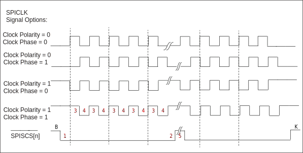
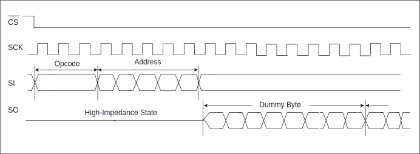
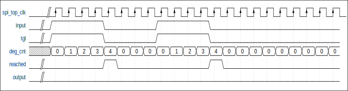

===========
SPI
===========

Overview
=====
Serial Peripheral Interface (SPI) Bus is a synchronous serial communication interface specification for short-range communication. Devices communicate in the full duplex mode, which is a master-slave mode where one master controls one or more slaves.

SPI completes full-duplex communication with 4 signal lines, namely CS (chip select), SCLK (clock), MOSI (master output slave input), and MISO (master input slave output).

Features
=========
- Can be used as SPI master or slave

- Both master and slave support 4 clock formats (CPOL, CPHA)

- Both master and slave support 1/2/3/4-byte transfer mode

- The sending and receiving channels each have a FIFO with a depth of 32 bytes

- The adaptive FIFO depth variation characteristic suits high-performance applications

   * When the Frame is 32Bits, the depth of FIFO is 8

   * When the Frame is 24Bits, the depth of FIFO is 8

   * When the Frame is 16Bits, the depth of FIFO is 16

   * When the Frame is 8Bits, the depth of FIFO is 32

- Configurable MSB/LSB transfer

- Adjustable byte transfer sequence

- Flexible clock configuration, which supports up to 80M clock

- Configurable MSB/LSB transfer priority

- Receive ignore function: You can set to ignore the reception of data from the specified location

- Supports timeout mechanism in the slave mode

- Supports DMA transfer mode

Functional Description
===========
Clock Control
-------------
Due to different clock phases and polarity settings, the SPI clock has four modes, which can be set by cr_spi_sclk_pol (CPOL) and cr_spi_sclk_ph (CPHA) in the register spi_config. CPOL determines the level of SCK clock signal when it is idle. If CPOL=0, the idle level is low, and if CPOL=1, the idle level is high. CPHA determines the sampling time. If CPHA=0, sampling is made at the first lock edge of each cycle, and if CPHA=1, that is made at the second clock edge of each cycle.

By setting the registers spi_prd_0 and spi_prd_1, you can also adjust the duration of the start and end levels of the clock, time of phase 0/1, and interval between frames of data. The settings of the four modes are shown as follows:

   SPI Timing

The meanings of numbers are as follows:

- "1" denotes the length of the START condition, which is configured by the cr_spi_prd_s in the register spi_prd_0.

- "2" denotes the length of the STOP condition, which is configured by the cr_spi_prd_p in the register spi_prd_0.

- "3" denotes the length of phase 0, which is configured by the cr_spi_prd_d_ph_0 in the register spi_prd_0.

- "4" denotes the length of phase 1, which is configured by the cr_spi_prd_d_ph_1 in the register spi_prd_0.

- "5" denotes the interval between frames of data, which is configured by the cr_spi_prd_i in the register spi_prd_1.

Master Continuous Transfer Mode
-------------------
After this mode is enabled, the CS signal will not be released when the current data is sent and there are still available data in FIFO.

Master-Slave: Transfer and Receive Data
--------------------------------------
The same framesize shall be set for the master and slave for transferring and receiving data by configuring the cr_spi_frame_size in the register spi_config. When the master and slave agree to communicate at a 32 bits framesize, if the clk of the master does not meet 32 bits due to an exception in a frame of data, the following symptoms occur.

- The data sent by the master cannot be transferred to the RX FIFO of the slave. The slave cannot receive data from the master.

- When the slave sends data, it will skip this frame of data and continue to send the next frame of data when the master's clk is normal again.

Receive Ignore Function
-------------
When the start and end bits to be filtered out are set, SPI will discard the corresponding data segments in the received data, as shown below:

   SPI Ignore Waveform

You can enable this function by configuring the cr_spi_rxd_ignr_en in the register spi_config. The start bit of this function is set by configuring the cr_spi_rxd_ignr_s in the register spi_rxd_ignr. The end bit of this function is set by configuring the cr_spi_rxd_ignr_p in the register spi_rxd_ignr.

In the above figure, the start bit to be filtered is set to 0, and if the end bit is set to 7, Dummy Byte will be received; if the end bit is set to 15, Dummy Byte will be discarded.

Filtering Function
----------------
When this function is enabled and a threshold is set, SPI will filter the data less than or equal to the width threshold.

When this function is enabled by setting the cr_spi_deg_en in the register spi_config and the threshold is set by configuring the cr_spi_deg_cnt, SPI will filter out the data that cannot reach the width threshold. The data width shall be less than cr_spi_deg_cnt+1: As shown in the figure below, when the data width is 4, setting the cr_spi_deg_cnt to 4 can meet this condition. "Input" is the initial data and "output" is the filtered data.

Filtering logic process:

- "Tgl" is the exclusive OR result of input and output.

- "Deg_cnt" counts from 0, and the counting condition is that "tgl" is at the high level and "reached" is at the low level.

- "Reached" means whether the current deg_cnt count reaches the set cr_spi_deg_cnt, and it is at a high level once reached.

- When "reached" is at a high level, "input" is output to "output".

- Note: user-defined condition for deg_cnt: "tgl" is at a high level and "reached" is at a low level. In other cases, "deg_cnt" will be cleared to 0.

   SPI Filter Waveform

Configurable MSB/LSB Transfer
-----------------
The configurable MSB/LSB transfer mode is limited to the priority transfer sequence of 8 bits in one byte, and the transfer sequence of bits in one byte is set by configuring the cr_spi_bit_inv bit in the register spi_config. 0 indicates MSB and 1 indicates LSB.

For example, for data transfer where the frame size is 24 bits, the data format is Data[23:0]=0×123456.

When MSB transfer is set, the transfer sequence is: 01010110 (binary, 1st byte: 0×56); 00110100 (binary, 2nd byte: 0×34); 00010010 (binary, 3rd byte: 0×12). When LSB transfer is set, the transfer sequence is: 01101010 (binary, 1st byte: 0×56); 00101100 (binary, 2nd byte: 0×34); 01001000 (binary, 3rd byte: 0×12).

Adjustable Byte Transfer Sequence
-----------------
The adjustable byte transfer sequence is limited to the priority transfer sequence between different bytes in FIFO. The transfer sequence of bytes in FIFO is set by configuring the cr_spi_byte_inv bit in the register spi_config. 0 means sending LSB first, and 1 means sending MSB first.

For example, for data transfer where the frame size is 24 bits, the data format is Data[23:0]=0×123456.

When LSB transfer priority is set, the transfer sequence is 0×56 (1st byte: LSB); 0×34 (2nd byte: intermediate byte); 0×12 (3rd byte: MSB). When MSB transfer priority is set, the transfer sequence is 0×12 (3rd byte: MSB); 0×34 (2nd byte: intermediate byte); 0×56 (1st byte: LSB).

Adjustable byte transfer can be used in conjunction with configurable MSB/LSB transfer.

Slave Mode Timeout Mechanism
--------------------------------
When a timeout threshold is set, an interrupt will be triggered when SPI in the slave mode receives no clock signal after the threshold exceeds.

I/O Transfer Mode
-------------
The chip communication processor can perform FIFO padding and clearing operations in response to the interrupt from the FIFO. Each FIFO has a programmable FIFO trigger threshold to trigger an interrupt. When rx_fifo_cnt in the register spi_fifo_config_1 is greater than the trigger threshold of rx_fifo_th, an interrupt will be generated to send a signal to the chip communication processor to clear the RX FIFO. When rx_fifo_cnt in the register spi_fifo_config_1 is greater than rx_fifo_th, an interrupt will be generated to send a signal to the chip communication processor to re-pad the TX FIFO.

You can query the SPI status register to determine the sampled value in the FIFO and the FIFO status. The software must provide correct trigger thresholds for RX FIFO and TX FIFO, and prevent the overflow of RX FIFO and the underflow of TX FIFO.

DMA Transfer Mode
-------------
SPI supports the DMA transfer mode. To enable this mode, you must set the thresholds of TX FIFO and RX FIFO respectively. Setting spi_dma_tx_en in the register spi_fifo_config_0 to 1 can enable the DMA sending mode. Setting spi_dma_rx_en in the register spi_fifo_config_0 to 1 can enable the DMA receiving mode. When this mode is enabled, UART will check the TX/RX FIFO. Once the tx_fifo_cnt/rx_fifo_cnt in the register spi_fifo_config_1 is greater than tx_fifo_th/rx_fifo_th, a DMA request will be initiated, and DMA will transfer data into TX FIFO or remove data from RX FIFO as configured.

SPI Interrupt
-------------
SPI supports the following interrupt control modes:

- SPI end of transfer interrupt

- TX FIFO request interrupt

- RX FIFO request interrupt

- Slave mode transfer timeout interrupt

- Slave mode TX overload interrupt

- TX/RX FIFO overflow interrupt

In the master mode, the SPI end of transfer interrupt will be triggered when the transfer of each frame of data ends. In the slave mode, that interrupt is triggered when the CS signal is released. The TX/RX FIFO request interrupt will be triggered when the FIFO available count value is greater than the preset threshold, and the interrupt flag will be cleared automatically when the condition is unmet. The slave mode transfer timeout interrupt will be triggered when no clock signal is received in the slave mode after the threshold exceeds. If the TX/RX FIFO overflows or underflows, it will trigger the TX/RX FIFO overflow interrupt. When the tx_fifo_clr/rx_fifo_clr bit in the FIFO clear register spi_fifo_config_0 is set to 1, the corresponding FIFO will be cleared and the overflow interrupt flag will be cleared automatically.

You can query the interrupt status through the register SPI_INT_STS and write 1 to the corresponding bit to clear the interrupt.

.. only:: html

   .. include:: spi_register.rst

.. raw:: latex

   \input{../../en/content/spi}