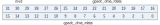

Register description
==========================

+--------------------+-------------+
| Name               | Description |
+--------------------+-------------+
| `gpadc_config`_    |             |
+--------------------+-------------+
| `gpadc_dma_rdata`_ |             |
+--------------------+-------------+
| `gpadc_pir_train`_ |             |
+--------------------+-------------+

gpadc_config
--------------
 
**Address：**  0x20002000
 
.. figure:: ../../picture/gpip_gpadc_config.svg
   :align: center

.. table::
    :widths: 10, 15,10,10,55
    :width: 100%
    :align: center
     
    +----------+------------------------------+--------+-------------+---------------------------------------------------------------------------+
    | Bit      | Name                         |Type    | Reset       | Description                                                               |
    +==========+==============================+========+=============+===========================================================================+
    | 31:24    | rsvd                         | rsvd   | 8'd0        |                                                                           |
    +----------+------------------------------+--------+-------------+---------------------------------------------------------------------------+
    | 23:22    | gpadc_fifo_thl               | r/w    | 2'd0        | fifo threshold                                                            |
    +          +                              +        +             +                                                                           +
    |          |                              |        |             | 2'b00: 1 data                                                             |
    +          +                              +        +             +                                                                           +
    |          |                              |        |             | 2'b01: 4 data                                                             |
    +          +                              +        +             +                                                                           +
    |          |                              |        |             | 2'b10: 8 data                                                             |
    +          +                              +        +             +                                                                           +
    |          |                              |        |             | 2'b11: 16 data                                                            |
    +----------+------------------------------+--------+-------------+---------------------------------------------------------------------------+
    | 21:16    | gpadc_fifo_data_count        | r      | 6'd0        | fifo data number                                                          |
    +----------+------------------------------+--------+-------------+---------------------------------------------------------------------------+
    | 15       | RSVD                         |        |             |                                                                           |
    +----------+------------------------------+--------+-------------+---------------------------------------------------------------------------+
    | 14       | gpadc_fifo_underrun_mask     | r/w    | 1'b0        | write 1 mask                                                              |
    +----------+------------------------------+--------+-------------+---------------------------------------------------------------------------+
    | 13       | gpadc_fifo_overrun_mask      | r/w    | 1'b0        | write 1 mask                                                              |
    +----------+------------------------------+--------+-------------+---------------------------------------------------------------------------+
    | 12       | gpadc_rdy_mask               | r/w    | 1'b0        | write 1 mask                                                              |
    +----------+------------------------------+--------+-------------+---------------------------------------------------------------------------+
    | 11       | RSVD                         |        |             |                                                                           |
    +----------+------------------------------+--------+-------------+---------------------------------------------------------------------------+
    | 10       | gpadc_fifo_underrun_clr      | r/w    | 1'b0        | Write 1 to clear flag                                                     |
    +----------+------------------------------+--------+-------------+---------------------------------------------------------------------------+
    | 9        | gpadc_fifo_overrun_clr       | r/w    | 1'b0        | Write 1 to clear flag                                                     |
    +----------+------------------------------+--------+-------------+---------------------------------------------------------------------------+
    | 8        | gpadc_rdy_clr                | r/w    | 1'b0        | Write 1 to clear flag                                                     |
    +----------+------------------------------+--------+-------------+---------------------------------------------------------------------------+
    | 7        | RSVD                         |        |             |                                                                           |
    +----------+------------------------------+--------+-------------+---------------------------------------------------------------------------+
    | 6        | gpadc_fifo_underrun          | r      | 1'b0        | FIFO underrun interrupt flag                                              |
    +----------+------------------------------+--------+-------------+---------------------------------------------------------------------------+
    | 5        | gpadc_fifo_overrun           | r      | 1'b0        | FIFO overrun interrupt flag                                               |
    +----------+------------------------------+--------+-------------+---------------------------------------------------------------------------+
    | 4        | gpadc_rdy                    | r      | 1'b0        | Conversion data ready interrupt flag                                      |
    +----------+------------------------------+--------+-------------+---------------------------------------------------------------------------+
    | 3        | gpadc_fifo_full              | r      | 1'b0        | FIFO full flag                                                            |
    +----------+------------------------------+--------+-------------+---------------------------------------------------------------------------+
    | 2        | gpadc_fifo_ne                | r      | 1'b0        | FIFO not empty flag                                                       |
    +----------+------------------------------+--------+-------------+---------------------------------------------------------------------------+
    | 1        | gpadc_fifo_clr               | w1c    | 1'b0        | FIFO clear signal                                                         |
    +----------+------------------------------+--------+-------------+---------------------------------------------------------------------------+
    | 0        | gpadc_dma_en                 | r/w    | 1'b0        | GPADC DMA enbale                                                          |
    +----------+------------------------------+--------+-------------+---------------------------------------------------------------------------+

gpadc_dma_rdata
-----------------
 
**Address：**  0x20002004
 

.. table::
    :widths: 10, 15,10,10,55
    :width: 100%
    :align: center
     
    +----------+------------------------------+--------+-------------+---------------------------------------------------+
    | Bit      | Name                         |Type    | Reset       | Description                                       |
    +==========+==============================+========+=============+===================================================+
    | 31:26    | rsvd                         | rsvd   | 6'd0        |                                                   |
    +----------+------------------------------+--------+-------------+---------------------------------------------------+
    | 25:0     | gpadc_dma_rdata              | r      | 26'd0       | GPADC finial conversion result stored in the FIFO |
    +----------+------------------------------+--------+-------------+---------------------------------------------------+

gpadc_pir_train
-----------------
 
**Address：**  0x20002020
 
.. figure:: ../../picture/gpip_gpadc_pir_train.svg
   :align: center

.. table::
    :widths: 10, 15,10,10,55
    :width: 100%
    :align: center
     
    +----------+------------------------------+--------+-------------+--------------------------------------------+
    | Bit      | Name                         |Type    | Reset       | Description                                |
    +==========+==============================+========+=============+============================================+
    | 31:18    | RSVD                         |        |             |                                            |
    +----------+------------------------------+--------+-------------+--------------------------------------------+
    | 17       | pir_stop                     | r      | 0           | PIR Training End                           |
    +----------+------------------------------+--------+-------------+--------------------------------------------+
    | 16       | pir_train                    | r/w    | 0           | PIR Training Mode                          |
    +----------+------------------------------+--------+-------------+--------------------------------------------+
    | 15:13    | RSVD                         |        |             |                                            |
    +----------+------------------------------+--------+-------------+--------------------------------------------+
    | 12:8     | pir_cnt_v                    | r      | 0           | GPADC Record Extension Counter Value       |
    +----------+------------------------------+--------+-------------+--------------------------------------------+
    | 7:5      | RSVD                         |        |             |                                            |
    +----------+------------------------------+--------+-------------+--------------------------------------------+
    | 4:0      | pir_extend                   | r/w    | 5'd15       | GPADC Record Extension after PIR interrupt |
    +----------+------------------------------+--------+-------------+--------------------------------------------+
