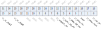
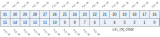

Register description
==========================

+-------------------+-------------+
| Name              | Description |
+-------------------+-------------+
| `mipi_config`_    |             |
+-------------------+-------------+
| `csi_int_status`_ |             |
+-------------------+-------------+
| `csi_int_mask`_   |             |
+-------------------+-------------+
| `csi_int_clear`_  |             |
+-------------------+-------------+
| `csi_int_enable`_ |             |
+-------------------+-------------+
| `gnr_buf_status`_ |             |
+-------------------+-------------+
| `gnr_buf_rdata`_  |             |
+-------------------+-------------+
| `dphy_config_0`_  |             |
+-------------------+-------------+
| `dphy_config_1`_  |             |
+-------------------+-------------+
| `dphy_config_2`_  |             |
+-------------------+-------------+
| `dphy_config_3`_  |             |
+-------------------+-------------+
| `dphy_config_4`_  |             |
+-------------------+-------------+
| `dphy_config_5`_  |             |
+-------------------+-------------+
| `dummy_reg`_      |             |
+-------------------+-------------+

mipi_config
-------------
 
**Address：**  0x3001a000
 

.. table::
    :widths: 10, 15,10,10,55
    :width: 100%
    :align: center
     
    +----------+------------------------------+--------+-------------+-------------------------------------------------------------------------------------------------------------------------------------------------------------------------------------------------+
    | Bit      | Name                         |Type    | Reset       | Description                                                                                                                                                                                     |
    +==========+==============================+========+=============+=================================================================================================================================================================================================+
    | 31:16    | RSVD                         |        |             |                                                                                                                                                                                                 |
    +----------+------------------------------+--------+-------------+-------------------------------------------------------------------------------------------------------------------------------------------------------------------------------------------------+
    | 15:14    | cr_vc_dvp1                   | r/w    | 2'd1        | Virtual Channel number for DVP port 1                                                                                                                                                           |
    +----------+------------------------------+--------+-------------+-------------------------------------------------------------------------------------------------------------------------------------------------------------------------------------------------+
    | 13:12    | cr_vc_dvp0                   | r/w    | 2'd0        | Virtual Channel number for DVP port 0                                                                                                                                                           |
    +----------+------------------------------+--------+-------------+-------------------------------------------------------------------------------------------------------------------------------------------------------------------------------------------------+
    | 11:7     | RSVD                         |        |             |                                                                                                                                                                                                 |
    +----------+------------------------------+--------+-------------+-------------------------------------------------------------------------------------------------------------------------------------------------------------------------------------------------+
    | 6        | cr_unpack_en                 | r/w    | 1'b1        | Enable signal for data-unpack function                                                                                                                                                          |
    +          +                              +        +             +                                                                                                                                                                                                 +
    |          |                              |        |             | 1'b0: Unpack disabled, DVP output is 8-bit valid (byte-in-byte-out)                                                                                                                             |
    +          +                              +        +             +                                                                                                                                                                                                 +
    |          |                              |        |             | 1'b1: Unpack enabled, DVP output format depends on packet data type (RAW 8/10/12/14)                                                                                                            |
    +----------+------------------------------+--------+-------------+-------------------------------------------------------------------------------------------------------------------------------------------------------------------------------------------------+
    | 5        | cr_sync_sp_en                | r/w    | 1'b0        | Enable signal for sync short packets (FS/FE/LS/LE) to be received into gnr_data_buf                                                                                                             |
    +----------+------------------------------+--------+-------------+-------------------------------------------------------------------------------------------------------------------------------------------------------------------------------------------------+
    | 4        | cr_data_bit_inv              | r/w    | 1'b0        | Controls the bit ordering of PPI I/F data byte, which should be set to little-endian (MSB [7])                                                                                                  |
    +          +                              +        +             +                                                                                                                                                                                                 +
    |          |                              |        |             | 1'b0: Not inversed                                                                                                                                                                              |
    +          +                              +        +             +                                                                                                                                                                                                 +
    |          |                              |        |             | 1'b1: Inversed                                                                                                                                                                                  |
    +----------+------------------------------+--------+-------------+-------------------------------------------------------------------------------------------------------------------------------------------------------------------------------------------------+
    | 3        | cr_lane_inv                  | r/w    | 1'b0        | Lane inverse                                                                                                                                                                                    |
    +          +                              +        +             +                                                                                                                                                                                                 +
    |          |                              |        |             | 1'b0: Lane0 & Lane1 NOT inversed                                                                                                                                                                |
    +          +                              +        +             +                                                                                                                                                                                                 +
    |          |                              |        |             | 1'b1: Lane0 & Lane1 inversed                                                                                                                                                                    |
    +----------+------------------------------+--------+-------------+-------------------------------------------------------------------------------------------------------------------------------------------------------------------------------------------------+
    | 2        | rsvd                         | rsvd   | 1'b0        |                                                                                                                                                                                                 |
    +----------+------------------------------+--------+-------------+-------------------------------------------------------------------------------------------------------------------------------------------------------------------------------------------------+
    | 1        | cr_lane_num                  | r/w    | 1'b1        | Lane number configuration                                                                                                                                                                       |
    +          +                              +        +             +                                                                                                                                                                                                 +
    |          |                              |        |             | 1'b0: 1-lane MIPI RX                                                                                                                                                                            |
    +          +                              +        +             +                                                                                                                                                                                                 +
    |          |                              |        |             | 1'b1: 2-lane MIPI RX                                                                                                                                                                            |
    +----------+------------------------------+--------+-------------+-------------------------------------------------------------------------------------------------------------------------------------------------------------------------------------------------+
    | 0        | cr_csi_en                    | r/w    | 1'b0        | Enable signal of MIPI receiving function                                                                                                                                                        |
    +----------+------------------------------+--------+-------------+-------------------------------------------------------------------------------------------------------------------------------------------------------------------------------------------------+

csi_int_status
----------------
 
**Address：**  0x3001a010
 
.. figure:: ../../picture/csi_csi_int_status.svg
   :align: center

.. table::
    :widths: 10, 15,10,10,55
    :width: 100%
    :align: center
     
    +----------+------------------------------+--------+-------------+--------------------------------------------------------------------------------------------------------------------------------------+
    | Bit      | Name                         |Type    | Reset       | Description                                                                                                                          |
    +==========+==============================+========+=============+======================================================================================================================================+
    | 31:6     | RSVD                         |        |             |                                                                                                                                      |
    +----------+------------------------------+--------+-------------+--------------------------------------------------------------------------------------------------------------------------------------+
    | 5:0      | csi_int_status               | r      | 6'h0        | [5]: PHY HS SoT Sync Error                                                                                                           |
    +          +                              +        +             +                                                                                                                                      +
    |          |                              |        |             | [4]: PHY HS SoT Error                                                                                                                |
    +          +                              +        +             +                                                                                                                                      +
    |          |                              |        |             | [3]: CRC Error                                                                                                                       |
    +          +                              +        +             +                                                                                                                                      +
    |          |                              |        |             | [2]: ECC Error                                                                                                                       |
    +          +                              +        +             +                                                                                                                                      +
    |          |                              |        |             | [1]: Lane Merging Error                                                                                                              |
    +          +                              +        +             +                                                                                                                                      +
    |          |                              |        |             | [0]: Generic Packet Interrupt                                                                                                        |
    +----------+------------------------------+--------+-------------+--------------------------------------------------------------------------------------------------------------------------------------+

csi_int_mask
--------------
 
**Address：**  0x3001a014
 

.. table::
    :widths: 10, 15,10,10,55
    :width: 100%
    :align: center
     
    +----------+------------------------------+--------+-------------+--------------------------------------------------------------------------------------------------------------------------------------+
    | Bit      | Name                         |Type    | Reset       | Description                                                                                                                          |
    +==========+==============================+========+=============+======================================================================================================================================+
    | 31:6     | RSVD                         |        |             |                                                                                                                                      |
    +----------+------------------------------+--------+-------------+--------------------------------------------------------------------------------------------------------------------------------------+
    | 5:0      | csi_int_mask                 | r/w    | 6'h3F       | [5]: PHY HS SoT Sync Error                                                                                                           |
    +          +                              +        +             +                                                                                                                                      +
    |          |                              |        |             | [4]: PHY HS SoT Error                                                                                                                |
    +          +                              +        +             +                                                                                                                                      +
    |          |                              |        |             | [3]: CRC Error                                                                                                                       |
    +          +                              +        +             +                                                                                                                                      +
    |          |                              |        |             | [2]: ECC Error                                                                                                                       |
    +          +                              +        +             +                                                                                                                                      +
    |          |                              |        |             | [1]: Lane Merging Error                                                                                                              |
    +          +                              +        +             +                                                                                                                                      +
    |          |                              |        |             | [0]: Generic Packet Interrupt                                                                                                        |
    +----------+------------------------------+--------+-------------+--------------------------------------------------------------------------------------------------------------------------------------+

csi_int_clear
---------------
 
**Address：**  0x3001a018
 

.. table::
    :widths: 10, 15,10,10,55
    :width: 100%
    :align: center
     
    +----------+------------------------------+--------+-------------+--------------------------------------------------------------------------------------------------------------------------------------+
    | Bit      | Name                         |Type    | Reset       | Description                                                                                                                          |
    +==========+==============================+========+=============+======================================================================================================================================+
    | 31:6     | RSVD                         |        |             |                                                                                                                                      |
    +----------+------------------------------+--------+-------------+--------------------------------------------------------------------------------------------------------------------------------------+
    | 5:0      | csi_int_clear                | w1p    | 6'h0        | [5]: PHY HS SoT Sync Error                                                                                                           |
    +          +                              +        +             +                                                                                                                                      +
    |          |                              |        |             | [4]: PHY HS SoT Error                                                                                                                |
    +          +                              +        +             +                                                                                                                                      +
    |          |                              |        |             | [3]: CRC Error                                                                                                                       |
    +          +                              +        +             +                                                                                                                                      +
    |          |                              |        |             | [2]: ECC Error                                                                                                                       |
    +          +                              +        +             +                                                                                                                                      +
    |          |                              |        |             | [1]: Lane Merging Error                                                                                                              |
    +          +                              +        +             +                                                                                                                                      +
    |          |                              |        |             | [0]: Generic Packet Interrupt                                                                                                        |
    +----------+------------------------------+--------+-------------+--------------------------------------------------------------------------------------------------------------------------------------+

csi_int_enable
----------------
 
**Address：**  0x3001a01c
 
.. figure:: ../../picture/csi_csi_int_enable.svg
   :align: center

.. table::
    :widths: 10, 15,10,10,55
    :width: 100%
    :align: center
     
    +----------+------------------------------+--------+-------------+--------------------------------------------------------------------------------------------------------------------------------------+
    | Bit      | Name                         |Type    | Reset       | Description                                                                                                                          |
    +==========+==============================+========+=============+======================================================================================================================================+
    | 31:6     | RSVD                         |        |             |                                                                                                                                      |
    +----------+------------------------------+--------+-------------+--------------------------------------------------------------------------------------------------------------------------------------+
    | 5:0      | csi_int_enable               | r/w    | 6'h3F       | [5]: PHY HS SoT Sync Error                                                                                                           |
    +          +                              +        +             +                                                                                                                                      +
    |          |                              |        |             | [4]: PHY HS SoT Error                                                                                                                |
    +          +                              +        +             +                                                                                                                                      +
    |          |                              |        |             | [3]: CRC Error                                                                                                                       |
    +          +                              +        +             +                                                                                                                                      +
    |          |                              |        |             | [2]: ECC Error                                                                                                                       |
    +          +                              +        +             +                                                                                                                                      +
    |          |                              |        |             | [1]: Lane Merging Error                                                                                                              |
    +          +                              +        +             +                                                                                                                                      +
    |          |                              |        |             | [0]: Generic Packet Interrupt                                                                                                        |
    +----------+------------------------------+--------+-------------+--------------------------------------------------------------------------------------------------------------------------------------+

gnr_buf_status
----------------
 
**Address：**  0x3001a020
 
.. figure:: ../../picture/csi_gnr_buf_status.svg
   :align: center

.. table::
    :widths: 10, 15,10,10,55
    :width: 100%
    :align: center
     
    +----------+------------------------------+--------+-------------+---------------------------+
    | Bit      | Name                         |Type    | Reset       | Description               |
    +==========+==============================+========+=============+===========================+
    | 31:4     | RSVD                         |        |             |                           |
    +----------+------------------------------+--------+-------------+---------------------------+
    | 3:0      | st_gnr_fifo_cnt              | r      | 4'd0        | Generic Packet FIFO count |
    +----------+------------------------------+--------+-------------+---------------------------+

gnr_buf_rdata
---------------
 
**Address：**  0x3001a024
 
.. figure:: ../../picture/csi_gnr_buf_rdata.svg
   :align: center

.. table::
    :widths: 10, 15,10,10,55
    :width: 100%
    :align: center
     
    +----------+------------------------------+--------+-------------+-------------------------------+
    | Bit      | Name                         |Type    | Reset       | Description                   |
    +==========+==============================+========+=============+===============================+
    | 31:0     | gnr_buf_rdata                | r      | 32'h0       | Generic Packet FIFO read port |
    +----------+------------------------------+--------+-------------+-------------------------------+

dphy_config_0
---------------
 
**Address：**  0x3001a080
 
.. figure:: ../../picture/csi_dphy_config_0.svg
   :align: center

.. table::
    :widths: 10, 15,10,10,55
    :width: 100%
    :align: center
     
    +----------+------------------------------+--------+-------------+----------------------------------------------+
    | Bit      | Name                         |Type    | Reset       | Description                                  |
    +==========+==============================+========+=============+==============================================+
    | 31       | csi_reset_n                  | r/w    | 1'b0        | MIPI CSI D-PHY reset pin                     |
    +----------+------------------------------+--------+-------------+----------------------------------------------+
    | 30:16    | RSVD                         |        |             |                                              |
    +----------+------------------------------+--------+-------------+----------------------------------------------+
    | 15       | cl_rxulpsclknot              | r      | 1'b1        | Receiver Ultra-Low Power State on clock lane |
    +----------+------------------------------+--------+-------------+----------------------------------------------+
    | 14       | cl_rxclkactivehs             | r      | 1'b0        | Receiver clock active                        |
    +----------+------------------------------+--------+-------------+----------------------------------------------+
    | 13       | dl1_forcerxmode              | r/w    | 1'b0        | Force Lane1 to Re-Initialize                 |
    +----------+------------------------------+--------+-------------+----------------------------------------------+
    | 12       | dl0_forcerxmode              | r/w    | 1'b0        | Force Lane0 to Re-Initialize                 |
    +----------+------------------------------+--------+-------------+----------------------------------------------+
    | 11       | RSVD                         |        |             |                                              |
    +----------+------------------------------+--------+-------------+----------------------------------------------+
    | 10       | cl_ulpsactivenot             | r      | 1'b1        | Clock lane is NOT in the ULP state           |
    +----------+------------------------------+--------+-------------+----------------------------------------------+
    | 9        | dl1_ulpsactivenot            | r      | 1'b1        | Data lane1 is NOT in the ULP state           |
    +----------+------------------------------+--------+-------------+----------------------------------------------+
    | 8        | dl0_ulpsactivenot            | r      | 1'b1        | Data lane0 is NOT in the ULP state           |
    +----------+------------------------------+--------+-------------+----------------------------------------------+
    | 7        | RSVD                         |        |             |                                              |
    +----------+------------------------------+--------+-------------+----------------------------------------------+
    | 6        | cl_stopstate                 | r      | 1'b1        | Clock lane is in Stop state                  |
    +----------+------------------------------+--------+-------------+----------------------------------------------+
    | 5        | dl1_stopstate                | r      | 1'b1        | Data lane1 is in Stop state                  |
    +----------+------------------------------+--------+-------------+----------------------------------------------+
    | 4        | dl0_stopstate                | r      | 1'b1        | Data lane0 is in Stop state                  |
    +----------+------------------------------+--------+-------------+----------------------------------------------+
    | 3        | RSVD                         |        |             |                                              |
    +----------+------------------------------+--------+-------------+----------------------------------------------+
    | 2        | cl_enable                    | r/w    | 1'b0        | Clock lane enable                            |
    +----------+------------------------------+--------+-------------+----------------------------------------------+
    | 1        | dl1_enable                   | r/w    | 1'b0        | Data lane1 enable                            |
    +----------+------------------------------+--------+-------------+----------------------------------------------+
    | 0        | dl0_enable                   | r/w    | 1'b0        | Data lane0 enable                            |
    +----------+------------------------------+--------+-------------+----------------------------------------------+

dphy_config_1
---------------
 
**Address：**  0x3001a084
 

.. table::
    :widths: 10, 15,10,10,55
    :width: 100%
    :align: center
     
    +----------+------------------------------+--------+-------------+---------------------------------------------------------------------------------------------------------+
    | Bit      | Name                         |Type    | Reset       | Description                                                                                             |
    +==========+==============================+========+=============+=========================================================================================================+
    | 31:24    | reg_time_hs_term_en          | r/w    | 8'hF        | MIPI CSI D-PHY control register - reg_time_hs_term_en (2x T_datarate), txclkesc: 40M, datarate: 800Mbps |
    +----------+------------------------------+--------+-------------+---------------------------------------------------------------------------------------------------------+
    | 23:16    | reg_time_hs_settle           | r/w    | 8'h2F       | MIPI CSI D-PHY control register - reg_time_hs_settle (2x T_datarate)                                    |
    +----------+------------------------------+--------+-------------+---------------------------------------------------------------------------------------------------------+
    | 15:8     | reg_time_ck_term_en          | r/w    | 8'h1        | MIPI CSI D-PHY control register - reg_time_ck_term_en (tx_clk_esc)                                      |
    +----------+------------------------------+--------+-------------+---------------------------------------------------------------------------------------------------------+
    | 7:0      | reg_time_ck_settle           | r/w    | 8'h0A       | MIPI CSI D-PHY control register - reg_time_ck_settle (tx_clk_esc)                                       |
    +----------+------------------------------+--------+-------------+---------------------------------------------------------------------------------------------------------+

dphy_config_2
---------------
 
**Address：**  0x3001a088
 

.. table::
    :widths: 10, 15,10,10,55
    :width: 100%
    :align: center
     
    +----------+------------------------------+--------+-------------+-----------------------------------------------------------+
    | Bit      | Name                         |Type    | Reset       | Description                                               |
    +==========+==============================+========+=============+===========================================================+
    | 31:25    | RSVD                         |        |             |                                                           |
    +----------+------------------------------+--------+-------------+-----------------------------------------------------------+
    | 24       | reg_pt_pass                  | r      | 1'b0        | MIPI CSI D-PHY control register - reg_pt_pass             |
    +----------+------------------------------+--------+-------------+-----------------------------------------------------------+
    | 23       | reg_pt_lock                  | r      | 1'b0        | MIPI CSI D-PHY control register - reg_pt_lock             |
    +----------+------------------------------+--------+-------------+-----------------------------------------------------------+
    | 22       | reg_pt_en                    | r/w    | 1'b0        | MIPI CSI D-PHY control register - reg_pt_en               |
    +----------+------------------------------+--------+-------------+-----------------------------------------------------------+
    | 21       | reg_pt_lp_mode               | r/w    | 1'b0        | MIPI CSI D-PHY control register - reg_pt_lp_mode          |
    +----------+------------------------------+--------+-------------+-----------------------------------------------------------+
    | 20       | reg_pt_prbs_or_jitt          | r/w    | 1'b0        | MIPI CSI D-PHY control register - reg_pt_prbs_or_jitt     |
    +----------+------------------------------+--------+-------------+-----------------------------------------------------------+
    | 19:16    | reg_pt_lock_counter          | r/w    | 4'h0        | MIPI CSI D-PHY control register - reg_pt_lock_counter     |
    +----------+------------------------------+--------+-------------+-----------------------------------------------------------+
    | 15       | reg_ana_test_en              | r/w    | 1'b0        | MIPI CSI D-PHY control register - reg_ana_test_en         |
    +----------+------------------------------+--------+-------------+-----------------------------------------------------------+
    | 14:10    | reg_ana_term_en              | r/w    | 5'h0        | MIPI CSI D-PHY control register - reg_ana_term_en         |
    +----------+------------------------------+--------+-------------+-----------------------------------------------------------+
    | 9:8      | reg_ana_hsrxen               | r/w    | 2'b00       | MIPI CSI D-PHY control register - reg_ana_hsrxen          |
    +----------+------------------------------+--------+-------------+-----------------------------------------------------------+
    | 7:6      | reg_ana_lprxen               | r/w    | 2'b00       | MIPI CSI D-PHY control register - reg_ana_lprxen          |
    +----------+------------------------------+--------+-------------+-----------------------------------------------------------+
    | 5:4      | reg_ana_hsrx_sync_en         | r/w    | 2'b00       | MIPI CSI D-PHY control register - reg_ana_hsrx_sync_en    |
    +----------+------------------------------+--------+-------------+-----------------------------------------------------------+
    | 3:2      | reg_ana_hsrx_stop_state      | r/w    | 2'b00       | MIPI CSI D-PHY control register - reg_ana_hsrx_stop_state |
    +----------+------------------------------+--------+-------------+-----------------------------------------------------------+
    | 1        | reg_ana_hsrxen_clk           | r/w    | 1'b0        | MIPI CSI D-PHY control register - reg_ana_hsrxen_clk      |
    +----------+------------------------------+--------+-------------+-----------------------------------------------------------+
    | 0        | reg_ana_lprxen_clk           | r/w    | 1'b0        | MIPI CSI D-PHY control register - reg_ana_lprxen_clk      |
    +----------+------------------------------+--------+-------------+-----------------------------------------------------------+

dphy_config_3
---------------
 
**Address：**  0x3001a08c
 

.. table::
    :widths: 10, 15,10,10,55
    :width: 100%
    :align: center
     
    +----------+------------------------------+--------+-------------+-------------------------------------------------+
    | Bit      | Name                         |Type    | Reset       | Description                                     |
    +==========+==============================+========+=============+=================================================+
    | 31:16    | reg_csi_ana_0                | r/w    | 16'h0000    | MIPI CSI D-PHY control register - reg_csi_ana_0 |
    +----------+------------------------------+--------+-------------+-------------------------------------------------+
    | 15:0     | reg_csi_ana_1                | r/w    | 16'h0000    | MIPI CSI D-PHY control register - reg_csi_ana_1 |
    +----------+------------------------------+--------+-------------+-------------------------------------------------+

dphy_config_4
---------------
 
**Address：**  0x3001a090
 
.. figure:: ../../picture/csi_dphy_config_4.svg
   :align: center

.. table::
    :widths: 10, 15,10,10,55
    :width: 100%
    :align: center
     
    +----------+------------------------------+--------+-------------+--------------------+
    | Bit      | Name                         |Type    | Reset       | Description        |
    +==========+==============================+========+=============+====================+
    | 31:5     | RSVD                         |        |             |                    |
    +----------+------------------------------+--------+-------------+--------------------+
    | 4        | reg_csi_pw_avdd1815          | r/w    | 1'b0        | 0: power switch on |
    +----------+------------------------------+--------+-------------+--------------------+
    | 3:1      | RSVD                         |        |             |                    |
    +----------+------------------------------+--------+-------------+--------------------+
    | 0        | reg_csi_dc_tp_out_en         | r/w    | 1'b0        |                    |
    +----------+------------------------------+--------+-------------+--------------------+

dphy_config_5
---------------
 
**Address：**  0x3001a094
 
.. figure:: ../../picture/csi_dphy_config_5.svg
   :align: center

.. table::
    :widths: 10, 15,10,10,55
    :width: 100%
    :align: center
     
    +----------+------------------------------+--------+-------------+---+
    | Bit      | Name                         |Type    | Reset       | Description|
    +==========+==============================+========+=============+===+
    | 31:2     | RSVD                         |        |             |   |
    +----------+------------------------------+--------+-------------+---+
    | 1        | reg_csi_ddr_clk_inv          | r/w    | 1'b0        |   |
    +----------+------------------------------+--------+-------------+---+
    | 0        | reg_csi_byte_clk_inv         | r/w    | 1'b0        |   |
    +----------+------------------------------+--------+-------------+---+

dummy_reg
-----------
 
**Address：**  0x3001a0fc
 

.. table::
    :widths: 10, 15,10,10,55
    :width: 100%
    :align: center
     
    +----------+------------------------------+--------+-------------+-----------------+
    | Bit      | Name                         |Type    | Reset       | Description     |
    +==========+==============================+========+=============+=================+
    | 31:0     | dummy_reg                    | r/w    | 32'h0       | Dummy registers |
    +----------+------------------------------+--------+-------------+-----------------+

