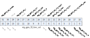
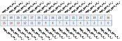
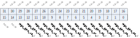
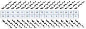
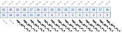
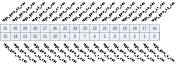
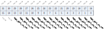
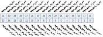
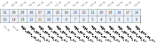

Register description
==========================

+----------------+-------------+
| Name           | Description |
+----------------+-------------+
| `gpio_cfg0`_   |             |
+----------------+-------------+
| `gpio_cfg1`_   |             |
+----------------+-------------+
| `gpio_cfg2`_   |             |
+----------------+-------------+
| `gpio_cfg3`_   |             |
+----------------+-------------+
| `gpio_cfg4`_   |             |
+----------------+-------------+
| `gpio_cfg5`_   |             |
+----------------+-------------+
| `gpio_cfg6`_   |             |
+----------------+-------------+
| `gpio_cfg7`_   |             |
+----------------+-------------+
| `gpio_cfg8`_   |             |
+----------------+-------------+
| `gpio_cfg9`_   |             |
+----------------+-------------+
| `gpio_cfg10`_  |             |
+----------------+-------------+
| `gpio_cfg11`_  |             |
+----------------+-------------+
| `gpio_cfg12`_  |             |
+----------------+-------------+
| `gpio_cfg13`_  |             |
+----------------+-------------+
| `gpio_cfg14`_  |             |
+----------------+-------------+
| `gpio_cfg15`_  |             |
+----------------+-------------+
| `gpio_cfg16`_  |             |
+----------------+-------------+
| `gpio_cfg17`_  |             |
+----------------+-------------+
| `gpio_cfg18`_  |             |
+----------------+-------------+
| `gpio_cfg19`_  |             |
+----------------+-------------+
| `gpio_cfg20`_  |             |
+----------------+-------------+
| `gpio_cfg21`_  |             |
+----------------+-------------+
| `gpio_cfg22`_  |             |
+----------------+-------------+
| `gpio_cfg23`_  |             |
+----------------+-------------+
| `gpio_cfg24`_  |             |
+----------------+-------------+
| `gpio_cfg25`_  |             |
+----------------+-------------+
| `gpio_cfg26`_  |             |
+----------------+-------------+
| `gpio_cfg27`_  |             |
+----------------+-------------+
| `gpio_cfg28`_  |             |
+----------------+-------------+
| `gpio_cfg29`_  |             |
+----------------+-------------+
| `gpio_cfg30`_  |             |
+----------------+-------------+
| `gpio_cfg31`_  |             |
+----------------+-------------+
| `gpio_cfg32`_  |             |
+----------------+-------------+
| `gpio_cfg33`_  |             |
+----------------+-------------+
| `gpio_cfg34`_  |             |
+----------------+-------------+
| `gpio_cfg35`_  |             |
+----------------+-------------+
| `gpio_cfg36`_  |             |
+----------------+-------------+
| `gpio_cfg37`_  |             |
+----------------+-------------+
| `gpio_cfg38`_  |             |
+----------------+-------------+
| `gpio_cfg39`_  |             |
+----------------+-------------+
| `gpio_cfg40`_  |             |
+----------------+-------------+
| `gpio_cfg41`_  |             |
+----------------+-------------+
| `gpio_cfg42`_  |             |
+----------------+-------------+
| `gpio_cfg43`_  |             |
+----------------+-------------+
| `gpio_cfg44`_  |             |
+----------------+-------------+
| `gpio_cfg45`_  |             |
+----------------+-------------+
| `gpio_cfg128`_ |             |
+----------------+-------------+
| `gpio_cfg129`_ |             |
+----------------+-------------+
| `gpio_cfg136`_ |             |
+----------------+-------------+
| `gpio_cfg137`_ |             |
+----------------+-------------+
| `gpio_cfg138`_ |             |
+----------------+-------------+
| `gpio_cfg139`_ |             |
+----------------+-------------+
| `gpio_cfg140`_ |             |
+----------------+-------------+
| `gpio_cfg141`_ |             |
+----------------+-------------+

gpio_cfg0
-----------
 
**Address：**  0x200008c4
 

.. table::
    :widths: 10, 15,10,10,55
    :width: 100%
    :align: center
     
    +----------+------------------------------+--------+-------------+-------------------------------------------------------------------------------------------------------------------------------------------------------------------------------------------------------------------------------------------------------------------------------------------------------------------------------------------------------------------------------------------+
    | Bit      | Name                         |Type    | Reset       | Description                                                                                                                                                                                                                                                                                                                                                                               |
    +==========+==============================+========+=============+===========================================================================================================================================================================================================================================================================================================================================================================================+
    | 31:30    | reg_gpio_0_mode              | r/w    | 0           | When GPIO Function Selected to SWGPIO                                                                                                                                                                                                                                                                                                                                                     |
    +          +                              +        +             +                                                                                                                                                                                                                                                                                                                                                                                           +
    |          |                              |        |             | 00 (Output Value Mode): GPIO Output by reg_gpio_x_o Value                                                                                                                                                                                                                                                                                                                                 |
    +          +                              +        +             +                                                                                                                                                                                                                                                                                                                                                                                           +
    |          |                              |        |             | 01 (Set/Celar Mode     ) :GPIO Output set by reg_gpio_x_set and clear by reg_gpio_x_clr                                                                                                                                                                                                                                                                                                   |
    +          +                              +        +             +                                                                                                                                                                                                                                                                                                                                                                                           +
    |          |                              |        |             | 10 : SWGPIO Source comes from  GPIO DMA (GPIO DMA Mode), GPIO Output value by gpio_dma_o                                                                                                                                                                                                                                                                                                  |
    +          +                              +        +             +                                                                                                                                                                                                                                                                                                                                                                                           +
    |          |                              |        |             | 11: SWGPIO Source comes from  GPIO DMA (GPIO DMA Mode), GPIO Outout value by gpio_dma_set/gpio_dma_clr                                                                                                                                                                                                                                                                                    |
    +----------+------------------------------+--------+-------------+-------------------------------------------------------------------------------------------------------------------------------------------------------------------------------------------------------------------------------------------------------------------------------------------------------------------------------------------------------------------------------------------+
    | 29       | RSVD                         |        |             |                                                                                                                                                                                                                                                                                                                                                                                           |
    +----------+------------------------------+--------+-------------+-------------------------------------------------------------------------------------------------------------------------------------------------------------------------------------------------------------------------------------------------------------------------------------------------------------------------------------------------------------------------------------------+
    | 28       | reg_gpio_0_i                 | r      | 0           |                                                                                                                                                                                                                                                                                                                                                                                           |
    +----------+------------------------------+--------+-------------+-------------------------------------------------------------------------------------------------------------------------------------------------------------------------------------------------------------------------------------------------------------------------------------------------------------------------------------------------------------------------------------------+
    | 27       | RSVD                         |        |             |                                                                                                                                                                                                                                                                                                                                                                                           |
    +----------+------------------------------+--------+-------------+-------------------------------------------------------------------------------------------------------------------------------------------------------------------------------------------------------------------------------------------------------------------------------------------------------------------------------------------------------------------------------------------+
    | 26       | reg_gpio_0_clr               | w1p    | 0           | When SWGPIO @ Set/Clear Mode                                                                                                                                                                                                                                                                                                                                                              |
    +          +                              +        +             +                                                                                                                                                                                                                                                                                                                                                                                           +
    |          |                              |        |             | Set this bit will clear GPIO output value to 0,when set/clr at the same time, only set take effect                                                                                                                                                                                                                                                                                        |
    +----------+------------------------------+--------+-------------+-------------------------------------------------------------------------------------------------------------------------------------------------------------------------------------------------------------------------------------------------------------------------------------------------------------------------------------------------------------------------------------------+
    | 25       | reg_gpio_0_set               | w1p    | 0           | When SWGPIO @ Set/Clear Mode                                                                                                                                                                                                                                                                                                                                                              |
    +          +                              +        +             +                                                                                                                                                                                                                                                                                                                                                                                           +
    |          |                              |        |             | Set this bit will set GPIO output value to 1,when set/clr at the same time, only set take effect                                                                                                                                                                                                                                                                                          |
    +----------+------------------------------+--------+-------------+-------------------------------------------------------------------------------------------------------------------------------------------------------------------------------------------------------------------------------------------------------------------------------------------------------------------------------------------------------------------------------------------+
    | 24       | reg_gpio_0_o                 | r/w    | 0           | When SWGPIO @ Output Value Mode                                                                                                                                                                                                                                                                                                                                                           |
    +          +                              +        +             +                                                                                                                                                                                                                                                                                                                                                                                           +
    |          |                              |        |             | 00 : GPIO Value changes according to this value                                                                                                                                                                                                                                                                                                                                           |
    +          +                              +        +             +                                                                                                                                                                                                                                                                                                                                                                                           +
    |          |                              |        |             | 01 : GPIO Value Set by this register and clr by clr_reg                                                                                                                                                                                                                                                                                                                                   |
    +----------+------------------------------+--------+-------------+-------------------------------------------------------------------------------------------------------------------------------------------------------------------------------------------------------------------------------------------------------------------------------------------------------------------------------------------------------------------------------------------+
    | 23       | RSVD                         |        |             |                                                                                                                                                                                                                                                                                                                                                                                           |
    +----------+------------------------------+--------+-------------+-------------------------------------------------------------------------------------------------------------------------------------------------------------------------------------------------------------------------------------------------------------------------------------------------------------------------------------------------------------------------------------------+
    | 22       | reg_gpio_0_int_mask          | r/w    | 1           | mask interrupt (1)                                                                                                                                                                                                                                                                                                                                                                        |
    +----------+------------------------------+--------+-------------+-------------------------------------------------------------------------------------------------------------------------------------------------------------------------------------------------------------------------------------------------------------------------------------------------------------------------------------------------------------------------------------------+
    | 21       | gpio_0_int_stat              | r      | 0           | interrupt status                                                                                                                                                                                                                                                                                                                                                                          |
    +----------+------------------------------+--------+-------------+-------------------------------------------------------------------------------------------------------------------------------------------------------------------------------------------------------------------------------------------------------------------------------------------------------------------------------------------------------------------------------------------+
    | 20       | reg_gpio_0_int_clr           | r/w    | 0           | clear interrupt                                                                                                                                                                                                                                                                                                                                                                           |
    +----------+------------------------------+--------+-------------+-------------------------------------------------------------------------------------------------------------------------------------------------------------------------------------------------------------------------------------------------------------------------------------------------------------------------------------------------------------------------------------------+
    | 19:16    | reg_gpio_0_int_mode_set      | r/w    | 0           | 0000 : sync falling edge trigger                                                                                                                                                                                                                                                                                                                                                          |
    +          +                              +        +             +                                                                                                                                                                                                                                                                                                                                                                                           +
    |          |                              |        |             | 0001 : sync rising edge trigger                                                                                                                                                                                                                                                                                                                                                           |
    +          +                              +        +             +                                                                                                                                                                                                                                                                                                                                                                                           +
    |          |                              |        |             | 0010 : sync low level trigger                                                                                                                                                                                                                                                                                                                                                             |
    +          +                              +        +             +                                                                                                                                                                                                                                                                                                                                                                                           +
    |          |                              |        |             | 0011 : sync high level trigger                                                                                                                                                                                                                                                                                                                                                            |
    +          +                              +        +             +                                                                                                                                                                                                                                                                                                                                                                                           +
    |          |                              |        |             | 01xx : sync rising & falling edge trigger                                                                                                                                                                                                                                                                                                                                                 |
    +          +                              +        +             +                                                                                                                                                                                                                                                                                                                                                                                           +
    |          |                              |        |             | 1000 : async falling edge trigger                                                                                                                                                                                                                                                                                                                                                         |
    +          +                              +        +             +                                                                                                                                                                                                                                                                                                                                                                                           +
    |          |                              |        |             | 1001 : async rising edge trigger                                                                                                                                                                                                                                                                                                                                                          |
    +          +                              +        +             +                                                                                                                                                                                                                                                                                                                                                                                           +
    |          |                              |        |             | 1010 : async low level trigger                                                                                                                                                                                                                                                                                                                                                            |
    +          +                              +        +             +                                                                                                                                                                                                                                                                                                                                                                                           +
    |          |                              |        |             | 1011 : async high level trigger                                                                                                                                                                                                                                                                                                                                                           |
    +----------+------------------------------+--------+-------------+-------------------------------------------------------------------------------------------------------------------------------------------------------------------------------------------------------------------------------------------------------------------------------------------------------------------------------------------------------------------------------------------+
    | 15:13    | RSVD                         |        |             |                                                                                                                                                                                                                                                                                                                                                                                           |
    +----------+------------------------------+--------+-------------+-------------------------------------------------------------------------------------------------------------------------------------------------------------------------------------------------------------------------------------------------------------------------------------------------------------------------------------------------------------------------------------------+
    | 12:8     | reg_gpio_0_func_sel          | r/w    | 5'hB        | GPIO Function Select (Default : SWGPIO)                                                                                                                                                                                                                                                                                                                                                   |
    +----------+------------------------------+--------+-------------+-------------------------------------------------------------------------------------------------------------------------------------------------------------------------------------------------------------------------------------------------------------------------------------------------------------------------------------------------------------------------------------------+
    | 7        | RSVD                         |        |             |                                                                                                                                                                                                                                                                                                                                                                                           |
    +----------+------------------------------+--------+-------------+-------------------------------------------------------------------------------------------------------------------------------------------------------------------------------------------------------------------------------------------------------------------------------------------------------------------------------------------------------------------------------------------+
    | 6        | reg_gpio_0_oe                | r/w    | 0           | Register Controlled GPIO Output Enable (Used when GPIO Function select to Register Control GPIO)                                                                                                                                                                                                                                                                                          |
    +----------+------------------------------+--------+-------------+-------------------------------------------------------------------------------------------------------------------------------------------------------------------------------------------------------------------------------------------------------------------------------------------------------------------------------------------------------------------------------------------+
    | 5        | reg_gpio_0_pd                | r/w    | 0           | GPIO Pull Down Control                                                                                                                                                                                                                                                                                                                                                                    |
    +----------+------------------------------+--------+-------------+-------------------------------------------------------------------------------------------------------------------------------------------------------------------------------------------------------------------------------------------------------------------------------------------------------------------------------------------------------------------------------------------+
    | 4        | reg_gpio_0_pu                | r/w    | 0           | GPIO Pull Up Control                                                                                                                                                                                                                                                                                                                                                                      |
    +----------+------------------------------+--------+-------------+-------------------------------------------------------------------------------------------------------------------------------------------------------------------------------------------------------------------------------------------------------------------------------------------------------------------------------------------------------------------------------------------+
    | 3:2      | reg_gpio_0_drv               | r/w    | 0           | GPIO Driving Control                                                                                                                                                                                                                                                                                                                                                                      |
    +----------+------------------------------+--------+-------------+-------------------------------------------------------------------------------------------------------------------------------------------------------------------------------------------------------------------------------------------------------------------------------------------------------------------------------------------------------------------------------------------+
    | 1        | reg_gpio_0_smt               | r/w    | 1           | GPIO SMT Control                                                                                                                                                                                                                                                                                                                                                                          |
    +----------+------------------------------+--------+-------------+-------------------------------------------------------------------------------------------------------------------------------------------------------------------------------------------------------------------------------------------------------------------------------------------------------------------------------------------------------------------------------------------+
    | 0        | reg_gpio_0_ie                | r/w    | 0           | GPIO Input Enable                                                                                                                                                                                                                                                                                                                                                                         |
    +----------+------------------------------+--------+-------------+-------------------------------------------------------------------------------------------------------------------------------------------------------------------------------------------------------------------------------------------------------------------------------------------------------------------------------------------------------------------------------------------+

gpio_cfg1
-----------
 
**Address：**  0x200008c8
 

.. table::
    :widths: 10, 15,10,10,55
    :width: 100%
    :align: center
     
    +----------+------------------------------+--------+-------------+-------------------------------------------------------------------------------------------------------------------------------------------------------------------------------------------------------------------------------------------------------------------------------------------------------------------------------------------------------------------------------------------+
    | Bit      | Name                         |Type    | Reset       | Description                                                                                                                                                                                                                                                                                                                                                                               |
    +==========+==============================+========+=============+===========================================================================================================================================================================================================================================================================================================================================================================================+
    | 31:30    | reg_gpio_1_mode              | r/w    | 0           | When GPIO Function Selected to SWGPIO                                                                                                                                                                                                                                                                                                                                                     |
    +          +                              +        +             +                                                                                                                                                                                                                                                                                                                                                                                           +
    |          |                              |        |             | 00 (Output Value Mode): GPIO Output by reg_gpio_x_o Value                                                                                                                                                                                                                                                                                                                                 |
    +          +                              +        +             +                                                                                                                                                                                                                                                                                                                                                                                           +
    |          |                              |        |             | 01 (Set/Celar Mode     ) :GPIO Output set by reg_gpio_x_set and clear by reg_gpio_x_clr                                                                                                                                                                                                                                                                                                   |
    +          +                              +        +             +                                                                                                                                                                                                                                                                                                                                                                                           +
    |          |                              |        |             | 10 : SWGPIO Source comes from  GPIO DMA (GPIO DMA Mode), GPIO Output value by gpio_dma_o                                                                                                                                                                                                                                                                                                  |
    +          +                              +        +             +                                                                                                                                                                                                                                                                                                                                                                                           +
    |          |                              |        |             | 11: SWGPIO Source comes from  GPIO DMA (GPIO DMA Mode), GPIO Outout value by gpio_dma_set/gpio_dma_clr                                                                                                                                                                                                                                                                                    |
    +----------+------------------------------+--------+-------------+-------------------------------------------------------------------------------------------------------------------------------------------------------------------------------------------------------------------------------------------------------------------------------------------------------------------------------------------------------------------------------------------+
    | 29       | RSVD                         |        |             |                                                                                                                                                                                                                                                                                                                                                                                           |
    +----------+------------------------------+--------+-------------+-------------------------------------------------------------------------------------------------------------------------------------------------------------------------------------------------------------------------------------------------------------------------------------------------------------------------------------------------------------------------------------------+
    | 28       | reg_gpio_1_i                 | r      | 0           |                                                                                                                                                                                                                                                                                                                                                                                           |
    +----------+------------------------------+--------+-------------+-------------------------------------------------------------------------------------------------------------------------------------------------------------------------------------------------------------------------------------------------------------------------------------------------------------------------------------------------------------------------------------------+
    | 27       | RSVD                         |        |             |                                                                                                                                                                                                                                                                                                                                                                                           |
    +----------+------------------------------+--------+-------------+-------------------------------------------------------------------------------------------------------------------------------------------------------------------------------------------------------------------------------------------------------------------------------------------------------------------------------------------------------------------------------------------+
    | 26       | reg_gpio_1_clr               | w1p    | 0           | When SWGPIO @ Set/Clear Mode                                                                                                                                                                                                                                                                                                                                                              |
    +          +                              +        +             +                                                                                                                                                                                                                                                                                                                                                                                           +
    |          |                              |        |             | Set this bit will clear GPIO output value to 0,when set/clr at the same time, only set take effect                                                                                                                                                                                                                                                                                        |
    +----------+------------------------------+--------+-------------+-------------------------------------------------------------------------------------------------------------------------------------------------------------------------------------------------------------------------------------------------------------------------------------------------------------------------------------------------------------------------------------------+
    | 25       | reg_gpio_1_set               | w1p    | 0           | When SWGPIO @ Set/Clear Mode                                                                                                                                                                                                                                                                                                                                                              |
    +          +                              +        +             +                                                                                                                                                                                                                                                                                                                                                                                           +
    |          |                              |        |             | Set this bit will set GPIO output value to 1,when set/clr at the same time, only set take effect                                                                                                                                                                                                                                                                                          |
    +----------+------------------------------+--------+-------------+-------------------------------------------------------------------------------------------------------------------------------------------------------------------------------------------------------------------------------------------------------------------------------------------------------------------------------------------------------------------------------------------+
    | 24       | reg_gpio_1_o                 | r/w    | 0           | When SWGPIO @ Output Value Mode                                                                                                                                                                                                                                                                                                                                                           |
    +          +                              +        +             +                                                                                                                                                                                                                                                                                                                                                                                           +
    |          |                              |        |             | 00 : GPIO Value changes according to this value                                                                                                                                                                                                                                                                                                                                           |
    +          +                              +        +             +                                                                                                                                                                                                                                                                                                                                                                                           +
    |          |                              |        |             | 01 : GPIO Value Set by this register and clr by clr_reg                                                                                                                                                                                                                                                                                                                                   |
    +----------+------------------------------+--------+-------------+-------------------------------------------------------------------------------------------------------------------------------------------------------------------------------------------------------------------------------------------------------------------------------------------------------------------------------------------------------------------------------------------+
    | 23       | RSVD                         |        |             |                                                                                                                                                                                                                                                                                                                                                                                           |
    +----------+------------------------------+--------+-------------+-------------------------------------------------------------------------------------------------------------------------------------------------------------------------------------------------------------------------------------------------------------------------------------------------------------------------------------------------------------------------------------------+
    | 22       | reg_gpio_1_int_mask          | r/w    | 1           | mask interrupt (1)                                                                                                                                                                                                                                                                                                                                                                        |
    +----------+------------------------------+--------+-------------+-------------------------------------------------------------------------------------------------------------------------------------------------------------------------------------------------------------------------------------------------------------------------------------------------------------------------------------------------------------------------------------------+
    | 21       | gpio_1_int_stat              | r      | 0           | interrupt status                                                                                                                                                                                                                                                                                                                                                                          |
    +----------+------------------------------+--------+-------------+-------------------------------------------------------------------------------------------------------------------------------------------------------------------------------------------------------------------------------------------------------------------------------------------------------------------------------------------------------------------------------------------+
    | 20       | reg_gpio_1_int_clr           | r/w    | 0           | clear interrupt                                                                                                                                                                                                                                                                                                                                                                           |
    +----------+------------------------------+--------+-------------+-------------------------------------------------------------------------------------------------------------------------------------------------------------------------------------------------------------------------------------------------------------------------------------------------------------------------------------------------------------------------------------------+
    | 19:16    | reg_gpio_1_int_mode_set      | r/w    | 0           | 0000 : sync falling edge trigger                                                                                                                                                                                                                                                                                                                                                          |
    +          +                              +        +             +                                                                                                                                                                                                                                                                                                                                                                                           +
    |          |                              |        |             | 0001 : sync rising edge trigger                                                                                                                                                                                                                                                                                                                                                           |
    +          +                              +        +             +                                                                                                                                                                                                                                                                                                                                                                                           +
    |          |                              |        |             | 0010 : sync low level trigger                                                                                                                                                                                                                                                                                                                                                             |
    +          +                              +        +             +                                                                                                                                                                                                                                                                                                                                                                                           +
    |          |                              |        |             | 0011 : sync high level trigger                                                                                                                                                                                                                                                                                                                                                            |
    +          +                              +        +             +                                                                                                                                                                                                                                                                                                                                                                                           +
    |          |                              |        |             | 01xx : sync rising & falling edge trigger                                                                                                                                                                                                                                                                                                                                                 |
    +          +                              +        +             +                                                                                                                                                                                                                                                                                                                                                                                           +
    |          |                              |        |             | 1000 : async falling edge trigger                                                                                                                                                                                                                                                                                                                                                         |
    +          +                              +        +             +                                                                                                                                                                                                                                                                                                                                                                                           +
    |          |                              |        |             | 1001 : async rising edge trigger                                                                                                                                                                                                                                                                                                                                                          |
    +          +                              +        +             +                                                                                                                                                                                                                                                                                                                                                                                           +
    |          |                              |        |             | 1010 : async low level trigger                                                                                                                                                                                                                                                                                                                                                            |
    +          +                              +        +             +                                                                                                                                                                                                                                                                                                                                                                                           +
    |          |                              |        |             | 1011 : async high level trigger                                                                                                                                                                                                                                                                                                                                                           |
    +----------+------------------------------+--------+-------------+-------------------------------------------------------------------------------------------------------------------------------------------------------------------------------------------------------------------------------------------------------------------------------------------------------------------------------------------------------------------------------------------+
    | 15:13    | RSVD                         |        |             |                                                                                                                                                                                                                                                                                                                                                                                           |
    +----------+------------------------------+--------+-------------+-------------------------------------------------------------------------------------------------------------------------------------------------------------------------------------------------------------------------------------------------------------------------------------------------------------------------------------------------------------------------------------------+
    | 12:8     | reg_gpio_1_func_sel          | r/w    | 5'hB        | GPIO Function Select (Default : SWGPIO)                                                                                                                                                                                                                                                                                                                                                   |
    +----------+------------------------------+--------+-------------+-------------------------------------------------------------------------------------------------------------------------------------------------------------------------------------------------------------------------------------------------------------------------------------------------------------------------------------------------------------------------------------------+
    | 7        | RSVD                         |        |             |                                                                                                                                                                                                                                                                                                                                                                                           |
    +----------+------------------------------+--------+-------------+-------------------------------------------------------------------------------------------------------------------------------------------------------------------------------------------------------------------------------------------------------------------------------------------------------------------------------------------------------------------------------------------+
    | 6        | reg_gpio_1_oe                | r/w    | 0           | Register Controlled GPIO Output Enable (Used when GPIO Function select to Register Control GPIO)                                                                                                                                                                                                                                                                                          |
    +----------+------------------------------+--------+-------------+-------------------------------------------------------------------------------------------------------------------------------------------------------------------------------------------------------------------------------------------------------------------------------------------------------------------------------------------------------------------------------------------+
    | 5        | reg_gpio_1_pd                | r/w    | 0           | GPIO Pull Down Control                                                                                                                                                                                                                                                                                                                                                                    |
    +----------+------------------------------+--------+-------------+-------------------------------------------------------------------------------------------------------------------------------------------------------------------------------------------------------------------------------------------------------------------------------------------------------------------------------------------------------------------------------------------+
    | 4        | reg_gpio_1_pu                | r/w    | 0           | GPIO Pull Up Control                                                                                                                                                                                                                                                                                                                                                                      |
    +----------+------------------------------+--------+-------------+-------------------------------------------------------------------------------------------------------------------------------------------------------------------------------------------------------------------------------------------------------------------------------------------------------------------------------------------------------------------------------------------+
    | 3:2      | reg_gpio_1_drv               | r/w    | 0           | GPIO Driving Control                                                                                                                                                                                                                                                                                                                                                                      |
    +----------+------------------------------+--------+-------------+-------------------------------------------------------------------------------------------------------------------------------------------------------------------------------------------------------------------------------------------------------------------------------------------------------------------------------------------------------------------------------------------+
    | 1        | reg_gpio_1_smt               | r/w    | 1           | GPIO SMT Control                                                                                                                                                                                                                                                                                                                                                                          |
    +----------+------------------------------+--------+-------------+-------------------------------------------------------------------------------------------------------------------------------------------------------------------------------------------------------------------------------------------------------------------------------------------------------------------------------------------------------------------------------------------+
    | 0        | reg_gpio_1_ie                | r/w    | 0           | GPIO Input Enable                                                                                                                                                                                                                                                                                                                                                                         |
    +----------+------------------------------+--------+-------------+-------------------------------------------------------------------------------------------------------------------------------------------------------------------------------------------------------------------------------------------------------------------------------------------------------------------------------------------------------------------------------------------+

gpio_cfg2
-----------
 
**Address：**  0x200008cc
 

.. table::
    :widths: 10, 15,10,10,55
    :width: 100%
    :align: center
     
    +----------+------------------------------+--------+-------------+-------------------------------------------------------------------------------------------------------------------------------------------------------------------------------------------------------------------------------------------------------------------------------------------------------------------------------------------------------------------------------------------+
    | Bit      | Name                         |Type    | Reset       | Description                                                                                                                                                                                                                                                                                                                                                                               |
    +==========+==============================+========+=============+===========================================================================================================================================================================================================================================================================================================================================================================================+
    | 31:30    | reg_gpio_2_mode              | r/w    | 0           | When GPIO Function Selected to SWGPIO                                                                                                                                                                                                                                                                                                                                                     |
    +          +                              +        +             +                                                                                                                                                                                                                                                                                                                                                                                           +
    |          |                              |        |             | 00 (Output Value Mode): GPIO Output by reg_gpio_x_o Value                                                                                                                                                                                                                                                                                                                                 |
    +          +                              +        +             +                                                                                                                                                                                                                                                                                                                                                                                           +
    |          |                              |        |             | 01 (Set/Celar Mode     ) :GPIO Output set by reg_gpio_x_set and clear by reg_gpio_x_clr                                                                                                                                                                                                                                                                                                   |
    +          +                              +        +             +                                                                                                                                                                                                                                                                                                                                                                                           +
    |          |                              |        |             | 10 : SWGPIO Source comes from  GPIO DMA (GPIO DMA Mode), GPIO Output value by gpio_dma_o                                                                                                                                                                                                                                                                                                  |
    +          +                              +        +             +                                                                                                                                                                                                                                                                                                                                                                                           +
    |          |                              |        |             | 11: SWGPIO Source comes from  GPIO DMA (GPIO DMA Mode), GPIO Outout value by gpio_dma_set/gpio_dma_clr                                                                                                                                                                                                                                                                                    |
    +----------+------------------------------+--------+-------------+-------------------------------------------------------------------------------------------------------------------------------------------------------------------------------------------------------------------------------------------------------------------------------------------------------------------------------------------------------------------------------------------+
    | 29       | RSVD                         |        |             |                                                                                                                                                                                                                                                                                                                                                                                           |
    +----------+------------------------------+--------+-------------+-------------------------------------------------------------------------------------------------------------------------------------------------------------------------------------------------------------------------------------------------------------------------------------------------------------------------------------------------------------------------------------------+
    | 28       | reg_gpio_2_i                 | r      | 0           |                                                                                                                                                                                                                                                                                                                                                                                           |
    +----------+------------------------------+--------+-------------+-------------------------------------------------------------------------------------------------------------------------------------------------------------------------------------------------------------------------------------------------------------------------------------------------------------------------------------------------------------------------------------------+
    | 27       | RSVD                         |        |             |                                                                                                                                                                                                                                                                                                                                                                                           |
    +----------+------------------------------+--------+-------------+-------------------------------------------------------------------------------------------------------------------------------------------------------------------------------------------------------------------------------------------------------------------------------------------------------------------------------------------------------------------------------------------+
    | 26       | reg_gpio_2_clr               | w1p    | 0           | When SWGPIO @ Set/Clear Mode                                                                                                                                                                                                                                                                                                                                                              |
    +          +                              +        +             +                                                                                                                                                                                                                                                                                                                                                                                           +
    |          |                              |        |             | Set this bit will clear GPIO output value to 0,when set/clr at the same time, only set take effect                                                                                                                                                                                                                                                                                        |
    +----------+------------------------------+--------+-------------+-------------------------------------------------------------------------------------------------------------------------------------------------------------------------------------------------------------------------------------------------------------------------------------------------------------------------------------------------------------------------------------------+
    | 25       | reg_gpio_2_set               | w1p    | 0           | When SWGPIO @ Set/Clear Mode                                                                                                                                                                                                                                                                                                                                                              |
    +          +                              +        +             +                                                                                                                                                                                                                                                                                                                                                                                           +
    |          |                              |        |             | Set this bit will set GPIO output value to 1,when set/clr at the same time, only set take effect                                                                                                                                                                                                                                                                                          |
    +----------+------------------------------+--------+-------------+-------------------------------------------------------------------------------------------------------------------------------------------------------------------------------------------------------------------------------------------------------------------------------------------------------------------------------------------------------------------------------------------+
    | 24       | reg_gpio_2_o                 | r/w    | 0           | When SWGPIO @ Output Value Mode                                                                                                                                                                                                                                                                                                                                                           |
    +          +                              +        +             +                                                                                                                                                                                                                                                                                                                                                                                           +
    |          |                              |        |             | 00 : GPIO Value changes according to this value                                                                                                                                                                                                                                                                                                                                           |
    +          +                              +        +             +                                                                                                                                                                                                                                                                                                                                                                                           +
    |          |                              |        |             | 01 : GPIO Value Set by this register and clr by clr_reg                                                                                                                                                                                                                                                                                                                                   |
    +----------+------------------------------+--------+-------------+-------------------------------------------------------------------------------------------------------------------------------------------------------------------------------------------------------------------------------------------------------------------------------------------------------------------------------------------------------------------------------------------+
    | 23       | RSVD                         |        |             |                                                                                                                                                                                                                                                                                                                                                                                           |
    +----------+------------------------------+--------+-------------+-------------------------------------------------------------------------------------------------------------------------------------------------------------------------------------------------------------------------------------------------------------------------------------------------------------------------------------------------------------------------------------------+
    | 22       | reg_gpio_2_int_mask          | r/w    | 1           | mask interrupt (1)                                                                                                                                                                                                                                                                                                                                                                        |
    +----------+------------------------------+--------+-------------+-------------------------------------------------------------------------------------------------------------------------------------------------------------------------------------------------------------------------------------------------------------------------------------------------------------------------------------------------------------------------------------------+
    | 21       | gpio_2_int_stat              | r      | 0           | interrupt status                                                                                                                                                                                                                                                                                                                                                                          |
    +----------+------------------------------+--------+-------------+-------------------------------------------------------------------------------------------------------------------------------------------------------------------------------------------------------------------------------------------------------------------------------------------------------------------------------------------------------------------------------------------+
    | 20       | reg_gpio_2_int_clr           | r/w    | 0           | clear interrupt                                                                                                                                                                                                                                                                                                                                                                           |
    +----------+------------------------------+--------+-------------+-------------------------------------------------------------------------------------------------------------------------------------------------------------------------------------------------------------------------------------------------------------------------------------------------------------------------------------------------------------------------------------------+
    | 19:16    | reg_gpio_2_int_mode_set      | r/w    | 0           | 0000 : sync falling edge trigger                                                                                                                                                                                                                                                                                                                                                          |
    +          +                              +        +             +                                                                                                                                                                                                                                                                                                                                                                                           +
    |          |                              |        |             | 0001 : sync rising edge trigger                                                                                                                                                                                                                                                                                                                                                           |
    +          +                              +        +             +                                                                                                                                                                                                                                                                                                                                                                                           +
    |          |                              |        |             | 0010 : sync low level trigger                                                                                                                                                                                                                                                                                                                                                             |
    +          +                              +        +             +                                                                                                                                                                                                                                                                                                                                                                                           +
    |          |                              |        |             | 0011 : sync high level trigger                                                                                                                                                                                                                                                                                                                                                            |
    +          +                              +        +             +                                                                                                                                                                                                                                                                                                                                                                                           +
    |          |                              |        |             | 01xx : sync rising & falling edge trigger                                                                                                                                                                                                                                                                                                                                                 |
    +          +                              +        +             +                                                                                                                                                                                                                                                                                                                                                                                           +
    |          |                              |        |             | 1000 : async falling edge trigger                                                                                                                                                                                                                                                                                                                                                         |
    +          +                              +        +             +                                                                                                                                                                                                                                                                                                                                                                                           +
    |          |                              |        |             | 1001 : async rising edge trigger                                                                                                                                                                                                                                                                                                                                                          |
    +          +                              +        +             +                                                                                                                                                                                                                                                                                                                                                                                           +
    |          |                              |        |             | 1010 : async low level trigger                                                                                                                                                                                                                                                                                                                                                            |
    +          +                              +        +             +                                                                                                                                                                                                                                                                                                                                                                                           +
    |          |                              |        |             | 1011 : async high level trigger                                                                                                                                                                                                                                                                                                                                                           |
    +----------+------------------------------+--------+-------------+-------------------------------------------------------------------------------------------------------------------------------------------------------------------------------------------------------------------------------------------------------------------------------------------------------------------------------------------------------------------------------------------+
    | 15:13    | RSVD                         |        |             |                                                                                                                                                                                                                                                                                                                                                                                           |
    +----------+------------------------------+--------+-------------+-------------------------------------------------------------------------------------------------------------------------------------------------------------------------------------------------------------------------------------------------------------------------------------------------------------------------------------------------------------------------------------------+
    | 12:8     | reg_gpio_2_func_sel          | r/w    | 5'hB        | GPIO Function Select (Default : SWGPIO)                                                                                                                                                                                                                                                                                                                                                   |
    +----------+------------------------------+--------+-------------+-------------------------------------------------------------------------------------------------------------------------------------------------------------------------------------------------------------------------------------------------------------------------------------------------------------------------------------------------------------------------------------------+
    | 7        | RSVD                         |        |             |                                                                                                                                                                                                                                                                                                                                                                                           |
    +----------+------------------------------+--------+-------------+-------------------------------------------------------------------------------------------------------------------------------------------------------------------------------------------------------------------------------------------------------------------------------------------------------------------------------------------------------------------------------------------+
    | 6        | reg_gpio_2_oe                | r/w    | 0           | Register Controlled GPIO Output Enable (Used when GPIO Function select to Register Control GPIO)                                                                                                                                                                                                                                                                                          |
    +----------+------------------------------+--------+-------------+-------------------------------------------------------------------------------------------------------------------------------------------------------------------------------------------------------------------------------------------------------------------------------------------------------------------------------------------------------------------------------------------+
    | 5        | reg_gpio_2_pd                | r/w    | 0           | GPIO Pull Down Control                                                                                                                                                                                                                                                                                                                                                                    |
    +----------+------------------------------+--------+-------------+-------------------------------------------------------------------------------------------------------------------------------------------------------------------------------------------------------------------------------------------------------------------------------------------------------------------------------------------------------------------------------------------+
    | 4        | reg_gpio_2_pu                | r/w    | 0           | GPIO Pull Up Control                                                                                                                                                                                                                                                                                                                                                                      |
    +----------+------------------------------+--------+-------------+-------------------------------------------------------------------------------------------------------------------------------------------------------------------------------------------------------------------------------------------------------------------------------------------------------------------------------------------------------------------------------------------+
    | 3:2      | reg_gpio_2_drv               | r/w    | 0           | GPIO Driving Control                                                                                                                                                                                                                                                                                                                                                                      |
    +----------+------------------------------+--------+-------------+-------------------------------------------------------------------------------------------------------------------------------------------------------------------------------------------------------------------------------------------------------------------------------------------------------------------------------------------------------------------------------------------+
    | 1        | reg_gpio_2_smt               | r/w    | 1           | GPIO SMT Control                                                                                                                                                                                                                                                                                                                                                                          |
    +----------+------------------------------+--------+-------------+-------------------------------------------------------------------------------------------------------------------------------------------------------------------------------------------------------------------------------------------------------------------------------------------------------------------------------------------------------------------------------------------+
    | 0        | reg_gpio_2_ie                | r/w    | 0           | GPIO Input Enable                                                                                                                                                                                                                                                                                                                                                                         |
    +----------+------------------------------+--------+-------------+-------------------------------------------------------------------------------------------------------------------------------------------------------------------------------------------------------------------------------------------------------------------------------------------------------------------------------------------------------------------------------------------+

gpio_cfg3
-----------
 
**Address：**  0x200008d0
 

.. table::
    :widths: 10, 15,10,10,55
    :width: 100%
    :align: center
     
    +----------+------------------------------+--------+-------------+-------------------------------------------------------------------------------------------------------------------------------------------------------------------------------------------------------------------------------------------------------------------------------------------------------------------------------------------------------------------------------------------+
    | Bit      | Name                         |Type    | Reset       | Description                                                                                                                                                                                                                                                                                                                                                                               |
    +==========+==============================+========+=============+===========================================================================================================================================================================================================================================================================================================================================================================================+
    | 31:30    | reg_gpio_3_mode              | r/w    | 0           | When GPIO Function Selected to SWGPIO                                                                                                                                                                                                                                                                                                                                                     |
    +          +                              +        +             +                                                                                                                                                                                                                                                                                                                                                                                           +
    |          |                              |        |             | 00 (Output Value Mode): GPIO Output by reg_gpio_x_o Value                                                                                                                                                                                                                                                                                                                                 |
    +          +                              +        +             +                                                                                                                                                                                                                                                                                                                                                                                           +
    |          |                              |        |             | 01 (Set/Celar Mode     ) :GPIO Output set by reg_gpio_x_set and clear by reg_gpio_x_clr                                                                                                                                                                                                                                                                                                   |
    +          +                              +        +             +                                                                                                                                                                                                                                                                                                                                                                                           +
    |          |                              |        |             | 10 : SWGPIO Source comes from  GPIO DMA (GPIO DMA Mode), GPIO Output value by gpio_dma_o                                                                                                                                                                                                                                                                                                  |
    +          +                              +        +             +                                                                                                                                                                                                                                                                                                                                                                                           +
    |          |                              |        |             | 11: SWGPIO Source comes from  GPIO DMA (GPIO DMA Mode), GPIO Outout value by gpio_dma_set/gpio_dma_clr                                                                                                                                                                                                                                                                                    |
    +----------+------------------------------+--------+-------------+-------------------------------------------------------------------------------------------------------------------------------------------------------------------------------------------------------------------------------------------------------------------------------------------------------------------------------------------------------------------------------------------+
    | 29       | RSVD                         |        |             |                                                                                                                                                                                                                                                                                                                                                                                           |
    +----------+------------------------------+--------+-------------+-------------------------------------------------------------------------------------------------------------------------------------------------------------------------------------------------------------------------------------------------------------------------------------------------------------------------------------------------------------------------------------------+
    | 28       | reg_gpio_3_i                 | r      | 0           |                                                                                                                                                                                                                                                                                                                                                                                           |
    +----------+------------------------------+--------+-------------+-------------------------------------------------------------------------------------------------------------------------------------------------------------------------------------------------------------------------------------------------------------------------------------------------------------------------------------------------------------------------------------------+
    | 27       | RSVD                         |        |             |                                                                                                                                                                                                                                                                                                                                                                                           |
    +----------+------------------------------+--------+-------------+-------------------------------------------------------------------------------------------------------------------------------------------------------------------------------------------------------------------------------------------------------------------------------------------------------------------------------------------------------------------------------------------+
    | 26       | reg_gpio_3_clr               | w1p    | 0           | When SWGPIO @ Set/Clear Mode                                                                                                                                                                                                                                                                                                                                                              |
    +          +                              +        +             +                                                                                                                                                                                                                                                                                                                                                                                           +
    |          |                              |        |             | Set this bit will clear GPIO output value to 0,when set/clr at the same time, only set take effect                                                                                                                                                                                                                                                                                        |
    +----------+------------------------------+--------+-------------+-------------------------------------------------------------------------------------------------------------------------------------------------------------------------------------------------------------------------------------------------------------------------------------------------------------------------------------------------------------------------------------------+
    | 25       | reg_gpio_3_set               | w1p    | 0           | When SWGPIO @ Set/Clear Mode                                                                                                                                                                                                                                                                                                                                                              |
    +          +                              +        +             +                                                                                                                                                                                                                                                                                                                                                                                           +
    |          |                              |        |             | Set this bit will set GPIO output value to 1,when set/clr at the same time, only set take effect                                                                                                                                                                                                                                                                                          |
    +----------+------------------------------+--------+-------------+-------------------------------------------------------------------------------------------------------------------------------------------------------------------------------------------------------------------------------------------------------------------------------------------------------------------------------------------------------------------------------------------+
    | 24       | reg_gpio_3_o                 | r/w    | 0           | When SWGPIO @ Output Value Mode                                                                                                                                                                                                                                                                                                                                                           |
    +          +                              +        +             +                                                                                                                                                                                                                                                                                                                                                                                           +
    |          |                              |        |             | 00 : GPIO Value changes according to this value                                                                                                                                                                                                                                                                                                                                           |
    +          +                              +        +             +                                                                                                                                                                                                                                                                                                                                                                                           +
    |          |                              |        |             | 01 : GPIO Value Set by this register and clr by clr_reg                                                                                                                                                                                                                                                                                                                                   |
    +----------+------------------------------+--------+-------------+-------------------------------------------------------------------------------------------------------------------------------------------------------------------------------------------------------------------------------------------------------------------------------------------------------------------------------------------------------------------------------------------+
    | 23       | RSVD                         |        |             |                                                                                                                                                                                                                                                                                                                                                                                           |
    +----------+------------------------------+--------+-------------+-------------------------------------------------------------------------------------------------------------------------------------------------------------------------------------------------------------------------------------------------------------------------------------------------------------------------------------------------------------------------------------------+
    | 22       | reg_gpio_3_int_mask          | r/w    | 1           | mask interrupt (1)                                                                                                                                                                                                                                                                                                                                                                        |
    +----------+------------------------------+--------+-------------+-------------------------------------------------------------------------------------------------------------------------------------------------------------------------------------------------------------------------------------------------------------------------------------------------------------------------------------------------------------------------------------------+
    | 21       | gpio_3_int_stat              | r      | 0           | interrupt status                                                                                                                                                                                                                                                                                                                                                                          |
    +----------+------------------------------+--------+-------------+-------------------------------------------------------------------------------------------------------------------------------------------------------------------------------------------------------------------------------------------------------------------------------------------------------------------------------------------------------------------------------------------+
    | 20       | reg_gpio_3_int_clr           | r/w    | 0           | clear interrupt                                                                                                                                                                                                                                                                                                                                                                           |
    +----------+------------------------------+--------+-------------+-------------------------------------------------------------------------------------------------------------------------------------------------------------------------------------------------------------------------------------------------------------------------------------------------------------------------------------------------------------------------------------------+
    | 19:16    | reg_gpio_3_int_mode_set      | r/w    | 0           | 0000 : sync falling edge trigger                                                                                                                                                                                                                                                                                                                                                          |
    +          +                              +        +             +                                                                                                                                                                                                                                                                                                                                                                                           +
    |          |                              |        |             | 0001 : sync rising edge trigger                                                                                                                                                                                                                                                                                                                                                           |
    +          +                              +        +             +                                                                                                                                                                                                                                                                                                                                                                                           +
    |          |                              |        |             | 0010 : sync low level trigger                                                                                                                                                                                                                                                                                                                                                             |
    +          +                              +        +             +                                                                                                                                                                                                                                                                                                                                                                                           +
    |          |                              |        |             | 0011 : sync high level trigger                                                                                                                                                                                                                                                                                                                                                            |
    +          +                              +        +             +                                                                                                                                                                                                                                                                                                                                                                                           +
    |          |                              |        |             | 01xx : sync rising & falling edge trigger                                                                                                                                                                                                                                                                                                                                                 |
    +          +                              +        +             +                                                                                                                                                                                                                                                                                                                                                                                           +
    |          |                              |        |             | 1000 : async falling edge trigger                                                                                                                                                                                                                                                                                                                                                         |
    +          +                              +        +             +                                                                                                                                                                                                                                                                                                                                                                                           +
    |          |                              |        |             | 1001 : async rising edge trigger                                                                                                                                                                                                                                                                                                                                                          |
    +          +                              +        +             +                                                                                                                                                                                                                                                                                                                                                                                           +
    |          |                              |        |             | 1010 : async low level trigger                                                                                                                                                                                                                                                                                                                                                            |
    +          +                              +        +             +                                                                                                                                                                                                                                                                                                                                                                                           +
    |          |                              |        |             | 1011 : async high level trigger                                                                                                                                                                                                                                                                                                                                                           |
    +----------+------------------------------+--------+-------------+-------------------------------------------------------------------------------------------------------------------------------------------------------------------------------------------------------------------------------------------------------------------------------------------------------------------------------------------------------------------------------------------+
    | 15:13    | RSVD                         |        |             |                                                                                                                                                                                                                                                                                                                                                                                           |
    +----------+------------------------------+--------+-------------+-------------------------------------------------------------------------------------------------------------------------------------------------------------------------------------------------------------------------------------------------------------------------------------------------------------------------------------------------------------------------------------------+
    | 12:8     | reg_gpio_3_func_sel          | r/w    | 5'hF        | GPIO Function Select (Default : CCI)                                                                                                                                                                                                                                                                                                                                                      |
    +----------+------------------------------+--------+-------------+-------------------------------------------------------------------------------------------------------------------------------------------------------------------------------------------------------------------------------------------------------------------------------------------------------------------------------------------------------------------------------------------+
    | 7        | RSVD                         |        |             |                                                                                                                                                                                                                                                                                                                                                                                           |
    +----------+------------------------------+--------+-------------+-------------------------------------------------------------------------------------------------------------------------------------------------------------------------------------------------------------------------------------------------------------------------------------------------------------------------------------------------------------------------------------------+
    | 6        | reg_gpio_3_oe                | r/w    | 0           | Register Controlled GPIO Output Enable (Used when GPIO Function select to Register Control GPIO)                                                                                                                                                                                                                                                                                          |
    +----------+------------------------------+--------+-------------+-------------------------------------------------------------------------------------------------------------------------------------------------------------------------------------------------------------------------------------------------------------------------------------------------------------------------------------------------------------------------------------------+
    | 5        | reg_gpio_3_pd                | r/w    | 0           | GPIO Pull Down Control                                                                                                                                                                                                                                                                                                                                                                    |
    +----------+------------------------------+--------+-------------+-------------------------------------------------------------------------------------------------------------------------------------------------------------------------------------------------------------------------------------------------------------------------------------------------------------------------------------------------------------------------------------------+
    | 4        | reg_gpio_3_pu                | r/w    | 0           | GPIO Pull Up Control                                                                                                                                                                                                                                                                                                                                                                      |
    +----------+------------------------------+--------+-------------+-------------------------------------------------------------------------------------------------------------------------------------------------------------------------------------------------------------------------------------------------------------------------------------------------------------------------------------------------------------------------------------------+
    | 3:2      | reg_gpio_3_drv               | r/w    | 0           | GPIO Driving Control                                                                                                                                                                                                                                                                                                                                                                      |
    +----------+------------------------------+--------+-------------+-------------------------------------------------------------------------------------------------------------------------------------------------------------------------------------------------------------------------------------------------------------------------------------------------------------------------------------------------------------------------------------------+
    | 1        | reg_gpio_3_smt               | r/w    | 1           | GPIO SMT Control                                                                                                                                                                                                                                                                                                                                                                          |
    +----------+------------------------------+--------+-------------+-------------------------------------------------------------------------------------------------------------------------------------------------------------------------------------------------------------------------------------------------------------------------------------------------------------------------------------------------------------------------------------------+
    | 0        | reg_gpio_3_ie                | r/w    | 1           | GPIO Input Enable                                                                                                                                                                                                                                                                                                                                                                         |
    +----------+------------------------------+--------+-------------+-------------------------------------------------------------------------------------------------------------------------------------------------------------------------------------------------------------------------------------------------------------------------------------------------------------------------------------------------------------------------------------------+

gpio_cfg4
-----------
 
**Address：**  0x200008d4
 

.. table::
    :widths: 10, 15,10,10,55
    :width: 100%
    :align: center
     
    +----------+------------------------------+--------+-------------+-------------------------------------------------------------------------------------------------------------------------------------------------------------------------------------------------------------------------------------------------------------------------------------------------------------------------------------------------------------------------------------------+
    | Bit      | Name                         |Type    | Reset       | Description                                                                                                                                                                                                                                                                                                                                                                               |
    +==========+==============================+========+=============+===========================================================================================================================================================================================================================================================================================================================================================================================+
    | 31:30    | reg_gpio_4_mode              | r/w    | 0           | When GPIO Function Selected to SWGPIO                                                                                                                                                                                                                                                                                                                                                     |
    +          +                              +        +             +                                                                                                                                                                                                                                                                                                                                                                                           +
    |          |                              |        |             | 00 (Output Value Mode): GPIO Output by reg_gpio_x_o Value                                                                                                                                                                                                                                                                                                                                 |
    +          +                              +        +             +                                                                                                                                                                                                                                                                                                                                                                                           +
    |          |                              |        |             | 01 (Set/Celar Mode     ) :GPIO Output set by reg_gpio_x_set and clear by reg_gpio_x_clr                                                                                                                                                                                                                                                                                                   |
    +          +                              +        +             +                                                                                                                                                                                                                                                                                                                                                                                           +
    |          |                              |        |             | 10 : SWGPIO Source comes from  GPIO DMA (GPIO DMA Mode), GPIO Output value by gpio_dma_o                                                                                                                                                                                                                                                                                                  |
    +          +                              +        +             +                                                                                                                                                                                                                                                                                                                                                                                           +
    |          |                              |        |             | 11: SWGPIO Source comes from  GPIO DMA (GPIO DMA Mode), GPIO Outout value by gpio_dma_set/gpio_dma_clr                                                                                                                                                                                                                                                                                    |
    +----------+------------------------------+--------+-------------+-------------------------------------------------------------------------------------------------------------------------------------------------------------------------------------------------------------------------------------------------------------------------------------------------------------------------------------------------------------------------------------------+
    | 29       | RSVD                         |        |             |                                                                                                                                                                                                                                                                                                                                                                                           |
    +----------+------------------------------+--------+-------------+-------------------------------------------------------------------------------------------------------------------------------------------------------------------------------------------------------------------------------------------------------------------------------------------------------------------------------------------------------------------------------------------+
    | 28       | reg_gpio_4_i                 | r      | 0           |                                                                                                                                                                                                                                                                                                                                                                                           |
    +----------+------------------------------+--------+-------------+-------------------------------------------------------------------------------------------------------------------------------------------------------------------------------------------------------------------------------------------------------------------------------------------------------------------------------------------------------------------------------------------+
    | 27       | RSVD                         |        |             |                                                                                                                                                                                                                                                                                                                                                                                           |
    +----------+------------------------------+--------+-------------+-------------------------------------------------------------------------------------------------------------------------------------------------------------------------------------------------------------------------------------------------------------------------------------------------------------------------------------------------------------------------------------------+
    | 26       | reg_gpio_4_clr               | w1p    | 0           | When SWGPIO @ Set/Clear Mode                                                                                                                                                                                                                                                                                                                                                              |
    +          +                              +        +             +                                                                                                                                                                                                                                                                                                                                                                                           +
    |          |                              |        |             | Set this bit will clear GPIO output value to 0,when set/clr at the same time, only set take effect                                                                                                                                                                                                                                                                                        |
    +----------+------------------------------+--------+-------------+-------------------------------------------------------------------------------------------------------------------------------------------------------------------------------------------------------------------------------------------------------------------------------------------------------------------------------------------------------------------------------------------+
    | 25       | reg_gpio_4_set               | w1p    | 0           | When SWGPIO @ Set/Clear Mode                                                                                                                                                                                                                                                                                                                                                              |
    +          +                              +        +             +                                                                                                                                                                                                                                                                                                                                                                                           +
    |          |                              |        |             | Set this bit will set GPIO output value to 1,when set/clr at the same time, only set take effect                                                                                                                                                                                                                                                                                          |
    +----------+------------------------------+--------+-------------+-------------------------------------------------------------------------------------------------------------------------------------------------------------------------------------------------------------------------------------------------------------------------------------------------------------------------------------------------------------------------------------------+
    | 24       | reg_gpio_4_o                 | r/w    | 0           | When SWGPIO @ Output Value Mode                                                                                                                                                                                                                                                                                                                                                           |
    +          +                              +        +             +                                                                                                                                                                                                                                                                                                                                                                                           +
    |          |                              |        |             | 00 : GPIO Value changes according to this value                                                                                                                                                                                                                                                                                                                                           |
    +          +                              +        +             +                                                                                                                                                                                                                                                                                                                                                                                           +
    |          |                              |        |             | 01 : GPIO Value Set by this register and clr by clr_reg                                                                                                                                                                                                                                                                                                                                   |
    +----------+------------------------------+--------+-------------+-------------------------------------------------------------------------------------------------------------------------------------------------------------------------------------------------------------------------------------------------------------------------------------------------------------------------------------------------------------------------------------------+
    | 23       | RSVD                         |        |             |                                                                                                                                                                                                                                                                                                                                                                                           |
    +----------+------------------------------+--------+-------------+-------------------------------------------------------------------------------------------------------------------------------------------------------------------------------------------------------------------------------------------------------------------------------------------------------------------------------------------------------------------------------------------+
    | 22       | reg_gpio_4_int_mask          | r/w    | 1           | mask interrupt (1)                                                                                                                                                                                                                                                                                                                                                                        |
    +----------+------------------------------+--------+-------------+-------------------------------------------------------------------------------------------------------------------------------------------------------------------------------------------------------------------------------------------------------------------------------------------------------------------------------------------------------------------------------------------+
    | 21       | gpio_4_int_stat              | r      | 0           | interrupt status                                                                                                                                                                                                                                                                                                                                                                          |
    +----------+------------------------------+--------+-------------+-------------------------------------------------------------------------------------------------------------------------------------------------------------------------------------------------------------------------------------------------------------------------------------------------------------------------------------------------------------------------------------------+
    | 20       | reg_gpio_4_int_clr           | r/w    | 0           | clear interrupt                                                                                                                                                                                                                                                                                                                                                                           |
    +----------+------------------------------+--------+-------------+-------------------------------------------------------------------------------------------------------------------------------------------------------------------------------------------------------------------------------------------------------------------------------------------------------------------------------------------------------------------------------------------+
    | 19:16    | reg_gpio_4_int_mode_set      | r/w    | 0           | 0000 : sync falling edge trigger                                                                                                                                                                                                                                                                                                                                                          |
    +          +                              +        +             +                                                                                                                                                                                                                                                                                                                                                                                           +
    |          |                              |        |             | 0001 : sync rising edge trigger                                                                                                                                                                                                                                                                                                                                                           |
    +          +                              +        +             +                                                                                                                                                                                                                                                                                                                                                                                           +
    |          |                              |        |             | 0010 : sync low level trigger                                                                                                                                                                                                                                                                                                                                                             |
    +          +                              +        +             +                                                                                                                                                                                                                                                                                                                                                                                           +
    |          |                              |        |             | 0011 : sync high level trigger                                                                                                                                                                                                                                                                                                                                                            |
    +          +                              +        +             +                                                                                                                                                                                                                                                                                                                                                                                           +
    |          |                              |        |             | 01xx : sync rising & falling edge trigger                                                                                                                                                                                                                                                                                                                                                 |
    +          +                              +        +             +                                                                                                                                                                                                                                                                                                                                                                                           +
    |          |                              |        |             | 1000 : async falling edge trigger                                                                                                                                                                                                                                                                                                                                                         |
    +          +                              +        +             +                                                                                                                                                                                                                                                                                                                                                                                           +
    |          |                              |        |             | 1001 : async rising edge trigger                                                                                                                                                                                                                                                                                                                                                          |
    +          +                              +        +             +                                                                                                                                                                                                                                                                                                                                                                                           +
    |          |                              |        |             | 1010 : async low level trigger                                                                                                                                                                                                                                                                                                                                                            |
    +          +                              +        +             +                                                                                                                                                                                                                                                                                                                                                                                           +
    |          |                              |        |             | 1011 : async high level trigger                                                                                                                                                                                                                                                                                                                                                           |
    +----------+------------------------------+--------+-------------+-------------------------------------------------------------------------------------------------------------------------------------------------------------------------------------------------------------------------------------------------------------------------------------------------------------------------------------------------------------------------------------------+
    | 15:13    | RSVD                         |        |             |                                                                                                                                                                                                                                                                                                                                                                                           |
    +----------+------------------------------+--------+-------------+-------------------------------------------------------------------------------------------------------------------------------------------------------------------------------------------------------------------------------------------------------------------------------------------------------------------------------------------------------------------------------------------+
    | 12:8     | reg_gpio_4_func_sel          | r/w    | 5'hF        | GPIO Function Select (Default : CCI)                                                                                                                                                                                                                                                                                                                                                      |
    +----------+------------------------------+--------+-------------+-------------------------------------------------------------------------------------------------------------------------------------------------------------------------------------------------------------------------------------------------------------------------------------------------------------------------------------------------------------------------------------------+
    | 7        | RSVD                         |        |             |                                                                                                                                                                                                                                                                                                                                                                                           |
    +----------+------------------------------+--------+-------------+-------------------------------------------------------------------------------------------------------------------------------------------------------------------------------------------------------------------------------------------------------------------------------------------------------------------------------------------------------------------------------------------+
    | 6        | reg_gpio_4_oe                | r/w    | 0           | Register Controlled GPIO Output Enable (Used when GPIO Function select to Register Control GPIO)                                                                                                                                                                                                                                                                                          |
    +----------+------------------------------+--------+-------------+-------------------------------------------------------------------------------------------------------------------------------------------------------------------------------------------------------------------------------------------------------------------------------------------------------------------------------------------------------------------------------------------+
    | 5        | reg_gpio_4_pd                | r/w    | 0           | GPIO Pull Down Control                                                                                                                                                                                                                                                                                                                                                                    |
    +----------+------------------------------+--------+-------------+-------------------------------------------------------------------------------------------------------------------------------------------------------------------------------------------------------------------------------------------------------------------------------------------------------------------------------------------------------------------------------------------+
    | 4        | reg_gpio_4_pu                | r/w    | 0           | GPIO Pull Up Control                                                                                                                                                                                                                                                                                                                                                                      |
    +----------+------------------------------+--------+-------------+-------------------------------------------------------------------------------------------------------------------------------------------------------------------------------------------------------------------------------------------------------------------------------------------------------------------------------------------------------------------------------------------+
    | 3:2      | reg_gpio_4_drv               | r/w    | 0           | GPIO Driving Control                                                                                                                                                                                                                                                                                                                                                                      |
    +----------+------------------------------+--------+-------------+-------------------------------------------------------------------------------------------------------------------------------------------------------------------------------------------------------------------------------------------------------------------------------------------------------------------------------------------------------------------------------------------+
    | 1        | reg_gpio_4_smt               | r/w    | 1           | GPIO SMT Control                                                                                                                                                                                                                                                                                                                                                                          |
    +----------+------------------------------+--------+-------------+-------------------------------------------------------------------------------------------------------------------------------------------------------------------------------------------------------------------------------------------------------------------------------------------------------------------------------------------------------------------------------------------+
    | 0        | reg_gpio_4_ie                | r/w    | 1           | GPIO Input Enable                                                                                                                                                                                                                                                                                                                                                                         |
    +----------+------------------------------+--------+-------------+-------------------------------------------------------------------------------------------------------------------------------------------------------------------------------------------------------------------------------------------------------------------------------------------------------------------------------------------------------------------------------------------+

gpio_cfg5
-----------
 
**Address：**  0x200008d8
 

.. table::
    :widths: 10, 15,10,10,55
    :width: 100%
    :align: center
     
    +----------+------------------------------+--------+-------------+-------------------------------------------------------------------------------------------------------------------------------------------------------------------------------------------------------------------------------------------------------------------------------------------------------------------------------------------------------------------------------------------+
    | Bit      | Name                         |Type    | Reset       | Description                                                                                                                                                                                                                                                                                                                                                                               |
    +==========+==============================+========+=============+===========================================================================================================================================================================================================================================================================================================================================================================================+
    | 31:30    | reg_gpio_5_mode              | r/w    | 0           | When GPIO Function Selected to SWGPIO                                                                                                                                                                                                                                                                                                                                                     |
    +          +                              +        +             +                                                                                                                                                                                                                                                                                                                                                                                           +
    |          |                              |        |             | 00 (Output Value Mode): GPIO Output by reg_gpio_x_o Value                                                                                                                                                                                                                                                                                                                                 |
    +          +                              +        +             +                                                                                                                                                                                                                                                                                                                                                                                           +
    |          |                              |        |             | 01 (Set/Celar Mode     ) :GPIO Output set by reg_gpio_x_set and clear by reg_gpio_x_clr                                                                                                                                                                                                                                                                                                   |
    +          +                              +        +             +                                                                                                                                                                                                                                                                                                                                                                                           +
    |          |                              |        |             | 10 : SWGPIO Source comes from  GPIO DMA (GPIO DMA Mode), GPIO Output value by gpio_dma_o                                                                                                                                                                                                                                                                                                  |
    +          +                              +        +             +                                                                                                                                                                                                                                                                                                                                                                                           +
    |          |                              |        |             | 11: SWGPIO Source comes from  GPIO DMA (GPIO DMA Mode), GPIO Outout value by gpio_dma_set/gpio_dma_clr                                                                                                                                                                                                                                                                                    |
    +----------+------------------------------+--------+-------------+-------------------------------------------------------------------------------------------------------------------------------------------------------------------------------------------------------------------------------------------------------------------------------------------------------------------------------------------------------------------------------------------+
    | 29       | RSVD                         |        |             |                                                                                                                                                                                                                                                                                                                                                                                           |
    +----------+------------------------------+--------+-------------+-------------------------------------------------------------------------------------------------------------------------------------------------------------------------------------------------------------------------------------------------------------------------------------------------------------------------------------------------------------------------------------------+
    | 28       | reg_gpio_5_i                 | r      | 0           |                                                                                                                                                                                                                                                                                                                                                                                           |
    +----------+------------------------------+--------+-------------+-------------------------------------------------------------------------------------------------------------------------------------------------------------------------------------------------------------------------------------------------------------------------------------------------------------------------------------------------------------------------------------------+
    | 27       | RSVD                         |        |             |                                                                                                                                                                                                                                                                                                                                                                                           |
    +----------+------------------------------+--------+-------------+-------------------------------------------------------------------------------------------------------------------------------------------------------------------------------------------------------------------------------------------------------------------------------------------------------------------------------------------------------------------------------------------+
    | 26       | reg_gpio_5_clr               | w1p    | 0           | When SWGPIO @ Set/Clear Mode                                                                                                                                                                                                                                                                                                                                                              |
    +          +                              +        +             +                                                                                                                                                                                                                                                                                                                                                                                           +
    |          |                              |        |             | Set this bit will clear GPIO output value to 0,when set/clr at the same time, only set take effect                                                                                                                                                                                                                                                                                        |
    +----------+------------------------------+--------+-------------+-------------------------------------------------------------------------------------------------------------------------------------------------------------------------------------------------------------------------------------------------------------------------------------------------------------------------------------------------------------------------------------------+
    | 25       | reg_gpio_5_set               | w1p    | 0           | When SWGPIO @ Set/Clear Mode                                                                                                                                                                                                                                                                                                                                                              |
    +          +                              +        +             +                                                                                                                                                                                                                                                                                                                                                                                           +
    |          |                              |        |             | Set this bit will set GPIO output value to 1,when set/clr at the same time, only set take effect                                                                                                                                                                                                                                                                                          |
    +----------+------------------------------+--------+-------------+-------------------------------------------------------------------------------------------------------------------------------------------------------------------------------------------------------------------------------------------------------------------------------------------------------------------------------------------------------------------------------------------+
    | 24       | reg_gpio_5_o                 | r/w    | 0           | When SWGPIO @ Output Value Mode                                                                                                                                                                                                                                                                                                                                                           |
    +          +                              +        +             +                                                                                                                                                                                                                                                                                                                                                                                           +
    |          |                              |        |             | 00 : GPIO Value changes according to this value                                                                                                                                                                                                                                                                                                                                           |
    +          +                              +        +             +                                                                                                                                                                                                                                                                                                                                                                                           +
    |          |                              |        |             | 01 : GPIO Value Set by this register and clr by clr_reg                                                                                                                                                                                                                                                                                                                                   |
    +----------+------------------------------+--------+-------------+-------------------------------------------------------------------------------------------------------------------------------------------------------------------------------------------------------------------------------------------------------------------------------------------------------------------------------------------------------------------------------------------+
    | 23       | RSVD                         |        |             |                                                                                                                                                                                                                                                                                                                                                                                           |
    +----------+------------------------------+--------+-------------+-------------------------------------------------------------------------------------------------------------------------------------------------------------------------------------------------------------------------------------------------------------------------------------------------------------------------------------------------------------------------------------------+
    | 22       | reg_gpio_5_int_mask          | r/w    | 1           | mask interrupt (1)                                                                                                                                                                                                                                                                                                                                                                        |
    +----------+------------------------------+--------+-------------+-------------------------------------------------------------------------------------------------------------------------------------------------------------------------------------------------------------------------------------------------------------------------------------------------------------------------------------------------------------------------------------------+
    | 21       | gpio_5_int_stat              | r      | 0           | interrupt status                                                                                                                                                                                                                                                                                                                                                                          |
    +----------+------------------------------+--------+-------------+-------------------------------------------------------------------------------------------------------------------------------------------------------------------------------------------------------------------------------------------------------------------------------------------------------------------------------------------------------------------------------------------+
    | 20       | reg_gpio_5_int_clr           | r/w    | 0           | clear interrupt                                                                                                                                                                                                                                                                                                                                                                           |
    +----------+------------------------------+--------+-------------+-------------------------------------------------------------------------------------------------------------------------------------------------------------------------------------------------------------------------------------------------------------------------------------------------------------------------------------------------------------------------------------------+
    | 19:16    | reg_gpio_5_int_mode_set      | r/w    | 0           | 0000 : sync falling edge trigger                                                                                                                                                                                                                                                                                                                                                          |
    +          +                              +        +             +                                                                                                                                                                                                                                                                                                                                                                                           +
    |          |                              |        |             | 0001 : sync rising edge trigger                                                                                                                                                                                                                                                                                                                                                           |
    +          +                              +        +             +                                                                                                                                                                                                                                                                                                                                                                                           +
    |          |                              |        |             | 0010 : sync low level trigger                                                                                                                                                                                                                                                                                                                                                             |
    +          +                              +        +             +                                                                                                                                                                                                                                                                                                                                                                                           +
    |          |                              |        |             | 0011 : sync high level trigger                                                                                                                                                                                                                                                                                                                                                            |
    +          +                              +        +             +                                                                                                                                                                                                                                                                                                                                                                                           +
    |          |                              |        |             | 01xx : sync rising & falling edge trigger                                                                                                                                                                                                                                                                                                                                                 |
    +          +                              +        +             +                                                                                                                                                                                                                                                                                                                                                                                           +
    |          |                              |        |             | 1000 : async falling edge trigger                                                                                                                                                                                                                                                                                                                                                         |
    +          +                              +        +             +                                                                                                                                                                                                                                                                                                                                                                                           +
    |          |                              |        |             | 1001 : async rising edge trigger                                                                                                                                                                                                                                                                                                                                                          |
    +          +                              +        +             +                                                                                                                                                                                                                                                                                                                                                                                           +
    |          |                              |        |             | 1010 : async low level trigger                                                                                                                                                                                                                                                                                                                                                            |
    +          +                              +        +             +                                                                                                                                                                                                                                                                                                                                                                                           +
    |          |                              |        |             | 1011 : async high level trigger                                                                                                                                                                                                                                                                                                                                                           |
    +----------+------------------------------+--------+-------------+-------------------------------------------------------------------------------------------------------------------------------------------------------------------------------------------------------------------------------------------------------------------------------------------------------------------------------------------------------------------------------------------+
    | 15:13    | RSVD                         |        |             |                                                                                                                                                                                                                                                                                                                                                                                           |
    +----------+------------------------------+--------+-------------+-------------------------------------------------------------------------------------------------------------------------------------------------------------------------------------------------------------------------------------------------------------------------------------------------------------------------------------------------------------------------------------------+
    | 12:8     | reg_gpio_5_func_sel          | r/w    | 5'hF        | GPIO Function Select (Default : CCI)                                                                                                                                                                                                                                                                                                                                                      |
    +----------+------------------------------+--------+-------------+-------------------------------------------------------------------------------------------------------------------------------------------------------------------------------------------------------------------------------------------------------------------------------------------------------------------------------------------------------------------------------------------+
    | 7        | RSVD                         |        |             |                                                                                                                                                                                                                                                                                                                                                                                           |
    +----------+------------------------------+--------+-------------+-------------------------------------------------------------------------------------------------------------------------------------------------------------------------------------------------------------------------------------------------------------------------------------------------------------------------------------------------------------------------------------------+
    | 6        | reg_gpio_5_oe                | r/w    | 0           | Register Controlled GPIO Output Enable (Used when GPIO Function select to Register Control GPIO)                                                                                                                                                                                                                                                                                          |
    +----------+------------------------------+--------+-------------+-------------------------------------------------------------------------------------------------------------------------------------------------------------------------------------------------------------------------------------------------------------------------------------------------------------------------------------------------------------------------------------------+
    | 5        | reg_gpio_5_pd                | r/w    | 0           | GPIO Pull Down Control                                                                                                                                                                                                                                                                                                                                                                    |
    +----------+------------------------------+--------+-------------+-------------------------------------------------------------------------------------------------------------------------------------------------------------------------------------------------------------------------------------------------------------------------------------------------------------------------------------------------------------------------------------------+
    | 4        | reg_gpio_5_pu                | r/w    | 0           | GPIO Pull Up Control                                                                                                                                                                                                                                                                                                                                                                      |
    +----------+------------------------------+--------+-------------+-------------------------------------------------------------------------------------------------------------------------------------------------------------------------------------------------------------------------------------------------------------------------------------------------------------------------------------------------------------------------------------------+
    | 3:2      | reg_gpio_5_drv               | r/w    | 0           | GPIO Driving Control                                                                                                                                                                                                                                                                                                                                                                      |
    +----------+------------------------------+--------+-------------+-------------------------------------------------------------------------------------------------------------------------------------------------------------------------------------------------------------------------------------------------------------------------------------------------------------------------------------------------------------------------------------------+
    | 1        | reg_gpio_5_smt               | r/w    | 1           | GPIO SMT Control                                                                                                                                                                                                                                                                                                                                                                          |
    +----------+------------------------------+--------+-------------+-------------------------------------------------------------------------------------------------------------------------------------------------------------------------------------------------------------------------------------------------------------------------------------------------------------------------------------------------------------------------------------------+
    | 0        | reg_gpio_5_ie                | r/w    | 1           | GPIO Input Enable                                                                                                                                                                                                                                                                                                                                                                         |
    +----------+------------------------------+--------+-------------+-------------------------------------------------------------------------------------------------------------------------------------------------------------------------------------------------------------------------------------------------------------------------------------------------------------------------------------------------------------------------------------------+

gpio_cfg6
-----------
 
**Address：**  0x200008dc
 

.. table::
    :widths: 10, 15,10,10,55
    :width: 100%
    :align: center
     
    +----------+------------------------------+--------+-------------+-------------------------------------------------------------------------------------------------------------------------------------------------------------------------------------------------------------------------------------------------------------------------------------------------------------------------------------------------------------------------------------------+
    | Bit      | Name                         |Type    | Reset       | Description                                                                                                                                                                                                                                                                                                                                                                               |
    +==========+==============================+========+=============+===========================================================================================================================================================================================================================================================================================================================================================================================+
    | 31:30    | reg_gpio_6_mode              | r/w    | 0           | When GPIO Function Selected to SWGPIO                                                                                                                                                                                                                                                                                                                                                     |
    +          +                              +        +             +                                                                                                                                                                                                                                                                                                                                                                                           +
    |          |                              |        |             | 00 (Output Value Mode): GPIO Output by reg_gpio_x_o Value                                                                                                                                                                                                                                                                                                                                 |
    +          +                              +        +             +                                                                                                                                                                                                                                                                                                                                                                                           +
    |          |                              |        |             | 01 (Set/Celar Mode     ) :GPIO Output set by reg_gpio_x_set and clear by reg_gpio_x_clr                                                                                                                                                                                                                                                                                                   |
    +          +                              +        +             +                                                                                                                                                                                                                                                                                                                                                                                           +
    |          |                              |        |             | 10 : SWGPIO Source comes from  GPIO DMA (GPIO DMA Mode), GPIO Output value by gpio_dma_o                                                                                                                                                                                                                                                                                                  |
    +          +                              +        +             +                                                                                                                                                                                                                                                                                                                                                                                           +
    |          |                              |        |             | 11: SWGPIO Source comes from  GPIO DMA (GPIO DMA Mode), GPIO Outout value by gpio_dma_set/gpio_dma_clr                                                                                                                                                                                                                                                                                    |
    +----------+------------------------------+--------+-------------+-------------------------------------------------------------------------------------------------------------------------------------------------------------------------------------------------------------------------------------------------------------------------------------------------------------------------------------------------------------------------------------------+
    | 29       | RSVD                         |        |             |                                                                                                                                                                                                                                                                                                                                                                                           |
    +----------+------------------------------+--------+-------------+-------------------------------------------------------------------------------------------------------------------------------------------------------------------------------------------------------------------------------------------------------------------------------------------------------------------------------------------------------------------------------------------+
    | 28       | reg_gpio_6_i                 | r      | 0           |                                                                                                                                                                                                                                                                                                                                                                                           |
    +----------+------------------------------+--------+-------------+-------------------------------------------------------------------------------------------------------------------------------------------------------------------------------------------------------------------------------------------------------------------------------------------------------------------------------------------------------------------------------------------+
    | 27       | RSVD                         |        |             |                                                                                                                                                                                                                                                                                                                                                                                           |
    +----------+------------------------------+--------+-------------+-------------------------------------------------------------------------------------------------------------------------------------------------------------------------------------------------------------------------------------------------------------------------------------------------------------------------------------------------------------------------------------------+
    | 26       | reg_gpio_6_clr               | w1p    | 0           | When SWGPIO @ Set/Clear Mode                                                                                                                                                                                                                                                                                                                                                              |
    +          +                              +        +             +                                                                                                                                                                                                                                                                                                                                                                                           +
    |          |                              |        |             | Set this bit will clear GPIO output value to 0,when set/clr at the same time, only set take effect                                                                                                                                                                                                                                                                                        |
    +----------+------------------------------+--------+-------------+-------------------------------------------------------------------------------------------------------------------------------------------------------------------------------------------------------------------------------------------------------------------------------------------------------------------------------------------------------------------------------------------+
    | 25       | reg_gpio_6_set               | w1p    | 0           | When SWGPIO @ Set/Clear Mode                                                                                                                                                                                                                                                                                                                                                              |
    +          +                              +        +             +                                                                                                                                                                                                                                                                                                                                                                                           +
    |          |                              |        |             | Set this bit will set GPIO output value to 1,when set/clr at the same time, only set take effect                                                                                                                                                                                                                                                                                          |
    +----------+------------------------------+--------+-------------+-------------------------------------------------------------------------------------------------------------------------------------------------------------------------------------------------------------------------------------------------------------------------------------------------------------------------------------------------------------------------------------------+
    | 24       | reg_gpio_6_o                 | r/w    | 0           | When SWGPIO @ Output Value Mode                                                                                                                                                                                                                                                                                                                                                           |
    +          +                              +        +             +                                                                                                                                                                                                                                                                                                                                                                                           +
    |          |                              |        |             | 00 : GPIO Value changes according to this value                                                                                                                                                                                                                                                                                                                                           |
    +          +                              +        +             +                                                                                                                                                                                                                                                                                                                                                                                           +
    |          |                              |        |             | 01 : GPIO Value Set by this register and clr by clr_reg                                                                                                                                                                                                                                                                                                                                   |
    +----------+------------------------------+--------+-------------+-------------------------------------------------------------------------------------------------------------------------------------------------------------------------------------------------------------------------------------------------------------------------------------------------------------------------------------------------------------------------------------------+
    | 23       | RSVD                         |        |             |                                                                                                                                                                                                                                                                                                                                                                                           |
    +----------+------------------------------+--------+-------------+-------------------------------------------------------------------------------------------------------------------------------------------------------------------------------------------------------------------------------------------------------------------------------------------------------------------------------------------------------------------------------------------+
    | 22       | reg_gpio_6_int_mask          | r/w    | 1           | mask interrupt (1)                                                                                                                                                                                                                                                                                                                                                                        |
    +----------+------------------------------+--------+-------------+-------------------------------------------------------------------------------------------------------------------------------------------------------------------------------------------------------------------------------------------------------------------------------------------------------------------------------------------------------------------------------------------+
    | 21       | gpio_6_int_stat              | r      | 0           | interrupt status                                                                                                                                                                                                                                                                                                                                                                          |
    +----------+------------------------------+--------+-------------+-------------------------------------------------------------------------------------------------------------------------------------------------------------------------------------------------------------------------------------------------------------------------------------------------------------------------------------------------------------------------------------------+
    | 20       | reg_gpio_6_int_clr           | r/w    | 0           | clear interrupt                                                                                                                                                                                                                                                                                                                                                                           |
    +----------+------------------------------+--------+-------------+-------------------------------------------------------------------------------------------------------------------------------------------------------------------------------------------------------------------------------------------------------------------------------------------------------------------------------------------------------------------------------------------+
    | 19:16    | reg_gpio_6_int_mode_set      | r/w    | 0           | 0000 : sync falling edge trigger                                                                                                                                                                                                                                                                                                                                                          |
    +          +                              +        +             +                                                                                                                                                                                                                                                                                                                                                                                           +
    |          |                              |        |             | 0001 : sync rising edge trigger                                                                                                                                                                                                                                                                                                                                                           |
    +          +                              +        +             +                                                                                                                                                                                                                                                                                                                                                                                           +
    |          |                              |        |             | 0010 : sync low level trigger                                                                                                                                                                                                                                                                                                                                                             |
    +          +                              +        +             +                                                                                                                                                                                                                                                                                                                                                                                           +
    |          |                              |        |             | 0011 : sync high level trigger                                                                                                                                                                                                                                                                                                                                                            |
    +          +                              +        +             +                                                                                                                                                                                                                                                                                                                                                                                           +
    |          |                              |        |             | 01xx : sync rising & falling edge trigger                                                                                                                                                                                                                                                                                                                                                 |
    +          +                              +        +             +                                                                                                                                                                                                                                                                                                                                                                                           +
    |          |                              |        |             | 1000 : async falling edge trigger                                                                                                                                                                                                                                                                                                                                                         |
    +          +                              +        +             +                                                                                                                                                                                                                                                                                                                                                                                           +
    |          |                              |        |             | 1001 : async rising edge trigger                                                                                                                                                                                                                                                                                                                                                          |
    +          +                              +        +             +                                                                                                                                                                                                                                                                                                                                                                                           +
    |          |                              |        |             | 1010 : async low level trigger                                                                                                                                                                                                                                                                                                                                                            |
    +          +                              +        +             +                                                                                                                                                                                                                                                                                                                                                                                           +
    |          |                              |        |             | 1011 : async high level trigger                                                                                                                                                                                                                                                                                                                                                           |
    +----------+------------------------------+--------+-------------+-------------------------------------------------------------------------------------------------------------------------------------------------------------------------------------------------------------------------------------------------------------------------------------------------------------------------------------------------------------------------------------------+
    | 15:13    | RSVD                         |        |             |                                                                                                                                                                                                                                                                                                                                                                                           |
    +----------+------------------------------+--------+-------------+-------------------------------------------------------------------------------------------------------------------------------------------------------------------------------------------------------------------------------------------------------------------------------------------------------------------------------------------------------------------------------------------+
    | 12:8     | reg_gpio_6_func_sel          | r/w    | 5'hB        | GPIO Function Select (Default : SW-GPIO)                                                                                                                                                                                                                                                                                                                                                  |
    +----------+------------------------------+--------+-------------+-------------------------------------------------------------------------------------------------------------------------------------------------------------------------------------------------------------------------------------------------------------------------------------------------------------------------------------------------------------------------------------------+
    | 7        | RSVD                         |        |             |                                                                                                                                                                                                                                                                                                                                                                                           |
    +----------+------------------------------+--------+-------------+-------------------------------------------------------------------------------------------------------------------------------------------------------------------------------------------------------------------------------------------------------------------------------------------------------------------------------------------------------------------------------------------+
    | 6        | reg_gpio_6_oe                | r/w    | 0           | Register Controlled GPIO Output Enable (Used when GPIO Function select to Register Control GPIO)                                                                                                                                                                                                                                                                                          |
    +----------+------------------------------+--------+-------------+-------------------------------------------------------------------------------------------------------------------------------------------------------------------------------------------------------------------------------------------------------------------------------------------------------------------------------------------------------------------------------------------+
    | 5        | reg_gpio_6_pd                | r/w    | 0           | GPIO Pull Down Control                                                                                                                                                                                                                                                                                                                                                                    |
    +----------+------------------------------+--------+-------------+-------------------------------------------------------------------------------------------------------------------------------------------------------------------------------------------------------------------------------------------------------------------------------------------------------------------------------------------------------------------------------------------+
    | 4        | reg_gpio_6_pu                | r/w    | 0           | GPIO Pull Up Control                                                                                                                                                                                                                                                                                                                                                                      |
    +----------+------------------------------+--------+-------------+-------------------------------------------------------------------------------------------------------------------------------------------------------------------------------------------------------------------------------------------------------------------------------------------------------------------------------------------------------------------------------------------+
    | 3:2      | reg_gpio_6_drv               | r/w    | 0           | GPIO Driving Control                                                                                                                                                                                                                                                                                                                                                                      |
    +----------+------------------------------+--------+-------------+-------------------------------------------------------------------------------------------------------------------------------------------------------------------------------------------------------------------------------------------------------------------------------------------------------------------------------------------------------------------------------------------+
    | 1        | reg_gpio_6_smt               | r/w    | 1           | GPIO SMT Control                                                                                                                                                                                                                                                                                                                                                                          |
    +----------+------------------------------+--------+-------------+-------------------------------------------------------------------------------------------------------------------------------------------------------------------------------------------------------------------------------------------------------------------------------------------------------------------------------------------------------------------------------------------+
    | 0        | reg_gpio_6_ie                | r/w    | 0           | GPIO Input Enable                                                                                                                                                                                                                                                                                                                                                                         |
    +----------+------------------------------+--------+-------------+-------------------------------------------------------------------------------------------------------------------------------------------------------------------------------------------------------------------------------------------------------------------------------------------------------------------------------------------------------------------------------------------+

gpio_cfg7
-----------
 
**Address：**  0x200008e0
 

.. table::
    :widths: 10, 15,10,10,55
    :width: 100%
    :align: center
     
    +----------+------------------------------+--------+-------------+-------------------------------------------------------------------------------------------------------------------------------------------------------------------------------------------------------------------------------------------------------------------------------------------------------------------------------------------------------------------------------------------+
    | Bit      | Name                         |Type    | Reset       | Description                                                                                                                                                                                                                                                                                                                                                                               |
    +==========+==============================+========+=============+===========================================================================================================================================================================================================================================================================================================================================================================================+
    | 31:30    | reg_gpio_7_mode              | r/w    | 0           | When GPIO Function Selected to SWGPIO                                                                                                                                                                                                                                                                                                                                                     |
    +          +                              +        +             +                                                                                                                                                                                                                                                                                                                                                                                           +
    |          |                              |        |             | 00 (Output Value Mode): GPIO Output by reg_gpio_x_o Value                                                                                                                                                                                                                                                                                                                                 |
    +          +                              +        +             +                                                                                                                                                                                                                                                                                                                                                                                           +
    |          |                              |        |             | 01 (Set/Celar Mode     ) :GPIO Output set by reg_gpio_x_set and clear by reg_gpio_x_clr                                                                                                                                                                                                                                                                                                   |
    +          +                              +        +             +                                                                                                                                                                                                                                                                                                                                                                                           +
    |          |                              |        |             | 10 : SWGPIO Source comes from  GPIO DMA (GPIO DMA Mode), GPIO Output value by gpio_dma_o                                                                                                                                                                                                                                                                                                  |
    +          +                              +        +             +                                                                                                                                                                                                                                                                                                                                                                                           +
    |          |                              |        |             | 11: SWGPIO Source comes from  GPIO DMA (GPIO DMA Mode), GPIO Outout value by gpio_dma_set/gpio_dma_clr                                                                                                                                                                                                                                                                                    |
    +----------+------------------------------+--------+-------------+-------------------------------------------------------------------------------------------------------------------------------------------------------------------------------------------------------------------------------------------------------------------------------------------------------------------------------------------------------------------------------------------+
    | 29       | RSVD                         |        |             |                                                                                                                                                                                                                                                                                                                                                                                           |
    +----------+------------------------------+--------+-------------+-------------------------------------------------------------------------------------------------------------------------------------------------------------------------------------------------------------------------------------------------------------------------------------------------------------------------------------------------------------------------------------------+
    | 28       | reg_gpio_7_i                 | r      | 0           |                                                                                                                                                                                                                                                                                                                                                                                           |
    +----------+------------------------------+--------+-------------+-------------------------------------------------------------------------------------------------------------------------------------------------------------------------------------------------------------------------------------------------------------------------------------------------------------------------------------------------------------------------------------------+
    | 27       | RSVD                         |        |             |                                                                                                                                                                                                                                                                                                                                                                                           |
    +----------+------------------------------+--------+-------------+-------------------------------------------------------------------------------------------------------------------------------------------------------------------------------------------------------------------------------------------------------------------------------------------------------------------------------------------------------------------------------------------+
    | 26       | reg_gpio_7_clr               | w1p    | 0           | When SWGPIO @ Set/Clear Mode                                                                                                                                                                                                                                                                                                                                                              |
    +          +                              +        +             +                                                                                                                                                                                                                                                                                                                                                                                           +
    |          |                              |        |             | Set this bit will clear GPIO output value to 0,when set/clr at the same time, only set take effect                                                                                                                                                                                                                                                                                        |
    +----------+------------------------------+--------+-------------+-------------------------------------------------------------------------------------------------------------------------------------------------------------------------------------------------------------------------------------------------------------------------------------------------------------------------------------------------------------------------------------------+
    | 25       | reg_gpio_7_set               | w1p    | 0           | When SWGPIO @ Set/Clear Mode                                                                                                                                                                                                                                                                                                                                                              |
    +          +                              +        +             +                                                                                                                                                                                                                                                                                                                                                                                           +
    |          |                              |        |             | Set this bit will set GPIO output value to 1,when set/clr at the same time, only set take effect                                                                                                                                                                                                                                                                                          |
    +----------+------------------------------+--------+-------------+-------------------------------------------------------------------------------------------------------------------------------------------------------------------------------------------------------------------------------------------------------------------------------------------------------------------------------------------------------------------------------------------+
    | 24       | reg_gpio_7_o                 | r/w    | 0           | When SWGPIO @ Output Value Mode                                                                                                                                                                                                                                                                                                                                                           |
    +          +                              +        +             +                                                                                                                                                                                                                                                                                                                                                                                           +
    |          |                              |        |             | 00 : GPIO Value changes according to this value                                                                                                                                                                                                                                                                                                                                           |
    +          +                              +        +             +                                                                                                                                                                                                                                                                                                                                                                                           +
    |          |                              |        |             | 01 : GPIO Value Set by this register and clr by clr_reg                                                                                                                                                                                                                                                                                                                                   |
    +----------+------------------------------+--------+-------------+-------------------------------------------------------------------------------------------------------------------------------------------------------------------------------------------------------------------------------------------------------------------------------------------------------------------------------------------------------------------------------------------+
    | 23       | RSVD                         |        |             |                                                                                                                                                                                                                                                                                                                                                                                           |
    +----------+------------------------------+--------+-------------+-------------------------------------------------------------------------------------------------------------------------------------------------------------------------------------------------------------------------------------------------------------------------------------------------------------------------------------------------------------------------------------------+
    | 22       | reg_gpio_7_int_mask          | r/w    | 1           | mask interrupt (1)                                                                                                                                                                                                                                                                                                                                                                        |
    +----------+------------------------------+--------+-------------+-------------------------------------------------------------------------------------------------------------------------------------------------------------------------------------------------------------------------------------------------------------------------------------------------------------------------------------------------------------------------------------------+
    | 21       | gpio_7_int_stat              | r      | 0           | interrupt status                                                                                                                                                                                                                                                                                                                                                                          |
    +----------+------------------------------+--------+-------------+-------------------------------------------------------------------------------------------------------------------------------------------------------------------------------------------------------------------------------------------------------------------------------------------------------------------------------------------------------------------------------------------+
    | 20       | reg_gpio_7_int_clr           | r/w    | 0           | clear interrupt                                                                                                                                                                                                                                                                                                                                                                           |
    +----------+------------------------------+--------+-------------+-------------------------------------------------------------------------------------------------------------------------------------------------------------------------------------------------------------------------------------------------------------------------------------------------------------------------------------------------------------------------------------------+
    | 19:16    | reg_gpio_7_int_mode_set      | r/w    | 0           | 0000 : sync falling edge trigger                                                                                                                                                                                                                                                                                                                                                          |
    +          +                              +        +             +                                                                                                                                                                                                                                                                                                                                                                                           +
    |          |                              |        |             | 0001 : sync rising edge trigger                                                                                                                                                                                                                                                                                                                                                           |
    +          +                              +        +             +                                                                                                                                                                                                                                                                                                                                                                                           +
    |          |                              |        |             | 0010 : sync low level trigger                                                                                                                                                                                                                                                                                                                                                             |
    +          +                              +        +             +                                                                                                                                                                                                                                                                                                                                                                                           +
    |          |                              |        |             | 0011 : sync high level trigger                                                                                                                                                                                                                                                                                                                                                            |
    +          +                              +        +             +                                                                                                                                                                                                                                                                                                                                                                                           +
    |          |                              |        |             | 01xx : sync rising & falling edge trigger                                                                                                                                                                                                                                                                                                                                                 |
    +          +                              +        +             +                                                                                                                                                                                                                                                                                                                                                                                           +
    |          |                              |        |             | 1000 : async falling edge trigger                                                                                                                                                                                                                                                                                                                                                         |
    +          +                              +        +             +                                                                                                                                                                                                                                                                                                                                                                                           +
    |          |                              |        |             | 1001 : async rising edge trigger                                                                                                                                                                                                                                                                                                                                                          |
    +          +                              +        +             +                                                                                                                                                                                                                                                                                                                                                                                           +
    |          |                              |        |             | 1010 : async low level trigger                                                                                                                                                                                                                                                                                                                                                            |
    +          +                              +        +             +                                                                                                                                                                                                                                                                                                                                                                                           +
    |          |                              |        |             | 1011 : async high level trigger                                                                                                                                                                                                                                                                                                                                                           |
    +----------+------------------------------+--------+-------------+-------------------------------------------------------------------------------------------------------------------------------------------------------------------------------------------------------------------------------------------------------------------------------------------------------------------------------------------------------------------------------------------+
    | 15:13    | RSVD                         |        |             |                                                                                                                                                                                                                                                                                                                                                                                           |
    +----------+------------------------------+--------+-------------+-------------------------------------------------------------------------------------------------------------------------------------------------------------------------------------------------------------------------------------------------------------------------------------------------------------------------------------------------------------------------------------------+
    | 12:8     | reg_gpio_7_func_sel          | r/w    | 5'hB        | GPIO Function Select (Default : SW-GPIO)                                                                                                                                                                                                                                                                                                                                                  |
    +----------+------------------------------+--------+-------------+-------------------------------------------------------------------------------------------------------------------------------------------------------------------------------------------------------------------------------------------------------------------------------------------------------------------------------------------------------------------------------------------+
    | 7        | RSVD                         |        |             |                                                                                                                                                                                                                                                                                                                                                                                           |
    +----------+------------------------------+--------+-------------+-------------------------------------------------------------------------------------------------------------------------------------------------------------------------------------------------------------------------------------------------------------------------------------------------------------------------------------------------------------------------------------------+
    | 6        | reg_gpio_7_oe                | r/w    | 0           | Register Controlled GPIO Output Enable (Used when GPIO Function select to Register Control GPIO)                                                                                                                                                                                                                                                                                          |
    +----------+------------------------------+--------+-------------+-------------------------------------------------------------------------------------------------------------------------------------------------------------------------------------------------------------------------------------------------------------------------------------------------------------------------------------------------------------------------------------------+
    | 5        | reg_gpio_7_pd                | r/w    | 0           | GPIO Pull Down Control                                                                                                                                                                                                                                                                                                                                                                    |
    +----------+------------------------------+--------+-------------+-------------------------------------------------------------------------------------------------------------------------------------------------------------------------------------------------------------------------------------------------------------------------------------------------------------------------------------------------------------------------------------------+
    | 4        | reg_gpio_7_pu                | r/w    | 0           | GPIO Pull Up Control                                                                                                                                                                                                                                                                                                                                                                      |
    +----------+------------------------------+--------+-------------+-------------------------------------------------------------------------------------------------------------------------------------------------------------------------------------------------------------------------------------------------------------------------------------------------------------------------------------------------------------------------------------------+
    | 3:2      | reg_gpio_7_drv               | r/w    | 0           | GPIO Driving Control                                                                                                                                                                                                                                                                                                                                                                      |
    +----------+------------------------------+--------+-------------+-------------------------------------------------------------------------------------------------------------------------------------------------------------------------------------------------------------------------------------------------------------------------------------------------------------------------------------------------------------------------------------------+
    | 1        | reg_gpio_7_smt               | r/w    | 1           | GPIO SMT Control                                                                                                                                                                                                                                                                                                                                                                          |
    +----------+------------------------------+--------+-------------+-------------------------------------------------------------------------------------------------------------------------------------------------------------------------------------------------------------------------------------------------------------------------------------------------------------------------------------------------------------------------------------------+
    | 0        | reg_gpio_7_ie                | r/w    | 0           | GPIO Input Enable                                                                                                                                                                                                                                                                                                                                                                         |
    +----------+------------------------------+--------+-------------+-------------------------------------------------------------------------------------------------------------------------------------------------------------------------------------------------------------------------------------------------------------------------------------------------------------------------------------------------------------------------------------------+

gpio_cfg8
-----------
 
**Address：**  0x200008e4
 

.. table::
    :widths: 10, 15,10,10,55
    :width: 100%
    :align: center
     
    +----------+------------------------------+--------+-------------+-------------------------------------------------------------------------------------------------------------------------------------------------------------------------------------------------------------------------------------------------------------------------------------------------------------------------------------------------------------------------------------------+
    | Bit      | Name                         |Type    | Reset       | Description                                                                                                                                                                                                                                                                                                                                                                               |
    +==========+==============================+========+=============+===========================================================================================================================================================================================================================================================================================================================================================================================+
    | 31:30    | reg_gpio_8_mode              | r/w    | 0           | When GPIO Function Selected to SWGPIO                                                                                                                                                                                                                                                                                                                                                     |
    +          +                              +        +             +                                                                                                                                                                                                                                                                                                                                                                                           +
    |          |                              |        |             | 00 (Output Value Mode): GPIO Output by reg_gpio_x_o Value                                                                                                                                                                                                                                                                                                                                 |
    +          +                              +        +             +                                                                                                                                                                                                                                                                                                                                                                                           +
    |          |                              |        |             | 01 (Set/Celar Mode     ) :GPIO Output set by reg_gpio_x_set and clear by reg_gpio_x_clr                                                                                                                                                                                                                                                                                                   |
    +          +                              +        +             +                                                                                                                                                                                                                                                                                                                                                                                           +
    |          |                              |        |             | 10 : SWGPIO Source comes from  GPIO DMA (GPIO DMA Mode), GPIO Output value by gpio_dma_o                                                                                                                                                                                                                                                                                                  |
    +          +                              +        +             +                                                                                                                                                                                                                                                                                                                                                                                           +
    |          |                              |        |             | 11: SWGPIO Source comes from  GPIO DMA (GPIO DMA Mode), GPIO Outout value by gpio_dma_set/gpio_dma_clr                                                                                                                                                                                                                                                                                    |
    +----------+------------------------------+--------+-------------+-------------------------------------------------------------------------------------------------------------------------------------------------------------------------------------------------------------------------------------------------------------------------------------------------------------------------------------------------------------------------------------------+
    | 29       | RSVD                         |        |             |                                                                                                                                                                                                                                                                                                                                                                                           |
    +----------+------------------------------+--------+-------------+-------------------------------------------------------------------------------------------------------------------------------------------------------------------------------------------------------------------------------------------------------------------------------------------------------------------------------------------------------------------------------------------+
    | 28       | reg_gpio_8_i                 | r      | 0           |                                                                                                                                                                                                                                                                                                                                                                                           |
    +----------+------------------------------+--------+-------------+-------------------------------------------------------------------------------------------------------------------------------------------------------------------------------------------------------------------------------------------------------------------------------------------------------------------------------------------------------------------------------------------+
    | 27       | RSVD                         |        |             |                                                                                                                                                                                                                                                                                                                                                                                           |
    +----------+------------------------------+--------+-------------+-------------------------------------------------------------------------------------------------------------------------------------------------------------------------------------------------------------------------------------------------------------------------------------------------------------------------------------------------------------------------------------------+
    | 26       | reg_gpio_8_clr               | w1p    | 0           | When SWGPIO @ Set/Clear Mode                                                                                                                                                                                                                                                                                                                                                              |
    +          +                              +        +             +                                                                                                                                                                                                                                                                                                                                                                                           +
    |          |                              |        |             | Set this bit will clear GPIO output value to 0,when set/clr at the same time, only set take effect                                                                                                                                                                                                                                                                                        |
    +----------+------------------------------+--------+-------------+-------------------------------------------------------------------------------------------------------------------------------------------------------------------------------------------------------------------------------------------------------------------------------------------------------------------------------------------------------------------------------------------+
    | 25       | reg_gpio_8_set               | w1p    | 0           | When SWGPIO @ Set/Clear Mode                                                                                                                                                                                                                                                                                                                                                              |
    +          +                              +        +             +                                                                                                                                                                                                                                                                                                                                                                                           +
    |          |                              |        |             | Set this bit will set GPIO output value to 1,when set/clr at the same time, only set take effect                                                                                                                                                                                                                                                                                          |
    +----------+------------------------------+--------+-------------+-------------------------------------------------------------------------------------------------------------------------------------------------------------------------------------------------------------------------------------------------------------------------------------------------------------------------------------------------------------------------------------------+
    | 24       | reg_gpio_8_o                 | r/w    | 0           | When SWGPIO @ Output Value Mode                                                                                                                                                                                                                                                                                                                                                           |
    +          +                              +        +             +                                                                                                                                                                                                                                                                                                                                                                                           +
    |          |                              |        |             | 00 : GPIO Value changes according to this value                                                                                                                                                                                                                                                                                                                                           |
    +          +                              +        +             +                                                                                                                                                                                                                                                                                                                                                                                           +
    |          |                              |        |             | 01 : GPIO Value Set by this register and clr by clr_reg                                                                                                                                                                                                                                                                                                                                   |
    +----------+------------------------------+--------+-------------+-------------------------------------------------------------------------------------------------------------------------------------------------------------------------------------------------------------------------------------------------------------------------------------------------------------------------------------------------------------------------------------------+
    | 23       | RSVD                         |        |             |                                                                                                                                                                                                                                                                                                                                                                                           |
    +----------+------------------------------+--------+-------------+-------------------------------------------------------------------------------------------------------------------------------------------------------------------------------------------------------------------------------------------------------------------------------------------------------------------------------------------------------------------------------------------+
    | 22       | reg_gpio_8_int_mask          | r/w    | 1           | mask interrupt (1)                                                                                                                                                                                                                                                                                                                                                                        |
    +----------+------------------------------+--------+-------------+-------------------------------------------------------------------------------------------------------------------------------------------------------------------------------------------------------------------------------------------------------------------------------------------------------------------------------------------------------------------------------------------+
    | 21       | gpio_8_int_stat              | r      | 0           | interrupt status                                                                                                                                                                                                                                                                                                                                                                          |
    +----------+------------------------------+--------+-------------+-------------------------------------------------------------------------------------------------------------------------------------------------------------------------------------------------------------------------------------------------------------------------------------------------------------------------------------------------------------------------------------------+
    | 20       | reg_gpio_8_int_clr           | r/w    | 0           | clear interrupt                                                                                                                                                                                                                                                                                                                                                                           |
    +----------+------------------------------+--------+-------------+-------------------------------------------------------------------------------------------------------------------------------------------------------------------------------------------------------------------------------------------------------------------------------------------------------------------------------------------------------------------------------------------+
    | 19:16    | reg_gpio_8_int_mode_set      | r/w    | 0           | 0000 : sync falling edge trigger                                                                                                                                                                                                                                                                                                                                                          |
    +          +                              +        +             +                                                                                                                                                                                                                                                                                                                                                                                           +
    |          |                              |        |             | 0001 : sync rising edge trigger                                                                                                                                                                                                                                                                                                                                                           |
    +          +                              +        +             +                                                                                                                                                                                                                                                                                                                                                                                           +
    |          |                              |        |             | 0010 : sync low level trigger                                                                                                                                                                                                                                                                                                                                                             |
    +          +                              +        +             +                                                                                                                                                                                                                                                                                                                                                                                           +
    |          |                              |        |             | 0011 : sync high level trigger                                                                                                                                                                                                                                                                                                                                                            |
    +          +                              +        +             +                                                                                                                                                                                                                                                                                                                                                                                           +
    |          |                              |        |             | 01xx : sync rising & falling edge trigger                                                                                                                                                                                                                                                                                                                                                 |
    +          +                              +        +             +                                                                                                                                                                                                                                                                                                                                                                                           +
    |          |                              |        |             | 1000 : async falling edge trigger                                                                                                                                                                                                                                                                                                                                                         |
    +          +                              +        +             +                                                                                                                                                                                                                                                                                                                                                                                           +
    |          |                              |        |             | 1001 : async rising edge trigger                                                                                                                                                                                                                                                                                                                                                          |
    +          +                              +        +             +                                                                                                                                                                                                                                                                                                                                                                                           +
    |          |                              |        |             | 1010 : async low level trigger                                                                                                                                                                                                                                                                                                                                                            |
    +          +                              +        +             +                                                                                                                                                                                                                                                                                                                                                                                           +
    |          |                              |        |             | 1011 : async high level trigger                                                                                                                                                                                                                                                                                                                                                           |
    +----------+------------------------------+--------+-------------+-------------------------------------------------------------------------------------------------------------------------------------------------------------------------------------------------------------------------------------------------------------------------------------------------------------------------------------------------------------------------------------------+
    | 15:13    | RSVD                         |        |             |                                                                                                                                                                                                                                                                                                                                                                                           |
    +----------+------------------------------+--------+-------------+-------------------------------------------------------------------------------------------------------------------------------------------------------------------------------------------------------------------------------------------------------------------------------------------------------------------------------------------------------------------------------------------+
    | 12:8     | reg_gpio_8_func_sel          | r/w    | 5'hB        | GPIO Function Select (Default : SW-GPIO)                                                                                                                                                                                                                                                                                                                                                  |
    +----------+------------------------------+--------+-------------+-------------------------------------------------------------------------------------------------------------------------------------------------------------------------------------------------------------------------------------------------------------------------------------------------------------------------------------------------------------------------------------------+
    | 7        | RSVD                         |        |             |                                                                                                                                                                                                                                                                                                                                                                                           |
    +----------+------------------------------+--------+-------------+-------------------------------------------------------------------------------------------------------------------------------------------------------------------------------------------------------------------------------------------------------------------------------------------------------------------------------------------------------------------------------------------+
    | 6        | reg_gpio_8_oe                | r/w    | 0           | Register Controlled GPIO Output Enable (Used when GPIO Function select to Register Control GPIO)                                                                                                                                                                                                                                                                                          |
    +----------+------------------------------+--------+-------------+-------------------------------------------------------------------------------------------------------------------------------------------------------------------------------------------------------------------------------------------------------------------------------------------------------------------------------------------------------------------------------------------+
    | 5        | reg_gpio_8_pd                | r/w    | 0           | GPIO Pull Down Control                                                                                                                                                                                                                                                                                                                                                                    |
    +----------+------------------------------+--------+-------------+-------------------------------------------------------------------------------------------------------------------------------------------------------------------------------------------------------------------------------------------------------------------------------------------------------------------------------------------------------------------------------------------+
    | 4        | reg_gpio_8_pu                | r/w    | 0           | GPIO Pull Up Control                                                                                                                                                                                                                                                                                                                                                                      |
    +----------+------------------------------+--------+-------------+-------------------------------------------------------------------------------------------------------------------------------------------------------------------------------------------------------------------------------------------------------------------------------------------------------------------------------------------------------------------------------------------+
    | 3:2      | reg_gpio_8_drv               | r/w    | 0           | GPIO Driving Control                                                                                                                                                                                                                                                                                                                                                                      |
    +----------+------------------------------+--------+-------------+-------------------------------------------------------------------------------------------------------------------------------------------------------------------------------------------------------------------------------------------------------------------------------------------------------------------------------------------------------------------------------------------+
    | 1        | reg_gpio_8_smt               | r/w    | 1           | GPIO SMT Control                                                                                                                                                                                                                                                                                                                                                                          |
    +----------+------------------------------+--------+-------------+-------------------------------------------------------------------------------------------------------------------------------------------------------------------------------------------------------------------------------------------------------------------------------------------------------------------------------------------------------------------------------------------+
    | 0        | reg_gpio_8_ie                | r/w    | 0           | GPIO Input Enable                                                                                                                                                                                                                                                                                                                                                                         |
    +----------+------------------------------+--------+-------------+-------------------------------------------------------------------------------------------------------------------------------------------------------------------------------------------------------------------------------------------------------------------------------------------------------------------------------------------------------------------------------------------+

gpio_cfg9
-----------
 
**Address：**  0x200008e8
 
.. figure:: ../../picture/glb_gpio_cfg9.svg
   :align: center

.. table::
    :widths: 10, 15,10,10,55
    :width: 100%
    :align: center
     
    +----------+------------------------------+--------+-------------+-------------------------------------------------------------------------------------------------------------------------------------------------------------------------------------------------------------------------------------------------------------------------------------------------------------------------------------------------------------------------------------------+
    | Bit      | Name                         |Type    | Reset       | Description                                                                                                                                                                                                                                                                                                                                                                               |
    +==========+==============================+========+=============+===========================================================================================================================================================================================================================================================================================================================================================================================+
    | 31:30    | reg_gpio_9_mode              | r/w    | 0           | When GPIO Function Selected to SWGPIO                                                                                                                                                                                                                                                                                                                                                     |
    +          +                              +        +             +                                                                                                                                                                                                                                                                                                                                                                                           +
    |          |                              |        |             | 00 (Output Value Mode): GPIO Output by reg_gpio_x_o Value                                                                                                                                                                                                                                                                                                                                 |
    +          +                              +        +             +                                                                                                                                                                                                                                                                                                                                                                                           +
    |          |                              |        |             | 01 (Set/Celar Mode     ) :GPIO Output set by reg_gpio_x_set and clear by reg_gpio_x_clr                                                                                                                                                                                                                                                                                                   |
    +          +                              +        +             +                                                                                                                                                                                                                                                                                                                                                                                           +
    |          |                              |        |             | 10 : SWGPIO Source comes from  GPIO DMA (GPIO DMA Mode), GPIO Output value by gpio_dma_o                                                                                                                                                                                                                                                                                                  |
    +          +                              +        +             +                                                                                                                                                                                                                                                                                                                                                                                           +
    |          |                              |        |             | 11: SWGPIO Source comes from  GPIO DMA (GPIO DMA Mode), GPIO Outout value by gpio_dma_set/gpio_dma_clr                                                                                                                                                                                                                                                                                    |
    +----------+------------------------------+--------+-------------+-------------------------------------------------------------------------------------------------------------------------------------------------------------------------------------------------------------------------------------------------------------------------------------------------------------------------------------------------------------------------------------------+
    | 29       | RSVD                         |        |             |                                                                                                                                                                                                                                                                                                                                                                                           |
    +----------+------------------------------+--------+-------------+-------------------------------------------------------------------------------------------------------------------------------------------------------------------------------------------------------------------------------------------------------------------------------------------------------------------------------------------------------------------------------------------+
    | 28       | reg_gpio_9_i                 | r      | 0           |                                                                                                                                                                                                                                                                                                                                                                                           |
    +----------+------------------------------+--------+-------------+-------------------------------------------------------------------------------------------------------------------------------------------------------------------------------------------------------------------------------------------------------------------------------------------------------------------------------------------------------------------------------------------+
    | 27       | RSVD                         |        |             |                                                                                                                                                                                                                                                                                                                                                                                           |
    +----------+------------------------------+--------+-------------+-------------------------------------------------------------------------------------------------------------------------------------------------------------------------------------------------------------------------------------------------------------------------------------------------------------------------------------------------------------------------------------------+
    | 26       | reg_gpio_9_clr               | w1p    | 0           | When SWGPIO @ Set/Clear Mode                                                                                                                                                                                                                                                                                                                                                              |
    +          +                              +        +             +                                                                                                                                                                                                                                                                                                                                                                                           +
    |          |                              |        |             | Set this bit will clear GPIO output value to 0,when set/clr at the same time, only set take effect                                                                                                                                                                                                                                                                                        |
    +----------+------------------------------+--------+-------------+-------------------------------------------------------------------------------------------------------------------------------------------------------------------------------------------------------------------------------------------------------------------------------------------------------------------------------------------------------------------------------------------+
    | 25       | reg_gpio_9_set               | w1p    | 0           | When SWGPIO @ Set/Clear Mode                                                                                                                                                                                                                                                                                                                                                              |
    +          +                              +        +             +                                                                                                                                                                                                                                                                                                                                                                                           +
    |          |                              |        |             | Set this bit will set GPIO output value to 1,when set/clr at the same time, only set take effect                                                                                                                                                                                                                                                                                          |
    +----------+------------------------------+--------+-------------+-------------------------------------------------------------------------------------------------------------------------------------------------------------------------------------------------------------------------------------------------------------------------------------------------------------------------------------------------------------------------------------------+
    | 24       | reg_gpio_9_o                 | r/w    | 0           | When SWGPIO @ Output Value Mode                                                                                                                                                                                                                                                                                                                                                           |
    +          +                              +        +             +                                                                                                                                                                                                                                                                                                                                                                                           +
    |          |                              |        |             | 00 : GPIO Value changes according to this value                                                                                                                                                                                                                                                                                                                                           |
    +          +                              +        +             +                                                                                                                                                                                                                                                                                                                                                                                           +
    |          |                              |        |             | 01 : GPIO Value Set by this register and clr by clr_reg                                                                                                                                                                                                                                                                                                                                   |
    +----------+------------------------------+--------+-------------+-------------------------------------------------------------------------------------------------------------------------------------------------------------------------------------------------------------------------------------------------------------------------------------------------------------------------------------------------------------------------------------------+
    | 23       | RSVD                         |        |             |                                                                                                                                                                                                                                                                                                                                                                                           |
    +----------+------------------------------+--------+-------------+-------------------------------------------------------------------------------------------------------------------------------------------------------------------------------------------------------------------------------------------------------------------------------------------------------------------------------------------------------------------------------------------+
    | 22       | reg_gpio_9_int_mask          | r/w    | 1           | mask interrupt (1)                                                                                                                                                                                                                                                                                                                                                                        |
    +----------+------------------------------+--------+-------------+-------------------------------------------------------------------------------------------------------------------------------------------------------------------------------------------------------------------------------------------------------------------------------------------------------------------------------------------------------------------------------------------+
    | 21       | gpio_9_int_stat              | r      | 0           | interrupt status                                                                                                                                                                                                                                                                                                                                                                          |
    +----------+------------------------------+--------+-------------+-------------------------------------------------------------------------------------------------------------------------------------------------------------------------------------------------------------------------------------------------------------------------------------------------------------------------------------------------------------------------------------------+
    | 20       | reg_gpio_9_int_clr           | r/w    | 0           | clear interrupt                                                                                                                                                                                                                                                                                                                                                                           |
    +----------+------------------------------+--------+-------------+-------------------------------------------------------------------------------------------------------------------------------------------------------------------------------------------------------------------------------------------------------------------------------------------------------------------------------------------------------------------------------------------+
    | 19:16    | reg_gpio_9_int_mode_set      | r/w    | 0           | 0000 : sync falling edge trigger                                                                                                                                                                                                                                                                                                                                                          |
    +          +                              +        +             +                                                                                                                                                                                                                                                                                                                                                                                           +
    |          |                              |        |             | 0001 : sync rising edge trigger                                                                                                                                                                                                                                                                                                                                                           |
    +          +                              +        +             +                                                                                                                                                                                                                                                                                                                                                                                           +
    |          |                              |        |             | 0010 : sync low level trigger                                                                                                                                                                                                                                                                                                                                                             |
    +          +                              +        +             +                                                                                                                                                                                                                                                                                                                                                                                           +
    |          |                              |        |             | 0011 : sync high level trigger                                                                                                                                                                                                                                                                                                                                                            |
    +          +                              +        +             +                                                                                                                                                                                                                                                                                                                                                                                           +
    |          |                              |        |             | 01xx : sync rising & falling edge trigger                                                                                                                                                                                                                                                                                                                                                 |
    +          +                              +        +             +                                                                                                                                                                                                                                                                                                                                                                                           +
    |          |                              |        |             | 1000 : async falling edge trigger                                                                                                                                                                                                                                                                                                                                                         |
    +          +                              +        +             +                                                                                                                                                                                                                                                                                                                                                                                           +
    |          |                              |        |             | 1001 : async rising edge trigger                                                                                                                                                                                                                                                                                                                                                          |
    +          +                              +        +             +                                                                                                                                                                                                                                                                                                                                                                                           +
    |          |                              |        |             | 1010 : async low level trigger                                                                                                                                                                                                                                                                                                                                                            |
    +          +                              +        +             +                                                                                                                                                                                                                                                                                                                                                                                           +
    |          |                              |        |             | 1011 : async high level trigger                                                                                                                                                                                                                                                                                                                                                           |
    +----------+------------------------------+--------+-------------+-------------------------------------------------------------------------------------------------------------------------------------------------------------------------------------------------------------------------------------------------------------------------------------------------------------------------------------------------------------------------------------------+
    | 15:13    | RSVD                         |        |             |                                                                                                                                                                                                                                                                                                                                                                                           |
    +----------+------------------------------+--------+-------------+-------------------------------------------------------------------------------------------------------------------------------------------------------------------------------------------------------------------------------------------------------------------------------------------------------------------------------------------------------------------------------------------+
    | 12:8     | reg_gpio_9_func_sel          | r/w    | 5'hB        | GPIO Function Select (Default : SW-GPIO)                                                                                                                                                                                                                                                                                                                                                  |
    +----------+------------------------------+--------+-------------+-------------------------------------------------------------------------------------------------------------------------------------------------------------------------------------------------------------------------------------------------------------------------------------------------------------------------------------------------------------------------------------------+
    | 7        | RSVD                         |        |             |                                                                                                                                                                                                                                                                                                                                                                                           |
    +----------+------------------------------+--------+-------------+-------------------------------------------------------------------------------------------------------------------------------------------------------------------------------------------------------------------------------------------------------------------------------------------------------------------------------------------------------------------------------------------+
    | 6        | reg_gpio_9_oe                | r/w    | 0           | Register Controlled GPIO Output Enable (Used when GPIO Function select to Register Control GPIO)                                                                                                                                                                                                                                                                                          |
    +----------+------------------------------+--------+-------------+-------------------------------------------------------------------------------------------------------------------------------------------------------------------------------------------------------------------------------------------------------------------------------------------------------------------------------------------------------------------------------------------+
    | 5        | reg_gpio_9_pd                | r/w    | 0           | GPIO Pull Down Control                                                                                                                                                                                                                                                                                                                                                                    |
    +----------+------------------------------+--------+-------------+-------------------------------------------------------------------------------------------------------------------------------------------------------------------------------------------------------------------------------------------------------------------------------------------------------------------------------------------------------------------------------------------+
    | 4        | reg_gpio_9_pu                | r/w    | 0           | GPIO Pull Up Control                                                                                                                                                                                                                                                                                                                                                                      |
    +----------+------------------------------+--------+-------------+-------------------------------------------------------------------------------------------------------------------------------------------------------------------------------------------------------------------------------------------------------------------------------------------------------------------------------------------------------------------------------------------+
    | 3:2      | reg_gpio_9_drv               | r/w    | 0           | GPIO Driving Control                                                                                                                                                                                                                                                                                                                                                                      |
    +----------+------------------------------+--------+-------------+-------------------------------------------------------------------------------------------------------------------------------------------------------------------------------------------------------------------------------------------------------------------------------------------------------------------------------------------------------------------------------------------+
    | 1        | reg_gpio_9_smt               | r/w    | 1           | GPIO SMT Control                                                                                                                                                                                                                                                                                                                                                                          |
    +----------+------------------------------+--------+-------------+-------------------------------------------------------------------------------------------------------------------------------------------------------------------------------------------------------------------------------------------------------------------------------------------------------------------------------------------------------------------------------------------+
    | 0        | reg_gpio_9_ie                | r/w    | 0           | GPIO Input Enable                                                                                                                                                                                                                                                                                                                                                                         |
    +----------+------------------------------+--------+-------------+-------------------------------------------------------------------------------------------------------------------------------------------------------------------------------------------------------------------------------------------------------------------------------------------------------------------------------------------------------------------------------------------+

gpio_cfg10
------------
 
**Address：**  0x200008ec
 

.. table::
    :widths: 10, 15,10,10,55
    :width: 100%
    :align: center
     
    +----------+------------------------------+--------+-------------+-------------------------------------------------------------------------------------------------------------------------------------------------------------------------------------------------------------------------------------------------------------------------------------------------------------------------------------------------------------------------------------------+
    | Bit      | Name                         |Type    | Reset       | Description                                                                                                                                                                                                                                                                                                                                                                               |
    +==========+==============================+========+=============+===========================================================================================================================================================================================================================================================================================================================================================================================+
    | 31:30    | reg_gpio_10_mode             | r/w    | 0           | When GPIO Function Selected to SWGPIO                                                                                                                                                                                                                                                                                                                                                     |
    +          +                              +        +             +                                                                                                                                                                                                                                                                                                                                                                                           +
    |          |                              |        |             | 00 (Output Value Mode): GPIO Output by reg_gpio_x_o Value                                                                                                                                                                                                                                                                                                                                 |
    +          +                              +        +             +                                                                                                                                                                                                                                                                                                                                                                                           +
    |          |                              |        |             | 01 (Set/Celar Mode     ) :GPIO Output set by reg_gpio_x_set and clear by reg_gpio_x_clr                                                                                                                                                                                                                                                                                                   |
    +          +                              +        +             +                                                                                                                                                                                                                                                                                                                                                                                           +
    |          |                              |        |             | 10 : SWGPIO Source comes from  GPIO DMA (GPIO DMA Mode), GPIO Output value by gpio_dma_o                                                                                                                                                                                                                                                                                                  |
    +          +                              +        +             +                                                                                                                                                                                                                                                                                                                                                                                           +
    |          |                              |        |             | 11: SWGPIO Source comes from  GPIO DMA (GPIO DMA Mode), GPIO Outout value by gpio_dma_set/gpio_dma_clr                                                                                                                                                                                                                                                                                    |
    +----------+------------------------------+--------+-------------+-------------------------------------------------------------------------------------------------------------------------------------------------------------------------------------------------------------------------------------------------------------------------------------------------------------------------------------------------------------------------------------------+
    | 29       | RSVD                         |        |             |                                                                                                                                                                                                                                                                                                                                                                                           |
    +----------+------------------------------+--------+-------------+-------------------------------------------------------------------------------------------------------------------------------------------------------------------------------------------------------------------------------------------------------------------------------------------------------------------------------------------------------------------------------------------+
    | 28       | reg_gpio_10_i                | r      | 0           |                                                                                                                                                                                                                                                                                                                                                                                           |
    +----------+------------------------------+--------+-------------+-------------------------------------------------------------------------------------------------------------------------------------------------------------------------------------------------------------------------------------------------------------------------------------------------------------------------------------------------------------------------------------------+
    | 27       | RSVD                         |        |             |                                                                                                                                                                                                                                                                                                                                                                                           |
    +----------+------------------------------+--------+-------------+-------------------------------------------------------------------------------------------------------------------------------------------------------------------------------------------------------------------------------------------------------------------------------------------------------------------------------------------------------------------------------------------+
    | 26       | reg_gpio_10_clr              | w1p    | 0           | When SWGPIO @ Set/Clear Mode                                                                                                                                                                                                                                                                                                                                                              |
    +          +                              +        +             +                                                                                                                                                                                                                                                                                                                                                                                           +
    |          |                              |        |             | Set this bit will clear GPIO output value to 0,when set/clr at the same time, only set take effect                                                                                                                                                                                                                                                                                        |
    +----------+------------------------------+--------+-------------+-------------------------------------------------------------------------------------------------------------------------------------------------------------------------------------------------------------------------------------------------------------------------------------------------------------------------------------------------------------------------------------------+
    | 25       | reg_gpio_10_set              | w1p    | 0           | When SWGPIO @ Set/Clear Mode                                                                                                                                                                                                                                                                                                                                                              |
    +          +                              +        +             +                                                                                                                                                                                                                                                                                                                                                                                           +
    |          |                              |        |             | Set this bit will set GPIO output value to 1,when set/clr at the same time, only set take effect                                                                                                                                                                                                                                                                                          |
    +----------+------------------------------+--------+-------------+-------------------------------------------------------------------------------------------------------------------------------------------------------------------------------------------------------------------------------------------------------------------------------------------------------------------------------------------------------------------------------------------+
    | 24       | reg_gpio_10_o                | r/w    | 0           | When SWGPIO @ Output Value Mode                                                                                                                                                                                                                                                                                                                                                           |
    +          +                              +        +             +                                                                                                                                                                                                                                                                                                                                                                                           +
    |          |                              |        |             | 00 : GPIO Value changes according to this value                                                                                                                                                                                                                                                                                                                                           |
    +          +                              +        +             +                                                                                                                                                                                                                                                                                                                                                                                           +
    |          |                              |        |             | 01 : GPIO Value Set by this register and clr by clr_reg                                                                                                                                                                                                                                                                                                                                   |
    +----------+------------------------------+--------+-------------+-------------------------------------------------------------------------------------------------------------------------------------------------------------------------------------------------------------------------------------------------------------------------------------------------------------------------------------------------------------------------------------------+
    | 23       | RSVD                         |        |             |                                                                                                                                                                                                                                                                                                                                                                                           |
    +----------+------------------------------+--------+-------------+-------------------------------------------------------------------------------------------------------------------------------------------------------------------------------------------------------------------------------------------------------------------------------------------------------------------------------------------------------------------------------------------+
    | 22       | reg_gpio_10_int_mask         | r/w    | 1           | mask interrupt (1)                                                                                                                                                                                                                                                                                                                                                                        |
    +----------+------------------------------+--------+-------------+-------------------------------------------------------------------------------------------------------------------------------------------------------------------------------------------------------------------------------------------------------------------------------------------------------------------------------------------------------------------------------------------+
    | 21       | gpio_10_int_stat             | r      | 0           | interrupt status                                                                                                                                                                                                                                                                                                                                                                          |
    +----------+------------------------------+--------+-------------+-------------------------------------------------------------------------------------------------------------------------------------------------------------------------------------------------------------------------------------------------------------------------------------------------------------------------------------------------------------------------------------------+
    | 20       | reg_gpio_10_int_clr          | r/w    | 0           | clear interrupt                                                                                                                                                                                                                                                                                                                                                                           |
    +----------+------------------------------+--------+-------------+-------------------------------------------------------------------------------------------------------------------------------------------------------------------------------------------------------------------------------------------------------------------------------------------------------------------------------------------------------------------------------------------+
    | 19:16    | reg_gpio_10_int_mode_set     | r/w    | 0           | 0000 : sync falling edge trigger                                                                                                                                                                                                                                                                                                                                                          |
    +          +                              +        +             +                                                                                                                                                                                                                                                                                                                                                                                           +
    |          |                              |        |             | 0001 : sync rising edge trigger                                                                                                                                                                                                                                                                                                                                                           |
    +          +                              +        +             +                                                                                                                                                                                                                                                                                                                                                                                           +
    |          |                              |        |             | 0010 : sync low level trigger                                                                                                                                                                                                                                                                                                                                                             |
    +          +                              +        +             +                                                                                                                                                                                                                                                                                                                                                                                           +
    |          |                              |        |             | 0011 : sync high level trigger                                                                                                                                                                                                                                                                                                                                                            |
    +          +                              +        +             +                                                                                                                                                                                                                                                                                                                                                                                           +
    |          |                              |        |             | 01xx : sync rising & falling edge trigger                                                                                                                                                                                                                                                                                                                                                 |
    +          +                              +        +             +                                                                                                                                                                                                                                                                                                                                                                                           +
    |          |                              |        |             | 1000 : async falling edge trigger                                                                                                                                                                                                                                                                                                                                                         |
    +          +                              +        +             +                                                                                                                                                                                                                                                                                                                                                                                           +
    |          |                              |        |             | 1001 : async rising edge trigger                                                                                                                                                                                                                                                                                                                                                          |
    +          +                              +        +             +                                                                                                                                                                                                                                                                                                                                                                                           +
    |          |                              |        |             | 1010 : async low level trigger                                                                                                                                                                                                                                                                                                                                                            |
    +          +                              +        +             +                                                                                                                                                                                                                                                                                                                                                                                           +
    |          |                              |        |             | 1011 : async high level trigger                                                                                                                                                                                                                                                                                                                                                           |
    +----------+------------------------------+--------+-------------+-------------------------------------------------------------------------------------------------------------------------------------------------------------------------------------------------------------------------------------------------------------------------------------------------------------------------------------------------------------------------------------------+
    | 15:13    | RSVD                         |        |             |                                                                                                                                                                                                                                                                                                                                                                                           |
    +----------+------------------------------+--------+-------------+-------------------------------------------------------------------------------------------------------------------------------------------------------------------------------------------------------------------------------------------------------------------------------------------------------------------------------------------------------------------------------------------+
    | 12:8     | reg_gpio_10_func_sel         | r/w    | 5'hB        | GPIO Function Select (Default : SW-GPIO)                                                                                                                                                                                                                                                                                                                                                  |
    +----------+------------------------------+--------+-------------+-------------------------------------------------------------------------------------------------------------------------------------------------------------------------------------------------------------------------------------------------------------------------------------------------------------------------------------------------------------------------------------------+
    | 7        | RSVD                         |        |             |                                                                                                                                                                                                                                                                                                                                                                                           |
    +----------+------------------------------+--------+-------------+-------------------------------------------------------------------------------------------------------------------------------------------------------------------------------------------------------------------------------------------------------------------------------------------------------------------------------------------------------------------------------------------+
    | 6        | reg_gpio_10_oe               | r/w    | 0           | Register Controlled GPIO Output Enable (Used when GPIO Function select to Register Control GPIO)                                                                                                                                                                                                                                                                                          |
    +----------+------------------------------+--------+-------------+-------------------------------------------------------------------------------------------------------------------------------------------------------------------------------------------------------------------------------------------------------------------------------------------------------------------------------------------------------------------------------------------+
    | 5        | reg_gpio_10_pd               | r/w    | 0           | GPIO Pull Down Control                                                                                                                                                                                                                                                                                                                                                                    |
    +----------+------------------------------+--------+-------------+-------------------------------------------------------------------------------------------------------------------------------------------------------------------------------------------------------------------------------------------------------------------------------------------------------------------------------------------------------------------------------------------+
    | 4        | reg_gpio_10_pu               | r/w    | 0           | GPIO Pull Up Control                                                                                                                                                                                                                                                                                                                                                                      |
    +----------+------------------------------+--------+-------------+-------------------------------------------------------------------------------------------------------------------------------------------------------------------------------------------------------------------------------------------------------------------------------------------------------------------------------------------------------------------------------------------+
    | 3:2      | reg_gpio_10_drv              | r/w    | 0           | GPIO Driving Control                                                                                                                                                                                                                                                                                                                                                                      |
    +----------+------------------------------+--------+-------------+-------------------------------------------------------------------------------------------------------------------------------------------------------------------------------------------------------------------------------------------------------------------------------------------------------------------------------------------------------------------------------------------+
    | 1        | reg_gpio_10_smt              | r/w    | 1           | GPIO SMT Control                                                                                                                                                                                                                                                                                                                                                                          |
    +----------+------------------------------+--------+-------------+-------------------------------------------------------------------------------------------------------------------------------------------------------------------------------------------------------------------------------------------------------------------------------------------------------------------------------------------------------------------------------------------+
    | 0        | reg_gpio_10_ie               | r/w    | 0           | GPIO Input Enable                                                                                                                                                                                                                                                                                                                                                                         |
    +----------+------------------------------+--------+-------------+-------------------------------------------------------------------------------------------------------------------------------------------------------------------------------------------------------------------------------------------------------------------------------------------------------------------------------------------------------------------------------------------+

gpio_cfg11
------------
 
**Address：**  0x200008f0
 

.. table::
    :widths: 10, 15,10,10,55
    :width: 100%
    :align: center
     
    +----------+------------------------------+--------+-------------+-------------------------------------------------------------------------------------------------------------------------------------------------------------------------------------------------------------------------------------------------------------------------------------------------------------------------------------------------------------------------------------------+
    | Bit      | Name                         |Type    | Reset       | Description                                                                                                                                                                                                                                                                                                                                                                               |
    +==========+==============================+========+=============+===========================================================================================================================================================================================================================================================================================================================================================================================+
    | 31:30    | reg_gpio_11_mode             | r/w    | 0           | When GPIO Function Selected to SWGPIO                                                                                                                                                                                                                                                                                                                                                     |
    +          +                              +        +             +                                                                                                                                                                                                                                                                                                                                                                                           +
    |          |                              |        |             | 00 (Output Value Mode): GPIO Output by reg_gpio_x_o Value                                                                                                                                                                                                                                                                                                                                 |
    +          +                              +        +             +                                                                                                                                                                                                                                                                                                                                                                                           +
    |          |                              |        |             | 01 (Set/Celar Mode     ) :GPIO Output set by reg_gpio_x_set and clear by reg_gpio_x_clr                                                                                                                                                                                                                                                                                                   |
    +          +                              +        +             +                                                                                                                                                                                                                                                                                                                                                                                           +
    |          |                              |        |             | 10 : SWGPIO Source comes from  GPIO DMA (GPIO DMA Mode), GPIO Output value by gpio_dma_o                                                                                                                                                                                                                                                                                                  |
    +          +                              +        +             +                                                                                                                                                                                                                                                                                                                                                                                           +
    |          |                              |        |             | 11: SWGPIO Source comes from  GPIO DMA (GPIO DMA Mode), GPIO Outout value by gpio_dma_set/gpio_dma_clr                                                                                                                                                                                                                                                                                    |
    +----------+------------------------------+--------+-------------+-------------------------------------------------------------------------------------------------------------------------------------------------------------------------------------------------------------------------------------------------------------------------------------------------------------------------------------------------------------------------------------------+
    | 29       | RSVD                         |        |             |                                                                                                                                                                                                                                                                                                                                                                                           |
    +----------+------------------------------+--------+-------------+-------------------------------------------------------------------------------------------------------------------------------------------------------------------------------------------------------------------------------------------------------------------------------------------------------------------------------------------------------------------------------------------+
    | 28       | reg_gpio_11_i                | r      | 0           |                                                                                                                                                                                                                                                                                                                                                                                           |
    +----------+------------------------------+--------+-------------+-------------------------------------------------------------------------------------------------------------------------------------------------------------------------------------------------------------------------------------------------------------------------------------------------------------------------------------------------------------------------------------------+
    | 27       | RSVD                         |        |             |                                                                                                                                                                                                                                                                                                                                                                                           |
    +----------+------------------------------+--------+-------------+-------------------------------------------------------------------------------------------------------------------------------------------------------------------------------------------------------------------------------------------------------------------------------------------------------------------------------------------------------------------------------------------+
    | 26       | reg_gpio_11_clr              | w1p    | 0           | When SWGPIO @ Set/Clear Mode                                                                                                                                                                                                                                                                                                                                                              |
    +          +                              +        +             +                                                                                                                                                                                                                                                                                                                                                                                           +
    |          |                              |        |             | Set this bit will clear GPIO output value to 0,when set/clr at the same time, only set take effect                                                                                                                                                                                                                                                                                        |
    +----------+------------------------------+--------+-------------+-------------------------------------------------------------------------------------------------------------------------------------------------------------------------------------------------------------------------------------------------------------------------------------------------------------------------------------------------------------------------------------------+
    | 25       | reg_gpio_11_set              | w1p    | 0           | When SWGPIO @ Set/Clear Mode                                                                                                                                                                                                                                                                                                                                                              |
    +          +                              +        +             +                                                                                                                                                                                                                                                                                                                                                                                           +
    |          |                              |        |             | Set this bit will set GPIO output value to 1,when set/clr at the same time, only set take effect                                                                                                                                                                                                                                                                                          |
    +----------+------------------------------+--------+-------------+-------------------------------------------------------------------------------------------------------------------------------------------------------------------------------------------------------------------------------------------------------------------------------------------------------------------------------------------------------------------------------------------+
    | 24       | reg_gpio_11_o                | r/w    | 0           | When SWGPIO @ Output Value Mode                                                                                                                                                                                                                                                                                                                                                           |
    +          +                              +        +             +                                                                                                                                                                                                                                                                                                                                                                                           +
    |          |                              |        |             | 00 : GPIO Value changes according to this value                                                                                                                                                                                                                                                                                                                                           |
    +          +                              +        +             +                                                                                                                                                                                                                                                                                                                                                                                           +
    |          |                              |        |             | 01 : GPIO Value Set by this register and clr by clr_reg                                                                                                                                                                                                                                                                                                                                   |
    +----------+------------------------------+--------+-------------+-------------------------------------------------------------------------------------------------------------------------------------------------------------------------------------------------------------------------------------------------------------------------------------------------------------------------------------------------------------------------------------------+
    | 23       | RSVD                         |        |             |                                                                                                                                                                                                                                                                                                                                                                                           |
    +----------+------------------------------+--------+-------------+-------------------------------------------------------------------------------------------------------------------------------------------------------------------------------------------------------------------------------------------------------------------------------------------------------------------------------------------------------------------------------------------+
    | 22       | reg_gpio_11_int_mask         | r/w    | 1           | mask interrupt (1)                                                                                                                                                                                                                                                                                                                                                                        |
    +----------+------------------------------+--------+-------------+-------------------------------------------------------------------------------------------------------------------------------------------------------------------------------------------------------------------------------------------------------------------------------------------------------------------------------------------------------------------------------------------+
    | 21       | gpio_11_int_stat             | r      | 0           | interrupt status                                                                                                                                                                                                                                                                                                                                                                          |
    +----------+------------------------------+--------+-------------+-------------------------------------------------------------------------------------------------------------------------------------------------------------------------------------------------------------------------------------------------------------------------------------------------------------------------------------------------------------------------------------------+
    | 20       | reg_gpio_11_int_clr          | r/w    | 0           | clear interrupt                                                                                                                                                                                                                                                                                                                                                                           |
    +----------+------------------------------+--------+-------------+-------------------------------------------------------------------------------------------------------------------------------------------------------------------------------------------------------------------------------------------------------------------------------------------------------------------------------------------------------------------------------------------+
    | 19:16    | reg_gpio_11_int_mode_set     | r/w    | 0           | 0000 : sync falling edge trigger                                                                                                                                                                                                                                                                                                                                                          |
    +          +                              +        +             +                                                                                                                                                                                                                                                                                                                                                                                           +
    |          |                              |        |             | 0001 : sync rising edge trigger                                                                                                                                                                                                                                                                                                                                                           |
    +          +                              +        +             +                                                                                                                                                                                                                                                                                                                                                                                           +
    |          |                              |        |             | 0010 : sync low level trigger                                                                                                                                                                                                                                                                                                                                                             |
    +          +                              +        +             +                                                                                                                                                                                                                                                                                                                                                                                           +
    |          |                              |        |             | 0011 : sync high level trigger                                                                                                                                                                                                                                                                                                                                                            |
    +          +                              +        +             +                                                                                                                                                                                                                                                                                                                                                                                           +
    |          |                              |        |             | 01xx : sync rising & falling edge trigger                                                                                                                                                                                                                                                                                                                                                 |
    +          +                              +        +             +                                                                                                                                                                                                                                                                                                                                                                                           +
    |          |                              |        |             | 1000 : async falling edge trigger                                                                                                                                                                                                                                                                                                                                                         |
    +          +                              +        +             +                                                                                                                                                                                                                                                                                                                                                                                           +
    |          |                              |        |             | 1001 : async rising edge trigger                                                                                                                                                                                                                                                                                                                                                          |
    +          +                              +        +             +                                                                                                                                                                                                                                                                                                                                                                                           +
    |          |                              |        |             | 1010 : async low level trigger                                                                                                                                                                                                                                                                                                                                                            |
    +          +                              +        +             +                                                                                                                                                                                                                                                                                                                                                                                           +
    |          |                              |        |             | 1011 : async high level trigger                                                                                                                                                                                                                                                                                                                                                           |
    +----------+------------------------------+--------+-------------+-------------------------------------------------------------------------------------------------------------------------------------------------------------------------------------------------------------------------------------------------------------------------------------------------------------------------------------------------------------------------------------------+
    | 15:13    | RSVD                         |        |             |                                                                                                                                                                                                                                                                                                                                                                                           |
    +----------+------------------------------+--------+-------------+-------------------------------------------------------------------------------------------------------------------------------------------------------------------------------------------------------------------------------------------------------------------------------------------------------------------------------------------------------------------------------------------+
    | 12:8     | reg_gpio_11_func_sel         | r/w    | 5'hB        | GPIO Function Select (Default : SW-GPIO)                                                                                                                                                                                                                                                                                                                                                  |
    +----------+------------------------------+--------+-------------+-------------------------------------------------------------------------------------------------------------------------------------------------------------------------------------------------------------------------------------------------------------------------------------------------------------------------------------------------------------------------------------------+
    | 7        | RSVD                         |        |             |                                                                                                                                                                                                                                                                                                                                                                                           |
    +----------+------------------------------+--------+-------------+-------------------------------------------------------------------------------------------------------------------------------------------------------------------------------------------------------------------------------------------------------------------------------------------------------------------------------------------------------------------------------------------+
    | 6        | reg_gpio_11_oe               | r/w    | 0           | Register Controlled GPIO Output Enable (Used when GPIO Function select to Register Control GPIO)                                                                                                                                                                                                                                                                                          |
    +----------+------------------------------+--------+-------------+-------------------------------------------------------------------------------------------------------------------------------------------------------------------------------------------------------------------------------------------------------------------------------------------------------------------------------------------------------------------------------------------+
    | 5        | reg_gpio_11_pd               | r/w    | 0           | GPIO Pull Down Control                                                                                                                                                                                                                                                                                                                                                                    |
    +----------+------------------------------+--------+-------------+-------------------------------------------------------------------------------------------------------------------------------------------------------------------------------------------------------------------------------------------------------------------------------------------------------------------------------------------------------------------------------------------+
    | 4        | reg_gpio_11_pu               | r/w    | 0           | GPIO Pull Up Control                                                                                                                                                                                                                                                                                                                                                                      |
    +----------+------------------------------+--------+-------------+-------------------------------------------------------------------------------------------------------------------------------------------------------------------------------------------------------------------------------------------------------------------------------------------------------------------------------------------------------------------------------------------+
    | 3:2      | reg_gpio_11_drv              | r/w    | 0           | GPIO Driving Control                                                                                                                                                                                                                                                                                                                                                                      |
    +----------+------------------------------+--------+-------------+-------------------------------------------------------------------------------------------------------------------------------------------------------------------------------------------------------------------------------------------------------------------------------------------------------------------------------------------------------------------------------------------+
    | 1        | reg_gpio_11_smt              | r/w    | 1           | GPIO SMT Control                                                                                                                                                                                                                                                                                                                                                                          |
    +----------+------------------------------+--------+-------------+-------------------------------------------------------------------------------------------------------------------------------------------------------------------------------------------------------------------------------------------------------------------------------------------------------------------------------------------------------------------------------------------+
    | 0        | reg_gpio_11_ie               | r/w    | 0           | GPIO Input Enable                                                                                                                                                                                                                                                                                                                                                                         |
    +----------+------------------------------+--------+-------------+-------------------------------------------------------------------------------------------------------------------------------------------------------------------------------------------------------------------------------------------------------------------------------------------------------------------------------------------------------------------------------------------+

gpio_cfg12
------------
 
**Address：**  0x200008f4
 

.. table::
    :widths: 10, 15,10,10,55
    :width: 100%
    :align: center
     
    +----------+------------------------------+--------+-------------+-------------------------------------------------------------------------------------------------------------------------------------------------------------------------------------------------------------------------------------------------------------------------------------------------------------------------------------------------------------------------------------------+
    | Bit      | Name                         |Type    | Reset       | Description                                                                                                                                                                                                                                                                                                                                                                               |
    +==========+==============================+========+=============+===========================================================================================================================================================================================================================================================================================================================================================================================+
    | 31:30    | reg_gpio_12_mode             | r/w    | 0           | When GPIO Function Selected to SWGPIO                                                                                                                                                                                                                                                                                                                                                     |
    +          +                              +        +             +                                                                                                                                                                                                                                                                                                                                                                                           +
    |          |                              |        |             | 00 (Output Value Mode): GPIO Output by reg_gpio_x_o Value                                                                                                                                                                                                                                                                                                                                 |
    +          +                              +        +             +                                                                                                                                                                                                                                                                                                                                                                                           +
    |          |                              |        |             | 01 (Set/Celar Mode     ) :GPIO Output set by reg_gpio_x_set and clear by reg_gpio_x_clr                                                                                                                                                                                                                                                                                                   |
    +          +                              +        +             +                                                                                                                                                                                                                                                                                                                                                                                           +
    |          |                              |        |             | 10 : SWGPIO Source comes from  GPIO DMA (GPIO DMA Mode), GPIO Output value by gpio_dma_o                                                                                                                                                                                                                                                                                                  |
    +          +                              +        +             +                                                                                                                                                                                                                                                                                                                                                                                           +
    |          |                              |        |             | 11: SWGPIO Source comes from  GPIO DMA (GPIO DMA Mode), GPIO Outout value by gpio_dma_set/gpio_dma_clr                                                                                                                                                                                                                                                                                    |
    +----------+------------------------------+--------+-------------+-------------------------------------------------------------------------------------------------------------------------------------------------------------------------------------------------------------------------------------------------------------------------------------------------------------------------------------------------------------------------------------------+
    | 29       | RSVD                         |        |             |                                                                                                                                                                                                                                                                                                                                                                                           |
    +----------+------------------------------+--------+-------------+-------------------------------------------------------------------------------------------------------------------------------------------------------------------------------------------------------------------------------------------------------------------------------------------------------------------------------------------------------------------------------------------+
    | 28       | reg_gpio_12_i                | r      | 0           |                                                                                                                                                                                                                                                                                                                                                                                           |
    +----------+------------------------------+--------+-------------+-------------------------------------------------------------------------------------------------------------------------------------------------------------------------------------------------------------------------------------------------------------------------------------------------------------------------------------------------------------------------------------------+
    | 27       | RSVD                         |        |             |                                                                                                                                                                                                                                                                                                                                                                                           |
    +----------+------------------------------+--------+-------------+-------------------------------------------------------------------------------------------------------------------------------------------------------------------------------------------------------------------------------------------------------------------------------------------------------------------------------------------------------------------------------------------+
    | 26       | reg_gpio_12_clr              | w1p    | 0           | When SWGPIO @ Set/Clear Mode                                                                                                                                                                                                                                                                                                                                                              |
    +          +                              +        +             +                                                                                                                                                                                                                                                                                                                                                                                           +
    |          |                              |        |             | Set this bit will clear GPIO output value to 0,when set/clr at the same time, only set take effect                                                                                                                                                                                                                                                                                        |
    +----------+------------------------------+--------+-------------+-------------------------------------------------------------------------------------------------------------------------------------------------------------------------------------------------------------------------------------------------------------------------------------------------------------------------------------------------------------------------------------------+
    | 25       | reg_gpio_12_set              | w1p    | 0           | When SWGPIO @ Set/Clear Mode                                                                                                                                                                                                                                                                                                                                                              |
    +          +                              +        +             +                                                                                                                                                                                                                                                                                                                                                                                           +
    |          |                              |        |             | Set this bit will set GPIO output value to 1,when set/clr at the same time, only set take effect                                                                                                                                                                                                                                                                                          |
    +----------+------------------------------+--------+-------------+-------------------------------------------------------------------------------------------------------------------------------------------------------------------------------------------------------------------------------------------------------------------------------------------------------------------------------------------------------------------------------------------+
    | 24       | reg_gpio_12_o                | r/w    | 0           | When SWGPIO @ Output Value Mode                                                                                                                                                                                                                                                                                                                                                           |
    +          +                              +        +             +                                                                                                                                                                                                                                                                                                                                                                                           +
    |          |                              |        |             | 00 : GPIO Value changes according to this value                                                                                                                                                                                                                                                                                                                                           |
    +          +                              +        +             +                                                                                                                                                                                                                                                                                                                                                                                           +
    |          |                              |        |             | 01 : GPIO Value Set by this register and clr by clr_reg                                                                                                                                                                                                                                                                                                                                   |
    +----------+------------------------------+--------+-------------+-------------------------------------------------------------------------------------------------------------------------------------------------------------------------------------------------------------------------------------------------------------------------------------------------------------------------------------------------------------------------------------------+
    | 23       | RSVD                         |        |             |                                                                                                                                                                                                                                                                                                                                                                                           |
    +----------+------------------------------+--------+-------------+-------------------------------------------------------------------------------------------------------------------------------------------------------------------------------------------------------------------------------------------------------------------------------------------------------------------------------------------------------------------------------------------+
    | 22       | reg_gpio_12_int_mask         | r/w    | 1           | mask interrupt (1)                                                                                                                                                                                                                                                                                                                                                                        |
    +----------+------------------------------+--------+-------------+-------------------------------------------------------------------------------------------------------------------------------------------------------------------------------------------------------------------------------------------------------------------------------------------------------------------------------------------------------------------------------------------+
    | 21       | gpio_12_int_stat             | r      | 0           | interrupt status                                                                                                                                                                                                                                                                                                                                                                          |
    +----------+------------------------------+--------+-------------+-------------------------------------------------------------------------------------------------------------------------------------------------------------------------------------------------------------------------------------------------------------------------------------------------------------------------------------------------------------------------------------------+
    | 20       | reg_gpio_12_int_clr          | r/w    | 0           | clear interrupt                                                                                                                                                                                                                                                                                                                                                                           |
    +----------+------------------------------+--------+-------------+-------------------------------------------------------------------------------------------------------------------------------------------------------------------------------------------------------------------------------------------------------------------------------------------------------------------------------------------------------------------------------------------+
    | 19:16    | reg_gpio_12_int_mode_set     | r/w    | 0           | 0000 : sync falling edge trigger                                                                                                                                                                                                                                                                                                                                                          |
    +          +                              +        +             +                                                                                                                                                                                                                                                                                                                                                                                           +
    |          |                              |        |             | 0001 : sync rising edge trigger                                                                                                                                                                                                                                                                                                                                                           |
    +          +                              +        +             +                                                                                                                                                                                                                                                                                                                                                                                           +
    |          |                              |        |             | 0010 : sync low level trigger                                                                                                                                                                                                                                                                                                                                                             |
    +          +                              +        +             +                                                                                                                                                                                                                                                                                                                                                                                           +
    |          |                              |        |             | 0011 : sync high level trigger                                                                                                                                                                                                                                                                                                                                                            |
    +          +                              +        +             +                                                                                                                                                                                                                                                                                                                                                                                           +
    |          |                              |        |             | 01xx : sync rising & falling edge trigger                                                                                                                                                                                                                                                                                                                                                 |
    +          +                              +        +             +                                                                                                                                                                                                                                                                                                                                                                                           +
    |          |                              |        |             | 1000 : async falling edge trigger                                                                                                                                                                                                                                                                                                                                                         |
    +          +                              +        +             +                                                                                                                                                                                                                                                                                                                                                                                           +
    |          |                              |        |             | 1001 : async rising edge trigger                                                                                                                                                                                                                                                                                                                                                          |
    +          +                              +        +             +                                                                                                                                                                                                                                                                                                                                                                                           +
    |          |                              |        |             | 1010 : async low level trigger                                                                                                                                                                                                                                                                                                                                                            |
    +          +                              +        +             +                                                                                                                                                                                                                                                                                                                                                                                           +
    |          |                              |        |             | 1011 : async high level trigger                                                                                                                                                                                                                                                                                                                                                           |
    +----------+------------------------------+--------+-------------+-------------------------------------------------------------------------------------------------------------------------------------------------------------------------------------------------------------------------------------------------------------------------------------------------------------------------------------------------------------------------------------------+
    | 15:13    | RSVD                         |        |             |                                                                                                                                                                                                                                                                                                                                                                                           |
    +----------+------------------------------+--------+-------------+-------------------------------------------------------------------------------------------------------------------------------------------------------------------------------------------------------------------------------------------------------------------------------------------------------------------------------------------------------------------------------------------+
    | 12:8     | reg_gpio_12_func_sel         | r/w    | 5'hB        | GPIO Function Select (Default : SW-GPIO)                                                                                                                                                                                                                                                                                                                                                  |
    +----------+------------------------------+--------+-------------+-------------------------------------------------------------------------------------------------------------------------------------------------------------------------------------------------------------------------------------------------------------------------------------------------------------------------------------------------------------------------------------------+
    | 7        | RSVD                         |        |             |                                                                                                                                                                                                                                                                                                                                                                                           |
    +----------+------------------------------+--------+-------------+-------------------------------------------------------------------------------------------------------------------------------------------------------------------------------------------------------------------------------------------------------------------------------------------------------------------------------------------------------------------------------------------+
    | 6        | reg_gpio_12_oe               | r/w    | 0           | Register Controlled GPIO Output Enable (Used when GPIO Function select to Register Control GPIO)                                                                                                                                                                                                                                                                                          |
    +----------+------------------------------+--------+-------------+-------------------------------------------------------------------------------------------------------------------------------------------------------------------------------------------------------------------------------------------------------------------------------------------------------------------------------------------------------------------------------------------+
    | 5        | reg_gpio_12_pd               | r/w    | 0           | GPIO Pull Down Control                                                                                                                                                                                                                                                                                                                                                                    |
    +----------+------------------------------+--------+-------------+-------------------------------------------------------------------------------------------------------------------------------------------------------------------------------------------------------------------------------------------------------------------------------------------------------------------------------------------------------------------------------------------+
    | 4        | reg_gpio_12_pu               | r/w    | 0           | GPIO Pull Up Control                                                                                                                                                                                                                                                                                                                                                                      |
    +----------+------------------------------+--------+-------------+-------------------------------------------------------------------------------------------------------------------------------------------------------------------------------------------------------------------------------------------------------------------------------------------------------------------------------------------------------------------------------------------+
    | 3:2      | reg_gpio_12_drv              | r/w    | 0           | GPIO Driving Control                                                                                                                                                                                                                                                                                                                                                                      |
    +----------+------------------------------+--------+-------------+-------------------------------------------------------------------------------------------------------------------------------------------------------------------------------------------------------------------------------------------------------------------------------------------------------------------------------------------------------------------------------------------+
    | 1        | reg_gpio_12_smt              | r/w    | 1           | GPIO SMT Control                                                                                                                                                                                                                                                                                                                                                                          |
    +----------+------------------------------+--------+-------------+-------------------------------------------------------------------------------------------------------------------------------------------------------------------------------------------------------------------------------------------------------------------------------------------------------------------------------------------------------------------------------------------+
    | 0        | reg_gpio_12_ie               | r/w    | 0           | GPIO Input Enable                                                                                                                                                                                                                                                                                                                                                                         |
    +----------+------------------------------+--------+-------------+-------------------------------------------------------------------------------------------------------------------------------------------------------------------------------------------------------------------------------------------------------------------------------------------------------------------------------------------------------------------------------------------+

gpio_cfg13
------------
 
**Address：**  0x200008f8
 

.. table::
    :widths: 10, 15,10,10,55
    :width: 100%
    :align: center
     
    +----------+------------------------------+--------+-------------+-------------------------------------------------------------------------------------------------------------------------------------------------------------------------------------------------------------------------------------------------------------------------------------------------------------------------------------------------------------------------------------------+
    | Bit      | Name                         |Type    | Reset       | Description                                                                                                                                                                                                                                                                                                                                                                               |
    +==========+==============================+========+=============+===========================================================================================================================================================================================================================================================================================================================================================================================+
    | 31:30    | reg_gpio_13_mode             | r/w    | 0           | When GPIO Function Selected to SWGPIO                                                                                                                                                                                                                                                                                                                                                     |
    +          +                              +        +             +                                                                                                                                                                                                                                                                                                                                                                                           +
    |          |                              |        |             | 00 (Output Value Mode): GPIO Output by reg_gpio_x_o Value                                                                                                                                                                                                                                                                                                                                 |
    +          +                              +        +             +                                                                                                                                                                                                                                                                                                                                                                                           +
    |          |                              |        |             | 01 (Set/Celar Mode     ) :GPIO Output set by reg_gpio_x_set and clear by reg_gpio_x_clr                                                                                                                                                                                                                                                                                                   |
    +          +                              +        +             +                                                                                                                                                                                                                                                                                                                                                                                           +
    |          |                              |        |             | 10 : SWGPIO Source comes from  GPIO DMA (GPIO DMA Mode), GPIO Output value by gpio_dma_o                                                                                                                                                                                                                                                                                                  |
    +          +                              +        +             +                                                                                                                                                                                                                                                                                                                                                                                           +
    |          |                              |        |             | 11: SWGPIO Source comes from  GPIO DMA (GPIO DMA Mode), GPIO Outout value by gpio_dma_set/gpio_dma_clr                                                                                                                                                                                                                                                                                    |
    +----------+------------------------------+--------+-------------+-------------------------------------------------------------------------------------------------------------------------------------------------------------------------------------------------------------------------------------------------------------------------------------------------------------------------------------------------------------------------------------------+
    | 29       | RSVD                         |        |             |                                                                                                                                                                                                                                                                                                                                                                                           |
    +----------+------------------------------+--------+-------------+-------------------------------------------------------------------------------------------------------------------------------------------------------------------------------------------------------------------------------------------------------------------------------------------------------------------------------------------------------------------------------------------+
    | 28       | reg_gpio_13_i                | r      | 0           |                                                                                                                                                                                                                                                                                                                                                                                           |
    +----------+------------------------------+--------+-------------+-------------------------------------------------------------------------------------------------------------------------------------------------------------------------------------------------------------------------------------------------------------------------------------------------------------------------------------------------------------------------------------------+
    | 27       | RSVD                         |        |             |                                                                                                                                                                                                                                                                                                                                                                                           |
    +----------+------------------------------+--------+-------------+-------------------------------------------------------------------------------------------------------------------------------------------------------------------------------------------------------------------------------------------------------------------------------------------------------------------------------------------------------------------------------------------+
    | 26       | reg_gpio_13_clr              | w1p    | 0           | When SWGPIO @ Set/Clear Mode                                                                                                                                                                                                                                                                                                                                                              |
    +          +                              +        +             +                                                                                                                                                                                                                                                                                                                                                                                           +
    |          |                              |        |             | Set this bit will clear GPIO output value to 0,when set/clr at the same time, only set take effect                                                                                                                                                                                                                                                                                        |
    +----------+------------------------------+--------+-------------+-------------------------------------------------------------------------------------------------------------------------------------------------------------------------------------------------------------------------------------------------------------------------------------------------------------------------------------------------------------------------------------------+
    | 25       | reg_gpio_13_set              | w1p    | 0           | When SWGPIO @ Set/Clear Mode                                                                                                                                                                                                                                                                                                                                                              |
    +          +                              +        +             +                                                                                                                                                                                                                                                                                                                                                                                           +
    |          |                              |        |             | Set this bit will set GPIO output value to 1,when set/clr at the same time, only set take effect                                                                                                                                                                                                                                                                                          |
    +----------+------------------------------+--------+-------------+-------------------------------------------------------------------------------------------------------------------------------------------------------------------------------------------------------------------------------------------------------------------------------------------------------------------------------------------------------------------------------------------+
    | 24       | reg_gpio_13_o                | r/w    | 0           | When SWGPIO @ Output Value Mode                                                                                                                                                                                                                                                                                                                                                           |
    +          +                              +        +             +                                                                                                                                                                                                                                                                                                                                                                                           +
    |          |                              |        |             | 00 : GPIO Value changes according to this value                                                                                                                                                                                                                                                                                                                                           |
    +          +                              +        +             +                                                                                                                                                                                                                                                                                                                                                                                           +
    |          |                              |        |             | 01 : GPIO Value Set by this register and clr by clr_reg                                                                                                                                                                                                                                                                                                                                   |
    +----------+------------------------------+--------+-------------+-------------------------------------------------------------------------------------------------------------------------------------------------------------------------------------------------------------------------------------------------------------------------------------------------------------------------------------------------------------------------------------------+
    | 23       | RSVD                         |        |             |                                                                                                                                                                                                                                                                                                                                                                                           |
    +----------+------------------------------+--------+-------------+-------------------------------------------------------------------------------------------------------------------------------------------------------------------------------------------------------------------------------------------------------------------------------------------------------------------------------------------------------------------------------------------+
    | 22       | reg_gpio_13_int_mask         | r/w    | 1           | mask interrupt (1)                                                                                                                                                                                                                                                                                                                                                                        |
    +----------+------------------------------+--------+-------------+-------------------------------------------------------------------------------------------------------------------------------------------------------------------------------------------------------------------------------------------------------------------------------------------------------------------------------------------------------------------------------------------+
    | 21       | gpio_13_int_stat             | r      | 0           | interrupt status                                                                                                                                                                                                                                                                                                                                                                          |
    +----------+------------------------------+--------+-------------+-------------------------------------------------------------------------------------------------------------------------------------------------------------------------------------------------------------------------------------------------------------------------------------------------------------------------------------------------------------------------------------------+
    | 20       | reg_gpio_13_int_clr          | r/w    | 0           | clear interrupt                                                                                                                                                                                                                                                                                                                                                                           |
    +----------+------------------------------+--------+-------------+-------------------------------------------------------------------------------------------------------------------------------------------------------------------------------------------------------------------------------------------------------------------------------------------------------------------------------------------------------------------------------------------+
    | 19:16    | reg_gpio_13_int_mode_set     | r/w    | 0           | 0000 : sync falling edge trigger                                                                                                                                                                                                                                                                                                                                                          |
    +          +                              +        +             +                                                                                                                                                                                                                                                                                                                                                                                           +
    |          |                              |        |             | 0001 : sync rising edge trigger                                                                                                                                                                                                                                                                                                                                                           |
    +          +                              +        +             +                                                                                                                                                                                                                                                                                                                                                                                           +
    |          |                              |        |             | 0010 : sync low level trigger                                                                                                                                                                                                                                                                                                                                                             |
    +          +                              +        +             +                                                                                                                                                                                                                                                                                                                                                                                           +
    |          |                              |        |             | 0011 : sync high level trigger                                                                                                                                                                                                                                                                                                                                                            |
    +          +                              +        +             +                                                                                                                                                                                                                                                                                                                                                                                           +
    |          |                              |        |             | 01xx : sync rising & falling edge trigger                                                                                                                                                                                                                                                                                                                                                 |
    +          +                              +        +             +                                                                                                                                                                                                                                                                                                                                                                                           +
    |          |                              |        |             | 1000 : async falling edge trigger                                                                                                                                                                                                                                                                                                                                                         |
    +          +                              +        +             +                                                                                                                                                                                                                                                                                                                                                                                           +
    |          |                              |        |             | 1001 : async rising edge trigger                                                                                                                                                                                                                                                                                                                                                          |
    +          +                              +        +             +                                                                                                                                                                                                                                                                                                                                                                                           +
    |          |                              |        |             | 1010 : async low level trigger                                                                                                                                                                                                                                                                                                                                                            |
    +          +                              +        +             +                                                                                                                                                                                                                                                                                                                                                                                           +
    |          |                              |        |             | 1011 : async high level trigger                                                                                                                                                                                                                                                                                                                                                           |
    +----------+------------------------------+--------+-------------+-------------------------------------------------------------------------------------------------------------------------------------------------------------------------------------------------------------------------------------------------------------------------------------------------------------------------------------------------------------------------------------------+
    | 15:13    | RSVD                         |        |             |                                                                                                                                                                                                                                                                                                                                                                                           |
    +----------+------------------------------+--------+-------------+-------------------------------------------------------------------------------------------------------------------------------------------------------------------------------------------------------------------------------------------------------------------------------------------------------------------------------------------------------------------------------------------+
    | 12:8     | reg_gpio_13_func_sel         | r/w    | 5'hB        | GPIO Function Select (Default : SW-GPIO)                                                                                                                                                                                                                                                                                                                                                  |
    +----------+------------------------------+--------+-------------+-------------------------------------------------------------------------------------------------------------------------------------------------------------------------------------------------------------------------------------------------------------------------------------------------------------------------------------------------------------------------------------------+
    | 7        | RSVD                         |        |             |                                                                                                                                                                                                                                                                                                                                                                                           |
    +----------+------------------------------+--------+-------------+-------------------------------------------------------------------------------------------------------------------------------------------------------------------------------------------------------------------------------------------------------------------------------------------------------------------------------------------------------------------------------------------+
    | 6        | reg_gpio_13_oe               | r/w    | 0           | Register Controlled GPIO Output Enable (Used when GPIO Function select to Register Control GPIO)                                                                                                                                                                                                                                                                                          |
    +----------+------------------------------+--------+-------------+-------------------------------------------------------------------------------------------------------------------------------------------------------------------------------------------------------------------------------------------------------------------------------------------------------------------------------------------------------------------------------------------+
    | 5        | reg_gpio_13_pd               | r/w    | 0           | GPIO Pull Down Control                                                                                                                                                                                                                                                                                                                                                                    |
    +----------+------------------------------+--------+-------------+-------------------------------------------------------------------------------------------------------------------------------------------------------------------------------------------------------------------------------------------------------------------------------------------------------------------------------------------------------------------------------------------+
    | 4        | reg_gpio_13_pu               | r/w    | 0           | GPIO Pull Up Control                                                                                                                                                                                                                                                                                                                                                                      |
    +----------+------------------------------+--------+-------------+-------------------------------------------------------------------------------------------------------------------------------------------------------------------------------------------------------------------------------------------------------------------------------------------------------------------------------------------------------------------------------------------+
    | 3:2      | reg_gpio_13_drv              | r/w    | 0           | GPIO Driving Control                                                                                                                                                                                                                                                                                                                                                                      |
    +----------+------------------------------+--------+-------------+-------------------------------------------------------------------------------------------------------------------------------------------------------------------------------------------------------------------------------------------------------------------------------------------------------------------------------------------------------------------------------------------+
    | 1        | reg_gpio_13_smt              | r/w    | 1           | GPIO SMT Control                                                                                                                                                                                                                                                                                                                                                                          |
    +----------+------------------------------+--------+-------------+-------------------------------------------------------------------------------------------------------------------------------------------------------------------------------------------------------------------------------------------------------------------------------------------------------------------------------------------------------------------------------------------+
    | 0        | reg_gpio_13_ie               | r/w    | 0           | GPIO Input Enable                                                                                                                                                                                                                                                                                                                                                                         |
    +----------+------------------------------+--------+-------------+-------------------------------------------------------------------------------------------------------------------------------------------------------------------------------------------------------------------------------------------------------------------------------------------------------------------------------------------------------------------------------------------+

gpio_cfg14
------------
 
**Address：**  0x200008fc
 

.. table::
    :widths: 10, 15,10,10,55
    :width: 100%
    :align: center
     
    +----------+------------------------------+--------+-------------+-------------------------------------------------------------------------------------------------------------------------------------------------------------------------------------------------------------------------------------------------------------------------------------------------------------------------------------------------------------------------------------------+
    | Bit      | Name                         |Type    | Reset       | Description                                                                                                                                                                                                                                                                                                                                                                               |
    +==========+==============================+========+=============+===========================================================================================================================================================================================================================================================================================================================================================================================+
    | 31:30    | reg_gpio_14_mode             | r/w    | 0           | When GPIO Function Selected to SWGPIO                                                                                                                                                                                                                                                                                                                                                     |
    +          +                              +        +             +                                                                                                                                                                                                                                                                                                                                                                                           +
    |          |                              |        |             | 00 (Output Value Mode): GPIO Output by reg_gpio_x_o Value                                                                                                                                                                                                                                                                                                                                 |
    +          +                              +        +             +                                                                                                                                                                                                                                                                                                                                                                                           +
    |          |                              |        |             | 01 (Set/Celar Mode     ) :GPIO Output set by reg_gpio_x_set and clear by reg_gpio_x_clr                                                                                                                                                                                                                                                                                                   |
    +          +                              +        +             +                                                                                                                                                                                                                                                                                                                                                                                           +
    |          |                              |        |             | 10 : SWGPIO Source comes from  GPIO DMA (GPIO DMA Mode), GPIO Output value by gpio_dma_o                                                                                                                                                                                                                                                                                                  |
    +          +                              +        +             +                                                                                                                                                                                                                                                                                                                                                                                           +
    |          |                              |        |             | 11: SWGPIO Source comes from  GPIO DMA (GPIO DMA Mode), GPIO Outout value by gpio_dma_set/gpio_dma_clr                                                                                                                                                                                                                                                                                    |
    +----------+------------------------------+--------+-------------+-------------------------------------------------------------------------------------------------------------------------------------------------------------------------------------------------------------------------------------------------------------------------------------------------------------------------------------------------------------------------------------------+
    | 29       | RSVD                         |        |             |                                                                                                                                                                                                                                                                                                                                                                                           |
    +----------+------------------------------+--------+-------------+-------------------------------------------------------------------------------------------------------------------------------------------------------------------------------------------------------------------------------------------------------------------------------------------------------------------------------------------------------------------------------------------+
    | 28       | reg_gpio_14_i                | r      | 0           |                                                                                                                                                                                                                                                                                                                                                                                           |
    +----------+------------------------------+--------+-------------+-------------------------------------------------------------------------------------------------------------------------------------------------------------------------------------------------------------------------------------------------------------------------------------------------------------------------------------------------------------------------------------------+
    | 27       | RSVD                         |        |             |                                                                                                                                                                                                                                                                                                                                                                                           |
    +----------+------------------------------+--------+-------------+-------------------------------------------------------------------------------------------------------------------------------------------------------------------------------------------------------------------------------------------------------------------------------------------------------------------------------------------------------------------------------------------+
    | 26       | reg_gpio_14_clr              | w1p    | 0           | When SWGPIO @ Set/Clear Mode                                                                                                                                                                                                                                                                                                                                                              |
    +          +                              +        +             +                                                                                                                                                                                                                                                                                                                                                                                           +
    |          |                              |        |             | Set this bit will clear GPIO output value to 0,when set/clr at the same time, only set take effect                                                                                                                                                                                                                                                                                        |
    +----------+------------------------------+--------+-------------+-------------------------------------------------------------------------------------------------------------------------------------------------------------------------------------------------------------------------------------------------------------------------------------------------------------------------------------------------------------------------------------------+
    | 25       | reg_gpio_14_set              | w1p    | 0           | When SWGPIO @ Set/Clear Mode                                                                                                                                                                                                                                                                                                                                                              |
    +          +                              +        +             +                                                                                                                                                                                                                                                                                                                                                                                           +
    |          |                              |        |             | Set this bit will set GPIO output value to 1,when set/clr at the same time, only set take effect                                                                                                                                                                                                                                                                                          |
    +----------+------------------------------+--------+-------------+-------------------------------------------------------------------------------------------------------------------------------------------------------------------------------------------------------------------------------------------------------------------------------------------------------------------------------------------------------------------------------------------+
    | 24       | reg_gpio_14_o                | r/w    | 0           | When SWGPIO @ Output Value Mode                                                                                                                                                                                                                                                                                                                                                           |
    +          +                              +        +             +                                                                                                                                                                                                                                                                                                                                                                                           +
    |          |                              |        |             | 00 : GPIO Value changes according to this value                                                                                                                                                                                                                                                                                                                                           |
    +          +                              +        +             +                                                                                                                                                                                                                                                                                                                                                                                           +
    |          |                              |        |             | 01 : GPIO Value Set by this register and clr by clr_reg                                                                                                                                                                                                                                                                                                                                   |
    +----------+------------------------------+--------+-------------+-------------------------------------------------------------------------------------------------------------------------------------------------------------------------------------------------------------------------------------------------------------------------------------------------------------------------------------------------------------------------------------------+
    | 23       | RSVD                         |        |             |                                                                                                                                                                                                                                                                                                                                                                                           |
    +----------+------------------------------+--------+-------------+-------------------------------------------------------------------------------------------------------------------------------------------------------------------------------------------------------------------------------------------------------------------------------------------------------------------------------------------------------------------------------------------+
    | 22       | reg_gpio_14_int_mask         | r/w    | 1           | mask interrupt (1)                                                                                                                                                                                                                                                                                                                                                                        |
    +----------+------------------------------+--------+-------------+-------------------------------------------------------------------------------------------------------------------------------------------------------------------------------------------------------------------------------------------------------------------------------------------------------------------------------------------------------------------------------------------+
    | 21       | gpio_14_int_stat             | r      | 0           | interrupt status                                                                                                                                                                                                                                                                                                                                                                          |
    +----------+------------------------------+--------+-------------+-------------------------------------------------------------------------------------------------------------------------------------------------------------------------------------------------------------------------------------------------------------------------------------------------------------------------------------------------------------------------------------------+
    | 20       | reg_gpio_14_int_clr          | r/w    | 0           | clear interrupt                                                                                                                                                                                                                                                                                                                                                                           |
    +----------+------------------------------+--------+-------------+-------------------------------------------------------------------------------------------------------------------------------------------------------------------------------------------------------------------------------------------------------------------------------------------------------------------------------------------------------------------------------------------+
    | 19:16    | reg_gpio_14_int_mode_set     | r/w    | 0           | 0000 : sync falling edge trigger                                                                                                                                                                                                                                                                                                                                                          |
    +          +                              +        +             +                                                                                                                                                                                                                                                                                                                                                                                           +
    |          |                              |        |             | 0001 : sync rising edge trigger                                                                                                                                                                                                                                                                                                                                                           |
    +          +                              +        +             +                                                                                                                                                                                                                                                                                                                                                                                           +
    |          |                              |        |             | 0010 : sync low level trigger                                                                                                                                                                                                                                                                                                                                                             |
    +          +                              +        +             +                                                                                                                                                                                                                                                                                                                                                                                           +
    |          |                              |        |             | 0011 : sync high level trigger                                                                                                                                                                                                                                                                                                                                                            |
    +          +                              +        +             +                                                                                                                                                                                                                                                                                                                                                                                           +
    |          |                              |        |             | 01xx : sync rising & falling edge trigger                                                                                                                                                                                                                                                                                                                                                 |
    +          +                              +        +             +                                                                                                                                                                                                                                                                                                                                                                                           +
    |          |                              |        |             | 1000 : async falling edge trigger                                                                                                                                                                                                                                                                                                                                                         |
    +          +                              +        +             +                                                                                                                                                                                                                                                                                                                                                                                           +
    |          |                              |        |             | 1001 : async rising edge trigger                                                                                                                                                                                                                                                                                                                                                          |
    +          +                              +        +             +                                                                                                                                                                                                                                                                                                                                                                                           +
    |          |                              |        |             | 1010 : async low level trigger                                                                                                                                                                                                                                                                                                                                                            |
    +          +                              +        +             +                                                                                                                                                                                                                                                                                                                                                                                           +
    |          |                              |        |             | 1011 : async high level trigger                                                                                                                                                                                                                                                                                                                                                           |
    +----------+------------------------------+--------+-------------+-------------------------------------------------------------------------------------------------------------------------------------------------------------------------------------------------------------------------------------------------------------------------------------------------------------------------------------------------------------------------------------------+
    | 15:13    | RSVD                         |        |             |                                                                                                                                                                                                                                                                                                                                                                                           |
    +----------+------------------------------+--------+-------------+-------------------------------------------------------------------------------------------------------------------------------------------------------------------------------------------------------------------------------------------------------------------------------------------------------------------------------------------------------------------------------------------+
    | 12:8     | reg_gpio_14_func_sel         | r/w    | 5'hB        | GPIO Function Select (Default : SW-GPIO)                                                                                                                                                                                                                                                                                                                                                  |
    +----------+------------------------------+--------+-------------+-------------------------------------------------------------------------------------------------------------------------------------------------------------------------------------------------------------------------------------------------------------------------------------------------------------------------------------------------------------------------------------------+
    | 7        | RSVD                         |        |             |                                                                                                                                                                                                                                                                                                                                                                                           |
    +----------+------------------------------+--------+-------------+-------------------------------------------------------------------------------------------------------------------------------------------------------------------------------------------------------------------------------------------------------------------------------------------------------------------------------------------------------------------------------------------+
    | 6        | reg_gpio_14_oe               | r/w    | 0           | Register Controlled GPIO Output Enable (Used when GPIO Function select to Register Control GPIO)                                                                                                                                                                                                                                                                                          |
    +----------+------------------------------+--------+-------------+-------------------------------------------------------------------------------------------------------------------------------------------------------------------------------------------------------------------------------------------------------------------------------------------------------------------------------------------------------------------------------------------+
    | 5        | reg_gpio_14_pd               | r/w    | 0           | GPIO Pull Down Control                                                                                                                                                                                                                                                                                                                                                                    |
    +----------+------------------------------+--------+-------------+-------------------------------------------------------------------------------------------------------------------------------------------------------------------------------------------------------------------------------------------------------------------------------------------------------------------------------------------------------------------------------------------+
    | 4        | reg_gpio_14_pu               | r/w    | 0           | GPIO Pull Up Control                                                                                                                                                                                                                                                                                                                                                                      |
    +----------+------------------------------+--------+-------------+-------------------------------------------------------------------------------------------------------------------------------------------------------------------------------------------------------------------------------------------------------------------------------------------------------------------------------------------------------------------------------------------+
    | 3:2      | reg_gpio_14_drv              | r/w    | 0           | GPIO Driving Control                                                                                                                                                                                                                                                                                                                                                                      |
    +----------+------------------------------+--------+-------------+-------------------------------------------------------------------------------------------------------------------------------------------------------------------------------------------------------------------------------------------------------------------------------------------------------------------------------------------------------------------------------------------+
    | 1        | reg_gpio_14_smt              | r/w    | 1           | GPIO SMT Control                                                                                                                                                                                                                                                                                                                                                                          |
    +----------+------------------------------+--------+-------------+-------------------------------------------------------------------------------------------------------------------------------------------------------------------------------------------------------------------------------------------------------------------------------------------------------------------------------------------------------------------------------------------+
    | 0        | reg_gpio_14_ie               | r/w    | 0           | GPIO Input Enable                                                                                                                                                                                                                                                                                                                                                                         |
    +----------+------------------------------+--------+-------------+-------------------------------------------------------------------------------------------------------------------------------------------------------------------------------------------------------------------------------------------------------------------------------------------------------------------------------------------------------------------------------------------+

gpio_cfg15
------------
 
**Address：**  0x20000900
 

.. table::
    :widths: 10, 15,10,10,55
    :width: 100%
    :align: center
     
    +----------+------------------------------+--------+-------------+-------------------------------------------------------------------------------------------------------------------------------------------------------------------------------------------------------------------------------------------------------------------------------------------------------------------------------------------------------------------------------------------+
    | Bit      | Name                         |Type    | Reset       | Description                                                                                                                                                                                                                                                                                                                                                                               |
    +==========+==============================+========+=============+===========================================================================================================================================================================================================================================================================================================================================================================================+
    | 31:30    | reg_gpio_15_mode             | r/w    | 0           | When GPIO Function Selected to SWGPIO                                                                                                                                                                                                                                                                                                                                                     |
    +          +                              +        +             +                                                                                                                                                                                                                                                                                                                                                                                           +
    |          |                              |        |             | 00 (Output Value Mode): GPIO Output by reg_gpio_x_o Value                                                                                                                                                                                                                                                                                                                                 |
    +          +                              +        +             +                                                                                                                                                                                                                                                                                                                                                                                           +
    |          |                              |        |             | 01 (Set/Celar Mode     ) :GPIO Output set by reg_gpio_x_set and clear by reg_gpio_x_clr                                                                                                                                                                                                                                                                                                   |
    +          +                              +        +             +                                                                                                                                                                                                                                                                                                                                                                                           +
    |          |                              |        |             | 10 : SWGPIO Source comes from  GPIO DMA (GPIO DMA Mode), GPIO Output value by gpio_dma_o                                                                                                                                                                                                                                                                                                  |
    +          +                              +        +             +                                                                                                                                                                                                                                                                                                                                                                                           +
    |          |                              |        |             | 11: SWGPIO Source comes from  GPIO DMA (GPIO DMA Mode), GPIO Outout value by gpio_dma_set/gpio_dma_clr                                                                                                                                                                                                                                                                                    |
    +----------+------------------------------+--------+-------------+-------------------------------------------------------------------------------------------------------------------------------------------------------------------------------------------------------------------------------------------------------------------------------------------------------------------------------------------------------------------------------------------+
    | 29       | RSVD                         |        |             |                                                                                                                                                                                                                                                                                                                                                                                           |
    +----------+------------------------------+--------+-------------+-------------------------------------------------------------------------------------------------------------------------------------------------------------------------------------------------------------------------------------------------------------------------------------------------------------------------------------------------------------------------------------------+
    | 28       | reg_gpio_15_i                | r      | 0           |                                                                                                                                                                                                                                                                                                                                                                                           |
    +----------+------------------------------+--------+-------------+-------------------------------------------------------------------------------------------------------------------------------------------------------------------------------------------------------------------------------------------------------------------------------------------------------------------------------------------------------------------------------------------+
    | 27       | RSVD                         |        |             |                                                                                                                                                                                                                                                                                                                                                                                           |
    +----------+------------------------------+--------+-------------+-------------------------------------------------------------------------------------------------------------------------------------------------------------------------------------------------------------------------------------------------------------------------------------------------------------------------------------------------------------------------------------------+
    | 26       | reg_gpio_15_clr              | w1p    | 0           | When SWGPIO @ Set/Clear Mode                                                                                                                                                                                                                                                                                                                                                              |
    +          +                              +        +             +                                                                                                                                                                                                                                                                                                                                                                                           +
    |          |                              |        |             | Set this bit will clear GPIO output value to 0,when set/clr at the same time, only set take effect                                                                                                                                                                                                                                                                                        |
    +----------+------------------------------+--------+-------------+-------------------------------------------------------------------------------------------------------------------------------------------------------------------------------------------------------------------------------------------------------------------------------------------------------------------------------------------------------------------------------------------+
    | 25       | reg_gpio_15_set              | w1p    | 0           | When SWGPIO @ Set/Clear Mode                                                                                                                                                                                                                                                                                                                                                              |
    +          +                              +        +             +                                                                                                                                                                                                                                                                                                                                                                                           +
    |          |                              |        |             | Set this bit will set GPIO output value to 1,when set/clr at the same time, only set take effect                                                                                                                                                                                                                                                                                          |
    +----------+------------------------------+--------+-------------+-------------------------------------------------------------------------------------------------------------------------------------------------------------------------------------------------------------------------------------------------------------------------------------------------------------------------------------------------------------------------------------------+
    | 24       | reg_gpio_15_o                | r/w    | 0           | When SWGPIO @ Output Value Mode                                                                                                                                                                                                                                                                                                                                                           |
    +          +                              +        +             +                                                                                                                                                                                                                                                                                                                                                                                           +
    |          |                              |        |             | 00 : GPIO Value changes according to this value                                                                                                                                                                                                                                                                                                                                           |
    +          +                              +        +             +                                                                                                                                                                                                                                                                                                                                                                                           +
    |          |                              |        |             | 01 : GPIO Value Set by this register and clr by clr_reg                                                                                                                                                                                                                                                                                                                                   |
    +----------+------------------------------+--------+-------------+-------------------------------------------------------------------------------------------------------------------------------------------------------------------------------------------------------------------------------------------------------------------------------------------------------------------------------------------------------------------------------------------+
    | 23       | RSVD                         |        |             |                                                                                                                                                                                                                                                                                                                                                                                           |
    +----------+------------------------------+--------+-------------+-------------------------------------------------------------------------------------------------------------------------------------------------------------------------------------------------------------------------------------------------------------------------------------------------------------------------------------------------------------------------------------------+
    | 22       | reg_gpio_15_int_mask         | r/w    | 1           | mask interrupt (1)                                                                                                                                                                                                                                                                                                                                                                        |
    +----------+------------------------------+--------+-------------+-------------------------------------------------------------------------------------------------------------------------------------------------------------------------------------------------------------------------------------------------------------------------------------------------------------------------------------------------------------------------------------------+
    | 21       | gpio_15_int_stat             | r      | 0           | interrupt status                                                                                                                                                                                                                                                                                                                                                                          |
    +----------+------------------------------+--------+-------------+-------------------------------------------------------------------------------------------------------------------------------------------------------------------------------------------------------------------------------------------------------------------------------------------------------------------------------------------------------------------------------------------+
    | 20       | reg_gpio_15_int_clr          | r/w    | 0           | clear interrupt                                                                                                                                                                                                                                                                                                                                                                           |
    +----------+------------------------------+--------+-------------+-------------------------------------------------------------------------------------------------------------------------------------------------------------------------------------------------------------------------------------------------------------------------------------------------------------------------------------------------------------------------------------------+
    | 19:16    | reg_gpio_15_int_mode_set     | r/w    | 0           | 0000 : sync falling edge trigger                                                                                                                                                                                                                                                                                                                                                          |
    +          +                              +        +             +                                                                                                                                                                                                                                                                                                                                                                                           +
    |          |                              |        |             | 0001 : sync rising edge trigger                                                                                                                                                                                                                                                                                                                                                           |
    +          +                              +        +             +                                                                                                                                                                                                                                                                                                                                                                                           +
    |          |                              |        |             | 0010 : sync low level trigger                                                                                                                                                                                                                                                                                                                                                             |
    +          +                              +        +             +                                                                                                                                                                                                                                                                                                                                                                                           +
    |          |                              |        |             | 0011 : sync high level trigger                                                                                                                                                                                                                                                                                                                                                            |
    +          +                              +        +             +                                                                                                                                                                                                                                                                                                                                                                                           +
    |          |                              |        |             | 01xx : sync rising & falling edge trigger                                                                                                                                                                                                                                                                                                                                                 |
    +          +                              +        +             +                                                                                                                                                                                                                                                                                                                                                                                           +
    |          |                              |        |             | 1000 : async falling edge trigger                                                                                                                                                                                                                                                                                                                                                         |
    +          +                              +        +             +                                                                                                                                                                                                                                                                                                                                                                                           +
    |          |                              |        |             | 1001 : async rising edge trigger                                                                                                                                                                                                                                                                                                                                                          |
    +          +                              +        +             +                                                                                                                                                                                                                                                                                                                                                                                           +
    |          |                              |        |             | 1010 : async low level trigger                                                                                                                                                                                                                                                                                                                                                            |
    +          +                              +        +             +                                                                                                                                                                                                                                                                                                                                                                                           +
    |          |                              |        |             | 1011 : async high level trigger                                                                                                                                                                                                                                                                                                                                                           |
    +----------+------------------------------+--------+-------------+-------------------------------------------------------------------------------------------------------------------------------------------------------------------------------------------------------------------------------------------------------------------------------------------------------------------------------------------------------------------------------------------+
    | 15:13    | RSVD                         |        |             |                                                                                                                                                                                                                                                                                                                                                                                           |
    +----------+------------------------------+--------+-------------+-------------------------------------------------------------------------------------------------------------------------------------------------------------------------------------------------------------------------------------------------------------------------------------------------------------------------------------------------------------------------------------------+
    | 12:8     | reg_gpio_15_func_sel         | r/w    | 5'hB        | GPIO Function Select (Default : SW-GPIO)                                                                                                                                                                                                                                                                                                                                                  |
    +----------+------------------------------+--------+-------------+-------------------------------------------------------------------------------------------------------------------------------------------------------------------------------------------------------------------------------------------------------------------------------------------------------------------------------------------------------------------------------------------+
    | 7        | RSVD                         |        |             |                                                                                                                                                                                                                                                                                                                                                                                           |
    +----------+------------------------------+--------+-------------+-------------------------------------------------------------------------------------------------------------------------------------------------------------------------------------------------------------------------------------------------------------------------------------------------------------------------------------------------------------------------------------------+
    | 6        | reg_gpio_15_oe               | r/w    | 0           | Register Controlled GPIO Output Enable (Used when GPIO Function select to Register Control GPIO)                                                                                                                                                                                                                                                                                          |
    +----------+------------------------------+--------+-------------+-------------------------------------------------------------------------------------------------------------------------------------------------------------------------------------------------------------------------------------------------------------------------------------------------------------------------------------------------------------------------------------------+
    | 5        | reg_gpio_15_pd               | r/w    | 0           | GPIO Pull Down Control                                                                                                                                                                                                                                                                                                                                                                    |
    +----------+------------------------------+--------+-------------+-------------------------------------------------------------------------------------------------------------------------------------------------------------------------------------------------------------------------------------------------------------------------------------------------------------------------------------------------------------------------------------------+
    | 4        | reg_gpio_15_pu               | r/w    | 0           | GPIO Pull Up Control                                                                                                                                                                                                                                                                                                                                                                      |
    +----------+------------------------------+--------+-------------+-------------------------------------------------------------------------------------------------------------------------------------------------------------------------------------------------------------------------------------------------------------------------------------------------------------------------------------------------------------------------------------------+
    | 3:2      | reg_gpio_15_drv              | r/w    | 0           | GPIO Driving Control                                                                                                                                                                                                                                                                                                                                                                      |
    +----------+------------------------------+--------+-------------+-------------------------------------------------------------------------------------------------------------------------------------------------------------------------------------------------------------------------------------------------------------------------------------------------------------------------------------------------------------------------------------------+
    | 1        | reg_gpio_15_smt              | r/w    | 1           | GPIO SMT Control                                                                                                                                                                                                                                                                                                                                                                          |
    +----------+------------------------------+--------+-------------+-------------------------------------------------------------------------------------------------------------------------------------------------------------------------------------------------------------------------------------------------------------------------------------------------------------------------------------------------------------------------------------------+
    | 0        | reg_gpio_15_ie               | r/w    | 0           | GPIO Input Enable                                                                                                                                                                                                                                                                                                                                                                         |
    +----------+------------------------------+--------+-------------+-------------------------------------------------------------------------------------------------------------------------------------------------------------------------------------------------------------------------------------------------------------------------------------------------------------------------------------------------------------------------------------------+

gpio_cfg16
------------
 
**Address：**  0x20000904
 

.. table::
    :widths: 10, 15,10,10,55
    :width: 100%
    :align: center
     
    +----------+------------------------------+--------+-------------+-------------------------------------------------------------------------------------------------------------------------------------------------------------------------------------------------------------------------------------------------------------------------------------------------------------------------------------------------------------------------------------------+
    | Bit      | Name                         |Type    | Reset       | Description                                                                                                                                                                                                                                                                                                                                                                               |
    +==========+==============================+========+=============+===========================================================================================================================================================================================================================================================================================================================================================================================+
    | 31:30    | reg_gpio_16_mode             | r/w    | 0           | When GPIO Function Selected to SWGPIO                                                                                                                                                                                                                                                                                                                                                     |
    +          +                              +        +             +                                                                                                                                                                                                                                                                                                                                                                                           +
    |          |                              |        |             | 00 (Output Value Mode): GPIO Output by reg_gpio_x_o Value                                                                                                                                                                                                                                                                                                                                 |
    +          +                              +        +             +                                                                                                                                                                                                                                                                                                                                                                                           +
    |          |                              |        |             | 01 (Set/Celar Mode     ) :GPIO Output set by reg_gpio_x_set and clear by reg_gpio_x_clr                                                                                                                                                                                                                                                                                                   |
    +          +                              +        +             +                                                                                                                                                                                                                                                                                                                                                                                           +
    |          |                              |        |             | 10 : SWGPIO Source comes from  GPIO DMA (GPIO DMA Mode), GPIO Output value by gpio_dma_o                                                                                                                                                                                                                                                                                                  |
    +          +                              +        +             +                                                                                                                                                                                                                                                                                                                                                                                           +
    |          |                              |        |             | 11: SWGPIO Source comes from  GPIO DMA (GPIO DMA Mode), GPIO Outout value by gpio_dma_set/gpio_dma_clr                                                                                                                                                                                                                                                                                    |
    +----------+------------------------------+--------+-------------+-------------------------------------------------------------------------------------------------------------------------------------------------------------------------------------------------------------------------------------------------------------------------------------------------------------------------------------------------------------------------------------------+
    | 29       | RSVD                         |        |             |                                                                                                                                                                                                                                                                                                                                                                                           |
    +----------+------------------------------+--------+-------------+-------------------------------------------------------------------------------------------------------------------------------------------------------------------------------------------------------------------------------------------------------------------------------------------------------------------------------------------------------------------------------------------+
    | 28       | reg_gpio_16_i                | r      | 0           |                                                                                                                                                                                                                                                                                                                                                                                           |
    +----------+------------------------------+--------+-------------+-------------------------------------------------------------------------------------------------------------------------------------------------------------------------------------------------------------------------------------------------------------------------------------------------------------------------------------------------------------------------------------------+
    | 27       | RSVD                         |        |             |                                                                                                                                                                                                                                                                                                                                                                                           |
    +----------+------------------------------+--------+-------------+-------------------------------------------------------------------------------------------------------------------------------------------------------------------------------------------------------------------------------------------------------------------------------------------------------------------------------------------------------------------------------------------+
    | 26       | reg_gpio_16_clr              | w1p    | 0           | When SWGPIO @ Set/Clear Mode                                                                                                                                                                                                                                                                                                                                                              |
    +          +                              +        +             +                                                                                                                                                                                                                                                                                                                                                                                           +
    |          |                              |        |             | Set this bit will clear GPIO output value to 0,when set/clr at the same time, only set take effect                                                                                                                                                                                                                                                                                        |
    +----------+------------------------------+--------+-------------+-------------------------------------------------------------------------------------------------------------------------------------------------------------------------------------------------------------------------------------------------------------------------------------------------------------------------------------------------------------------------------------------+
    | 25       | reg_gpio_16_set              | w1p    | 0           | When SWGPIO @ Set/Clear Mode                                                                                                                                                                                                                                                                                                                                                              |
    +          +                              +        +             +                                                                                                                                                                                                                                                                                                                                                                                           +
    |          |                              |        |             | Set this bit will set GPIO output value to 1,when set/clr at the same time, only set take effect                                                                                                                                                                                                                                                                                          |
    +----------+------------------------------+--------+-------------+-------------------------------------------------------------------------------------------------------------------------------------------------------------------------------------------------------------------------------------------------------------------------------------------------------------------------------------------------------------------------------------------+
    | 24       | reg_gpio_16_o                | r/w    | 0           | When SWGPIO @ Output Value Mode                                                                                                                                                                                                                                                                                                                                                           |
    +          +                              +        +             +                                                                                                                                                                                                                                                                                                                                                                                           +
    |          |                              |        |             | 00 : GPIO Value changes according to this value                                                                                                                                                                                                                                                                                                                                           |
    +          +                              +        +             +                                                                                                                                                                                                                                                                                                                                                                                           +
    |          |                              |        |             | 01 : GPIO Value Set by this register and clr by clr_reg                                                                                                                                                                                                                                                                                                                                   |
    +----------+------------------------------+--------+-------------+-------------------------------------------------------------------------------------------------------------------------------------------------------------------------------------------------------------------------------------------------------------------------------------------------------------------------------------------------------------------------------------------+
    | 23       | RSVD                         |        |             |                                                                                                                                                                                                                                                                                                                                                                                           |
    +----------+------------------------------+--------+-------------+-------------------------------------------------------------------------------------------------------------------------------------------------------------------------------------------------------------------------------------------------------------------------------------------------------------------------------------------------------------------------------------------+
    | 22       | reg_gpio_16_int_mask         | r/w    | 1           | mask interrupt (1)                                                                                                                                                                                                                                                                                                                                                                        |
    +----------+------------------------------+--------+-------------+-------------------------------------------------------------------------------------------------------------------------------------------------------------------------------------------------------------------------------------------------------------------------------------------------------------------------------------------------------------------------------------------+
    | 21       | gpio_16_int_stat             | r      | 0           | interrupt status                                                                                                                                                                                                                                                                                                                                                                          |
    +----------+------------------------------+--------+-------------+-------------------------------------------------------------------------------------------------------------------------------------------------------------------------------------------------------------------------------------------------------------------------------------------------------------------------------------------------------------------------------------------+
    | 20       | reg_gpio_16_int_clr          | r/w    | 0           | clear interrupt                                                                                                                                                                                                                                                                                                                                                                           |
    +----------+------------------------------+--------+-------------+-------------------------------------------------------------------------------------------------------------------------------------------------------------------------------------------------------------------------------------------------------------------------------------------------------------------------------------------------------------------------------------------+
    | 19:16    | reg_gpio_16_int_mode_set     | r/w    | 0           | 0000 : sync falling edge trigger                                                                                                                                                                                                                                                                                                                                                          |
    +          +                              +        +             +                                                                                                                                                                                                                                                                                                                                                                                           +
    |          |                              |        |             | 0001 : sync rising edge trigger                                                                                                                                                                                                                                                                                                                                                           |
    +          +                              +        +             +                                                                                                                                                                                                                                                                                                                                                                                           +
    |          |                              |        |             | 0010 : sync low level trigger                                                                                                                                                                                                                                                                                                                                                             |
    +          +                              +        +             +                                                                                                                                                                                                                                                                                                                                                                                           +
    |          |                              |        |             | 0011 : sync high level trigger                                                                                                                                                                                                                                                                                                                                                            |
    +          +                              +        +             +                                                                                                                                                                                                                                                                                                                                                                                           +
    |          |                              |        |             | 01xx : sync rising & falling edge trigger                                                                                                                                                                                                                                                                                                                                                 |
    +          +                              +        +             +                                                                                                                                                                                                                                                                                                                                                                                           +
    |          |                              |        |             | 1000 : async falling edge trigger                                                                                                                                                                                                                                                                                                                                                         |
    +          +                              +        +             +                                                                                                                                                                                                                                                                                                                                                                                           +
    |          |                              |        |             | 1001 : async rising edge trigger                                                                                                                                                                                                                                                                                                                                                          |
    +          +                              +        +             +                                                                                                                                                                                                                                                                                                                                                                                           +
    |          |                              |        |             | 1010 : async low level trigger                                                                                                                                                                                                                                                                                                                                                            |
    +          +                              +        +             +                                                                                                                                                                                                                                                                                                                                                                                           +
    |          |                              |        |             | 1011 : async high level trigger                                                                                                                                                                                                                                                                                                                                                           |
    +----------+------------------------------+--------+-------------+-------------------------------------------------------------------------------------------------------------------------------------------------------------------------------------------------------------------------------------------------------------------------------------------------------------------------------------------------------------------------------------------+
    | 15:13    | RSVD                         |        |             |                                                                                                                                                                                                                                                                                                                                                                                           |
    +----------+------------------------------+--------+-------------+-------------------------------------------------------------------------------------------------------------------------------------------------------------------------------------------------------------------------------------------------------------------------------------------------------------------------------------------------------------------------------------------+
    | 12:8     | reg_gpio_16_func_sel         | r/w    | 5'hB        | GPIO Function Select (Default : SW-GPIO)                                                                                                                                                                                                                                                                                                                                                  |
    +----------+------------------------------+--------+-------------+-------------------------------------------------------------------------------------------------------------------------------------------------------------------------------------------------------------------------------------------------------------------------------------------------------------------------------------------------------------------------------------------+
    | 7        | RSVD                         |        |             |                                                                                                                                                                                                                                                                                                                                                                                           |
    +----------+------------------------------+--------+-------------+-------------------------------------------------------------------------------------------------------------------------------------------------------------------------------------------------------------------------------------------------------------------------------------------------------------------------------------------------------------------------------------------+
    | 6        | reg_gpio_16_oe               | r/w    | 0           | Register Controlled GPIO Output Enable (Used when GPIO Function select to Register Control GPIO)                                                                                                                                                                                                                                                                                          |
    +----------+------------------------------+--------+-------------+-------------------------------------------------------------------------------------------------------------------------------------------------------------------------------------------------------------------------------------------------------------------------------------------------------------------------------------------------------------------------------------------+
    | 5        | reg_gpio_16_pd               | r/w    | 0           | GPIO Pull Down Control                                                                                                                                                                                                                                                                                                                                                                    |
    +----------+------------------------------+--------+-------------+-------------------------------------------------------------------------------------------------------------------------------------------------------------------------------------------------------------------------------------------------------------------------------------------------------------------------------------------------------------------------------------------+
    | 4        | reg_gpio_16_pu               | r/w    | 0           | GPIO Pull Up Control                                                                                                                                                                                                                                                                                                                                                                      |
    +----------+------------------------------+--------+-------------+-------------------------------------------------------------------------------------------------------------------------------------------------------------------------------------------------------------------------------------------------------------------------------------------------------------------------------------------------------------------------------------------+
    | 3:2      | reg_gpio_16_drv              | r/w    | 0           | GPIO Driving Control                                                                                                                                                                                                                                                                                                                                                                      |
    +----------+------------------------------+--------+-------------+-------------------------------------------------------------------------------------------------------------------------------------------------------------------------------------------------------------------------------------------------------------------------------------------------------------------------------------------------------------------------------------------+
    | 1        | reg_gpio_16_smt              | r/w    | 1           | GPIO SMT Control                                                                                                                                                                                                                                                                                                                                                                          |
    +----------+------------------------------+--------+-------------+-------------------------------------------------------------------------------------------------------------------------------------------------------------------------------------------------------------------------------------------------------------------------------------------------------------------------------------------------------------------------------------------+
    | 0        | reg_gpio_16_ie               | r/w    | 0           | GPIO Input Enable                                                                                                                                                                                                                                                                                                                                                                         |
    +----------+------------------------------+--------+-------------+-------------------------------------------------------------------------------------------------------------------------------------------------------------------------------------------------------------------------------------------------------------------------------------------------------------------------------------------------------------------------------------------+

gpio_cfg17
------------
 
**Address：**  0x20000908
 

.. table::
    :widths: 10, 15,10,10,55
    :width: 100%
    :align: center
     
    +----------+------------------------------+--------+-------------+-------------------------------------------------------------------------------------------------------------------------------------------------------------------------------------------------------------------------------------------------------------------------------------------------------------------------------------------------------------------------------------------+
    | Bit      | Name                         |Type    | Reset       | Description                                                                                                                                                                                                                                                                                                                                                                               |
    +==========+==============================+========+=============+===========================================================================================================================================================================================================================================================================================================================================================================================+
    | 31:30    | reg_gpio_17_mode             | r/w    | 0           | When GPIO Function Selected to SWGPIO                                                                                                                                                                                                                                                                                                                                                     |
    +          +                              +        +             +                                                                                                                                                                                                                                                                                                                                                                                           +
    |          |                              |        |             | 00 (Output Value Mode): GPIO Output by reg_gpio_x_o Value                                                                                                                                                                                                                                                                                                                                 |
    +          +                              +        +             +                                                                                                                                                                                                                                                                                                                                                                                           +
    |          |                              |        |             | 01 (Set/Celar Mode     ) :GPIO Output set by reg_gpio_x_set and clear by reg_gpio_x_clr                                                                                                                                                                                                                                                                                                   |
    +          +                              +        +             +                                                                                                                                                                                                                                                                                                                                                                                           +
    |          |                              |        |             | 10 : SWGPIO Source comes from  GPIO DMA (GPIO DMA Mode), GPIO Output value by gpio_dma_o                                                                                                                                                                                                                                                                                                  |
    +          +                              +        +             +                                                                                                                                                                                                                                                                                                                                                                                           +
    |          |                              |        |             | 11: SWGPIO Source comes from  GPIO DMA (GPIO DMA Mode), GPIO Outout value by gpio_dma_set/gpio_dma_clr                                                                                                                                                                                                                                                                                    |
    +----------+------------------------------+--------+-------------+-------------------------------------------------------------------------------------------------------------------------------------------------------------------------------------------------------------------------------------------------------------------------------------------------------------------------------------------------------------------------------------------+
    | 29       | RSVD                         |        |             |                                                                                                                                                                                                                                                                                                                                                                                           |
    +----------+------------------------------+--------+-------------+-------------------------------------------------------------------------------------------------------------------------------------------------------------------------------------------------------------------------------------------------------------------------------------------------------------------------------------------------------------------------------------------+
    | 28       | reg_gpio_17_i                | r      | 0           |                                                                                                                                                                                                                                                                                                                                                                                           |
    +----------+------------------------------+--------+-------------+-------------------------------------------------------------------------------------------------------------------------------------------------------------------------------------------------------------------------------------------------------------------------------------------------------------------------------------------------------------------------------------------+
    | 27       | RSVD                         |        |             |                                                                                                                                                                                                                                                                                                                                                                                           |
    +----------+------------------------------+--------+-------------+-------------------------------------------------------------------------------------------------------------------------------------------------------------------------------------------------------------------------------------------------------------------------------------------------------------------------------------------------------------------------------------------+
    | 26       | reg_gpio_17_clr              | w1p    | 0           | When SWGPIO @ Set/Clear Mode                                                                                                                                                                                                                                                                                                                                                              |
    +          +                              +        +             +                                                                                                                                                                                                                                                                                                                                                                                           +
    |          |                              |        |             | Set this bit will clear GPIO output value to 0,when set/clr at the same time, only set take effect                                                                                                                                                                                                                                                                                        |
    +----------+------------------------------+--------+-------------+-------------------------------------------------------------------------------------------------------------------------------------------------------------------------------------------------------------------------------------------------------------------------------------------------------------------------------------------------------------------------------------------+
    | 25       | reg_gpio_17_set              | w1p    | 0           | When SWGPIO @ Set/Clear Mode                                                                                                                                                                                                                                                                                                                                                              |
    +          +                              +        +             +                                                                                                                                                                                                                                                                                                                                                                                           +
    |          |                              |        |             | Set this bit will set GPIO output value to 1,when set/clr at the same time, only set take effect                                                                                                                                                                                                                                                                                          |
    +----------+------------------------------+--------+-------------+-------------------------------------------------------------------------------------------------------------------------------------------------------------------------------------------------------------------------------------------------------------------------------------------------------------------------------------------------------------------------------------------+
    | 24       | reg_gpio_17_o                | r/w    | 0           | When SWGPIO @ Output Value Mode                                                                                                                                                                                                                                                                                                                                                           |
    +          +                              +        +             +                                                                                                                                                                                                                                                                                                                                                                                           +
    |          |                              |        |             | 00 : GPIO Value changes according to this value                                                                                                                                                                                                                                                                                                                                           |
    +          +                              +        +             +                                                                                                                                                                                                                                                                                                                                                                                           +
    |          |                              |        |             | 01 : GPIO Value Set by this register and clr by clr_reg                                                                                                                                                                                                                                                                                                                                   |
    +----------+------------------------------+--------+-------------+-------------------------------------------------------------------------------------------------------------------------------------------------------------------------------------------------------------------------------------------------------------------------------------------------------------------------------------------------------------------------------------------+
    | 23       | RSVD                         |        |             |                                                                                                                                                                                                                                                                                                                                                                                           |
    +----------+------------------------------+--------+-------------+-------------------------------------------------------------------------------------------------------------------------------------------------------------------------------------------------------------------------------------------------------------------------------------------------------------------------------------------------------------------------------------------+
    | 22       | reg_gpio_17_int_mask         | r/w    | 1           | mask interrupt (1)                                                                                                                                                                                                                                                                                                                                                                        |
    +----------+------------------------------+--------+-------------+-------------------------------------------------------------------------------------------------------------------------------------------------------------------------------------------------------------------------------------------------------------------------------------------------------------------------------------------------------------------------------------------+
    | 21       | gpio_17_int_stat             | r      | 0           | interrupt status                                                                                                                                                                                                                                                                                                                                                                          |
    +----------+------------------------------+--------+-------------+-------------------------------------------------------------------------------------------------------------------------------------------------------------------------------------------------------------------------------------------------------------------------------------------------------------------------------------------------------------------------------------------+
    | 20       | reg_gpio_17_int_clr          | r/w    | 0           | clear interrupt                                                                                                                                                                                                                                                                                                                                                                           |
    +----------+------------------------------+--------+-------------+-------------------------------------------------------------------------------------------------------------------------------------------------------------------------------------------------------------------------------------------------------------------------------------------------------------------------------------------------------------------------------------------+
    | 19:16    | reg_gpio_17_int_mode_set     | r/w    | 0           | 0000 : sync falling edge trigger                                                                                                                                                                                                                                                                                                                                                          |
    +          +                              +        +             +                                                                                                                                                                                                                                                                                                                                                                                           +
    |          |                              |        |             | 0001 : sync rising edge trigger                                                                                                                                                                                                                                                                                                                                                           |
    +          +                              +        +             +                                                                                                                                                                                                                                                                                                                                                                                           +
    |          |                              |        |             | 0010 : sync low level trigger                                                                                                                                                                                                                                                                                                                                                             |
    +          +                              +        +             +                                                                                                                                                                                                                                                                                                                                                                                           +
    |          |                              |        |             | 0011 : sync high level trigger                                                                                                                                                                                                                                                                                                                                                            |
    +          +                              +        +             +                                                                                                                                                                                                                                                                                                                                                                                           +
    |          |                              |        |             | 01xx : sync rising & falling edge trigger                                                                                                                                                                                                                                                                                                                                                 |
    +          +                              +        +             +                                                                                                                                                                                                                                                                                                                                                                                           +
    |          |                              |        |             | 1000 : async falling edge trigger                                                                                                                                                                                                                                                                                                                                                         |
    +          +                              +        +             +                                                                                                                                                                                                                                                                                                                                                                                           +
    |          |                              |        |             | 1001 : async rising edge trigger                                                                                                                                                                                                                                                                                                                                                          |
    +          +                              +        +             +                                                                                                                                                                                                                                                                                                                                                                                           +
    |          |                              |        |             | 1010 : async low level trigger                                                                                                                                                                                                                                                                                                                                                            |
    +          +                              +        +             +                                                                                                                                                                                                                                                                                                                                                                                           +
    |          |                              |        |             | 1011 : async high level trigger                                                                                                                                                                                                                                                                                                                                                           |
    +----------+------------------------------+--------+-------------+-------------------------------------------------------------------------------------------------------------------------------------------------------------------------------------------------------------------------------------------------------------------------------------------------------------------------------------------------------------------------------------------+
    | 15:13    | RSVD                         |        |             |                                                                                                                                                                                                                                                                                                                                                                                           |
    +----------+------------------------------+--------+-------------+-------------------------------------------------------------------------------------------------------------------------------------------------------------------------------------------------------------------------------------------------------------------------------------------------------------------------------------------------------------------------------------------+
    | 12:8     | reg_gpio_17_func_sel         | r/w    | 5'hB        | GPIO Function Select (Default : SW-GPIO)                                                                                                                                                                                                                                                                                                                                                  |
    +----------+------------------------------+--------+-------------+-------------------------------------------------------------------------------------------------------------------------------------------------------------------------------------------------------------------------------------------------------------------------------------------------------------------------------------------------------------------------------------------+
    | 7        | RSVD                         |        |             |                                                                                                                                                                                                                                                                                                                                                                                           |
    +----------+------------------------------+--------+-------------+-------------------------------------------------------------------------------------------------------------------------------------------------------------------------------------------------------------------------------------------------------------------------------------------------------------------------------------------------------------------------------------------+
    | 6        | reg_gpio_17_oe               | r/w    | 0           | Register Controlled GPIO Output Enable (Used when GPIO Function select to Register Control GPIO)                                                                                                                                                                                                                                                                                          |
    +----------+------------------------------+--------+-------------+-------------------------------------------------------------------------------------------------------------------------------------------------------------------------------------------------------------------------------------------------------------------------------------------------------------------------------------------------------------------------------------------+
    | 5        | reg_gpio_17_pd               | r/w    | 0           | GPIO Pull Down Control                                                                                                                                                                                                                                                                                                                                                                    |
    +----------+------------------------------+--------+-------------+-------------------------------------------------------------------------------------------------------------------------------------------------------------------------------------------------------------------------------------------------------------------------------------------------------------------------------------------------------------------------------------------+
    | 4        | reg_gpio_17_pu               | r/w    | 0           | GPIO Pull Up Control                                                                                                                                                                                                                                                                                                                                                                      |
    +----------+------------------------------+--------+-------------+-------------------------------------------------------------------------------------------------------------------------------------------------------------------------------------------------------------------------------------------------------------------------------------------------------------------------------------------------------------------------------------------+
    | 3:2      | reg_gpio_17_drv              | r/w    | 0           | GPIO Driving Control                                                                                                                                                                                                                                                                                                                                                                      |
    +----------+------------------------------+--------+-------------+-------------------------------------------------------------------------------------------------------------------------------------------------------------------------------------------------------------------------------------------------------------------------------------------------------------------------------------------------------------------------------------------+
    | 1        | reg_gpio_17_smt              | r/w    | 1           | GPIO SMT Control                                                                                                                                                                                                                                                                                                                                                                          |
    +----------+------------------------------+--------+-------------+-------------------------------------------------------------------------------------------------------------------------------------------------------------------------------------------------------------------------------------------------------------------------------------------------------------------------------------------------------------------------------------------+
    | 0        | reg_gpio_17_ie               | r/w    | 0           | GPIO Input Enable                                                                                                                                                                                                                                                                                                                                                                         |
    +----------+------------------------------+--------+-------------+-------------------------------------------------------------------------------------------------------------------------------------------------------------------------------------------------------------------------------------------------------------------------------------------------------------------------------------------------------------------------------------------+

gpio_cfg18
------------
 
**Address：**  0x2000090c
 

.. table::
    :widths: 10, 15,10,10,55
    :width: 100%
    :align: center
     
    +----------+------------------------------+--------+-------------+-------------------------------------------------------------------------------------------------------------------------------------------------------------------------------------------------------------------------------------------------------------------------------------------------------------------------------------------------------------------------------------------+
    | Bit      | Name                         |Type    | Reset       | Description                                                                                                                                                                                                                                                                                                                                                                               |
    +==========+==============================+========+=============+===========================================================================================================================================================================================================================================================================================================================================================================================+
    | 31:30    | reg_gpio_18_mode             | r/w    | 0           | When GPIO Function Selected to SWGPIO                                                                                                                                                                                                                                                                                                                                                     |
    +          +                              +        +             +                                                                                                                                                                                                                                                                                                                                                                                           +
    |          |                              |        |             | 00 (Output Value Mode): GPIO Output by reg_gpio_x_o Value                                                                                                                                                                                                                                                                                                                                 |
    +          +                              +        +             +                                                                                                                                                                                                                                                                                                                                                                                           +
    |          |                              |        |             | 01 (Set/Celar Mode     ) :GPIO Output set by reg_gpio_x_set and clear by reg_gpio_x_clr                                                                                                                                                                                                                                                                                                   |
    +          +                              +        +             +                                                                                                                                                                                                                                                                                                                                                                                           +
    |          |                              |        |             | 10 : SWGPIO Source comes from  GPIO DMA (GPIO DMA Mode), GPIO Output value by gpio_dma_o                                                                                                                                                                                                                                                                                                  |
    +          +                              +        +             +                                                                                                                                                                                                                                                                                                                                                                                           +
    |          |                              |        |             | 11: SWGPIO Source comes from  GPIO DMA (GPIO DMA Mode), GPIO Outout value by gpio_dma_set/gpio_dma_clr                                                                                                                                                                                                                                                                                    |
    +----------+------------------------------+--------+-------------+-------------------------------------------------------------------------------------------------------------------------------------------------------------------------------------------------------------------------------------------------------------------------------------------------------------------------------------------------------------------------------------------+
    | 29       | RSVD                         |        |             |                                                                                                                                                                                                                                                                                                                                                                                           |
    +----------+------------------------------+--------+-------------+-------------------------------------------------------------------------------------------------------------------------------------------------------------------------------------------------------------------------------------------------------------------------------------------------------------------------------------------------------------------------------------------+
    | 28       | reg_gpio_18_i                | r      | 0           |                                                                                                                                                                                                                                                                                                                                                                                           |
    +----------+------------------------------+--------+-------------+-------------------------------------------------------------------------------------------------------------------------------------------------------------------------------------------------------------------------------------------------------------------------------------------------------------------------------------------------------------------------------------------+
    | 27       | RSVD                         |        |             |                                                                                                                                                                                                                                                                                                                                                                                           |
    +----------+------------------------------+--------+-------------+-------------------------------------------------------------------------------------------------------------------------------------------------------------------------------------------------------------------------------------------------------------------------------------------------------------------------------------------------------------------------------------------+
    | 26       | reg_gpio_18_clr              | w1p    | 0           | When SWGPIO @ Set/Clear Mode                                                                                                                                                                                                                                                                                                                                                              |
    +          +                              +        +             +                                                                                                                                                                                                                                                                                                                                                                                           +
    |          |                              |        |             | Set this bit will clear GPIO output value to 0,when set/clr at the same time, only set take effect                                                                                                                                                                                                                                                                                        |
    +----------+------------------------------+--------+-------------+-------------------------------------------------------------------------------------------------------------------------------------------------------------------------------------------------------------------------------------------------------------------------------------------------------------------------------------------------------------------------------------------+
    | 25       | reg_gpio_18_set              | w1p    | 0           | When SWGPIO @ Set/Clear Mode                                                                                                                                                                                                                                                                                                                                                              |
    +          +                              +        +             +                                                                                                                                                                                                                                                                                                                                                                                           +
    |          |                              |        |             | Set this bit will set GPIO output value to 1,when set/clr at the same time, only set take effect                                                                                                                                                                                                                                                                                          |
    +----------+------------------------------+--------+-------------+-------------------------------------------------------------------------------------------------------------------------------------------------------------------------------------------------------------------------------------------------------------------------------------------------------------------------------------------------------------------------------------------+
    | 24       | reg_gpio_18_o                | r/w    | 0           | When SWGPIO @ Output Value Mode                                                                                                                                                                                                                                                                                                                                                           |
    +          +                              +        +             +                                                                                                                                                                                                                                                                                                                                                                                           +
    |          |                              |        |             | 00 : GPIO Value changes according to this value                                                                                                                                                                                                                                                                                                                                           |
    +          +                              +        +             +                                                                                                                                                                                                                                                                                                                                                                                           +
    |          |                              |        |             | 01 : GPIO Value Set by this register and clr by clr_reg                                                                                                                                                                                                                                                                                                                                   |
    +----------+------------------------------+--------+-------------+-------------------------------------------------------------------------------------------------------------------------------------------------------------------------------------------------------------------------------------------------------------------------------------------------------------------------------------------------------------------------------------------+
    | 23       | RSVD                         |        |             |                                                                                                                                                                                                                                                                                                                                                                                           |
    +----------+------------------------------+--------+-------------+-------------------------------------------------------------------------------------------------------------------------------------------------------------------------------------------------------------------------------------------------------------------------------------------------------------------------------------------------------------------------------------------+
    | 22       | reg_gpio_18_int_mask         | r/w    | 1           | mask interrupt (1)                                                                                                                                                                                                                                                                                                                                                                        |
    +----------+------------------------------+--------+-------------+-------------------------------------------------------------------------------------------------------------------------------------------------------------------------------------------------------------------------------------------------------------------------------------------------------------------------------------------------------------------------------------------+
    | 21       | gpio_18_int_stat             | r      | 0           | interrupt status                                                                                                                                                                                                                                                                                                                                                                          |
    +----------+------------------------------+--------+-------------+-------------------------------------------------------------------------------------------------------------------------------------------------------------------------------------------------------------------------------------------------------------------------------------------------------------------------------------------------------------------------------------------+
    | 20       | reg_gpio_18_int_clr          | r/w    | 0           | clear interrupt                                                                                                                                                                                                                                                                                                                                                                           |
    +----------+------------------------------+--------+-------------+-------------------------------------------------------------------------------------------------------------------------------------------------------------------------------------------------------------------------------------------------------------------------------------------------------------------------------------------------------------------------------------------+
    | 19:16    | reg_gpio_18_int_mode_set     | r/w    | 0           | 0000 : sync falling edge trigger                                                                                                                                                                                                                                                                                                                                                          |
    +          +                              +        +             +                                                                                                                                                                                                                                                                                                                                                                                           +
    |          |                              |        |             | 0001 : sync rising edge trigger                                                                                                                                                                                                                                                                                                                                                           |
    +          +                              +        +             +                                                                                                                                                                                                                                                                                                                                                                                           +
    |          |                              |        |             | 0010 : sync low level trigger                                                                                                                                                                                                                                                                                                                                                             |
    +          +                              +        +             +                                                                                                                                                                                                                                                                                                                                                                                           +
    |          |                              |        |             | 0011 : sync high level trigger                                                                                                                                                                                                                                                                                                                                                            |
    +          +                              +        +             +                                                                                                                                                                                                                                                                                                                                                                                           +
    |          |                              |        |             | 01xx : sync rising & falling edge trigger                                                                                                                                                                                                                                                                                                                                                 |
    +          +                              +        +             +                                                                                                                                                                                                                                                                                                                                                                                           +
    |          |                              |        |             | 1000 : async falling edge trigger                                                                                                                                                                                                                                                                                                                                                         |
    +          +                              +        +             +                                                                                                                                                                                                                                                                                                                                                                                           +
    |          |                              |        |             | 1001 : async rising edge trigger                                                                                                                                                                                                                                                                                                                                                          |
    +          +                              +        +             +                                                                                                                                                                                                                                                                                                                                                                                           +
    |          |                              |        |             | 1010 : async low level trigger                                                                                                                                                                                                                                                                                                                                                            |
    +          +                              +        +             +                                                                                                                                                                                                                                                                                                                                                                                           +
    |          |                              |        |             | 1011 : async high level trigger                                                                                                                                                                                                                                                                                                                                                           |
    +----------+------------------------------+--------+-------------+-------------------------------------------------------------------------------------------------------------------------------------------------------------------------------------------------------------------------------------------------------------------------------------------------------------------------------------------------------------------------------------------+
    | 15:13    | RSVD                         |        |             |                                                                                                                                                                                                                                                                                                                                                                                           |
    +----------+------------------------------+--------+-------------+-------------------------------------------------------------------------------------------------------------------------------------------------------------------------------------------------------------------------------------------------------------------------------------------------------------------------------------------------------------------------------------------+
    | 12:8     | reg_gpio_18_func_sel         | r/w    | 5'hB        | GPIO Function Select (Default : SW-GPIO)                                                                                                                                                                                                                                                                                                                                                  |
    +----------+------------------------------+--------+-------------+-------------------------------------------------------------------------------------------------------------------------------------------------------------------------------------------------------------------------------------------------------------------------------------------------------------------------------------------------------------------------------------------+
    | 7        | RSVD                         |        |             |                                                                                                                                                                                                                                                                                                                                                                                           |
    +----------+------------------------------+--------+-------------+-------------------------------------------------------------------------------------------------------------------------------------------------------------------------------------------------------------------------------------------------------------------------------------------------------------------------------------------------------------------------------------------+
    | 6        | reg_gpio_18_oe               | r/w    | 0           | Register Controlled GPIO Output Enable (Used when GPIO Function select to Register Control GPIO)                                                                                                                                                                                                                                                                                          |
    +----------+------------------------------+--------+-------------+-------------------------------------------------------------------------------------------------------------------------------------------------------------------------------------------------------------------------------------------------------------------------------------------------------------------------------------------------------------------------------------------+
    | 5        | reg_gpio_18_pd               | r/w    | 0           | GPIO Pull Down Control                                                                                                                                                                                                                                                                                                                                                                    |
    +----------+------------------------------+--------+-------------+-------------------------------------------------------------------------------------------------------------------------------------------------------------------------------------------------------------------------------------------------------------------------------------------------------------------------------------------------------------------------------------------+
    | 4        | reg_gpio_18_pu               | r/w    | 0           | GPIO Pull Up Control                                                                                                                                                                                                                                                                                                                                                                      |
    +----------+------------------------------+--------+-------------+-------------------------------------------------------------------------------------------------------------------------------------------------------------------------------------------------------------------------------------------------------------------------------------------------------------------------------------------------------------------------------------------+
    | 3:2      | reg_gpio_18_drv              | r/w    | 0           | GPIO Driving Control                                                                                                                                                                                                                                                                                                                                                                      |
    +----------+------------------------------+--------+-------------+-------------------------------------------------------------------------------------------------------------------------------------------------------------------------------------------------------------------------------------------------------------------------------------------------------------------------------------------------------------------------------------------+
    | 1        | reg_gpio_18_smt              | r/w    | 1           | GPIO SMT Control                                                                                                                                                                                                                                                                                                                                                                          |
    +----------+------------------------------+--------+-------------+-------------------------------------------------------------------------------------------------------------------------------------------------------------------------------------------------------------------------------------------------------------------------------------------------------------------------------------------------------------------------------------------+
    | 0        | reg_gpio_18_ie               | r/w    | 0           | GPIO Input Enable                                                                                                                                                                                                                                                                                                                                                                         |
    +----------+------------------------------+--------+-------------+-------------------------------------------------------------------------------------------------------------------------------------------------------------------------------------------------------------------------------------------------------------------------------------------------------------------------------------------------------------------------------------------+

gpio_cfg19
------------
 
**Address：**  0x20000910
 

.. table::
    :widths: 10, 15,10,10,55
    :width: 100%
    :align: center
     
    +----------+------------------------------+--------+-------------+-------------------------------------------------------------------------------------------------------------------------------------------------------------------------------------------------------------------------------------------------------------------------------------------------------------------------------------------------------------------------------------------+
    | Bit      | Name                         |Type    | Reset       | Description                                                                                                                                                                                                                                                                                                                                                                               |
    +==========+==============================+========+=============+===========================================================================================================================================================================================================================================================================================================================================================================================+
    | 31:30    | reg_gpio_19_mode             | r/w    | 0           | When GPIO Function Selected to SWGPIO                                                                                                                                                                                                                                                                                                                                                     |
    +          +                              +        +             +                                                                                                                                                                                                                                                                                                                                                                                           +
    |          |                              |        |             | 00 (Output Value Mode): GPIO Output by reg_gpio_x_o Value                                                                                                                                                                                                                                                                                                                                 |
    +          +                              +        +             +                                                                                                                                                                                                                                                                                                                                                                                           +
    |          |                              |        |             | 01 (Set/Celar Mode     ) :GPIO Output set by reg_gpio_x_set and clear by reg_gpio_x_clr                                                                                                                                                                                                                                                                                                   |
    +          +                              +        +             +                                                                                                                                                                                                                                                                                                                                                                                           +
    |          |                              |        |             | 10 : SWGPIO Source comes from  GPIO DMA (GPIO DMA Mode), GPIO Output value by gpio_dma_o                                                                                                                                                                                                                                                                                                  |
    +          +                              +        +             +                                                                                                                                                                                                                                                                                                                                                                                           +
    |          |                              |        |             | 11: SWGPIO Source comes from  GPIO DMA (GPIO DMA Mode), GPIO Outout value by gpio_dma_set/gpio_dma_clr                                                                                                                                                                                                                                                                                    |
    +----------+------------------------------+--------+-------------+-------------------------------------------------------------------------------------------------------------------------------------------------------------------------------------------------------------------------------------------------------------------------------------------------------------------------------------------------------------------------------------------+
    | 29       | RSVD                         |        |             |                                                                                                                                                                                                                                                                                                                                                                                           |
    +----------+------------------------------+--------+-------------+-------------------------------------------------------------------------------------------------------------------------------------------------------------------------------------------------------------------------------------------------------------------------------------------------------------------------------------------------------------------------------------------+
    | 28       | reg_gpio_19_i                | r      | 0           |                                                                                                                                                                                                                                                                                                                                                                                           |
    +----------+------------------------------+--------+-------------+-------------------------------------------------------------------------------------------------------------------------------------------------------------------------------------------------------------------------------------------------------------------------------------------------------------------------------------------------------------------------------------------+
    | 27       | RSVD                         |        |             |                                                                                                                                                                                                                                                                                                                                                                                           |
    +----------+------------------------------+--------+-------------+-------------------------------------------------------------------------------------------------------------------------------------------------------------------------------------------------------------------------------------------------------------------------------------------------------------------------------------------------------------------------------------------+
    | 26       | reg_gpio_19_clr              | w1p    | 0           | When SWGPIO @ Set/Clear Mode                                                                                                                                                                                                                                                                                                                                                              |
    +          +                              +        +             +                                                                                                                                                                                                                                                                                                                                                                                           +
    |          |                              |        |             | Set this bit will clear GPIO output value to 0,when set/clr at the same time, only set take effect                                                                                                                                                                                                                                                                                        |
    +----------+------------------------------+--------+-------------+-------------------------------------------------------------------------------------------------------------------------------------------------------------------------------------------------------------------------------------------------------------------------------------------------------------------------------------------------------------------------------------------+
    | 25       | reg_gpio_19_set              | w1p    | 0           | When SWGPIO @ Set/Clear Mode                                                                                                                                                                                                                                                                                                                                                              |
    +          +                              +        +             +                                                                                                                                                                                                                                                                                                                                                                                           +
    |          |                              |        |             | Set this bit will set GPIO output value to 1,when set/clr at the same time, only set take effect                                                                                                                                                                                                                                                                                          |
    +----------+------------------------------+--------+-------------+-------------------------------------------------------------------------------------------------------------------------------------------------------------------------------------------------------------------------------------------------------------------------------------------------------------------------------------------------------------------------------------------+
    | 24       | reg_gpio_19_o                | r/w    | 0           | When SWGPIO @ Output Value Mode                                                                                                                                                                                                                                                                                                                                                           |
    +          +                              +        +             +                                                                                                                                                                                                                                                                                                                                                                                           +
    |          |                              |        |             | 00 : GPIO Value changes according to this value                                                                                                                                                                                                                                                                                                                                           |
    +          +                              +        +             +                                                                                                                                                                                                                                                                                                                                                                                           +
    |          |                              |        |             | 01 : GPIO Value Set by this register and clr by clr_reg                                                                                                                                                                                                                                                                                                                                   |
    +----------+------------------------------+--------+-------------+-------------------------------------------------------------------------------------------------------------------------------------------------------------------------------------------------------------------------------------------------------------------------------------------------------------------------------------------------------------------------------------------+
    | 23       | RSVD                         |        |             |                                                                                                                                                                                                                                                                                                                                                                                           |
    +----------+------------------------------+--------+-------------+-------------------------------------------------------------------------------------------------------------------------------------------------------------------------------------------------------------------------------------------------------------------------------------------------------------------------------------------------------------------------------------------+
    | 22       | reg_gpio_19_int_mask         | r/w    | 1           | mask interrupt (1)                                                                                                                                                                                                                                                                                                                                                                        |
    +----------+------------------------------+--------+-------------+-------------------------------------------------------------------------------------------------------------------------------------------------------------------------------------------------------------------------------------------------------------------------------------------------------------------------------------------------------------------------------------------+
    | 21       | gpio_19_int_stat             | r      | 0           | interrupt status                                                                                                                                                                                                                                                                                                                                                                          |
    +----------+------------------------------+--------+-------------+-------------------------------------------------------------------------------------------------------------------------------------------------------------------------------------------------------------------------------------------------------------------------------------------------------------------------------------------------------------------------------------------+
    | 20       | reg_gpio_19_int_clr          | r/w    | 0           | clear interrupt                                                                                                                                                                                                                                                                                                                                                                           |
    +----------+------------------------------+--------+-------------+-------------------------------------------------------------------------------------------------------------------------------------------------------------------------------------------------------------------------------------------------------------------------------------------------------------------------------------------------------------------------------------------+
    | 19:16    | reg_gpio_19_int_mode_set     | r/w    | 0           | 0000 : sync falling edge trigger                                                                                                                                                                                                                                                                                                                                                          |
    +          +                              +        +             +                                                                                                                                                                                                                                                                                                                                                                                           +
    |          |                              |        |             | 0001 : sync rising edge trigger                                                                                                                                                                                                                                                                                                                                                           |
    +          +                              +        +             +                                                                                                                                                                                                                                                                                                                                                                                           +
    |          |                              |        |             | 0010 : sync low level trigger                                                                                                                                                                                                                                                                                                                                                             |
    +          +                              +        +             +                                                                                                                                                                                                                                                                                                                                                                                           +
    |          |                              |        |             | 0011 : sync high level trigger                                                                                                                                                                                                                                                                                                                                                            |
    +          +                              +        +             +                                                                                                                                                                                                                                                                                                                                                                                           +
    |          |                              |        |             | 01xx : sync rising & falling edge trigger                                                                                                                                                                                                                                                                                                                                                 |
    +          +                              +        +             +                                                                                                                                                                                                                                                                                                                                                                                           +
    |          |                              |        |             | 1000 : async falling edge trigger                                                                                                                                                                                                                                                                                                                                                         |
    +          +                              +        +             +                                                                                                                                                                                                                                                                                                                                                                                           +
    |          |                              |        |             | 1001 : async rising edge trigger                                                                                                                                                                                                                                                                                                                                                          |
    +          +                              +        +             +                                                                                                                                                                                                                                                                                                                                                                                           +
    |          |                              |        |             | 1010 : async low level trigger                                                                                                                                                                                                                                                                                                                                                            |
    +          +                              +        +             +                                                                                                                                                                                                                                                                                                                                                                                           +
    |          |                              |        |             | 1011 : async high level trigger                                                                                                                                                                                                                                                                                                                                                           |
    +----------+------------------------------+--------+-------------+-------------------------------------------------------------------------------------------------------------------------------------------------------------------------------------------------------------------------------------------------------------------------------------------------------------------------------------------------------------------------------------------+
    | 15:13    | RSVD                         |        |             |                                                                                                                                                                                                                                                                                                                                                                                           |
    +----------+------------------------------+--------+-------------+-------------------------------------------------------------------------------------------------------------------------------------------------------------------------------------------------------------------------------------------------------------------------------------------------------------------------------------------------------------------------------------------+
    | 12:8     | reg_gpio_19_func_sel         | r/w    | 5'hB        | GPIO Function Select (Default : SW-GPIO)                                                                                                                                                                                                                                                                                                                                                  |
    +----------+------------------------------+--------+-------------+-------------------------------------------------------------------------------------------------------------------------------------------------------------------------------------------------------------------------------------------------------------------------------------------------------------------------------------------------------------------------------------------+
    | 7        | RSVD                         |        |             |                                                                                                                                                                                                                                                                                                                                                                                           |
    +----------+------------------------------+--------+-------------+-------------------------------------------------------------------------------------------------------------------------------------------------------------------------------------------------------------------------------------------------------------------------------------------------------------------------------------------------------------------------------------------+
    | 6        | reg_gpio_19_oe               | r/w    | 0           | Register Controlled GPIO Output Enable (Used when GPIO Function select to Register Control GPIO)                                                                                                                                                                                                                                                                                          |
    +----------+------------------------------+--------+-------------+-------------------------------------------------------------------------------------------------------------------------------------------------------------------------------------------------------------------------------------------------------------------------------------------------------------------------------------------------------------------------------------------+
    | 5        | reg_gpio_19_pd               | r/w    | 0           | GPIO Pull Down Control                                                                                                                                                                                                                                                                                                                                                                    |
    +----------+------------------------------+--------+-------------+-------------------------------------------------------------------------------------------------------------------------------------------------------------------------------------------------------------------------------------------------------------------------------------------------------------------------------------------------------------------------------------------+
    | 4        | reg_gpio_19_pu               | r/w    | 0           | GPIO Pull Up Control                                                                                                                                                                                                                                                                                                                                                                      |
    +----------+------------------------------+--------+-------------+-------------------------------------------------------------------------------------------------------------------------------------------------------------------------------------------------------------------------------------------------------------------------------------------------------------------------------------------------------------------------------------------+
    | 3:2      | reg_gpio_19_drv              | r/w    | 0           | GPIO Driving Control                                                                                                                                                                                                                                                                                                                                                                      |
    +----------+------------------------------+--------+-------------+-------------------------------------------------------------------------------------------------------------------------------------------------------------------------------------------------------------------------------------------------------------------------------------------------------------------------------------------------------------------------------------------+
    | 1        | reg_gpio_19_smt              | r/w    | 1           | GPIO SMT Control                                                                                                                                                                                                                                                                                                                                                                          |
    +----------+------------------------------+--------+-------------+-------------------------------------------------------------------------------------------------------------------------------------------------------------------------------------------------------------------------------------------------------------------------------------------------------------------------------------------------------------------------------------------+
    | 0        | reg_gpio_19_ie               | r/w    | 0           | GPIO Input Enable                                                                                                                                                                                                                                                                                                                                                                         |
    +----------+------------------------------+--------+-------------+-------------------------------------------------------------------------------------------------------------------------------------------------------------------------------------------------------------------------------------------------------------------------------------------------------------------------------------------------------------------------------------------+

gpio_cfg20
------------
 
**Address：**  0x20000914
 

.. table::
    :widths: 10, 15,10,10,55
    :width: 100%
    :align: center
     
    +----------+------------------------------+--------+-------------+-------------------------------------------------------------------------------------------------------------------------------------------------------------------------------------------------------------------------------------------------------------------------------------------------------------------------------------------------------------------------------------------+
    | Bit      | Name                         |Type    | Reset       | Description                                                                                                                                                                                                                                                                                                                                                                               |
    +==========+==============================+========+=============+===========================================================================================================================================================================================================================================================================================================================================================================================+
    | 31:30    | reg_gpio_20_mode             | r/w    | 0           | When GPIO Function Selected to SWGPIO                                                                                                                                                                                                                                                                                                                                                     |
    +          +                              +        +             +                                                                                                                                                                                                                                                                                                                                                                                           +
    |          |                              |        |             | 00 (Output Value Mode): GPIO Output by reg_gpio_x_o Value                                                                                                                                                                                                                                                                                                                                 |
    +          +                              +        +             +                                                                                                                                                                                                                                                                                                                                                                                           +
    |          |                              |        |             | 01 (Set/Celar Mode     ) :GPIO Output set by reg_gpio_x_set and clear by reg_gpio_x_clr                                                                                                                                                                                                                                                                                                   |
    +          +                              +        +             +                                                                                                                                                                                                                                                                                                                                                                                           +
    |          |                              |        |             | 10 : SWGPIO Source comes from  GPIO DMA (GPIO DMA Mode), GPIO Output value by gpio_dma_o                                                                                                                                                                                                                                                                                                  |
    +          +                              +        +             +                                                                                                                                                                                                                                                                                                                                                                                           +
    |          |                              |        |             | 11: SWGPIO Source comes from  GPIO DMA (GPIO DMA Mode), GPIO Outout value by gpio_dma_set/gpio_dma_clr                                                                                                                                                                                                                                                                                    |
    +----------+------------------------------+--------+-------------+-------------------------------------------------------------------------------------------------------------------------------------------------------------------------------------------------------------------------------------------------------------------------------------------------------------------------------------------------------------------------------------------+
    | 29       | RSVD                         |        |             |                                                                                                                                                                                                                                                                                                                                                                                           |
    +----------+------------------------------+--------+-------------+-------------------------------------------------------------------------------------------------------------------------------------------------------------------------------------------------------------------------------------------------------------------------------------------------------------------------------------------------------------------------------------------+
    | 28       | reg_gpio_20_i                | r      | 0           |                                                                                                                                                                                                                                                                                                                                                                                           |
    +----------+------------------------------+--------+-------------+-------------------------------------------------------------------------------------------------------------------------------------------------------------------------------------------------------------------------------------------------------------------------------------------------------------------------------------------------------------------------------------------+
    | 27       | RSVD                         |        |             |                                                                                                                                                                                                                                                                                                                                                                                           |
    +----------+------------------------------+--------+-------------+-------------------------------------------------------------------------------------------------------------------------------------------------------------------------------------------------------------------------------------------------------------------------------------------------------------------------------------------------------------------------------------------+
    | 26       | reg_gpio_20_clr              | w1p    | 0           | When SWGPIO @ Set/Clear Mode                                                                                                                                                                                                                                                                                                                                                              |
    +          +                              +        +             +                                                                                                                                                                                                                                                                                                                                                                                           +
    |          |                              |        |             | Set this bit will clear GPIO output value to 0,when set/clr at the same time, only set take effect                                                                                                                                                                                                                                                                                        |
    +----------+------------------------------+--------+-------------+-------------------------------------------------------------------------------------------------------------------------------------------------------------------------------------------------------------------------------------------------------------------------------------------------------------------------------------------------------------------------------------------+
    | 25       | reg_gpio_20_set              | w1p    | 0           | When SWGPIO @ Set/Clear Mode                                                                                                                                                                                                                                                                                                                                                              |
    +          +                              +        +             +                                                                                                                                                                                                                                                                                                                                                                                           +
    |          |                              |        |             | Set this bit will set GPIO output value to 1,when set/clr at the same time, only set take effect                                                                                                                                                                                                                                                                                          |
    +----------+------------------------------+--------+-------------+-------------------------------------------------------------------------------------------------------------------------------------------------------------------------------------------------------------------------------------------------------------------------------------------------------------------------------------------------------------------------------------------+
    | 24       | reg_gpio_20_o                | r/w    | 0           | When SWGPIO @ Output Value Mode                                                                                                                                                                                                                                                                                                                                                           |
    +          +                              +        +             +                                                                                                                                                                                                                                                                                                                                                                                           +
    |          |                              |        |             | 00 : GPIO Value changes according to this value                                                                                                                                                                                                                                                                                                                                           |
    +          +                              +        +             +                                                                                                                                                                                                                                                                                                                                                                                           +
    |          |                              |        |             | 01 : GPIO Value Set by this register and clr by clr_reg                                                                                                                                                                                                                                                                                                                                   |
    +----------+------------------------------+--------+-------------+-------------------------------------------------------------------------------------------------------------------------------------------------------------------------------------------------------------------------------------------------------------------------------------------------------------------------------------------------------------------------------------------+
    | 23       | RSVD                         |        |             |                                                                                                                                                                                                                                                                                                                                                                                           |
    +----------+------------------------------+--------+-------------+-------------------------------------------------------------------------------------------------------------------------------------------------------------------------------------------------------------------------------------------------------------------------------------------------------------------------------------------------------------------------------------------+
    | 22       | reg_gpio_20_int_mask         | r/w    | 1           | mask interrupt (1)                                                                                                                                                                                                                                                                                                                                                                        |
    +----------+------------------------------+--------+-------------+-------------------------------------------------------------------------------------------------------------------------------------------------------------------------------------------------------------------------------------------------------------------------------------------------------------------------------------------------------------------------------------------+
    | 21       | gpio_20_int_stat             | r      | 0           | interrupt status                                                                                                                                                                                                                                                                                                                                                                          |
    +----------+------------------------------+--------+-------------+-------------------------------------------------------------------------------------------------------------------------------------------------------------------------------------------------------------------------------------------------------------------------------------------------------------------------------------------------------------------------------------------+
    | 20       | reg_gpio_20_int_clr          | r/w    | 0           | clear interrupt                                                                                                                                                                                                                                                                                                                                                                           |
    +----------+------------------------------+--------+-------------+-------------------------------------------------------------------------------------------------------------------------------------------------------------------------------------------------------------------------------------------------------------------------------------------------------------------------------------------------------------------------------------------+
    | 19:16    | reg_gpio_20_int_mode_set     | r/w    | 0           | 0000 : sync falling edge trigger                                                                                                                                                                                                                                                                                                                                                          |
    +          +                              +        +             +                                                                                                                                                                                                                                                                                                                                                                                           +
    |          |                              |        |             | 0001 : sync rising edge trigger                                                                                                                                                                                                                                                                                                                                                           |
    +          +                              +        +             +                                                                                                                                                                                                                                                                                                                                                                                           +
    |          |                              |        |             | 0010 : sync low level trigger                                                                                                                                                                                                                                                                                                                                                             |
    +          +                              +        +             +                                                                                                                                                                                                                                                                                                                                                                                           +
    |          |                              |        |             | 0011 : sync high level trigger                                                                                                                                                                                                                                                                                                                                                            |
    +          +                              +        +             +                                                                                                                                                                                                                                                                                                                                                                                           +
    |          |                              |        |             | 01xx : sync rising & falling edge trigger                                                                                                                                                                                                                                                                                                                                                 |
    +          +                              +        +             +                                                                                                                                                                                                                                                                                                                                                                                           +
    |          |                              |        |             | 1000 : async falling edge trigger                                                                                                                                                                                                                                                                                                                                                         |
    +          +                              +        +             +                                                                                                                                                                                                                                                                                                                                                                                           +
    |          |                              |        |             | 1001 : async rising edge trigger                                                                                                                                                                                                                                                                                                                                                          |
    +          +                              +        +             +                                                                                                                                                                                                                                                                                                                                                                                           +
    |          |                              |        |             | 1010 : async low level trigger                                                                                                                                                                                                                                                                                                                                                            |
    +          +                              +        +             +                                                                                                                                                                                                                                                                                                                                                                                           +
    |          |                              |        |             | 1011 : async high level trigger                                                                                                                                                                                                                                                                                                                                                           |
    +----------+------------------------------+--------+-------------+-------------------------------------------------------------------------------------------------------------------------------------------------------------------------------------------------------------------------------------------------------------------------------------------------------------------------------------------------------------------------------------------+
    | 15:13    | RSVD                         |        |             |                                                                                                                                                                                                                                                                                                                                                                                           |
    +----------+------------------------------+--------+-------------+-------------------------------------------------------------------------------------------------------------------------------------------------------------------------------------------------------------------------------------------------------------------------------------------------------------------------------------------------------------------------------------------+
    | 12:8     | reg_gpio_20_func_sel         | r/w    | 5'hB        | GPIO Function Select (Default : SW-GPIO)                                                                                                                                                                                                                                                                                                                                                  |
    +----------+------------------------------+--------+-------------+-------------------------------------------------------------------------------------------------------------------------------------------------------------------------------------------------------------------------------------------------------------------------------------------------------------------------------------------------------------------------------------------+
    | 7        | RSVD                         |        |             |                                                                                                                                                                                                                                                                                                                                                                                           |
    +----------+------------------------------+--------+-------------+-------------------------------------------------------------------------------------------------------------------------------------------------------------------------------------------------------------------------------------------------------------------------------------------------------------------------------------------------------------------------------------------+
    | 6        | reg_gpio_20_oe               | r/w    | 0           | Register Controlled GPIO Output Enable (Used when GPIO Function select to Register Control GPIO)                                                                                                                                                                                                                                                                                          |
    +----------+------------------------------+--------+-------------+-------------------------------------------------------------------------------------------------------------------------------------------------------------------------------------------------------------------------------------------------------------------------------------------------------------------------------------------------------------------------------------------+
    | 5        | reg_gpio_20_pd               | r/w    | 0           | GPIO Pull Down Control                                                                                                                                                                                                                                                                                                                                                                    |
    +----------+------------------------------+--------+-------------+-------------------------------------------------------------------------------------------------------------------------------------------------------------------------------------------------------------------------------------------------------------------------------------------------------------------------------------------------------------------------------------------+
    | 4        | reg_gpio_20_pu               | r/w    | 0           | GPIO Pull Up Control                                                                                                                                                                                                                                                                                                                                                                      |
    +----------+------------------------------+--------+-------------+-------------------------------------------------------------------------------------------------------------------------------------------------------------------------------------------------------------------------------------------------------------------------------------------------------------------------------------------------------------------------------------------+
    | 3:2      | reg_gpio_20_drv              | r/w    | 0           | GPIO Driving Control                                                                                                                                                                                                                                                                                                                                                                      |
    +----------+------------------------------+--------+-------------+-------------------------------------------------------------------------------------------------------------------------------------------------------------------------------------------------------------------------------------------------------------------------------------------------------------------------------------------------------------------------------------------+
    | 1        | reg_gpio_20_smt              | r/w    | 1           | GPIO SMT Control                                                                                                                                                                                                                                                                                                                                                                          |
    +----------+------------------------------+--------+-------------+-------------------------------------------------------------------------------------------------------------------------------------------------------------------------------------------------------------------------------------------------------------------------------------------------------------------------------------------------------------------------------------------+
    | 0        | reg_gpio_20_ie               | r/w    | 0           | GPIO Input Enable                                                                                                                                                                                                                                                                                                                                                                         |
    +----------+------------------------------+--------+-------------+-------------------------------------------------------------------------------------------------------------------------------------------------------------------------------------------------------------------------------------------------------------------------------------------------------------------------------------------------------------------------------------------+

gpio_cfg21
------------
 
**Address：**  0x20000918
 

.. table::
    :widths: 10, 15,10,10,55
    :width: 100%
    :align: center
     
    +----------+------------------------------+--------+-------------+-------------------------------------------------------------------------------------------------------------------------------------------------------------------------------------------------------------------------------------------------------------------------------------------------------------------------------------------------------------------------------------------+
    | Bit      | Name                         |Type    | Reset       | Description                                                                                                                                                                                                                                                                                                                                                                               |
    +==========+==============================+========+=============+===========================================================================================================================================================================================================================================================================================================================================================================================+
    | 31:30    | reg_gpio_21_mode             | r/w    | 0           | When GPIO Function Selected to SWGPIO                                                                                                                                                                                                                                                                                                                                                     |
    +          +                              +        +             +                                                                                                                                                                                                                                                                                                                                                                                           +
    |          |                              |        |             | 00 (Output Value Mode): GPIO Output by reg_gpio_x_o Value                                                                                                                                                                                                                                                                                                                                 |
    +          +                              +        +             +                                                                                                                                                                                                                                                                                                                                                                                           +
    |          |                              |        |             | 01 (Set/Celar Mode     ) :GPIO Output set by reg_gpio_x_set and clear by reg_gpio_x_clr                                                                                                                                                                                                                                                                                                   |
    +          +                              +        +             +                                                                                                                                                                                                                                                                                                                                                                                           +
    |          |                              |        |             | 10 : SWGPIO Source comes from  GPIO DMA (GPIO DMA Mode), GPIO Output value by gpio_dma_o                                                                                                                                                                                                                                                                                                  |
    +          +                              +        +             +                                                                                                                                                                                                                                                                                                                                                                                           +
    |          |                              |        |             | 11: SWGPIO Source comes from  GPIO DMA (GPIO DMA Mode), GPIO Outout value by gpio_dma_set/gpio_dma_clr                                                                                                                                                                                                                                                                                    |
    +----------+------------------------------+--------+-------------+-------------------------------------------------------------------------------------------------------------------------------------------------------------------------------------------------------------------------------------------------------------------------------------------------------------------------------------------------------------------------------------------+
    | 29       | RSVD                         |        |             |                                                                                                                                                                                                                                                                                                                                                                                           |
    +----------+------------------------------+--------+-------------+-------------------------------------------------------------------------------------------------------------------------------------------------------------------------------------------------------------------------------------------------------------------------------------------------------------------------------------------------------------------------------------------+
    | 28       | reg_gpio_21_i                | r      | 0           |                                                                                                                                                                                                                                                                                                                                                                                           |
    +----------+------------------------------+--------+-------------+-------------------------------------------------------------------------------------------------------------------------------------------------------------------------------------------------------------------------------------------------------------------------------------------------------------------------------------------------------------------------------------------+
    | 27       | RSVD                         |        |             |                                                                                                                                                                                                                                                                                                                                                                                           |
    +----------+------------------------------+--------+-------------+-------------------------------------------------------------------------------------------------------------------------------------------------------------------------------------------------------------------------------------------------------------------------------------------------------------------------------------------------------------------------------------------+
    | 26       | reg_gpio_21_clr              | w1p    | 0           | When SWGPIO @ Set/Clear Mode                                                                                                                                                                                                                                                                                                                                                              |
    +          +                              +        +             +                                                                                                                                                                                                                                                                                                                                                                                           +
    |          |                              |        |             | Set this bit will clear GPIO output value to 0,when set/clr at the same time, only set take effect                                                                                                                                                                                                                                                                                        |
    +----------+------------------------------+--------+-------------+-------------------------------------------------------------------------------------------------------------------------------------------------------------------------------------------------------------------------------------------------------------------------------------------------------------------------------------------------------------------------------------------+
    | 25       | reg_gpio_21_set              | w1p    | 0           | When SWGPIO @ Set/Clear Mode                                                                                                                                                                                                                                                                                                                                                              |
    +          +                              +        +             +                                                                                                                                                                                                                                                                                                                                                                                           +
    |          |                              |        |             | Set this bit will set GPIO output value to 1,when set/clr at the same time, only set take effect                                                                                                                                                                                                                                                                                          |
    +----------+------------------------------+--------+-------------+-------------------------------------------------------------------------------------------------------------------------------------------------------------------------------------------------------------------------------------------------------------------------------------------------------------------------------------------------------------------------------------------+
    | 24       | reg_gpio_21_o                | r/w    | 0           | When SWGPIO @ Output Value Mode                                                                                                                                                                                                                                                                                                                                                           |
    +          +                              +        +             +                                                                                                                                                                                                                                                                                                                                                                                           +
    |          |                              |        |             | 00 : GPIO Value changes according to this value                                                                                                                                                                                                                                                                                                                                           |
    +          +                              +        +             +                                                                                                                                                                                                                                                                                                                                                                                           +
    |          |                              |        |             | 01 : GPIO Value Set by this register and clr by clr_reg                                                                                                                                                                                                                                                                                                                                   |
    +----------+------------------------------+--------+-------------+-------------------------------------------------------------------------------------------------------------------------------------------------------------------------------------------------------------------------------------------------------------------------------------------------------------------------------------------------------------------------------------------+
    | 23       | RSVD                         |        |             |                                                                                                                                                                                                                                                                                                                                                                                           |
    +----------+------------------------------+--------+-------------+-------------------------------------------------------------------------------------------------------------------------------------------------------------------------------------------------------------------------------------------------------------------------------------------------------------------------------------------------------------------------------------------+
    | 22       | reg_gpio_21_int_mask         | r/w    | 1           | mask interrupt (1)                                                                                                                                                                                                                                                                                                                                                                        |
    +----------+------------------------------+--------+-------------+-------------------------------------------------------------------------------------------------------------------------------------------------------------------------------------------------------------------------------------------------------------------------------------------------------------------------------------------------------------------------------------------+
    | 21       | gpio_21_int_stat             | r      | 0           | interrupt status                                                                                                                                                                                                                                                                                                                                                                          |
    +----------+------------------------------+--------+-------------+-------------------------------------------------------------------------------------------------------------------------------------------------------------------------------------------------------------------------------------------------------------------------------------------------------------------------------------------------------------------------------------------+
    | 20       | reg_gpio_21_int_clr          | r/w    | 0           | clear interrupt                                                                                                                                                                                                                                                                                                                                                                           |
    +----------+------------------------------+--------+-------------+-------------------------------------------------------------------------------------------------------------------------------------------------------------------------------------------------------------------------------------------------------------------------------------------------------------------------------------------------------------------------------------------+
    | 19:16    | reg_gpio_21_int_mode_set     | r/w    | 0           | 0000 : sync falling edge trigger                                                                                                                                                                                                                                                                                                                                                          |
    +          +                              +        +             +                                                                                                                                                                                                                                                                                                                                                                                           +
    |          |                              |        |             | 0001 : sync rising edge trigger                                                                                                                                                                                                                                                                                                                                                           |
    +          +                              +        +             +                                                                                                                                                                                                                                                                                                                                                                                           +
    |          |                              |        |             | 0010 : sync low level trigger                                                                                                                                                                                                                                                                                                                                                             |
    +          +                              +        +             +                                                                                                                                                                                                                                                                                                                                                                                           +
    |          |                              |        |             | 0011 : sync high level trigger                                                                                                                                                                                                                                                                                                                                                            |
    +          +                              +        +             +                                                                                                                                                                                                                                                                                                                                                                                           +
    |          |                              |        |             | 01xx : sync rising & falling edge trigger                                                                                                                                                                                                                                                                                                                                                 |
    +          +                              +        +             +                                                                                                                                                                                                                                                                                                                                                                                           +
    |          |                              |        |             | 1000 : async falling edge trigger                                                                                                                                                                                                                                                                                                                                                         |
    +          +                              +        +             +                                                                                                                                                                                                                                                                                                                                                                                           +
    |          |                              |        |             | 1001 : async rising edge trigger                                                                                                                                                                                                                                                                                                                                                          |
    +          +                              +        +             +                                                                                                                                                                                                                                                                                                                                                                                           +
    |          |                              |        |             | 1010 : async low level trigger                                                                                                                                                                                                                                                                                                                                                            |
    +          +                              +        +             +                                                                                                                                                                                                                                                                                                                                                                                           +
    |          |                              |        |             | 1011 : async high level trigger                                                                                                                                                                                                                                                                                                                                                           |
    +----------+------------------------------+--------+-------------+-------------------------------------------------------------------------------------------------------------------------------------------------------------------------------------------------------------------------------------------------------------------------------------------------------------------------------------------------------------------------------------------+
    | 15:13    | RSVD                         |        |             |                                                                                                                                                                                                                                                                                                                                                                                           |
    +----------+------------------------------+--------+-------------+-------------------------------------------------------------------------------------------------------------------------------------------------------------------------------------------------------------------------------------------------------------------------------------------------------------------------------------------------------------------------------------------+
    | 12:8     | reg_gpio_21_func_sel         | r/w    | 5'hB        | GPIO Function Select (Default : SW-GPIO)                                                                                                                                                                                                                                                                                                                                                  |
    +----------+------------------------------+--------+-------------+-------------------------------------------------------------------------------------------------------------------------------------------------------------------------------------------------------------------------------------------------------------------------------------------------------------------------------------------------------------------------------------------+
    | 7        | RSVD                         |        |             |                                                                                                                                                                                                                                                                                                                                                                                           |
    +----------+------------------------------+--------+-------------+-------------------------------------------------------------------------------------------------------------------------------------------------------------------------------------------------------------------------------------------------------------------------------------------------------------------------------------------------------------------------------------------+
    | 6        | reg_gpio_21_oe               | r/w    | 0           | Register Controlled GPIO Output Enable (Used when GPIO Function select to Register Control GPIO)                                                                                                                                                                                                                                                                                          |
    +----------+------------------------------+--------+-------------+-------------------------------------------------------------------------------------------------------------------------------------------------------------------------------------------------------------------------------------------------------------------------------------------------------------------------------------------------------------------------------------------+
    | 5        | reg_gpio_21_pd               | r/w    | 0           | GPIO Pull Down Control                                                                                                                                                                                                                                                                                                                                                                    |
    +----------+------------------------------+--------+-------------+-------------------------------------------------------------------------------------------------------------------------------------------------------------------------------------------------------------------------------------------------------------------------------------------------------------------------------------------------------------------------------------------+
    | 4        | reg_gpio_21_pu               | r/w    | 0           | GPIO Pull Up Control                                                                                                                                                                                                                                                                                                                                                                      |
    +----------+------------------------------+--------+-------------+-------------------------------------------------------------------------------------------------------------------------------------------------------------------------------------------------------------------------------------------------------------------------------------------------------------------------------------------------------------------------------------------+
    | 3:2      | reg_gpio_21_drv              | r/w    | 0           | GPIO Driving Control                                                                                                                                                                                                                                                                                                                                                                      |
    +----------+------------------------------+--------+-------------+-------------------------------------------------------------------------------------------------------------------------------------------------------------------------------------------------------------------------------------------------------------------------------------------------------------------------------------------------------------------------------------------+
    | 1        | reg_gpio_21_smt              | r/w    | 1           | GPIO SMT Control                                                                                                                                                                                                                                                                                                                                                                          |
    +----------+------------------------------+--------+-------------+-------------------------------------------------------------------------------------------------------------------------------------------------------------------------------------------------------------------------------------------------------------------------------------------------------------------------------------------------------------------------------------------+
    | 0        | reg_gpio_21_ie               | r/w    | 0           | GPIO Input Enable                                                                                                                                                                                                                                                                                                                                                                         |
    +----------+------------------------------+--------+-------------+-------------------------------------------------------------------------------------------------------------------------------------------------------------------------------------------------------------------------------------------------------------------------------------------------------------------------------------------------------------------------------------------+

gpio_cfg22
------------
 
**Address：**  0x2000091c
 

.. table::
    :widths: 10, 15,10,10,55
    :width: 100%
    :align: center
     
    +----------+------------------------------+--------+-------------+-------------------------------------------------------------------------------------------------------------------------------------------------------------------------------------------------------------------------------------------------------------------------------------------------------------------------------------------------------------------------------------------+
    | Bit      | Name                         |Type    | Reset       | Description                                                                                                                                                                                                                                                                                                                                                                               |
    +==========+==============================+========+=============+===========================================================================================================================================================================================================================================================================================================================================================================================+
    | 31:30    | reg_gpio_22_mode             | r/w    | 0           | When GPIO Function Selected to SWGPIO                                                                                                                                                                                                                                                                                                                                                     |
    +          +                              +        +             +                                                                                                                                                                                                                                                                                                                                                                                           +
    |          |                              |        |             | 00 (Output Value Mode): GPIO Output by reg_gpio_x_o Value                                                                                                                                                                                                                                                                                                                                 |
    +          +                              +        +             +                                                                                                                                                                                                                                                                                                                                                                                           +
    |          |                              |        |             | 01 (Set/Celar Mode     ) :GPIO Output set by reg_gpio_x_set and clear by reg_gpio_x_clr                                                                                                                                                                                                                                                                                                   |
    +          +                              +        +             +                                                                                                                                                                                                                                                                                                                                                                                           +
    |          |                              |        |             | 10 : SWGPIO Source comes from  GPIO DMA (GPIO DMA Mode), GPIO Output value by gpio_dma_o                                                                                                                                                                                                                                                                                                  |
    +          +                              +        +             +                                                                                                                                                                                                                                                                                                                                                                                           +
    |          |                              |        |             | 11: SWGPIO Source comes from  GPIO DMA (GPIO DMA Mode), GPIO Outout value by gpio_dma_set/gpio_dma_clr                                                                                                                                                                                                                                                                                    |
    +----------+------------------------------+--------+-------------+-------------------------------------------------------------------------------------------------------------------------------------------------------------------------------------------------------------------------------------------------------------------------------------------------------------------------------------------------------------------------------------------+
    | 29       | RSVD                         |        |             |                                                                                                                                                                                                                                                                                                                                                                                           |
    +----------+------------------------------+--------+-------------+-------------------------------------------------------------------------------------------------------------------------------------------------------------------------------------------------------------------------------------------------------------------------------------------------------------------------------------------------------------------------------------------+
    | 28       | reg_gpio_22_i                | r      | 0           |                                                                                                                                                                                                                                                                                                                                                                                           |
    +----------+------------------------------+--------+-------------+-------------------------------------------------------------------------------------------------------------------------------------------------------------------------------------------------------------------------------------------------------------------------------------------------------------------------------------------------------------------------------------------+
    | 27       | RSVD                         |        |             |                                                                                                                                                                                                                                                                                                                                                                                           |
    +----------+------------------------------+--------+-------------+-------------------------------------------------------------------------------------------------------------------------------------------------------------------------------------------------------------------------------------------------------------------------------------------------------------------------------------------------------------------------------------------+
    | 26       | reg_gpio_22_clr              | w1p    | 0           | When SWGPIO @ Set/Clear Mode                                                                                                                                                                                                                                                                                                                                                              |
    +          +                              +        +             +                                                                                                                                                                                                                                                                                                                                                                                           +
    |          |                              |        |             | Set this bit will clear GPIO output value to 0,when set/clr at the same time, only set take effect                                                                                                                                                                                                                                                                                        |
    +----------+------------------------------+--------+-------------+-------------------------------------------------------------------------------------------------------------------------------------------------------------------------------------------------------------------------------------------------------------------------------------------------------------------------------------------------------------------------------------------+
    | 25       | reg_gpio_22_set              | w1p    | 0           | When SWGPIO @ Set/Clear Mode                                                                                                                                                                                                                                                                                                                                                              |
    +          +                              +        +             +                                                                                                                                                                                                                                                                                                                                                                                           +
    |          |                              |        |             | Set this bit will set GPIO output value to 1,when set/clr at the same time, only set take effect                                                                                                                                                                                                                                                                                          |
    +----------+------------------------------+--------+-------------+-------------------------------------------------------------------------------------------------------------------------------------------------------------------------------------------------------------------------------------------------------------------------------------------------------------------------------------------------------------------------------------------+
    | 24       | reg_gpio_22_o                | r/w    | 0           | When SWGPIO @ Output Value Mode                                                                                                                                                                                                                                                                                                                                                           |
    +          +                              +        +             +                                                                                                                                                                                                                                                                                                                                                                                           +
    |          |                              |        |             | 00 : GPIO Value changes according to this value                                                                                                                                                                                                                                                                                                                                           |
    +          +                              +        +             +                                                                                                                                                                                                                                                                                                                                                                                           +
    |          |                              |        |             | 01 : GPIO Value Set by this register and clr by clr_reg                                                                                                                                                                                                                                                                                                                                   |
    +----------+------------------------------+--------+-------------+-------------------------------------------------------------------------------------------------------------------------------------------------------------------------------------------------------------------------------------------------------------------------------------------------------------------------------------------------------------------------------------------+
    | 23       | RSVD                         |        |             |                                                                                                                                                                                                                                                                                                                                                                                           |
    +----------+------------------------------+--------+-------------+-------------------------------------------------------------------------------------------------------------------------------------------------------------------------------------------------------------------------------------------------------------------------------------------------------------------------------------------------------------------------------------------+
    | 22       | reg_gpio_22_int_mask         | r/w    | 1           | mask interrupt (1)                                                                                                                                                                                                                                                                                                                                                                        |
    +----------+------------------------------+--------+-------------+-------------------------------------------------------------------------------------------------------------------------------------------------------------------------------------------------------------------------------------------------------------------------------------------------------------------------------------------------------------------------------------------+
    | 21       | gpio_22_int_stat             | r      | 0           | interrupt status                                                                                                                                                                                                                                                                                                                                                                          |
    +----------+------------------------------+--------+-------------+-------------------------------------------------------------------------------------------------------------------------------------------------------------------------------------------------------------------------------------------------------------------------------------------------------------------------------------------------------------------------------------------+
    | 20       | reg_gpio_22_int_clr          | r/w    | 0           | clear interrupt                                                                                                                                                                                                                                                                                                                                                                           |
    +----------+------------------------------+--------+-------------+-------------------------------------------------------------------------------------------------------------------------------------------------------------------------------------------------------------------------------------------------------------------------------------------------------------------------------------------------------------------------------------------+
    | 19:16    | reg_gpio_22_int_mode_set     | r/w    | 0           | 0000 : sync falling edge trigger                                                                                                                                                                                                                                                                                                                                                          |
    +          +                              +        +             +                                                                                                                                                                                                                                                                                                                                                                                           +
    |          |                              |        |             | 0001 : sync rising edge trigger                                                                                                                                                                                                                                                                                                                                                           |
    +          +                              +        +             +                                                                                                                                                                                                                                                                                                                                                                                           +
    |          |                              |        |             | 0010 : sync low level trigger                                                                                                                                                                                                                                                                                                                                                             |
    +          +                              +        +             +                                                                                                                                                                                                                                                                                                                                                                                           +
    |          |                              |        |             | 0011 : sync high level trigger                                                                                                                                                                                                                                                                                                                                                            |
    +          +                              +        +             +                                                                                                                                                                                                                                                                                                                                                                                           +
    |          |                              |        |             | 01xx : sync rising & falling edge trigger                                                                                                                                                                                                                                                                                                                                                 |
    +          +                              +        +             +                                                                                                                                                                                                                                                                                                                                                                                           +
    |          |                              |        |             | 1000 : async falling edge trigger                                                                                                                                                                                                                                                                                                                                                         |
    +          +                              +        +             +                                                                                                                                                                                                                                                                                                                                                                                           +
    |          |                              |        |             | 1001 : async rising edge trigger                                                                                                                                                                                                                                                                                                                                                          |
    +          +                              +        +             +                                                                                                                                                                                                                                                                                                                                                                                           +
    |          |                              |        |             | 1010 : async low level trigger                                                                                                                                                                                                                                                                                                                                                            |
    +          +                              +        +             +                                                                                                                                                                                                                                                                                                                                                                                           +
    |          |                              |        |             | 1011 : async high level trigger                                                                                                                                                                                                                                                                                                                                                           |
    +----------+------------------------------+--------+-------------+-------------------------------------------------------------------------------------------------------------------------------------------------------------------------------------------------------------------------------------------------------------------------------------------------------------------------------------------------------------------------------------------+
    | 15:13    | RSVD                         |        |             |                                                                                                                                                                                                                                                                                                                                                                                           |
    +----------+------------------------------+--------+-------------+-------------------------------------------------------------------------------------------------------------------------------------------------------------------------------------------------------------------------------------------------------------------------------------------------------------------------------------------------------------------------------------------+
    | 12:8     | reg_gpio_22_func_sel         | r/w    | 5'hB        | GPIO Function Select (Default : SW-GPIO)                                                                                                                                                                                                                                                                                                                                                  |
    +----------+------------------------------+--------+-------------+-------------------------------------------------------------------------------------------------------------------------------------------------------------------------------------------------------------------------------------------------------------------------------------------------------------------------------------------------------------------------------------------+
    | 7        | RSVD                         |        |             |                                                                                                                                                                                                                                                                                                                                                                                           |
    +----------+------------------------------+--------+-------------+-------------------------------------------------------------------------------------------------------------------------------------------------------------------------------------------------------------------------------------------------------------------------------------------------------------------------------------------------------------------------------------------+
    | 6        | reg_gpio_22_oe               | r/w    | 0           | Register Controlled GPIO Output Enable (Used when GPIO Function select to Register Control GPIO)                                                                                                                                                                                                                                                                                          |
    +----------+------------------------------+--------+-------------+-------------------------------------------------------------------------------------------------------------------------------------------------------------------------------------------------------------------------------------------------------------------------------------------------------------------------------------------------------------------------------------------+
    | 5        | reg_gpio_22_pd               | r/w    | 0           | GPIO Pull Down Control                                                                                                                                                                                                                                                                                                                                                                    |
    +----------+------------------------------+--------+-------------+-------------------------------------------------------------------------------------------------------------------------------------------------------------------------------------------------------------------------------------------------------------------------------------------------------------------------------------------------------------------------------------------+
    | 4        | reg_gpio_22_pu               | r/w    | 0           | GPIO Pull Up Control                                                                                                                                                                                                                                                                                                                                                                      |
    +----------+------------------------------+--------+-------------+-------------------------------------------------------------------------------------------------------------------------------------------------------------------------------------------------------------------------------------------------------------------------------------------------------------------------------------------------------------------------------------------+
    | 3:2      | reg_gpio_22_drv              | r/w    | 0           | GPIO Driving Control                                                                                                                                                                                                                                                                                                                                                                      |
    +----------+------------------------------+--------+-------------+-------------------------------------------------------------------------------------------------------------------------------------------------------------------------------------------------------------------------------------------------------------------------------------------------------------------------------------------------------------------------------------------+
    | 1        | reg_gpio_22_smt              | r/w    | 1           | GPIO SMT Control                                                                                                                                                                                                                                                                                                                                                                          |
    +----------+------------------------------+--------+-------------+-------------------------------------------------------------------------------------------------------------------------------------------------------------------------------------------------------------------------------------------------------------------------------------------------------------------------------------------------------------------------------------------+
    | 0        | reg_gpio_22_ie               | r/w    | 0           | GPIO Input Enable                                                                                                                                                                                                                                                                                                                                                                         |
    +----------+------------------------------+--------+-------------+-------------------------------------------------------------------------------------------------------------------------------------------------------------------------------------------------------------------------------------------------------------------------------------------------------------------------------------------------------------------------------------------+

gpio_cfg23
------------
 
**Address：**  0x20000920
 

.. table::
    :widths: 10, 15,10,10,55
    :width: 100%
    :align: center
     
    +----------+------------------------------+--------+-------------+-------------------------------------------------------------------------------------------------------------------------------------------------------------------------------------------------------------------------------------------------------------------------------------------------------------------------------------------------------------------------------------------+
    | Bit      | Name                         |Type    | Reset       | Description                                                                                                                                                                                                                                                                                                                                                                               |
    +==========+==============================+========+=============+===========================================================================================================================================================================================================================================================================================================================================================================================+
    | 31:30    | reg_gpio_23_mode             | r/w    | 0           | When GPIO Function Selected to SWGPIO                                                                                                                                                                                                                                                                                                                                                     |
    +          +                              +        +             +                                                                                                                                                                                                                                                                                                                                                                                           +
    |          |                              |        |             | 00 (Output Value Mode): GPIO Output by reg_gpio_x_o Value                                                                                                                                                                                                                                                                                                                                 |
    +          +                              +        +             +                                                                                                                                                                                                                                                                                                                                                                                           +
    |          |                              |        |             | 01 (Set/Celar Mode     ) :GPIO Output set by reg_gpio_x_set and clear by reg_gpio_x_clr                                                                                                                                                                                                                                                                                                   |
    +          +                              +        +             +                                                                                                                                                                                                                                                                                                                                                                                           +
    |          |                              |        |             | 10 : SWGPIO Source comes from  GPIO DMA (GPIO DMA Mode), GPIO Output value by gpio_dma_o                                                                                                                                                                                                                                                                                                  |
    +          +                              +        +             +                                                                                                                                                                                                                                                                                                                                                                                           +
    |          |                              |        |             | 11: SWGPIO Source comes from  GPIO DMA (GPIO DMA Mode), GPIO Outout value by gpio_dma_set/gpio_dma_clr                                                                                                                                                                                                                                                                                    |
    +----------+------------------------------+--------+-------------+-------------------------------------------------------------------------------------------------------------------------------------------------------------------------------------------------------------------------------------------------------------------------------------------------------------------------------------------------------------------------------------------+
    | 29       | RSVD                         |        |             |                                                                                                                                                                                                                                                                                                                                                                                           |
    +----------+------------------------------+--------+-------------+-------------------------------------------------------------------------------------------------------------------------------------------------------------------------------------------------------------------------------------------------------------------------------------------------------------------------------------------------------------------------------------------+
    | 28       | reg_gpio_23_i                | r      | 0           |                                                                                                                                                                                                                                                                                                                                                                                           |
    +----------+------------------------------+--------+-------------+-------------------------------------------------------------------------------------------------------------------------------------------------------------------------------------------------------------------------------------------------------------------------------------------------------------------------------------------------------------------------------------------+
    | 27       | RSVD                         |        |             |                                                                                                                                                                                                                                                                                                                                                                                           |
    +----------+------------------------------+--------+-------------+-------------------------------------------------------------------------------------------------------------------------------------------------------------------------------------------------------------------------------------------------------------------------------------------------------------------------------------------------------------------------------------------+
    | 26       | reg_gpio_23_clr              | w1p    | 0           | When SWGPIO @ Set/Clear Mode                                                                                                                                                                                                                                                                                                                                                              |
    +          +                              +        +             +                                                                                                                                                                                                                                                                                                                                                                                           +
    |          |                              |        |             | Set this bit will clear GPIO output value to 0,when set/clr at the same time, only set take effect                                                                                                                                                                                                                                                                                        |
    +----------+------------------------------+--------+-------------+-------------------------------------------------------------------------------------------------------------------------------------------------------------------------------------------------------------------------------------------------------------------------------------------------------------------------------------------------------------------------------------------+
    | 25       | reg_gpio_23_set              | w1p    | 0           | When SWGPIO @ Set/Clear Mode                                                                                                                                                                                                                                                                                                                                                              |
    +          +                              +        +             +                                                                                                                                                                                                                                                                                                                                                                                           +
    |          |                              |        |             | Set this bit will set GPIO output value to 1,when set/clr at the same time, only set take effect                                                                                                                                                                                                                                                                                          |
    +----------+------------------------------+--------+-------------+-------------------------------------------------------------------------------------------------------------------------------------------------------------------------------------------------------------------------------------------------------------------------------------------------------------------------------------------------------------------------------------------+
    | 24       | reg_gpio_23_o                | r/w    | 0           | When SWGPIO @ Output Value Mode                                                                                                                                                                                                                                                                                                                                                           |
    +          +                              +        +             +                                                                                                                                                                                                                                                                                                                                                                                           +
    |          |                              |        |             | 00 : GPIO Value changes according to this value                                                                                                                                                                                                                                                                                                                                           |
    +          +                              +        +             +                                                                                                                                                                                                                                                                                                                                                                                           +
    |          |                              |        |             | 01 : GPIO Value Set by this register and clr by clr_reg                                                                                                                                                                                                                                                                                                                                   |
    +----------+------------------------------+--------+-------------+-------------------------------------------------------------------------------------------------------------------------------------------------------------------------------------------------------------------------------------------------------------------------------------------------------------------------------------------------------------------------------------------+
    | 23       | RSVD                         |        |             |                                                                                                                                                                                                                                                                                                                                                                                           |
    +----------+------------------------------+--------+-------------+-------------------------------------------------------------------------------------------------------------------------------------------------------------------------------------------------------------------------------------------------------------------------------------------------------------------------------------------------------------------------------------------+
    | 22       | reg_gpio_23_int_mask         | r/w    | 1           | mask interrupt (1)                                                                                                                                                                                                                                                                                                                                                                        |
    +----------+------------------------------+--------+-------------+-------------------------------------------------------------------------------------------------------------------------------------------------------------------------------------------------------------------------------------------------------------------------------------------------------------------------------------------------------------------------------------------+
    | 21       | gpio_23_int_stat             | r      | 0           | interrupt status                                                                                                                                                                                                                                                                                                                                                                          |
    +----------+------------------------------+--------+-------------+-------------------------------------------------------------------------------------------------------------------------------------------------------------------------------------------------------------------------------------------------------------------------------------------------------------------------------------------------------------------------------------------+
    | 20       | reg_gpio_23_int_clr          | r/w    | 0           | clear interrupt                                                                                                                                                                                                                                                                                                                                                                           |
    +----------+------------------------------+--------+-------------+-------------------------------------------------------------------------------------------------------------------------------------------------------------------------------------------------------------------------------------------------------------------------------------------------------------------------------------------------------------------------------------------+
    | 19:16    | reg_gpio_23_int_mode_set     | r/w    | 0           | 0000 : sync falling edge trigger                                                                                                                                                                                                                                                                                                                                                          |
    +          +                              +        +             +                                                                                                                                                                                                                                                                                                                                                                                           +
    |          |                              |        |             | 0001 : sync rising edge trigger                                                                                                                                                                                                                                                                                                                                                           |
    +          +                              +        +             +                                                                                                                                                                                                                                                                                                                                                                                           +
    |          |                              |        |             | 0010 : sync low level trigger                                                                                                                                                                                                                                                                                                                                                             |
    +          +                              +        +             +                                                                                                                                                                                                                                                                                                                                                                                           +
    |          |                              |        |             | 0011 : sync high level trigger                                                                                                                                                                                                                                                                                                                                                            |
    +          +                              +        +             +                                                                                                                                                                                                                                                                                                                                                                                           +
    |          |                              |        |             | 01xx : sync rising & falling edge trigger                                                                                                                                                                                                                                                                                                                                                 |
    +          +                              +        +             +                                                                                                                                                                                                                                                                                                                                                                                           +
    |          |                              |        |             | 1000 : async falling edge trigger                                                                                                                                                                                                                                                                                                                                                         |
    +          +                              +        +             +                                                                                                                                                                                                                                                                                                                                                                                           +
    |          |                              |        |             | 1001 : async rising edge trigger                                                                                                                                                                                                                                                                                                                                                          |
    +          +                              +        +             +                                                                                                                                                                                                                                                                                                                                                                                           +
    |          |                              |        |             | 1010 : async low level trigger                                                                                                                                                                                                                                                                                                                                                            |
    +          +                              +        +             +                                                                                                                                                                                                                                                                                                                                                                                           +
    |          |                              |        |             | 1011 : async high level trigger                                                                                                                                                                                                                                                                                                                                                           |
    +----------+------------------------------+--------+-------------+-------------------------------------------------------------------------------------------------------------------------------------------------------------------------------------------------------------------------------------------------------------------------------------------------------------------------------------------------------------------------------------------+
    | 15:13    | RSVD                         |        |             |                                                                                                                                                                                                                                                                                                                                                                                           |
    +----------+------------------------------+--------+-------------+-------------------------------------------------------------------------------------------------------------------------------------------------------------------------------------------------------------------------------------------------------------------------------------------------------------------------------------------------------------------------------------------+
    | 12:8     | reg_gpio_23_func_sel         | r/w    | 5'hB        | GPIO Function Select (Default : SW-GPIO)                                                                                                                                                                                                                                                                                                                                                  |
    +----------+------------------------------+--------+-------------+-------------------------------------------------------------------------------------------------------------------------------------------------------------------------------------------------------------------------------------------------------------------------------------------------------------------------------------------------------------------------------------------+
    | 7        | RSVD                         |        |             |                                                                                                                                                                                                                                                                                                                                                                                           |
    +----------+------------------------------+--------+-------------+-------------------------------------------------------------------------------------------------------------------------------------------------------------------------------------------------------------------------------------------------------------------------------------------------------------------------------------------------------------------------------------------+
    | 6        | reg_gpio_23_oe               | r/w    | 0           | Register Controlled GPIO Output Enable (Used when GPIO Function select to Register Control GPIO)                                                                                                                                                                                                                                                                                          |
    +----------+------------------------------+--------+-------------+-------------------------------------------------------------------------------------------------------------------------------------------------------------------------------------------------------------------------------------------------------------------------------------------------------------------------------------------------------------------------------------------+
    | 5        | reg_gpio_23_pd               | r/w    | 0           | GPIO Pull Down Control                                                                                                                                                                                                                                                                                                                                                                    |
    +----------+------------------------------+--------+-------------+-------------------------------------------------------------------------------------------------------------------------------------------------------------------------------------------------------------------------------------------------------------------------------------------------------------------------------------------------------------------------------------------+
    | 4        | reg_gpio_23_pu               | r/w    | 0           | GPIO Pull Up Control                                                                                                                                                                                                                                                                                                                                                                      |
    +----------+------------------------------+--------+-------------+-------------------------------------------------------------------------------------------------------------------------------------------------------------------------------------------------------------------------------------------------------------------------------------------------------------------------------------------------------------------------------------------+
    | 3:2      | reg_gpio_23_drv              | r/w    | 0           | GPIO Driving Control                                                                                                                                                                                                                                                                                                                                                                      |
    +----------+------------------------------+--------+-------------+-------------------------------------------------------------------------------------------------------------------------------------------------------------------------------------------------------------------------------------------------------------------------------------------------------------------------------------------------------------------------------------------+
    | 1        | reg_gpio_23_smt              | r/w    | 1           | GPIO SMT Control                                                                                                                                                                                                                                                                                                                                                                          |
    +----------+------------------------------+--------+-------------+-------------------------------------------------------------------------------------------------------------------------------------------------------------------------------------------------------------------------------------------------------------------------------------------------------------------------------------------------------------------------------------------+
    | 0        | reg_gpio_23_ie               | r/w    | 0           | GPIO Input Enable                                                                                                                                                                                                                                                                                                                                                                         |
    +----------+------------------------------+--------+-------------+-------------------------------------------------------------------------------------------------------------------------------------------------------------------------------------------------------------------------------------------------------------------------------------------------------------------------------------------------------------------------------------------+

gpio_cfg24
------------
 
**Address：**  0x20000924
 

.. table::
    :widths: 10, 15,10,10,55
    :width: 100%
    :align: center
     
    +----------+------------------------------+--------+-------------+-------------------------------------------------------------------------------------------------------------------------------------------------------------------------------------------------------------------------------------------------------------------------------------------------------------------------------------------------------------------------------------------+
    | Bit      | Name                         |Type    | Reset       | Description                                                                                                                                                                                                                                                                                                                                                                               |
    +==========+==============================+========+=============+===========================================================================================================================================================================================================================================================================================================================================================================================+
    | 31:30    | reg_gpio_24_mode             | r/w    | 0           | When GPIO Function Selected to SWGPIO                                                                                                                                                                                                                                                                                                                                                     |
    +          +                              +        +             +                                                                                                                                                                                                                                                                                                                                                                                           +
    |          |                              |        |             | 00 (Output Value Mode): GPIO Output by reg_gpio_x_o Value                                                                                                                                                                                                                                                                                                                                 |
    +          +                              +        +             +                                                                                                                                                                                                                                                                                                                                                                                           +
    |          |                              |        |             | 01 (Set/Celar Mode     ) :GPIO Output set by reg_gpio_x_set and clear by reg_gpio_x_clr                                                                                                                                                                                                                                                                                                   |
    +          +                              +        +             +                                                                                                                                                                                                                                                                                                                                                                                           +
    |          |                              |        |             | 10 : SWGPIO Source comes from  GPIO DMA (GPIO DMA Mode), GPIO Output value by gpio_dma_o                                                                                                                                                                                                                                                                                                  |
    +          +                              +        +             +                                                                                                                                                                                                                                                                                                                                                                                           +
    |          |                              |        |             | 11: SWGPIO Source comes from  GPIO DMA (GPIO DMA Mode), GPIO Outout value by gpio_dma_set/gpio_dma_clr                                                                                                                                                                                                                                                                                    |
    +----------+------------------------------+--------+-------------+-------------------------------------------------------------------------------------------------------------------------------------------------------------------------------------------------------------------------------------------------------------------------------------------------------------------------------------------------------------------------------------------+
    | 29       | RSVD                         |        |             |                                                                                                                                                                                                                                                                                                                                                                                           |
    +----------+------------------------------+--------+-------------+-------------------------------------------------------------------------------------------------------------------------------------------------------------------------------------------------------------------------------------------------------------------------------------------------------------------------------------------------------------------------------------------+
    | 28       | reg_gpio_24_i                | r      | 0           |                                                                                                                                                                                                                                                                                                                                                                                           |
    +----------+------------------------------+--------+-------------+-------------------------------------------------------------------------------------------------------------------------------------------------------------------------------------------------------------------------------------------------------------------------------------------------------------------------------------------------------------------------------------------+
    | 27       | RSVD                         |        |             |                                                                                                                                                                                                                                                                                                                                                                                           |
    +----------+------------------------------+--------+-------------+-------------------------------------------------------------------------------------------------------------------------------------------------------------------------------------------------------------------------------------------------------------------------------------------------------------------------------------------------------------------------------------------+
    | 26       | reg_gpio_24_clr              | w1p    | 0           | When SWGPIO @ Set/Clear Mode                                                                                                                                                                                                                                                                                                                                                              |
    +          +                              +        +             +                                                                                                                                                                                                                                                                                                                                                                                           +
    |          |                              |        |             | Set this bit will clear GPIO output value to 0,when set/clr at the same time, only set take effect                                                                                                                                                                                                                                                                                        |
    +----------+------------------------------+--------+-------------+-------------------------------------------------------------------------------------------------------------------------------------------------------------------------------------------------------------------------------------------------------------------------------------------------------------------------------------------------------------------------------------------+
    | 25       | reg_gpio_24_set              | w1p    | 0           | When SWGPIO @ Set/Clear Mode                                                                                                                                                                                                                                                                                                                                                              |
    +          +                              +        +             +                                                                                                                                                                                                                                                                                                                                                                                           +
    |          |                              |        |             | Set this bit will set GPIO output value to 1,when set/clr at the same time, only set take effect                                                                                                                                                                                                                                                                                          |
    +----------+------------------------------+--------+-------------+-------------------------------------------------------------------------------------------------------------------------------------------------------------------------------------------------------------------------------------------------------------------------------------------------------------------------------------------------------------------------------------------+
    | 24       | reg_gpio_24_o                | r/w    | 0           | When SWGPIO @ Output Value Mode                                                                                                                                                                                                                                                                                                                                                           |
    +          +                              +        +             +                                                                                                                                                                                                                                                                                                                                                                                           +
    |          |                              |        |             | 00 : GPIO Value changes according to this value                                                                                                                                                                                                                                                                                                                                           |
    +          +                              +        +             +                                                                                                                                                                                                                                                                                                                                                                                           +
    |          |                              |        |             | 01 : GPIO Value Set by this register and clr by clr_reg                                                                                                                                                                                                                                                                                                                                   |
    +----------+------------------------------+--------+-------------+-------------------------------------------------------------------------------------------------------------------------------------------------------------------------------------------------------------------------------------------------------------------------------------------------------------------------------------------------------------------------------------------+
    | 23       | RSVD                         |        |             |                                                                                                                                                                                                                                                                                                                                                                                           |
    +----------+------------------------------+--------+-------------+-------------------------------------------------------------------------------------------------------------------------------------------------------------------------------------------------------------------------------------------------------------------------------------------------------------------------------------------------------------------------------------------+
    | 22       | reg_gpio_24_int_mask         | r/w    | 1           | mask interrupt (1)                                                                                                                                                                                                                                                                                                                                                                        |
    +----------+------------------------------+--------+-------------+-------------------------------------------------------------------------------------------------------------------------------------------------------------------------------------------------------------------------------------------------------------------------------------------------------------------------------------------------------------------------------------------+
    | 21       | gpio_24_int_stat             | r      | 0           | interrupt status                                                                                                                                                                                                                                                                                                                                                                          |
    +----------+------------------------------+--------+-------------+-------------------------------------------------------------------------------------------------------------------------------------------------------------------------------------------------------------------------------------------------------------------------------------------------------------------------------------------------------------------------------------------+
    | 20       | reg_gpio_24_int_clr          | r/w    | 0           | clear interrupt                                                                                                                                                                                                                                                                                                                                                                           |
    +----------+------------------------------+--------+-------------+-------------------------------------------------------------------------------------------------------------------------------------------------------------------------------------------------------------------------------------------------------------------------------------------------------------------------------------------------------------------------------------------+
    | 19:16    | reg_gpio_24_int_mode_set     | r/w    | 0           | 0000 : sync falling edge trigger                                                                                                                                                                                                                                                                                                                                                          |
    +          +                              +        +             +                                                                                                                                                                                                                                                                                                                                                                                           +
    |          |                              |        |             | 0001 : sync rising edge trigger                                                                                                                                                                                                                                                                                                                                                           |
    +          +                              +        +             +                                                                                                                                                                                                                                                                                                                                                                                           +
    |          |                              |        |             | 0010 : sync low level trigger                                                                                                                                                                                                                                                                                                                                                             |
    +          +                              +        +             +                                                                                                                                                                                                                                                                                                                                                                                           +
    |          |                              |        |             | 0011 : sync high level trigger                                                                                                                                                                                                                                                                                                                                                            |
    +          +                              +        +             +                                                                                                                                                                                                                                                                                                                                                                                           +
    |          |                              |        |             | 01xx : sync rising & falling edge trigger                                                                                                                                                                                                                                                                                                                                                 |
    +          +                              +        +             +                                                                                                                                                                                                                                                                                                                                                                                           +
    |          |                              |        |             | 1000 : async falling edge trigger                                                                                                                                                                                                                                                                                                                                                         |
    +          +                              +        +             +                                                                                                                                                                                                                                                                                                                                                                                           +
    |          |                              |        |             | 1001 : async rising edge trigger                                                                                                                                                                                                                                                                                                                                                          |
    +          +                              +        +             +                                                                                                                                                                                                                                                                                                                                                                                           +
    |          |                              |        |             | 1010 : async low level trigger                                                                                                                                                                                                                                                                                                                                                            |
    +          +                              +        +             +                                                                                                                                                                                                                                                                                                                                                                                           +
    |          |                              |        |             | 1011 : async high level trigger                                                                                                                                                                                                                                                                                                                                                           |
    +----------+------------------------------+--------+-------------+-------------------------------------------------------------------------------------------------------------------------------------------------------------------------------------------------------------------------------------------------------------------------------------------------------------------------------------------------------------------------------------------+
    | 15:13    | RSVD                         |        |             |                                                                                                                                                                                                                                                                                                                                                                                           |
    +----------+------------------------------+--------+-------------+-------------------------------------------------------------------------------------------------------------------------------------------------------------------------------------------------------------------------------------------------------------------------------------------------------------------------------------------------------------------------------------------+
    | 12:8     | reg_gpio_24_func_sel         | r/w    | 5'hB        | GPIO Function Select (Default : SW-GPIO)                                                                                                                                                                                                                                                                                                                                                  |
    +----------+------------------------------+--------+-------------+-------------------------------------------------------------------------------------------------------------------------------------------------------------------------------------------------------------------------------------------------------------------------------------------------------------------------------------------------------------------------------------------+
    | 7        | RSVD                         |        |             |                                                                                                                                                                                                                                                                                                                                                                                           |
    +----------+------------------------------+--------+-------------+-------------------------------------------------------------------------------------------------------------------------------------------------------------------------------------------------------------------------------------------------------------------------------------------------------------------------------------------------------------------------------------------+
    | 6        | reg_gpio_24_oe               | r/w    | 0           | Register Controlled GPIO Output Enable (Used when GPIO Function select to Register Control GPIO)                                                                                                                                                                                                                                                                                          |
    +----------+------------------------------+--------+-------------+-------------------------------------------------------------------------------------------------------------------------------------------------------------------------------------------------------------------------------------------------------------------------------------------------------------------------------------------------------------------------------------------+
    | 5        | reg_gpio_24_pd               | r/w    | 0           | GPIO Pull Down Control                                                                                                                                                                                                                                                                                                                                                                    |
    +----------+------------------------------+--------+-------------+-------------------------------------------------------------------------------------------------------------------------------------------------------------------------------------------------------------------------------------------------------------------------------------------------------------------------------------------------------------------------------------------+
    | 4        | reg_gpio_24_pu               | r/w    | 0           | GPIO Pull Up Control                                                                                                                                                                                                                                                                                                                                                                      |
    +----------+------------------------------+--------+-------------+-------------------------------------------------------------------------------------------------------------------------------------------------------------------------------------------------------------------------------------------------------------------------------------------------------------------------------------------------------------------------------------------+
    | 3:2      | reg_gpio_24_drv              | r/w    | 0           | GPIO Driving Control                                                                                                                                                                                                                                                                                                                                                                      |
    +----------+------------------------------+--------+-------------+-------------------------------------------------------------------------------------------------------------------------------------------------------------------------------------------------------------------------------------------------------------------------------------------------------------------------------------------------------------------------------------------+
    | 1        | reg_gpio_24_smt              | r/w    | 1           | GPIO SMT Control                                                                                                                                                                                                                                                                                                                                                                          |
    +----------+------------------------------+--------+-------------+-------------------------------------------------------------------------------------------------------------------------------------------------------------------------------------------------------------------------------------------------------------------------------------------------------------------------------------------------------------------------------------------+
    | 0        | reg_gpio_24_ie               | r/w    | 0           | GPIO Input Enable                                                                                                                                                                                                                                                                                                                                                                         |
    +----------+------------------------------+--------+-------------+-------------------------------------------------------------------------------------------------------------------------------------------------------------------------------------------------------------------------------------------------------------------------------------------------------------------------------------------------------------------------------------------+

gpio_cfg25
------------
 
**Address：**  0x20000928
 

.. table::
    :widths: 10, 15,10,10,55
    :width: 100%
    :align: center
     
    +----------+------------------------------+--------+-------------+-------------------------------------------------------------------------------------------------------------------------------------------------------------------------------------------------------------------------------------------------------------------------------------------------------------------------------------------------------------------------------------------+
    | Bit      | Name                         |Type    | Reset       | Description                                                                                                                                                                                                                                                                                                                                                                               |
    +==========+==============================+========+=============+===========================================================================================================================================================================================================================================================================================================================================================================================+
    | 31:30    | reg_gpio_25_mode             | r/w    | 0           | When GPIO Function Selected to SWGPIO                                                                                                                                                                                                                                                                                                                                                     |
    +          +                              +        +             +                                                                                                                                                                                                                                                                                                                                                                                           +
    |          |                              |        |             | 00 (Output Value Mode): GPIO Output by reg_gpio_x_o Value                                                                                                                                                                                                                                                                                                                                 |
    +          +                              +        +             +                                                                                                                                                                                                                                                                                                                                                                                           +
    |          |                              |        |             | 01 (Set/Celar Mode     ) :GPIO Output set by reg_gpio_x_set and clear by reg_gpio_x_clr                                                                                                                                                                                                                                                                                                   |
    +          +                              +        +             +                                                                                                                                                                                                                                                                                                                                                                                           +
    |          |                              |        |             | 10 : SWGPIO Source comes from  GPIO DMA (GPIO DMA Mode), GPIO Output value by gpio_dma_o                                                                                                                                                                                                                                                                                                  |
    +          +                              +        +             +                                                                                                                                                                                                                                                                                                                                                                                           +
    |          |                              |        |             | 11: SWGPIO Source comes from  GPIO DMA (GPIO DMA Mode), GPIO Outout value by gpio_dma_set/gpio_dma_clr                                                                                                                                                                                                                                                                                    |
    +----------+------------------------------+--------+-------------+-------------------------------------------------------------------------------------------------------------------------------------------------------------------------------------------------------------------------------------------------------------------------------------------------------------------------------------------------------------------------------------------+
    | 29       | RSVD                         |        |             |                                                                                                                                                                                                                                                                                                                                                                                           |
    +----------+------------------------------+--------+-------------+-------------------------------------------------------------------------------------------------------------------------------------------------------------------------------------------------------------------------------------------------------------------------------------------------------------------------------------------------------------------------------------------+
    | 28       | reg_gpio_25_i                | r      | 0           |                                                                                                                                                                                                                                                                                                                                                                                           |
    +----------+------------------------------+--------+-------------+-------------------------------------------------------------------------------------------------------------------------------------------------------------------------------------------------------------------------------------------------------------------------------------------------------------------------------------------------------------------------------------------+
    | 27       | RSVD                         |        |             |                                                                                                                                                                                                                                                                                                                                                                                           |
    +----------+------------------------------+--------+-------------+-------------------------------------------------------------------------------------------------------------------------------------------------------------------------------------------------------------------------------------------------------------------------------------------------------------------------------------------------------------------------------------------+
    | 26       | reg_gpio_25_clr              | w1p    | 0           | When SWGPIO @ Set/Clear Mode                                                                                                                                                                                                                                                                                                                                                              |
    +          +                              +        +             +                                                                                                                                                                                                                                                                                                                                                                                           +
    |          |                              |        |             | Set this bit will clear GPIO output value to 0,when set/clr at the same time, only set take effect                                                                                                                                                                                                                                                                                        |
    +----------+------------------------------+--------+-------------+-------------------------------------------------------------------------------------------------------------------------------------------------------------------------------------------------------------------------------------------------------------------------------------------------------------------------------------------------------------------------------------------+
    | 25       | reg_gpio_25_set              | w1p    | 0           | When SWGPIO @ Set/Clear Mode                                                                                                                                                                                                                                                                                                                                                              |
    +          +                              +        +             +                                                                                                                                                                                                                                                                                                                                                                                           +
    |          |                              |        |             | Set this bit will set GPIO output value to 1,when set/clr at the same time, only set take effect                                                                                                                                                                                                                                                                                          |
    +----------+------------------------------+--------+-------------+-------------------------------------------------------------------------------------------------------------------------------------------------------------------------------------------------------------------------------------------------------------------------------------------------------------------------------------------------------------------------------------------+
    | 24       | reg_gpio_25_o                | r/w    | 0           | When SWGPIO @ Output Value Mode                                                                                                                                                                                                                                                                                                                                                           |
    +          +                              +        +             +                                                                                                                                                                                                                                                                                                                                                                                           +
    |          |                              |        |             | 00 : GPIO Value changes according to this value                                                                                                                                                                                                                                                                                                                                           |
    +          +                              +        +             +                                                                                                                                                                                                                                                                                                                                                                                           +
    |          |                              |        |             | 01 : GPIO Value Set by this register and clr by clr_reg                                                                                                                                                                                                                                                                                                                                   |
    +----------+------------------------------+--------+-------------+-------------------------------------------------------------------------------------------------------------------------------------------------------------------------------------------------------------------------------------------------------------------------------------------------------------------------------------------------------------------------------------------+
    | 23       | RSVD                         |        |             |                                                                                                                                                                                                                                                                                                                                                                                           |
    +----------+------------------------------+--------+-------------+-------------------------------------------------------------------------------------------------------------------------------------------------------------------------------------------------------------------------------------------------------------------------------------------------------------------------------------------------------------------------------------------+
    | 22       | reg_gpio_25_int_mask         | r/w    | 1           | mask interrupt (1)                                                                                                                                                                                                                                                                                                                                                                        |
    +----------+------------------------------+--------+-------------+-------------------------------------------------------------------------------------------------------------------------------------------------------------------------------------------------------------------------------------------------------------------------------------------------------------------------------------------------------------------------------------------+
    | 21       | gpio_25_int_stat             | r      | 0           | interrupt status                                                                                                                                                                                                                                                                                                                                                                          |
    +----------+------------------------------+--------+-------------+-------------------------------------------------------------------------------------------------------------------------------------------------------------------------------------------------------------------------------------------------------------------------------------------------------------------------------------------------------------------------------------------+
    | 20       | reg_gpio_25_int_clr          | r/w    | 0           | clear interrupt                                                                                                                                                                                                                                                                                                                                                                           |
    +----------+------------------------------+--------+-------------+-------------------------------------------------------------------------------------------------------------------------------------------------------------------------------------------------------------------------------------------------------------------------------------------------------------------------------------------------------------------------------------------+
    | 19:16    | reg_gpio_25_int_mode_set     | r/w    | 0           | 0000 : sync falling edge trigger                                                                                                                                                                                                                                                                                                                                                          |
    +          +                              +        +             +                                                                                                                                                                                                                                                                                                                                                                                           +
    |          |                              |        |             | 0001 : sync rising edge trigger                                                                                                                                                                                                                                                                                                                                                           |
    +          +                              +        +             +                                                                                                                                                                                                                                                                                                                                                                                           +
    |          |                              |        |             | 0010 : sync low level trigger                                                                                                                                                                                                                                                                                                                                                             |
    +          +                              +        +             +                                                                                                                                                                                                                                                                                                                                                                                           +
    |          |                              |        |             | 0011 : sync high level trigger                                                                                                                                                                                                                                                                                                                                                            |
    +          +                              +        +             +                                                                                                                                                                                                                                                                                                                                                                                           +
    |          |                              |        |             | 01xx : sync rising & falling edge trigger                                                                                                                                                                                                                                                                                                                                                 |
    +          +                              +        +             +                                                                                                                                                                                                                                                                                                                                                                                           +
    |          |                              |        |             | 1000 : async falling edge trigger                                                                                                                                                                                                                                                                                                                                                         |
    +          +                              +        +             +                                                                                                                                                                                                                                                                                                                                                                                           +
    |          |                              |        |             | 1001 : async rising edge trigger                                                                                                                                                                                                                                                                                                                                                          |
    +          +                              +        +             +                                                                                                                                                                                                                                                                                                                                                                                           +
    |          |                              |        |             | 1010 : async low level trigger                                                                                                                                                                                                                                                                                                                                                            |
    +          +                              +        +             +                                                                                                                                                                                                                                                                                                                                                                                           +
    |          |                              |        |             | 1011 : async high level trigger                                                                                                                                                                                                                                                                                                                                                           |
    +----------+------------------------------+--------+-------------+-------------------------------------------------------------------------------------------------------------------------------------------------------------------------------------------------------------------------------------------------------------------------------------------------------------------------------------------------------------------------------------------+
    | 15:13    | RSVD                         |        |             |                                                                                                                                                                                                                                                                                                                                                                                           |
    +----------+------------------------------+--------+-------------+-------------------------------------------------------------------------------------------------------------------------------------------------------------------------------------------------------------------------------------------------------------------------------------------------------------------------------------------------------------------------------------------+
    | 12:8     | reg_gpio_25_func_sel         | r/w    | 5'hB        | GPIO Function Select (Default : SW-GPIO)                                                                                                                                                                                                                                                                                                                                                  |
    +----------+------------------------------+--------+-------------+-------------------------------------------------------------------------------------------------------------------------------------------------------------------------------------------------------------------------------------------------------------------------------------------------------------------------------------------------------------------------------------------+
    | 7        | RSVD                         |        |             |                                                                                                                                                                                                                                                                                                                                                                                           |
    +----------+------------------------------+--------+-------------+-------------------------------------------------------------------------------------------------------------------------------------------------------------------------------------------------------------------------------------------------------------------------------------------------------------------------------------------------------------------------------------------+
    | 6        | reg_gpio_25_oe               | r/w    | 0           | Register Controlled GPIO Output Enable (Used when GPIO Function select to Register Control GPIO)                                                                                                                                                                                                                                                                                          |
    +----------+------------------------------+--------+-------------+-------------------------------------------------------------------------------------------------------------------------------------------------------------------------------------------------------------------------------------------------------------------------------------------------------------------------------------------------------------------------------------------+
    | 5        | reg_gpio_25_pd               | r/w    | 0           | GPIO Pull Down Control                                                                                                                                                                                                                                                                                                                                                                    |
    +----------+------------------------------+--------+-------------+-------------------------------------------------------------------------------------------------------------------------------------------------------------------------------------------------------------------------------------------------------------------------------------------------------------------------------------------------------------------------------------------+
    | 4        | reg_gpio_25_pu               | r/w    | 0           | GPIO Pull Up Control                                                                                                                                                                                                                                                                                                                                                                      |
    +----------+------------------------------+--------+-------------+-------------------------------------------------------------------------------------------------------------------------------------------------------------------------------------------------------------------------------------------------------------------------------------------------------------------------------------------------------------------------------------------+
    | 3:2      | reg_gpio_25_drv              | r/w    | 0           | GPIO Driving Control                                                                                                                                                                                                                                                                                                                                                                      |
    +----------+------------------------------+--------+-------------+-------------------------------------------------------------------------------------------------------------------------------------------------------------------------------------------------------------------------------------------------------------------------------------------------------------------------------------------------------------------------------------------+
    | 1        | reg_gpio_25_smt              | r/w    | 1           | GPIO SMT Control                                                                                                                                                                                                                                                                                                                                                                          |
    +----------+------------------------------+--------+-------------+-------------------------------------------------------------------------------------------------------------------------------------------------------------------------------------------------------------------------------------------------------------------------------------------------------------------------------------------------------------------------------------------+
    | 0        | reg_gpio_25_ie               | r/w    | 0           | GPIO Input Enable                                                                                                                                                                                                                                                                                                                                                                         |
    +----------+------------------------------+--------+-------------+-------------------------------------------------------------------------------------------------------------------------------------------------------------------------------------------------------------------------------------------------------------------------------------------------------------------------------------------------------------------------------------------+

gpio_cfg26
------------
 
**Address：**  0x2000092c
 

.. table::
    :widths: 10, 15,10,10,55
    :width: 100%
    :align: center
     
    +----------+------------------------------+--------+-------------+-------------------------------------------------------------------------------------------------------------------------------------------------------------------------------------------------------------------------------------------------------------------------------------------------------------------------------------------------------------------------------------------+
    | Bit      | Name                         |Type    | Reset       | Description                                                                                                                                                                                                                                                                                                                                                                               |
    +==========+==============================+========+=============+===========================================================================================================================================================================================================================================================================================================================================================================================+
    | 31:30    | reg_gpio_26_mode             | r/w    | 0           | When GPIO Function Selected to SWGPIO                                                                                                                                                                                                                                                                                                                                                     |
    +          +                              +        +             +                                                                                                                                                                                                                                                                                                                                                                                           +
    |          |                              |        |             | 00 (Output Value Mode): GPIO Output by reg_gpio_x_o Value                                                                                                                                                                                                                                                                                                                                 |
    +          +                              +        +             +                                                                                                                                                                                                                                                                                                                                                                                           +
    |          |                              |        |             | 01 (Set/Celar Mode     ) :GPIO Output set by reg_gpio_x_set and clear by reg_gpio_x_clr                                                                                                                                                                                                                                                                                                   |
    +          +                              +        +             +                                                                                                                                                                                                                                                                                                                                                                                           +
    |          |                              |        |             | 10 : SWGPIO Source comes from  GPIO DMA (GPIO DMA Mode), GPIO Output value by gpio_dma_o                                                                                                                                                                                                                                                                                                  |
    +          +                              +        +             +                                                                                                                                                                                                                                                                                                                                                                                           +
    |          |                              |        |             | 11: SWGPIO Source comes from  GPIO DMA (GPIO DMA Mode), GPIO Outout value by gpio_dma_set/gpio_dma_clr                                                                                                                                                                                                                                                                                    |
    +----------+------------------------------+--------+-------------+-------------------------------------------------------------------------------------------------------------------------------------------------------------------------------------------------------------------------------------------------------------------------------------------------------------------------------------------------------------------------------------------+
    | 29       | RSVD                         |        |             |                                                                                                                                                                                                                                                                                                                                                                                           |
    +----------+------------------------------+--------+-------------+-------------------------------------------------------------------------------------------------------------------------------------------------------------------------------------------------------------------------------------------------------------------------------------------------------------------------------------------------------------------------------------------+
    | 28       | reg_gpio_26_i                | r      | 0           |                                                                                                                                                                                                                                                                                                                                                                                           |
    +----------+------------------------------+--------+-------------+-------------------------------------------------------------------------------------------------------------------------------------------------------------------------------------------------------------------------------------------------------------------------------------------------------------------------------------------------------------------------------------------+
    | 27       | RSVD                         |        |             |                                                                                                                                                                                                                                                                                                                                                                                           |
    +----------+------------------------------+--------+-------------+-------------------------------------------------------------------------------------------------------------------------------------------------------------------------------------------------------------------------------------------------------------------------------------------------------------------------------------------------------------------------------------------+
    | 26       | reg_gpio_26_clr              | w1p    | 0           | When SWGPIO @ Set/Clear Mode                                                                                                                                                                                                                                                                                                                                                              |
    +          +                              +        +             +                                                                                                                                                                                                                                                                                                                                                                                           +
    |          |                              |        |             | Set this bit will clear GPIO output value to 0,when set/clr at the same time, only set take effect                                                                                                                                                                                                                                                                                        |
    +----------+------------------------------+--------+-------------+-------------------------------------------------------------------------------------------------------------------------------------------------------------------------------------------------------------------------------------------------------------------------------------------------------------------------------------------------------------------------------------------+
    | 25       | reg_gpio_26_set              | w1p    | 0           | When SWGPIO @ Set/Clear Mode                                                                                                                                                                                                                                                                                                                                                              |
    +          +                              +        +             +                                                                                                                                                                                                                                                                                                                                                                                           +
    |          |                              |        |             | Set this bit will set GPIO output value to 1,when set/clr at the same time, only set take effect                                                                                                                                                                                                                                                                                          |
    +----------+------------------------------+--------+-------------+-------------------------------------------------------------------------------------------------------------------------------------------------------------------------------------------------------------------------------------------------------------------------------------------------------------------------------------------------------------------------------------------+
    | 24       | reg_gpio_26_o                | r/w    | 0           | When SWGPIO @ Output Value Mode                                                                                                                                                                                                                                                                                                                                                           |
    +          +                              +        +             +                                                                                                                                                                                                                                                                                                                                                                                           +
    |          |                              |        |             | 00 : GPIO Value changes according to this value                                                                                                                                                                                                                                                                                                                                           |
    +          +                              +        +             +                                                                                                                                                                                                                                                                                                                                                                                           +
    |          |                              |        |             | 01 : GPIO Value Set by this register and clr by clr_reg                                                                                                                                                                                                                                                                                                                                   |
    +----------+------------------------------+--------+-------------+-------------------------------------------------------------------------------------------------------------------------------------------------------------------------------------------------------------------------------------------------------------------------------------------------------------------------------------------------------------------------------------------+
    | 23       | RSVD                         |        |             |                                                                                                                                                                                                                                                                                                                                                                                           |
    +----------+------------------------------+--------+-------------+-------------------------------------------------------------------------------------------------------------------------------------------------------------------------------------------------------------------------------------------------------------------------------------------------------------------------------------------------------------------------------------------+
    | 22       | reg_gpio_26_int_mask         | r/w    | 1           | mask interrupt (1)                                                                                                                                                                                                                                                                                                                                                                        |
    +----------+------------------------------+--------+-------------+-------------------------------------------------------------------------------------------------------------------------------------------------------------------------------------------------------------------------------------------------------------------------------------------------------------------------------------------------------------------------------------------+
    | 21       | gpio_26_int_stat             | r      | 0           | interrupt status                                                                                                                                                                                                                                                                                                                                                                          |
    +----------+------------------------------+--------+-------------+-------------------------------------------------------------------------------------------------------------------------------------------------------------------------------------------------------------------------------------------------------------------------------------------------------------------------------------------------------------------------------------------+
    | 20       | reg_gpio_26_int_clr          | r/w    | 0           | clear interrupt                                                                                                                                                                                                                                                                                                                                                                           |
    +----------+------------------------------+--------+-------------+-------------------------------------------------------------------------------------------------------------------------------------------------------------------------------------------------------------------------------------------------------------------------------------------------------------------------------------------------------------------------------------------+
    | 19:16    | reg_gpio_26_int_mode_set     | r/w    | 0           | 0000 : sync falling edge trigger                                                                                                                                                                                                                                                                                                                                                          |
    +          +                              +        +             +                                                                                                                                                                                                                                                                                                                                                                                           +
    |          |                              |        |             | 0001 : sync rising edge trigger                                                                                                                                                                                                                                                                                                                                                           |
    +          +                              +        +             +                                                                                                                                                                                                                                                                                                                                                                                           +
    |          |                              |        |             | 0010 : sync low level trigger                                                                                                                                                                                                                                                                                                                                                             |
    +          +                              +        +             +                                                                                                                                                                                                                                                                                                                                                                                           +
    |          |                              |        |             | 0011 : sync high level trigger                                                                                                                                                                                                                                                                                                                                                            |
    +          +                              +        +             +                                                                                                                                                                                                                                                                                                                                                                                           +
    |          |                              |        |             | 01xx : sync rising & falling edge trigger                                                                                                                                                                                                                                                                                                                                                 |
    +          +                              +        +             +                                                                                                                                                                                                                                                                                                                                                                                           +
    |          |                              |        |             | 1000 : async falling edge trigger                                                                                                                                                                                                                                                                                                                                                         |
    +          +                              +        +             +                                                                                                                                                                                                                                                                                                                                                                                           +
    |          |                              |        |             | 1001 : async rising edge trigger                                                                                                                                                                                                                                                                                                                                                          |
    +          +                              +        +             +                                                                                                                                                                                                                                                                                                                                                                                           +
    |          |                              |        |             | 1010 : async low level trigger                                                                                                                                                                                                                                                                                                                                                            |
    +          +                              +        +             +                                                                                                                                                                                                                                                                                                                                                                                           +
    |          |                              |        |             | 1011 : async high level trigger                                                                                                                                                                                                                                                                                                                                                           |
    +----------+------------------------------+--------+-------------+-------------------------------------------------------------------------------------------------------------------------------------------------------------------------------------------------------------------------------------------------------------------------------------------------------------------------------------------------------------------------------------------+
    | 15:13    | RSVD                         |        |             |                                                                                                                                                                                                                                                                                                                                                                                           |
    +----------+------------------------------+--------+-------------+-------------------------------------------------------------------------------------------------------------------------------------------------------------------------------------------------------------------------------------------------------------------------------------------------------------------------------------------------------------------------------------------+
    | 12:8     | reg_gpio_26_func_sel         | r/w    | 5'hB        | GPIO Function Select (Default : SW-GPIO)                                                                                                                                                                                                                                                                                                                                                  |
    +----------+------------------------------+--------+-------------+-------------------------------------------------------------------------------------------------------------------------------------------------------------------------------------------------------------------------------------------------------------------------------------------------------------------------------------------------------------------------------------------+
    | 7        | RSVD                         |        |             |                                                                                                                                                                                                                                                                                                                                                                                           |
    +----------+------------------------------+--------+-------------+-------------------------------------------------------------------------------------------------------------------------------------------------------------------------------------------------------------------------------------------------------------------------------------------------------------------------------------------------------------------------------------------+
    | 6        | reg_gpio_26_oe               | r/w    | 0           | Register Controlled GPIO Output Enable (Used when GPIO Function select to Register Control GPIO)                                                                                                                                                                                                                                                                                          |
    +----------+------------------------------+--------+-------------+-------------------------------------------------------------------------------------------------------------------------------------------------------------------------------------------------------------------------------------------------------------------------------------------------------------------------------------------------------------------------------------------+
    | 5        | reg_gpio_26_pd               | r/w    | 0           | GPIO Pull Down Control                                                                                                                                                                                                                                                                                                                                                                    |
    +----------+------------------------------+--------+-------------+-------------------------------------------------------------------------------------------------------------------------------------------------------------------------------------------------------------------------------------------------------------------------------------------------------------------------------------------------------------------------------------------+
    | 4        | reg_gpio_26_pu               | r/w    | 0           | GPIO Pull Up Control                                                                                                                                                                                                                                                                                                                                                                      |
    +----------+------------------------------+--------+-------------+-------------------------------------------------------------------------------------------------------------------------------------------------------------------------------------------------------------------------------------------------------------------------------------------------------------------------------------------------------------------------------------------+
    | 3:2      | reg_gpio_26_drv              | r/w    | 0           | GPIO Driving Control                                                                                                                                                                                                                                                                                                                                                                      |
    +----------+------------------------------+--------+-------------+-------------------------------------------------------------------------------------------------------------------------------------------------------------------------------------------------------------------------------------------------------------------------------------------------------------------------------------------------------------------------------------------+
    | 1        | reg_gpio_26_smt              | r/w    | 1           | GPIO SMT Control                                                                                                                                                                                                                                                                                                                                                                          |
    +----------+------------------------------+--------+-------------+-------------------------------------------------------------------------------------------------------------------------------------------------------------------------------------------------------------------------------------------------------------------------------------------------------------------------------------------------------------------------------------------+
    | 0        | reg_gpio_26_ie               | r/w    | 0           | GPIO Input Enable                                                                                                                                                                                                                                                                                                                                                                         |
    +----------+------------------------------+--------+-------------+-------------------------------------------------------------------------------------------------------------------------------------------------------------------------------------------------------------------------------------------------------------------------------------------------------------------------------------------------------------------------------------------+

gpio_cfg27
------------
 
**Address：**  0x20000930
 

.. table::
    :widths: 10, 15,10,10,55
    :width: 100%
    :align: center
     
    +----------+------------------------------+--------+-------------+-------------------------------------------------------------------------------------------------------------------------------------------------------------------------------------------------------------------------------------------------------------------------------------------------------------------------------------------------------------------------------------------+
    | Bit      | Name                         |Type    | Reset       | Description                                                                                                                                                                                                                                                                                                                                                                               |
    +==========+==============================+========+=============+===========================================================================================================================================================================================================================================================================================================================================================================================+
    | 31:30    | reg_gpio_27_mode             | r/w    | 0           | When GPIO Function Selected to SWGPIO                                                                                                                                                                                                                                                                                                                                                     |
    +          +                              +        +             +                                                                                                                                                                                                                                                                                                                                                                                           +
    |          |                              |        |             | 00 (Output Value Mode): GPIO Output by reg_gpio_x_o Value                                                                                                                                                                                                                                                                                                                                 |
    +          +                              +        +             +                                                                                                                                                                                                                                                                                                                                                                                           +
    |          |                              |        |             | 01 (Set/Celar Mode     ) :GPIO Output set by reg_gpio_x_set and clear by reg_gpio_x_clr                                                                                                                                                                                                                                                                                                   |
    +          +                              +        +             +                                                                                                                                                                                                                                                                                                                                                                                           +
    |          |                              |        |             | 10 : SWGPIO Source comes from  GPIO DMA (GPIO DMA Mode), GPIO Output value by gpio_dma_o                                                                                                                                                                                                                                                                                                  |
    +          +                              +        +             +                                                                                                                                                                                                                                                                                                                                                                                           +
    |          |                              |        |             | 11: SWGPIO Source comes from  GPIO DMA (GPIO DMA Mode), GPIO Outout value by gpio_dma_set/gpio_dma_clr                                                                                                                                                                                                                                                                                    |
    +----------+------------------------------+--------+-------------+-------------------------------------------------------------------------------------------------------------------------------------------------------------------------------------------------------------------------------------------------------------------------------------------------------------------------------------------------------------------------------------------+
    | 29       | RSVD                         |        |             |                                                                                                                                                                                                                                                                                                                                                                                           |
    +----------+------------------------------+--------+-------------+-------------------------------------------------------------------------------------------------------------------------------------------------------------------------------------------------------------------------------------------------------------------------------------------------------------------------------------------------------------------------------------------+
    | 28       | reg_gpio_27_i                | r      | 0           |                                                                                                                                                                                                                                                                                                                                                                                           |
    +----------+------------------------------+--------+-------------+-------------------------------------------------------------------------------------------------------------------------------------------------------------------------------------------------------------------------------------------------------------------------------------------------------------------------------------------------------------------------------------------+
    | 27       | RSVD                         |        |             |                                                                                                                                                                                                                                                                                                                                                                                           |
    +----------+------------------------------+--------+-------------+-------------------------------------------------------------------------------------------------------------------------------------------------------------------------------------------------------------------------------------------------------------------------------------------------------------------------------------------------------------------------------------------+
    | 26       | reg_gpio_27_clr              | w1p    | 0           | When SWGPIO @ Set/Clear Mode                                                                                                                                                                                                                                                                                                                                                              |
    +          +                              +        +             +                                                                                                                                                                                                                                                                                                                                                                                           +
    |          |                              |        |             | Set this bit will clear GPIO output value to 0,when set/clr at the same time, only set take effect                                                                                                                                                                                                                                                                                        |
    +----------+------------------------------+--------+-------------+-------------------------------------------------------------------------------------------------------------------------------------------------------------------------------------------------------------------------------------------------------------------------------------------------------------------------------------------------------------------------------------------+
    | 25       | reg_gpio_27_set              | w1p    | 0           | When SWGPIO @ Set/Clear Mode                                                                                                                                                                                                                                                                                                                                                              |
    +          +                              +        +             +                                                                                                                                                                                                                                                                                                                                                                                           +
    |          |                              |        |             | Set this bit will set GPIO output value to 1,when set/clr at the same time, only set take effect                                                                                                                                                                                                                                                                                          |
    +----------+------------------------------+--------+-------------+-------------------------------------------------------------------------------------------------------------------------------------------------------------------------------------------------------------------------------------------------------------------------------------------------------------------------------------------------------------------------------------------+
    | 24       | reg_gpio_27_o                | r/w    | 0           | When SWGPIO @ Output Value Mode                                                                                                                                                                                                                                                                                                                                                           |
    +          +                              +        +             +                                                                                                                                                                                                                                                                                                                                                                                           +
    |          |                              |        |             | 00 : GPIO Value changes according to this value                                                                                                                                                                                                                                                                                                                                           |
    +          +                              +        +             +                                                                                                                                                                                                                                                                                                                                                                                           +
    |          |                              |        |             | 01 : GPIO Value Set by this register and clr by clr_reg                                                                                                                                                                                                                                                                                                                                   |
    +----------+------------------------------+--------+-------------+-------------------------------------------------------------------------------------------------------------------------------------------------------------------------------------------------------------------------------------------------------------------------------------------------------------------------------------------------------------------------------------------+
    | 23       | RSVD                         |        |             |                                                                                                                                                                                                                                                                                                                                                                                           |
    +----------+------------------------------+--------+-------------+-------------------------------------------------------------------------------------------------------------------------------------------------------------------------------------------------------------------------------------------------------------------------------------------------------------------------------------------------------------------------------------------+
    | 22       | reg_gpio_27_int_mask         | r/w    | 1           | mask interrupt (1)                                                                                                                                                                                                                                                                                                                                                                        |
    +----------+------------------------------+--------+-------------+-------------------------------------------------------------------------------------------------------------------------------------------------------------------------------------------------------------------------------------------------------------------------------------------------------------------------------------------------------------------------------------------+
    | 21       | gpio_27_int_stat             | r      | 0           | interrupt status                                                                                                                                                                                                                                                                                                                                                                          |
    +----------+------------------------------+--------+-------------+-------------------------------------------------------------------------------------------------------------------------------------------------------------------------------------------------------------------------------------------------------------------------------------------------------------------------------------------------------------------------------------------+
    | 20       | reg_gpio_27_int_clr          | r/w    | 0           | clear interrupt                                                                                                                                                                                                                                                                                                                                                                           |
    +----------+------------------------------+--------+-------------+-------------------------------------------------------------------------------------------------------------------------------------------------------------------------------------------------------------------------------------------------------------------------------------------------------------------------------------------------------------------------------------------+
    | 19:16    | reg_gpio_27_int_mode_set     | r/w    | 0           | 0000 : sync falling edge trigger                                                                                                                                                                                                                                                                                                                                                          |
    +          +                              +        +             +                                                                                                                                                                                                                                                                                                                                                                                           +
    |          |                              |        |             | 0001 : sync rising edge trigger                                                                                                                                                                                                                                                                                                                                                           |
    +          +                              +        +             +                                                                                                                                                                                                                                                                                                                                                                                           +
    |          |                              |        |             | 0010 : sync low level trigger                                                                                                                                                                                                                                                                                                                                                             |
    +          +                              +        +             +                                                                                                                                                                                                                                                                                                                                                                                           +
    |          |                              |        |             | 0011 : sync high level trigger                                                                                                                                                                                                                                                                                                                                                            |
    +          +                              +        +             +                                                                                                                                                                                                                                                                                                                                                                                           +
    |          |                              |        |             | 01xx : sync rising & falling edge trigger                                                                                                                                                                                                                                                                                                                                                 |
    +          +                              +        +             +                                                                                                                                                                                                                                                                                                                                                                                           +
    |          |                              |        |             | 1000 : async falling edge trigger                                                                                                                                                                                                                                                                                                                                                         |
    +          +                              +        +             +                                                                                                                                                                                                                                                                                                                                                                                           +
    |          |                              |        |             | 1001 : async rising edge trigger                                                                                                                                                                                                                                                                                                                                                          |
    +          +                              +        +             +                                                                                                                                                                                                                                                                                                                                                                                           +
    |          |                              |        |             | 1010 : async low level trigger                                                                                                                                                                                                                                                                                                                                                            |
    +          +                              +        +             +                                                                                                                                                                                                                                                                                                                                                                                           +
    |          |                              |        |             | 1011 : async high level trigger                                                                                                                                                                                                                                                                                                                                                           |
    +----------+------------------------------+--------+-------------+-------------------------------------------------------------------------------------------------------------------------------------------------------------------------------------------------------------------------------------------------------------------------------------------------------------------------------------------------------------------------------------------+
    | 15:13    | RSVD                         |        |             |                                                                                                                                                                                                                                                                                                                                                                                           |
    +----------+------------------------------+--------+-------------+-------------------------------------------------------------------------------------------------------------------------------------------------------------------------------------------------------------------------------------------------------------------------------------------------------------------------------------------------------------------------------------------+
    | 12:8     | reg_gpio_27_func_sel         | r/w    | 5'hB        | GPIO Function Select (Default : SW-GPIO)                                                                                                                                                                                                                                                                                                                                                  |
    +----------+------------------------------+--------+-------------+-------------------------------------------------------------------------------------------------------------------------------------------------------------------------------------------------------------------------------------------------------------------------------------------------------------------------------------------------------------------------------------------+
    | 7        | RSVD                         |        |             |                                                                                                                                                                                                                                                                                                                                                                                           |
    +----------+------------------------------+--------+-------------+-------------------------------------------------------------------------------------------------------------------------------------------------------------------------------------------------------------------------------------------------------------------------------------------------------------------------------------------------------------------------------------------+
    | 6        | reg_gpio_27_oe               | r/w    | 0           | Register Controlled GPIO Output Enable (Used when GPIO Function select to Register Control GPIO)                                                                                                                                                                                                                                                                                          |
    +----------+------------------------------+--------+-------------+-------------------------------------------------------------------------------------------------------------------------------------------------------------------------------------------------------------------------------------------------------------------------------------------------------------------------------------------------------------------------------------------+
    | 5        | reg_gpio_27_pd               | r/w    | 0           | GPIO Pull Down Control                                                                                                                                                                                                                                                                                                                                                                    |
    +----------+------------------------------+--------+-------------+-------------------------------------------------------------------------------------------------------------------------------------------------------------------------------------------------------------------------------------------------------------------------------------------------------------------------------------------------------------------------------------------+
    | 4        | reg_gpio_27_pu               | r/w    | 0           | GPIO Pull Up Control                                                                                                                                                                                                                                                                                                                                                                      |
    +----------+------------------------------+--------+-------------+-------------------------------------------------------------------------------------------------------------------------------------------------------------------------------------------------------------------------------------------------------------------------------------------------------------------------------------------------------------------------------------------+
    | 3:2      | reg_gpio_27_drv              | r/w    | 0           | GPIO Driving Control                                                                                                                                                                                                                                                                                                                                                                      |
    +----------+------------------------------+--------+-------------+-------------------------------------------------------------------------------------------------------------------------------------------------------------------------------------------------------------------------------------------------------------------------------------------------------------------------------------------------------------------------------------------+
    | 1        | reg_gpio_27_smt              | r/w    | 1           | GPIO SMT Control                                                                                                                                                                                                                                                                                                                                                                          |
    +----------+------------------------------+--------+-------------+-------------------------------------------------------------------------------------------------------------------------------------------------------------------------------------------------------------------------------------------------------------------------------------------------------------------------------------------------------------------------------------------+
    | 0        | reg_gpio_27_ie               | r/w    | 0           | GPIO Input Enable                                                                                                                                                                                                                                                                                                                                                                         |
    +----------+------------------------------+--------+-------------+-------------------------------------------------------------------------------------------------------------------------------------------------------------------------------------------------------------------------------------------------------------------------------------------------------------------------------------------------------------------------------------------+

gpio_cfg28
------------
 
**Address：**  0x20000934
 

.. table::
    :widths: 10, 15,10,10,55
    :width: 100%
    :align: center
     
    +----------+------------------------------+--------+-------------+-------------------------------------------------------------------------------------------------------------------------------------------------------------------------------------------------------------------------------------------------------------------------------------------------------------------------------------------------------------------------------------------+
    | Bit      | Name                         |Type    | Reset       | Description                                                                                                                                                                                                                                                                                                                                                                               |
    +==========+==============================+========+=============+===========================================================================================================================================================================================================================================================================================================================================================================================+
    | 31:30    | reg_gpio_28_mode             | r/w    | 0           | When GPIO Function Selected to SWGPIO                                                                                                                                                                                                                                                                                                                                                     |
    +          +                              +        +             +                                                                                                                                                                                                                                                                                                                                                                                           +
    |          |                              |        |             | 00 (Output Value Mode): GPIO Output by reg_gpio_x_o Value                                                                                                                                                                                                                                                                                                                                 |
    +          +                              +        +             +                                                                                                                                                                                                                                                                                                                                                                                           +
    |          |                              |        |             | 01 (Set/Celar Mode     ) :GPIO Output set by reg_gpio_x_set and clear by reg_gpio_x_clr                                                                                                                                                                                                                                                                                                   |
    +          +                              +        +             +                                                                                                                                                                                                                                                                                                                                                                                           +
    |          |                              |        |             | 10 : SWGPIO Source comes from  GPIO DMA (GPIO DMA Mode), GPIO Output value by gpio_dma_o                                                                                                                                                                                                                                                                                                  |
    +          +                              +        +             +                                                                                                                                                                                                                                                                                                                                                                                           +
    |          |                              |        |             | 11: SWGPIO Source comes from  GPIO DMA (GPIO DMA Mode), GPIO Outout value by gpio_dma_set/gpio_dma_clr                                                                                                                                                                                                                                                                                    |
    +----------+------------------------------+--------+-------------+-------------------------------------------------------------------------------------------------------------------------------------------------------------------------------------------------------------------------------------------------------------------------------------------------------------------------------------------------------------------------------------------+
    | 29       | RSVD                         |        |             |                                                                                                                                                                                                                                                                                                                                                                                           |
    +----------+------------------------------+--------+-------------+-------------------------------------------------------------------------------------------------------------------------------------------------------------------------------------------------------------------------------------------------------------------------------------------------------------------------------------------------------------------------------------------+
    | 28       | reg_gpio_28_i                | r      | 0           |                                                                                                                                                                                                                                                                                                                                                                                           |
    +----------+------------------------------+--------+-------------+-------------------------------------------------------------------------------------------------------------------------------------------------------------------------------------------------------------------------------------------------------------------------------------------------------------------------------------------------------------------------------------------+
    | 27       | RSVD                         |        |             |                                                                                                                                                                                                                                                                                                                                                                                           |
    +----------+------------------------------+--------+-------------+-------------------------------------------------------------------------------------------------------------------------------------------------------------------------------------------------------------------------------------------------------------------------------------------------------------------------------------------------------------------------------------------+
    | 26       | reg_gpio_28_clr              | w1p    | 0           | When SWGPIO @ Set/Clear Mode                                                                                                                                                                                                                                                                                                                                                              |
    +          +                              +        +             +                                                                                                                                                                                                                                                                                                                                                                                           +
    |          |                              |        |             | Set this bit will clear GPIO output value to 0,when set/clr at the same time, only set take effect                                                                                                                                                                                                                                                                                        |
    +----------+------------------------------+--------+-------------+-------------------------------------------------------------------------------------------------------------------------------------------------------------------------------------------------------------------------------------------------------------------------------------------------------------------------------------------------------------------------------------------+
    | 25       | reg_gpio_28_set              | w1p    | 0           | When SWGPIO @ Set/Clear Mode                                                                                                                                                                                                                                                                                                                                                              |
    +          +                              +        +             +                                                                                                                                                                                                                                                                                                                                                                                           +
    |          |                              |        |             | Set this bit will set GPIO output value to 1,when set/clr at the same time, only set take effect                                                                                                                                                                                                                                                                                          |
    +----------+------------------------------+--------+-------------+-------------------------------------------------------------------------------------------------------------------------------------------------------------------------------------------------------------------------------------------------------------------------------------------------------------------------------------------------------------------------------------------+
    | 24       | reg_gpio_28_o                | r/w    | 0           | When SWGPIO @ Output Value Mode                                                                                                                                                                                                                                                                                                                                                           |
    +          +                              +        +             +                                                                                                                                                                                                                                                                                                                                                                                           +
    |          |                              |        |             | 00 : GPIO Value changes according to this value                                                                                                                                                                                                                                                                                                                                           |
    +          +                              +        +             +                                                                                                                                                                                                                                                                                                                                                                                           +
    |          |                              |        |             | 01 : GPIO Value Set by this register and clr by clr_reg                                                                                                                                                                                                                                                                                                                                   |
    +----------+------------------------------+--------+-------------+-------------------------------------------------------------------------------------------------------------------------------------------------------------------------------------------------------------------------------------------------------------------------------------------------------------------------------------------------------------------------------------------+
    | 23       | RSVD                         |        |             |                                                                                                                                                                                                                                                                                                                                                                                           |
    +----------+------------------------------+--------+-------------+-------------------------------------------------------------------------------------------------------------------------------------------------------------------------------------------------------------------------------------------------------------------------------------------------------------------------------------------------------------------------------------------+
    | 22       | reg_gpio_28_int_mask         | r/w    | 1           | mask interrupt (1)                                                                                                                                                                                                                                                                                                                                                                        |
    +----------+------------------------------+--------+-------------+-------------------------------------------------------------------------------------------------------------------------------------------------------------------------------------------------------------------------------------------------------------------------------------------------------------------------------------------------------------------------------------------+
    | 21       | gpio_28_int_stat             | r      | 0           | interrupt status                                                                                                                                                                                                                                                                                                                                                                          |
    +----------+------------------------------+--------+-------------+-------------------------------------------------------------------------------------------------------------------------------------------------------------------------------------------------------------------------------------------------------------------------------------------------------------------------------------------------------------------------------------------+
    | 20       | reg_gpio_28_int_clr          | r/w    | 0           | clear interrupt                                                                                                                                                                                                                                                                                                                                                                           |
    +----------+------------------------------+--------+-------------+-------------------------------------------------------------------------------------------------------------------------------------------------------------------------------------------------------------------------------------------------------------------------------------------------------------------------------------------------------------------------------------------+
    | 19:16    | reg_gpio_28_int_mode_set     | r/w    | 0           | 0000 : sync falling edge trigger                                                                                                                                                                                                                                                                                                                                                          |
    +          +                              +        +             +                                                                                                                                                                                                                                                                                                                                                                                           +
    |          |                              |        |             | 0001 : sync rising edge trigger                                                                                                                                                                                                                                                                                                                                                           |
    +          +                              +        +             +                                                                                                                                                                                                                                                                                                                                                                                           +
    |          |                              |        |             | 0010 : sync low level trigger                                                                                                                                                                                                                                                                                                                                                             |
    +          +                              +        +             +                                                                                                                                                                                                                                                                                                                                                                                           +
    |          |                              |        |             | 0011 : sync high level trigger                                                                                                                                                                                                                                                                                                                                                            |
    +          +                              +        +             +                                                                                                                                                                                                                                                                                                                                                                                           +
    |          |                              |        |             | 01xx : sync rising & falling edge trigger                                                                                                                                                                                                                                                                                                                                                 |
    +          +                              +        +             +                                                                                                                                                                                                                                                                                                                                                                                           +
    |          |                              |        |             | 1000 : async falling edge trigger                                                                                                                                                                                                                                                                                                                                                         |
    +          +                              +        +             +                                                                                                                                                                                                                                                                                                                                                                                           +
    |          |                              |        |             | 1001 : async rising edge trigger                                                                                                                                                                                                                                                                                                                                                          |
    +          +                              +        +             +                                                                                                                                                                                                                                                                                                                                                                                           +
    |          |                              |        |             | 1010 : async low level trigger                                                                                                                                                                                                                                                                                                                                                            |
    +          +                              +        +             +                                                                                                                                                                                                                                                                                                                                                                                           +
    |          |                              |        |             | 1011 : async high level trigger                                                                                                                                                                                                                                                                                                                                                           |
    +----------+------------------------------+--------+-------------+-------------------------------------------------------------------------------------------------------------------------------------------------------------------------------------------------------------------------------------------------------------------------------------------------------------------------------------------------------------------------------------------+
    | 15:13    | RSVD                         |        |             |                                                                                                                                                                                                                                                                                                                                                                                           |
    +----------+------------------------------+--------+-------------+-------------------------------------------------------------------------------------------------------------------------------------------------------------------------------------------------------------------------------------------------------------------------------------------------------------------------------------------------------------------------------------------+
    | 12:8     | reg_gpio_28_func_sel         | r/w    | 5'hB        | GPIO Function Select (Default : SW-GPIO)                                                                                                                                                                                                                                                                                                                                                  |
    +----------+------------------------------+--------+-------------+-------------------------------------------------------------------------------------------------------------------------------------------------------------------------------------------------------------------------------------------------------------------------------------------------------------------------------------------------------------------------------------------+
    | 7        | RSVD                         |        |             |                                                                                                                                                                                                                                                                                                                                                                                           |
    +----------+------------------------------+--------+-------------+-------------------------------------------------------------------------------------------------------------------------------------------------------------------------------------------------------------------------------------------------------------------------------------------------------------------------------------------------------------------------------------------+
    | 6        | reg_gpio_28_oe               | r/w    | 0           | Register Controlled GPIO Output Enable (Used when GPIO Function select to Register Control GPIO)                                                                                                                                                                                                                                                                                          |
    +----------+------------------------------+--------+-------------+-------------------------------------------------------------------------------------------------------------------------------------------------------------------------------------------------------------------------------------------------------------------------------------------------------------------------------------------------------------------------------------------+
    | 5        | reg_gpio_28_pd               | r/w    | 0           | GPIO Pull Down Control                                                                                                                                                                                                                                                                                                                                                                    |
    +----------+------------------------------+--------+-------------+-------------------------------------------------------------------------------------------------------------------------------------------------------------------------------------------------------------------------------------------------------------------------------------------------------------------------------------------------------------------------------------------+
    | 4        | reg_gpio_28_pu               | r/w    | 0           | GPIO Pull Up Control                                                                                                                                                                                                                                                                                                                                                                      |
    +----------+------------------------------+--------+-------------+-------------------------------------------------------------------------------------------------------------------------------------------------------------------------------------------------------------------------------------------------------------------------------------------------------------------------------------------------------------------------------------------+
    | 3:2      | reg_gpio_28_drv              | r/w    | 0           | GPIO Driving Control                                                                                                                                                                                                                                                                                                                                                                      |
    +----------+------------------------------+--------+-------------+-------------------------------------------------------------------------------------------------------------------------------------------------------------------------------------------------------------------------------------------------------------------------------------------------------------------------------------------------------------------------------------------+
    | 1        | reg_gpio_28_smt              | r/w    | 1           | GPIO SMT Control                                                                                                                                                                                                                                                                                                                                                                          |
    +----------+------------------------------+--------+-------------+-------------------------------------------------------------------------------------------------------------------------------------------------------------------------------------------------------------------------------------------------------------------------------------------------------------------------------------------------------------------------------------------+
    | 0        | reg_gpio_28_ie               | r/w    | 0           | GPIO Input Enable                                                                                                                                                                                                                                                                                                                                                                         |
    +----------+------------------------------+--------+-------------+-------------------------------------------------------------------------------------------------------------------------------------------------------------------------------------------------------------------------------------------------------------------------------------------------------------------------------------------------------------------------------------------+

gpio_cfg29
------------
 
**Address：**  0x20000938
 

.. table::
    :widths: 10, 15,10,10,55
    :width: 100%
    :align: center
     
    +----------+------------------------------+--------+-------------+-------------------------------------------------------------------------------------------------------------------------------------------------------------------------------------------------------------------------------------------------------------------------------------------------------------------------------------------------------------------------------------------+
    | Bit      | Name                         |Type    | Reset       | Description                                                                                                                                                                                                                                                                                                                                                                               |
    +==========+==============================+========+=============+===========================================================================================================================================================================================================================================================================================================================================================================================+
    | 31:30    | reg_gpio_29_mode             | r/w    | 0           | When GPIO Function Selected to SWGPIO                                                                                                                                                                                                                                                                                                                                                     |
    +          +                              +        +             +                                                                                                                                                                                                                                                                                                                                                                                           +
    |          |                              |        |             | 00 (Output Value Mode): GPIO Output by reg_gpio_x_o Value                                                                                                                                                                                                                                                                                                                                 |
    +          +                              +        +             +                                                                                                                                                                                                                                                                                                                                                                                           +
    |          |                              |        |             | 01 (Set/Celar Mode     ) :GPIO Output set by reg_gpio_x_set and clear by reg_gpio_x_clr                                                                                                                                                                                                                                                                                                   |
    +          +                              +        +             +                                                                                                                                                                                                                                                                                                                                                                                           +
    |          |                              |        |             | 10 : SWGPIO Source comes from  GPIO DMA (GPIO DMA Mode), GPIO Output value by gpio_dma_o                                                                                                                                                                                                                                                                                                  |
    +          +                              +        +             +                                                                                                                                                                                                                                                                                                                                                                                           +
    |          |                              |        |             | 11: SWGPIO Source comes from  GPIO DMA (GPIO DMA Mode), GPIO Outout value by gpio_dma_set/gpio_dma_clr                                                                                                                                                                                                                                                                                    |
    +----------+------------------------------+--------+-------------+-------------------------------------------------------------------------------------------------------------------------------------------------------------------------------------------------------------------------------------------------------------------------------------------------------------------------------------------------------------------------------------------+
    | 29       | RSVD                         |        |             |                                                                                                                                                                                                                                                                                                                                                                                           |
    +----------+------------------------------+--------+-------------+-------------------------------------------------------------------------------------------------------------------------------------------------------------------------------------------------------------------------------------------------------------------------------------------------------------------------------------------------------------------------------------------+
    | 28       | reg_gpio_29_i                | r      | 0           |                                                                                                                                                                                                                                                                                                                                                                                           |
    +----------+------------------------------+--------+-------------+-------------------------------------------------------------------------------------------------------------------------------------------------------------------------------------------------------------------------------------------------------------------------------------------------------------------------------------------------------------------------------------------+
    | 27       | RSVD                         |        |             |                                                                                                                                                                                                                                                                                                                                                                                           |
    +----------+------------------------------+--------+-------------+-------------------------------------------------------------------------------------------------------------------------------------------------------------------------------------------------------------------------------------------------------------------------------------------------------------------------------------------------------------------------------------------+
    | 26       | reg_gpio_29_clr              | w1p    | 0           | When SWGPIO @ Set/Clear Mode                                                                                                                                                                                                                                                                                                                                                              |
    +          +                              +        +             +                                                                                                                                                                                                                                                                                                                                                                                           +
    |          |                              |        |             | Set this bit will clear GPIO output value to 0,when set/clr at the same time, only set take effect                                                                                                                                                                                                                                                                                        |
    +----------+------------------------------+--------+-------------+-------------------------------------------------------------------------------------------------------------------------------------------------------------------------------------------------------------------------------------------------------------------------------------------------------------------------------------------------------------------------------------------+
    | 25       | reg_gpio_29_set              | w1p    | 0           | When SWGPIO @ Set/Clear Mode                                                                                                                                                                                                                                                                                                                                                              |
    +          +                              +        +             +                                                                                                                                                                                                                                                                                                                                                                                           +
    |          |                              |        |             | Set this bit will set GPIO output value to 1,when set/clr at the same time, only set take effect                                                                                                                                                                                                                                                                                          |
    +----------+------------------------------+--------+-------------+-------------------------------------------------------------------------------------------------------------------------------------------------------------------------------------------------------------------------------------------------------------------------------------------------------------------------------------------------------------------------------------------+
    | 24       | reg_gpio_29_o                | r/w    | 0           | When SWGPIO @ Output Value Mode                                                                                                                                                                                                                                                                                                                                                           |
    +          +                              +        +             +                                                                                                                                                                                                                                                                                                                                                                                           +
    |          |                              |        |             | 00 : GPIO Value changes according to this value                                                                                                                                                                                                                                                                                                                                           |
    +          +                              +        +             +                                                                                                                                                                                                                                                                                                                                                                                           +
    |          |                              |        |             | 01 : GPIO Value Set by this register and clr by clr_reg                                                                                                                                                                                                                                                                                                                                   |
    +----------+------------------------------+--------+-------------+-------------------------------------------------------------------------------------------------------------------------------------------------------------------------------------------------------------------------------------------------------------------------------------------------------------------------------------------------------------------------------------------+
    | 23       | RSVD                         |        |             |                                                                                                                                                                                                                                                                                                                                                                                           |
    +----------+------------------------------+--------+-------------+-------------------------------------------------------------------------------------------------------------------------------------------------------------------------------------------------------------------------------------------------------------------------------------------------------------------------------------------------------------------------------------------+
    | 22       | reg_gpio_29_int_mask         | r/w    | 1           | mask interrupt (1)                                                                                                                                                                                                                                                                                                                                                                        |
    +----------+------------------------------+--------+-------------+-------------------------------------------------------------------------------------------------------------------------------------------------------------------------------------------------------------------------------------------------------------------------------------------------------------------------------------------------------------------------------------------+
    | 21       | gpio_29_int_stat             | r      | 0           | interrupt status                                                                                                                                                                                                                                                                                                                                                                          |
    +----------+------------------------------+--------+-------------+-------------------------------------------------------------------------------------------------------------------------------------------------------------------------------------------------------------------------------------------------------------------------------------------------------------------------------------------------------------------------------------------+
    | 20       | reg_gpio_29_int_clr          | r/w    | 0           | clear interrupt                                                                                                                                                                                                                                                                                                                                                                           |
    +----------+------------------------------+--------+-------------+-------------------------------------------------------------------------------------------------------------------------------------------------------------------------------------------------------------------------------------------------------------------------------------------------------------------------------------------------------------------------------------------+
    | 19:16    | reg_gpio_29_int_mode_set     | r/w    | 0           | 0000 : sync falling edge trigger                                                                                                                                                                                                                                                                                                                                                          |
    +          +                              +        +             +                                                                                                                                                                                                                                                                                                                                                                                           +
    |          |                              |        |             | 0001 : sync rising edge trigger                                                                                                                                                                                                                                                                                                                                                           |
    +          +                              +        +             +                                                                                                                                                                                                                                                                                                                                                                                           +
    |          |                              |        |             | 0010 : sync low level trigger                                                                                                                                                                                                                                                                                                                                                             |
    +          +                              +        +             +                                                                                                                                                                                                                                                                                                                                                                                           +
    |          |                              |        |             | 0011 : sync high level trigger                                                                                                                                                                                                                                                                                                                                                            |
    +          +                              +        +             +                                                                                                                                                                                                                                                                                                                                                                                           +
    |          |                              |        |             | 01xx : sync rising & falling edge trigger                                                                                                                                                                                                                                                                                                                                                 |
    +          +                              +        +             +                                                                                                                                                                                                                                                                                                                                                                                           +
    |          |                              |        |             | 1000 : async falling edge trigger                                                                                                                                                                                                                                                                                                                                                         |
    +          +                              +        +             +                                                                                                                                                                                                                                                                                                                                                                                           +
    |          |                              |        |             | 1001 : async rising edge trigger                                                                                                                                                                                                                                                                                                                                                          |
    +          +                              +        +             +                                                                                                                                                                                                                                                                                                                                                                                           +
    |          |                              |        |             | 1010 : async low level trigger                                                                                                                                                                                                                                                                                                                                                            |
    +          +                              +        +             +                                                                                                                                                                                                                                                                                                                                                                                           +
    |          |                              |        |             | 1011 : async high level trigger                                                                                                                                                                                                                                                                                                                                                           |
    +----------+------------------------------+--------+-------------+-------------------------------------------------------------------------------------------------------------------------------------------------------------------------------------------------------------------------------------------------------------------------------------------------------------------------------------------------------------------------------------------+
    | 15:13    | RSVD                         |        |             |                                                                                                                                                                                                                                                                                                                                                                                           |
    +----------+------------------------------+--------+-------------+-------------------------------------------------------------------------------------------------------------------------------------------------------------------------------------------------------------------------------------------------------------------------------------------------------------------------------------------------------------------------------------------+
    | 12:8     | reg_gpio_29_func_sel         | r/w    | 5'hB        | GPIO Function Select (Default : SW-GPIO)                                                                                                                                                                                                                                                                                                                                                  |
    +----------+------------------------------+--------+-------------+-------------------------------------------------------------------------------------------------------------------------------------------------------------------------------------------------------------------------------------------------------------------------------------------------------------------------------------------------------------------------------------------+
    | 7        | RSVD                         |        |             |                                                                                                                                                                                                                                                                                                                                                                                           |
    +----------+------------------------------+--------+-------------+-------------------------------------------------------------------------------------------------------------------------------------------------------------------------------------------------------------------------------------------------------------------------------------------------------------------------------------------------------------------------------------------+
    | 6        | reg_gpio_29_oe               | r/w    | 0           | Register Controlled GPIO Output Enable (Used when GPIO Function select to Register Control GPIO)                                                                                                                                                                                                                                                                                          |
    +----------+------------------------------+--------+-------------+-------------------------------------------------------------------------------------------------------------------------------------------------------------------------------------------------------------------------------------------------------------------------------------------------------------------------------------------------------------------------------------------+
    | 5        | reg_gpio_29_pd               | r/w    | 0           | GPIO Pull Down Control                                                                                                                                                                                                                                                                                                                                                                    |
    +----------+------------------------------+--------+-------------+-------------------------------------------------------------------------------------------------------------------------------------------------------------------------------------------------------------------------------------------------------------------------------------------------------------------------------------------------------------------------------------------+
    | 4        | reg_gpio_29_pu               | r/w    | 0           | GPIO Pull Up Control                                                                                                                                                                                                                                                                                                                                                                      |
    +----------+------------------------------+--------+-------------+-------------------------------------------------------------------------------------------------------------------------------------------------------------------------------------------------------------------------------------------------------------------------------------------------------------------------------------------------------------------------------------------+
    | 3:2      | reg_gpio_29_drv              | r/w    | 0           | GPIO Driving Control                                                                                                                                                                                                                                                                                                                                                                      |
    +----------+------------------------------+--------+-------------+-------------------------------------------------------------------------------------------------------------------------------------------------------------------------------------------------------------------------------------------------------------------------------------------------------------------------------------------------------------------------------------------+
    | 1        | reg_gpio_29_smt              | r/w    | 1           | GPIO SMT Control                                                                                                                                                                                                                                                                                                                                                                          |
    +----------+------------------------------+--------+-------------+-------------------------------------------------------------------------------------------------------------------------------------------------------------------------------------------------------------------------------------------------------------------------------------------------------------------------------------------------------------------------------------------+
    | 0        | reg_gpio_29_ie               | r/w    | 0           | GPIO Input Enable                                                                                                                                                                                                                                                                                                                                                                         |
    +----------+------------------------------+--------+-------------+-------------------------------------------------------------------------------------------------------------------------------------------------------------------------------------------------------------------------------------------------------------------------------------------------------------------------------------------------------------------------------------------+

gpio_cfg30
------------
 
**Address：**  0x2000093c
 

.. table::
    :widths: 10, 15,10,10,55
    :width: 100%
    :align: center
     
    +----------+------------------------------+--------+-------------+-------------------------------------------------------------------------------------------------------------------------------------------------------------------------------------------------------------------------------------------------------------------------------------------------------------------------------------------------------------------------------------------+
    | Bit      | Name                         |Type    | Reset       | Description                                                                                                                                                                                                                                                                                                                                                                               |
    +==========+==============================+========+=============+===========================================================================================================================================================================================================================================================================================================================================================================================+
    | 31:30    | reg_gpio_30_mode             | r/w    | 0           | When GPIO Function Selected to SWGPIO                                                                                                                                                                                                                                                                                                                                                     |
    +          +                              +        +             +                                                                                                                                                                                                                                                                                                                                                                                           +
    |          |                              |        |             | 00 (Output Value Mode): GPIO Output by reg_gpio_x_o Value                                                                                                                                                                                                                                                                                                                                 |
    +          +                              +        +             +                                                                                                                                                                                                                                                                                                                                                                                           +
    |          |                              |        |             | 01 (Set/Celar Mode     ) :GPIO Output set by reg_gpio_x_set and clear by reg_gpio_x_clr                                                                                                                                                                                                                                                                                                   |
    +          +                              +        +             +                                                                                                                                                                                                                                                                                                                                                                                           +
    |          |                              |        |             | 10 : SWGPIO Source comes from  GPIO DMA (GPIO DMA Mode), GPIO Output value by gpio_dma_o                                                                                                                                                                                                                                                                                                  |
    +          +                              +        +             +                                                                                                                                                                                                                                                                                                                                                                                           +
    |          |                              |        |             | 11: SWGPIO Source comes from  GPIO DMA (GPIO DMA Mode), GPIO Outout value by gpio_dma_set/gpio_dma_clr                                                                                                                                                                                                                                                                                    |
    +----------+------------------------------+--------+-------------+-------------------------------------------------------------------------------------------------------------------------------------------------------------------------------------------------------------------------------------------------------------------------------------------------------------------------------------------------------------------------------------------+
    | 29       | RSVD                         |        |             |                                                                                                                                                                                                                                                                                                                                                                                           |
    +----------+------------------------------+--------+-------------+-------------------------------------------------------------------------------------------------------------------------------------------------------------------------------------------------------------------------------------------------------------------------------------------------------------------------------------------------------------------------------------------+
    | 28       | reg_gpio_30_i                | r      | 0           |                                                                                                                                                                                                                                                                                                                                                                                           |
    +----------+------------------------------+--------+-------------+-------------------------------------------------------------------------------------------------------------------------------------------------------------------------------------------------------------------------------------------------------------------------------------------------------------------------------------------------------------------------------------------+
    | 27       | RSVD                         |        |             |                                                                                                                                                                                                                                                                                                                                                                                           |
    +----------+------------------------------+--------+-------------+-------------------------------------------------------------------------------------------------------------------------------------------------------------------------------------------------------------------------------------------------------------------------------------------------------------------------------------------------------------------------------------------+
    | 26       | reg_gpio_30_clr              | w1p    | 0           | When SWGPIO @ Set/Clear Mode                                                                                                                                                                                                                                                                                                                                                              |
    +          +                              +        +             +                                                                                                                                                                                                                                                                                                                                                                                           +
    |          |                              |        |             | Set this bit will clear GPIO output value to 0,when set/clr at the same time, only set take effect                                                                                                                                                                                                                                                                                        |
    +----------+------------------------------+--------+-------------+-------------------------------------------------------------------------------------------------------------------------------------------------------------------------------------------------------------------------------------------------------------------------------------------------------------------------------------------------------------------------------------------+
    | 25       | reg_gpio_30_set              | w1p    | 0           | When SWGPIO @ Set/Clear Mode                                                                                                                                                                                                                                                                                                                                                              |
    +          +                              +        +             +                                                                                                                                                                                                                                                                                                                                                                                           +
    |          |                              |        |             | Set this bit will set GPIO output value to 1,when set/clr at the same time, only set take effect                                                                                                                                                                                                                                                                                          |
    +----------+------------------------------+--------+-------------+-------------------------------------------------------------------------------------------------------------------------------------------------------------------------------------------------------------------------------------------------------------------------------------------------------------------------------------------------------------------------------------------+
    | 24       | reg_gpio_30_o                | r/w    | 0           | When SWGPIO @ Output Value Mode                                                                                                                                                                                                                                                                                                                                                           |
    +          +                              +        +             +                                                                                                                                                                                                                                                                                                                                                                                           +
    |          |                              |        |             | 00 : GPIO Value changes according to this value                                                                                                                                                                                                                                                                                                                                           |
    +          +                              +        +             +                                                                                                                                                                                                                                                                                                                                                                                           +
    |          |                              |        |             | 01 : GPIO Value Set by this register and clr by clr_reg                                                                                                                                                                                                                                                                                                                                   |
    +----------+------------------------------+--------+-------------+-------------------------------------------------------------------------------------------------------------------------------------------------------------------------------------------------------------------------------------------------------------------------------------------------------------------------------------------------------------------------------------------+
    | 23       | RSVD                         |        |             |                                                                                                                                                                                                                                                                                                                                                                                           |
    +----------+------------------------------+--------+-------------+-------------------------------------------------------------------------------------------------------------------------------------------------------------------------------------------------------------------------------------------------------------------------------------------------------------------------------------------------------------------------------------------+
    | 22       | reg_gpio_30_int_mask         | r/w    | 1           | mask interrupt (1)                                                                                                                                                                                                                                                                                                                                                                        |
    +----------+------------------------------+--------+-------------+-------------------------------------------------------------------------------------------------------------------------------------------------------------------------------------------------------------------------------------------------------------------------------------------------------------------------------------------------------------------------------------------+
    | 21       | gpio_30_int_stat             | r      | 0           | interrupt status                                                                                                                                                                                                                                                                                                                                                                          |
    +----------+------------------------------+--------+-------------+-------------------------------------------------------------------------------------------------------------------------------------------------------------------------------------------------------------------------------------------------------------------------------------------------------------------------------------------------------------------------------------------+
    | 20       | reg_gpio_30_int_clr          | r/w    | 0           | clear interrupt                                                                                                                                                                                                                                                                                                                                                                           |
    +----------+------------------------------+--------+-------------+-------------------------------------------------------------------------------------------------------------------------------------------------------------------------------------------------------------------------------------------------------------------------------------------------------------------------------------------------------------------------------------------+
    | 19:16    | reg_gpio_30_int_mode_set     | r/w    | 0           | 0000 : sync falling edge trigger                                                                                                                                                                                                                                                                                                                                                          |
    +          +                              +        +             +                                                                                                                                                                                                                                                                                                                                                                                           +
    |          |                              |        |             | 0001 : sync rising edge trigger                                                                                                                                                                                                                                                                                                                                                           |
    +          +                              +        +             +                                                                                                                                                                                                                                                                                                                                                                                           +
    |          |                              |        |             | 0010 : sync low level trigger                                                                                                                                                                                                                                                                                                                                                             |
    +          +                              +        +             +                                                                                                                                                                                                                                                                                                                                                                                           +
    |          |                              |        |             | 0011 : sync high level trigger                                                                                                                                                                                                                                                                                                                                                            |
    +          +                              +        +             +                                                                                                                                                                                                                                                                                                                                                                                           +
    |          |                              |        |             | 01xx : sync rising & falling edge trigger                                                                                                                                                                                                                                                                                                                                                 |
    +          +                              +        +             +                                                                                                                                                                                                                                                                                                                                                                                           +
    |          |                              |        |             | 1000 : async falling edge trigger                                                                                                                                                                                                                                                                                                                                                         |
    +          +                              +        +             +                                                                                                                                                                                                                                                                                                                                                                                           +
    |          |                              |        |             | 1001 : async rising edge trigger                                                                                                                                                                                                                                                                                                                                                          |
    +          +                              +        +             +                                                                                                                                                                                                                                                                                                                                                                                           +
    |          |                              |        |             | 1010 : async low level trigger                                                                                                                                                                                                                                                                                                                                                            |
    +          +                              +        +             +                                                                                                                                                                                                                                                                                                                                                                                           +
    |          |                              |        |             | 1011 : async high level trigger                                                                                                                                                                                                                                                                                                                                                           |
    +----------+------------------------------+--------+-------------+-------------------------------------------------------------------------------------------------------------------------------------------------------------------------------------------------------------------------------------------------------------------------------------------------------------------------------------------------------------------------------------------+
    | 15:13    | RSVD                         |        |             |                                                                                                                                                                                                                                                                                                                                                                                           |
    +----------+------------------------------+--------+-------------+-------------------------------------------------------------------------------------------------------------------------------------------------------------------------------------------------------------------------------------------------------------------------------------------------------------------------------------------------------------------------------------------+
    | 12:8     | reg_gpio_30_func_sel         | r/w    | 5'hB        | GPIO Function Select (Default : SW-GPIO)                                                                                                                                                                                                                                                                                                                                                  |
    +----------+------------------------------+--------+-------------+-------------------------------------------------------------------------------------------------------------------------------------------------------------------------------------------------------------------------------------------------------------------------------------------------------------------------------------------------------------------------------------------+
    | 7        | RSVD                         |        |             |                                                                                                                                                                                                                                                                                                                                                                                           |
    +----------+------------------------------+--------+-------------+-------------------------------------------------------------------------------------------------------------------------------------------------------------------------------------------------------------------------------------------------------------------------------------------------------------------------------------------------------------------------------------------+
    | 6        | reg_gpio_30_oe               | r/w    | 0           | Register Controlled GPIO Output Enable (Used when GPIO Function select to Register Control GPIO)                                                                                                                                                                                                                                                                                          |
    +----------+------------------------------+--------+-------------+-------------------------------------------------------------------------------------------------------------------------------------------------------------------------------------------------------------------------------------------------------------------------------------------------------------------------------------------------------------------------------------------+
    | 5        | reg_gpio_30_pd               | r/w    | 0           | GPIO Pull Down Control                                                                                                                                                                                                                                                                                                                                                                    |
    +----------+------------------------------+--------+-------------+-------------------------------------------------------------------------------------------------------------------------------------------------------------------------------------------------------------------------------------------------------------------------------------------------------------------------------------------------------------------------------------------+
    | 4        | reg_gpio_30_pu               | r/w    | 0           | GPIO Pull Up Control                                                                                                                                                                                                                                                                                                                                                                      |
    +----------+------------------------------+--------+-------------+-------------------------------------------------------------------------------------------------------------------------------------------------------------------------------------------------------------------------------------------------------------------------------------------------------------------------------------------------------------------------------------------+
    | 3:2      | reg_gpio_30_drv              | r/w    | 0           | GPIO Driving Control                                                                                                                                                                                                                                                                                                                                                                      |
    +----------+------------------------------+--------+-------------+-------------------------------------------------------------------------------------------------------------------------------------------------------------------------------------------------------------------------------------------------------------------------------------------------------------------------------------------------------------------------------------------+
    | 1        | reg_gpio_30_smt              | r/w    | 1           | GPIO SMT Control                                                                                                                                                                                                                                                                                                                                                                          |
    +----------+------------------------------+--------+-------------+-------------------------------------------------------------------------------------------------------------------------------------------------------------------------------------------------------------------------------------------------------------------------------------------------------------------------------------------------------------------------------------------+
    | 0        | reg_gpio_30_ie               | r/w    | 0           | GPIO Input Enable                                                                                                                                                                                                                                                                                                                                                                         |
    +----------+------------------------------+--------+-------------+-------------------------------------------------------------------------------------------------------------------------------------------------------------------------------------------------------------------------------------------------------------------------------------------------------------------------------------------------------------------------------------------+

gpio_cfg31
------------
 
**Address：**  0x20000940
 
.. figure:: ../../picture/glb_gpio_cfg31.svg
   :align: center

.. table::
    :widths: 10, 15,10,10,55
    :width: 100%
    :align: center
     
    +----------+------------------------------+--------+-------------+-------------------------------------------------------------------------------------------------------------------------------------------------------------------------------------------------------------------------------------------------------------------------------------------------------------------------------------------------------------------------------------------+
    | Bit      | Name                         |Type    | Reset       | Description                                                                                                                                                                                                                                                                                                                                                                               |
    +==========+==============================+========+=============+===========================================================================================================================================================================================================================================================================================================================================================================================+
    | 31:30    | reg_gpio_31_mode             | r/w    | 0           | When GPIO Function Selected to SWGPIO                                                                                                                                                                                                                                                                                                                                                     |
    +          +                              +        +             +                                                                                                                                                                                                                                                                                                                                                                                           +
    |          |                              |        |             | 00 (Output Value Mode): GPIO Output by reg_gpio_x_o Value                                                                                                                                                                                                                                                                                                                                 |
    +          +                              +        +             +                                                                                                                                                                                                                                                                                                                                                                                           +
    |          |                              |        |             | 01 (Set/Celar Mode     ) :GPIO Output set by reg_gpio_x_set and clear by reg_gpio_x_clr                                                                                                                                                                                                                                                                                                   |
    +          +                              +        +             +                                                                                                                                                                                                                                                                                                                                                                                           +
    |          |                              |        |             | 10 : SWGPIO Source comes from  GPIO DMA (GPIO DMA Mode), GPIO Output value by gpio_dma_o                                                                                                                                                                                                                                                                                                  |
    +          +                              +        +             +                                                                                                                                                                                                                                                                                                                                                                                           +
    |          |                              |        |             | 11: SWGPIO Source comes from  GPIO DMA (GPIO DMA Mode), GPIO Outout value by gpio_dma_set/gpio_dma_clr                                                                                                                                                                                                                                                                                    |
    +----------+------------------------------+--------+-------------+-------------------------------------------------------------------------------------------------------------------------------------------------------------------------------------------------------------------------------------------------------------------------------------------------------------------------------------------------------------------------------------------+
    | 29       | RSVD                         |        |             |                                                                                                                                                                                                                                                                                                                                                                                           |
    +----------+------------------------------+--------+-------------+-------------------------------------------------------------------------------------------------------------------------------------------------------------------------------------------------------------------------------------------------------------------------------------------------------------------------------------------------------------------------------------------+
    | 28       | reg_gpio_31_i                | r      | 0           |                                                                                                                                                                                                                                                                                                                                                                                           |
    +----------+------------------------------+--------+-------------+-------------------------------------------------------------------------------------------------------------------------------------------------------------------------------------------------------------------------------------------------------------------------------------------------------------------------------------------------------------------------------------------+
    | 27       | RSVD                         |        |             |                                                                                                                                                                                                                                                                                                                                                                                           |
    +----------+------------------------------+--------+-------------+-------------------------------------------------------------------------------------------------------------------------------------------------------------------------------------------------------------------------------------------------------------------------------------------------------------------------------------------------------------------------------------------+
    | 26       | reg_gpio_31_clr              | w1p    | 0           | When SWGPIO @ Set/Clear Mode                                                                                                                                                                                                                                                                                                                                                              |
    +          +                              +        +             +                                                                                                                                                                                                                                                                                                                                                                                           +
    |          |                              |        |             | Set this bit will clear GPIO output value to 0,when set/clr at the same time, only set take effect                                                                                                                                                                                                                                                                                        |
    +----------+------------------------------+--------+-------------+-------------------------------------------------------------------------------------------------------------------------------------------------------------------------------------------------------------------------------------------------------------------------------------------------------------------------------------------------------------------------------------------+
    | 25       | reg_gpio_31_set              | w1p    | 0           | When SWGPIO @ Set/Clear Mode                                                                                                                                                                                                                                                                                                                                                              |
    +          +                              +        +             +                                                                                                                                                                                                                                                                                                                                                                                           +
    |          |                              |        |             | Set this bit will set GPIO output value to 1,when set/clr at the same time, only set take effect                                                                                                                                                                                                                                                                                          |
    +----------+------------------------------+--------+-------------+-------------------------------------------------------------------------------------------------------------------------------------------------------------------------------------------------------------------------------------------------------------------------------------------------------------------------------------------------------------------------------------------+
    | 24       | reg_gpio_31_o                | r/w    | 0           | When SWGPIO @ Output Value Mode                                                                                                                                                                                                                                                                                                                                                           |
    +          +                              +        +             +                                                                                                                                                                                                                                                                                                                                                                                           +
    |          |                              |        |             | 00 : GPIO Value changes according to this value                                                                                                                                                                                                                                                                                                                                           |
    +          +                              +        +             +                                                                                                                                                                                                                                                                                                                                                                                           +
    |          |                              |        |             | 01 : GPIO Value Set by this register and clr by clr_reg                                                                                                                                                                                                                                                                                                                                   |
    +----------+------------------------------+--------+-------------+-------------------------------------------------------------------------------------------------------------------------------------------------------------------------------------------------------------------------------------------------------------------------------------------------------------------------------------------------------------------------------------------+
    | 23       | RSVD                         |        |             |                                                                                                                                                                                                                                                                                                                                                                                           |
    +----------+------------------------------+--------+-------------+-------------------------------------------------------------------------------------------------------------------------------------------------------------------------------------------------------------------------------------------------------------------------------------------------------------------------------------------------------------------------------------------+
    | 22       | reg_gpio_31_int_mask         | r/w    | 1           | mask interrupt (1)                                                                                                                                                                                                                                                                                                                                                                        |
    +----------+------------------------------+--------+-------------+-------------------------------------------------------------------------------------------------------------------------------------------------------------------------------------------------------------------------------------------------------------------------------------------------------------------------------------------------------------------------------------------+
    | 21       | gpio_31_int_stat             | r      | 0           | interrupt status                                                                                                                                                                                                                                                                                                                                                                          |
    +----------+------------------------------+--------+-------------+-------------------------------------------------------------------------------------------------------------------------------------------------------------------------------------------------------------------------------------------------------------------------------------------------------------------------------------------------------------------------------------------+
    | 20       | reg_gpio_31_int_clr          | r/w    | 0           | clear interrupt                                                                                                                                                                                                                                                                                                                                                                           |
    +----------+------------------------------+--------+-------------+-------------------------------------------------------------------------------------------------------------------------------------------------------------------------------------------------------------------------------------------------------------------------------------------------------------------------------------------------------------------------------------------+
    | 19:16    | reg_gpio_31_int_mode_set     | r/w    | 0           | 0000 : sync falling edge trigger                                                                                                                                                                                                                                                                                                                                                          |
    +          +                              +        +             +                                                                                                                                                                                                                                                                                                                                                                                           +
    |          |                              |        |             | 0001 : sync rising edge trigger                                                                                                                                                                                                                                                                                                                                                           |
    +          +                              +        +             +                                                                                                                                                                                                                                                                                                                                                                                           +
    |          |                              |        |             | 0010 : sync low level trigger                                                                                                                                                                                                                                                                                                                                                             |
    +          +                              +        +             +                                                                                                                                                                                                                                                                                                                                                                                           +
    |          |                              |        |             | 0011 : sync high level trigger                                                                                                                                                                                                                                                                                                                                                            |
    +          +                              +        +             +                                                                                                                                                                                                                                                                                                                                                                                           +
    |          |                              |        |             | 01xx : sync rising & falling edge trigger                                                                                                                                                                                                                                                                                                                                                 |
    +          +                              +        +             +                                                                                                                                                                                                                                                                                                                                                                                           +
    |          |                              |        |             | 1000 : async falling edge trigger                                                                                                                                                                                                                                                                                                                                                         |
    +          +                              +        +             +                                                                                                                                                                                                                                                                                                                                                                                           +
    |          |                              |        |             | 1001 : async rising edge trigger                                                                                                                                                                                                                                                                                                                                                          |
    +          +                              +        +             +                                                                                                                                                                                                                                                                                                                                                                                           +
    |          |                              |        |             | 1010 : async low level trigger                                                                                                                                                                                                                                                                                                                                                            |
    +          +                              +        +             +                                                                                                                                                                                                                                                                                                                                                                                           +
    |          |                              |        |             | 1011 : async high level trigger                                                                                                                                                                                                                                                                                                                                                           |
    +----------+------------------------------+--------+-------------+-------------------------------------------------------------------------------------------------------------------------------------------------------------------------------------------------------------------------------------------------------------------------------------------------------------------------------------------------------------------------------------------+
    | 15:13    | RSVD                         |        |             |                                                                                                                                                                                                                                                                                                                                                                                           |
    +----------+------------------------------+--------+-------------+-------------------------------------------------------------------------------------------------------------------------------------------------------------------------------------------------------------------------------------------------------------------------------------------------------------------------------------------------------------------------------------------+
    | 12:8     | reg_gpio_31_func_sel         | r/w    | 5'hB        | GPIO Function Select (Default : SW-GPIO)                                                                                                                                                                                                                                                                                                                                                  |
    +----------+------------------------------+--------+-------------+-------------------------------------------------------------------------------------------------------------------------------------------------------------------------------------------------------------------------------------------------------------------------------------------------------------------------------------------------------------------------------------------+
    | 7        | RSVD                         |        |             |                                                                                                                                                                                                                                                                                                                                                                                           |
    +----------+------------------------------+--------+-------------+-------------------------------------------------------------------------------------------------------------------------------------------------------------------------------------------------------------------------------------------------------------------------------------------------------------------------------------------------------------------------------------------+
    | 6        | reg_gpio_31_oe               | r/w    | 0           | Register Controlled GPIO Output Enable (Used when GPIO Function select to Register Control GPIO)                                                                                                                                                                                                                                                                                          |
    +----------+------------------------------+--------+-------------+-------------------------------------------------------------------------------------------------------------------------------------------------------------------------------------------------------------------------------------------------------------------------------------------------------------------------------------------------------------------------------------------+
    | 5        | reg_gpio_31_pd               | r/w    | 0           | GPIO Pull Down Control                                                                                                                                                                                                                                                                                                                                                                    |
    +----------+------------------------------+--------+-------------+-------------------------------------------------------------------------------------------------------------------------------------------------------------------------------------------------------------------------------------------------------------------------------------------------------------------------------------------------------------------------------------------+
    | 4        | reg_gpio_31_pu               | r/w    | 0           | GPIO Pull Up Control                                                                                                                                                                                                                                                                                                                                                                      |
    +----------+------------------------------+--------+-------------+-------------------------------------------------------------------------------------------------------------------------------------------------------------------------------------------------------------------------------------------------------------------------------------------------------------------------------------------------------------------------------------------+
    | 3:2      | reg_gpio_31_drv              | r/w    | 0           | GPIO Driving Control                                                                                                                                                                                                                                                                                                                                                                      |
    +----------+------------------------------+--------+-------------+-------------------------------------------------------------------------------------------------------------------------------------------------------------------------------------------------------------------------------------------------------------------------------------------------------------------------------------------------------------------------------------------+
    | 1        | reg_gpio_31_smt              | r/w    | 1           | GPIO SMT Control                                                                                                                                                                                                                                                                                                                                                                          |
    +----------+------------------------------+--------+-------------+-------------------------------------------------------------------------------------------------------------------------------------------------------------------------------------------------------------------------------------------------------------------------------------------------------------------------------------------------------------------------------------------+
    | 0        | reg_gpio_31_ie               | r/w    | 0           | GPIO Input Enable                                                                                                                                                                                                                                                                                                                                                                         |
    +----------+------------------------------+--------+-------------+-------------------------------------------------------------------------------------------------------------------------------------------------------------------------------------------------------------------------------------------------------------------------------------------------------------------------------------------------------------------------------------------+

gpio_cfg32
------------
 
**Address：**  0x20000944
 

.. table::
    :widths: 10, 15,10,10,55
    :width: 100%
    :align: center
     
    +----------+------------------------------+--------+-------------+-------------------------------------------------------------------------------------------------------------------------------------------------------------------------------------------------------------------------------------------------------------------------------------------------------------------------------------------------------------------------------------------+
    | Bit      | Name                         |Type    | Reset       | Description                                                                                                                                                                                                                                                                                                                                                                               |
    +==========+==============================+========+=============+===========================================================================================================================================================================================================================================================================================================================================================================================+
    | 31:30    | reg_gpio_32_mode             | r/w    | 0           | When GPIO Function Selected to SWGPIO                                                                                                                                                                                                                                                                                                                                                     |
    +          +                              +        +             +                                                                                                                                                                                                                                                                                                                                                                                           +
    |          |                              |        |             | 00 (Output Value Mode): GPIO Output by reg_gpio_x_o Value                                                                                                                                                                                                                                                                                                                                 |
    +          +                              +        +             +                                                                                                                                                                                                                                                                                                                                                                                           +
    |          |                              |        |             | 01 (Set/Celar Mode     ) :GPIO Output set by reg_gpio_x_set and clear by reg_gpio_x_clr                                                                                                                                                                                                                                                                                                   |
    +          +                              +        +             +                                                                                                                                                                                                                                                                                                                                                                                           +
    |          |                              |        |             | 10 : SWGPIO Source comes from  GPIO DMA (GPIO DMA Mode), GPIO Output value by gpio_dma_o                                                                                                                                                                                                                                                                                                  |
    +          +                              +        +             +                                                                                                                                                                                                                                                                                                                                                                                           +
    |          |                              |        |             | 11: SWGPIO Source comes from  GPIO DMA (GPIO DMA Mode), GPIO Outout value by gpio_dma_set/gpio_dma_clr                                                                                                                                                                                                                                                                                    |
    +----------+------------------------------+--------+-------------+-------------------------------------------------------------------------------------------------------------------------------------------------------------------------------------------------------------------------------------------------------------------------------------------------------------------------------------------------------------------------------------------+
    | 29       | RSVD                         |        |             |                                                                                                                                                                                                                                                                                                                                                                                           |
    +----------+------------------------------+--------+-------------+-------------------------------------------------------------------------------------------------------------------------------------------------------------------------------------------------------------------------------------------------------------------------------------------------------------------------------------------------------------------------------------------+
    | 28       | reg_gpio_32_i                | r      | 0           |                                                                                                                                                                                                                                                                                                                                                                                           |
    +----------+------------------------------+--------+-------------+-------------------------------------------------------------------------------------------------------------------------------------------------------------------------------------------------------------------------------------------------------------------------------------------------------------------------------------------------------------------------------------------+
    | 27       | RSVD                         |        |             |                                                                                                                                                                                                                                                                                                                                                                                           |
    +----------+------------------------------+--------+-------------+-------------------------------------------------------------------------------------------------------------------------------------------------------------------------------------------------------------------------------------------------------------------------------------------------------------------------------------------------------------------------------------------+
    | 26       | reg_gpio_32_clr              | w1p    | 0           | When SWGPIO @ Set/Clear Mode                                                                                                                                                                                                                                                                                                                                                              |
    +          +                              +        +             +                                                                                                                                                                                                                                                                                                                                                                                           +
    |          |                              |        |             | Set this bit will clear GPIO output value to 0,when set/clr at the same time, only set take effect                                                                                                                                                                                                                                                                                        |
    +----------+------------------------------+--------+-------------+-------------------------------------------------------------------------------------------------------------------------------------------------------------------------------------------------------------------------------------------------------------------------------------------------------------------------------------------------------------------------------------------+
    | 25       | reg_gpio_32_set              | w1p    | 0           | When SWGPIO @ Set/Clear Mode                                                                                                                                                                                                                                                                                                                                                              |
    +          +                              +        +             +                                                                                                                                                                                                                                                                                                                                                                                           +
    |          |                              |        |             | Set this bit will set GPIO output value to 1,when set/clr at the same time, only set take effect                                                                                                                                                                                                                                                                                          |
    +----------+------------------------------+--------+-------------+-------------------------------------------------------------------------------------------------------------------------------------------------------------------------------------------------------------------------------------------------------------------------------------------------------------------------------------------------------------------------------------------+
    | 24       | reg_gpio_32_o                | r/w    | 0           | When SWGPIO @ Output Value Mode                                                                                                                                                                                                                                                                                                                                                           |
    +          +                              +        +             +                                                                                                                                                                                                                                                                                                                                                                                           +
    |          |                              |        |             | 00 : GPIO Value changes according to this value                                                                                                                                                                                                                                                                                                                                           |
    +          +                              +        +             +                                                                                                                                                                                                                                                                                                                                                                                           +
    |          |                              |        |             | 01 : GPIO Value Set by this register and clr by clr_reg                                                                                                                                                                                                                                                                                                                                   |
    +----------+------------------------------+--------+-------------+-------------------------------------------------------------------------------------------------------------------------------------------------------------------------------------------------------------------------------------------------------------------------------------------------------------------------------------------------------------------------------------------+
    | 23       | RSVD                         |        |             |                                                                                                                                                                                                                                                                                                                                                                                           |
    +----------+------------------------------+--------+-------------+-------------------------------------------------------------------------------------------------------------------------------------------------------------------------------------------------------------------------------------------------------------------------------------------------------------------------------------------------------------------------------------------+
    | 22       | reg_gpio_32_int_mask         | r/w    | 1           | mask interrupt (1)                                                                                                                                                                                                                                                                                                                                                                        |
    +----------+------------------------------+--------+-------------+-------------------------------------------------------------------------------------------------------------------------------------------------------------------------------------------------------------------------------------------------------------------------------------------------------------------------------------------------------------------------------------------+
    | 21       | gpio_32_int_stat             | r      | 0           | interrupt status                                                                                                                                                                                                                                                                                                                                                                          |
    +----------+------------------------------+--------+-------------+-------------------------------------------------------------------------------------------------------------------------------------------------------------------------------------------------------------------------------------------------------------------------------------------------------------------------------------------------------------------------------------------+
    | 20       | reg_gpio_32_int_clr          | r/w    | 0           | clear interrupt                                                                                                                                                                                                                                                                                                                                                                           |
    +----------+------------------------------+--------+-------------+-------------------------------------------------------------------------------------------------------------------------------------------------------------------------------------------------------------------------------------------------------------------------------------------------------------------------------------------------------------------------------------------+
    | 19:16    | reg_gpio_32_int_mode_set     | r/w    | 0           | 0000 : sync falling edge trigger                                                                                                                                                                                                                                                                                                                                                          |
    +          +                              +        +             +                                                                                                                                                                                                                                                                                                                                                                                           +
    |          |                              |        |             | 0001 : sync rising edge trigger                                                                                                                                                                                                                                                                                                                                                           |
    +          +                              +        +             +                                                                                                                                                                                                                                                                                                                                                                                           +
    |          |                              |        |             | 0010 : sync low level trigger                                                                                                                                                                                                                                                                                                                                                             |
    +          +                              +        +             +                                                                                                                                                                                                                                                                                                                                                                                           +
    |          |                              |        |             | 0011 : sync high level trigger                                                                                                                                                                                                                                                                                                                                                            |
    +          +                              +        +             +                                                                                                                                                                                                                                                                                                                                                                                           +
    |          |                              |        |             | 01xx : sync rising & falling edge trigger                                                                                                                                                                                                                                                                                                                                                 |
    +          +                              +        +             +                                                                                                                                                                                                                                                                                                                                                                                           +
    |          |                              |        |             | 1000 : async falling edge trigger                                                                                                                                                                                                                                                                                                                                                         |
    +          +                              +        +             +                                                                                                                                                                                                                                                                                                                                                                                           +
    |          |                              |        |             | 1001 : async rising edge trigger                                                                                                                                                                                                                                                                                                                                                          |
    +          +                              +        +             +                                                                                                                                                                                                                                                                                                                                                                                           +
    |          |                              |        |             | 1010 : async low level trigger                                                                                                                                                                                                                                                                                                                                                            |
    +          +                              +        +             +                                                                                                                                                                                                                                                                                                                                                                                           +
    |          |                              |        |             | 1011 : async high level trigger                                                                                                                                                                                                                                                                                                                                                           |
    +----------+------------------------------+--------+-------------+-------------------------------------------------------------------------------------------------------------------------------------------------------------------------------------------------------------------------------------------------------------------------------------------------------------------------------------------------------------------------------------------+
    | 15:13    | RSVD                         |        |             |                                                                                                                                                                                                                                                                                                                                                                                           |
    +----------+------------------------------+--------+-------------+-------------------------------------------------------------------------------------------------------------------------------------------------------------------------------------------------------------------------------------------------------------------------------------------------------------------------------------------------------------------------------------------+
    | 12:8     | reg_gpio_32_func_sel         | r/w    | 5'hB        | GPIO Function Select (Default : SW-GPIO)                                                                                                                                                                                                                                                                                                                                                  |
    +----------+------------------------------+--------+-------------+-------------------------------------------------------------------------------------------------------------------------------------------------------------------------------------------------------------------------------------------------------------------------------------------------------------------------------------------------------------------------------------------+
    | 7        | RSVD                         |        |             |                                                                                                                                                                                                                                                                                                                                                                                           |
    +----------+------------------------------+--------+-------------+-------------------------------------------------------------------------------------------------------------------------------------------------------------------------------------------------------------------------------------------------------------------------------------------------------------------------------------------------------------------------------------------+
    | 6        | reg_gpio_32_oe               | r/w    | 0           | Register Controlled GPIO Output Enable (Used when GPIO Function select to Register Control GPIO)                                                                                                                                                                                                                                                                                          |
    +----------+------------------------------+--------+-------------+-------------------------------------------------------------------------------------------------------------------------------------------------------------------------------------------------------------------------------------------------------------------------------------------------------------------------------------------------------------------------------------------+
    | 5        | reg_gpio_32_pd               | r/w    | 0           | GPIO Pull Down Control                                                                                                                                                                                                                                                                                                                                                                    |
    +----------+------------------------------+--------+-------------+-------------------------------------------------------------------------------------------------------------------------------------------------------------------------------------------------------------------------------------------------------------------------------------------------------------------------------------------------------------------------------------------+
    | 4        | reg_gpio_32_pu               | r/w    | 0           | GPIO Pull Up Control                                                                                                                                                                                                                                                                                                                                                                      |
    +----------+------------------------------+--------+-------------+-------------------------------------------------------------------------------------------------------------------------------------------------------------------------------------------------------------------------------------------------------------------------------------------------------------------------------------------------------------------------------------------+
    | 3:2      | reg_gpio_32_drv              | r/w    | 0           | GPIO Driving Control                                                                                                                                                                                                                                                                                                                                                                      |
    +----------+------------------------------+--------+-------------+-------------------------------------------------------------------------------------------------------------------------------------------------------------------------------------------------------------------------------------------------------------------------------------------------------------------------------------------------------------------------------------------+
    | 1        | reg_gpio_32_smt              | r/w    | 1           | GPIO SMT Control                                                                                                                                                                                                                                                                                                                                                                          |
    +----------+------------------------------+--------+-------------+-------------------------------------------------------------------------------------------------------------------------------------------------------------------------------------------------------------------------------------------------------------------------------------------------------------------------------------------------------------------------------------------+
    | 0        | reg_gpio_32_ie               | r/w    | 0           | GPIO Input Enable                                                                                                                                                                                                                                                                                                                                                                         |
    +----------+------------------------------+--------+-------------+-------------------------------------------------------------------------------------------------------------------------------------------------------------------------------------------------------------------------------------------------------------------------------------------------------------------------------------------------------------------------------------------+

gpio_cfg33
------------
 
**Address：**  0x20000948
 

.. table::
    :widths: 10, 15,10,10,55
    :width: 100%
    :align: center
     
    +----------+------------------------------+--------+-------------+-------------------------------------------------------------------------------------------------------------------------------------------------------------------------------------------------------------------------------------------------------------------------------------------------------------------------------------------------------------------------------------------+
    | Bit      | Name                         |Type    | Reset       | Description                                                                                                                                                                                                                                                                                                                                                                               |
    +==========+==============================+========+=============+===========================================================================================================================================================================================================================================================================================================================================================================================+
    | 31:30    | reg_gpio_33_mode             | r/w    | 0           | When GPIO Function Selected to SWGPIO                                                                                                                                                                                                                                                                                                                                                     |
    +          +                              +        +             +                                                                                                                                                                                                                                                                                                                                                                                           +
    |          |                              |        |             | 00 (Output Value Mode): GPIO Output by reg_gpio_x_o Value                                                                                                                                                                                                                                                                                                                                 |
    +          +                              +        +             +                                                                                                                                                                                                                                                                                                                                                                                           +
    |          |                              |        |             | 01 (Set/Celar Mode     ) :GPIO Output set by reg_gpio_x_set and clear by reg_gpio_x_clr                                                                                                                                                                                                                                                                                                   |
    +          +                              +        +             +                                                                                                                                                                                                                                                                                                                                                                                           +
    |          |                              |        |             | 10 : SWGPIO Source comes from  GPIO DMA (GPIO DMA Mode), GPIO Output value by gpio_dma_o                                                                                                                                                                                                                                                                                                  |
    +          +                              +        +             +                                                                                                                                                                                                                                                                                                                                                                                           +
    |          |                              |        |             | 11: SWGPIO Source comes from  GPIO DMA (GPIO DMA Mode), GPIO Outout value by gpio_dma_set/gpio_dma_clr                                                                                                                                                                                                                                                                                    |
    +----------+------------------------------+--------+-------------+-------------------------------------------------------------------------------------------------------------------------------------------------------------------------------------------------------------------------------------------------------------------------------------------------------------------------------------------------------------------------------------------+
    | 29       | RSVD                         |        |             |                                                                                                                                                                                                                                                                                                                                                                                           |
    +----------+------------------------------+--------+-------------+-------------------------------------------------------------------------------------------------------------------------------------------------------------------------------------------------------------------------------------------------------------------------------------------------------------------------------------------------------------------------------------------+
    | 28       | reg_gpio_33_i                | r      | 0           |                                                                                                                                                                                                                                                                                                                                                                                           |
    +----------+------------------------------+--------+-------------+-------------------------------------------------------------------------------------------------------------------------------------------------------------------------------------------------------------------------------------------------------------------------------------------------------------------------------------------------------------------------------------------+
    | 27       | RSVD                         |        |             |                                                                                                                                                                                                                                                                                                                                                                                           |
    +----------+------------------------------+--------+-------------+-------------------------------------------------------------------------------------------------------------------------------------------------------------------------------------------------------------------------------------------------------------------------------------------------------------------------------------------------------------------------------------------+
    | 26       | reg_gpio_33_clr              | w1p    | 0           | When SWGPIO @ Set/Clear Mode                                                                                                                                                                                                                                                                                                                                                              |
    +          +                              +        +             +                                                                                                                                                                                                                                                                                                                                                                                           +
    |          |                              |        |             | Set this bit will clear GPIO output value to 0,when set/clr at the same time, only set take effect                                                                                                                                                                                                                                                                                        |
    +----------+------------------------------+--------+-------------+-------------------------------------------------------------------------------------------------------------------------------------------------------------------------------------------------------------------------------------------------------------------------------------------------------------------------------------------------------------------------------------------+
    | 25       | reg_gpio_33_set              | w1p    | 0           | When SWGPIO @ Set/Clear Mode                                                                                                                                                                                                                                                                                                                                                              |
    +          +                              +        +             +                                                                                                                                                                                                                                                                                                                                                                                           +
    |          |                              |        |             | Set this bit will set GPIO output value to 1,when set/clr at the same time, only set take effect                                                                                                                                                                                                                                                                                          |
    +----------+------------------------------+--------+-------------+-------------------------------------------------------------------------------------------------------------------------------------------------------------------------------------------------------------------------------------------------------------------------------------------------------------------------------------------------------------------------------------------+
    | 24       | reg_gpio_33_o                | r/w    | 0           | When SWGPIO @ Output Value Mode                                                                                                                                                                                                                                                                                                                                                           |
    +          +                              +        +             +                                                                                                                                                                                                                                                                                                                                                                                           +
    |          |                              |        |             | 00 : GPIO Value changes according to this value                                                                                                                                                                                                                                                                                                                                           |
    +          +                              +        +             +                                                                                                                                                                                                                                                                                                                                                                                           +
    |          |                              |        |             | 01 : GPIO Value Set by this register and clr by clr_reg                                                                                                                                                                                                                                                                                                                                   |
    +----------+------------------------------+--------+-------------+-------------------------------------------------------------------------------------------------------------------------------------------------------------------------------------------------------------------------------------------------------------------------------------------------------------------------------------------------------------------------------------------+
    | 23       | RSVD                         |        |             |                                                                                                                                                                                                                                                                                                                                                                                           |
    +----------+------------------------------+--------+-------------+-------------------------------------------------------------------------------------------------------------------------------------------------------------------------------------------------------------------------------------------------------------------------------------------------------------------------------------------------------------------------------------------+
    | 22       | reg_gpio_33_int_mask         | r/w    | 1           | mask interrupt (1)                                                                                                                                                                                                                                                                                                                                                                        |
    +----------+------------------------------+--------+-------------+-------------------------------------------------------------------------------------------------------------------------------------------------------------------------------------------------------------------------------------------------------------------------------------------------------------------------------------------------------------------------------------------+
    | 21       | gpio_33_int_stat             | r      | 0           | interrupt status                                                                                                                                                                                                                                                                                                                                                                          |
    +----------+------------------------------+--------+-------------+-------------------------------------------------------------------------------------------------------------------------------------------------------------------------------------------------------------------------------------------------------------------------------------------------------------------------------------------------------------------------------------------+
    | 20       | reg_gpio_33_int_clr          | r/w    | 0           | clear interrupt                                                                                                                                                                                                                                                                                                                                                                           |
    +----------+------------------------------+--------+-------------+-------------------------------------------------------------------------------------------------------------------------------------------------------------------------------------------------------------------------------------------------------------------------------------------------------------------------------------------------------------------------------------------+
    | 19:16    | reg_gpio_33_int_mode_set     | r/w    | 0           | 0000 : sync falling edge trigger                                                                                                                                                                                                                                                                                                                                                          |
    +          +                              +        +             +                                                                                                                                                                                                                                                                                                                                                                                           +
    |          |                              |        |             | 0001 : sync rising edge trigger                                                                                                                                                                                                                                                                                                                                                           |
    +          +                              +        +             +                                                                                                                                                                                                                                                                                                                                                                                           +
    |          |                              |        |             | 0010 : sync low level trigger                                                                                                                                                                                                                                                                                                                                                             |
    +          +                              +        +             +                                                                                                                                                                                                                                                                                                                                                                                           +
    |          |                              |        |             | 0011 : sync high level trigger                                                                                                                                                                                                                                                                                                                                                            |
    +          +                              +        +             +                                                                                                                                                                                                                                                                                                                                                                                           +
    |          |                              |        |             | 01xx : sync rising & falling edge trigger                                                                                                                                                                                                                                                                                                                                                 |
    +          +                              +        +             +                                                                                                                                                                                                                                                                                                                                                                                           +
    |          |                              |        |             | 1000 : async falling edge trigger                                                                                                                                                                                                                                                                                                                                                         |
    +          +                              +        +             +                                                                                                                                                                                                                                                                                                                                                                                           +
    |          |                              |        |             | 1001 : async rising edge trigger                                                                                                                                                                                                                                                                                                                                                          |
    +          +                              +        +             +                                                                                                                                                                                                                                                                                                                                                                                           +
    |          |                              |        |             | 1010 : async low level trigger                                                                                                                                                                                                                                                                                                                                                            |
    +          +                              +        +             +                                                                                                                                                                                                                                                                                                                                                                                           +
    |          |                              |        |             | 1011 : async high level trigger                                                                                                                                                                                                                                                                                                                                                           |
    +----------+------------------------------+--------+-------------+-------------------------------------------------------------------------------------------------------------------------------------------------------------------------------------------------------------------------------------------------------------------------------------------------------------------------------------------------------------------------------------------+
    | 15:13    | RSVD                         |        |             |                                                                                                                                                                                                                                                                                                                                                                                           |
    +----------+------------------------------+--------+-------------+-------------------------------------------------------------------------------------------------------------------------------------------------------------------------------------------------------------------------------------------------------------------------------------------------------------------------------------------------------------------------------------------+
    | 12:8     | reg_gpio_33_func_sel         | r/w    | 5'hB        | GPIO Function Select (Default : SW-GPIO)                                                                                                                                                                                                                                                                                                                                                  |
    +----------+------------------------------+--------+-------------+-------------------------------------------------------------------------------------------------------------------------------------------------------------------------------------------------------------------------------------------------------------------------------------------------------------------------------------------------------------------------------------------+
    | 7        | RSVD                         |        |             |                                                                                                                                                                                                                                                                                                                                                                                           |
    +----------+------------------------------+--------+-------------+-------------------------------------------------------------------------------------------------------------------------------------------------------------------------------------------------------------------------------------------------------------------------------------------------------------------------------------------------------------------------------------------+
    | 6        | reg_gpio_33_oe               | r/w    | 0           | Register Controlled GPIO Output Enable (Used when GPIO Function select to Register Control GPIO)                                                                                                                                                                                                                                                                                          |
    +----------+------------------------------+--------+-------------+-------------------------------------------------------------------------------------------------------------------------------------------------------------------------------------------------------------------------------------------------------------------------------------------------------------------------------------------------------------------------------------------+
    | 5        | reg_gpio_33_pd               | r/w    | 0           | GPIO Pull Down Control                                                                                                                                                                                                                                                                                                                                                                    |
    +----------+------------------------------+--------+-------------+-------------------------------------------------------------------------------------------------------------------------------------------------------------------------------------------------------------------------------------------------------------------------------------------------------------------------------------------------------------------------------------------+
    | 4        | reg_gpio_33_pu               | r/w    | 0           | GPIO Pull Up Control                                                                                                                                                                                                                                                                                                                                                                      |
    +----------+------------------------------+--------+-------------+-------------------------------------------------------------------------------------------------------------------------------------------------------------------------------------------------------------------------------------------------------------------------------------------------------------------------------------------------------------------------------------------+
    | 3:2      | reg_gpio_33_drv              | r/w    | 0           | GPIO Driving Control                                                                                                                                                                                                                                                                                                                                                                      |
    +----------+------------------------------+--------+-------------+-------------------------------------------------------------------------------------------------------------------------------------------------------------------------------------------------------------------------------------------------------------------------------------------------------------------------------------------------------------------------------------------+
    | 1        | reg_gpio_33_smt              | r/w    | 1           | GPIO SMT Control                                                                                                                                                                                                                                                                                                                                                                          |
    +----------+------------------------------+--------+-------------+-------------------------------------------------------------------------------------------------------------------------------------------------------------------------------------------------------------------------------------------------------------------------------------------------------------------------------------------------------------------------------------------+
    | 0        | reg_gpio_33_ie               | r/w    | 0           | GPIO Input Enable                                                                                                                                                                                                                                                                                                                                                                         |
    +----------+------------------------------+--------+-------------+-------------------------------------------------------------------------------------------------------------------------------------------------------------------------------------------------------------------------------------------------------------------------------------------------------------------------------------------------------------------------------------------+

gpio_cfg34
------------
 
**Address：**  0x2000094c
 

.. table::
    :widths: 10, 15,10,10,55
    :width: 100%
    :align: center
     
    +----------+------------------------------+--------+-------------+-------------------------------------------------------------------------------------------------------------------------------------------------------------------------------------------------------------------------------------------------------------------------------------------------------------------------------------------------------------------------------------------+
    | Bit      | Name                         |Type    | Reset       | Description                                                                                                                                                                                                                                                                                                                                                                               |
    +==========+==============================+========+=============+===========================================================================================================================================================================================================================================================================================================================================================================================+
    | 31:30    | reg_gpio_34_mode             | r/w    | 0           | When GPIO Function Selected to SWGPIO                                                                                                                                                                                                                                                                                                                                                     |
    +          +                              +        +             +                                                                                                                                                                                                                                                                                                                                                                                           +
    |          |                              |        |             | 00 (Output Value Mode): GPIO Output by reg_gpio_x_o Value                                                                                                                                                                                                                                                                                                                                 |
    +          +                              +        +             +                                                                                                                                                                                                                                                                                                                                                                                           +
    |          |                              |        |             | 01 (Set/Celar Mode     ) :GPIO Output set by reg_gpio_x_set and clear by reg_gpio_x_clr                                                                                                                                                                                                                                                                                                   |
    +          +                              +        +             +                                                                                                                                                                                                                                                                                                                                                                                           +
    |          |                              |        |             | 10 : SWGPIO Source comes from  GPIO DMA (GPIO DMA Mode), GPIO Output value by gpio_dma_o                                                                                                                                                                                                                                                                                                  |
    +          +                              +        +             +                                                                                                                                                                                                                                                                                                                                                                                           +
    |          |                              |        |             | 11: SWGPIO Source comes from  GPIO DMA (GPIO DMA Mode), GPIO Outout value by gpio_dma_set/gpio_dma_clr                                                                                                                                                                                                                                                                                    |
    +----------+------------------------------+--------+-------------+-------------------------------------------------------------------------------------------------------------------------------------------------------------------------------------------------------------------------------------------------------------------------------------------------------------------------------------------------------------------------------------------+
    | 29       | RSVD                         |        |             |                                                                                                                                                                                                                                                                                                                                                                                           |
    +----------+------------------------------+--------+-------------+-------------------------------------------------------------------------------------------------------------------------------------------------------------------------------------------------------------------------------------------------------------------------------------------------------------------------------------------------------------------------------------------+
    | 28       | reg_gpio_34_i                | r      | 0           |                                                                                                                                                                                                                                                                                                                                                                                           |
    +----------+------------------------------+--------+-------------+-------------------------------------------------------------------------------------------------------------------------------------------------------------------------------------------------------------------------------------------------------------------------------------------------------------------------------------------------------------------------------------------+
    | 27       | RSVD                         |        |             |                                                                                                                                                                                                                                                                                                                                                                                           |
    +----------+------------------------------+--------+-------------+-------------------------------------------------------------------------------------------------------------------------------------------------------------------------------------------------------------------------------------------------------------------------------------------------------------------------------------------------------------------------------------------+
    | 26       | reg_gpio_34_clr              | w1p    | 0           | When SWGPIO @ Set/Clear Mode                                                                                                                                                                                                                                                                                                                                                              |
    +          +                              +        +             +                                                                                                                                                                                                                                                                                                                                                                                           +
    |          |                              |        |             | Set this bit will clear GPIO output value to 0,when set/clr at the same time, only set take effect                                                                                                                                                                                                                                                                                        |
    +----------+------------------------------+--------+-------------+-------------------------------------------------------------------------------------------------------------------------------------------------------------------------------------------------------------------------------------------------------------------------------------------------------------------------------------------------------------------------------------------+
    | 25       | reg_gpio_34_set              | w1p    | 0           | When SWGPIO @ Set/Clear Mode                                                                                                                                                                                                                                                                                                                                                              |
    +          +                              +        +             +                                                                                                                                                                                                                                                                                                                                                                                           +
    |          |                              |        |             | Set this bit will set GPIO output value to 1,when set/clr at the same time, only set take effect                                                                                                                                                                                                                                                                                          |
    +----------+------------------------------+--------+-------------+-------------------------------------------------------------------------------------------------------------------------------------------------------------------------------------------------------------------------------------------------------------------------------------------------------------------------------------------------------------------------------------------+
    | 24       | reg_gpio_34_o                | r/w    | 0           | When SWGPIO @ Output Value Mode                                                                                                                                                                                                                                                                                                                                                           |
    +          +                              +        +             +                                                                                                                                                                                                                                                                                                                                                                                           +
    |          |                              |        |             | 00 : GPIO Value changes according to this value                                                                                                                                                                                                                                                                                                                                           |
    +          +                              +        +             +                                                                                                                                                                                                                                                                                                                                                                                           +
    |          |                              |        |             | 01 : GPIO Value Set by this register and clr by clr_reg                                                                                                                                                                                                                                                                                                                                   |
    +----------+------------------------------+--------+-------------+-------------------------------------------------------------------------------------------------------------------------------------------------------------------------------------------------------------------------------------------------------------------------------------------------------------------------------------------------------------------------------------------+
    | 23       | RSVD                         |        |             |                                                                                                                                                                                                                                                                                                                                                                                           |
    +----------+------------------------------+--------+-------------+-------------------------------------------------------------------------------------------------------------------------------------------------------------------------------------------------------------------------------------------------------------------------------------------------------------------------------------------------------------------------------------------+
    | 22       | reg_gpio_34_int_mask         | r/w    | 1           | mask interrupt (1)                                                                                                                                                                                                                                                                                                                                                                        |
    +----------+------------------------------+--------+-------------+-------------------------------------------------------------------------------------------------------------------------------------------------------------------------------------------------------------------------------------------------------------------------------------------------------------------------------------------------------------------------------------------+
    | 21       | gpio_34_int_stat             | r      | 0           | interrupt status                                                                                                                                                                                                                                                                                                                                                                          |
    +----------+------------------------------+--------+-------------+-------------------------------------------------------------------------------------------------------------------------------------------------------------------------------------------------------------------------------------------------------------------------------------------------------------------------------------------------------------------------------------------+
    | 20       | reg_gpio_34_int_clr          | r/w    | 0           | clear interrupt                                                                                                                                                                                                                                                                                                                                                                           |
    +----------+------------------------------+--------+-------------+-------------------------------------------------------------------------------------------------------------------------------------------------------------------------------------------------------------------------------------------------------------------------------------------------------------------------------------------------------------------------------------------+
    | 19:16    | reg_gpio_34_int_mode_set     | r/w    | 0           | 0000 : sync falling edge trigger                                                                                                                                                                                                                                                                                                                                                          |
    +          +                              +        +             +                                                                                                                                                                                                                                                                                                                                                                                           +
    |          |                              |        |             | 0001 : sync rising edge trigger                                                                                                                                                                                                                                                                                                                                                           |
    +          +                              +        +             +                                                                                                                                                                                                                                                                                                                                                                                           +
    |          |                              |        |             | 0010 : sync low level trigger                                                                                                                                                                                                                                                                                                                                                             |
    +          +                              +        +             +                                                                                                                                                                                                                                                                                                                                                                                           +
    |          |                              |        |             | 0011 : sync high level trigger                                                                                                                                                                                                                                                                                                                                                            |
    +          +                              +        +             +                                                                                                                                                                                                                                                                                                                                                                                           +
    |          |                              |        |             | 01xx : sync rising & falling edge trigger                                                                                                                                                                                                                                                                                                                                                 |
    +          +                              +        +             +                                                                                                                                                                                                                                                                                                                                                                                           +
    |          |                              |        |             | 1000 : async falling edge trigger                                                                                                                                                                                                                                                                                                                                                         |
    +          +                              +        +             +                                                                                                                                                                                                                                                                                                                                                                                           +
    |          |                              |        |             | 1001 : async rising edge trigger                                                                                                                                                                                                                                                                                                                                                          |
    +          +                              +        +             +                                                                                                                                                                                                                                                                                                                                                                                           +
    |          |                              |        |             | 1010 : async low level trigger                                                                                                                                                                                                                                                                                                                                                            |
    +          +                              +        +             +                                                                                                                                                                                                                                                                                                                                                                                           +
    |          |                              |        |             | 1011 : async high level trigger                                                                                                                                                                                                                                                                                                                                                           |
    +----------+------------------------------+--------+-------------+-------------------------------------------------------------------------------------------------------------------------------------------------------------------------------------------------------------------------------------------------------------------------------------------------------------------------------------------------------------------------------------------+
    | 15:13    | RSVD                         |        |             |                                                                                                                                                                                                                                                                                                                                                                                           |
    +----------+------------------------------+--------+-------------+-------------------------------------------------------------------------------------------------------------------------------------------------------------------------------------------------------------------------------------------------------------------------------------------------------------------------------------------------------------------------------------------+
    | 12:8     | reg_gpio_34_func_sel         | r/w    | 5'hB        | GPIO Function Select (Default : SW-GPIO)                                                                                                                                                                                                                                                                                                                                                  |
    +----------+------------------------------+--------+-------------+-------------------------------------------------------------------------------------------------------------------------------------------------------------------------------------------------------------------------------------------------------------------------------------------------------------------------------------------------------------------------------------------+
    | 7        | RSVD                         |        |             |                                                                                                                                                                                                                                                                                                                                                                                           |
    +----------+------------------------------+--------+-------------+-------------------------------------------------------------------------------------------------------------------------------------------------------------------------------------------------------------------------------------------------------------------------------------------------------------------------------------------------------------------------------------------+
    | 6        | reg_gpio_34_oe               | r/w    | 0           | Register Controlled GPIO Output Enable (Used when GPIO Function select to Register Control GPIO)                                                                                                                                                                                                                                                                                          |
    +----------+------------------------------+--------+-------------+-------------------------------------------------------------------------------------------------------------------------------------------------------------------------------------------------------------------------------------------------------------------------------------------------------------------------------------------------------------------------------------------+
    | 5        | reg_gpio_34_pd               | r/w    | 0           | GPIO Pull Down Control                                                                                                                                                                                                                                                                                                                                                                    |
    +----------+------------------------------+--------+-------------+-------------------------------------------------------------------------------------------------------------------------------------------------------------------------------------------------------------------------------------------------------------------------------------------------------------------------------------------------------------------------------------------+
    | 4        | reg_gpio_34_pu               | r/w    | 0           | GPIO Pull Up Control                                                                                                                                                                                                                                                                                                                                                                      |
    +----------+------------------------------+--------+-------------+-------------------------------------------------------------------------------------------------------------------------------------------------------------------------------------------------------------------------------------------------------------------------------------------------------------------------------------------------------------------------------------------+
    | 3:2      | reg_gpio_34_drv              | r/w    | 0           | GPIO Driving Control                                                                                                                                                                                                                                                                                                                                                                      |
    +----------+------------------------------+--------+-------------+-------------------------------------------------------------------------------------------------------------------------------------------------------------------------------------------------------------------------------------------------------------------------------------------------------------------------------------------------------------------------------------------+
    | 1        | reg_gpio_34_smt              | r/w    | 1           | GPIO SMT Control                                                                                                                                                                                                                                                                                                                                                                          |
    +----------+------------------------------+--------+-------------+-------------------------------------------------------------------------------------------------------------------------------------------------------------------------------------------------------------------------------------------------------------------------------------------------------------------------------------------------------------------------------------------+
    | 0        | reg_gpio_34_ie               | r/w    | 0           | GPIO Input Enable                                                                                                                                                                                                                                                                                                                                                                         |
    +----------+------------------------------+--------+-------------+-------------------------------------------------------------------------------------------------------------------------------------------------------------------------------------------------------------------------------------------------------------------------------------------------------------------------------------------------------------------------------------------+

gpio_cfg35
------------
 
**Address：**  0x20000950
 

.. table::
    :widths: 10, 15,10,10,55
    :width: 100%
    :align: center
     
    +----------+------------------------------+--------+-------------+-------------------------------------------------------------------------------------------------------------------------------------------------------------------------------------------------------------------------------------------------------------------------------------------------------------------------------------------------------------------------------------------+
    | Bit      | Name                         |Type    | Reset       | Description                                                                                                                                                                                                                                                                                                                                                                               |
    +==========+==============================+========+=============+===========================================================================================================================================================================================================================================================================================================================================================================================+
    | 31:30    | reg_gpio_35_mode             | r/w    | 0           | When GPIO Function Selected to SWGPIO                                                                                                                                                                                                                                                                                                                                                     |
    +          +                              +        +             +                                                                                                                                                                                                                                                                                                                                                                                           +
    |          |                              |        |             | 00 (Output Value Mode): GPIO Output by reg_gpio_x_o Value                                                                                                                                                                                                                                                                                                                                 |
    +          +                              +        +             +                                                                                                                                                                                                                                                                                                                                                                                           +
    |          |                              |        |             | 01 (Set/Celar Mode     ) :GPIO Output set by reg_gpio_x_set and clear by reg_gpio_x_clr                                                                                                                                                                                                                                                                                                   |
    +          +                              +        +             +                                                                                                                                                                                                                                                                                                                                                                                           +
    |          |                              |        |             | 10 : SWGPIO Source comes from  GPIO DMA (GPIO DMA Mode), GPIO Output value by gpio_dma_o                                                                                                                                                                                                                                                                                                  |
    +          +                              +        +             +                                                                                                                                                                                                                                                                                                                                                                                           +
    |          |                              |        |             | 11: SWGPIO Source comes from  GPIO DMA (GPIO DMA Mode), GPIO Outout value by gpio_dma_set/gpio_dma_clr                                                                                                                                                                                                                                                                                    |
    +----------+------------------------------+--------+-------------+-------------------------------------------------------------------------------------------------------------------------------------------------------------------------------------------------------------------------------------------------------------------------------------------------------------------------------------------------------------------------------------------+
    | 29       | RSVD                         |        |             |                                                                                                                                                                                                                                                                                                                                                                                           |
    +----------+------------------------------+--------+-------------+-------------------------------------------------------------------------------------------------------------------------------------------------------------------------------------------------------------------------------------------------------------------------------------------------------------------------------------------------------------------------------------------+
    | 28       | reg_gpio_35_i                | r      | 0           |                                                                                                                                                                                                                                                                                                                                                                                           |
    +----------+------------------------------+--------+-------------+-------------------------------------------------------------------------------------------------------------------------------------------------------------------------------------------------------------------------------------------------------------------------------------------------------------------------------------------------------------------------------------------+
    | 27       | RSVD                         |        |             |                                                                                                                                                                                                                                                                                                                                                                                           |
    +----------+------------------------------+--------+-------------+-------------------------------------------------------------------------------------------------------------------------------------------------------------------------------------------------------------------------------------------------------------------------------------------------------------------------------------------------------------------------------------------+
    | 26       | reg_gpio_35_clr              | w1p    | 0           | When SWGPIO @ Set/Clear Mode                                                                                                                                                                                                                                                                                                                                                              |
    +          +                              +        +             +                                                                                                                                                                                                                                                                                                                                                                                           +
    |          |                              |        |             | Set this bit will clear GPIO output value to 0,when set/clr at the same time, only set take effect                                                                                                                                                                                                                                                                                        |
    +----------+------------------------------+--------+-------------+-------------------------------------------------------------------------------------------------------------------------------------------------------------------------------------------------------------------------------------------------------------------------------------------------------------------------------------------------------------------------------------------+
    | 25       | reg_gpio_35_set              | w1p    | 0           | When SWGPIO @ Set/Clear Mode                                                                                                                                                                                                                                                                                                                                                              |
    +          +                              +        +             +                                                                                                                                                                                                                                                                                                                                                                                           +
    |          |                              |        |             | Set this bit will set GPIO output value to 1,when set/clr at the same time, only set take effect                                                                                                                                                                                                                                                                                          |
    +----------+------------------------------+--------+-------------+-------------------------------------------------------------------------------------------------------------------------------------------------------------------------------------------------------------------------------------------------------------------------------------------------------------------------------------------------------------------------------------------+
    | 24       | reg_gpio_35_o                | r/w    | 0           | When SWGPIO @ Output Value Mode                                                                                                                                                                                                                                                                                                                                                           |
    +          +                              +        +             +                                                                                                                                                                                                                                                                                                                                                                                           +
    |          |                              |        |             | 00 : GPIO Value changes according to this value                                                                                                                                                                                                                                                                                                                                           |
    +          +                              +        +             +                                                                                                                                                                                                                                                                                                                                                                                           +
    |          |                              |        |             | 01 : GPIO Value Set by this register and clr by clr_reg                                                                                                                                                                                                                                                                                                                                   |
    +----------+------------------------------+--------+-------------+-------------------------------------------------------------------------------------------------------------------------------------------------------------------------------------------------------------------------------------------------------------------------------------------------------------------------------------------------------------------------------------------+
    | 23       | RSVD                         |        |             |                                                                                                                                                                                                                                                                                                                                                                                           |
    +----------+------------------------------+--------+-------------+-------------------------------------------------------------------------------------------------------------------------------------------------------------------------------------------------------------------------------------------------------------------------------------------------------------------------------------------------------------------------------------------+
    | 22       | reg_gpio_35_int_mask         | r/w    | 1           | mask interrupt (1)                                                                                                                                                                                                                                                                                                                                                                        |
    +----------+------------------------------+--------+-------------+-------------------------------------------------------------------------------------------------------------------------------------------------------------------------------------------------------------------------------------------------------------------------------------------------------------------------------------------------------------------------------------------+
    | 21       | gpio_35_int_stat             | r      | 0           | interrupt status                                                                                                                                                                                                                                                                                                                                                                          |
    +----------+------------------------------+--------+-------------+-------------------------------------------------------------------------------------------------------------------------------------------------------------------------------------------------------------------------------------------------------------------------------------------------------------------------------------------------------------------------------------------+
    | 20       | reg_gpio_35_int_clr          | r/w    | 0           | clear interrupt                                                                                                                                                                                                                                                                                                                                                                           |
    +----------+------------------------------+--------+-------------+-------------------------------------------------------------------------------------------------------------------------------------------------------------------------------------------------------------------------------------------------------------------------------------------------------------------------------------------------------------------------------------------+
    | 19:16    | reg_gpio_35_int_mode_set     | r/w    | 0           | 0000 : sync falling edge trigger                                                                                                                                                                                                                                                                                                                                                          |
    +          +                              +        +             +                                                                                                                                                                                                                                                                                                                                                                                           +
    |          |                              |        |             | 0001 : sync rising edge trigger                                                                                                                                                                                                                                                                                                                                                           |
    +          +                              +        +             +                                                                                                                                                                                                                                                                                                                                                                                           +
    |          |                              |        |             | 0010 : sync low level trigger                                                                                                                                                                                                                                                                                                                                                             |
    +          +                              +        +             +                                                                                                                                                                                                                                                                                                                                                                                           +
    |          |                              |        |             | 0011 : sync high level trigger                                                                                                                                                                                                                                                                                                                                                            |
    +          +                              +        +             +                                                                                                                                                                                                                                                                                                                                                                                           +
    |          |                              |        |             | 01xx : sync rising & falling edge trigger                                                                                                                                                                                                                                                                                                                                                 |
    +          +                              +        +             +                                                                                                                                                                                                                                                                                                                                                                                           +
    |          |                              |        |             | 1000 : async falling edge trigger                                                                                                                                                                                                                                                                                                                                                         |
    +          +                              +        +             +                                                                                                                                                                                                                                                                                                                                                                                           +
    |          |                              |        |             | 1001 : async rising edge trigger                                                                                                                                                                                                                                                                                                                                                          |
    +          +                              +        +             +                                                                                                                                                                                                                                                                                                                                                                                           +
    |          |                              |        |             | 1010 : async low level trigger                                                                                                                                                                                                                                                                                                                                                            |
    +          +                              +        +             +                                                                                                                                                                                                                                                                                                                                                                                           +
    |          |                              |        |             | 1011 : async high level trigger                                                                                                                                                                                                                                                                                                                                                           |
    +----------+------------------------------+--------+-------------+-------------------------------------------------------------------------------------------------------------------------------------------------------------------------------------------------------------------------------------------------------------------------------------------------------------------------------------------------------------------------------------------+
    | 15:13    | RSVD                         |        |             |                                                                                                                                                                                                                                                                                                                                                                                           |
    +----------+------------------------------+--------+-------------+-------------------------------------------------------------------------------------------------------------------------------------------------------------------------------------------------------------------------------------------------------------------------------------------------------------------------------------------------------------------------------------------+
    | 12:8     | reg_gpio_35_func_sel         | r/w    | 5'hB        | GPIO Function Select (Default : SW-GPIO)                                                                                                                                                                                                                                                                                                                                                  |
    +----------+------------------------------+--------+-------------+-------------------------------------------------------------------------------------------------------------------------------------------------------------------------------------------------------------------------------------------------------------------------------------------------------------------------------------------------------------------------------------------+
    | 7        | RSVD                         |        |             |                                                                                                                                                                                                                                                                                                                                                                                           |
    +----------+------------------------------+--------+-------------+-------------------------------------------------------------------------------------------------------------------------------------------------------------------------------------------------------------------------------------------------------------------------------------------------------------------------------------------------------------------------------------------+
    | 6        | reg_gpio_35_oe               | r/w    | 0           | Register Controlled GPIO Output Enable (Used when GPIO Function select to Register Control GPIO)                                                                                                                                                                                                                                                                                          |
    +----------+------------------------------+--------+-------------+-------------------------------------------------------------------------------------------------------------------------------------------------------------------------------------------------------------------------------------------------------------------------------------------------------------------------------------------------------------------------------------------+
    | 5        | reg_gpio_35_pd               | r/w    | 0           | GPIO Pull Down Control                                                                                                                                                                                                                                                                                                                                                                    |
    +----------+------------------------------+--------+-------------+-------------------------------------------------------------------------------------------------------------------------------------------------------------------------------------------------------------------------------------------------------------------------------------------------------------------------------------------------------------------------------------------+
    | 4        | reg_gpio_35_pu               | r/w    | 0           | GPIO Pull Up Control                                                                                                                                                                                                                                                                                                                                                                      |
    +----------+------------------------------+--------+-------------+-------------------------------------------------------------------------------------------------------------------------------------------------------------------------------------------------------------------------------------------------------------------------------------------------------------------------------------------------------------------------------------------+
    | 3:2      | reg_gpio_35_drv              | r/w    | 0           | GPIO Driving Control                                                                                                                                                                                                                                                                                                                                                                      |
    +----------+------------------------------+--------+-------------+-------------------------------------------------------------------------------------------------------------------------------------------------------------------------------------------------------------------------------------------------------------------------------------------------------------------------------------------------------------------------------------------+
    | 1        | reg_gpio_35_smt              | r/w    | 1           | GPIO SMT Control                                                                                                                                                                                                                                                                                                                                                                          |
    +----------+------------------------------+--------+-------------+-------------------------------------------------------------------------------------------------------------------------------------------------------------------------------------------------------------------------------------------------------------------------------------------------------------------------------------------------------------------------------------------+
    | 0        | reg_gpio_35_ie               | r/w    | 0           | GPIO Input Enable                                                                                                                                                                                                                                                                                                                                                                         |
    +----------+------------------------------+--------+-------------+-------------------------------------------------------------------------------------------------------------------------------------------------------------------------------------------------------------------------------------------------------------------------------------------------------------------------------------------------------------------------------------------+

gpio_cfg36
------------
 
**Address：**  0x20000954
 

.. table::
    :widths: 10, 15,10,10,55
    :width: 100%
    :align: center
     
    +----------+------------------------------+--------+-------------+-------------------------------------------------------------------------------------------------------------------------------------------------------------------------------------------------------------------------------------------------------------------------------------------------------------------------------------------------------------------------------------------+
    | Bit      | Name                         |Type    | Reset       | Description                                                                                                                                                                                                                                                                                                                                                                               |
    +==========+==============================+========+=============+===========================================================================================================================================================================================================================================================================================================================================================================================+
    | 31:30    | reg_gpio_36_mode             | r/w    | 0           | When GPIO Function Selected to SWGPIO                                                                                                                                                                                                                                                                                                                                                     |
    +          +                              +        +             +                                                                                                                                                                                                                                                                                                                                                                                           +
    |          |                              |        |             | 00 (Output Value Mode): GPIO Output by reg_gpio_x_o Value                                                                                                                                                                                                                                                                                                                                 |
    +          +                              +        +             +                                                                                                                                                                                                                                                                                                                                                                                           +
    |          |                              |        |             | 01 (Set/Celar Mode     ) :GPIO Output set by reg_gpio_x_set and clear by reg_gpio_x_clr                                                                                                                                                                                                                                                                                                   |
    +          +                              +        +             +                                                                                                                                                                                                                                                                                                                                                                                           +
    |          |                              |        |             | 10 : SWGPIO Source comes from  GPIO DMA (GPIO DMA Mode), GPIO Output value by gpio_dma_o                                                                                                                                                                                                                                                                                                  |
    +          +                              +        +             +                                                                                                                                                                                                                                                                                                                                                                                           +
    |          |                              |        |             | 11: SWGPIO Source comes from  GPIO DMA (GPIO DMA Mode), GPIO Outout value by gpio_dma_set/gpio_dma_clr                                                                                                                                                                                                                                                                                    |
    +----------+------------------------------+--------+-------------+-------------------------------------------------------------------------------------------------------------------------------------------------------------------------------------------------------------------------------------------------------------------------------------------------------------------------------------------------------------------------------------------+
    | 29       | RSVD                         |        |             |                                                                                                                                                                                                                                                                                                                                                                                           |
    +----------+------------------------------+--------+-------------+-------------------------------------------------------------------------------------------------------------------------------------------------------------------------------------------------------------------------------------------------------------------------------------------------------------------------------------------------------------------------------------------+
    | 28       | reg_gpio_36_i                | r      | 0           |                                                                                                                                                                                                                                                                                                                                                                                           |
    +----------+------------------------------+--------+-------------+-------------------------------------------------------------------------------------------------------------------------------------------------------------------------------------------------------------------------------------------------------------------------------------------------------------------------------------------------------------------------------------------+
    | 27       | RSVD                         |        |             |                                                                                                                                                                                                                                                                                                                                                                                           |
    +----------+------------------------------+--------+-------------+-------------------------------------------------------------------------------------------------------------------------------------------------------------------------------------------------------------------------------------------------------------------------------------------------------------------------------------------------------------------------------------------+
    | 26       | reg_gpio_36_clr              | w1p    | 0           | When SWGPIO @ Set/Clear Mode                                                                                                                                                                                                                                                                                                                                                              |
    +          +                              +        +             +                                                                                                                                                                                                                                                                                                                                                                                           +
    |          |                              |        |             | Set this bit will clear GPIO output value to 0,when set/clr at the same time, only set take effect                                                                                                                                                                                                                                                                                        |
    +----------+------------------------------+--------+-------------+-------------------------------------------------------------------------------------------------------------------------------------------------------------------------------------------------------------------------------------------------------------------------------------------------------------------------------------------------------------------------------------------+
    | 25       | reg_gpio_36_set              | w1p    | 0           | When SWGPIO @ Set/Clear Mode                                                                                                                                                                                                                                                                                                                                                              |
    +          +                              +        +             +                                                                                                                                                                                                                                                                                                                                                                                           +
    |          |                              |        |             | Set this bit will set GPIO output value to 1,when set/clr at the same time, only set take effect                                                                                                                                                                                                                                                                                          |
    +----------+------------------------------+--------+-------------+-------------------------------------------------------------------------------------------------------------------------------------------------------------------------------------------------------------------------------------------------------------------------------------------------------------------------------------------------------------------------------------------+
    | 24       | reg_gpio_36_o                | r/w    | 0           | When SWGPIO @ Output Value Mode                                                                                                                                                                                                                                                                                                                                                           |
    +          +                              +        +             +                                                                                                                                                                                                                                                                                                                                                                                           +
    |          |                              |        |             | 00 : GPIO Value changes according to this value                                                                                                                                                                                                                                                                                                                                           |
    +          +                              +        +             +                                                                                                                                                                                                                                                                                                                                                                                           +
    |          |                              |        |             | 01 : GPIO Value Set by this register and clr by clr_reg                                                                                                                                                                                                                                                                                                                                   |
    +----------+------------------------------+--------+-------------+-------------------------------------------------------------------------------------------------------------------------------------------------------------------------------------------------------------------------------------------------------------------------------------------------------------------------------------------------------------------------------------------+
    | 23       | RSVD                         |        |             |                                                                                                                                                                                                                                                                                                                                                                                           |
    +----------+------------------------------+--------+-------------+-------------------------------------------------------------------------------------------------------------------------------------------------------------------------------------------------------------------------------------------------------------------------------------------------------------------------------------------------------------------------------------------+
    | 22       | reg_gpio_36_int_mask         | r/w    | 1           | mask interrupt (1)                                                                                                                                                                                                                                                                                                                                                                        |
    +----------+------------------------------+--------+-------------+-------------------------------------------------------------------------------------------------------------------------------------------------------------------------------------------------------------------------------------------------------------------------------------------------------------------------------------------------------------------------------------------+
    | 21       | gpio_36_int_stat             | r      | 0           | interrupt status                                                                                                                                                                                                                                                                                                                                                                          |
    +----------+------------------------------+--------+-------------+-------------------------------------------------------------------------------------------------------------------------------------------------------------------------------------------------------------------------------------------------------------------------------------------------------------------------------------------------------------------------------------------+
    | 20       | reg_gpio_36_int_clr          | r/w    | 0           | clear interrupt                                                                                                                                                                                                                                                                                                                                                                           |
    +----------+------------------------------+--------+-------------+-------------------------------------------------------------------------------------------------------------------------------------------------------------------------------------------------------------------------------------------------------------------------------------------------------------------------------------------------------------------------------------------+
    | 19:16    | reg_gpio_36_int_mode_set     | r/w    | 0           | 0000 : sync falling edge trigger                                                                                                                                                                                                                                                                                                                                                          |
    +          +                              +        +             +                                                                                                                                                                                                                                                                                                                                                                                           +
    |          |                              |        |             | 0001 : sync rising edge trigger                                                                                                                                                                                                                                                                                                                                                           |
    +          +                              +        +             +                                                                                                                                                                                                                                                                                                                                                                                           +
    |          |                              |        |             | 0010 : sync low level trigger                                                                                                                                                                                                                                                                                                                                                             |
    +          +                              +        +             +                                                                                                                                                                                                                                                                                                                                                                                           +
    |          |                              |        |             | 0011 : sync high level trigger                                                                                                                                                                                                                                                                                                                                                            |
    +          +                              +        +             +                                                                                                                                                                                                                                                                                                                                                                                           +
    |          |                              |        |             | 01xx : sync rising & falling edge trigger                                                                                                                                                                                                                                                                                                                                                 |
    +          +                              +        +             +                                                                                                                                                                                                                                                                                                                                                                                           +
    |          |                              |        |             | 1000 : async falling edge trigger                                                                                                                                                                                                                                                                                                                                                         |
    +          +                              +        +             +                                                                                                                                                                                                                                                                                                                                                                                           +
    |          |                              |        |             | 1001 : async rising edge trigger                                                                                                                                                                                                                                                                                                                                                          |
    +          +                              +        +             +                                                                                                                                                                                                                                                                                                                                                                                           +
    |          |                              |        |             | 1010 : async low level trigger                                                                                                                                                                                                                                                                                                                                                            |
    +          +                              +        +             +                                                                                                                                                                                                                                                                                                                                                                                           +
    |          |                              |        |             | 1011 : async high level trigger                                                                                                                                                                                                                                                                                                                                                           |
    +----------+------------------------------+--------+-------------+-------------------------------------------------------------------------------------------------------------------------------------------------------------------------------------------------------------------------------------------------------------------------------------------------------------------------------------------------------------------------------------------+
    | 15:13    | RSVD                         |        |             |                                                                                                                                                                                                                                                                                                                                                                                           |
    +----------+------------------------------+--------+-------------+-------------------------------------------------------------------------------------------------------------------------------------------------------------------------------------------------------------------------------------------------------------------------------------------------------------------------------------------------------------------------------------------+
    | 12:8     | reg_gpio_36_func_sel         | r/w    | 5'hB        | GPIO Function Select (Default : SW-GPIO)                                                                                                                                                                                                                                                                                                                                                  |
    +----------+------------------------------+--------+-------------+-------------------------------------------------------------------------------------------------------------------------------------------------------------------------------------------------------------------------------------------------------------------------------------------------------------------------------------------------------------------------------------------+
    | 7        | RSVD                         |        |             |                                                                                                                                                                                                                                                                                                                                                                                           |
    +----------+------------------------------+--------+-------------+-------------------------------------------------------------------------------------------------------------------------------------------------------------------------------------------------------------------------------------------------------------------------------------------------------------------------------------------------------------------------------------------+
    | 6        | reg_gpio_36_oe               | r/w    | 0           | Register Controlled GPIO Output Enable (Used when GPIO Function select to Register Control GPIO)                                                                                                                                                                                                                                                                                          |
    +----------+------------------------------+--------+-------------+-------------------------------------------------------------------------------------------------------------------------------------------------------------------------------------------------------------------------------------------------------------------------------------------------------------------------------------------------------------------------------------------+
    | 5        | reg_gpio_36_pd               | r/w    | 0           | GPIO Pull Down Control                                                                                                                                                                                                                                                                                                                                                                    |
    +----------+------------------------------+--------+-------------+-------------------------------------------------------------------------------------------------------------------------------------------------------------------------------------------------------------------------------------------------------------------------------------------------------------------------------------------------------------------------------------------+
    | 4        | reg_gpio_36_pu               | r/w    | 0           | GPIO Pull Up Control                                                                                                                                                                                                                                                                                                                                                                      |
    +----------+------------------------------+--------+-------------+-------------------------------------------------------------------------------------------------------------------------------------------------------------------------------------------------------------------------------------------------------------------------------------------------------------------------------------------------------------------------------------------+
    | 3:2      | reg_gpio_36_drv              | r/w    | 0           | GPIO Driving Control                                                                                                                                                                                                                                                                                                                                                                      |
    +----------+------------------------------+--------+-------------+-------------------------------------------------------------------------------------------------------------------------------------------------------------------------------------------------------------------------------------------------------------------------------------------------------------------------------------------------------------------------------------------+
    | 1        | reg_gpio_36_smt              | r/w    | 1           | GPIO SMT Control                                                                                                                                                                                                                                                                                                                                                                          |
    +----------+------------------------------+--------+-------------+-------------------------------------------------------------------------------------------------------------------------------------------------------------------------------------------------------------------------------------------------------------------------------------------------------------------------------------------------------------------------------------------+
    | 0        | reg_gpio_36_ie               | r/w    | 0           | GPIO Input Enable                                                                                                                                                                                                                                                                                                                                                                         |
    +----------+------------------------------+--------+-------------+-------------------------------------------------------------------------------------------------------------------------------------------------------------------------------------------------------------------------------------------------------------------------------------------------------------------------------------------------------------------------------------------+

gpio_cfg37
------------
 
**Address：**  0x20000958
 

.. table::
    :widths: 10, 15,10,10,55
    :width: 100%
    :align: center
     
    +----------+------------------------------+--------+-------------+-------------------------------------------------------------------------------------------------------------------------------------------------------------------------------------------------------------------------------------------------------------------------------------------------------------------------------------------------------------------------------------------+
    | Bit      | Name                         |Type    | Reset       | Description                                                                                                                                                                                                                                                                                                                                                                               |
    +==========+==============================+========+=============+===========================================================================================================================================================================================================================================================================================================================================================================================+
    | 31:30    | reg_gpio_37_mode             | r/w    | 0           | When GPIO Function Selected to SWGPIO                                                                                                                                                                                                                                                                                                                                                     |
    +          +                              +        +             +                                                                                                                                                                                                                                                                                                                                                                                           +
    |          |                              |        |             | 00 (Output Value Mode): GPIO Output by reg_gpio_x_o Value                                                                                                                                                                                                                                                                                                                                 |
    +          +                              +        +             +                                                                                                                                                                                                                                                                                                                                                                                           +
    |          |                              |        |             | 01 (Set/Celar Mode     ) :GPIO Output set by reg_gpio_x_set and clear by reg_gpio_x_clr                                                                                                                                                                                                                                                                                                   |
    +          +                              +        +             +                                                                                                                                                                                                                                                                                                                                                                                           +
    |          |                              |        |             | 10 : SWGPIO Source comes from  GPIO DMA (GPIO DMA Mode), GPIO Output value by gpio_dma_o                                                                                                                                                                                                                                                                                                  |
    +          +                              +        +             +                                                                                                                                                                                                                                                                                                                                                                                           +
    |          |                              |        |             | 11: SWGPIO Source comes from  GPIO DMA (GPIO DMA Mode), GPIO Outout value by gpio_dma_set/gpio_dma_clr                                                                                                                                                                                                                                                                                    |
    +----------+------------------------------+--------+-------------+-------------------------------------------------------------------------------------------------------------------------------------------------------------------------------------------------------------------------------------------------------------------------------------------------------------------------------------------------------------------------------------------+
    | 29       | RSVD                         |        |             |                                                                                                                                                                                                                                                                                                                                                                                           |
    +----------+------------------------------+--------+-------------+-------------------------------------------------------------------------------------------------------------------------------------------------------------------------------------------------------------------------------------------------------------------------------------------------------------------------------------------------------------------------------------------+
    | 28       | reg_gpio_37_i                | r      | 0           |                                                                                                                                                                                                                                                                                                                                                                                           |
    +----------+------------------------------+--------+-------------+-------------------------------------------------------------------------------------------------------------------------------------------------------------------------------------------------------------------------------------------------------------------------------------------------------------------------------------------------------------------------------------------+
    | 27       | RSVD                         |        |             |                                                                                                                                                                                                                                                                                                                                                                                           |
    +----------+------------------------------+--------+-------------+-------------------------------------------------------------------------------------------------------------------------------------------------------------------------------------------------------------------------------------------------------------------------------------------------------------------------------------------------------------------------------------------+
    | 26       | reg_gpio_37_clr              | w1p    | 0           | When SWGPIO @ Set/Clear Mode                                                                                                                                                                                                                                                                                                                                                              |
    +          +                              +        +             +                                                                                                                                                                                                                                                                                                                                                                                           +
    |          |                              |        |             | Set this bit will clear GPIO output value to 0,when set/clr at the same time, only set take effect                                                                                                                                                                                                                                                                                        |
    +----------+------------------------------+--------+-------------+-------------------------------------------------------------------------------------------------------------------------------------------------------------------------------------------------------------------------------------------------------------------------------------------------------------------------------------------------------------------------------------------+
    | 25       | reg_gpio_37_set              | w1p    | 0           | When SWGPIO @ Set/Clear Mode                                                                                                                                                                                                                                                                                                                                                              |
    +          +                              +        +             +                                                                                                                                                                                                                                                                                                                                                                                           +
    |          |                              |        |             | Set this bit will set GPIO output value to 1,when set/clr at the same time, only set take effect                                                                                                                                                                                                                                                                                          |
    +----------+------------------------------+--------+-------------+-------------------------------------------------------------------------------------------------------------------------------------------------------------------------------------------------------------------------------------------------------------------------------------------------------------------------------------------------------------------------------------------+
    | 24       | reg_gpio_37_o                | r/w    | 0           | When SWGPIO @ Output Value Mode                                                                                                                                                                                                                                                                                                                                                           |
    +          +                              +        +             +                                                                                                                                                                                                                                                                                                                                                                                           +
    |          |                              |        |             | 00 : GPIO Value changes according to this value                                                                                                                                                                                                                                                                                                                                           |
    +          +                              +        +             +                                                                                                                                                                                                                                                                                                                                                                                           +
    |          |                              |        |             | 01 : GPIO Value Set by this register and clr by clr_reg                                                                                                                                                                                                                                                                                                                                   |
    +----------+------------------------------+--------+-------------+-------------------------------------------------------------------------------------------------------------------------------------------------------------------------------------------------------------------------------------------------------------------------------------------------------------------------------------------------------------------------------------------+
    | 23       | RSVD                         |        |             |                                                                                                                                                                                                                                                                                                                                                                                           |
    +----------+------------------------------+--------+-------------+-------------------------------------------------------------------------------------------------------------------------------------------------------------------------------------------------------------------------------------------------------------------------------------------------------------------------------------------------------------------------------------------+
    | 22       | reg_gpio_37_int_mask         | r/w    | 1           | mask interrupt (1)                                                                                                                                                                                                                                                                                                                                                                        |
    +----------+------------------------------+--------+-------------+-------------------------------------------------------------------------------------------------------------------------------------------------------------------------------------------------------------------------------------------------------------------------------------------------------------------------------------------------------------------------------------------+
    | 21       | gpio_37_int_stat             | r      | 0           | interrupt status                                                                                                                                                                                                                                                                                                                                                                          |
    +----------+------------------------------+--------+-------------+-------------------------------------------------------------------------------------------------------------------------------------------------------------------------------------------------------------------------------------------------------------------------------------------------------------------------------------------------------------------------------------------+
    | 20       | reg_gpio_37_int_clr          | r/w    | 0           | clear interrupt                                                                                                                                                                                                                                                                                                                                                                           |
    +----------+------------------------------+--------+-------------+-------------------------------------------------------------------------------------------------------------------------------------------------------------------------------------------------------------------------------------------------------------------------------------------------------------------------------------------------------------------------------------------+
    | 19:16    | reg_gpio_37_int_mode_set     | r/w    | 0           | 0000 : sync falling edge trigger                                                                                                                                                                                                                                                                                                                                                          |
    +          +                              +        +             +                                                                                                                                                                                                                                                                                                                                                                                           +
    |          |                              |        |             | 0001 : sync rising edge trigger                                                                                                                                                                                                                                                                                                                                                           |
    +          +                              +        +             +                                                                                                                                                                                                                                                                                                                                                                                           +
    |          |                              |        |             | 0010 : sync low level trigger                                                                                                                                                                                                                                                                                                                                                             |
    +          +                              +        +             +                                                                                                                                                                                                                                                                                                                                                                                           +
    |          |                              |        |             | 0011 : sync high level trigger                                                                                                                                                                                                                                                                                                                                                            |
    +          +                              +        +             +                                                                                                                                                                                                                                                                                                                                                                                           +
    |          |                              |        |             | 01xx : sync rising & falling edge trigger                                                                                                                                                                                                                                                                                                                                                 |
    +          +                              +        +             +                                                                                                                                                                                                                                                                                                                                                                                           +
    |          |                              |        |             | 1000 : async falling edge trigger                                                                                                                                                                                                                                                                                                                                                         |
    +          +                              +        +             +                                                                                                                                                                                                                                                                                                                                                                                           +
    |          |                              |        |             | 1001 : async rising edge trigger                                                                                                                                                                                                                                                                                                                                                          |
    +          +                              +        +             +                                                                                                                                                                                                                                                                                                                                                                                           +
    |          |                              |        |             | 1010 : async low level trigger                                                                                                                                                                                                                                                                                                                                                            |
    +          +                              +        +             +                                                                                                                                                                                                                                                                                                                                                                                           +
    |          |                              |        |             | 1011 : async high level trigger                                                                                                                                                                                                                                                                                                                                                           |
    +----------+------------------------------+--------+-------------+-------------------------------------------------------------------------------------------------------------------------------------------------------------------------------------------------------------------------------------------------------------------------------------------------------------------------------------------------------------------------------------------+
    | 15:13    | RSVD                         |        |             |                                                                                                                                                                                                                                                                                                                                                                                           |
    +----------+------------------------------+--------+-------------+-------------------------------------------------------------------------------------------------------------------------------------------------------------------------------------------------------------------------------------------------------------------------------------------------------------------------------------------------------------------------------------------+
    | 12:8     | reg_gpio_37_func_sel         | r/w    | 5'hB        | GPIO Function Select (Default : SW-GPIO)                                                                                                                                                                                                                                                                                                                                                  |
    +----------+------------------------------+--------+-------------+-------------------------------------------------------------------------------------------------------------------------------------------------------------------------------------------------------------------------------------------------------------------------------------------------------------------------------------------------------------------------------------------+
    | 7        | RSVD                         |        |             |                                                                                                                                                                                                                                                                                                                                                                                           |
    +----------+------------------------------+--------+-------------+-------------------------------------------------------------------------------------------------------------------------------------------------------------------------------------------------------------------------------------------------------------------------------------------------------------------------------------------------------------------------------------------+
    | 6        | reg_gpio_37_oe               | r/w    | 0           | Register Controlled GPIO Output Enable (Used when GPIO Function select to Register Control GPIO)                                                                                                                                                                                                                                                                                          |
    +----------+------------------------------+--------+-------------+-------------------------------------------------------------------------------------------------------------------------------------------------------------------------------------------------------------------------------------------------------------------------------------------------------------------------------------------------------------------------------------------+
    | 5        | reg_gpio_37_pd               | r/w    | 0           | GPIO Pull Down Control                                                                                                                                                                                                                                                                                                                                                                    |
    +----------+------------------------------+--------+-------------+-------------------------------------------------------------------------------------------------------------------------------------------------------------------------------------------------------------------------------------------------------------------------------------------------------------------------------------------------------------------------------------------+
    | 4        | reg_gpio_37_pu               | r/w    | 0           | GPIO Pull Up Control                                                                                                                                                                                                                                                                                                                                                                      |
    +----------+------------------------------+--------+-------------+-------------------------------------------------------------------------------------------------------------------------------------------------------------------------------------------------------------------------------------------------------------------------------------------------------------------------------------------------------------------------------------------+
    | 3:2      | reg_gpio_37_drv              | r/w    | 0           | GPIO Driving Control                                                                                                                                                                                                                                                                                                                                                                      |
    +----------+------------------------------+--------+-------------+-------------------------------------------------------------------------------------------------------------------------------------------------------------------------------------------------------------------------------------------------------------------------------------------------------------------------------------------------------------------------------------------+
    | 1        | reg_gpio_37_smt              | r/w    | 1           | GPIO SMT Control                                                                                                                                                                                                                                                                                                                                                                          |
    +----------+------------------------------+--------+-------------+-------------------------------------------------------------------------------------------------------------------------------------------------------------------------------------------------------------------------------------------------------------------------------------------------------------------------------------------------------------------------------------------+
    | 0        | reg_gpio_37_ie               | r/w    | 0           | GPIO Input Enable                                                                                                                                                                                                                                                                                                                                                                         |
    +----------+------------------------------+--------+-------------+-------------------------------------------------------------------------------------------------------------------------------------------------------------------------------------------------------------------------------------------------------------------------------------------------------------------------------------------------------------------------------------------+

gpio_cfg38
------------
 
**Address：**  0x2000095c
 

.. table::
    :widths: 10, 15,10,10,55
    :width: 100%
    :align: center
     
    +----------+------------------------------+--------+-------------+-------------------------------------------------------------------------------------------------------------------------------------------------------------------------------------------------------------------------------------------------------------------------------------------------------------------------------------------------------------------------------------------+
    | Bit      | Name                         |Type    | Reset       | Description                                                                                                                                                                                                                                                                                                                                                                               |
    +==========+==============================+========+=============+===========================================================================================================================================================================================================================================================================================================================================================================================+
    | 31:30    | reg_gpio_38_mode             | r/w    | 0           | When GPIO Function Selected to SWGPIO                                                                                                                                                                                                                                                                                                                                                     |
    +          +                              +        +             +                                                                                                                                                                                                                                                                                                                                                                                           +
    |          |                              |        |             | 00 (Output Value Mode): GPIO Output by reg_gpio_x_o Value                                                                                                                                                                                                                                                                                                                                 |
    +          +                              +        +             +                                                                                                                                                                                                                                                                                                                                                                                           +
    |          |                              |        |             | 01 (Set/Celar Mode     ) :GPIO Output set by reg_gpio_x_set and clear by reg_gpio_x_clr                                                                                                                                                                                                                                                                                                   |
    +          +                              +        +             +                                                                                                                                                                                                                                                                                                                                                                                           +
    |          |                              |        |             | 10 : SWGPIO Source comes from  GPIO DMA (GPIO DMA Mode), GPIO Output value by gpio_dma_o                                                                                                                                                                                                                                                                                                  |
    +          +                              +        +             +                                                                                                                                                                                                                                                                                                                                                                                           +
    |          |                              |        |             | 11: SWGPIO Source comes from  GPIO DMA (GPIO DMA Mode), GPIO Outout value by gpio_dma_set/gpio_dma_clr                                                                                                                                                                                                                                                                                    |
    +----------+------------------------------+--------+-------------+-------------------------------------------------------------------------------------------------------------------------------------------------------------------------------------------------------------------------------------------------------------------------------------------------------------------------------------------------------------------------------------------+
    | 29       | RSVD                         |        |             |                                                                                                                                                                                                                                                                                                                                                                                           |
    +----------+------------------------------+--------+-------------+-------------------------------------------------------------------------------------------------------------------------------------------------------------------------------------------------------------------------------------------------------------------------------------------------------------------------------------------------------------------------------------------+
    | 28       | reg_gpio_38_i                | r      | 0           |                                                                                                                                                                                                                                                                                                                                                                                           |
    +----------+------------------------------+--------+-------------+-------------------------------------------------------------------------------------------------------------------------------------------------------------------------------------------------------------------------------------------------------------------------------------------------------------------------------------------------------------------------------------------+
    | 27       | RSVD                         |        |             |                                                                                                                                                                                                                                                                                                                                                                                           |
    +----------+------------------------------+--------+-------------+-------------------------------------------------------------------------------------------------------------------------------------------------------------------------------------------------------------------------------------------------------------------------------------------------------------------------------------------------------------------------------------------+
    | 26       | reg_gpio_38_clr              | w1p    | 0           | When SWGPIO @ Set/Clear Mode                                                                                                                                                                                                                                                                                                                                                              |
    +          +                              +        +             +                                                                                                                                                                                                                                                                                                                                                                                           +
    |          |                              |        |             | Set this bit will clear GPIO output value to 0,when set/clr at the same time, only set take effect                                                                                                                                                                                                                                                                                        |
    +----------+------------------------------+--------+-------------+-------------------------------------------------------------------------------------------------------------------------------------------------------------------------------------------------------------------------------------------------------------------------------------------------------------------------------------------------------------------------------------------+
    | 25       | reg_gpio_38_set              | w1p    | 0           | When SWGPIO @ Set/Clear Mode                                                                                                                                                                                                                                                                                                                                                              |
    +          +                              +        +             +                                                                                                                                                                                                                                                                                                                                                                                           +
    |          |                              |        |             | Set this bit will set GPIO output value to 1,when set/clr at the same time, only set take effect                                                                                                                                                                                                                                                                                          |
    +----------+------------------------------+--------+-------------+-------------------------------------------------------------------------------------------------------------------------------------------------------------------------------------------------------------------------------------------------------------------------------------------------------------------------------------------------------------------------------------------+
    | 24       | reg_gpio_38_o                | r/w    | 0           | When SWGPIO @ Output Value Mode                                                                                                                                                                                                                                                                                                                                                           |
    +          +                              +        +             +                                                                                                                                                                                                                                                                                                                                                                                           +
    |          |                              |        |             | 00 : GPIO Value changes according to this value                                                                                                                                                                                                                                                                                                                                           |
    +          +                              +        +             +                                                                                                                                                                                                                                                                                                                                                                                           +
    |          |                              |        |             | 01 : GPIO Value Set by this register and clr by clr_reg                                                                                                                                                                                                                                                                                                                                   |
    +----------+------------------------------+--------+-------------+-------------------------------------------------------------------------------------------------------------------------------------------------------------------------------------------------------------------------------------------------------------------------------------------------------------------------------------------------------------------------------------------+
    | 23       | RSVD                         |        |             |                                                                                                                                                                                                                                                                                                                                                                                           |
    +----------+------------------------------+--------+-------------+-------------------------------------------------------------------------------------------------------------------------------------------------------------------------------------------------------------------------------------------------------------------------------------------------------------------------------------------------------------------------------------------+
    | 22       | reg_gpio_38_int_mask         | r/w    | 1           | mask interrupt (1)                                                                                                                                                                                                                                                                                                                                                                        |
    +----------+------------------------------+--------+-------------+-------------------------------------------------------------------------------------------------------------------------------------------------------------------------------------------------------------------------------------------------------------------------------------------------------------------------------------------------------------------------------------------+
    | 21       | gpio_38_int_stat             | r      | 0           | interrupt status                                                                                                                                                                                                                                                                                                                                                                          |
    +----------+------------------------------+--------+-------------+-------------------------------------------------------------------------------------------------------------------------------------------------------------------------------------------------------------------------------------------------------------------------------------------------------------------------------------------------------------------------------------------+
    | 20       | reg_gpio_38_int_clr          | r/w    | 0           | clear interrupt                                                                                                                                                                                                                                                                                                                                                                           |
    +----------+------------------------------+--------+-------------+-------------------------------------------------------------------------------------------------------------------------------------------------------------------------------------------------------------------------------------------------------------------------------------------------------------------------------------------------------------------------------------------+
    | 19:16    | reg_gpio_38_int_mode_set     | r/w    | 0           | 0000 : sync falling edge trigger                                                                                                                                                                                                                                                                                                                                                          |
    +          +                              +        +             +                                                                                                                                                                                                                                                                                                                                                                                           +
    |          |                              |        |             | 0001 : sync rising edge trigger                                                                                                                                                                                                                                                                                                                                                           |
    +          +                              +        +             +                                                                                                                                                                                                                                                                                                                                                                                           +
    |          |                              |        |             | 0010 : sync low level trigger                                                                                                                                                                                                                                                                                                                                                             |
    +          +                              +        +             +                                                                                                                                                                                                                                                                                                                                                                                           +
    |          |                              |        |             | 0011 : sync high level trigger                                                                                                                                                                                                                                                                                                                                                            |
    +          +                              +        +             +                                                                                                                                                                                                                                                                                                                                                                                           +
    |          |                              |        |             | 01xx : sync rising & falling edge trigger                                                                                                                                                                                                                                                                                                                                                 |
    +          +                              +        +             +                                                                                                                                                                                                                                                                                                                                                                                           +
    |          |                              |        |             | 1000 : async falling edge trigger                                                                                                                                                                                                                                                                                                                                                         |
    +          +                              +        +             +                                                                                                                                                                                                                                                                                                                                                                                           +
    |          |                              |        |             | 1001 : async rising edge trigger                                                                                                                                                                                                                                                                                                                                                          |
    +          +                              +        +             +                                                                                                                                                                                                                                                                                                                                                                                           +
    |          |                              |        |             | 1010 : async low level trigger                                                                                                                                                                                                                                                                                                                                                            |
    +          +                              +        +             +                                                                                                                                                                                                                                                                                                                                                                                           +
    |          |                              |        |             | 1011 : async high level trigger                                                                                                                                                                                                                                                                                                                                                           |
    +----------+------------------------------+--------+-------------+-------------------------------------------------------------------------------------------------------------------------------------------------------------------------------------------------------------------------------------------------------------------------------------------------------------------------------------------------------------------------------------------+
    | 15:13    | RSVD                         |        |             |                                                                                                                                                                                                                                                                                                                                                                                           |
    +----------+------------------------------+--------+-------------+-------------------------------------------------------------------------------------------------------------------------------------------------------------------------------------------------------------------------------------------------------------------------------------------------------------------------------------------------------------------------------------------+
    | 12:8     | reg_gpio_38_func_sel         | r/w    | 5'hB        | GPIO Function Select (Default : SW-GPIO)                                                                                                                                                                                                                                                                                                                                                  |
    +----------+------------------------------+--------+-------------+-------------------------------------------------------------------------------------------------------------------------------------------------------------------------------------------------------------------------------------------------------------------------------------------------------------------------------------------------------------------------------------------+
    | 7        | RSVD                         |        |             |                                                                                                                                                                                                                                                                                                                                                                                           |
    +----------+------------------------------+--------+-------------+-------------------------------------------------------------------------------------------------------------------------------------------------------------------------------------------------------------------------------------------------------------------------------------------------------------------------------------------------------------------------------------------+
    | 6        | reg_gpio_38_oe               | r/w    | 0           | Register Controlled GPIO Output Enable (Used when GPIO Function select to Register Control GPIO)                                                                                                                                                                                                                                                                                          |
    +----------+------------------------------+--------+-------------+-------------------------------------------------------------------------------------------------------------------------------------------------------------------------------------------------------------------------------------------------------------------------------------------------------------------------------------------------------------------------------------------+
    | 5        | reg_gpio_38_pd               | r/w    | 0           | GPIO Pull Down Control                                                                                                                                                                                                                                                                                                                                                                    |
    +----------+------------------------------+--------+-------------+-------------------------------------------------------------------------------------------------------------------------------------------------------------------------------------------------------------------------------------------------------------------------------------------------------------------------------------------------------------------------------------------+
    | 4        | reg_gpio_38_pu               | r/w    | 0           | GPIO Pull Up Control                                                                                                                                                                                                                                                                                                                                                                      |
    +----------+------------------------------+--------+-------------+-------------------------------------------------------------------------------------------------------------------------------------------------------------------------------------------------------------------------------------------------------------------------------------------------------------------------------------------------------------------------------------------+
    | 3:2      | reg_gpio_38_drv              | r/w    | 0           | GPIO Driving Control                                                                                                                                                                                                                                                                                                                                                                      |
    +----------+------------------------------+--------+-------------+-------------------------------------------------------------------------------------------------------------------------------------------------------------------------------------------------------------------------------------------------------------------------------------------------------------------------------------------------------------------------------------------+
    | 1        | reg_gpio_38_smt              | r/w    | 1           | GPIO SMT Control                                                                                                                                                                                                                                                                                                                                                                          |
    +----------+------------------------------+--------+-------------+-------------------------------------------------------------------------------------------------------------------------------------------------------------------------------------------------------------------------------------------------------------------------------------------------------------------------------------------------------------------------------------------+
    | 0        | reg_gpio_38_ie               | r/w    | 0           | GPIO Input Enable                                                                                                                                                                                                                                                                                                                                                                         |
    +----------+------------------------------+--------+-------------+-------------------------------------------------------------------------------------------------------------------------------------------------------------------------------------------------------------------------------------------------------------------------------------------------------------------------------------------------------------------------------------------+

gpio_cfg39
------------
 
**Address：**  0x20000960
 

.. table::
    :widths: 10, 15,10,10,55
    :width: 100%
    :align: center
     
    +----------+------------------------------+--------+-------------+-------------------------------------------------------------------------------------------------------------------------------------------------------------------------------------------------------------------------------------------------------------------------------------------------------------------------------------------------------------------------------------------+
    | Bit      | Name                         |Type    | Reset       | Description                                                                                                                                                                                                                                                                                                                                                                               |
    +==========+==============================+========+=============+===========================================================================================================================================================================================================================================================================================================================================================================================+
    | 31:30    | reg_gpio_39_mode             | r/w    | 0           | When GPIO Function Selected to SWGPIO                                                                                                                                                                                                                                                                                                                                                     |
    +          +                              +        +             +                                                                                                                                                                                                                                                                                                                                                                                           +
    |          |                              |        |             | 00 (Output Value Mode): GPIO Output by reg_gpio_x_o Value                                                                                                                                                                                                                                                                                                                                 |
    +          +                              +        +             +                                                                                                                                                                                                                                                                                                                                                                                           +
    |          |                              |        |             | 01 (Set/Celar Mode     ) :GPIO Output set by reg_gpio_x_set and clear by reg_gpio_x_clr                                                                                                                                                                                                                                                                                                   |
    +          +                              +        +             +                                                                                                                                                                                                                                                                                                                                                                                           +
    |          |                              |        |             | 10 : SWGPIO Source comes from  GPIO DMA (GPIO DMA Mode), GPIO Output value by gpio_dma_o                                                                                                                                                                                                                                                                                                  |
    +          +                              +        +             +                                                                                                                                                                                                                                                                                                                                                                                           +
    |          |                              |        |             | 11: SWGPIO Source comes from  GPIO DMA (GPIO DMA Mode), GPIO Outout value by gpio_dma_set/gpio_dma_clr                                                                                                                                                                                                                                                                                    |
    +----------+------------------------------+--------+-------------+-------------------------------------------------------------------------------------------------------------------------------------------------------------------------------------------------------------------------------------------------------------------------------------------------------------------------------------------------------------------------------------------+
    | 29       | RSVD                         |        |             |                                                                                                                                                                                                                                                                                                                                                                                           |
    +----------+------------------------------+--------+-------------+-------------------------------------------------------------------------------------------------------------------------------------------------------------------------------------------------------------------------------------------------------------------------------------------------------------------------------------------------------------------------------------------+
    | 28       | reg_gpio_39_i                | r      | 0           |                                                                                                                                                                                                                                                                                                                                                                                           |
    +----------+------------------------------+--------+-------------+-------------------------------------------------------------------------------------------------------------------------------------------------------------------------------------------------------------------------------------------------------------------------------------------------------------------------------------------------------------------------------------------+
    | 27       | RSVD                         |        |             |                                                                                                                                                                                                                                                                                                                                                                                           |
    +----------+------------------------------+--------+-------------+-------------------------------------------------------------------------------------------------------------------------------------------------------------------------------------------------------------------------------------------------------------------------------------------------------------------------------------------------------------------------------------------+
    | 26       | reg_gpio_39_clr              | w1p    | 0           | When SWGPIO @ Set/Clear Mode                                                                                                                                                                                                                                                                                                                                                              |
    +          +                              +        +             +                                                                                                                                                                                                                                                                                                                                                                                           +
    |          |                              |        |             | Set this bit will clear GPIO output value to 0,when set/clr at the same time, only set take effect                                                                                                                                                                                                                                                                                        |
    +----------+------------------------------+--------+-------------+-------------------------------------------------------------------------------------------------------------------------------------------------------------------------------------------------------------------------------------------------------------------------------------------------------------------------------------------------------------------------------------------+
    | 25       | reg_gpio_39_set              | w1p    | 0           | When SWGPIO @ Set/Clear Mode                                                                                                                                                                                                                                                                                                                                                              |
    +          +                              +        +             +                                                                                                                                                                                                                                                                                                                                                                                           +
    |          |                              |        |             | Set this bit will set GPIO output value to 1,when set/clr at the same time, only set take effect                                                                                                                                                                                                                                                                                          |
    +----------+------------------------------+--------+-------------+-------------------------------------------------------------------------------------------------------------------------------------------------------------------------------------------------------------------------------------------------------------------------------------------------------------------------------------------------------------------------------------------+
    | 24       | reg_gpio_39_o                | r/w    | 0           | When SWGPIO @ Output Value Mode                                                                                                                                                                                                                                                                                                                                                           |
    +          +                              +        +             +                                                                                                                                                                                                                                                                                                                                                                                           +
    |          |                              |        |             | 00 : GPIO Value changes according to this value                                                                                                                                                                                                                                                                                                                                           |
    +          +                              +        +             +                                                                                                                                                                                                                                                                                                                                                                                           +
    |          |                              |        |             | 01 : GPIO Value Set by this register and clr by clr_reg                                                                                                                                                                                                                                                                                                                                   |
    +----------+------------------------------+--------+-------------+-------------------------------------------------------------------------------------------------------------------------------------------------------------------------------------------------------------------------------------------------------------------------------------------------------------------------------------------------------------------------------------------+
    | 23       | RSVD                         |        |             |                                                                                                                                                                                                                                                                                                                                                                                           |
    +----------+------------------------------+--------+-------------+-------------------------------------------------------------------------------------------------------------------------------------------------------------------------------------------------------------------------------------------------------------------------------------------------------------------------------------------------------------------------------------------+
    | 22       | reg_gpio_39_int_mask         | r/w    | 1           | mask interrupt (1)                                                                                                                                                                                                                                                                                                                                                                        |
    +----------+------------------------------+--------+-------------+-------------------------------------------------------------------------------------------------------------------------------------------------------------------------------------------------------------------------------------------------------------------------------------------------------------------------------------------------------------------------------------------+
    | 21       | gpio_39_int_stat             | r      | 0           | interrupt status                                                                                                                                                                                                                                                                                                                                                                          |
    +----------+------------------------------+--------+-------------+-------------------------------------------------------------------------------------------------------------------------------------------------------------------------------------------------------------------------------------------------------------------------------------------------------------------------------------------------------------------------------------------+
    | 20       | reg_gpio_39_int_clr          | r/w    | 0           | clear interrupt                                                                                                                                                                                                                                                                                                                                                                           |
    +----------+------------------------------+--------+-------------+-------------------------------------------------------------------------------------------------------------------------------------------------------------------------------------------------------------------------------------------------------------------------------------------------------------------------------------------------------------------------------------------+
    | 19:16    | reg_gpio_39_int_mode_set     | r/w    | 0           | 0000 : sync falling edge trigger                                                                                                                                                                                                                                                                                                                                                          |
    +          +                              +        +             +                                                                                                                                                                                                                                                                                                                                                                                           +
    |          |                              |        |             | 0001 : sync rising edge trigger                                                                                                                                                                                                                                                                                                                                                           |
    +          +                              +        +             +                                                                                                                                                                                                                                                                                                                                                                                           +
    |          |                              |        |             | 0010 : sync low level trigger                                                                                                                                                                                                                                                                                                                                                             |
    +          +                              +        +             +                                                                                                                                                                                                                                                                                                                                                                                           +
    |          |                              |        |             | 0011 : sync high level trigger                                                                                                                                                                                                                                                                                                                                                            |
    +          +                              +        +             +                                                                                                                                                                                                                                                                                                                                                                                           +
    |          |                              |        |             | 01xx : sync rising & falling edge trigger                                                                                                                                                                                                                                                                                                                                                 |
    +          +                              +        +             +                                                                                                                                                                                                                                                                                                                                                                                           +
    |          |                              |        |             | 1000 : async falling edge trigger                                                                                                                                                                                                                                                                                                                                                         |
    +          +                              +        +             +                                                                                                                                                                                                                                                                                                                                                                                           +
    |          |                              |        |             | 1001 : async rising edge trigger                                                                                                                                                                                                                                                                                                                                                          |
    +          +                              +        +             +                                                                                                                                                                                                                                                                                                                                                                                           +
    |          |                              |        |             | 1010 : async low level trigger                                                                                                                                                                                                                                                                                                                                                            |
    +          +                              +        +             +                                                                                                                                                                                                                                                                                                                                                                                           +
    |          |                              |        |             | 1011 : async high level trigger                                                                                                                                                                                                                                                                                                                                                           |
    +----------+------------------------------+--------+-------------+-------------------------------------------------------------------------------------------------------------------------------------------------------------------------------------------------------------------------------------------------------------------------------------------------------------------------------------------------------------------------------------------+
    | 15:13    | RSVD                         |        |             |                                                                                                                                                                                                                                                                                                                                                                                           |
    +----------+------------------------------+--------+-------------+-------------------------------------------------------------------------------------------------------------------------------------------------------------------------------------------------------------------------------------------------------------------------------------------------------------------------------------------------------------------------------------------+
    | 12:8     | reg_gpio_39_func_sel         | r/w    | 5'hB        | GPIO Function Select (Default : SW-GPIO)                                                                                                                                                                                                                                                                                                                                                  |
    +----------+------------------------------+--------+-------------+-------------------------------------------------------------------------------------------------------------------------------------------------------------------------------------------------------------------------------------------------------------------------------------------------------------------------------------------------------------------------------------------+
    | 7        | RSVD                         |        |             |                                                                                                                                                                                                                                                                                                                                                                                           |
    +----------+------------------------------+--------+-------------+-------------------------------------------------------------------------------------------------------------------------------------------------------------------------------------------------------------------------------------------------------------------------------------------------------------------------------------------------------------------------------------------+
    | 6        | reg_gpio_39_oe               | r/w    | 0           | Register Controlled GPIO Output Enable (Used when GPIO Function select to Register Control GPIO)                                                                                                                                                                                                                                                                                          |
    +----------+------------------------------+--------+-------------+-------------------------------------------------------------------------------------------------------------------------------------------------------------------------------------------------------------------------------------------------------------------------------------------------------------------------------------------------------------------------------------------+
    | 5        | reg_gpio_39_pd               | r/w    | 0           | GPIO Pull Down Control                                                                                                                                                                                                                                                                                                                                                                    |
    +----------+------------------------------+--------+-------------+-------------------------------------------------------------------------------------------------------------------------------------------------------------------------------------------------------------------------------------------------------------------------------------------------------------------------------------------------------------------------------------------+
    | 4        | reg_gpio_39_pu               | r/w    | 0           | GPIO Pull Up Control                                                                                                                                                                                                                                                                                                                                                                      |
    +----------+------------------------------+--------+-------------+-------------------------------------------------------------------------------------------------------------------------------------------------------------------------------------------------------------------------------------------------------------------------------------------------------------------------------------------------------------------------------------------+
    | 3:2      | reg_gpio_39_drv              | r/w    | 0           | GPIO Driving Control                                                                                                                                                                                                                                                                                                                                                                      |
    +----------+------------------------------+--------+-------------+-------------------------------------------------------------------------------------------------------------------------------------------------------------------------------------------------------------------------------------------------------------------------------------------------------------------------------------------------------------------------------------------+
    | 1        | reg_gpio_39_smt              | r/w    | 1           | GPIO SMT Control                                                                                                                                                                                                                                                                                                                                                                          |
    +----------+------------------------------+--------+-------------+-------------------------------------------------------------------------------------------------------------------------------------------------------------------------------------------------------------------------------------------------------------------------------------------------------------------------------------------------------------------------------------------+
    | 0        | reg_gpio_39_ie               | r/w    | 0           | GPIO Input Enable                                                                                                                                                                                                                                                                                                                                                                         |
    +----------+------------------------------+--------+-------------+-------------------------------------------------------------------------------------------------------------------------------------------------------------------------------------------------------------------------------------------------------------------------------------------------------------------------------------------------------------------------------------------+

gpio_cfg40
------------
 
**Address：**  0x20000964
 

.. table::
    :widths: 10, 15,10,10,55
    :width: 100%
    :align: center
     
    +----------+------------------------------+--------+-------------+-------------------------------------------------------------------------------------------------------------------------------------------------------------------------------------------------------------------------------------------------------------------------------------------------------------------------------------------------------------------------------------------+
    | Bit      | Name                         |Type    | Reset       | Description                                                                                                                                                                                                                                                                                                                                                                               |
    +==========+==============================+========+=============+===========================================================================================================================================================================================================================================================================================================================================================================================+
    | 31:30    | reg_gpio_40_mode             | r/w    | 0           | When GPIO Function Selected to SWGPIO                                                                                                                                                                                                                                                                                                                                                     |
    +          +                              +        +             +                                                                                                                                                                                                                                                                                                                                                                                           +
    |          |                              |        |             | 00 (Output Value Mode): GPIO Output by reg_gpio_x_o Value                                                                                                                                                                                                                                                                                                                                 |
    +          +                              +        +             +                                                                                                                                                                                                                                                                                                                                                                                           +
    |          |                              |        |             | 01 (Set/Celar Mode     ) :GPIO Output set by reg_gpio_x_set and clear by reg_gpio_x_clr                                                                                                                                                                                                                                                                                                   |
    +          +                              +        +             +                                                                                                                                                                                                                                                                                                                                                                                           +
    |          |                              |        |             | 10 : SWGPIO Source comes from  GPIO DMA (GPIO DMA Mode), GPIO Output value by gpio_dma_o                                                                                                                                                                                                                                                                                                  |
    +          +                              +        +             +                                                                                                                                                                                                                                                                                                                                                                                           +
    |          |                              |        |             | 11: SWGPIO Source comes from  GPIO DMA (GPIO DMA Mode), GPIO Outout value by gpio_dma_set/gpio_dma_clr                                                                                                                                                                                                                                                                                    |
    +----------+------------------------------+--------+-------------+-------------------------------------------------------------------------------------------------------------------------------------------------------------------------------------------------------------------------------------------------------------------------------------------------------------------------------------------------------------------------------------------+
    | 29       | RSVD                         |        |             |                                                                                                                                                                                                                                                                                                                                                                                           |
    +----------+------------------------------+--------+-------------+-------------------------------------------------------------------------------------------------------------------------------------------------------------------------------------------------------------------------------------------------------------------------------------------------------------------------------------------------------------------------------------------+
    | 28       | reg_gpio_40_i                | r      | 0           |                                                                                                                                                                                                                                                                                                                                                                                           |
    +----------+------------------------------+--------+-------------+-------------------------------------------------------------------------------------------------------------------------------------------------------------------------------------------------------------------------------------------------------------------------------------------------------------------------------------------------------------------------------------------+
    | 27       | RSVD                         |        |             |                                                                                                                                                                                                                                                                                                                                                                                           |
    +----------+------------------------------+--------+-------------+-------------------------------------------------------------------------------------------------------------------------------------------------------------------------------------------------------------------------------------------------------------------------------------------------------------------------------------------------------------------------------------------+
    | 26       | reg_gpio_40_clr              | w1p    | 0           | When SWGPIO @ Set/Clear Mode                                                                                                                                                                                                                                                                                                                                                              |
    +          +                              +        +             +                                                                                                                                                                                                                                                                                                                                                                                           +
    |          |                              |        |             | Set this bit will clear GPIO output value to 0,when set/clr at the same time, only set take effect                                                                                                                                                                                                                                                                                        |
    +----------+------------------------------+--------+-------------+-------------------------------------------------------------------------------------------------------------------------------------------------------------------------------------------------------------------------------------------------------------------------------------------------------------------------------------------------------------------------------------------+
    | 25       | reg_gpio_40_set              | w1p    | 0           | When SWGPIO @ Set/Clear Mode                                                                                                                                                                                                                                                                                                                                                              |
    +          +                              +        +             +                                                                                                                                                                                                                                                                                                                                                                                           +
    |          |                              |        |             | Set this bit will set GPIO output value to 1,when set/clr at the same time, only set take effect                                                                                                                                                                                                                                                                                          |
    +----------+------------------------------+--------+-------------+-------------------------------------------------------------------------------------------------------------------------------------------------------------------------------------------------------------------------------------------------------------------------------------------------------------------------------------------------------------------------------------------+
    | 24       | reg_gpio_40_o                | r/w    | 0           | When SWGPIO @ Output Value Mode                                                                                                                                                                                                                                                                                                                                                           |
    +          +                              +        +             +                                                                                                                                                                                                                                                                                                                                                                                           +
    |          |                              |        |             | 00 : GPIO Value changes according to this value                                                                                                                                                                                                                                                                                                                                           |
    +          +                              +        +             +                                                                                                                                                                                                                                                                                                                                                                                           +
    |          |                              |        |             | 01 : GPIO Value Set by this register and clr by clr_reg                                                                                                                                                                                                                                                                                                                                   |
    +----------+------------------------------+--------+-------------+-------------------------------------------------------------------------------------------------------------------------------------------------------------------------------------------------------------------------------------------------------------------------------------------------------------------------------------------------------------------------------------------+
    | 23       | RSVD                         |        |             |                                                                                                                                                                                                                                                                                                                                                                                           |
    +----------+------------------------------+--------+-------------+-------------------------------------------------------------------------------------------------------------------------------------------------------------------------------------------------------------------------------------------------------------------------------------------------------------------------------------------------------------------------------------------+
    | 22       | reg_gpio_40_int_mask         | r/w    | 1           | mask interrupt (1)                                                                                                                                                                                                                                                                                                                                                                        |
    +----------+------------------------------+--------+-------------+-------------------------------------------------------------------------------------------------------------------------------------------------------------------------------------------------------------------------------------------------------------------------------------------------------------------------------------------------------------------------------------------+
    | 21       | gpio_40_int_stat             | r      | 0           | interrupt status                                                                                                                                                                                                                                                                                                                                                                          |
    +----------+------------------------------+--------+-------------+-------------------------------------------------------------------------------------------------------------------------------------------------------------------------------------------------------------------------------------------------------------------------------------------------------------------------------------------------------------------------------------------+
    | 20       | reg_gpio_40_int_clr          | r/w    | 0           | clear interrupt                                                                                                                                                                                                                                                                                                                                                                           |
    +----------+------------------------------+--------+-------------+-------------------------------------------------------------------------------------------------------------------------------------------------------------------------------------------------------------------------------------------------------------------------------------------------------------------------------------------------------------------------------------------+
    | 19:16    | reg_gpio_40_int_mode_set     | r/w    | 0           | 0000 : sync falling edge trigger                                                                                                                                                                                                                                                                                                                                                          |
    +          +                              +        +             +                                                                                                                                                                                                                                                                                                                                                                                           +
    |          |                              |        |             | 0001 : sync rising edge trigger                                                                                                                                                                                                                                                                                                                                                           |
    +          +                              +        +             +                                                                                                                                                                                                                                                                                                                                                                                           +
    |          |                              |        |             | 0010 : sync low level trigger                                                                                                                                                                                                                                                                                                                                                             |
    +          +                              +        +             +                                                                                                                                                                                                                                                                                                                                                                                           +
    |          |                              |        |             | 0011 : sync high level trigger                                                                                                                                                                                                                                                                                                                                                            |
    +          +                              +        +             +                                                                                                                                                                                                                                                                                                                                                                                           +
    |          |                              |        |             | 01xx : sync rising & falling edge trigger                                                                                                                                                                                                                                                                                                                                                 |
    +          +                              +        +             +                                                                                                                                                                                                                                                                                                                                                                                           +
    |          |                              |        |             | 1000 : async falling edge trigger                                                                                                                                                                                                                                                                                                                                                         |
    +          +                              +        +             +                                                                                                                                                                                                                                                                                                                                                                                           +
    |          |                              |        |             | 1001 : async rising edge trigger                                                                                                                                                                                                                                                                                                                                                          |
    +          +                              +        +             +                                                                                                                                                                                                                                                                                                                                                                                           +
    |          |                              |        |             | 1010 : async low level trigger                                                                                                                                                                                                                                                                                                                                                            |
    +          +                              +        +             +                                                                                                                                                                                                                                                                                                                                                                                           +
    |          |                              |        |             | 1011 : async high level trigger                                                                                                                                                                                                                                                                                                                                                           |
    +----------+------------------------------+--------+-------------+-------------------------------------------------------------------------------------------------------------------------------------------------------------------------------------------------------------------------------------------------------------------------------------------------------------------------------------------------------------------------------------------+
    | 15:13    | RSVD                         |        |             |                                                                                                                                                                                                                                                                                                                                                                                           |
    +----------+------------------------------+--------+-------------+-------------------------------------------------------------------------------------------------------------------------------------------------------------------------------------------------------------------------------------------------------------------------------------------------------------------------------------------------------------------------------------------+
    | 12:8     | reg_gpio_40_func_sel         | r/w    | 5'hB        | GPIO Function Select (Default : SW-GPIO)                                                                                                                                                                                                                                                                                                                                                  |
    +----------+------------------------------+--------+-------------+-------------------------------------------------------------------------------------------------------------------------------------------------------------------------------------------------------------------------------------------------------------------------------------------------------------------------------------------------------------------------------------------+
    | 7        | RSVD                         |        |             |                                                                                                                                                                                                                                                                                                                                                                                           |
    +----------+------------------------------+--------+-------------+-------------------------------------------------------------------------------------------------------------------------------------------------------------------------------------------------------------------------------------------------------------------------------------------------------------------------------------------------------------------------------------------+
    | 6        | reg_gpio_40_oe               | r/w    | 0           | Register Controlled GPIO Output Enable (Used when GPIO Function select to Register Control GPIO)                                                                                                                                                                                                                                                                                          |
    +----------+------------------------------+--------+-------------+-------------------------------------------------------------------------------------------------------------------------------------------------------------------------------------------------------------------------------------------------------------------------------------------------------------------------------------------------------------------------------------------+
    | 5        | reg_gpio_40_pd               | r/w    | 0           | GPIO Pull Down Control                                                                                                                                                                                                                                                                                                                                                                    |
    +----------+------------------------------+--------+-------------+-------------------------------------------------------------------------------------------------------------------------------------------------------------------------------------------------------------------------------------------------------------------------------------------------------------------------------------------------------------------------------------------+
    | 4        | reg_gpio_40_pu               | r/w    | 0           | GPIO Pull Up Control                                                                                                                                                                                                                                                                                                                                                                      |
    +----------+------------------------------+--------+-------------+-------------------------------------------------------------------------------------------------------------------------------------------------------------------------------------------------------------------------------------------------------------------------------------------------------------------------------------------------------------------------------------------+
    | 3:2      | reg_gpio_40_drv              | r/w    | 0           | GPIO Driving Control                                                                                                                                                                                                                                                                                                                                                                      |
    +----------+------------------------------+--------+-------------+-------------------------------------------------------------------------------------------------------------------------------------------------------------------------------------------------------------------------------------------------------------------------------------------------------------------------------------------------------------------------------------------+
    | 1        | reg_gpio_40_smt              | r/w    | 1           | GPIO SMT Control                                                                                                                                                                                                                                                                                                                                                                          |
    +----------+------------------------------+--------+-------------+-------------------------------------------------------------------------------------------------------------------------------------------------------------------------------------------------------------------------------------------------------------------------------------------------------------------------------------------------------------------------------------------+
    | 0        | reg_gpio_40_ie               | r/w    | 0           | GPIO Input Enable                                                                                                                                                                                                                                                                                                                                                                         |
    +----------+------------------------------+--------+-------------+-------------------------------------------------------------------------------------------------------------------------------------------------------------------------------------------------------------------------------------------------------------------------------------------------------------------------------------------------------------------------------------------+

gpio_cfg41
------------
 
**Address：**  0x20000968
 
.. figure:: ../../picture/glb_gpio_cfg41.svg
   :align: center

.. table::
    :widths: 10, 15,10,10,55
    :width: 100%
    :align: center
     
    +----------+------------------------------+--------+-------------+-------------------------------------------------------------------------------------------------------------------------------------------------------------------------------------------------------------------------------------------------------------------------------------------------------------------------------------------------------------------------------------------+
    | Bit      | Name                         |Type    | Reset       | Description                                                                                                                                                                                                                                                                                                                                                                               |
    +==========+==============================+========+=============+===========================================================================================================================================================================================================================================================================================================================================================================================+
    | 31:30    | reg_gpio_41_mode             | r/w    | 0           | When GPIO Function Selected to SWGPIO                                                                                                                                                                                                                                                                                                                                                     |
    +          +                              +        +             +                                                                                                                                                                                                                                                                                                                                                                                           +
    |          |                              |        |             | 00 (Output Value Mode): GPIO Output by reg_gpio_x_o Value                                                                                                                                                                                                                                                                                                                                 |
    +          +                              +        +             +                                                                                                                                                                                                                                                                                                                                                                                           +
    |          |                              |        |             | 01 (Set/Celar Mode     ) :GPIO Output set by reg_gpio_x_set and clear by reg_gpio_x_clr                                                                                                                                                                                                                                                                                                   |
    +          +                              +        +             +                                                                                                                                                                                                                                                                                                                                                                                           +
    |          |                              |        |             | 10 : SWGPIO Source comes from  GPIO DMA (GPIO DMA Mode), GPIO Output value by gpio_dma_o                                                                                                                                                                                                                                                                                                  |
    +          +                              +        +             +                                                                                                                                                                                                                                                                                                                                                                                           +
    |          |                              |        |             | 11: SWGPIO Source comes from  GPIO DMA (GPIO DMA Mode), GPIO Outout value by gpio_dma_set/gpio_dma_clr                                                                                                                                                                                                                                                                                    |
    +----------+------------------------------+--------+-------------+-------------------------------------------------------------------------------------------------------------------------------------------------------------------------------------------------------------------------------------------------------------------------------------------------------------------------------------------------------------------------------------------+
    | 29       | RSVD                         |        |             |                                                                                                                                                                                                                                                                                                                                                                                           |
    +----------+------------------------------+--------+-------------+-------------------------------------------------------------------------------------------------------------------------------------------------------------------------------------------------------------------------------------------------------------------------------------------------------------------------------------------------------------------------------------------+
    | 28       | reg_gpio_41_i                | r      | 0           |                                                                                                                                                                                                                                                                                                                                                                                           |
    +----------+------------------------------+--------+-------------+-------------------------------------------------------------------------------------------------------------------------------------------------------------------------------------------------------------------------------------------------------------------------------------------------------------------------------------------------------------------------------------------+
    | 27       | RSVD                         |        |             |                                                                                                                                                                                                                                                                                                                                                                                           |
    +----------+------------------------------+--------+-------------+-------------------------------------------------------------------------------------------------------------------------------------------------------------------------------------------------------------------------------------------------------------------------------------------------------------------------------------------------------------------------------------------+
    | 26       | reg_gpio_41_clr              | w1p    | 0           | When SWGPIO @ Set/Clear Mode                                                                                                                                                                                                                                                                                                                                                              |
    +          +                              +        +             +                                                                                                                                                                                                                                                                                                                                                                                           +
    |          |                              |        |             | Set this bit will clear GPIO output value to 0,when set/clr at the same time, only set take effect                                                                                                                                                                                                                                                                                        |
    +----------+------------------------------+--------+-------------+-------------------------------------------------------------------------------------------------------------------------------------------------------------------------------------------------------------------------------------------------------------------------------------------------------------------------------------------------------------------------------------------+
    | 25       | reg_gpio_41_set              | w1p    | 0           | When SWGPIO @ Set/Clear Mode                                                                                                                                                                                                                                                                                                                                                              |
    +          +                              +        +             +                                                                                                                                                                                                                                                                                                                                                                                           +
    |          |                              |        |             | Set this bit will set GPIO output value to 1,when set/clr at the same time, only set take effect                                                                                                                                                                                                                                                                                          |
    +----------+------------------------------+--------+-------------+-------------------------------------------------------------------------------------------------------------------------------------------------------------------------------------------------------------------------------------------------------------------------------------------------------------------------------------------------------------------------------------------+
    | 24       | reg_gpio_41_o                | r/w    | 0           | When SWGPIO @ Output Value Mode                                                                                                                                                                                                                                                                                                                                                           |
    +          +                              +        +             +                                                                                                                                                                                                                                                                                                                                                                                           +
    |          |                              |        |             | 00 : GPIO Value changes according to this value                                                                                                                                                                                                                                                                                                                                           |
    +          +                              +        +             +                                                                                                                                                                                                                                                                                                                                                                                           +
    |          |                              |        |             | 01 : GPIO Value Set by this register and clr by clr_reg                                                                                                                                                                                                                                                                                                                                   |
    +----------+------------------------------+--------+-------------+-------------------------------------------------------------------------------------------------------------------------------------------------------------------------------------------------------------------------------------------------------------------------------------------------------------------------------------------------------------------------------------------+
    | 23       | RSVD                         |        |             |                                                                                                                                                                                                                                                                                                                                                                                           |
    +----------+------------------------------+--------+-------------+-------------------------------------------------------------------------------------------------------------------------------------------------------------------------------------------------------------------------------------------------------------------------------------------------------------------------------------------------------------------------------------------+
    | 22       | reg_gpio_41_int_mask         | r/w    | 1           | mask interrupt (1)                                                                                                                                                                                                                                                                                                                                                                        |
    +----------+------------------------------+--------+-------------+-------------------------------------------------------------------------------------------------------------------------------------------------------------------------------------------------------------------------------------------------------------------------------------------------------------------------------------------------------------------------------------------+
    | 21       | gpio_41_int_stat             | r      | 0           | interrupt status                                                                                                                                                                                                                                                                                                                                                                          |
    +----------+------------------------------+--------+-------------+-------------------------------------------------------------------------------------------------------------------------------------------------------------------------------------------------------------------------------------------------------------------------------------------------------------------------------------------------------------------------------------------+
    | 20       | reg_gpio_41_int_clr          | r/w    | 0           | clear interrupt                                                                                                                                                                                                                                                                                                                                                                           |
    +----------+------------------------------+--------+-------------+-------------------------------------------------------------------------------------------------------------------------------------------------------------------------------------------------------------------------------------------------------------------------------------------------------------------------------------------------------------------------------------------+
    | 19:16    | reg_gpio_41_int_mode_set     | r/w    | 0           | 0000 : sync falling edge trigger                                                                                                                                                                                                                                                                                                                                                          |
    +          +                              +        +             +                                                                                                                                                                                                                                                                                                                                                                                           +
    |          |                              |        |             | 0001 : sync rising edge trigger                                                                                                                                                                                                                                                                                                                                                           |
    +          +                              +        +             +                                                                                                                                                                                                                                                                                                                                                                                           +
    |          |                              |        |             | 0010 : sync low level trigger                                                                                                                                                                                                                                                                                                                                                             |
    +          +                              +        +             +                                                                                                                                                                                                                                                                                                                                                                                           +
    |          |                              |        |             | 0011 : sync high level trigger                                                                                                                                                                                                                                                                                                                                                            |
    +          +                              +        +             +                                                                                                                                                                                                                                                                                                                                                                                           +
    |          |                              |        |             | 01xx : sync rising & falling edge trigger                                                                                                                                                                                                                                                                                                                                                 |
    +          +                              +        +             +                                                                                                                                                                                                                                                                                                                                                                                           +
    |          |                              |        |             | 1000 : async falling edge trigger                                                                                                                                                                                                                                                                                                                                                         |
    +          +                              +        +             +                                                                                                                                                                                                                                                                                                                                                                                           +
    |          |                              |        |             | 1001 : async rising edge trigger                                                                                                                                                                                                                                                                                                                                                          |
    +          +                              +        +             +                                                                                                                                                                                                                                                                                                                                                                                           +
    |          |                              |        |             | 1010 : async low level trigger                                                                                                                                                                                                                                                                                                                                                            |
    +          +                              +        +             +                                                                                                                                                                                                                                                                                                                                                                                           +
    |          |                              |        |             | 1011 : async high level trigger                                                                                                                                                                                                                                                                                                                                                           |
    +----------+------------------------------+--------+-------------+-------------------------------------------------------------------------------------------------------------------------------------------------------------------------------------------------------------------------------------------------------------------------------------------------------------------------------------------------------------------------------------------+
    | 15:13    | RSVD                         |        |             |                                                                                                                                                                                                                                                                                                                                                                                           |
    +----------+------------------------------+--------+-------------+-------------------------------------------------------------------------------------------------------------------------------------------------------------------------------------------------------------------------------------------------------------------------------------------------------------------------------------------------------------------------------------------+
    | 12:8     | reg_gpio_41_func_sel         | r/w    | 5'hB        | GPIO Function Select (Default : SW-GPIO)                                                                                                                                                                                                                                                                                                                                                  |
    +----------+------------------------------+--------+-------------+-------------------------------------------------------------------------------------------------------------------------------------------------------------------------------------------------------------------------------------------------------------------------------------------------------------------------------------------------------------------------------------------+
    | 7        | RSVD                         |        |             |                                                                                                                                                                                                                                                                                                                                                                                           |
    +----------+------------------------------+--------+-------------+-------------------------------------------------------------------------------------------------------------------------------------------------------------------------------------------------------------------------------------------------------------------------------------------------------------------------------------------------------------------------------------------+
    | 6        | reg_gpio_41_oe               | r/w    | 0           | Register Controlled GPIO Output Enable (Used when GPIO Function select to Register Control GPIO)                                                                                                                                                                                                                                                                                          |
    +----------+------------------------------+--------+-------------+-------------------------------------------------------------------------------------------------------------------------------------------------------------------------------------------------------------------------------------------------------------------------------------------------------------------------------------------------------------------------------------------+
    | 5        | reg_gpio_41_pd               | r/w    | 0           | GPIO Pull Down Control                                                                                                                                                                                                                                                                                                                                                                    |
    +----------+------------------------------+--------+-------------+-------------------------------------------------------------------------------------------------------------------------------------------------------------------------------------------------------------------------------------------------------------------------------------------------------------------------------------------------------------------------------------------+
    | 4        | reg_gpio_41_pu               | r/w    | 0           | GPIO Pull Up Control                                                                                                                                                                                                                                                                                                                                                                      |
    +----------+------------------------------+--------+-------------+-------------------------------------------------------------------------------------------------------------------------------------------------------------------------------------------------------------------------------------------------------------------------------------------------------------------------------------------------------------------------------------------+
    | 3:2      | reg_gpio_41_drv              | r/w    | 0           | GPIO Driving Control                                                                                                                                                                                                                                                                                                                                                                      |
    +----------+------------------------------+--------+-------------+-------------------------------------------------------------------------------------------------------------------------------------------------------------------------------------------------------------------------------------------------------------------------------------------------------------------------------------------------------------------------------------------+
    | 1        | reg_gpio_41_smt              | r/w    | 1           | GPIO SMT Control                                                                                                                                                                                                                                                                                                                                                                          |
    +----------+------------------------------+--------+-------------+-------------------------------------------------------------------------------------------------------------------------------------------------------------------------------------------------------------------------------------------------------------------------------------------------------------------------------------------------------------------------------------------+
    | 0        | reg_gpio_41_ie               | r/w    | 0           | GPIO Input Enable                                                                                                                                                                                                                                                                                                                                                                         |
    +----------+------------------------------+--------+-------------+-------------------------------------------------------------------------------------------------------------------------------------------------------------------------------------------------------------------------------------------------------------------------------------------------------------------------------------------------------------------------------------------+

gpio_cfg42
------------
 
**Address：**  0x2000096c
 

.. table::
    :widths: 10, 15,10,10,55
    :width: 100%
    :align: center
     
    +----------+------------------------------+--------+-------------+-------------------------------------------------------------------------------------------------------------------------------------------------------------------------------------------------------------------------------------------------------------------------------------------------------------------------------------------------------------------------------------------+
    | Bit      | Name                         |Type    | Reset       | Description                                                                                                                                                                                                                                                                                                                                                                               |
    +==========+==============================+========+=============+===========================================================================================================================================================================================================================================================================================================================================================================================+
    | 31:30    | reg_gpio_42_mode             | r/w    | 0           | When GPIO Function Selected to SWGPIO                                                                                                                                                                                                                                                                                                                                                     |
    +          +                              +        +             +                                                                                                                                                                                                                                                                                                                                                                                           +
    |          |                              |        |             | 00 (Output Value Mode): GPIO Output by reg_gpio_x_o Value                                                                                                                                                                                                                                                                                                                                 |
    +          +                              +        +             +                                                                                                                                                                                                                                                                                                                                                                                           +
    |          |                              |        |             | 01 (Set/Celar Mode     ) :GPIO Output set by reg_gpio_x_set and clear by reg_gpio_x_clr                                                                                                                                                                                                                                                                                                   |
    +          +                              +        +             +                                                                                                                                                                                                                                                                                                                                                                                           +
    |          |                              |        |             | 10 : SWGPIO Source comes from  GPIO DMA (GPIO DMA Mode), GPIO Output value by gpio_dma_o                                                                                                                                                                                                                                                                                                  |
    +          +                              +        +             +                                                                                                                                                                                                                                                                                                                                                                                           +
    |          |                              |        |             | 11: SWGPIO Source comes from  GPIO DMA (GPIO DMA Mode), GPIO Outout value by gpio_dma_set/gpio_dma_clr                                                                                                                                                                                                                                                                                    |
    +----------+------------------------------+--------+-------------+-------------------------------------------------------------------------------------------------------------------------------------------------------------------------------------------------------------------------------------------------------------------------------------------------------------------------------------------------------------------------------------------+
    | 29       | RSVD                         |        |             |                                                                                                                                                                                                                                                                                                                                                                                           |
    +----------+------------------------------+--------+-------------+-------------------------------------------------------------------------------------------------------------------------------------------------------------------------------------------------------------------------------------------------------------------------------------------------------------------------------------------------------------------------------------------+
    | 28       | reg_gpio_42_i                | r      | 0           |                                                                                                                                                                                                                                                                                                                                                                                           |
    +----------+------------------------------+--------+-------------+-------------------------------------------------------------------------------------------------------------------------------------------------------------------------------------------------------------------------------------------------------------------------------------------------------------------------------------------------------------------------------------------+
    | 27       | RSVD                         |        |             |                                                                                                                                                                                                                                                                                                                                                                                           |
    +----------+------------------------------+--------+-------------+-------------------------------------------------------------------------------------------------------------------------------------------------------------------------------------------------------------------------------------------------------------------------------------------------------------------------------------------------------------------------------------------+
    | 26       | reg_gpio_42_clr              | w1p    | 0           | When SWGPIO @ Set/Clear Mode                                                                                                                                                                                                                                                                                                                                                              |
    +          +                              +        +             +                                                                                                                                                                                                                                                                                                                                                                                           +
    |          |                              |        |             | Set this bit will clear GPIO output value to 0,when set/clr at the same time, only set take effect                                                                                                                                                                                                                                                                                        |
    +----------+------------------------------+--------+-------------+-------------------------------------------------------------------------------------------------------------------------------------------------------------------------------------------------------------------------------------------------------------------------------------------------------------------------------------------------------------------------------------------+
    | 25       | reg_gpio_42_set              | w1p    | 0           | When SWGPIO @ Set/Clear Mode                                                                                                                                                                                                                                                                                                                                                              |
    +          +                              +        +             +                                                                                                                                                                                                                                                                                                                                                                                           +
    |          |                              |        |             | Set this bit will set GPIO output value to 1,when set/clr at the same time, only set take effect                                                                                                                                                                                                                                                                                          |
    +----------+------------------------------+--------+-------------+-------------------------------------------------------------------------------------------------------------------------------------------------------------------------------------------------------------------------------------------------------------------------------------------------------------------------------------------------------------------------------------------+
    | 24       | reg_gpio_42_o                | r/w    | 0           | When SWGPIO @ Output Value Mode                                                                                                                                                                                                                                                                                                                                                           |
    +          +                              +        +             +                                                                                                                                                                                                                                                                                                                                                                                           +
    |          |                              |        |             | 00 : GPIO Value changes according to this value                                                                                                                                                                                                                                                                                                                                           |
    +          +                              +        +             +                                                                                                                                                                                                                                                                                                                                                                                           +
    |          |                              |        |             | 01 : GPIO Value Set by this register and clr by clr_reg                                                                                                                                                                                                                                                                                                                                   |
    +----------+------------------------------+--------+-------------+-------------------------------------------------------------------------------------------------------------------------------------------------------------------------------------------------------------------------------------------------------------------------------------------------------------------------------------------------------------------------------------------+
    | 23       | RSVD                         |        |             |                                                                                                                                                                                                                                                                                                                                                                                           |
    +----------+------------------------------+--------+-------------+-------------------------------------------------------------------------------------------------------------------------------------------------------------------------------------------------------------------------------------------------------------------------------------------------------------------------------------------------------------------------------------------+
    | 22       | reg_gpio_42_int_mask         | r/w    | 1           | mask interrupt (1)                                                                                                                                                                                                                                                                                                                                                                        |
    +----------+------------------------------+--------+-------------+-------------------------------------------------------------------------------------------------------------------------------------------------------------------------------------------------------------------------------------------------------------------------------------------------------------------------------------------------------------------------------------------+
    | 21       | gpio_42_int_stat             | r      | 0           | interrupt status                                                                                                                                                                                                                                                                                                                                                                          |
    +----------+------------------------------+--------+-------------+-------------------------------------------------------------------------------------------------------------------------------------------------------------------------------------------------------------------------------------------------------------------------------------------------------------------------------------------------------------------------------------------+
    | 20       | reg_gpio_42_int_clr          | r/w    | 0           | clear interrupt                                                                                                                                                                                                                                                                                                                                                                           |
    +----------+------------------------------+--------+-------------+-------------------------------------------------------------------------------------------------------------------------------------------------------------------------------------------------------------------------------------------------------------------------------------------------------------------------------------------------------------------------------------------+
    | 19:16    | reg_gpio_42_int_mode_set     | r/w    | 0           | 0000 : sync falling edge trigger                                                                                                                                                                                                                                                                                                                                                          |
    +          +                              +        +             +                                                                                                                                                                                                                                                                                                                                                                                           +
    |          |                              |        |             | 0001 : sync rising edge trigger                                                                                                                                                                                                                                                                                                                                                           |
    +          +                              +        +             +                                                                                                                                                                                                                                                                                                                                                                                           +
    |          |                              |        |             | 0010 : sync low level trigger                                                                                                                                                                                                                                                                                                                                                             |
    +          +                              +        +             +                                                                                                                                                                                                                                                                                                                                                                                           +
    |          |                              |        |             | 0011 : sync high level trigger                                                                                                                                                                                                                                                                                                                                                            |
    +          +                              +        +             +                                                                                                                                                                                                                                                                                                                                                                                           +
    |          |                              |        |             | 01xx : sync rising & falling edge trigger                                                                                                                                                                                                                                                                                                                                                 |
    +          +                              +        +             +                                                                                                                                                                                                                                                                                                                                                                                           +
    |          |                              |        |             | 1000 : async falling edge trigger                                                                                                                                                                                                                                                                                                                                                         |
    +          +                              +        +             +                                                                                                                                                                                                                                                                                                                                                                                           +
    |          |                              |        |             | 1001 : async rising edge trigger                                                                                                                                                                                                                                                                                                                                                          |
    +          +                              +        +             +                                                                                                                                                                                                                                                                                                                                                                                           +
    |          |                              |        |             | 1010 : async low level trigger                                                                                                                                                                                                                                                                                                                                                            |
    +          +                              +        +             +                                                                                                                                                                                                                                                                                                                                                                                           +
    |          |                              |        |             | 1011 : async high level trigger                                                                                                                                                                                                                                                                                                                                                           |
    +----------+------------------------------+--------+-------------+-------------------------------------------------------------------------------------------------------------------------------------------------------------------------------------------------------------------------------------------------------------------------------------------------------------------------------------------------------------------------------------------+
    | 15:13    | RSVD                         |        |             |                                                                                                                                                                                                                                                                                                                                                                                           |
    +----------+------------------------------+--------+-------------+-------------------------------------------------------------------------------------------------------------------------------------------------------------------------------------------------------------------------------------------------------------------------------------------------------------------------------------------------------------------------------------------+
    | 12:8     | reg_gpio_42_func_sel         | r/w    | 5'hB        | GPIO Function Select (Default : SW-GPIO)                                                                                                                                                                                                                                                                                                                                                  |
    +----------+------------------------------+--------+-------------+-------------------------------------------------------------------------------------------------------------------------------------------------------------------------------------------------------------------------------------------------------------------------------------------------------------------------------------------------------------------------------------------+
    | 7        | RSVD                         |        |             |                                                                                                                                                                                                                                                                                                                                                                                           |
    +----------+------------------------------+--------+-------------+-------------------------------------------------------------------------------------------------------------------------------------------------------------------------------------------------------------------------------------------------------------------------------------------------------------------------------------------------------------------------------------------+
    | 6        | reg_gpio_42_oe               | r/w    | 0           | Register Controlled GPIO Output Enable (Used when GPIO Function select to Register Control GPIO)                                                                                                                                                                                                                                                                                          |
    +----------+------------------------------+--------+-------------+-------------------------------------------------------------------------------------------------------------------------------------------------------------------------------------------------------------------------------------------------------------------------------------------------------------------------------------------------------------------------------------------+
    | 5        | reg_gpio_42_pd               | r/w    | 0           | GPIO Pull Down Control                                                                                                                                                                                                                                                                                                                                                                    |
    +----------+------------------------------+--------+-------------+-------------------------------------------------------------------------------------------------------------------------------------------------------------------------------------------------------------------------------------------------------------------------------------------------------------------------------------------------------------------------------------------+
    | 4        | reg_gpio_42_pu               | r/w    | 0           | GPIO Pull Up Control                                                                                                                                                                                                                                                                                                                                                                      |
    +----------+------------------------------+--------+-------------+-------------------------------------------------------------------------------------------------------------------------------------------------------------------------------------------------------------------------------------------------------------------------------------------------------------------------------------------------------------------------------------------+
    | 3:2      | reg_gpio_42_drv              | r/w    | 0           | GPIO Driving Control                                                                                                                                                                                                                                                                                                                                                                      |
    +----------+------------------------------+--------+-------------+-------------------------------------------------------------------------------------------------------------------------------------------------------------------------------------------------------------------------------------------------------------------------------------------------------------------------------------------------------------------------------------------+
    | 1        | reg_gpio_42_smt              | r/w    | 1           | GPIO SMT Control                                                                                                                                                                                                                                                                                                                                                                          |
    +----------+------------------------------+--------+-------------+-------------------------------------------------------------------------------------------------------------------------------------------------------------------------------------------------------------------------------------------------------------------------------------------------------------------------------------------------------------------------------------------+
    | 0        | reg_gpio_42_ie               | r/w    | 0           | GPIO Input Enable                                                                                                                                                                                                                                                                                                                                                                         |
    +----------+------------------------------+--------+-------------+-------------------------------------------------------------------------------------------------------------------------------------------------------------------------------------------------------------------------------------------------------------------------------------------------------------------------------------------------------------------------------------------+

gpio_cfg43
------------
 
**Address：**  0x20000970
 

.. table::
    :widths: 10, 15,10,10,55
    :width: 100%
    :align: center
     
    +----------+------------------------------+--------+-------------+-------------------------------------------------------------------------------------------------------------------------------------------------------------------------------------------------------------------------------------------------------------------------------------------------------------------------------------------------------------------------------------------+
    | Bit      | Name                         |Type    | Reset       | Description                                                                                                                                                                                                                                                                                                                                                                               |
    +==========+==============================+========+=============+===========================================================================================================================================================================================================================================================================================================================================================================================+
    | 31:30    | reg_gpio_43_mode             | r/w    | 0           | When GPIO Function Selected to SWGPIO                                                                                                                                                                                                                                                                                                                                                     |
    +          +                              +        +             +                                                                                                                                                                                                                                                                                                                                                                                           +
    |          |                              |        |             | 00 (Output Value Mode): GPIO Output by reg_gpio_x_o Value                                                                                                                                                                                                                                                                                                                                 |
    +          +                              +        +             +                                                                                                                                                                                                                                                                                                                                                                                           +
    |          |                              |        |             | 01 (Set/Celar Mode     ) :GPIO Output set by reg_gpio_x_set and clear by reg_gpio_x_clr                                                                                                                                                                                                                                                                                                   |
    +          +                              +        +             +                                                                                                                                                                                                                                                                                                                                                                                           +
    |          |                              |        |             | 10 : SWGPIO Source comes from  GPIO DMA (GPIO DMA Mode), GPIO Output value by gpio_dma_o                                                                                                                                                                                                                                                                                                  |
    +          +                              +        +             +                                                                                                                                                                                                                                                                                                                                                                                           +
    |          |                              |        |             | 11: SWGPIO Source comes from  GPIO DMA (GPIO DMA Mode), GPIO Outout value by gpio_dma_set/gpio_dma_clr                                                                                                                                                                                                                                                                                    |
    +----------+------------------------------+--------+-------------+-------------------------------------------------------------------------------------------------------------------------------------------------------------------------------------------------------------------------------------------------------------------------------------------------------------------------------------------------------------------------------------------+
    | 29       | RSVD                         |        |             |                                                                                                                                                                                                                                                                                                                                                                                           |
    +----------+------------------------------+--------+-------------+-------------------------------------------------------------------------------------------------------------------------------------------------------------------------------------------------------------------------------------------------------------------------------------------------------------------------------------------------------------------------------------------+
    | 28       | reg_gpio_43_i                | r      | 0           |                                                                                                                                                                                                                                                                                                                                                                                           |
    +----------+------------------------------+--------+-------------+-------------------------------------------------------------------------------------------------------------------------------------------------------------------------------------------------------------------------------------------------------------------------------------------------------------------------------------------------------------------------------------------+
    | 27       | RSVD                         |        |             |                                                                                                                                                                                                                                                                                                                                                                                           |
    +----------+------------------------------+--------+-------------+-------------------------------------------------------------------------------------------------------------------------------------------------------------------------------------------------------------------------------------------------------------------------------------------------------------------------------------------------------------------------------------------+
    | 26       | reg_gpio_43_clr              | w1p    | 0           | When SWGPIO @ Set/Clear Mode                                                                                                                                                                                                                                                                                                                                                              |
    +          +                              +        +             +                                                                                                                                                                                                                                                                                                                                                                                           +
    |          |                              |        |             | Set this bit will clear GPIO output value to 0,when set/clr at the same time, only set take effect                                                                                                                                                                                                                                                                                        |
    +----------+------------------------------+--------+-------------+-------------------------------------------------------------------------------------------------------------------------------------------------------------------------------------------------------------------------------------------------------------------------------------------------------------------------------------------------------------------------------------------+
    | 25       | reg_gpio_43_set              | w1p    | 0           | When SWGPIO @ Set/Clear Mode                                                                                                                                                                                                                                                                                                                                                              |
    +          +                              +        +             +                                                                                                                                                                                                                                                                                                                                                                                           +
    |          |                              |        |             | Set this bit will set GPIO output value to 1,when set/clr at the same time, only set take effect                                                                                                                                                                                                                                                                                          |
    +----------+------------------------------+--------+-------------+-------------------------------------------------------------------------------------------------------------------------------------------------------------------------------------------------------------------------------------------------------------------------------------------------------------------------------------------------------------------------------------------+
    | 24       | reg_gpio_43_o                | r/w    | 0           | When SWGPIO @ Output Value Mode                                                                                                                                                                                                                                                                                                                                                           |
    +          +                              +        +             +                                                                                                                                                                                                                                                                                                                                                                                           +
    |          |                              |        |             | 00 : GPIO Value changes according to this value                                                                                                                                                                                                                                                                                                                                           |
    +          +                              +        +             +                                                                                                                                                                                                                                                                                                                                                                                           +
    |          |                              |        |             | 01 : GPIO Value Set by this register and clr by clr_reg                                                                                                                                                                                                                                                                                                                                   |
    +----------+------------------------------+--------+-------------+-------------------------------------------------------------------------------------------------------------------------------------------------------------------------------------------------------------------------------------------------------------------------------------------------------------------------------------------------------------------------------------------+
    | 23       | RSVD                         |        |             |                                                                                                                                                                                                                                                                                                                                                                                           |
    +----------+------------------------------+--------+-------------+-------------------------------------------------------------------------------------------------------------------------------------------------------------------------------------------------------------------------------------------------------------------------------------------------------------------------------------------------------------------------------------------+
    | 22       | reg_gpio_43_int_mask         | r/w    | 1           | mask interrupt (1)                                                                                                                                                                                                                                                                                                                                                                        |
    +----------+------------------------------+--------+-------------+-------------------------------------------------------------------------------------------------------------------------------------------------------------------------------------------------------------------------------------------------------------------------------------------------------------------------------------------------------------------------------------------+
    | 21       | gpio_43_int_stat             | r      | 0           | interrupt status                                                                                                                                                                                                                                                                                                                                                                          |
    +----------+------------------------------+--------+-------------+-------------------------------------------------------------------------------------------------------------------------------------------------------------------------------------------------------------------------------------------------------------------------------------------------------------------------------------------------------------------------------------------+
    | 20       | reg_gpio_43_int_clr          | r/w    | 0           | clear interrupt                                                                                                                                                                                                                                                                                                                                                                           |
    +----------+------------------------------+--------+-------------+-------------------------------------------------------------------------------------------------------------------------------------------------------------------------------------------------------------------------------------------------------------------------------------------------------------------------------------------------------------------------------------------+
    | 19:16    | reg_gpio_43_int_mode_set     | r/w    | 0           | 0000 : sync falling edge trigger                                                                                                                                                                                                                                                                                                                                                          |
    +          +                              +        +             +                                                                                                                                                                                                                                                                                                                                                                                           +
    |          |                              |        |             | 0001 : sync rising edge trigger                                                                                                                                                                                                                                                                                                                                                           |
    +          +                              +        +             +                                                                                                                                                                                                                                                                                                                                                                                           +
    |          |                              |        |             | 0010 : sync low level trigger                                                                                                                                                                                                                                                                                                                                                             |
    +          +                              +        +             +                                                                                                                                                                                                                                                                                                                                                                                           +
    |          |                              |        |             | 0011 : sync high level trigger                                                                                                                                                                                                                                                                                                                                                            |
    +          +                              +        +             +                                                                                                                                                                                                                                                                                                                                                                                           +
    |          |                              |        |             | 01xx : sync rising & falling edge trigger                                                                                                                                                                                                                                                                                                                                                 |
    +          +                              +        +             +                                                                                                                                                                                                                                                                                                                                                                                           +
    |          |                              |        |             | 1000 : async falling edge trigger                                                                                                                                                                                                                                                                                                                                                         |
    +          +                              +        +             +                                                                                                                                                                                                                                                                                                                                                                                           +
    |          |                              |        |             | 1001 : async rising edge trigger                                                                                                                                                                                                                                                                                                                                                          |
    +          +                              +        +             +                                                                                                                                                                                                                                                                                                                                                                                           +
    |          |                              |        |             | 1010 : async low level trigger                                                                                                                                                                                                                                                                                                                                                            |
    +          +                              +        +             +                                                                                                                                                                                                                                                                                                                                                                                           +
    |          |                              |        |             | 1011 : async high level trigger                                                                                                                                                                                                                                                                                                                                                           |
    +----------+------------------------------+--------+-------------+-------------------------------------------------------------------------------------------------------------------------------------------------------------------------------------------------------------------------------------------------------------------------------------------------------------------------------------------------------------------------------------------+
    | 15:13    | RSVD                         |        |             |                                                                                                                                                                                                                                                                                                                                                                                           |
    +----------+------------------------------+--------+-------------+-------------------------------------------------------------------------------------------------------------------------------------------------------------------------------------------------------------------------------------------------------------------------------------------------------------------------------------------------------------------------------------------+
    | 12:8     | reg_gpio_43_func_sel         | r/w    | 5'hB        | GPIO Function Select (Default : SW-GPIO)                                                                                                                                                                                                                                                                                                                                                  |
    +----------+------------------------------+--------+-------------+-------------------------------------------------------------------------------------------------------------------------------------------------------------------------------------------------------------------------------------------------------------------------------------------------------------------------------------------------------------------------------------------+
    | 7        | RSVD                         |        |             |                                                                                                                                                                                                                                                                                                                                                                                           |
    +----------+------------------------------+--------+-------------+-------------------------------------------------------------------------------------------------------------------------------------------------------------------------------------------------------------------------------------------------------------------------------------------------------------------------------------------------------------------------------------------+
    | 6        | reg_gpio_43_oe               | r/w    | 0           | Register Controlled GPIO Output Enable (Used when GPIO Function select to Register Control GPIO)                                                                                                                                                                                                                                                                                          |
    +----------+------------------------------+--------+-------------+-------------------------------------------------------------------------------------------------------------------------------------------------------------------------------------------------------------------------------------------------------------------------------------------------------------------------------------------------------------------------------------------+
    | 5        | reg_gpio_43_pd               | r/w    | 0           | GPIO Pull Down Control                                                                                                                                                                                                                                                                                                                                                                    |
    +----------+------------------------------+--------+-------------+-------------------------------------------------------------------------------------------------------------------------------------------------------------------------------------------------------------------------------------------------------------------------------------------------------------------------------------------------------------------------------------------+
    | 4        | reg_gpio_43_pu               | r/w    | 0           | GPIO Pull Up Control                                                                                                                                                                                                                                                                                                                                                                      |
    +----------+------------------------------+--------+-------------+-------------------------------------------------------------------------------------------------------------------------------------------------------------------------------------------------------------------------------------------------------------------------------------------------------------------------------------------------------------------------------------------+
    | 3:2      | reg_gpio_43_drv              | r/w    | 0           | GPIO Driving Control                                                                                                                                                                                                                                                                                                                                                                      |
    +----------+------------------------------+--------+-------------+-------------------------------------------------------------------------------------------------------------------------------------------------------------------------------------------------------------------------------------------------------------------------------------------------------------------------------------------------------------------------------------------+
    | 1        | reg_gpio_43_smt              | r/w    | 1           | GPIO SMT Control                                                                                                                                                                                                                                                                                                                                                                          |
    +----------+------------------------------+--------+-------------+-------------------------------------------------------------------------------------------------------------------------------------------------------------------------------------------------------------------------------------------------------------------------------------------------------------------------------------------------------------------------------------------+
    | 0        | reg_gpio_43_ie               | r/w    | 0           | GPIO Input Enable                                                                                                                                                                                                                                                                                                                                                                         |
    +----------+------------------------------+--------+-------------+-------------------------------------------------------------------------------------------------------------------------------------------------------------------------------------------------------------------------------------------------------------------------------------------------------------------------------------------------------------------------------------------+

gpio_cfg44
------------
 
**Address：**  0x20000974
 

.. table::
    :widths: 10, 15,10,10,55
    :width: 100%
    :align: center
     
    +----------+------------------------------+--------+-------------+-------------------------------------------------------------------------------------------------------------------------------------------------------------------------------------------------------------------------------------------------------------------------------------------------------------------------------------------------------------------------------------------+
    | Bit      | Name                         |Type    | Reset       | Description                                                                                                                                                                                                                                                                                                                                                                               |
    +==========+==============================+========+=============+===========================================================================================================================================================================================================================================================================================================================================================================================+
    | 31:30    | reg_gpio_44_mode             | r/w    | 0           | When GPIO Function Selected to SWGPIO                                                                                                                                                                                                                                                                                                                                                     |
    +          +                              +        +             +                                                                                                                                                                                                                                                                                                                                                                                           +
    |          |                              |        |             | 00 (Output Value Mode): GPIO Output by reg_gpio_x_o Value                                                                                                                                                                                                                                                                                                                                 |
    +          +                              +        +             +                                                                                                                                                                                                                                                                                                                                                                                           +
    |          |                              |        |             | 01 (Set/Celar Mode     ) :GPIO Output set by reg_gpio_x_set and clear by reg_gpio_x_clr                                                                                                                                                                                                                                                                                                   |
    +          +                              +        +             +                                                                                                                                                                                                                                                                                                                                                                                           +
    |          |                              |        |             | 10 : SWGPIO Source comes from  GPIO DMA (GPIO DMA Mode), GPIO Output value by gpio_dma_o                                                                                                                                                                                                                                                                                                  |
    +          +                              +        +             +                                                                                                                                                                                                                                                                                                                                                                                           +
    |          |                              |        |             | 11: SWGPIO Source comes from  GPIO DMA (GPIO DMA Mode), GPIO Outout value by gpio_dma_set/gpio_dma_clr                                                                                                                                                                                                                                                                                    |
    +----------+------------------------------+--------+-------------+-------------------------------------------------------------------------------------------------------------------------------------------------------------------------------------------------------------------------------------------------------------------------------------------------------------------------------------------------------------------------------------------+
    | 29       | RSVD                         |        |             |                                                                                                                                                                                                                                                                                                                                                                                           |
    +----------+------------------------------+--------+-------------+-------------------------------------------------------------------------------------------------------------------------------------------------------------------------------------------------------------------------------------------------------------------------------------------------------------------------------------------------------------------------------------------+
    | 28       | reg_gpio_44_i                | r      | 0           |                                                                                                                                                                                                                                                                                                                                                                                           |
    +----------+------------------------------+--------+-------------+-------------------------------------------------------------------------------------------------------------------------------------------------------------------------------------------------------------------------------------------------------------------------------------------------------------------------------------------------------------------------------------------+
    | 27       | RSVD                         |        |             |                                                                                                                                                                                                                                                                                                                                                                                           |
    +----------+------------------------------+--------+-------------+-------------------------------------------------------------------------------------------------------------------------------------------------------------------------------------------------------------------------------------------------------------------------------------------------------------------------------------------------------------------------------------------+
    | 26       | reg_gpio_44_clr              | w1p    | 0           | When SWGPIO @ Set/Clear Mode                                                                                                                                                                                                                                                                                                                                                              |
    +          +                              +        +             +                                                                                                                                                                                                                                                                                                                                                                                           +
    |          |                              |        |             | Set this bit will clear GPIO output value to 0,when set/clr at the same time, only set take effect                                                                                                                                                                                                                                                                                        |
    +----------+------------------------------+--------+-------------+-------------------------------------------------------------------------------------------------------------------------------------------------------------------------------------------------------------------------------------------------------------------------------------------------------------------------------------------------------------------------------------------+
    | 25       | reg_gpio_44_set              | w1p    | 0           | When SWGPIO @ Set/Clear Mode                                                                                                                                                                                                                                                                                                                                                              |
    +          +                              +        +             +                                                                                                                                                                                                                                                                                                                                                                                           +
    |          |                              |        |             | Set this bit will set GPIO output value to 1,when set/clr at the same time, only set take effect                                                                                                                                                                                                                                                                                          |
    +----------+------------------------------+--------+-------------+-------------------------------------------------------------------------------------------------------------------------------------------------------------------------------------------------------------------------------------------------------------------------------------------------------------------------------------------------------------------------------------------+
    | 24       | reg_gpio_44_o                | r/w    | 0           | When SWGPIO @ Output Value Mode                                                                                                                                                                                                                                                                                                                                                           |
    +          +                              +        +             +                                                                                                                                                                                                                                                                                                                                                                                           +
    |          |                              |        |             | 00 : GPIO Value changes according to this value                                                                                                                                                                                                                                                                                                                                           |
    +          +                              +        +             +                                                                                                                                                                                                                                                                                                                                                                                           +
    |          |                              |        |             | 01 : GPIO Value Set by this register and clr by clr_reg                                                                                                                                                                                                                                                                                                                                   |
    +----------+------------------------------+--------+-------------+-------------------------------------------------------------------------------------------------------------------------------------------------------------------------------------------------------------------------------------------------------------------------------------------------------------------------------------------------------------------------------------------+
    | 23       | RSVD                         |        |             |                                                                                                                                                                                                                                                                                                                                                                                           |
    +----------+------------------------------+--------+-------------+-------------------------------------------------------------------------------------------------------------------------------------------------------------------------------------------------------------------------------------------------------------------------------------------------------------------------------------------------------------------------------------------+
    | 22       | reg_gpio_44_int_mask         | r/w    | 1           | mask interrupt (1)                                                                                                                                                                                                                                                                                                                                                                        |
    +----------+------------------------------+--------+-------------+-------------------------------------------------------------------------------------------------------------------------------------------------------------------------------------------------------------------------------------------------------------------------------------------------------------------------------------------------------------------------------------------+
    | 21       | gpio_44_int_stat             | r      | 0           | interrupt status                                                                                                                                                                                                                                                                                                                                                                          |
    +----------+------------------------------+--------+-------------+-------------------------------------------------------------------------------------------------------------------------------------------------------------------------------------------------------------------------------------------------------------------------------------------------------------------------------------------------------------------------------------------+
    | 20       | reg_gpio_44_int_clr          | r/w    | 0           | clear interrupt                                                                                                                                                                                                                                                                                                                                                                           |
    +----------+------------------------------+--------+-------------+-------------------------------------------------------------------------------------------------------------------------------------------------------------------------------------------------------------------------------------------------------------------------------------------------------------------------------------------------------------------------------------------+
    | 19:16    | reg_gpio_44_int_mode_set     | r/w    | 0           | 0000 : sync falling edge trigger                                                                                                                                                                                                                                                                                                                                                          |
    +          +                              +        +             +                                                                                                                                                                                                                                                                                                                                                                                           +
    |          |                              |        |             | 0001 : sync rising edge trigger                                                                                                                                                                                                                                                                                                                                                           |
    +          +                              +        +             +                                                                                                                                                                                                                                                                                                                                                                                           +
    |          |                              |        |             | 0010 : sync low level trigger                                                                                                                                                                                                                                                                                                                                                             |
    +          +                              +        +             +                                                                                                                                                                                                                                                                                                                                                                                           +
    |          |                              |        |             | 0011 : sync high level trigger                                                                                                                                                                                                                                                                                                                                                            |
    +          +                              +        +             +                                                                                                                                                                                                                                                                                                                                                                                           +
    |          |                              |        |             | 01xx : sync rising & falling edge trigger                                                                                                                                                                                                                                                                                                                                                 |
    +          +                              +        +             +                                                                                                                                                                                                                                                                                                                                                                                           +
    |          |                              |        |             | 1000 : async falling edge trigger                                                                                                                                                                                                                                                                                                                                                         |
    +          +                              +        +             +                                                                                                                                                                                                                                                                                                                                                                                           +
    |          |                              |        |             | 1001 : async rising edge trigger                                                                                                                                                                                                                                                                                                                                                          |
    +          +                              +        +             +                                                                                                                                                                                                                                                                                                                                                                                           +
    |          |                              |        |             | 1010 : async low level trigger                                                                                                                                                                                                                                                                                                                                                            |
    +          +                              +        +             +                                                                                                                                                                                                                                                                                                                                                                                           +
    |          |                              |        |             | 1011 : async high level trigger                                                                                                                                                                                                                                                                                                                                                           |
    +----------+------------------------------+--------+-------------+-------------------------------------------------------------------------------------------------------------------------------------------------------------------------------------------------------------------------------------------------------------------------------------------------------------------------------------------------------------------------------------------+
    | 15:13    | RSVD                         |        |             |                                                                                                                                                                                                                                                                                                                                                                                           |
    +----------+------------------------------+--------+-------------+-------------------------------------------------------------------------------------------------------------------------------------------------------------------------------------------------------------------------------------------------------------------------------------------------------------------------------------------------------------------------------------------+
    | 12:8     | reg_gpio_44_func_sel         | r/w    | 5'hB        | GPIO Function Select (Default : SW-GPIO)                                                                                                                                                                                                                                                                                                                                                  |
    +----------+------------------------------+--------+-------------+-------------------------------------------------------------------------------------------------------------------------------------------------------------------------------------------------------------------------------------------------------------------------------------------------------------------------------------------------------------------------------------------+
    | 7        | RSVD                         |        |             |                                                                                                                                                                                                                                                                                                                                                                                           |
    +----------+------------------------------+--------+-------------+-------------------------------------------------------------------------------------------------------------------------------------------------------------------------------------------------------------------------------------------------------------------------------------------------------------------------------------------------------------------------------------------+
    | 6        | reg_gpio_44_oe               | r/w    | 0           | Register Controlled GPIO Output Enable (Used when GPIO Function select to Register Control GPIO)                                                                                                                                                                                                                                                                                          |
    +----------+------------------------------+--------+-------------+-------------------------------------------------------------------------------------------------------------------------------------------------------------------------------------------------------------------------------------------------------------------------------------------------------------------------------------------------------------------------------------------+
    | 5        | reg_gpio_44_pd               | r/w    | 0           | GPIO Pull Down Control                                                                                                                                                                                                                                                                                                                                                                    |
    +----------+------------------------------+--------+-------------+-------------------------------------------------------------------------------------------------------------------------------------------------------------------------------------------------------------------------------------------------------------------------------------------------------------------------------------------------------------------------------------------+
    | 4        | reg_gpio_44_pu               | r/w    | 0           | GPIO Pull Up Control                                                                                                                                                                                                                                                                                                                                                                      |
    +----------+------------------------------+--------+-------------+-------------------------------------------------------------------------------------------------------------------------------------------------------------------------------------------------------------------------------------------------------------------------------------------------------------------------------------------------------------------------------------------+
    | 3:2      | reg_gpio_44_drv              | r/w    | 0           | GPIO Driving Control                                                                                                                                                                                                                                                                                                                                                                      |
    +----------+------------------------------+--------+-------------+-------------------------------------------------------------------------------------------------------------------------------------------------------------------------------------------------------------------------------------------------------------------------------------------------------------------------------------------------------------------------------------------+
    | 1        | reg_gpio_44_smt              | r/w    | 1           | GPIO SMT Control                                                                                                                                                                                                                                                                                                                                                                          |
    +----------+------------------------------+--------+-------------+-------------------------------------------------------------------------------------------------------------------------------------------------------------------------------------------------------------------------------------------------------------------------------------------------------------------------------------------------------------------------------------------+
    | 0        | reg_gpio_44_ie               | r/w    | 0           | GPIO Input Enable                                                                                                                                                                                                                                                                                                                                                                         |
    +----------+------------------------------+--------+-------------+-------------------------------------------------------------------------------------------------------------------------------------------------------------------------------------------------------------------------------------------------------------------------------------------------------------------------------------------------------------------------------------------+

gpio_cfg45
------------
 
**Address：**  0x20000978
 

.. table::
    :widths: 10, 15,10,10,55
    :width: 100%
    :align: center
     
    +----------+------------------------------+--------+-------------+-------------------------------------------------------------------------------------------------------------------------------------------------------------------------------------------------------------------------------------------------------------------------------------------------------------------------------------------------------------------------------------------+
    | Bit      | Name                         |Type    | Reset       | Description                                                                                                                                                                                                                                                                                                                                                                               |
    +==========+==============================+========+=============+===========================================================================================================================================================================================================================================================================================================================================================================================+
    | 31:30    | reg_gpio_45_mode             | r/w    | 0           | When GPIO Function Selected to SWGPIO                                                                                                                                                                                                                                                                                                                                                     |
    +          +                              +        +             +                                                                                                                                                                                                                                                                                                                                                                                           +
    |          |                              |        |             | 00 (Output Value Mode): GPIO Output by reg_gpio_x_o Value                                                                                                                                                                                                                                                                                                                                 |
    +          +                              +        +             +                                                                                                                                                                                                                                                                                                                                                                                           +
    |          |                              |        |             | 01 (Set/Celar Mode     ) :GPIO Output set by reg_gpio_x_set and clear by reg_gpio_x_clr                                                                                                                                                                                                                                                                                                   |
    +          +                              +        +             +                                                                                                                                                                                                                                                                                                                                                                                           +
    |          |                              |        |             | 10 : SWGPIO Source comes from  GPIO DMA (GPIO DMA Mode), GPIO Output value by gpio_dma_o                                                                                                                                                                                                                                                                                                  |
    +          +                              +        +             +                                                                                                                                                                                                                                                                                                                                                                                           +
    |          |                              |        |             | 11: SWGPIO Source comes from  GPIO DMA (GPIO DMA Mode), GPIO Outout value by gpio_dma_set/gpio_dma_clr                                                                                                                                                                                                                                                                                    |
    +----------+------------------------------+--------+-------------+-------------------------------------------------------------------------------------------------------------------------------------------------------------------------------------------------------------------------------------------------------------------------------------------------------------------------------------------------------------------------------------------+
    | 29       | RSVD                         |        |             |                                                                                                                                                                                                                                                                                                                                                                                           |
    +----------+------------------------------+--------+-------------+-------------------------------------------------------------------------------------------------------------------------------------------------------------------------------------------------------------------------------------------------------------------------------------------------------------------------------------------------------------------------------------------+
    | 28       | reg_gpio_45_i                | r      | 0           |                                                                                                                                                                                                                                                                                                                                                                                           |
    +----------+------------------------------+--------+-------------+-------------------------------------------------------------------------------------------------------------------------------------------------------------------------------------------------------------------------------------------------------------------------------------------------------------------------------------------------------------------------------------------+
    | 27       | RSVD                         |        |             |                                                                                                                                                                                                                                                                                                                                                                                           |
    +----------+------------------------------+--------+-------------+-------------------------------------------------------------------------------------------------------------------------------------------------------------------------------------------------------------------------------------------------------------------------------------------------------------------------------------------------------------------------------------------+
    | 26       | reg_gpio_45_clr              | w1p    | 0           | When SWGPIO @ Set/Clear Mode                                                                                                                                                                                                                                                                                                                                                              |
    +          +                              +        +             +                                                                                                                                                                                                                                                                                                                                                                                           +
    |          |                              |        |             | Set this bit will clear GPIO output value to 0,when set/clr at the same time, only set take effect                                                                                                                                                                                                                                                                                        |
    +----------+------------------------------+--------+-------------+-------------------------------------------------------------------------------------------------------------------------------------------------------------------------------------------------------------------------------------------------------------------------------------------------------------------------------------------------------------------------------------------+
    | 25       | reg_gpio_45_set              | w1p    | 0           | When SWGPIO @ Set/Clear Mode                                                                                                                                                                                                                                                                                                                                                              |
    +          +                              +        +             +                                                                                                                                                                                                                                                                                                                                                                                           +
    |          |                              |        |             | Set this bit will set GPIO output value to 1,when set/clr at the same time, only set take effect                                                                                                                                                                                                                                                                                          |
    +----------+------------------------------+--------+-------------+-------------------------------------------------------------------------------------------------------------------------------------------------------------------------------------------------------------------------------------------------------------------------------------------------------------------------------------------------------------------------------------------+
    | 24       | reg_gpio_45_o                | r/w    | 0           | When SWGPIO @ Output Value Mode                                                                                                                                                                                                                                                                                                                                                           |
    +          +                              +        +             +                                                                                                                                                                                                                                                                                                                                                                                           +
    |          |                              |        |             | 00 : GPIO Value changes according to this value                                                                                                                                                                                                                                                                                                                                           |
    +          +                              +        +             +                                                                                                                                                                                                                                                                                                                                                                                           +
    |          |                              |        |             | 01 : GPIO Value Set by this register and clr by clr_reg                                                                                                                                                                                                                                                                                                                                   |
    +----------+------------------------------+--------+-------------+-------------------------------------------------------------------------------------------------------------------------------------------------------------------------------------------------------------------------------------------------------------------------------------------------------------------------------------------------------------------------------------------+
    | 23       | RSVD                         |        |             |                                                                                                                                                                                                                                                                                                                                                                                           |
    +----------+------------------------------+--------+-------------+-------------------------------------------------------------------------------------------------------------------------------------------------------------------------------------------------------------------------------------------------------------------------------------------------------------------------------------------------------------------------------------------+
    | 22       | reg_gpio_45_int_mask         | r/w    | 1           | mask interrupt (1)                                                                                                                                                                                                                                                                                                                                                                        |
    +----------+------------------------------+--------+-------------+-------------------------------------------------------------------------------------------------------------------------------------------------------------------------------------------------------------------------------------------------------------------------------------------------------------------------------------------------------------------------------------------+
    | 21       | gpio_45_int_stat             | r      | 0           | interrupt status                                                                                                                                                                                                                                                                                                                                                                          |
    +----------+------------------------------+--------+-------------+-------------------------------------------------------------------------------------------------------------------------------------------------------------------------------------------------------------------------------------------------------------------------------------------------------------------------------------------------------------------------------------------+
    | 20       | reg_gpio_45_int_clr          | r/w    | 0           | clear interrupt                                                                                                                                                                                                                                                                                                                                                                           |
    +----------+------------------------------+--------+-------------+-------------------------------------------------------------------------------------------------------------------------------------------------------------------------------------------------------------------------------------------------------------------------------------------------------------------------------------------------------------------------------------------+
    | 19:16    | reg_gpio_45_int_mode_set     | r/w    | 0           | 0000 : sync falling edge trigger                                                                                                                                                                                                                                                                                                                                                          |
    +          +                              +        +             +                                                                                                                                                                                                                                                                                                                                                                                           +
    |          |                              |        |             | 0001 : sync rising edge trigger                                                                                                                                                                                                                                                                                                                                                           |
    +          +                              +        +             +                                                                                                                                                                                                                                                                                                                                                                                           +
    |          |                              |        |             | 0010 : sync low level trigger                                                                                                                                                                                                                                                                                                                                                             |
    +          +                              +        +             +                                                                                                                                                                                                                                                                                                                                                                                           +
    |          |                              |        |             | 0011 : sync high level trigger                                                                                                                                                                                                                                                                                                                                                            |
    +          +                              +        +             +                                                                                                                                                                                                                                                                                                                                                                                           +
    |          |                              |        |             | 01xx : sync rising & falling edge trigger                                                                                                                                                                                                                                                                                                                                                 |
    +          +                              +        +             +                                                                                                                                                                                                                                                                                                                                                                                           +
    |          |                              |        |             | 1000 : async falling edge trigger                                                                                                                                                                                                                                                                                                                                                         |
    +          +                              +        +             +                                                                                                                                                                                                                                                                                                                                                                                           +
    |          |                              |        |             | 1001 : async rising edge trigger                                                                                                                                                                                                                                                                                                                                                          |
    +          +                              +        +             +                                                                                                                                                                                                                                                                                                                                                                                           +
    |          |                              |        |             | 1010 : async low level trigger                                                                                                                                                                                                                                                                                                                                                            |
    +          +                              +        +             +                                                                                                                                                                                                                                                                                                                                                                                           +
    |          |                              |        |             | 1011 : async high level trigger                                                                                                                                                                                                                                                                                                                                                           |
    +----------+------------------------------+--------+-------------+-------------------------------------------------------------------------------------------------------------------------------------------------------------------------------------------------------------------------------------------------------------------------------------------------------------------------------------------------------------------------------------------+
    | 15:13    | RSVD                         |        |             |                                                                                                                                                                                                                                                                                                                                                                                           |
    +----------+------------------------------+--------+-------------+-------------------------------------------------------------------------------------------------------------------------------------------------------------------------------------------------------------------------------------------------------------------------------------------------------------------------------------------------------------------------------------------+
    | 12:8     | reg_gpio_45_func_sel         | r/w    | 5'hB        | GPIO Function Select (Default : SW-GPIO)                                                                                                                                                                                                                                                                                                                                                  |
    +----------+------------------------------+--------+-------------+-------------------------------------------------------------------------------------------------------------------------------------------------------------------------------------------------------------------------------------------------------------------------------------------------------------------------------------------------------------------------------------------+
    | 7        | RSVD                         |        |             |                                                                                                                                                                                                                                                                                                                                                                                           |
    +----------+------------------------------+--------+-------------+-------------------------------------------------------------------------------------------------------------------------------------------------------------------------------------------------------------------------------------------------------------------------------------------------------------------------------------------------------------------------------------------+
    | 6        | reg_gpio_45_oe               | r/w    | 0           | Register Controlled GPIO Output Enable (Used when GPIO Function select to Register Control GPIO)                                                                                                                                                                                                                                                                                          |
    +----------+------------------------------+--------+-------------+-------------------------------------------------------------------------------------------------------------------------------------------------------------------------------------------------------------------------------------------------------------------------------------------------------------------------------------------------------------------------------------------+
    | 5        | reg_gpio_45_pd               | r/w    | 0           | GPIO Pull Down Control                                                                                                                                                                                                                                                                                                                                                                    |
    +----------+------------------------------+--------+-------------+-------------------------------------------------------------------------------------------------------------------------------------------------------------------------------------------------------------------------------------------------------------------------------------------------------------------------------------------------------------------------------------------+
    | 4        | reg_gpio_45_pu               | r/w    | 0           | GPIO Pull Up Control                                                                                                                                                                                                                                                                                                                                                                      |
    +----------+------------------------------+--------+-------------+-------------------------------------------------------------------------------------------------------------------------------------------------------------------------------------------------------------------------------------------------------------------------------------------------------------------------------------------------------------------------------------------+
    | 3:2      | reg_gpio_45_drv              | r/w    | 0           | GPIO Driving Control                                                                                                                                                                                                                                                                                                                                                                      |
    +----------+------------------------------+--------+-------------+-------------------------------------------------------------------------------------------------------------------------------------------------------------------------------------------------------------------------------------------------------------------------------------------------------------------------------------------------------------------------------------------+
    | 1        | reg_gpio_45_smt              | r/w    | 1           | GPIO SMT Control                                                                                                                                                                                                                                                                                                                                                                          |
    +----------+------------------------------+--------+-------------+-------------------------------------------------------------------------------------------------------------------------------------------------------------------------------------------------------------------------------------------------------------------------------------------------------------------------------------------------------------------------------------------+
    | 0        | reg_gpio_45_ie               | r/w    | 0           | GPIO Input Enable                                                                                                                                                                                                                                                                                                                                                                         |
    +----------+------------------------------+--------+-------------+-------------------------------------------------------------------------------------------------------------------------------------------------------------------------------------------------------------------------------------------------------------------------------------------------------------------------------------------------------------------------------------------+

gpio_cfg128
-------------
 
**Address：**  0x20000ac4
 

.. table::
    :widths: 10, 15,10,10,55
    :width: 100%
    :align: center
     
    +----------+------------------------------+--------+-------------+--------------------------------------+
    | Bit      | Name                         |Type    | Reset       | Description                          |
    +==========+==============================+========+=============+======================================+
    | 31       | reg2_gpio_31_i               | r      | 0           | Register Controlled GPIO Input value |
    +----------+------------------------------+--------+-------------+--------------------------------------+
    | 30       | reg2_gpio_30_i               | r      | 0           | Register Controlled GPIO Input value |
    +----------+------------------------------+--------+-------------+--------------------------------------+
    | 29       | reg2_gpio_29_i               | r      | 0           | Register Controlled GPIO Input value |
    +----------+------------------------------+--------+-------------+--------------------------------------+
    | 28       | reg2_gpio_28_i               | r      | 0           | Register Controlled GPIO Input value |
    +----------+------------------------------+--------+-------------+--------------------------------------+
    | 27       | reg2_gpio_27_i               | r      | 0           | Register Controlled GPIO Input value |
    +----------+------------------------------+--------+-------------+--------------------------------------+
    | 26       | reg2_gpio_26_i               | r      | 0           | Register Controlled GPIO Input value |
    +----------+------------------------------+--------+-------------+--------------------------------------+
    | 25       | reg2_gpio_25_i               | r      | 0           | Register Controlled GPIO Input value |
    +----------+------------------------------+--------+-------------+--------------------------------------+
    | 24       | reg2_gpio_24_i               | r      | 0           | Register Controlled GPIO Input value |
    +----------+------------------------------+--------+-------------+--------------------------------------+
    | 23       | reg2_gpio_23_i               | r      | 0           | Register Controlled GPIO Input value |
    +----------+------------------------------+--------+-------------+--------------------------------------+
    | 22       | reg2_gpio_22_i               | r      | 0           | Register Controlled GPIO Input value |
    +----------+------------------------------+--------+-------------+--------------------------------------+
    | 21       | reg2_gpio_21_i               | r      | 0           | Register Controlled GPIO Input value |
    +----------+------------------------------+--------+-------------+--------------------------------------+
    | 20       | reg2_gpio_20_i               | r      | 0           | Register Controlled GPIO Input value |
    +----------+------------------------------+--------+-------------+--------------------------------------+
    | 19       | reg2_gpio_19_i               | r      | 0           | Register Controlled GPIO Input value |
    +----------+------------------------------+--------+-------------+--------------------------------------+
    | 18       | reg2_gpio_18_i               | r      | 0           | Register Controlled GPIO Input value |
    +----------+------------------------------+--------+-------------+--------------------------------------+
    | 17       | reg2_gpio_17_i               | r      | 0           | Register Controlled GPIO Input value |
    +----------+------------------------------+--------+-------------+--------------------------------------+
    | 16       | reg2_gpio_16_i               | r      | 0           | Register Controlled GPIO Input value |
    +----------+------------------------------+--------+-------------+--------------------------------------+
    | 15       | reg2_gpio_15_i               | r      | 0           | Register Controlled GPIO Input value |
    +----------+------------------------------+--------+-------------+--------------------------------------+
    | 14       | reg2_gpio_14_i               | r      | 0           | Register Controlled GPIO Input value |
    +----------+------------------------------+--------+-------------+--------------------------------------+
    | 13       | reg2_gpio_13_i               | r      | 0           | Register Controlled GPIO Input value |
    +----------+------------------------------+--------+-------------+--------------------------------------+
    | 12       | reg2_gpio_12_i               | r      | 0           | Register Controlled GPIO Input value |
    +----------+------------------------------+--------+-------------+--------------------------------------+
    | 11       | reg2_gpio_11_i               | r      | 0           | Register Controlled GPIO Input value |
    +----------+------------------------------+--------+-------------+--------------------------------------+
    | 10       | reg2_gpio_10_i               | r      | 0           | Register Controlled GPIO Input value |
    +----------+------------------------------+--------+-------------+--------------------------------------+
    | 9        | reg2_gpio_9_i                | r      | 0           | Register Controlled GPIO Input value |
    +----------+------------------------------+--------+-------------+--------------------------------------+
    | 8        | reg2_gpio_8_i                | r      | 0           | Register Controlled GPIO Input value |
    +----------+------------------------------+--------+-------------+--------------------------------------+
    | 7        | reg2_gpio_7_i                | r      | 0           | Register Controlled GPIO Input value |
    +----------+------------------------------+--------+-------------+--------------------------------------+
    | 6        | reg2_gpio_6_i                | r      | 0           | Register Controlled GPIO Input value |
    +----------+------------------------------+--------+-------------+--------------------------------------+
    | 5        | reg2_gpio_5_i                | r      | 0           | Register Controlled GPIO Input value |
    +----------+------------------------------+--------+-------------+--------------------------------------+
    | 4        | reg2_gpio_4_i                | r      | 0           | Register Controlled GPIO Input value |
    +----------+------------------------------+--------+-------------+--------------------------------------+
    | 3        | reg2_gpio_3_i                | r      | 0           | Register Controlled GPIO Input value |
    +----------+------------------------------+--------+-------------+--------------------------------------+
    | 2        | reg2_gpio_2_i                | r      | 0           | Register Controlled GPIO Input value |
    +----------+------------------------------+--------+-------------+--------------------------------------+
    | 1        | reg2_gpio_1_i                | r      | 0           | Register Controlled GPIO Input value |
    +----------+------------------------------+--------+-------------+--------------------------------------+
    | 0        | reg2_gpio_0_i                | r      | 0           | Register Controlled GPIO Input value |
    +----------+------------------------------+--------+-------------+--------------------------------------+

gpio_cfg129
-------------
 
**Address：**  0x20000ac8
 

.. table::
    :widths: 10, 15,10,10,55
    :width: 100%
    :align: center
     
    +----------+------------------------------+--------+-------------+--------------------------------------+
    | Bit      | Name                         |Type    | Reset       | Description                          |
    +==========+==============================+========+=============+======================================+
    | 31:14    | RSVD                         |        |             |                                      |
    +----------+------------------------------+--------+-------------+--------------------------------------+
    | 13       | reg2_gpio_45_i               | r      | 0           | Register Controlled GPIO Input value |
    +----------+------------------------------+--------+-------------+--------------------------------------+
    | 12       | reg2_gpio_44_i               | r      | 0           | Register Controlled GPIO Input value |
    +----------+------------------------------+--------+-------------+--------------------------------------+
    | 11       | reg2_gpio_43_i               | r      | 0           | Register Controlled GPIO Input value |
    +----------+------------------------------+--------+-------------+--------------------------------------+
    | 10       | reg2_gpio_42_i               | r      | 0           | Register Controlled GPIO Input value |
    +----------+------------------------------+--------+-------------+--------------------------------------+
    | 9        | reg2_gpio_41_i               | r      | 0           | Register Controlled GPIO Input value |
    +----------+------------------------------+--------+-------------+--------------------------------------+
    | 8        | reg2_gpio_40_i               | r      | 0           | Register Controlled GPIO Input value |
    +----------+------------------------------+--------+-------------+--------------------------------------+
    | 7        | reg2_gpio_39_i               | r      | 0           | Register Controlled GPIO Input value |
    +----------+------------------------------+--------+-------------+--------------------------------------+
    | 6        | reg2_gpio_38_i               | r      | 0           | Register Controlled GPIO Input value |
    +----------+------------------------------+--------+-------------+--------------------------------------+
    | 5        | reg2_gpio_37_i               | r      | 0           | Register Controlled GPIO Input value |
    +----------+------------------------------+--------+-------------+--------------------------------------+
    | 4        | reg2_gpio_36_i               | r      | 0           | Register Controlled GPIO Input value |
    +----------+------------------------------+--------+-------------+--------------------------------------+
    | 3        | reg2_gpio_35_i               | r      | 0           | Register Controlled GPIO Input value |
    +----------+------------------------------+--------+-------------+--------------------------------------+
    | 2        | reg2_gpio_34_i               | r      | 0           | Register Controlled GPIO Input value |
    +----------+------------------------------+--------+-------------+--------------------------------------+
    | 1        | reg2_gpio_33_i               | r      | 0           | Register Controlled GPIO Input value |
    +----------+------------------------------+--------+-------------+--------------------------------------+
    | 0        | reg2_gpio_32_i               | r      | 0           | Register Controlled GPIO Input value |
    +----------+------------------------------+--------+-------------+--------------------------------------+

gpio_cfg136
-------------
 
**Address：**  0x20000ae4
 

.. table::
    :widths: 10, 15,10,10,55
    :width: 100%
    :align: center
     
    +----------+------------------------------+--------+-------------+---------------------------------------+
    | Bit      | Name                         |Type    | Reset       | Description                           |
    +==========+==============================+========+=============+=======================================+
    | 31       | reg2_gpio_31_o               | r/w    | 0           | Register Controlled GPIO Output Value |
    +----------+------------------------------+--------+-------------+---------------------------------------+
    | 30       | reg2_gpio_30_o               | r/w    | 0           | Register Controlled GPIO Output Value |
    +----------+------------------------------+--------+-------------+---------------------------------------+
    | 29       | reg2_gpio_29_o               | r/w    | 0           | Register Controlled GPIO Output Value |
    +----------+------------------------------+--------+-------------+---------------------------------------+
    | 28       | reg2_gpio_28_o               | r/w    | 0           | Register Controlled GPIO Output Value |
    +----------+------------------------------+--------+-------------+---------------------------------------+
    | 27       | reg2_gpio_27_o               | r/w    | 0           | Register Controlled GPIO Output Value |
    +----------+------------------------------+--------+-------------+---------------------------------------+
    | 26       | reg2_gpio_26_o               | r/w    | 0           | Register Controlled GPIO Output Value |
    +----------+------------------------------+--------+-------------+---------------------------------------+
    | 25       | reg2_gpio_25_o               | r/w    | 0           | Register Controlled GPIO Output Value |
    +----------+------------------------------+--------+-------------+---------------------------------------+
    | 24       | reg2_gpio_24_o               | r/w    | 0           | Register Controlled GPIO Output Value |
    +----------+------------------------------+--------+-------------+---------------------------------------+
    | 23       | reg2_gpio_23_o               | r/w    | 0           | Register Controlled GPIO Output Value |
    +----------+------------------------------+--------+-------------+---------------------------------------+
    | 22       | reg2_gpio_22_o               | r/w    | 0           | Register Controlled GPIO Output Value |
    +----------+------------------------------+--------+-------------+---------------------------------------+
    | 21       | reg2_gpio_21_o               | r/w    | 0           | Register Controlled GPIO Output Value |
    +----------+------------------------------+--------+-------------+---------------------------------------+
    | 20       | reg2_gpio_20_o               | r/w    | 0           | Register Controlled GPIO Output Value |
    +----------+------------------------------+--------+-------------+---------------------------------------+
    | 19       | reg2_gpio_19_o               | r/w    | 0           | Register Controlled GPIO Output Value |
    +----------+------------------------------+--------+-------------+---------------------------------------+
    | 18       | reg2_gpio_18_o               | r/w    | 0           | Register Controlled GPIO Output Value |
    +----------+------------------------------+--------+-------------+---------------------------------------+
    | 17       | reg2_gpio_17_o               | r/w    | 0           | Register Controlled GPIO Output Value |
    +----------+------------------------------+--------+-------------+---------------------------------------+
    | 16       | reg2_gpio_16_o               | r/w    | 0           | Register Controlled GPIO Output Value |
    +----------+------------------------------+--------+-------------+---------------------------------------+
    | 15       | reg2_gpio_15_o               | r/w    | 0           | Register Controlled GPIO Output Value |
    +----------+------------------------------+--------+-------------+---------------------------------------+
    | 14       | reg2_gpio_14_o               | r/w    | 0           | Register Controlled GPIO Output Value |
    +----------+------------------------------+--------+-------------+---------------------------------------+
    | 13       | reg2_gpio_13_o               | r/w    | 0           | Register Controlled GPIO Output Value |
    +----------+------------------------------+--------+-------------+---------------------------------------+
    | 12       | reg2_gpio_12_o               | r/w    | 0           | Register Controlled GPIO Output Value |
    +----------+------------------------------+--------+-------------+---------------------------------------+
    | 11       | reg2_gpio_11_o               | r/w    | 0           | Register Controlled GPIO Output Value |
    +----------+------------------------------+--------+-------------+---------------------------------------+
    | 10       | reg2_gpio_10_o               | r/w    | 0           | Register Controlled GPIO Output Value |
    +----------+------------------------------+--------+-------------+---------------------------------------+
    | 9        | reg2_gpio_9_o                | r/w    | 0           | Register Controlled GPIO Output Value |
    +----------+------------------------------+--------+-------------+---------------------------------------+
    | 8        | reg2_gpio_8_o                | r/w    | 0           | Register Controlled GPIO Output Value |
    +----------+------------------------------+--------+-------------+---------------------------------------+
    | 7        | reg2_gpio_7_o                | r/w    | 0           | Register Controlled GPIO Output Value |
    +----------+------------------------------+--------+-------------+---------------------------------------+
    | 6        | reg2_gpio_6_o                | r/w    | 0           | Register Controlled GPIO Output Value |
    +----------+------------------------------+--------+-------------+---------------------------------------+
    | 5        | reg2_gpio_5_o                | r/w    | 0           | Register Controlled GPIO Output Value |
    +----------+------------------------------+--------+-------------+---------------------------------------+
    | 4        | reg2_gpio_4_o                | r/w    | 0           | Register Controlled GPIO Output Value |
    +----------+------------------------------+--------+-------------+---------------------------------------+
    | 3        | reg2_gpio_3_o                | r/w    | 0           | Register Controlled GPIO Output Value |
    +----------+------------------------------+--------+-------------+---------------------------------------+
    | 2        | reg2_gpio_2_o                | r/w    | 0           | Register Controlled GPIO Output Value |
    +----------+------------------------------+--------+-------------+---------------------------------------+
    | 1        | reg2_gpio_1_o                | r/w    | 0           | Register Controlled GPIO Output Value |
    +----------+------------------------------+--------+-------------+---------------------------------------+
    | 0        | reg2_gpio_0_o                | r/w    | 0           | Register Controlled GPIO Output Value |
    +----------+------------------------------+--------+-------------+---------------------------------------+

gpio_cfg137
-------------
 
**Address：**  0x20000ae8
 

.. table::
    :widths: 10, 15,10,10,55
    :width: 100%
    :align: center
     
    +----------+------------------------------+--------+-------------+---------------------------------------+
    | Bit      | Name                         |Type    | Reset       | Description                           |
    +==========+==============================+========+=============+=======================================+
    | 31:14    | RSVD                         |        |             |                                       |
    +----------+------------------------------+--------+-------------+---------------------------------------+
    | 13       | reg2_gpio_45_o               | r/w    | 0           | Register Controlled GPIO Output Value |
    +----------+------------------------------+--------+-------------+---------------------------------------+
    | 12       | reg2_gpio_44_o               | r/w    | 0           | Register Controlled GPIO Output Value |
    +----------+------------------------------+--------+-------------+---------------------------------------+
    | 11       | reg2_gpio_43_o               | r/w    | 0           | Register Controlled GPIO Output Value |
    +----------+------------------------------+--------+-------------+---------------------------------------+
    | 10       | reg2_gpio_42_o               | r/w    | 0           | Register Controlled GPIO Output Value |
    +----------+------------------------------+--------+-------------+---------------------------------------+
    | 9        | reg2_gpio_41_o               | r/w    | 0           | Register Controlled GPIO Output Value |
    +----------+------------------------------+--------+-------------+---------------------------------------+
    | 8        | reg2_gpio_40_o               | r/w    | 0           | Register Controlled GPIO Output Value |
    +----------+------------------------------+--------+-------------+---------------------------------------+
    | 7        | reg2_gpio_39_o               | r/w    | 0           | Register Controlled GPIO Output Value |
    +----------+------------------------------+--------+-------------+---------------------------------------+
    | 6        | reg2_gpio_38_o               | r/w    | 0           | Register Controlled GPIO Output Value |
    +----------+------------------------------+--------+-------------+---------------------------------------+
    | 5        | reg2_gpio_37_o               | r/w    | 0           | Register Controlled GPIO Output Value |
    +----------+------------------------------+--------+-------------+---------------------------------------+
    | 4        | reg2_gpio_36_o               | r/w    | 0           | Register Controlled GPIO Output Value |
    +----------+------------------------------+--------+-------------+---------------------------------------+
    | 3        | reg2_gpio_35_o               | r/w    | 0           | Register Controlled GPIO Output Value |
    +----------+------------------------------+--------+-------------+---------------------------------------+
    | 2        | reg2_gpio_34_o               | r/w    | 0           | Register Controlled GPIO Output Value |
    +----------+------------------------------+--------+-------------+---------------------------------------+
    | 1        | reg2_gpio_33_o               | r/w    | 0           | Register Controlled GPIO Output Value |
    +----------+------------------------------+--------+-------------+---------------------------------------+
    | 0        | reg2_gpio_32_o               | r/w    | 0           | Register Controlled GPIO Output Value |
    +----------+------------------------------+--------+-------------+---------------------------------------+

gpio_cfg138
-------------
 
**Address：**  0x20000aec
 

.. table::
    :widths: 10, 15,10,10,55
    :width: 100%
    :align: center
     
    +----------+------------------------------+--------+-------------+-------------------------------------------------------------------------------------------------------------------------------+
    | Bit      | Name                         |Type    | Reset       | Description                                                                                                                   |
    +==========+==============================+========+=============+===============================================================================================================================+
    | 31       | reg2_gpio_31_set             | w1p    | 0           | When SWGPIO @ Set/Clear Mode                                                                                                  |
    +          +                              +        +             +                                                                                                                               +
    |          |                              |        |             | Set this bit will set GPIO output value to 1,when set/clr at the same time, only set take effect                              |
    +----------+------------------------------+--------+-------------+-------------------------------------------------------------------------------------------------------------------------------+
    | 30       | reg2_gpio_30_set             | w1p    | 0           | When SWGPIO @ Set/Clear Mode                                                                                                  |
    +          +                              +        +             +                                                                                                                               +
    |          |                              |        |             | Set this bit will set GPIO output value to 1,when set/clr at the same time, only set take effect                              |
    +----------+------------------------------+--------+-------------+-------------------------------------------------------------------------------------------------------------------------------+
    | 29       | reg2_gpio_29_set             | w1p    | 0           | When SWGPIO @ Set/Clear Mode                                                                                                  |
    +          +                              +        +             +                                                                                                                               +
    |          |                              |        |             | Set this bit will set GPIO output value to 1,when set/clr at the same time, only set take effect                              |
    +----------+------------------------------+--------+-------------+-------------------------------------------------------------------------------------------------------------------------------+
    | 28       | reg2_gpio_28_set             | w1p    | 0           | When SWGPIO @ Set/Clear Mode                                                                                                  |
    +          +                              +        +             +                                                                                                                               +
    |          |                              |        |             | Set this bit will set GPIO output value to 1,when set/clr at the same time, only set take effect                              |
    +----------+------------------------------+--------+-------------+-------------------------------------------------------------------------------------------------------------------------------+
    | 27       | reg2_gpio_27_set             | w1p    | 0           | When SWGPIO @ Set/Clear Mode                                                                                                  |
    +          +                              +        +             +                                                                                                                               +
    |          |                              |        |             | Set this bit will set GPIO output value to 1,when set/clr at the same time, only set take effect                              |
    +----------+------------------------------+--------+-------------+-------------------------------------------------------------------------------------------------------------------------------+
    | 26       | reg2_gpio_26_set             | w1p    | 0           | When SWGPIO @ Set/Clear Mode                                                                                                  |
    +          +                              +        +             +                                                                                                                               +
    |          |                              |        |             | Set this bit will set GPIO output value to 1,when set/clr at the same time, only set take effect                              |
    +----------+------------------------------+--------+-------------+-------------------------------------------------------------------------------------------------------------------------------+
    | 25       | reg2_gpio_25_set             | w1p    | 0           | When SWGPIO @ Set/Clear Mode                                                                                                  |
    +          +                              +        +             +                                                                                                                               +
    |          |                              |        |             | Set this bit will set GPIO output value to 1,when set/clr at the same time, only set take effect                              |
    +----------+------------------------------+--------+-------------+-------------------------------------------------------------------------------------------------------------------------------+
    | 24       | reg2_gpio_24_set             | w1p    | 0           | When SWGPIO @ Set/Clear Mode                                                                                                  |
    +          +                              +        +             +                                                                                                                               +
    |          |                              |        |             | Set this bit will set GPIO output value to 1,when set/clr at the same time, only set take effect                              |
    +----------+------------------------------+--------+-------------+-------------------------------------------------------------------------------------------------------------------------------+
    | 23       | reg2_gpio_23_set             | w1p    | 0           | When SWGPIO @ Set/Clear Mode                                                                                                  |
    +          +                              +        +             +                                                                                                                               +
    |          |                              |        |             | Set this bit will set GPIO output value to 1,when set/clr at the same time, only set take effect                              |
    +----------+------------------------------+--------+-------------+-------------------------------------------------------------------------------------------------------------------------------+
    | 22       | reg2_gpio_22_set             | w1p    | 0           | When SWGPIO @ Set/Clear Mode                                                                                                  |
    +          +                              +        +             +                                                                                                                               +
    |          |                              |        |             | Set this bit will set GPIO output value to 1,when set/clr at the same time, only set take effect                              |
    +----------+------------------------------+--------+-------------+-------------------------------------------------------------------------------------------------------------------------------+
    | 21       | reg2_gpio_21_set             | w1p    | 0           | When SWGPIO @ Set/Clear Mode                                                                                                  |
    +          +                              +        +             +                                                                                                                               +
    |          |                              |        |             | Set this bit will set GPIO output value to 1,when set/clr at the same time, only set take effect                              |
    +----------+------------------------------+--------+-------------+-------------------------------------------------------------------------------------------------------------------------------+
    | 20       | reg2_gpio_20_set             | w1p    | 0           | When SWGPIO @ Set/Clear Mode                                                                                                  |
    +          +                              +        +             +                                                                                                                               +
    |          |                              |        |             | Set this bit will set GPIO output value to 1,when set/clr at the same time, only set take effect                              |
    +----------+------------------------------+--------+-------------+-------------------------------------------------------------------------------------------------------------------------------+
    | 19       | reg2_gpio_19_set             | w1p    | 0           | When SWGPIO @ Set/Clear Mode                                                                                                  |
    +          +                              +        +             +                                                                                                                               +
    |          |                              |        |             | Set this bit will set GPIO output value to 1,when set/clr at the same time, only set take effect                              |
    +----------+------------------------------+--------+-------------+-------------------------------------------------------------------------------------------------------------------------------+
    | 18       | reg2_gpio_18_set             | w1p    | 0           | When SWGPIO @ Set/Clear Mode                                                                                                  |
    +          +                              +        +             +                                                                                                                               +
    |          |                              |        |             | Set this bit will set GPIO output value to 1,when set/clr at the same time, only set take effect                              |
    +----------+------------------------------+--------+-------------+-------------------------------------------------------------------------------------------------------------------------------+
    | 17       | reg2_gpio_17_set             | w1p    | 0           | When SWGPIO @ Set/Clear Mode                                                                                                  |
    +          +                              +        +             +                                                                                                                               +
    |          |                              |        |             | Set this bit will set GPIO output value to 1,when set/clr at the same time, only set take effect                              |
    +----------+------------------------------+--------+-------------+-------------------------------------------------------------------------------------------------------------------------------+
    | 16       | reg2_gpio_16_set             | w1p    | 0           | When SWGPIO @ Set/Clear Mode                                                                                                  |
    +          +                              +        +             +                                                                                                                               +
    |          |                              |        |             | Set this bit will set GPIO output value to 1,when set/clr at the same time, only set take effect                              |
    +----------+------------------------------+--------+-------------+-------------------------------------------------------------------------------------------------------------------------------+
    | 15       | reg2_gpio_15_set             | w1p    | 0           | When SWGPIO @ Set/Clear Mode                                                                                                  |
    +          +                              +        +             +                                                                                                                               +
    |          |                              |        |             | Set this bit will set GPIO output value to 1,when set/clr at the same time, only set take effect                              |
    +----------+------------------------------+--------+-------------+-------------------------------------------------------------------------------------------------------------------------------+
    | 14       | reg2_gpio_14_set             | w1p    | 0           | When SWGPIO @ Set/Clear Mode                                                                                                  |
    +          +                              +        +             +                                                                                                                               +
    |          |                              |        |             | Set this bit will set GPIO output value to 1,when set/clr at the same time, only set take effect                              |
    +----------+------------------------------+--------+-------------+-------------------------------------------------------------------------------------------------------------------------------+
    | 13       | reg2_gpio_13_set             | w1p    | 0           | When SWGPIO @ Set/Clear Mode                                                                                                  |
    +          +                              +        +             +                                                                                                                               +
    |          |                              |        |             | Set this bit will set GPIO output value to 1,when set/clr at the same time, only set take effect                              |
    +----------+------------------------------+--------+-------------+-------------------------------------------------------------------------------------------------------------------------------+
    | 12       | reg2_gpio_12_set             | w1p    | 0           | When SWGPIO @ Set/Clear Mode                                                                                                  |
    +          +                              +        +             +                                                                                                                               +
    |          |                              |        |             | Set this bit will set GPIO output value to 1,when set/clr at the same time, only set take effect                              |
    +----------+------------------------------+--------+-------------+-------------------------------------------------------------------------------------------------------------------------------+
    | 11       | reg2_gpio_11_set             | w1p    | 0           | When SWGPIO @ Set/Clear Mode                                                                                                  |
    +          +                              +        +             +                                                                                                                               +
    |          |                              |        |             | Set this bit will set GPIO output value to 1,when set/clr at the same time, only set take effect                              |
    +----------+------------------------------+--------+-------------+-------------------------------------------------------------------------------------------------------------------------------+
    | 10       | reg2_gpio_10_set             | w1p    | 0           | When SWGPIO @ Set/Clear Mode                                                                                                  |
    +          +                              +        +             +                                                                                                                               +
    |          |                              |        |             | Set this bit will set GPIO output value to 1,when set/clr at the same time, only set take effect                              |
    +----------+------------------------------+--------+-------------+-------------------------------------------------------------------------------------------------------------------------------+
    | 9        | reg2_gpio_9_set              | w1p    | 0           | When SWGPIO @ Set/Clear Mode                                                                                                  |
    +          +                              +        +             +                                                                                                                               +
    |          |                              |        |             | Set this bit will set GPIO output value to 1,when set/clr at the same time, only set take effect                              |
    +----------+------------------------------+--------+-------------+-------------------------------------------------------------------------------------------------------------------------------+
    | 8        | reg2_gpio_8_set              | w1p    | 0           | When SWGPIO @ Set/Clear Mode                                                                                                  |
    +          +                              +        +             +                                                                                                                               +
    |          |                              |        |             | Set this bit will set GPIO output value to 1,when set/clr at the same time, only set take effect                              |
    +----------+------------------------------+--------+-------------+-------------------------------------------------------------------------------------------------------------------------------+
    | 7        | reg2_gpio_7_set              | w1p    | 0           | When SWGPIO @ Set/Clear Mode                                                                                                  |
    +          +                              +        +             +                                                                                                                               +
    |          |                              |        |             | Set this bit will set GPIO output value to 1,when set/clr at the same time, only set take effect                              |
    +----------+------------------------------+--------+-------------+-------------------------------------------------------------------------------------------------------------------------------+
    | 6        | reg2_gpio_6_set              | w1p    | 0           | When SWGPIO @ Set/Clear Mode                                                                                                  |
    +          +                              +        +             +                                                                                                                               +
    |          |                              |        |             | Set this bit will set GPIO output value to 1,when set/clr at the same time, only set take effect                              |
    +----------+------------------------------+--------+-------------+-------------------------------------------------------------------------------------------------------------------------------+
    | 5        | reg2_gpio_5_set              | w1p    | 0           | When SWGPIO @ Set/Clear Mode                                                                                                  |
    +          +                              +        +             +                                                                                                                               +
    |          |                              |        |             | Set this bit will set GPIO output value to 1,when set/clr at the same time, only set take effect                              |
    +----------+------------------------------+--------+-------------+-------------------------------------------------------------------------------------------------------------------------------+
    | 4        | reg2_gpio_4_set              | w1p    | 0           | When SWGPIO @ Set/Clear Mode                                                                                                  |
    +          +                              +        +             +                                                                                                                               +
    |          |                              |        |             | Set this bit will set GPIO output value to 1,when set/clr at the same time, only set take effect                              |
    +----------+------------------------------+--------+-------------+-------------------------------------------------------------------------------------------------------------------------------+
    | 3        | reg2_gpio_3_set              | w1p    | 0           | When SWGPIO @ Set/Clear Mode                                                                                                  |
    +          +                              +        +             +                                                                                                                               +
    |          |                              |        |             | Set this bit will set GPIO output value to 1,when set/clr at the same time, only set take effect                              |
    +----------+------------------------------+--------+-------------+-------------------------------------------------------------------------------------------------------------------------------+
    | 2        | reg2_gpio_2_set              | w1p    | 0           | When SWGPIO @ Set/Clear Mode                                                                                                  |
    +          +                              +        +             +                                                                                                                               +
    |          |                              |        |             | Set this bit will set GPIO output value to 1,when set/clr at the same time, only set take effect                              |
    +----------+------------------------------+--------+-------------+-------------------------------------------------------------------------------------------------------------------------------+
    | 1        | reg2_gpio_1_set              | w1p    | 0           | When SWGPIO @ Set/Clear Mode                                                                                                  |
    +          +                              +        +             +                                                                                                                               +
    |          |                              |        |             | Set this bit will set GPIO output value to 1,when set/clr at the same time, only set take effect                              |
    +----------+------------------------------+--------+-------------+-------------------------------------------------------------------------------------------------------------------------------+
    | 0        | reg2_gpio_0_set              | w1p    | 0           | When SWGPIO @ Set/Clear Mode                                                                                                  |
    +          +                              +        +             +                                                                                                                               +
    |          |                              |        |             | Set this bit will set GPIO output value to 1,when set/clr at the same time, only set take effect                              |
    +----------+------------------------------+--------+-------------+-------------------------------------------------------------------------------------------------------------------------------+

gpio_cfg139
-------------
 
**Address：**  0x20000af0
 

.. table::
    :widths: 10, 15,10,10,55
    :width: 100%
    :align: center
     
    +----------+------------------------------+--------+-------------+-------------------------------------------------------------------------------------------------------------------------------+
    | Bit      | Name                         |Type    | Reset       | Description                                                                                                                   |
    +==========+==============================+========+=============+===============================================================================================================================+
    | 31:14    | RSVD                         |        |             |                                                                                                                               |
    +----------+------------------------------+--------+-------------+-------------------------------------------------------------------------------------------------------------------------------+
    | 13       | reg2_gpio_45_set             | w1p    | 0           | When SWGPIO @ Set/Clear Mode                                                                                                  |
    +          +                              +        +             +                                                                                                                               +
    |          |                              |        |             | Set this bit will set GPIO output value to 1,when set/clr at the same time, only set take effect                              |
    +----------+------------------------------+--------+-------------+-------------------------------------------------------------------------------------------------------------------------------+
    | 12       | reg2_gpio_44_set             | w1p    | 0           | When SWGPIO @ Set/Clear Mode                                                                                                  |
    +          +                              +        +             +                                                                                                                               +
    |          |                              |        |             | Set this bit will set GPIO output value to 1,when set/clr at the same time, only set take effect                              |
    +----------+------------------------------+--------+-------------+-------------------------------------------------------------------------------------------------------------------------------+
    | 11       | reg2_gpio_43_set             | w1p    | 0           | When SWGPIO @ Set/Clear Mode                                                                                                  |
    +          +                              +        +             +                                                                                                                               +
    |          |                              |        |             | Set this bit will set GPIO output value to 1,when set/clr at the same time, only set take effect                              |
    +----------+------------------------------+--------+-------------+-------------------------------------------------------------------------------------------------------------------------------+
    | 10       | reg2_gpio_42_set             | w1p    | 0           | When SWGPIO @ Set/Clear Mode                                                                                                  |
    +          +                              +        +             +                                                                                                                               +
    |          |                              |        |             | Set this bit will set GPIO output value to 1,when set/clr at the same time, only set take effect                              |
    +----------+------------------------------+--------+-------------+-------------------------------------------------------------------------------------------------------------------------------+
    | 9        | reg2_gpio_41_set             | w1p    | 0           | When SWGPIO @ Set/Clear Mode                                                                                                  |
    +          +                              +        +             +                                                                                                                               +
    |          |                              |        |             | Set this bit will set GPIO output value to 1,when set/clr at the same time, only set take effect                              |
    +----------+------------------------------+--------+-------------+-------------------------------------------------------------------------------------------------------------------------------+
    | 8        | reg2_gpio_40_set             | w1p    | 0           | When SWGPIO @ Set/Clear Mode                                                                                                  |
    +          +                              +        +             +                                                                                                                               +
    |          |                              |        |             | Set this bit will set GPIO output value to 1,when set/clr at the same time, only set take effect                              |
    +----------+------------------------------+--------+-------------+-------------------------------------------------------------------------------------------------------------------------------+
    | 7        | reg2_gpio_39_set             | w1p    | 0           | When SWGPIO @ Set/Clear Mode                                                                                                  |
    +          +                              +        +             +                                                                                                                               +
    |          |                              |        |             | Set this bit will set GPIO output value to 1,when set/clr at the same time, only set take effect                              |
    +----------+------------------------------+--------+-------------+-------------------------------------------------------------------------------------------------------------------------------+
    | 6        | reg2_gpio_38_set             | w1p    | 0           | When SWGPIO @ Set/Clear Mode                                                                                                  |
    +          +                              +        +             +                                                                                                                               +
    |          |                              |        |             | Set this bit will set GPIO output value to 1,when set/clr at the same time, only set take effect                              |
    +----------+------------------------------+--------+-------------+-------------------------------------------------------------------------------------------------------------------------------+
    | 5        | reg2_gpio_37_set             | w1p    | 0           | When SWGPIO @ Set/Clear Mode                                                                                                  |
    +          +                              +        +             +                                                                                                                               +
    |          |                              |        |             | Set this bit will set GPIO output value to 1,when set/clr at the same time, only set take effect                              |
    +----------+------------------------------+--------+-------------+-------------------------------------------------------------------------------------------------------------------------------+
    | 4        | reg2_gpio_36_set             | w1p    | 0           | When SWGPIO @ Set/Clear Mode                                                                                                  |
    +          +                              +        +             +                                                                                                                               +
    |          |                              |        |             | Set this bit will set GPIO output value to 1,when set/clr at the same time, only set take effect                              |
    +----------+------------------------------+--------+-------------+-------------------------------------------------------------------------------------------------------------------------------+
    | 3        | reg2_gpio_35_set             | w1p    | 0           | When SWGPIO @ Set/Clear Mode                                                                                                  |
    +          +                              +        +             +                                                                                                                               +
    |          |                              |        |             | Set this bit will set GPIO output value to 1,when set/clr at the same time, only set take effect                              |
    +----------+------------------------------+--------+-------------+-------------------------------------------------------------------------------------------------------------------------------+
    | 2        | reg2_gpio_34_set             | w1p    | 0           | When SWGPIO @ Set/Clear Mode                                                                                                  |
    +          +                              +        +             +                                                                                                                               +
    |          |                              |        |             | Set this bit will set GPIO output value to 1,when set/clr at the same time, only set take effect                              |
    +----------+------------------------------+--------+-------------+-------------------------------------------------------------------------------------------------------------------------------+
    | 1        | reg2_gpio_33_set             | w1p    | 0           | When SWGPIO @ Set/Clear Mode                                                                                                  |
    +          +                              +        +             +                                                                                                                               +
    |          |                              |        |             | Set this bit will set GPIO output value to 1,when set/clr at the same time, only set take effect                              |
    +----------+------------------------------+--------+-------------+-------------------------------------------------------------------------------------------------------------------------------+
    | 0        | reg2_gpio_32_set             | w1p    | 0           | When SWGPIO @ Set/Clear Mode                                                                                                  |
    +          +                              +        +             +                                                                                                                               +
    |          |                              |        |             | Set this bit will set GPIO output value to 1,when set/clr at the same time, only set take effect                              |
    +----------+------------------------------+--------+-------------+-------------------------------------------------------------------------------------------------------------------------------+

gpio_cfg140
-------------
 
**Address：**  0x20000af4
 

.. table::
    :widths: 10, 15,10,10,55
    :width: 100%
    :align: center
     
    +----------+------------------------------+--------+-------------+---------------------------------------------------------------------------------------------------------------------------------+
    | Bit      | Name                         |Type    | Reset       | Description                                                                                                                     |
    +==========+==============================+========+=============+=================================================================================================================================+
    | 31       | reg2_gpio_31_clr             | w1p    | 0           | When SWGPIO @ Set/Clear Mode                                                                                                    |
    +          +                              +        +             +                                                                                                                                 +
    |          |                              |        |             | Set this bit will clear GPIO output value to 0,when set/clr at the same time, only set take effect                              |
    +----------+------------------------------+--------+-------------+---------------------------------------------------------------------------------------------------------------------------------+
    | 30       | reg2_gpio_30_clr             | w1p    | 0           | When SWGPIO @ Set/Clear Mode                                                                                                    |
    +          +                              +        +             +                                                                                                                                 +
    |          |                              |        |             | Set this bit will clear GPIO output value to 0,when set/clr at the same time, only set take effect                              |
    +----------+------------------------------+--------+-------------+---------------------------------------------------------------------------------------------------------------------------------+
    | 29       | reg2_gpio_29_clr             | w1p    | 0           | When SWGPIO @ Set/Clear Mode                                                                                                    |
    +          +                              +        +             +                                                                                                                                 +
    |          |                              |        |             | Set this bit will clear GPIO output value to 0,when set/clr at the same time, only set take effect                              |
    +----------+------------------------------+--------+-------------+---------------------------------------------------------------------------------------------------------------------------------+
    | 28       | reg2_gpio_28_clr             | w1p    | 0           | When SWGPIO @ Set/Clear Mode                                                                                                    |
    +          +                              +        +             +                                                                                                                                 +
    |          |                              |        |             | Set this bit will clear GPIO output value to 0,when set/clr at the same time, only set take effect                              |
    +----------+------------------------------+--------+-------------+---------------------------------------------------------------------------------------------------------------------------------+
    | 27       | reg2_gpio_27_clr             | w1p    | 0           | When SWGPIO @ Set/Clear Mode                                                                                                    |
    +          +                              +        +             +                                                                                                                                 +
    |          |                              |        |             | Set this bit will clear GPIO output value to 0,when set/clr at the same time, only set take effect                              |
    +----------+------------------------------+--------+-------------+---------------------------------------------------------------------------------------------------------------------------------+
    | 26       | reg2_gpio_26_clr             | w1p    | 0           | When SWGPIO @ Set/Clear Mode                                                                                                    |
    +          +                              +        +             +                                                                                                                                 +
    |          |                              |        |             | Set this bit will clear GPIO output value to 0,when set/clr at the same time, only set take effect                              |
    +----------+------------------------------+--------+-------------+---------------------------------------------------------------------------------------------------------------------------------+
    | 25       | reg2_gpio_25_clr             | w1p    | 0           | When SWGPIO @ Set/Clear Mode                                                                                                    |
    +          +                              +        +             +                                                                                                                                 +
    |          |                              |        |             | Set this bit will clear GPIO output value to 0,when set/clr at the same time, only set take effect                              |
    +----------+------------------------------+--------+-------------+---------------------------------------------------------------------------------------------------------------------------------+
    | 24       | reg2_gpio_24_clr             | w1p    | 0           | When SWGPIO @ Set/Clear Mode                                                                                                    |
    +          +                              +        +             +                                                                                                                                 +
    |          |                              |        |             | Set this bit will clear GPIO output value to 0,when set/clr at the same time, only set take effect                              |
    +----------+------------------------------+--------+-------------+---------------------------------------------------------------------------------------------------------------------------------+
    | 23       | reg2_gpio_23_clr             | w1p    | 0           | When SWGPIO @ Set/Clear Mode                                                                                                    |
    +          +                              +        +             +                                                                                                                                 +
    |          |                              |        |             | Set this bit will clear GPIO output value to 0,when set/clr at the same time, only set take effect                              |
    +----------+------------------------------+--------+-------------+---------------------------------------------------------------------------------------------------------------------------------+
    | 22       | reg2_gpio_22_clr             | w1p    | 0           | When SWGPIO @ Set/Clear Mode                                                                                                    |
    +          +                              +        +             +                                                                                                                                 +
    |          |                              |        |             | Set this bit will clear GPIO output value to 0,when set/clr at the same time, only set take effect                              |
    +----------+------------------------------+--------+-------------+---------------------------------------------------------------------------------------------------------------------------------+
    | 21       | reg2_gpio_21_clr             | w1p    | 0           | When SWGPIO @ Set/Clear Mode                                                                                                    |
    +          +                              +        +             +                                                                                                                                 +
    |          |                              |        |             | Set this bit will clear GPIO output value to 0,when set/clr at the same time, only set take effect                              |
    +----------+------------------------------+--------+-------------+---------------------------------------------------------------------------------------------------------------------------------+
    | 20       | reg2_gpio_20_clr             | w1p    | 0           | When SWGPIO @ Set/Clear Mode                                                                                                    |
    +          +                              +        +             +                                                                                                                                 +
    |          |                              |        |             | Set this bit will clear GPIO output value to 0,when set/clr at the same time, only set take effect                              |
    +----------+------------------------------+--------+-------------+---------------------------------------------------------------------------------------------------------------------------------+
    | 19       | reg2_gpio_19_clr             | w1p    | 0           | When SWGPIO @ Set/Clear Mode                                                                                                    |
    +          +                              +        +             +                                                                                                                                 +
    |          |                              |        |             | Set this bit will clear GPIO output value to 0,when set/clr at the same time, only set take effect                              |
    +----------+------------------------------+--------+-------------+---------------------------------------------------------------------------------------------------------------------------------+
    | 18       | reg2_gpio_18_clr             | w1p    | 0           | When SWGPIO @ Set/Clear Mode                                                                                                    |
    +          +                              +        +             +                                                                                                                                 +
    |          |                              |        |             | Set this bit will clear GPIO output value to 0,when set/clr at the same time, only set take effect                              |
    +----------+------------------------------+--------+-------------+---------------------------------------------------------------------------------------------------------------------------------+
    | 17       | reg2_gpio_17_clr             | w1p    | 0           | When SWGPIO @ Set/Clear Mode                                                                                                    |
    +          +                              +        +             +                                                                                                                                 +
    |          |                              |        |             | Set this bit will clear GPIO output value to 0,when set/clr at the same time, only set take effect                              |
    +----------+------------------------------+--------+-------------+---------------------------------------------------------------------------------------------------------------------------------+
    | 16       | reg2_gpio_16_clr             | w1p    | 0           | When SWGPIO @ Set/Clear Mode                                                                                                    |
    +          +                              +        +             +                                                                                                                                 +
    |          |                              |        |             | Set this bit will clear GPIO output value to 0,when set/clr at the same time, only set take effect                              |
    +----------+------------------------------+--------+-------------+---------------------------------------------------------------------------------------------------------------------------------+
    | 15       | reg2_gpio_15_clr             | w1p    | 0           | When SWGPIO @ Set/Clear Mode                                                                                                    |
    +          +                              +        +             +                                                                                                                                 +
    |          |                              |        |             | Set this bit will clear GPIO output value to 0,when set/clr at the same time, only set take effect                              |
    +----------+------------------------------+--------+-------------+---------------------------------------------------------------------------------------------------------------------------------+
    | 14       | reg2_gpio_14_clr             | w1p    | 0           | When SWGPIO @ Set/Clear Mode                                                                                                    |
    +          +                              +        +             +                                                                                                                                 +
    |          |                              |        |             | Set this bit will clear GPIO output value to 0,when set/clr at the same time, only set take effect                              |
    +----------+------------------------------+--------+-------------+---------------------------------------------------------------------------------------------------------------------------------+
    | 13       | reg2_gpio_13_clr             | w1p    | 0           | When SWGPIO @ Set/Clear Mode                                                                                                    |
    +          +                              +        +             +                                                                                                                                 +
    |          |                              |        |             | Set this bit will clear GPIO output value to 0,when set/clr at the same time, only set take effect                              |
    +----------+------------------------------+--------+-------------+---------------------------------------------------------------------------------------------------------------------------------+
    | 12       | reg2_gpio_12_clr             | w1p    | 0           | When SWGPIO @ Set/Clear Mode                                                                                                    |
    +          +                              +        +             +                                                                                                                                 +
    |          |                              |        |             | Set this bit will clear GPIO output value to 0,when set/clr at the same time, only set take effect                              |
    +----------+------------------------------+--------+-------------+---------------------------------------------------------------------------------------------------------------------------------+
    | 11       | reg2_gpio_11_clr             | w1p    | 0           | When SWGPIO @ Set/Clear Mode                                                                                                    |
    +          +                              +        +             +                                                                                                                                 +
    |          |                              |        |             | Set this bit will clear GPIO output value to 0,when set/clr at the same time, only set take effect                              |
    +----------+------------------------------+--------+-------------+---------------------------------------------------------------------------------------------------------------------------------+
    | 10       | reg2_gpio_10_clr             | w1p    | 0           | When SWGPIO @ Set/Clear Mode                                                                                                    |
    +          +                              +        +             +                                                                                                                                 +
    |          |                              |        |             | Set this bit will clear GPIO output value to 0,when set/clr at the same time, only set take effect                              |
    +----------+------------------------------+--------+-------------+---------------------------------------------------------------------------------------------------------------------------------+
    | 9        | reg2_gpio_9_clr              | w1p    | 0           | When SWGPIO @ Set/Clear Mode                                                                                                    |
    +          +                              +        +             +                                                                                                                                 +
    |          |                              |        |             | Set this bit will clear GPIO output value to 0,when set/clr at the same time, only set take effect                              |
    +----------+------------------------------+--------+-------------+---------------------------------------------------------------------------------------------------------------------------------+
    | 8        | reg2_gpio_8_clr              | w1p    | 0           | When SWGPIO @ Set/Clear Mode                                                                                                    |
    +          +                              +        +             +                                                                                                                                 +
    |          |                              |        |             | Set this bit will clear GPIO output value to 0,when set/clr at the same time, only set take effect                              |
    +----------+------------------------------+--------+-------------+---------------------------------------------------------------------------------------------------------------------------------+
    | 7        | reg2_gpio_7_clr              | w1p    | 0           | When SWGPIO @ Set/Clear Mode                                                                                                    |
    +          +                              +        +             +                                                                                                                                 +
    |          |                              |        |             | Set this bit will clear GPIO output value to 0,when set/clr at the same time, only set take effect                              |
    +----------+------------------------------+--------+-------------+---------------------------------------------------------------------------------------------------------------------------------+
    | 6        | reg2_gpio_6_clr              | w1p    | 0           | When SWGPIO @ Set/Clear Mode                                                                                                    |
    +          +                              +        +             +                                                                                                                                 +
    |          |                              |        |             | Set this bit will clear GPIO output value to 0,when set/clr at the same time, only set take effect                              |
    +----------+------------------------------+--------+-------------+---------------------------------------------------------------------------------------------------------------------------------+
    | 5        | reg2_gpio_5_clr              | w1p    | 0           | When SWGPIO @ Set/Clear Mode                                                                                                    |
    +          +                              +        +             +                                                                                                                                 +
    |          |                              |        |             | Set this bit will clear GPIO output value to 0,when set/clr at the same time, only set take effect                              |
    +----------+------------------------------+--------+-------------+---------------------------------------------------------------------------------------------------------------------------------+
    | 4        | reg2_gpio_4_clr              | w1p    | 0           | When SWGPIO @ Set/Clear Mode                                                                                                    |
    +          +                              +        +             +                                                                                                                                 +
    |          |                              |        |             | Set this bit will clear GPIO output value to 0,when set/clr at the same time, only set take effect                              |
    +----------+------------------------------+--------+-------------+---------------------------------------------------------------------------------------------------------------------------------+
    | 3        | reg2_gpio_3_clr              | w1p    | 0           | When SWGPIO @ Set/Clear Mode                                                                                                    |
    +          +                              +        +             +                                                                                                                                 +
    |          |                              |        |             | Set this bit will clear GPIO output value to 0,when set/clr at the same time, only set take effect                              |
    +----------+------------------------------+--------+-------------+---------------------------------------------------------------------------------------------------------------------------------+
    | 2        | reg2_gpio_2_clr              | w1p    | 0           | When SWGPIO @ Set/Clear Mode                                                                                                    |
    +          +                              +        +             +                                                                                                                                 +
    |          |                              |        |             | Set this bit will clear GPIO output value to 0,when set/clr at the same time, only set take effect                              |
    +----------+------------------------------+--------+-------------+---------------------------------------------------------------------------------------------------------------------------------+
    | 1        | reg2_gpio_1_clr              | w1p    | 0           | When SWGPIO @ Set/Clear Mode                                                                                                    |
    +          +                              +        +             +                                                                                                                                 +
    |          |                              |        |             | Set this bit will clear GPIO output value to 0,when set/clr at the same time, only set take effect                              |
    +----------+------------------------------+--------+-------------+---------------------------------------------------------------------------------------------------------------------------------+
    | 0        | reg2_gpio_0_clr              | w1p    | 0           | When SWGPIO @ Set/Clear Mode                                                                                                    |
    +          +                              +        +             +                                                                                                                                 +
    |          |                              |        |             | Set this bit will clear GPIO output value to 0,when set/clr at the same time, only set take effect                              |
    +----------+------------------------------+--------+-------------+---------------------------------------------------------------------------------------------------------------------------------+

gpio_cfg141
-------------
 
**Address：**  0x20000af8
 

.. table::
    :widths: 10, 15,10,10,55
    :width: 100%
    :align: center
     
    +----------+------------------------------+--------+-------------+----------------------------------------------------------------------------------------------------------------------------------------------------------------------------------------------------------------------------------+
    | Bit      | Name                         |Type    | Reset       | Description                                                                                                                                                                                                                      |
    +==========+==============================+========+=============+==================================================================================================================================================================================================================================+
    | 31:14    | RSVD                         |        |             |                                                                                                                                                                                                                                  |
    +----------+------------------------------+--------+-------------+----------------------------------------------------------------------------------------------------------------------------------------------------------------------------------------------------------------------------------+
    | 13       | reg2_gpio_45_clr             | w1p    | 0           | When SWGPIO @ Set/Clear Mode                                                                                                                                                                                                     |
    +          +                              +        +             +                                                                                                                                                                                                                                  +
    |          |                              |        |             | Set this bit will clear GPIO output value to 0,when set/clr at the same time, only set take effect                                                                                                                               |
    +----------+------------------------------+--------+-------------+----------------------------------------------------------------------------------------------------------------------------------------------------------------------------------------------------------------------------------+
    | 12       | reg2_gpio_44_clr             | w1p    | 0           | When SWGPIO @ Set/Clear Mode                                                                                                                                                                                                     |
    +          +                              +        +             +                                                                                                                                                                                                                                  +
    |          |                              |        |             | Set this bit will clear GPIO output value to 0,when set/clr at the same time, only set take effect                                                                                                                               |
    +----------+------------------------------+--------+-------------+----------------------------------------------------------------------------------------------------------------------------------------------------------------------------------------------------------------------------------+
    | 11       | reg2_gpio_43_clr             | w1p    | 0           | When SWGPIO @ Set/Clear Mode                                                                                                                                                                                                     |
    +          +                              +        +             +                                                                                                                                                                                                                                  +
    |          |                              |        |             | Set this bit will clear GPIO output value to 0,when set/clr at the same time, only set take effect                                                                                                                               |
    +----------+------------------------------+--------+-------------+----------------------------------------------------------------------------------------------------------------------------------------------------------------------------------------------------------------------------------+
    | 10       | reg2_gpio_42_clr             | w1p    | 0           | When SWGPIO @ Set/Clear Mode                                                                                                                                                                                                     |
    +          +                              +        +             +                                                                                                                                                                                                                                  +
    |          |                              |        |             | Set this bit will clear GPIO output value to 0,when set/clr at the same time, only set take effect                                                                                                                               |
    +----------+------------------------------+--------+-------------+----------------------------------------------------------------------------------------------------------------------------------------------------------------------------------------------------------------------------------+
    | 9        | reg2_gpio_41_clr             | w1p    | 0           | When SWGPIO @ Set/Clear Mode                                                                                                                                                                                                     |
    +          +                              +        +             +                                                                                                                                                                                                                                  +
    |          |                              |        |             | Set this bit will clear GPIO output value to 0,when set/clr at the same time, only set take effect                                                                                                                               |
    +----------+------------------------------+--------+-------------+----------------------------------------------------------------------------------------------------------------------------------------------------------------------------------------------------------------------------------+
    | 8        | reg2_gpio_40_clr             | w1p    | 0           | When SWGPIO @ Set/Clear Mode                                                                                                                                                                                                     |
    +          +                              +        +             +                                                                                                                                                                                                                                  +
    |          |                              |        |             | Set this bit will clear GPIO output value to 0,when set/clr at the same time, only set take effect                                                                                                                               |
    +----------+------------------------------+--------+-------------+----------------------------------------------------------------------------------------------------------------------------------------------------------------------------------------------------------------------------------+
    | 7        | reg2_gpio_39_clr             | w1p    | 0           | When SWGPIO @ Set/Clear Mode                                                                                                                                                                                                     |
    +          +                              +        +             +                                                                                                                                                                                                                                  +
    |          |                              |        |             | Set this bit will clear GPIO output value to 0,when set/clr at the same time, only set take effect                                                                                                                               |
    +----------+------------------------------+--------+-------------+----------------------------------------------------------------------------------------------------------------------------------------------------------------------------------------------------------------------------------+
    | 6        | reg2_gpio_38_clr             | w1p    | 0           | When SWGPIO @ Set/Clear Mode                                                                                                                                                                                                     |
    +          +                              +        +             +                                                                                                                                                                                                                                  +
    |          |                              |        |             | Set this bit will clear GPIO output value to 0,when set/clr at the same time, only set take effect                                                                                                                               |
    +----------+------------------------------+--------+-------------+----------------------------------------------------------------------------------------------------------------------------------------------------------------------------------------------------------------------------------+
    | 5        | reg2_gpio_37_clr             | w1p    | 0           | When SWGPIO @ Set/Clear Mode                                                                                                                                                                                                     |
    +          +                              +        +             +                                                                                                                                                                                                                                  +
    |          |                              |        |             | Set this bit will clear GPIO output value to 0,when set/clr at the same time, only set take effect                                                                                                                               |
    +----------+------------------------------+--------+-------------+----------------------------------------------------------------------------------------------------------------------------------------------------------------------------------------------------------------------------------+
    | 4        | reg2_gpio_36_clr             | w1p    | 0           | When SWGPIO @ Set/Clear Mode                                                                                                                                                                                                     |
    +          +                              +        +             +                                                                                                                                                                                                                                  +
    |          |                              |        |             | Set this bit will clear GPIO output value to 0,when set/clr at the same time, only set take effect                                                                                                                               |
    +----------+------------------------------+--------+-------------+----------------------------------------------------------------------------------------------------------------------------------------------------------------------------------------------------------------------------------+
    | 3        | reg2_gpio_35_clr             | w1p    | 0           | When SWGPIO @ Set/Clear Mode                                                                                                                                                                                                     |
    +          +                              +        +             +                                                                                                                                                                                                                                  +
    |          |                              |        |             | Set this bit will clear GPIO output value to 0,when set/clr at the same time, only set take effect                                                                                                                               |
    +----------+------------------------------+--------+-------------+----------------------------------------------------------------------------------------------------------------------------------------------------------------------------------------------------------------------------------+
    | 2        | reg2_gpio_34_clr             | w1p    | 0           | When SWGPIO @ Set/Clear Mode                                                                                                                                                                                                     |
    +          +                              +        +             +                                                                                                                                                                                                                                  +
    |          |                              |        |             | Set this bit will clear GPIO output value to 0,when set/clr at the same time, only set take effect                                                                                                                               |
    +----------+------------------------------+--------+-------------+----------------------------------------------------------------------------------------------------------------------------------------------------------------------------------------------------------------------------------+
    | 1        | reg2_gpio_33_clr             | w1p    | 0           | When SWGPIO @ Set/Clear Mode                                                                                                                                                                                                     |
    +          +                              +        +             +                                                                                                                                                                                                                                  +
    |          |                              |        |             | Set this bit will clear GPIO output value to 0,when set/clr at the same time, only set take effect                                                                                                                               |
    +----------+------------------------------+--------+-------------+----------------------------------------------------------------------------------------------------------------------------------------------------------------------------------------------------------------------------------+
    | 0        | reg2_gpio_32_clr             | w1p    | 0           | When SWGPIO @ Set/Clear Mode                                                                                                                                                                                                     |
    +          +                              +        +             +                                                                                                                                                                                                                                  +
    |          |                              |        |             | Set this bit will clear GPIO output value to 0,when set/clr at the same time, only set take effect                                                                                                                               |
    +----------+------------------------------+--------+-------------+----------------------------------------------------------------------------------------------------------------------------------------------------------------------------------------------------------------------------------+
    | -1:32    | RSVD                         |        |             |                                                                                                                                                                                                                                  |
    +----------+------------------------------+--------+-------------+----------------------------------------------------------------------------------------------------------------------------------------------------------------------------------------------------------------------------------+
    | 31:24    | cr_code1_high_time           | r/w    | 8'd200      | Used to generate Code 1  Duty Cycle Waveform (in units of xclk (XTAL or RC32M) clock cycle)                                                                                                                                      |
    +          +                              +        +             +                                                                                                                                                                                                                                  +
    |          |                              |        |             | waveform keep high during cr_code1_high_time                                                                                                                                                                                     |
    +          +                              +        +             +                                                                                                                                                                                                                                  +
    |          |                              |        |             | waveform keep low  during cr_code1_low_time (cr_code_total_time - cr_code1_high_time )                                                                                                                                           |
    +----------+------------------------------+--------+-------------+----------------------------------------------------------------------------------------------------------------------------------------------------------------------------------------------------------------------------------+
    | 23:16    | cr_code0_high_time           | r/w    | 8'd200      | Used to generate Code 0  Duty Cycle Waveform (in units of xclk (XTAL or RC32M) clock cycle)                                                                                                                                      |
    +          +                              +        +             +                                                                                                                                                                                                                                  +
    |          |                              |        |             | waveform keep high during cr_code0_high_time                                                                                                                                                                                     |
    +          +                              +        +             +                                                                                                                                                                                                                                  +
    |          |                              |        |             | waveform keep low  during cr_code0_low_time (cr_code_total_time - cr_code0_high_time)                                                                                                                                            |
    +----------+------------------------------+--------+-------------+----------------------------------------------------------------------------------------------------------------------------------------------------------------------------------------------------------------------------------+
    | 15:7     | cr_code_total_time           | r/w    | 9'd400      | Used to define Code0/Code1 total waveform time                                                                                                                                                                                   |
    +----------+------------------------------+--------+-------------+----------------------------------------------------------------------------------------------------------------------------------------------------------------------------------------------------------------------------------+
    | 6:3      | RSVD                         |        |             |                                                                                                                                                                                                                                  |
    +----------+------------------------------+--------+-------------+----------------------------------------------------------------------------------------------------------------------------------------------------------------------------------------------------------------------------------+
    | 2        | cr_invert_code1_high         | r/w    | 1'b0        | 1: cr_code1_high_time -> cr_code1_low_time                                                                                                                                                                                       |
    +----------+------------------------------+--------+-------------+----------------------------------------------------------------------------------------------------------------------------------------------------------------------------------------------------------------------------------+
    | 1        | cr_invert_code0_high         | r/w    | 1'b0        | 1: cr_code0_high_time -> cr_code0_low_time                                                                                                                                                                                       |
    +----------+------------------------------+--------+-------------+----------------------------------------------------------------------------------------------------------------------------------------------------------------------------------------------------------------------------------+
    | 0        | cr_gpio_tx_en                | r/w    | 1'b0        | Enable GPIO DMA OUT/GPIO DMA Latch                                                                                                                                                                                               |
    +----------+------------------------------+--------+-------------+----------------------------------------------------------------------------------------------------------------------------------------------------------------------------------------------------------------------------------+
    | -1:32    | RSVD                         |        |             |                                                                                                                                                                                                                                  |
    +----------+------------------------------+--------+-------------+----------------------------------------------------------------------------------------------------------------------------------------------------------------------------------------------------------------------------------+
    | 31       | cr_gpio_tx_fer_en            | r/w    | 1'b1        | Interrupt enable of gpio_tx_fer_int (GPIO DMA FIFO Underflow or Overflow)                                                                                                                                                        |
    +----------+------------------------------+--------+-------------+----------------------------------------------------------------------------------------------------------------------------------------------------------------------------------------------------------------------------------+
    | 30       | cr_gpio_tx_fifo_en           | r/w    | 1'b1        | Interrupt enable of gpio_tx_fifo_int                                                                                                                                                                                             |
    +----------+------------------------------+--------+-------------+----------------------------------------------------------------------------------------------------------------------------------------------------------------------------------------------------------------------------------+
    | 29       | cr_gpio_tx_end_en            | r/w    | 1'b1        | Interrupt enable of gpio_tx_end_int                                                                                                                                                                                              |
    +----------+------------------------------+--------+-------------+----------------------------------------------------------------------------------------------------------------------------------------------------------------------------------------------------------------------------------+
    | 28       | r_gpio_tx_fer_int            | r      | 1'b0        | GPIO TX FIFO error interrupt, auto-cleared when FIFO overflow/underflow error flag is cleared                                                                                                                                    |
    +----------+------------------------------+--------+-------------+----------------------------------------------------------------------------------------------------------------------------------------------------------------------------------------------------------------------------------+
    | 27       | r_gpio_tx_fifo_int           | r      | 1'b0        | GPIO TX FIFO ready (tx_fifo_cnt > tx_fifo_th) interrupt, auto-cleared when data is pushed                                                                                                                                        |
    +----------+------------------------------+--------+-------------+----------------------------------------------------------------------------------------------------------------------------------------------------------------------------------------------------------------------------------+
    | 26       | r_gpio_tx_end_int            | r      | 1'b0        | GPIO TX END Interrupt (GPIO DMA FIFO Empty)                                                                                                                                                                                      |
    +----------+------------------------------+--------+-------------+----------------------------------------------------------------------------------------------------------------------------------------------------------------------------------------------------------------------------------+
    | 25       | cr_gpio_tx_fer_mask          | r/w    | 1'b1        | Interrupt mask of gpio_tx_fer_int                                                                                                                                                                                                |
    +----------+------------------------------+--------+-------------+----------------------------------------------------------------------------------------------------------------------------------------------------------------------------------------------------------------------------------+
    | 24       | cr_gpio_tx_fifo_mask         | r/w    | 1'b1        | Interrupt mask of gpio_tx_fifo_int                                                                                                                                                                                               |
    +----------+------------------------------+--------+-------------+----------------------------------------------------------------------------------------------------------------------------------------------------------------------------------------------------------------------------------+
    | 23       | cr_gpio_tx_end_mask          | r/w    | 1'b1        | Interrupt mask of gpio_tx_end_int                                                                                                                                                                                                |
    +----------+------------------------------+--------+-------------+----------------------------------------------------------------------------------------------------------------------------------------------------------------------------------------------------------------------------------+
    | 22:16    | cr_gpio_tx_fifo_th           | r/w    | 7'd0        | TX FIFO threshold, dma_tx_req will not be asserted if tx_fifo_cnt is less than this value                                                                                                                                        |
    +----------+------------------------------+--------+-------------+----------------------------------------------------------------------------------------------------------------------------------------------------------------------------------------------------------------------------------+
    | 15:8     | gpio_tx_fifo_cnt             | r      | 8'd128      | TX FIFO available count                                                                                                                                                                                                          |
    +----------+------------------------------+--------+-------------+----------------------------------------------------------------------------------------------------------------------------------------------------------------------------------------------------------------------------------+
    | 7        | cr_gpio_dma_park_value       | r/w    | 1'b0        | 1: park at high level when TX FIFO empty                                                                                                                                                                                         |
    +          +                              +        +             +                                                                                                                                                                                                                                  +
    |          |                              |        |             | 0: park at low level when TX FIFO empty                                                                                                                                                                                          |
    +----------+------------------------------+--------+-------------+----------------------------------------------------------------------------------------------------------------------------------------------------------------------------------------------------------------------------------+
    | 6        | RSVD                         |        |             |                                                                                                                                                                                                                                  |
    +----------+------------------------------+--------+-------------+----------------------------------------------------------------------------------------------------------------------------------------------------------------------------------------------------------------------------------+
    | 5        | gpio_tx_fifo_underflow       | r      | 1'b0        | Underflow flag of TX FIFO, can be cleared by tx_fifo_clr                                                                                                                                                                         |
    +----------+------------------------------+--------+-------------+----------------------------------------------------------------------------------------------------------------------------------------------------------------------------------------------------------------------------------+
    | 4        | gpio_tx_fifo_overflow        | r      | 1'b0        | Overflow flag of TX FIFO, can be cleared by tx_fifo_clr                                                                                                                                                                          |
    +----------+------------------------------+--------+-------------+----------------------------------------------------------------------------------------------------------------------------------------------------------------------------------------------------------------------------------+
    | 3        | gpio_tx_end_clr              | w1c    | 1'b0        | Interrupt clear of gpio_tx_end_int                                                                                                                                                                                               |
    +----------+------------------------------+--------+-------------+----------------------------------------------------------------------------------------------------------------------------------------------------------------------------------------------------------------------------------+
    | 2        | gpio_tx_fifo_clr             | w1c    | 1'b0        | Clear signal of TX FIFO                                                                                                                                                                                                          |
    +----------+------------------------------+--------+-------------+----------------------------------------------------------------------------------------------------------------------------------------------------------------------------------------------------------------------------------+
    | 1        | cr_gpio_dma_out_sel_latch    | r/w    | 1'b0        | 1 : select latch format (8bit set/8bit clr) , 0 : select 16bit output value                                                                                                                                                      |
    +----------+------------------------------+--------+-------------+----------------------------------------------------------------------------------------------------------------------------------------------------------------------------------------------------------------------------------+
    | 0        | cr_gpio_dma_tx_en            | r/w    | 1'b0        | Enable signal of dma_tx_req/ack interface                                                                                                                                                                                        |
    +----------+------------------------------+--------+-------------+----------------------------------------------------------------------------------------------------------------------------------------------------------------------------------------------------------------------------------+
    | -1:16    | RSVD                         |        |             |                                                                                                                                                                                                                                  |
    +----------+------------------------------+--------+-------------+----------------------------------------------------------------------------------------------------------------------------------------------------------------------------------------------------------------------------------+
    | 15:0     | gpio_tx_data_to_fifo         | w      | x           |                                                                                                                                                                                                                                  |
    +----------+------------------------------+--------+-------------+----------------------------------------------------------------------------------------------------------------------------------------------------------------------------------------------------------------------------------+

