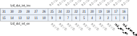
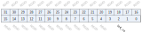

Register description
==========================

+------------------+-------------+
| Name             | Description |
+------------------+-------------+
| `lz4_config`_    |             |
+------------------+-------------+
| `lz4_src_fix`_   |             |
+------------------+-------------+
| `lz4_dst_fix`_   |             |
+------------------+-------------+
| `lz4_src_start`_ |             |
+------------------+-------------+
| `lz4_src_end`_   |             |
+------------------+-------------+
| `lz4_dst_start`_ |             |
+------------------+-------------+
| `lz4_dst_end`_   |             |
+------------------+-------------+
| `lz4_int_en`_    |             |
+------------------+-------------+
| `lz4_int_sta`_   |             |
+------------------+-------------+
| `lz4_monitor`_   |             |
+------------------+-------------+

lz4_config
------------
 
**Address：**  0x2000ad00
 
.. figure:: ../../picture/lz4_lz4_config.svg
   :align: center

.. table::
    :widths: 10, 15,10,10,55
    :width: 100%
    :align: center
     
    +----------+------------------------------+--------+-------------+----------------------------------------------------------------------+
    | Bit      | Name                         |Type    | Reset       | Description                                                          |
    +==========+==============================+========+=============+======================================================================+
    | 31:28    | rsvd                         | rsvd   | 0           |                                                                      |
    +----------+------------------------------+--------+-------------+----------------------------------------------------------------------+
    | 27:5     | RSVD                         |        |             |                                                                      |
    +----------+------------------------------+--------+-------------+----------------------------------------------------------------------+
    | 4        | lz4_checksum                 | r/w    | 0           | LZ4 block has checksum or not (info from frame header checksum flag) |
    +----------+------------------------------+--------+-------------+----------------------------------------------------------------------+
    | 3:2      | RSVD                         |        |             |                                                                      |
    +----------+------------------------------+--------+-------------+----------------------------------------------------------------------+
    | 1        | lz4_suspend                  | r/w    | 0           | LZ4 blocks decode suspend (FSM idle)                                 |
    +----------+------------------------------+--------+-------------+----------------------------------------------------------------------+
    | 0        | lz4_en                       | r/w    | 0           | LZ4 blocks decode enable (each block has size/sequences/checksum)    |
    +----------+------------------------------+--------+-------------+----------------------------------------------------------------------+

lz4_src_fix
-------------
 
**Address：**  0x2000ad04
 
.. figure:: ../../picture/lz4_lz4_src_fix.svg
   :align: center

.. table::
    :widths: 10, 15,10,10,55
    :width: 100%
    :align: center
     
    +----------+------------------------------+--------+-------------+-----------------------------+
    | Bit      | Name                         |Type    | Reset       | Description                 |
    +==========+==============================+========+=============+=============================+
    | 31:26    | RSVD                         |        |             |                             |
    +----------+------------------------------+--------+-------------+-----------------------------+
    | 25:12    | lz4_src_fix                  | r/w    | 0           | LZ4 source address fix bits |
    +----------+------------------------------+--------+-------------+-----------------------------+
    | 11:0     | RSVD                         |        |             |                             |
    +----------+------------------------------+--------+-------------+-----------------------------+

lz4_dst_fix
-------------
 
**Address：**  0x2000ad08
 
.. figure:: ../../picture/lz4_lz4_dst_fix.svg
   :align: center

.. table::
    :widths: 10, 15,10,10,55
    :width: 100%
    :align: center
     
    +----------+------------------------------+--------+-------------+----------------------------------+
    | Bit      | Name                         |Type    | Reset       | Description                      |
    +==========+==============================+========+=============+==================================+
    | 31:26    | RSVD                         |        |             |                                  |
    +----------+------------------------------+--------+-------------+----------------------------------+
    | 25:12    | lz4_dst_fix                  | r/w    | 0           | LZ4 destination address fix bits |
    +----------+------------------------------+--------+-------------+----------------------------------+
    | 11:0     | RSVD                         |        |             |                                  |
    +----------+------------------------------+--------+-------------+----------------------------------+

lz4_src_start
---------------
 
**Address：**  0x2000ad10
 
.. figure:: ../../picture/lz4_lz4_src_start.svg
   :align: center

.. table::
    :widths: 10, 15,10,10,55
    :width: 100%
    :align: center
     
    +----------+------------------------------+--------+-------------+-------------------------------+
    | Bit      | Name                         |Type    | Reset       | Description                   |
    +==========+==============================+========+=============+===============================+
    | 31:26    | lz4_src_base                 | r/w    | 0           | LZ4 source address base (fix) |
    +----------+------------------------------+--------+-------------+-------------------------------+
    | 25:0     | lz4_src_start                | r/w    | 0           | LZ4 source address start      |
    +----------+------------------------------+--------+-------------+-------------------------------+

lz4_src_end
-------------
 
**Address：**  0x2000ad14
 
.. figure:: ../../picture/lz4_lz4_src_end.svg
   :align: center

.. table::
    :widths: 10, 15,10,10,55
    :width: 100%
    :align: center
     
    +----------+------------------------------+--------+-------------+------------------------------------+
    | Bit      | Name                         |Type    | Reset       | Description                        |
    +==========+==============================+========+=============+====================================+
    | 31:26    | RSVD                         |        |             |                                    |
    +----------+------------------------------+--------+-------------+------------------------------------+
    | 25:0     | lz4_src_end                  | r      | 0           | LZ4 source address end (Max. 64MB) |
    +----------+------------------------------+--------+-------------+------------------------------------+

lz4_dst_start
---------------
 
**Address：**  0x2000ad18
 
.. figure:: ../../picture/lz4_lz4_dst_start.svg
   :align: center

.. table::
    :widths: 10, 15,10,10,55
    :width: 100%
    :align: center
     
    +----------+------------------------------+--------+-------------+------------------------------------+
    | Bit      | Name                         |Type    | Reset       | Description                        |
    +==========+==============================+========+=============+====================================+
    | 31:26    | lz4_dst_base                 | r/w    | 0           | LZ4 destination address base (fix) |
    +----------+------------------------------+--------+-------------+------------------------------------+
    | 25:0     | lz4_dst_start                | r/w    | 0           | LZ4 destination address start      |
    +----------+------------------------------+--------+-------------+------------------------------------+

lz4_dst_end
-------------
 
**Address：**  0x2000ad1c
 
.. figure:: ../../picture/lz4_lz4_dst_end.svg
   :align: center

.. table::
    :widths: 10, 15,10,10,55
    :width: 100%
    :align: center
     
    +----------+------------------------------+--------+-------------+-----------------------------------------+
    | Bit      | Name                         |Type    | Reset       | Description                             |
    +==========+==============================+========+=============+=========================================+
    | 31:26    | RSVD                         |        |             |                                         |
    +----------+------------------------------+--------+-------------+-----------------------------------------+
    | 25:0     | lz4_dst_end                  | r      | 0           | LZ4 destination address end (Max. 64MB) |
    +----------+------------------------------+--------+-------------+-----------------------------------------+

lz4_int_en
------------
 
**Address：**  0x2000ad20
 

.. table::
    :widths: 10, 15,10,10,55
    :width: 100%
    :align: center
     
    +----------+------------------------------+--------+-------------+-------------------------+
    | Bit      | Name                         |Type    | Reset       | Description             |
    +==========+==============================+========+=============+=========================+
    | 31:26    | lz4_dst_int_inv              | r/w    | 0           | 0: high int  1: low int |
    +----------+------------------------------+--------+-------------+-------------------------+
    | 25:16    | RSVD                         |        |             |                         |
    +----------+------------------------------+--------+-------------+-------------------------+
    | 15:10    | lz4_dst_int_en               | r/w    | 0           |                         |
    +----------+------------------------------+--------+-------------+-------------------------+
    | 9:2      | RSVD                         |        |             |                         |
    +----------+------------------------------+--------+-------------+-------------------------+
    | 1        | lz4_err_en                   | r/w    | 1           |                         |
    +----------+------------------------------+--------+-------------+-------------------------+
    | 0        | lz4_done_en                  | r/w    | 1           |                         |
    +----------+------------------------------+--------+-------------+-------------------------+

lz4_int_sta
-------------
 
**Address：**  0x2000ad24
 
.. figure:: ../../picture/lz4_lz4_int_sta.svg
   :align: center

.. table::
    :widths: 10, 15,10,10,55
    :width: 100%
    :align: center
     
    +----------+------------------------------+--------+-------------+------------------------------------+
    | Bit      | Name                         |Type    | Reset       | Description                        |
    +==========+==============================+========+=============+====================================+
    | 31:16    | RSVD                         |        |             |                                    |
    +----------+------------------------------+--------+-------------+------------------------------------+
    | 15:10    | lz4_dst_int_sta              | r      | 0           | LZ4 destination address bit change |
    +----------+------------------------------+--------+-------------+------------------------------------+
    | 9:2      | RSVD                         |        |             |                                    |
    +----------+------------------------------+--------+-------------+------------------------------------+
    | 1        | lz4_err_sta                  | r      | 0           |                                    |
    +----------+------------------------------+--------+-------------+------------------------------------+
    | 0        | lz4_done_sta                 | r      | 0           | LZ4 done status                    |
    +----------+------------------------------+--------+-------------+------------------------------------+

lz4_monitor
-------------
 
**Address：**  0x2000ad28
 

.. table::
    :widths: 10, 15,10,10,55
    :width: 100%
    :align: center
     
    +----------+------------------------------+--------+-------------+------------+
    | Bit      | Name                         |Type    | Reset       | Description|
    +==========+==============================+========+=============+============+
    | 31:4     | RSVD                         |        |             |            |
    +----------+------------------------------+--------+-------------+------------+
    | 3:0      | lz4_cs                       | r      | 0           |            |
    +----------+------------------------------+--------+-------------+------------+

