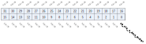
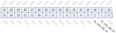
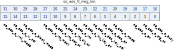
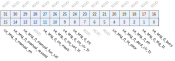
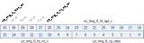
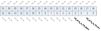
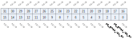
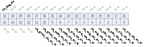

Register description
==========================

+-------------------------+-------------+
| Name                    | Description |
+-------------------------+-------------+
| `se_sha_0_ctrl`_        |             |
+-------------------------+-------------+
| `se_sha_0_msa`_         |             |
+-------------------------+-------------+
| `se_sha_0_status`_      |             |
+-------------------------+-------------+
| `se_sha_0_endian`_      |             |
+-------------------------+-------------+
| `se_sha_0_hash_l_0`_    |             |
+-------------------------+-------------+
| `se_sha_0_hash_l_1`_    |             |
+-------------------------+-------------+
| `se_sha_0_hash_l_2`_    |             |
+-------------------------+-------------+
| `se_sha_0_hash_l_3`_    |             |
+-------------------------+-------------+
| `se_sha_0_hash_l_4`_    |             |
+-------------------------+-------------+
| `se_sha_0_hash_l_5`_    |             |
+-------------------------+-------------+
| `se_sha_0_hash_l_6`_    |             |
+-------------------------+-------------+
| `se_sha_0_hash_l_7`_    |             |
+-------------------------+-------------+
| `se_sha_0_hash_h_0`_    |             |
+-------------------------+-------------+
| `se_sha_0_hash_h_1`_    |             |
+-------------------------+-------------+
| `se_sha_0_hash_h_2`_    |             |
+-------------------------+-------------+
| `se_sha_0_hash_h_3`_    |             |
+-------------------------+-------------+
| `se_sha_0_hash_h_4`_    |             |
+-------------------------+-------------+
| `se_sha_0_hash_h_5`_    |             |
+-------------------------+-------------+
| `se_sha_0_hash_h_6`_    |             |
+-------------------------+-------------+
| `se_sha_0_hash_h_7`_    |             |
+-------------------------+-------------+
| `se_sha_0_link`_        |             |
+-------------------------+-------------+
| `se_sha_0_ctrl_prot`_   |             |
+-------------------------+-------------+
| `se_aes_0_ctrl`_        |             |
+-------------------------+-------------+
| `se_aes_0_msa`_         |             |
+-------------------------+-------------+
| `se_aes_0_mda`_         |             |
+-------------------------+-------------+
| `se_aes_0_status`_      |             |
+-------------------------+-------------+
| `se_aes_0_iv_0`_        |             |
+-------------------------+-------------+
| `se_aes_0_iv_1`_        |             |
+-------------------------+-------------+
| `se_aes_0_iv_2`_        |             |
+-------------------------+-------------+
| `se_aes_0_iv_3`_        |             |
+-------------------------+-------------+
| `se_aes_0_key_0`_       |             |
+-------------------------+-------------+
| `se_aes_0_key_1`_       |             |
+-------------------------+-------------+
| `se_aes_0_key_2`_       |             |
+-------------------------+-------------+
| `se_aes_0_key_3`_       |             |
+-------------------------+-------------+
| `se_aes_0_key_4`_       |             |
+-------------------------+-------------+
| `se_aes_0_key_5`_       |             |
+-------------------------+-------------+
| `se_aes_0_key_6`_       |             |
+-------------------------+-------------+
| `se_aes_0_key_7`_       |             |
+-------------------------+-------------+
| `se_aes_0_key_sel`_     |             |
+-------------------------+-------------+
| `se_aes_1_key_sel`_     |             |
+-------------------------+-------------+
| `se_aes_0_endian`_      |             |
+-------------------------+-------------+
| `se_aes_sboot`_         |             |
+-------------------------+-------------+
| `se_aes_0_link`_        |             |
+-------------------------+-------------+
| `se_aes_0_ctrl_prot`_   |             |
+-------------------------+-------------+
| `se_trng_0_ctrl_0`_     |             |
+-------------------------+-------------+
| `se_trng_0_status`_     |             |
+-------------------------+-------------+
| `se_trng_0_dout_0`_     |             |
+-------------------------+-------------+
| `se_trng_0_dout_1`_     |             |
+-------------------------+-------------+
| `se_trng_0_dout_2`_     |             |
+-------------------------+-------------+
| `se_trng_0_dout_3`_     |             |
+-------------------------+-------------+
| `se_trng_0_dout_4`_     |             |
+-------------------------+-------------+
| `se_trng_0_dout_5`_     |             |
+-------------------------+-------------+
| `se_trng_0_dout_6`_     |             |
+-------------------------+-------------+
| `se_trng_0_dout_7`_     |             |
+-------------------------+-------------+
| `se_trng_0_test`_       |             |
+-------------------------+-------------+
| `se_trng_0_ctrl_1`_     |             |
+-------------------------+-------------+
| `se_trng_0_ctrl_2`_     |             |
+-------------------------+-------------+
| `se_trng_0_ctrl_3`_     |             |
+-------------------------+-------------+
| `se_trng_0_test_out_0`_ |             |
+-------------------------+-------------+
| `se_trng_0_test_out_1`_ |             |
+-------------------------+-------------+
| `se_trng_0_test_out_2`_ |             |
+-------------------------+-------------+
| `se_trng_0_test_out_3`_ |             |
+-------------------------+-------------+
| `se_trng_0_ctrl_prot`_  |             |
+-------------------------+-------------+
| `se_pka_0_ctrl_0`_      |             |
+-------------------------+-------------+
| `se_pka_0_seed`_        |             |
+-------------------------+-------------+
| `se_pka_0_ctrl_1`_      |             |
+-------------------------+-------------+
| `se_pka_0_rw`_          |             |
+-------------------------+-------------+
| `se_pka_0_rw_burst`_    |             |
+-------------------------+-------------+
| `se_pka_0_ctrl_prot`_   |             |
+-------------------------+-------------+
| `se_cdet_0_ctrl_0`_     |             |
+-------------------------+-------------+
| `se_cdet_0_ctrl_1`_     |             |
+-------------------------+-------------+
| `se_cdet_0_ctrl_prot`_  |             |
+-------------------------+-------------+
| `se_gmac_0_ctrl_0`_     |             |
+-------------------------+-------------+
| `se_gmac_0_lca`_        |             |
+-------------------------+-------------+
| `se_gmac_0_status`_     |             |
+-------------------------+-------------+
| `se_gmac_0_ctrl_prot`_  |             |
+-------------------------+-------------+
| `se_ctrl_prot_rd`_      |             |
+-------------------------+-------------+

se_sha_0_ctrl
---------------
 
**Address：**  0x20004000
 
.. figure:: ../../picture/sec_se_sha_0_ctrl.svg
   :align: center

.. table::
    :widths: 10, 15,10,10,55
    :width: 100%
    :align: center
     
    +----------+------------------------------+--------+-------------+-------------------------------------------------------------------------------------+
    | Bit      | Name                         |Type    | Reset       | Description                                                                         |
    +==========+==============================+========+=============+=====================================================================================+
    | 31:16    | se_sha_0_msg_len             | r/w    | 0           | number of 512-bit block                                                             |
    +----------+------------------------------+--------+-------------+-------------------------------------------------------------------------------------+
    | 15       | se_sha_0_link_mode           | r/w    | 0           | 1:enable sha link mode                                                              |
    +----------+------------------------------+--------+-------------+-------------------------------------------------------------------------------------+
    | 14       | RSVD                         |        |             |                                                                                     |
    +----------+------------------------------+--------+-------------+-------------------------------------------------------------------------------------+
    | 13:12    | se_sha_0_mode_ext            | r/w    | 0           | hash mode extention; 0:SHA 1:MD5 2:CRC-16 3:CRC-32                                  |
    +----------+------------------------------+--------+-------------+-------------------------------------------------------------------------------------+
    | 11       | se_sha_0_int_mask            | r/w    | 0           |                                                                                     |
    +----------+------------------------------+--------+-------------+-------------------------------------------------------------------------------------+
    | 10       | se_sha_0_int_set_1t          | w1p    | 0           | 1:set interrupt                                                                     |
    +----------+------------------------------+--------+-------------+-------------------------------------------------------------------------------------+
    | 9        | se_sha_0_int_clr_1t          | w1p    | 0           | 1:clear interrupt                                                                   |
    +----------+------------------------------+--------+-------------+-------------------------------------------------------------------------------------+
    | 8        | se_sha_0_int                 | r      | 0           | interrupt value                                                                     |
    +----------+------------------------------+--------+-------------+-------------------------------------------------------------------------------------+
    | 7        | RSVD                         |        |             |                                                                                     |
    +----------+------------------------------+--------+-------------+-------------------------------------------------------------------------------------+
    | 6        | se_sha_0_hash_sel            | r/w    | 0           | 0:new hash 1:accumulate last hash                                                   |
    +----------+------------------------------+--------+-------------+-------------------------------------------------------------------------------------+
    | 5        | se_sha_0_en                  | r/w    | 0           | 1:enable sha engine                                                                 |
    +----------+------------------------------+--------+-------------+-------------------------------------------------------------------------------------+
    | 4:2      | se_sha_0_mode                | r/w    | 0           | 0:SHA-256 1:SHA-224 2:SHA-1 3:SHA-1 4:SHA-512 5:SHA-384 6:SHA-512/224 7:SHA-512/256 |
    +----------+------------------------------+--------+-------------+-------------------------------------------------------------------------------------+
    | 1        | se_sha_0_trig_1t             | w1p    | 0           | 1:trigger sha engine                                                                |
    +----------+------------------------------+--------+-------------+-------------------------------------------------------------------------------------+
    | 0        | se_sha_0_busy                | r      | 0           | 1:sha engine busy                                                                   |
    +----------+------------------------------+--------+-------------+-------------------------------------------------------------------------------------+

se_sha_0_msa
--------------
 
**Address：**  0x20004004
 
.. figure:: ../../picture/sec_se_sha_0_msa.svg
   :align: center

.. table::
    :widths: 10, 15,10,10,55
    :width: 100%
    :align: center
     
    +----------+------------------------------+--------+-------------+------------------------+
    | Bit      | Name                         |Type    | Reset       | Description            |
    +==========+==============================+========+=============+========================+
    | 31:0     | se_sha_0_msa                 | r/w    | 0           | message source address |
    +----------+------------------------------+--------+-------------+------------------------+

se_sha_0_status
-----------------
 
**Address：**  0x20004008
 
.. figure:: ../../picture/sec_se_sha_0_status.svg
   :align: center

.. table::
    :widths: 10, 15,10,10,55
    :width: 100%
    :align: center
     
    +----------+------------------------------+--------+-------------+--+
    | Bit      | Name                         |Type    | Reset       | Description|
    +==========+==============================+========+=============+==+
    | 31:0     | se_sha_0_status              | r      | 32'h41      |  |
    +----------+------------------------------+--------+-------------+--+

se_sha_0_endian
-----------------
 
**Address：**  0x2000400c
 

.. table::
    :widths: 10, 15,10,10,55
    :width: 100%
    :align: center
     
    +----------+------------------------------+--------+-------------+------------------------------+
    | Bit      | Name                         |Type    | Reset       | Description                  |
    +==========+==============================+========+=============+==============================+
    | 31:1     | RSVD                         |        |             |                              |
    +----------+------------------------------+--------+-------------+------------------------------+
    | 0        | se_sha_0_dout_endian         | r/w    | 1           | 0:little-endian 1:big-endian |
    +----------+------------------------------+--------+-------------+------------------------------+

se_sha_0_hash_l_0
-------------------
 
**Address：**  0x20004010
 
.. figure:: ../../picture/sec_se_sha_0_hash_l_0.svg
   :align: center

.. table::
    :widths: 10, 15,10,10,55
    :width: 100%
    :align: center
     
    +----------+------------------------------+--------+-------------+-------------------------+
    | Bit      | Name                         |Type    | Reset       | Description             |
    +==========+==============================+========+=============+=========================+
    | 31:0     | se_sha_0_hash_l_0            | r      | 0           | big-endian hash 0 (MSB) |
    +----------+------------------------------+--------+-------------+-------------------------+

se_sha_0_hash_l_1
-------------------
 
**Address：**  0x20004014
 
.. figure:: ../../picture/sec_se_sha_0_hash_l_1.svg
   :align: center

.. table::
    :widths: 10, 15,10,10,55
    :width: 100%
    :align: center
     
    +----------+------------------------------+--------+-------------+-------------------+
    | Bit      | Name                         |Type    | Reset       | Description       |
    +==========+==============================+========+=============+===================+
    | 31:0     | se_sha_0_hash_l_1            | r      | 0           | big-endian hash 1 |
    +----------+------------------------------+--------+-------------+-------------------+

se_sha_0_hash_l_2
-------------------
 
**Address：**  0x20004018
 
.. figure:: ../../picture/sec_se_sha_0_hash_l_2.svg
   :align: center

.. table::
    :widths: 10, 15,10,10,55
    :width: 100%
    :align: center
     
    +----------+------------------------------+--------+-------------+-------------------+
    | Bit      | Name                         |Type    | Reset       | Description       |
    +==========+==============================+========+=============+===================+
    | 31:0     | se_sha_0_hash_l_2            | r      | 0           | big-endian hash 2 |
    +----------+------------------------------+--------+-------------+-------------------+

se_sha_0_hash_l_3
-------------------
 
**Address：**  0x2000401c
 
.. figure:: ../../picture/sec_se_sha_0_hash_l_3.svg
   :align: center

.. table::
    :widths: 10, 15,10,10,55
    :width: 100%
    :align: center
     
    +----------+------------------------------+--------+-------------+-------------------+
    | Bit      | Name                         |Type    | Reset       | Description       |
    +==========+==============================+========+=============+===================+
    | 31:0     | se_sha_0_hash_l_3            | r      | 0           | big-endian hash 3 |
    +----------+------------------------------+--------+-------------+-------------------+

se_sha_0_hash_l_4
-------------------
 
**Address：**  0x20004020
 
.. figure:: ../../picture/sec_se_sha_0_hash_l_4.svg
   :align: center

.. table::
    :widths: 10, 15,10,10,55
    :width: 100%
    :align: center
     
    +----------+------------------------------+--------+-------------+-------------------+
    | Bit      | Name                         |Type    | Reset       | Description       |
    +==========+==============================+========+=============+===================+
    | 31:0     | se_sha_0_hash_l_4            | r      | 0           | big-endian hash 4 |
    +----------+------------------------------+--------+-------------+-------------------+

se_sha_0_hash_l_5
-------------------
 
**Address：**  0x20004024
 
.. figure:: ../../picture/sec_se_sha_0_hash_l_5.svg
   :align: center

.. table::
    :widths: 10, 15,10,10,55
    :width: 100%
    :align: center
     
    +----------+------------------------------+--------+-------------+-------------------+
    | Bit      | Name                         |Type    | Reset       | Description       |
    +==========+==============================+========+=============+===================+
    | 31:0     | se_sha_0_hash_l_5            | r      | 0           | big-endian hash 5 |
    +----------+------------------------------+--------+-------------+-------------------+

se_sha_0_hash_l_6
-------------------
 
**Address：**  0x20004028
 
.. figure:: ../../picture/sec_se_sha_0_hash_l_6.svg
   :align: center

.. table::
    :widths: 10, 15,10,10,55
    :width: 100%
    :align: center
     
    +----------+------------------------------+--------+-------------+-------------------+
    | Bit      | Name                         |Type    | Reset       | Description       |
    +==========+==============================+========+=============+===================+
    | 31:0     | se_sha_0_hash_l_6            | r      | 0           | big-endian hash 6 |
    +----------+------------------------------+--------+-------------+-------------------+

se_sha_0_hash_l_7
-------------------
 
**Address：**  0x2000402c
 
.. figure:: ../../picture/sec_se_sha_0_hash_l_7.svg
   :align: center

.. table::
    :widths: 10, 15,10,10,55
    :width: 100%
    :align: center
     
    +----------+------------------------------+--------+-------------+-------------------------+
    | Bit      | Name                         |Type    | Reset       | Description             |
    +==========+==============================+========+=============+=========================+
    | 31:0     | se_sha_0_hash_l_7            | r      | 0           | big-endian hash 7 (LSB) |
    +----------+------------------------------+--------+-------------+-------------------------+

se_sha_0_hash_h_0
-------------------
 
**Address：**  0x20004030
 
.. figure:: ../../picture/sec_se_sha_0_hash_h_0.svg
   :align: center

.. table::
    :widths: 10, 15,10,10,55
    :width: 100%
    :align: center
     
    +----------+------------------------------+--------+-------------+-------------------------+
    | Bit      | Name                         |Type    | Reset       | Description             |
    +==========+==============================+========+=============+=========================+
    | 31:0     | se_sha_0_hash_h_0            | r      | 0           | big-endian hash 0 (MSB) |
    +----------+------------------------------+--------+-------------+-------------------------+

se_sha_0_hash_h_1
-------------------
 
**Address：**  0x20004034
 
.. figure:: ../../picture/sec_se_sha_0_hash_h_1.svg
   :align: center

.. table::
    :widths: 10, 15,10,10,55
    :width: 100%
    :align: center
     
    +----------+------------------------------+--------+-------------+-------------------+
    | Bit      | Name                         |Type    | Reset       | Description       |
    +==========+==============================+========+=============+===================+
    | 31:0     | se_sha_0_hash_h_1            | r      | 0           | big-endian hash 1 |
    +----------+------------------------------+--------+-------------+-------------------+

se_sha_0_hash_h_2
-------------------
 
**Address：**  0x20004038
 
.. figure:: ../../picture/sec_se_sha_0_hash_h_2.svg
   :align: center

.. table::
    :widths: 10, 15,10,10,55
    :width: 100%
    :align: center
     
    +----------+------------------------------+--------+-------------+-------------------+
    | Bit      | Name                         |Type    | Reset       | Description       |
    +==========+==============================+========+=============+===================+
    | 31:0     | se_sha_0_hash_h_2            | r      | 0           | big-endian hash 2 |
    +----------+------------------------------+--------+-------------+-------------------+

se_sha_0_hash_h_3
-------------------
 
**Address：**  0x2000403c
 

.. table::
    :widths: 10, 15,10,10,55
    :width: 100%
    :align: center
     
    +----------+------------------------------+--------+-------------+-------------------+
    | Bit      | Name                         |Type    | Reset       | Description       |
    +==========+==============================+========+=============+===================+
    | 31:0     | se_sha_0_hash_h_3            | r      | 0           | big-endian hash 3 |
    +----------+------------------------------+--------+-------------+-------------------+

se_sha_0_hash_h_4
-------------------
 
**Address：**  0x20004040
 
.. figure:: ../../picture/sec_se_sha_0_hash_h_4.svg
   :align: center

.. table::
    :widths: 10, 15,10,10,55
    :width: 100%
    :align: center
     
    +----------+------------------------------+--------+-------------+-------------------+
    | Bit      | Name                         |Type    | Reset       | Description       |
    +==========+==============================+========+=============+===================+
    | 31:0     | se_sha_0_hash_h_4            | r      | 0           | big-endian hash 4 |
    +----------+------------------------------+--------+-------------+-------------------+

se_sha_0_hash_h_5
-------------------
 
**Address：**  0x20004044
 
.. figure:: ../../picture/sec_se_sha_0_hash_h_5.svg
   :align: center

.. table::
    :widths: 10, 15,10,10,55
    :width: 100%
    :align: center
     
    +----------+------------------------------+--------+-------------+-------------------+
    | Bit      | Name                         |Type    | Reset       | Description       |
    +==========+==============================+========+=============+===================+
    | 31:0     | se_sha_0_hash_h_5            | r      | 0           | big-endian hash 5 |
    +----------+------------------------------+--------+-------------+-------------------+

se_sha_0_hash_h_6
-------------------
 
**Address：**  0x20004048
 
.. figure:: ../../picture/sec_se_sha_0_hash_h_6.svg
   :align: center

.. table::
    :widths: 10, 15,10,10,55
    :width: 100%
    :align: center
     
    +----------+------------------------------+--------+-------------+-------------------+
    | Bit      | Name                         |Type    | Reset       | Description       |
    +==========+==============================+========+=============+===================+
    | 31:0     | se_sha_0_hash_h_6            | r      | 0           | big-endian hash 6 |
    +----------+------------------------------+--------+-------------+-------------------+

se_sha_0_hash_h_7
-------------------
 
**Address：**  0x2000404c
 

.. table::
    :widths: 10, 15,10,10,55
    :width: 100%
    :align: center
     
    +----------+------------------------------+--------+-------------+-------------------------+
    | Bit      | Name                         |Type    | Reset       | Description             |
    +==========+==============================+========+=============+=========================+
    | 31:0     | se_sha_0_hash_h_7            | r      | 0           | big-endian hash 7 (LSB) |
    +----------+------------------------------+--------+-------------+-------------------------+

se_sha_0_link
---------------
 
**Address：**  0x20004050
 
.. figure:: ../../picture/sec_se_sha_0_link.svg
   :align: center

.. table::
    :widths: 10, 15,10,10,55
    :width: 100%
    :align: center
     
    +----------+------------------------------+--------+-------------+-------------------------------------+
    | Bit      | Name                         |Type    | Reset       | Description                         |
    +==========+==============================+========+=============+=====================================+
    | 31:0     | se_sha_0_lca                 | r/w    | 0           | aes link config address(word align) |
    +----------+------------------------------+--------+-------------+-------------------------------------+

se_sha_0_ctrl_prot
--------------------
 
**Address：**  0x200040fc
 

.. table::
    :widths: 10, 15,10,10,55
    :width: 100%
    :align: center
     
    +----------+------------------------------+--------+-------------+------------------+
    | Bit      | Name                         |Type    | Reset       | Description      |
    +==========+==============================+========+=============+==================+
    | 31:3     | RSVD                         |        |             |                  |
    +----------+------------------------------+--------+-------------+------------------+
    | 2        | se_sha_id1_en                | r/w    | 1           | id1 access right |
    +----------+------------------------------+--------+-------------+------------------+
    | 1        | se_sha_id0_en                | r/w    | 1           | id0 access right |
    +----------+------------------------------+--------+-------------+------------------+
    | 0        | RSVD                         |        |             |                  |
    +----------+------------------------------+--------+-------------+------------------+

se_aes_0_ctrl
---------------
 
**Address：**  0x20004100
 

.. table::
    :widths: 10, 15,10,10,55
    :width: 100%
    :align: center
     
    +----------+------------------------------+--------+-------------+------------------------------------------------------------------------+
    | Bit      | Name                         |Type    | Reset       | Description                                                            |
    +==========+==============================+========+=============+========================================================================+
    | 31:16    | se_aes_0_msg_len             | r/w    | 0           | number of 128-bit block                                                |
    +----------+------------------------------+--------+-------------+------------------------------------------------------------------------+
    | 15       | se_aes_0_link_mode           | r/w    | 0           | 1:enable aes link mode                                                 |
    +----------+------------------------------+--------+-------------+------------------------------------------------------------------------+
    | 14       | se_aes_0_iv_sel              | r/w    | 0           | 0:new iv 1:same iv as last one                                         |
    +----------+------------------------------+--------+-------------+------------------------------------------------------------------------+
    | 13:12    | se_aes_0_block_mode          | r/w    | 0           | 0:ECB mode 1:CTR mode 2:CBC mode 3:XTS mode                            |
    +----------+------------------------------+--------+-------------+------------------------------------------------------------------------+
    | 11       | se_aes_0_int_mask            | r/w    | 0           |                                                                        |
    +----------+------------------------------+--------+-------------+------------------------------------------------------------------------+
    | 10       | se_aes_0_int_set_1t          | w1p    | 0           | 1:set interrupt                                                        |
    +----------+------------------------------+--------+-------------+------------------------------------------------------------------------+
    | 9        | se_aes_0_int_clr_1t          | w1p    | 0           | 1:clear interrupt                                                      |
    +----------+------------------------------+--------+-------------+------------------------------------------------------------------------+
    | 8        | se_aes_0_int                 | r      | 0           | interrupt value                                                        |
    +----------+------------------------------+--------+-------------+------------------------------------------------------------------------+
    | 7        | se_aes_0_hw_key_en           | r/w    | 0           | 0:sw key 1:hw key                                                      |
    +----------+------------------------------+--------+-------------+------------------------------------------------------------------------+
    | 6        | se_aes_0_dec_key_sel         | r/w    | 0           | 0:new key 1:same key as last one                                       |
    +----------+------------------------------+--------+-------------+------------------------------------------------------------------------+
    | 5        | se_aes_0_dec_en              | r/w    | 0           | 0:encode 1:decode                                                      |
    +----------+------------------------------+--------+-------------+------------------------------------------------------------------------+
    | 4:3      | se_aes_0_mode                | r/w    | 0           | 0:128-bit mode 1:256-bit mode 2:192-bit mode 3:128-bit double key mode |
    +----------+------------------------------+--------+-------------+------------------------------------------------------------------------+
    | 2        | se_aes_0_en                  | r/w    | 0           | 0:disable 1:enable aes                                                 |
    +----------+------------------------------+--------+-------------+------------------------------------------------------------------------+
    | 1        | se_aes_0_trig_1t             | w1p    | 0           | 1:trigger aes engine                                                   |
    +----------+------------------------------+--------+-------------+------------------------------------------------------------------------+
    | 0        | se_aes_0_busy                | r      | 0           | 1:aes engine busy                                                      |
    +----------+------------------------------+--------+-------------+------------------------------------------------------------------------+

se_aes_0_msa
--------------
 
**Address：**  0x20004104
 

.. table::
    :widths: 10, 15,10,10,55
    :width: 100%
    :align: center
     
    +----------+------------------------------+--------+-------------+------------------------+
    | Bit      | Name                         |Type    | Reset       | Description            |
    +==========+==============================+========+=============+========================+
    | 31:0     | se_aes_0_msa                 | r/w    | 0           | message source address |
    +----------+------------------------------+--------+-------------+------------------------+

se_aes_0_mda
--------------
 
**Address：**  0x20004108
 
.. figure:: ../../picture/sec_se_aes_0_mda.svg
   :align: center

.. table::
    :widths: 10, 15,10,10,55
    :width: 100%
    :align: center
     
    +----------+------------------------------+--------+-------------+-----------------------------+
    | Bit      | Name                         |Type    | Reset       | Description                 |
    +==========+==============================+========+=============+=============================+
    | 31:0     | se_aes_0_mda                 | r/w    | 0           | message destination address |
    +----------+------------------------------+--------+-------------+-----------------------------+

se_aes_0_status
-----------------
 
**Address：**  0x2000410c
 

.. table::
    :widths: 10, 15,10,10,55
    :width: 100%
    :align: center
     
    +----------+------------------------------+--------+-------------+--+
    | Bit      | Name                         |Type    | Reset       | Description|
    +==========+==============================+========+=============+==+
    | 31:0     | se_aes_0_status              | r      | 32'h4100    |  |
    +----------+------------------------------+--------+-------------+--+

se_aes_0_iv_0
---------------
 
**Address：**  0x20004110
 
.. figure:: ../../picture/sec_se_aes_0_iv_0.svg
   :align: center

.. table::
    :widths: 10, 15,10,10,55
    :width: 100%
    :align: center
     
    +----------+------------------------------+--------+-------------+---------------------------------+
    | Bit      | Name                         |Type    | Reset       | Description                     |
    +==========+==============================+========+=============+=================================+
    | 31:0     | se_aes_0_iv_0                | r/w    | 0           | big endian initial vector (MSB) |
    +----------+------------------------------+--------+-------------+---------------------------------+

se_aes_0_iv_1
---------------
 
**Address：**  0x20004114
 
.. figure:: ../../picture/sec_se_aes_0_iv_1.svg
   :align: center

.. table::
    :widths: 10, 15,10,10,55
    :width: 100%
    :align: center
     
    +----------+------------------------------+--------+-------------+---------------------------+
    | Bit      | Name                         |Type    | Reset       | Description               |
    +==========+==============================+========+=============+===========================+
    | 31:0     | se_aes_0_iv_1                | r/w    | 0           | big endian initial vector |
    +----------+------------------------------+--------+-------------+---------------------------+

se_aes_0_iv_2
---------------
 
**Address：**  0x20004118
 
.. figure:: ../../picture/sec_se_aes_0_iv_2.svg
   :align: center

.. table::
    :widths: 10, 15,10,10,55
    :width: 100%
    :align: center
     
    +----------+------------------------------+--------+-------------+---------------------------+
    | Bit      | Name                         |Type    | Reset       | Description               |
    +==========+==============================+========+=============+===========================+
    | 31:0     | se_aes_0_iv_2                | r/w    | 0           | big endian initial vector |
    +----------+------------------------------+--------+-------------+---------------------------+

se_aes_0_iv_3
---------------
 
**Address：**  0x2000411c
 

.. table::
    :widths: 10, 15,10,10,55
    :width: 100%
    :align: center
     
    +----------+------------------------------+--------+-------------+--------------------------------------------------------------------------+
    | Bit      | Name                         |Type    | Reset       | Description                                                              |
    +==========+==============================+========+=============+==========================================================================+
    | 31:0     | se_aes_0_iv_3                | r/w    | 0           | big endian initial vector (LSB) (CTR mode: 32-bit counter initial value) |
    +----------+------------------------------+--------+-------------+--------------------------------------------------------------------------+

se_aes_0_key_0
----------------
 
**Address：**  0x20004120
 
.. figure:: ../../picture/sec_se_aes_0_key_0.svg
   :align: center

.. table::
    :widths: 10, 15,10,10,55
    :width: 100%
    :align: center
     
    +----------+------------------------------+--------+-------------+------------------------------------------+
    | Bit      | Name                         |Type    | Reset       | Description                              |
    +==========+==============================+========+=============+==========================================+
    | 31:0     | se_aes_0_key_0               | r/w    | 0           | big endian aes key (aes-128/256 key MSB) |
    +----------+------------------------------+--------+-------------+------------------------------------------+

se_aes_0_key_1
----------------
 
**Address：**  0x20004124
 
.. figure:: ../../picture/sec_se_aes_0_key_1.svg
   :align: center

.. table::
    :widths: 10, 15,10,10,55
    :width: 100%
    :align: center
     
    +----------+------------------------------+--------+-------------+--------------------+
    | Bit      | Name                         |Type    | Reset       | Description        |
    +==========+==============================+========+=============+====================+
    | 31:0     | se_aes_0_key_1               | r/w    | 0           | big endian aes key |
    +----------+------------------------------+--------+-------------+--------------------+

se_aes_0_key_2
----------------
 
**Address：**  0x20004128
 
.. figure:: ../../picture/sec_se_aes_0_key_2.svg
   :align: center

.. table::
    :widths: 10, 15,10,10,55
    :width: 100%
    :align: center
     
    +----------+------------------------------+--------+-------------+--------------------+
    | Bit      | Name                         |Type    | Reset       | Description        |
    +==========+==============================+========+=============+====================+
    | 31:0     | se_aes_0_key_2               | r/w    | 0           | big endian aes key |
    +----------+------------------------------+--------+-------------+--------------------+

se_aes_0_key_3
----------------
 
**Address：**  0x2000412c
 
.. figure:: ../../picture/sec_se_aes_0_key_3.svg
   :align: center

.. table::
    :widths: 10, 15,10,10,55
    :width: 100%
    :align: center
     
    +----------+------------------------------+--------+-------------+--------------------------------------+
    | Bit      | Name                         |Type    | Reset       | Description                          |
    +==========+==============================+========+=============+======================================+
    | 31:0     | se_aes_0_key_3               | r/w    | 0           | big endian aes key (aes-128 key LSB) |
    +----------+------------------------------+--------+-------------+--------------------------------------+

se_aes_0_key_4
----------------
 
**Address：**  0x20004130
 

.. table::
    :widths: 10, 15,10,10,55
    :width: 100%
    :align: center
     
    +----------+------------------------------+--------+-------------+--------------------+
    | Bit      | Name                         |Type    | Reset       | Description        |
    +==========+==============================+========+=============+====================+
    | 31:0     | se_aes_0_key_4               | r/w    | 0           | big endian aes key |
    +----------+------------------------------+--------+-------------+--------------------+

se_aes_0_key_5
----------------
 
**Address：**  0x20004134
 
.. figure:: ../../picture/sec_se_aes_0_key_5.svg
   :align: center

.. table::
    :widths: 10, 15,10,10,55
    :width: 100%
    :align: center
     
    +----------+------------------------------+--------+-------------+--------------------+
    | Bit      | Name                         |Type    | Reset       | Description        |
    +==========+==============================+========+=============+====================+
    | 31:0     | se_aes_0_key_5               | r/w    | 0           | big endian aes key |
    +----------+------------------------------+--------+-------------+--------------------+

se_aes_0_key_6
----------------
 
**Address：**  0x20004138
 
.. figure:: ../../picture/sec_se_aes_0_key_6.svg
   :align: center

.. table::
    :widths: 10, 15,10,10,55
    :width: 100%
    :align: center
     
    +----------+------------------------------+--------+-------------+--------------------+
    | Bit      | Name                         |Type    | Reset       | Description        |
    +==========+==============================+========+=============+====================+
    | 31:0     | se_aes_0_key_6               | r/w    | 0           | big endian aes key |
    +----------+------------------------------+--------+-------------+--------------------+

se_aes_0_key_7
----------------
 
**Address：**  0x2000413c
 
.. figure:: ../../picture/sec_se_aes_0_key_7.svg
   :align: center

.. table::
    :widths: 10, 15,10,10,55
    :width: 100%
    :align: center
     
    +----------+------------------------------+--------+-------------+--------------------------------------+
    | Bit      | Name                         |Type    | Reset       | Description                          |
    +==========+==============================+========+=============+======================================+
    | 31:0     | se_aes_0_key_7               | r/w    | 0           | big endian aes key (aes-256 key LSB) |
    +----------+------------------------------+--------+-------------+--------------------------------------+

se_aes_0_key_sel
------------------
 
**Address：**  0x20004140
 
.. figure:: ../../picture/sec_se_aes_0_key_sel.svg
   :align: center

.. table::
    :widths: 10, 15,10,10,55
    :width: 100%
    :align: center
     
    +----------+------------------------------+--------+-------------+---+
    | Bit      | Name                         |Type    | Reset       | Description|
    +==========+==============================+========+=============+===+
    | 31:2     | RSVD                         |        |             |   |
    +----------+------------------------------+--------+-------------+---+
    | 1:0      | se_aes_0_key_sel             | r/w    | 0           |   |
    +----------+------------------------------+--------+-------------+---+

se_aes_1_key_sel
------------------
 
**Address：**  0x20004144
 
.. figure:: ../../picture/sec_se_aes_1_key_sel.svg
   :align: center

.. table::
    :widths: 10, 15,10,10,55
    :width: 100%
    :align: center
     
    +----------+------------------------------+--------+-------------+---+
    | Bit      | Name                         |Type    | Reset       | Description|
    +==========+==============================+========+=============+===+
    | 31:2     | RSVD                         |        |             |   |
    +----------+------------------------------+--------+-------------+---+
    | 1:0      | se_aes_1_key_sel             | r/w    | 0           |   |
    +----------+------------------------------+--------+-------------+---+

se_aes_0_endian
-----------------
 
**Address：**  0x20004148
 
.. figure:: ../../picture/sec_se_aes_0_endian.svg
   :align: center

.. table::
    :widths: 10, 15,10,10,55
    :width: 100%
    :align: center
     
    +----------+------------------------------+--------+-------------+------------------------------------------------------------------------------------+
    | Bit      | Name                         |Type    | Reset       | Description                                                                        |
    +==========+==============================+========+=============+====================================================================================+
    | 31:30    | se_aes_0_ctr_len             | r/w    | 0           | 2'd0:4-byte counter, 2'd1:1-byte counter, 2'd2:2-byte counter, 2'd3:3-byte counter |
    +----------+------------------------------+--------+-------------+------------------------------------------------------------------------------------+
    | 29:5     | RSVD                         |        |             |                                                                                    |
    +----------+------------------------------+--------+-------------+------------------------------------------------------------------------------------+
    | 4        | se_aes_0_twk_endian          | r/w    | 1           | 0:little-endian 1:big-endian, default 1 for XTS                                    |
    +----------+------------------------------+--------+-------------+------------------------------------------------------------------------------------+
    | 3        | se_aes_0_iv_endian           | r/w    | 1           | 0:little-endian 1:big-endian                                                       |
    +----------+------------------------------+--------+-------------+------------------------------------------------------------------------------------+
    | 2        | se_aes_0_key_endian          | r/w    | 1           | 0:little-endian 1:big-endian                                                       |
    +----------+------------------------------+--------+-------------+------------------------------------------------------------------------------------+
    | 1        | se_aes_0_din_endian          | r/w    | 1           | 0:little-endian 1:big-endian                                                       |
    +----------+------------------------------+--------+-------------+------------------------------------------------------------------------------------+
    | 0        | se_aes_0_dout_endian         | r/w    | 1           | 0:little-endian 1:big-endian                                                       |
    +----------+------------------------------+--------+-------------+------------------------------------------------------------------------------------+

se_aes_sboot
--------------
 
**Address：**  0x2000414c
 
.. figure:: ../../picture/sec_se_aes_sboot.svg
   :align: center

.. table::
    :widths: 10, 15,10,10,55
    :width: 100%
    :align: center
     
    +----------+------------------------------+--------+-------------+------------------------------------------------------------------------------------+
    | Bit      | Name                         |Type    | Reset       | Description                                                                        |
    +==========+==============================+========+=============+====================================================================================+
    | 31:16    | se_aes_0_uni_len             | r/w    | 16'd2       | XTS data unit length: number of 128-bit blocks in a data unit, msg_len = N*uni_len |
    +----------+------------------------------+--------+-------------+------------------------------------------------------------------------------------+
    | 15       | se_aes_0_xts_mode            | r/w    | 0           | 0: normal XTS, 1: XTS with only one data unit                                      |
    +----------+------------------------------+--------+-------------+------------------------------------------------------------------------------------+
    | 14:1     | RSVD                         |        |             |                                                                                    |
    +----------+------------------------------+--------+-------------+------------------------------------------------------------------------------------+
    | 0        | se_aes_sboot_key_sel         | r/w    | 0           |                                                                                    |
    +----------+------------------------------+--------+-------------+------------------------------------------------------------------------------------+

se_aes_0_link
---------------
 
**Address：**  0x20004150
 

.. table::
    :widths: 10, 15,10,10,55
    :width: 100%
    :align: center
     
    +----------+------------------------------+--------+-------------+-------------------------------------+
    | Bit      | Name                         |Type    | Reset       | Description                         |
    +==========+==============================+========+=============+=====================================+
    | 31:0     | se_aes_0_lca                 | r/w    | 0           | aes link config address(word align) |
    +----------+------------------------------+--------+-------------+-------------------------------------+

se_aes_0_ctrl_prot
--------------------
 
**Address：**  0x200041fc
 
.. figure:: ../../picture/sec_se_aes_0_ctrl_prot.svg
   :align: center

.. table::
    :widths: 10, 15,10,10,55
    :width: 100%
    :align: center
     
    +----------+------------------------------+--------+-------------+------------------+
    | Bit      | Name                         |Type    | Reset       | Description      |
    +==========+==============================+========+=============+==================+
    | 31:3     | RSVD                         |        |             |                  |
    +----------+------------------------------+--------+-------------+------------------+
    | 2        | se_aes_id1_en                | r/w    | 1           | id1 access right |
    +----------+------------------------------+--------+-------------+------------------+
    | 1        | se_aes_id0_en                | r/w    | 1           | id0 access right |
    +----------+------------------------------+--------+-------------+------------------+
    | 0        | RSVD                         |        |             |                  |
    +----------+------------------------------+--------+-------------+------------------+

se_trng_0_ctrl_0
------------------
 
**Address：**  0x20004200
 

.. table::
    :widths: 10, 15,10,10,55
    :width: 100%
    :align: center
     
    +----------+------------------------------+--------+-------------+----------------------------------------------------+
    | Bit      | Name                         |Type    | Reset       | Description                                        |
    +==========+==============================+========+=============+====================================================+
    | 31:16    | RSVD                         |        |             |                                                    |
    +----------+------------------------------+--------+-------------+----------------------------------------------------+
    | 15       | se_trng_0_manual_en          | r/w    | 0           | 1:enable manual mode                               |
    +----------+------------------------------+--------+-------------+----------------------------------------------------+
    | 14       | se_trng_0_manual_reseed      | r/w    | 0           | 1:clear reseed counter to zero and get new entropy |
    +----------+------------------------------+--------+-------------+----------------------------------------------------+
    | 13       | se_trng_0_manual_fun_sel     | r/w    | 0           | 0:go to instantiate state 1:go to generate state   |
    +----------+------------------------------+--------+-------------+----------------------------------------------------+
    | 12       | RSVD                         |        |             |                                                    |
    +----------+------------------------------+--------+-------------+----------------------------------------------------+
    | 11       | se_trng_0_int_mask           | r/w    | 0           |                                                    |
    +----------+------------------------------+--------+-------------+----------------------------------------------------+
    | 10       | se_trng_0_int_set_1t         | w1p    | 0           | 1:set interrupt                                    |
    +----------+------------------------------+--------+-------------+----------------------------------------------------+
    | 9        | se_trng_0_int_clr_1t         | w1p    | 0           | 1:clear interrupt                                  |
    +----------+------------------------------+--------+-------------+----------------------------------------------------+
    | 8        | se_trng_0_int                | r      | 0           | interrupt value                                    |
    +----------+------------------------------+--------+-------------+----------------------------------------------------+
    | 7:5      | RSVD                         |        |             |                                                    |
    +----------+------------------------------+--------+-------------+----------------------------------------------------+
    | 4        | se_trng_0_ht_error           | r      | 0           | 1:health test error                                |
    +----------+------------------------------+--------+-------------+----------------------------------------------------+
    | 3        | se_trng_0_dout_clr_1t        | w1p    | 0           | 1:clear trng dout to zero                          |
    +----------+------------------------------+--------+-------------+----------------------------------------------------+
    | 2        | se_trng_0_en                 | r/w    | 0           | 0:disable 1:enable aes                             |
    +----------+------------------------------+--------+-------------+----------------------------------------------------+
    | 1        | se_trng_0_trig_1t            | w1p    | 0           | 1:trigger trng engine                              |
    +----------+------------------------------+--------+-------------+----------------------------------------------------+
    | 0        | se_trng_0_busy               | r      | 0           | 1:trng engine busy                                 |
    +----------+------------------------------+--------+-------------+----------------------------------------------------+

se_trng_0_status
------------------
 
**Address：**  0x20004204
 

.. table::
    :widths: 10, 15,10,10,55
    :width: 100%
    :align: center
     
    +----------+------------------------------+--------+-------------+--+
    | Bit      | Name                         |Type    | Reset       | Description|
    +==========+==============================+========+=============+==+
    | 31:0     | se_trng_0_status             | r      | 32'h100020  |  |
    +----------+------------------------------+--------+-------------+--+

se_trng_0_dout_0
------------------
 
**Address：**  0x20004208
 
.. figure:: ../../picture/sec_se_trng_0_dout_0.svg
   :align: center

.. table::
    :widths: 10, 15,10,10,55
    :width: 100%
    :align: center
     
    +----------+------------------------------+--------+-------------+--------------+
    | Bit      | Name                         |Type    | Reset       | Description  |
    +==========+==============================+========+=============+==============+
    | 31:0     | se_trng_0_dout_0             | r      | 0           | random value |
    +----------+------------------------------+--------+-------------+--------------+

se_trng_0_dout_1
------------------
 
**Address：**  0x2000420c
 
.. figure:: ../../picture/sec_se_trng_0_dout_1.svg
   :align: center

.. table::
    :widths: 10, 15,10,10,55
    :width: 100%
    :align: center
     
    +----------+------------------------------+--------+-------------+--------------+
    | Bit      | Name                         |Type    | Reset       | Description  |
    +==========+==============================+========+=============+==============+
    | 31:0     | se_trng_0_dout_1             | r      | 0           | random value |
    +----------+------------------------------+--------+-------------+--------------+

se_trng_0_dout_2
------------------
 
**Address：**  0x20004210
 
.. figure:: ../../picture/sec_se_trng_0_dout_2.svg
   :align: center

.. table::
    :widths: 10, 15,10,10,55
    :width: 100%
    :align: center
     
    +----------+------------------------------+--------+-------------+--------------+
    | Bit      | Name                         |Type    | Reset       | Description  |
    +==========+==============================+========+=============+==============+
    | 31:0     | se_trng_0_dout_2             | r      | 0           | random value |
    +----------+------------------------------+--------+-------------+--------------+

se_trng_0_dout_3
------------------
 
**Address：**  0x20004214
 

.. table::
    :widths: 10, 15,10,10,55
    :width: 100%
    :align: center
     
    +----------+------------------------------+--------+-------------+--------------+
    | Bit      | Name                         |Type    | Reset       | Description  |
    +==========+==============================+========+=============+==============+
    | 31:0     | se_trng_0_dout_3             | r      | 0           | random value |
    +----------+------------------------------+--------+-------------+--------------+

se_trng_0_dout_4
------------------
 
**Address：**  0x20004218
 
.. figure:: ../../picture/sec_se_trng_0_dout_4.svg
   :align: center

.. table::
    :widths: 10, 15,10,10,55
    :width: 100%
    :align: center
     
    +----------+------------------------------+--------+-------------+--------------+
    | Bit      | Name                         |Type    | Reset       | Description  |
    +==========+==============================+========+=============+==============+
    | 31:0     | se_trng_0_dout_4             | r      | 0           | random value |
    +----------+------------------------------+--------+-------------+--------------+

se_trng_0_dout_5
------------------
 
**Address：**  0x2000421c
 
.. figure:: ../../picture/sec_se_trng_0_dout_5.svg
   :align: center

.. table::
    :widths: 10, 15,10,10,55
    :width: 100%
    :align: center
     
    +----------+------------------------------+--------+-------------+--------------+
    | Bit      | Name                         |Type    | Reset       | Description  |
    +==========+==============================+========+=============+==============+
    | 31:0     | se_trng_0_dout_5             | r      | 0           | random value |
    +----------+------------------------------+--------+-------------+--------------+

se_trng_0_dout_6
------------------
 
**Address：**  0x20004220
 
.. figure:: ../../picture/sec_se_trng_0_dout_6.svg
   :align: center

.. table::
    :widths: 10, 15,10,10,55
    :width: 100%
    :align: center
     
    +----------+------------------------------+--------+-------------+--------------+
    | Bit      | Name                         |Type    | Reset       | Description  |
    +==========+==============================+========+=============+==============+
    | 31:0     | se_trng_0_dout_6             | r      | 0           | random value |
    +----------+------------------------------+--------+-------------+--------------+

se_trng_0_dout_7
------------------
 
**Address：**  0x20004224
 
.. figure:: ../../picture/sec_se_trng_0_dout_7.svg
   :align: center

.. table::
    :widths: 10, 15,10,10,55
    :width: 100%
    :align: center
     
    +----------+------------------------------+--------+-------------+--------------+
    | Bit      | Name                         |Type    | Reset       | Description  |
    +==========+==============================+========+=============+==============+
    | 31:0     | se_trng_0_dout_7             | r      | 0           | random value |
    +----------+------------------------------+--------+-------------+--------------+

se_trng_0_test
----------------
 
**Address：**  0x20004228
 
.. figure:: ../../picture/sec_se_trng_0_test.svg
   :align: center

.. table::
    :widths: 10, 15,10,10,55
    :width: 100%
    :align: center
     
    +----------+------------------------------+--------+-------------+----------------------------------------------------------------------------------------------+
    | Bit      | Name                         |Type    | Reset       | Description                                                                                  |
    +==========+==============================+========+=============+==============================================================================================+
    | 31:12    | RSVD                         |        |             |                                                                                              |
    +----------+------------------------------+--------+-------------+----------------------------------------------------------------------------------------------+
    | 11:4     | se_trng_0_ht_alarm_n         | r/w    | 8'd0        | health test alarm number                                                                     |
    +          +                              +        +             +                                                                                              +
    |          |                              |        |             | 0:alarm if health test error >= 1                                                            |
    +          +                              +        +             +                                                                                              +
    |          |                              |        |             | 1:alarm if health test error >= 2                                                            |
    +----------+------------------------------+--------+-------------+----------------------------------------------------------------------------------------------+
    | 3        | se_trng_0_ht_dis             | r/w    | 0           | 1:disable health test                                                                        |
    +----------+------------------------------+--------+-------------+----------------------------------------------------------------------------------------------+
    | 2        | se_trng_0_cp_bypass          | r/w    | 0           | 1:bypass conditional component                                                               |
    +----------+------------------------------+--------+-------------+----------------------------------------------------------------------------------------------+
    | 1        | se_trng_0_cp_test_en         | r/w    | 0           | 1:enable trng conditional component test mode                                                |
    +----------+------------------------------+--------+-------------+----------------------------------------------------------------------------------------------+
    | 0        | se_trng_0_test_en            | r/w    | 0           | 1:enable trng test mode                                                                      |
    +----------+------------------------------+--------+-------------+----------------------------------------------------------------------------------------------+

se_trng_0_ctrl_1
------------------
 
**Address：**  0x2000422c
 
.. figure:: ../../picture/sec_se_trng_0_ctrl_1.svg
   :align: center

.. table::
    :widths: 10, 15,10,10,55
    :width: 100%
    :align: center
     
    +----------+------------------------------+--------+-------------+----------------------------------------------------------------------+
    | Bit      | Name                         |Type    | Reset       | Description                                                          |
    +==========+==============================+========+=============+======================================================================+
    | 31:0     | se_trng_0_reseed_n_lsb       | r/w    | 32'hffff    | reload seed when number of used random value is larger than reseed_n |
    +----------+------------------------------+--------+-------------+----------------------------------------------------------------------+

se_trng_0_ctrl_2
------------------
 
**Address：**  0x20004230
 

.. table::
    :widths: 10, 15,10,10,55
    :width: 100%
    :align: center
     
    +----------+------------------------------+--------+-------------+----------------------------------------------------------------------+
    | Bit      | Name                         |Type    | Reset       | Description                                                          |
    +==========+==============================+========+=============+======================================================================+
    | 31:16    | RSVD                         |        |             |                                                                      |
    +----------+------------------------------+--------+-------------+----------------------------------------------------------------------+
    | 15:0     | se_trng_0_reseed_n_msb       | r/w    | 16'hff      | reload seed when number of used random value is larger than reseed_n |
    +----------+------------------------------+--------+-------------+----------------------------------------------------------------------+

se_trng_0_ctrl_3
------------------
 
**Address：**  0x20004234
 

.. table::
    :widths: 10, 15,10,10,55
    :width: 100%
    :align: center
     
    +----------+------------------------------+--------+-------------+----------------------------------------------------+
    | Bit      | Name                         |Type    | Reset       | Description                                        |
    +==========+==============================+========+=============+====================================================+
    | 31       | se_trng_0_rosc_en            | r/w    | 0           | trng rosc enable                                   |
    +----------+------------------------------+--------+-------------+----------------------------------------------------+
    | 30:27    | RSVD                         |        |             |                                                    |
    +----------+------------------------------+--------+-------------+----------------------------------------------------+
    | 26       | se_trng_0_ht_od_en           | r/w    | 0           | health test on demand test enable                  |
    +----------+------------------------------+--------+-------------+----------------------------------------------------+
    | 25:16    | se_trng_0_ht_apt_c           | r/w    | 10'd890     | health test adaptive proportion test cut off value |
    +----------+------------------------------+--------+-------------+----------------------------------------------------+
    | 15:8     | se_trng_0_ht_rct_c           | r/w    | 8'd66       | health test repetition count test cut off value    |
    +----------+------------------------------+--------+-------------+----------------------------------------------------+
    | 7:0      | se_trng_0_cp_ratio           | r/w    | 8'd3        | conditional component compression ration           |
    +----------+------------------------------+--------+-------------+----------------------------------------------------+

se_trng_0_test_out_0
----------------------
 
**Address：**  0x20004240
 
.. figure:: ../../picture/sec_se_trng_0_test_out_0.svg
   :align: center

.. table::
    :widths: 10, 15,10,10,55
    :width: 100%
    :align: center
     
    +----------+------------------------------+--------+-------------+------------+
    | Bit      | Name                         |Type    | Reset       | Description|
    +==========+==============================+========+=============+============+
    | 31:0     | se_trng_0_test_out_0         | r      | 0           |            |
    +----------+------------------------------+--------+-------------+------------+

se_trng_0_test_out_1
----------------------
 
**Address：**  0x20004244
 
.. figure:: ../../picture/sec_se_trng_0_test_out_1.svg
   :align: center

.. table::
    :widths: 10, 15,10,10,55
    :width: 100%
    :align: center
     
    +----------+------------------------------+--------+-------------+------------+
    | Bit      | Name                         |Type    | Reset       | Description|
    +==========+==============================+========+=============+============+
    | 31:0     | se_trng_0_test_out_1         | r      | 0           |            |
    +----------+------------------------------+--------+-------------+------------+

se_trng_0_test_out_2
----------------------
 
**Address：**  0x20004248
 
.. figure:: ../../picture/sec_se_trng_0_test_out_2.svg
   :align: center

.. table::
    :widths: 10, 15,10,10,55
    :width: 100%
    :align: center
     
    +----------+------------------------------+--------+-------------+------------+
    | Bit      | Name                         |Type    | Reset       | Description|
    +==========+==============================+========+=============+============+
    | 31:0     | se_trng_0_test_out_2         | r      | 0           |            |
    +----------+------------------------------+--------+-------------+------------+

se_trng_0_test_out_3
----------------------
 
**Address：**  0x2000424c
 

.. table::
    :widths: 10, 15,10,10,55
    :width: 100%
    :align: center
     
    +----------+------------------------------+--------+-------------+------------+
    | Bit      | Name                         |Type    | Reset       | Description|
    +==========+==============================+========+=============+============+
    | 31:0     | se_trng_0_test_out_3         | r      | 0           |            |
    +----------+------------------------------+--------+-------------+------------+

se_trng_0_ctrl_prot
---------------------
 
**Address：**  0x200042fc
 
.. figure:: ../../picture/sec_se_trng_0_ctrl_prot.svg
   :align: center

.. table::
    :widths: 10, 15,10,10,55
    :width: 100%
    :align: center
     
    +----------+------------------------------+--------+-------------+------------------+
    | Bit      | Name                         |Type    | Reset       | Description      |
    +==========+==============================+========+=============+==================+
    | 31:3     | RSVD                         |        |             |                  |
    +----------+------------------------------+--------+-------------+------------------+
    | 2        | se_trng_id1_en               | r/w    | 1           | id1 access right |
    +----------+------------------------------+--------+-------------+------------------+
    | 1        | se_trng_id0_en               | r/w    | 1           | id0 access right |
    +----------+------------------------------+--------+-------------+------------------+
    | 0        | RSVD                         |        |             |                  |
    +----------+------------------------------+--------+-------------+------------------+

se_pka_0_ctrl_0
-----------------
 
**Address：**  0x20004300
 
.. figure:: ../../picture/sec_se_pka_0_ctrl_0.svg
   :align: center

.. table::
    :widths: 10, 15,10,10,55
    :width: 100%
    :align: center
     
    +----------+------------------------------+--------+-------------+-----------------------------------------------------------------------------------------------------------------------------------------------------------------------------------------------------------------------------+
    | Bit      | Name                         |Type    | Reset       | Description                                                                                                                                                                                                                 |
    +==========+==============================+========+=============+=============================================================================================================================================================================================================================+
    | 31:16    | se_pka_0_status              | r      | 0           | [31]cmd_err,                                                                                                                                                                                                                |
    +          +                              +        +             +                                                                                                                                                                                                                             +
    |          |                              |        |             | [30:26]cmd_err_idx[4:0]                                                                                                                                                                                                     |
    +          +                              +        +             +                                                                                                                                                                                                                             +
    |          |                              |        |             | [25]opq_full,                                                                                                                                                                                                               |
    +          +                              +        +             +                                                                                                                                                                                                                             +
    |          |                              |        |             | [24]last_opc,                                                                                                                                                                                                               |
    +          +                              +        +             +                                                                                                                                                                                                                             +
    |          |                              |        |             | [23]err_cam_full,                                                                                                                                                                                                           |
    +          +                              +        +             +                                                                                                                                                                                                                             +
    |          |                              |        |             | [22]err_div_by_0,                                                                                                                                                                                                           |
    +          +                              +        +             +                                                                                                                                                                                                                             +
    |          |                              |        |             | [21]err_invalid_src0                                                                                                                                                                                                        |
    +          +                              +        +             +                                                                                                                                                                                                                             +
    |          |                              |        |             | [20]err_invalid_src1                                                                                                                                                                                                        |
    +          +                              +        +             +                                                                                                                                                                                                                             +
    |          |                              |        |             | [19]err_invalid_src2                                                                                                                                                                                                        |
    +          +                              +        +             +                                                                                                                                                                                                                             +
    |          |                              |        |             | [18]err_opq_overflow                                                                                                                                                                                                        |
    +          +                              +        +             +                                                                                                                                                                                                                             +
    |          |                              |        |             | [17]err_unknown_opc                                                                                                                                                                                                         |
    +          +                              +        +             +                                                                                                                                                                                                                             +
    |          |                              |        |             | [16]prime_fail                                                                                                                                                                                                              |
    +----------+------------------------------+--------+-------------+-----------------------------------------------------------------------------------------------------------------------------------------------------------------------------------------------------------------------------+
    | 15       | se_pka_0_status_clr_1t       | w1p    | 0           |                                                                                                                                                                                                                             |
    +----------+------------------------------+--------+-------------+-----------------------------------------------------------------------------------------------------------------------------------------------------------------------------------------------------------------------------+
    | 14       | RSVD                         |        |             |                                                                                                                                                                                                                             |
    +----------+------------------------------+--------+-------------+-----------------------------------------------------------------------------------------------------------------------------------------------------------------------------------------------------------------------------+
    | 13       | se_pka_0_ram_clr_md          | r/w    | 0           |                                                                                                                                                                                                                             |
    +----------+------------------------------+--------+-------------+-----------------------------------------------------------------------------------------------------------------------------------------------------------------------------------------------------------------------------+
    | 12       | se_pka_0_endian              | r/w    | 0           |                                                                                                                                                                                                                             |
    +----------+------------------------------+--------+-------------+-----------------------------------------------------------------------------------------------------------------------------------------------------------------------------------------------------------------------------+
    | 11       | se_pka_0_int_mask            | r/w    | 0           |                                                                                                                                                                                                                             |
    +----------+------------------------------+--------+-------------+-----------------------------------------------------------------------------------------------------------------------------------------------------------------------------------------------------------------------------+
    | 10       | se_pka_0_int_set             | r/w    | 0           | 1:set interrupt                                                                                                                                                                                                             |
    +----------+------------------------------+--------+-------------+-----------------------------------------------------------------------------------------------------------------------------------------------------------------------------------------------------------------------------+
    | 9        | se_pka_0_int_clr_1t          | w1p    | 0           | 1:clear interrupt                                                                                                                                                                                                           |
    +----------+------------------------------+--------+-------------+-----------------------------------------------------------------------------------------------------------------------------------------------------------------------------------------------------------------------------+
    | 8        | se_pka_0_int                 | r      | 0           | interrupt value                                                                                                                                                                                                             |
    +----------+------------------------------+--------+-------------+-----------------------------------------------------------------------------------------------------------------------------------------------------------------------------------------------------------------------------+
    | 7:4      | se_pka_0_prot_md             | r/w    | 0           |                                                                                                                                                                                                                             |
    +----------+------------------------------+--------+-------------+-----------------------------------------------------------------------------------------------------------------------------------------------------------------------------------------------------------------------------+
    | 3        | se_pka_0_en                  | r/w    | 0           |                                                                                                                                                                                                                             |
    +----------+------------------------------+--------+-------------+-----------------------------------------------------------------------------------------------------------------------------------------------------------------------------------------------------------------------------+
    | 2        | se_pka_0_busy                | r      | 0           |                                                                                                                                                                                                                             |
    +----------+------------------------------+--------+-------------+-----------------------------------------------------------------------------------------------------------------------------------------------------------------------------------------------------------------------------+
    | 1        | se_pka_0_done_clr_1t         | w1p    | 0           |                                                                                                                                                                                                                             |
    +----------+------------------------------+--------+-------------+-----------------------------------------------------------------------------------------------------------------------------------------------------------------------------------------------------------------------------+
    | 0        | se_pka_0_done                | r      | 0           |                                                                                                                                                                                                                             |
    +----------+------------------------------+--------+-------------+-----------------------------------------------------------------------------------------------------------------------------------------------------------------------------------------------------------------------------+

se_pka_0_seed
---------------
 
**Address：**  0x2000430c
 
.. figure:: ../../picture/sec_se_pka_0_seed.svg
   :align: center

.. table::
    :widths: 10, 15,10,10,55
    :width: 100%
    :align: center
     
    +----------+------------------------------+--------+-------------+------------+
    | Bit      | Name                         |Type    | Reset       | Description|
    +==========+==============================+========+=============+============+
    | 31:0     | se_pka_0_seed                | r/w    | 0           |            |
    +----------+------------------------------+--------+-------------+------------+

se_pka_0_ctrl_1
-----------------
 
**Address：**  0x20004310
 

.. table::
    :widths: 10, 15,10,10,55
    :width: 100%
    :align: center
     
    +----------+------------------------------+--------+-------------+-----------------------------------------------------------------------------------------------------------------------------------+
    | Bit      | Name                         |Type    | Reset       | Description                                                                                                                       |
    +==========+==============================+========+=============+===================================================================================================================================+
    | 31:4     | RSVD                         |        |             |                                                                                                                                   |
    +----------+------------------------------+--------+-------------+-----------------------------------------------------------------------------------------------------------------------------------+
    | 3        | se_pka_0_hbypass             | r/w    | 0           |                                                                                                                                   |
    +----------+------------------------------+--------+-------------+-----------------------------------------------------------------------------------------------------------------------------------+
    | 2:0      | se_pka_0_hburst              | r/w    | 3'd5        | 3'b000:single                                                                                                                     |
    +          +                              +        +             +                                                                                                                                   +
    |          |                              |        |             | 3'b001:incr (undefined length)                                                                                                    |
    +          +                              +        +             +                                                                                                                                   +
    |          |                              |        |             | 3'b010:4-beat wrap                                                                                                                |
    +          +                              +        +             +                                                                                                                                   +
    |          |                              |        |             | 3'b011:4-beat incr                                                                                                                |
    +          +                              +        +             +                                                                                                                                   +
    |          |                              |        |             | 3'b100:8-beat wrap                                                                                                                |
    +          +                              +        +             +                                                                                                                                   +
    |          |                              |        |             | 3'b101:8-beat incr(default)                                                                                                       |
    +----------+------------------------------+--------+-------------+-----------------------------------------------------------------------------------------------------------------------------------+

se_pka_0_rw
-------------
 
**Address：**  0x20004340
 
.. figure:: ../../picture/sec_se_pka_0_rw.svg
   :align: center

.. table::
    :widths: 10, 15,10,10,55
    :width: 100%
    :align: center
     
    +----------+------------------------------+--------+-------------+--------------------------------------+
    | Bit      | Name                         |Type    | Reset       | Description                          |
    +==========+==============================+========+=============+======================================+
    | 31:0     | se_pka_0_rw                  | r/w    | 0           | 0x340~0x35F single write for command |
    +----------+------------------------------+--------+-------------+--------------------------------------+

se_pka_0_rw_burst
-------------------
 
**Address：**  0x20004360
 
.. figure:: ../../picture/sec_se_pka_0_rw_burst.svg
   :align: center

.. table::
    :widths: 10, 15,10,10,55
    :width: 100%
    :align: center
     
    +----------+------------------------------+--------+-------------+----------------------------------+
    | Bit      | Name                         |Type    | Reset       | Description                      |
    +==========+==============================+========+=============+==================================+
    | 31:0     | se_pka_0_rw_burst            | r/w    | 0           | 0x360~0x37F burst write for data |
    +----------+------------------------------+--------+-------------+----------------------------------+

se_pka_0_ctrl_prot
--------------------
 
**Address：**  0x200043fc
 
.. figure:: ../../picture/sec_se_pka_0_ctrl_prot.svg
   :align: center

.. table::
    :widths: 10, 15,10,10,55
    :width: 100%
    :align: center
     
    +----------+------------------------------+--------+-------------+------------------+
    | Bit      | Name                         |Type    | Reset       | Description      |
    +==========+==============================+========+=============+==================+
    | 31:3     | RSVD                         |        |             |                  |
    +----------+------------------------------+--------+-------------+------------------+
    | 2        | se_pka_id1_en                | r/w    | 1           | id1 access right |
    +----------+------------------------------+--------+-------------+------------------+
    | 1        | se_pka_id0_en                | r/w    | 1           | id0 access right |
    +----------+------------------------------+--------+-------------+------------------+
    | 0        | RSVD                         |        |             |                  |
    +----------+------------------------------+--------+-------------+------------------+

se_cdet_0_ctrl_0
------------------
 
**Address：**  0x20004400
 
.. figure:: ../../picture/sec_se_cdet_0_ctrl_0.svg
   :align: center

.. table::
    :widths: 10, 15,10,10,55
    :width: 100%
    :align: center
     
    +----------+------------------------------+--------+-------------+------------+
    | Bit      | Name                         |Type    | Reset       | Description|
    +==========+==============================+========+=============+============+
    | 31:24    | se_cdet_0_g_loop_min         | r/w    | 8'd33       |            |
    +----------+------------------------------+--------+-------------+------------+
    | 23:16    | se_cdet_0_g_loop_max         | r/w    | 8'd100      |            |
    +----------+------------------------------+--------+-------------+------------+
    | 15:2     | se_cdet_0_status             | r      | 1           |            |
    +----------+------------------------------+--------+-------------+------------+
    | 1        | se_cdet_0_error              | r      | 0           |            |
    +----------+------------------------------+--------+-------------+------------+
    | 0        | se_cdet_0_en                 | r/w    | 0           |            |
    +----------+------------------------------+--------+-------------+------------+

se_cdet_0_ctrl_1
------------------
 
**Address：**  0x20004404
 
.. figure:: ../../picture/sec_se_cdet_0_ctrl_1.svg
   :align: center

.. table::
    :widths: 10, 15,10,10,55
    :width: 100%
    :align: center
     
    +----------+------------------------------+--------+-------------+------------+
    | Bit      | Name                         |Type    | Reset       | Description|
    +==========+==============================+========+=============+============+
    | 31:24    | RSVD                         |        |             |            |
    +----------+------------------------------+--------+-------------+------------+
    | 23:16    | se_cdet_0_g_slp_n            | r/w    | 8'd255      |            |
    +----------+------------------------------+--------+-------------+------------+
    | 15:8     | se_cdet_0_t_dly_n            | r/w    | 8'd3        |            |
    +----------+------------------------------+--------+-------------+------------+
    | 7:0      | se_cdet_0_t_loop_n           | r/w    | 8'd50       |            |
    +----------+------------------------------+--------+-------------+------------+

se_cdet_0_ctrl_prot
---------------------
 
**Address：**  0x200044fc
 
.. figure:: ../../picture/sec_se_cdet_0_ctrl_prot.svg
   :align: center

.. table::
    :widths: 10, 15,10,10,55
    :width: 100%
    :align: center
     
    +----------+------------------------------+--------+-------------+--------------------------------------+
    | Bit      | Name                         |Type    | Reset       | Description                          |
    +==========+==============================+========+=============+======================================+
    | 31:3     | RSVD                         |        |             |                                      |
    +----------+------------------------------+--------+-------------+--------------------------------------+
    | 2        | se_cdet_id1_en               | r/w    | 1           | id1 access right                     |
    +----------+------------------------------+--------+-------------+--------------------------------------+
    | 1        | se_cdet_id0_en               | r/w    | 1           | id0 access right                     |
    +----------+------------------------------+--------+-------------+--------------------------------------+
    | 0        | se_cdet_prot_en              | r/w    | 1           | 1:control register protection enable |
    +----------+------------------------------+--------+-------------+--------------------------------------+

se_gmac_0_ctrl_0
------------------
 
**Address：**  0x20004500
 
.. figure:: ../../picture/sec_se_gmac_0_ctrl_0.svg
   :align: center

.. table::
    :widths: 10, 15,10,10,55
    :width: 100%
    :align: center
     
    +----------+------------------------------+--------+-------------+------------------------------+
    | Bit      | Name                         |Type    | Reset       | Description                  |
    +==========+==============================+========+=============+==============================+
    | 31:15    | RSVD                         |        |             |                              |
    +----------+------------------------------+--------+-------------+------------------------------+
    | 14       | se_gmac_0_x_endian           | r/w    | 1           | 0:little-endian 1:big-endian |
    +----------+------------------------------+--------+-------------+------------------------------+
    | 13       | se_gmac_0_h_endian           | r/w    | 1           | 0:little-endian 1:big-endian |
    +----------+------------------------------+--------+-------------+------------------------------+
    | 12       | se_gmac_0_t_endian           | r/w    | 1           | 0:little-endian 1:big-endian |
    +----------+------------------------------+--------+-------------+------------------------------+
    | 11       | se_gmac_0_int_mask           | r/w    | 0           | 1:mask interrupt             |
    +----------+------------------------------+--------+-------------+------------------------------+
    | 10       | se_gmac_0_int_set_1t         | w1p    | 0           | 1:set interrupt              |
    +----------+------------------------------+--------+-------------+------------------------------+
    | 9        | se_gmac_0_int_clr_1t         | w1p    | 0           | 1:clear interrupt            |
    +----------+------------------------------+--------+-------------+------------------------------+
    | 8        | se_gmac_0_int                | r      | 0           | interrupt value              |
    +----------+------------------------------+--------+-------------+------------------------------+
    | 7:3      | RSVD                         |        |             |                              |
    +----------+------------------------------+--------+-------------+------------------------------+
    | 2        | se_gmac_0_en                 | r/w    | 0           | 0:disable 1:enable gmac      |
    +----------+------------------------------+--------+-------------+------------------------------+
    | 1        | se_gmac_0_trig_1t            | w1p    | 0           | 1:trigger gmac engine        |
    +----------+------------------------------+--------+-------------+------------------------------+
    | 0        | se_gmac_0_busy               | r      | 0           | 1:gmac engine busy           |
    +----------+------------------------------+--------+-------------+------------------------------+

se_gmac_0_lca
---------------
 
**Address：**  0x20004504
 
.. figure:: ../../picture/sec_se_gmac_0_lca.svg
   :align: center

.. table::
    :widths: 10, 15,10,10,55
    :width: 100%
    :align: center
     
    +----------+------------------------------+--------+-------------+--------------------------------------+
    | Bit      | Name                         |Type    | Reset       | Description                          |
    +==========+==============================+========+=============+======================================+
    | 31:0     | se_gmac_0_lca                | r/w    | 0           | gmac link config address(word align) |
    +----------+------------------------------+--------+-------------+--------------------------------------+

se_gmac_0_status
------------------
 
**Address：**  0x20004508
 

+------+------------------+------+--------------+-------------+
| Bit  |       Name       | Type |    Reset     | Description |
+======+==================+======+==============+=============+
| 31:0 | se_gmac_0_status | r    | 32'hf1000000 |             |
+------+------------------+------+--------------+-------------+

se_gmac_0_ctrl_prot
---------------------
 
**Address：**  0x200045fc
 

.. table::
    :widths: 10, 15,10,10,55
    :width: 100%
    :align: center
     
    +----------+------------------------------+--------+-------------+------------------+
    | Bit      | Name                         |Type    | Reset       | Description      |
    +==========+==============================+========+=============+==================+
    | 31:3     | RSVD                         |        |             |                  |
    +----------+------------------------------+--------+-------------+------------------+
    | 2        | se_gmac_id1_en               | r/w    | 1           | id1 access right |
    +----------+------------------------------+--------+-------------+------------------+
    | 1        | se_gmac_id0_en               | r/w    | 1           | id0 access right |
    +----------+------------------------------+--------+-------------+------------------+
    | 0        | RSVD                         |        |             |                  |
    +----------+------------------------------+--------+-------------+------------------+

se_ctrl_prot_rd
-----------------
 
**Address：**  0x20004f00
 

.. table::
    :widths: 10, 15,10,10,55
    :width: 100%
    :align: center
     
    +----------+------------------------------+--------+-------------+--------------------------------------+
    | Bit      | Name                         |Type    | Reset       | Description                          |
    +==========+==============================+========+=============+======================================+
    | 31       | se_dbg_dis                   | r      | 0           | 1:disable aes debug mode             |
    +----------+------------------------------+--------+-------------+--------------------------------------+
    | 30:12    | RSVD                         |        |             |                                      |
    +----------+------------------------------+--------+-------------+--------------------------------------+
    | 11       | se_gmac_id1_en_rd            | r      | 1           | read only status of id1 access right |
    +----------+------------------------------+--------+-------------+--------------------------------------+
    | 10       | se_gmac_id0_en_rd            | r      | 1           | read only status of id0 access right |
    +----------+------------------------------+--------+-------------+--------------------------------------+
    | 9        | se_cdet_id1_en_rd            | r      | 1           | read only status of id1 access right |
    +----------+------------------------------+--------+-------------+--------------------------------------+
    | 8        | se_cdet_id0_en_rd            | r      | 1           | read only status of id0 access right |
    +----------+------------------------------+--------+-------------+--------------------------------------+
    | 7        | se_pka_id1_en_rd             | r      | 1           | read only status of id1 access right |
    +----------+------------------------------+--------+-------------+--------------------------------------+
    | 6        | se_pka_id0_en_rd             | r      | 1           | read only status of id0 access right |
    +----------+------------------------------+--------+-------------+--------------------------------------+
    | 5        | se_trng_id1_en_rd            | r      | 1           | read only status of id1 access right |
    +----------+------------------------------+--------+-------------+--------------------------------------+
    | 4        | se_trng_id0_en_rd            | r      | 1           | read only status of id0 access right |
    +----------+------------------------------+--------+-------------+--------------------------------------+
    | 3        | se_aes_id1_en_rd             | r      | 1           | read only status of id1 access right |
    +----------+------------------------------+--------+-------------+--------------------------------------+
    | 2        | se_aes_id0_en_rd             | r      | 1           | read only status of id0 access right |
    +----------+------------------------------+--------+-------------+--------------------------------------+
    | 1        | se_sha_id1_en_rd             | r      | 1           | read only status of id1 access right |
    +----------+------------------------------+--------+-------------+--------------------------------------+
    | 0        | se_sha_id0_en_rd             | r      | 1           | read only status of id0 access right |
    +----------+------------------------------+--------+-------------+--------------------------------------+

