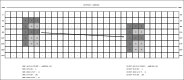
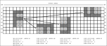
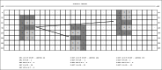

==========
DMA2D
==========

简介
=====
DMA2D即2D DMA(2 Dimensional Direct Memory Access)是一种在1D DMA的基础上进行扩展，从而使得2D DMA控制器可以按照设定的步幅搬运数据的技术(关于1D DMA的介绍详见DMA章节)。
数据的内存地址可以是非连续的，按照一定的间隔递增、递减或不变。2D DMA控制器有2组独立专用通道，管理外围设备和内存之间的数据传输以提高总线效率。
主要有三种类型传输包括内存至内存、内存至外设、外设至内存。并支持LLI链接列表功能。

主要特征
=========
- 2组独立专用通道
- 可配置为1D DMA或2D DMA功能
- 独立控制来源与目标存取宽度(单字节、双字节、四字节)
- 每个通道独立作为读写缓存
- 每个通道可被独立的外设硬件触发或是软件触发
- 支持外设包括UART、I2C、SPI、DBI、DSI。
- 八种流程控制

  * DMA流程控制，来源内存、目标内存
  * DMA流程控制，来源内存、目标外设
  * DMA流程控制，来源外设、目标内存
  * DMA流程控制，来源外设、目标外设
  * 目标外设流程控制，来源外设、目标外设
  * 目标外设流程控制，来源内存、目标外设
  * 来源外设流程控制，来源外设、目标内存
  * 来源外设流程控制，来源外设、目标外设

- 支持LLI链表功能，提高DMA效率，每个节点可单独设置是否触发中断
- 以下特征为2D DMA特有：

  * 支持8/16/32-bit像素图形在任意方向上的平移
  * 支持8/16/32-bit像素图形90/180/270度旋转
  * 支持8/16/32-bit像素图形水平/垂直翻折
  * 支持8/16/32-bit像素图形填充
  * 支持8/16/24/32-bit Color Key

功能描述
=========
工作原理
---------
2D DMA在1D DMA的基础上，增加了源地址的X步幅值SRC XINCR、X循环值SRC XCOUNT、Y步幅值SRC YINCR和Y循环值SRC YCOUNT，以及目的地址的X步幅值DEST XINCR、X循环值DEST XCOUNT和Y步幅值DEST YINCR配置(DEST YCOUNT不需要配置，由其他值计算得到)，其中步幅值可为负数。
2D DMA传输可看作是两层循环，外层循环为循环YCOUNT次，每次循环地址递增YINCR字节(YINCR为负数时递减)；内层循环为循环XCOUNT次，每次循环地址递增XINCR字节(XINCR为负数时递减)。
工作原理如下图所示：

.. figure:: ../../picture/DMA2DMemory.svg
   :align: center

   工作原理

图像平移
----------
将内存数据看成是一张矩形图像，通过步幅值和循环值的设置，可以实现矩形图像平移的效果，如下图所示：

   图像平移

按图中示例，假设一个像素点宽(P)为8-bit，2D DMA的transfer width设置为8-bit，在一张大小为M*N(图中为30*8)的图像中将一个大小为W*H(图中为3*5)的矩形区域从坐标(x1,y1)(图中为(3,1))平移到坐标(x2,y2)(图中为(21,2))，且图像数据起始地址从地址addr0(图中为0)开始，则2D DMA的相关参数计算过程如下：

- 源地址SRC ADDR START = addr0+(M*y1+x1)*P = 0+(30*1+3)*1 = 33
- 源地址X步幅值SRC XINCR = P = 1
- 源地址X循环值SRC XCOUNT = W = 3
- 源地址Y步幅值SRC YINCR = (M-(W-1))*P = (30-(3-1))*1 = 28
- 源地址Y循环值SRC YCOUNT = H = 5
- 目的地址DEST ADDR START = addr0+(M*y2+x2)*P = 0+(30*2+21)*1 = 81
- 目的地址X步幅值DEST XINCR = P = 1
- 目的地址X循环值DEST XCOUNT = W = 3
- 目的地址Y步幅值DEST YINCR = (M-(W-1))*P = (30-(3-1))*1 = 28

图像旋转
----------
将内存数据看成是一张矩形图像，通过步幅值和循环值的设置，可以实现矩形图像90/180/270度旋转的效果，如下图所示：

   图像旋转

按图中示例，假设一个像素点宽(P)为8-bit，2D DMA的transfer width设置为8-bit，在一张大小为M*N(图中为30*8)的图像中将一个大小为W*H(图中为3*5)的矩形区域从坐标(x1,y1)(图中为(3,1))顺时针旋转90度到坐标(x2,y2)(图中为(14,5))，且图像数据起始地址从地址addr0(图中为0)开始，则2D DMA的相关参数计算过程如下：

- 源地址SRC ADDR START = addr0+(M*y1+x1)*P = 0+(30*1+3)*1 = 33
- 源地址X步幅值SRC XINCR = P = 1
- 源地址X循环值SRC XCOUNT = W = 3
- 源地址Y步幅值SRC YINCR = (M-(W-1))*P = (30-(3-1))*1 = 28
- 源地址Y循环值SRC YCOUNT = H = 5
- 目的地址DEST ADDR START = addr0+(M*y2+x2)*P = 0+(30*5+14)*1 = 164
- 目的地址X步幅值DEST XINCR = M*P = 30*1 = 30
- 目的地址X循环值DEST XCOUNT = W = 3
- 目的地址Y步幅值DEST YINCR = -(M*(W-1)+1)*P = -(30*(3-1)+1)*1 = -61

将该矩形区域从坐标(x1,y1)(图中为(3,1))顺时针旋转180度到坐标(x3,y3)(图中为(19,7))的相关参数计算过程如下：

- 源地址SRC ADDR START = addr0+(M*y1+x1)*P = 0+(30*1+3)*1 = 33
- 源地址X步幅值SRC XINCR = P = 1
- 源地址X循环值SRC XCOUNT = W = 3
- 源地址Y步幅值SRC YINCR = (M-(W-1))*P = (30-(3-1))*1 = 28
- 源地址Y循环值SRC YCOUNT = H = 5
- 目的地址DEST ADDR START = addr0+(M*y3+x3)*P = 0+(30*7+19)*1 = 229
- 目的地址X步幅值DEST XINCR = -P = -1
- 目的地址X循环值DEST XCOUNT = W = 3
- 目的地址Y步幅值DEST YINCR = -(M-(W-1))*P = -(30-(3-1))*1 = -28

将该矩形区域从坐标(x1,y1)(图中为(3,1))顺时针旋转270度到坐标(x4,y4)(图中为(24,2))的相关参数计算过程如下：

- 源地址SRC ADDR START = addr0+(M*y1+x1)*P = 0+(30*1+3)*1 = 33
- 源地址X步幅值SRC XINCR = P = 1
- 源地址X循环值SRC XCOUNT = W = 3
- 源地址Y步幅值SRC YINCR = (M-(W-1))*P = (30-(3-1))*1 = 28
- 源地址Y循环值SRC YCOUNT = H = 5
- 目的地址DEST ADDR START = addr0+(M*y4+x4)*P = 0+(30*2+24)*1 = 84
- 目的地址X步幅值DEST XINCR = -M*P = -30*1 = -30
- 目的地址X循环值DEST XCOUNT = W = 3
- 目的地址Y步幅值DEST YINCR = (M*(W-1)+1)*P = (30*(3-1)+1)*1 = 61

图像翻折
----------
将内存数据看成是一张矩形图像，通过步幅值和循环值的设置，可以实现矩形图像水平/垂直翻折的效果，如下图所示：

   图像翻折

按图中示例，假设一个像素点宽(P)为8-bit，2D DMA的transfer width设置为8-bit，在一张大小为M*N(图中为30*8)的图像中将一个大小为W*H(图中为3*5)的矩形区域从坐标(x1,y1)(图中为(3,1))水平翻折到坐标(x2,y2)(图中为(15,3))，且图像数据起始地址从地址addr0(图中为0)开始，则2D DMA的相关参数计算过程如下：

- 源地址SRC ADDR START = addr0+(M*y1+x1)*P = 0+(30*1+3)*1 = 33
- 源地址X步幅值SRC XINCR = P = 1
- 源地址X循环值SRC XCOUNT = W = 3
- 源地址Y步幅值SRC YINCR = (M-(W-1))*P = (30-(3-1))*1 = 28
- 源地址Y循环值SRC YCOUNT = H = 5
- 目的地址DEST ADDR START = addr0+(M*y2+x2)*P = 0+(30*3+15)*1 = 105
- 目的地址X步幅值DEST XINCR = -P = -1
- 目的地址X循环值DEST XCOUNT = W = 3
- 目的地址Y步幅值DEST YINCR = (M+(W-1))*P = (30+(3-1))*1 = 32

将该矩形区域从坐标(x1,y1)(图中为(3,1))垂直翻折到坐标(x3,y3)(图中为(22,4))的相关参数计算过程如下：

- 源地址SRC ADDR START = addr0+(M*y1+x1)*P = 0+(30*1+3)*1 = 33
- 源地址X步幅值SRC XINCR = P = 1
- 源地址X循环值SRC XCOUNT = W = 3
- 源地址Y步幅值SRC YINCR = (M-(W-1))*P = (30-(3-1))*1 = 28
- 源地址Y循环值SRC YCOUNT = H = 5
- 目的地址DEST ADDR START = addr0+(M*y3+x3)*P = 0+(30*4+22)*1 = 142
- 目的地址X步幅值DEST XINCR = P = 1
- 目的地址X循环值DEST XCOUNT = W = 3
- 目的地址Y步幅值DEST YINCR = -(M+(W-1))*P = -(30+(3-1))*1 = -32

图像填充
----------
将内存数据看成是一张矩形图像，通过步幅值和循环值的设置，可以实现矩形图像填充的效果，如下图所示：

.. figure:: ../../picture/DMA2DFill.svg
   :align: center

   图像填充

按图中示例，假设一个像素点宽(P)为8-bit，2D DMA的transfer width设置为8-bit，在一张大小为M*N(图中为30*8)的图像中将一个大小为W*H(图中为3*5)、起始坐标为(x2,y2)(图中为(19,2))的矩形区域用坐标(x1,y1)(图中为(3,1))中的值填充，且图像数据起始地址从地址addr0(图中为0)开始，则2D DMA的相关参数计算过程如下：

- 源地址SRC ADDR START = addr0+(M*y1+x1)*P = 0+(30*1+3)*1 = 33
- 源地址X步幅值SRC XINCR = 0
- 源地址X循环值SRC XCOUNT = W = 3
- 源地址Y步幅值SRC YINCR = 0
- 源地址Y循环值SRC YCOUNT = H = 5
- 目的地址DEST ADDR START = addr0+(M*y2+x2)*P = 0+(30*2+19)*1 = 79
- 目的地址X步幅值DEST XINCR = P = 1
- 目的地址X循环值DEST XCOUNT = W = 3
- 目的地址Y步幅值DEST YINCR = (M-(W-1))*P = (30-(3-1))*1 = 28

Color Key
-------------
当开启Color Key功能时，2D DMA在搬运数据的过程中如果遇到和设置的Color Key值相等的值时，会跳过该值不做搬运，被跳过的地址里存储的还是原来的值。Color Key的宽度可设置为8/16/24/32位宽，工作原理如下图所示：

.. figure:: ../../picture/DMA2DColorKey.svg
   :align: center

   Color Key

按图中示例，Color Key位宽设置为8-bit，Key值设置为0x55，2D DMA在搬运包含"F"图像的矩形区域时，遇到0x55值会跳过不做搬运，可以看到结果中只搬运了矩形区域的"F"，值为0x55的背景部分没有搬运。

.. only:: html

   .. include:: dma2d_register.rst

.. raw:: latex

   \input{../../zh_CN/content/dma2d}
