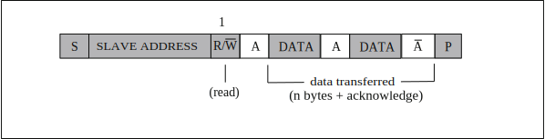

==========
I2C
==========

简介
=====
I2C (Inter-Intergrated Circuit)是一种串行通讯总线，使用多主从架构，用来连接低速外围装置。
每个器件都有一个唯一的地址识别，并且都可以作为一个发送器或接收器。每个连接到总线的器件都可以通过唯一的地址和一直存在的主、从机关系用软件设置地址，主机可以作为主机发送器或主机接收器。
如果有两个或多个主机同时初始化，数据传输可以通过冲突检测和仲裁防止数据被破坏。
BL808包含4组I2C控制器主机，可灵活配置slaveAddr、subAddr以及传输数据，方便与从设备通信，提供2个word深度的fifo，提供中断功能，可搭配DMA使用提高效率，可灵活调整时钟频率。

主要特征
=========
- 支持主机模式
- 支持多主机模式和仲裁功能
- 时钟频率可灵活调整
- 支持10地址模式
- 支持DMA传输模式

功能描述
==========
引脚列表：

.. table:: I2C引脚

    +----------+-----------+---------------------------+
    |   名称   |   类型    |           描述            |
    +==========+===========+===========================+
    | I2Cx_SCL | 输入/输出 | I2C串行时钟信号           |
    +----------+-----------+---------------------------+
    | I2Cx_SDA | 输入/输出 | I2C串行数据信号           |
    +----------+-----------+---------------------------+

起始和停止条件
-----------------
所有传输都由起始条件(START condition)开始，以停止条件(STOP condition)结束。
起始条件和停止条件一般都由主机产生，总线在起始条件后被认为处于总线忙的状态，在停止条件后的某段时间内被认为处于空闲状态。

起始条件:SCL为高电平时SDA产生一高至低的电平转换；

停止条件:SCL为高电平时SDA产生一低至高的电平转换。

波形示意图如下：

.. figure:: ../../picture/I2CStopStart.svg
   :align: center

   I2C起始和停止条件

数据传输格式
----------------

7地址模式:

传输的第一个8位为寻址字节，包括7位从机地址和1位方向位。数据由主机发送或接收是由主机所送出的第1个字节的第8位控制，
若为0表示数据由主机发送；为1则表示数据由主机接收，紧接着从机发出应答位(ACK)，在数据传输完成后，主机发出停止信号，波形图如下：

.. figure:: ../../picture/I2CMasterTxRx.svg
   :align: center

   I2C数据传输格式

**主发送和从接收的时序**

.. figure:: ../../picture/I2CMasterTxSlaveRx.svg
   :align: center

   主发送和从接收的时序

**主接收和从发送的时序**

   主接收和从发送的时序

10地址模式:使用时需要将寄存器i2c_config中cr_i2c_10b_addr_en置1。

10bit的从机地址由开始条件(S)或重复开始条件(Sr)后的两个字节组成。第一个字节的前7位是1111 0XX，XX是10bit地址的最高有效位的前两位。第一个字节的第8bit是读写位，决定传输方向。
尽管1111 XXX有8种可能的组合，然后只有1111 0XX这四种可以用于10bit寻址，剩下的1111 1XX这四种是为将来I2C扩展用的。

前面描述的用于7bit寻址的读写格式都适用于10bit寻址，详情如下:

1.主-发送器传输到从-接收器(10bit从机地址)

.. figure:: ../../picture/I2CMasterToSlave10BitAddress.svg
   :align: center

从图中看出传输方向不变。当接收到开始条件后的10bit地址，从机就和它自己的地址比较从机地址的第一个字节(1111 0XX),并检查第八个bit(读写位)是否为0。有可能多个设备都匹配并产生应答(A1)。接下来所有从机开始匹配自己地址与第二个字节的8个bit(XXXX XXXX),这时就只有一个从机匹配并产生应答(A2)，被主机寻址匹配的从机会保持被寻址的状态直到接收到终止条件或者是重复开始条件后跟着一个不同的从机地址。

2.主-接收器从从-发送器接收数据(10bit从地址)

.. figure:: ../../picture/I2CSlaveToMaster10BitAddress.svg
   :align: center

在第二个读写位之后传输方向就会改变。在第二个应答A2之前，处理过程与上面的主-发送器寻址从-接收器一致。在重复开始条件(Sr)之后，匹配的从机会保持被寻址上的状态。这个从机会检查Sr之后的第一个字节的前7bit是否正确，然后测试第8bit是否为1(读)。如果这也匹配的话，从机就认定它被作为一个发送器被寻址到了并产生应答A3。从-发送器会保持被寻址的状态直到接收到终止条件(P)或者重复开始条件(Sr)跟着一个不同的从机地址，然后这个时候的重复开始条件下，所有的从机会比较它们的地址与11110XX比较并测试第八位(读写位)。然而它们不会寻址到，因为对于10bit设备，读写位是1，或者对于7bit的设备，1111 0XX的从机地址不匹配。

仲裁
------
当I2C总线存在多个主机时，可能会发生多个主机同时启动传输的情况，此时必须要依靠仲裁机制来决定哪个主机有权利完成接下来的数据传输，其余主机则须放弃对总线的控制，等到总线再次空出来后才能再次启动传输。

在传输过程中，所有主机都需要在SCL为高电平时检查SDA是否与自己所想送出的资料相符，当SDA电平与预期不同时，表示有别的主机也在同时进行传输，而发现SDA电平不同的主机则失去此次仲裁，由其他主机完成数据传输。

两主机同时传输数据并启动仲裁机制的波形示意图如下：

.. figure:: ../../picture/I2CTxRxTogether.svg
   :align: center

   同时传输数据波形示意图

I2C时钟设定
============

I2C的时钟可由bclk(bus clock)和xclk而来，可以在其的基础上做分频处理。
寄存器i2c_prd_data可以对数据段的时钟做分频处理。i2c模块将数据发送分为4个阶段，每个阶段在寄存器中用单独一个字节来控制，每个阶段的采样个数是可以设置的，4个采样数共同决定了i2c clock的分频系数。
比如现在bclk是32M，寄存器i2c_prd_data在不做配置默认情况下的值是0x0f0f0f0f，那么I2C的时钟频率为 32M/((15 + 1) * 4) = 500K。
同理，寄存器i2c_prd_start和i2c_prd_stop也会分别对起始位和停止位的时钟做分频处理。

I2C配置流程
============

配置项
-------

 - 读写标志位
 - 从设备地址
 - 从设备寄存器地址
 - 从设备寄存器地址长度
 - 数据(发送时，配置发送的数据；接收时，存储接收到的数据)
 - 数据长度
 - 使能信号

读写标志位
-----------

I2C支持发送和接收两种工作状态，寄存器i2c_config中cr_i2c_pkt_dir表示发送或者接收状态，设置为0时，表示发送状态，设置为1时，表示接收状态。

从设备地址
-----------

每个对接I2C的从设备，都会有唯一设别地址，通常该地址是7位长度，将从设备地址写入寄存器i2c_config中cr_i2c_slv_addr，I2C在将从设备地址发送出去之前，会自动左移1位，并在最低位补上发送接收方向位。

从设备寄存器地址
-----------------

从设备寄存器地址表示I2C需要对从设备某个寄存器做读写操作的寄存器地址。将从设备寄存器地址写入寄存器 i2c_sub_addr，同时需要将寄存器i2c_config中cr_i2c_sub_addr_en置1。
如果将寄存器i2c_config中cr_i2c_sub_addr_en置0，那么I2C主机发送时会跳过从设备寄存器地址段。

从设备寄存器地址长度
----------------------

将从设备寄存器地址长度减1再写入寄存器i2c_config中cr_i2c_sub_addr_bc。

数据
--------

数据部分表示需要发送到从设备的数据，或者需要从从设备接收到的数据。
当I2C发送数据时，需要将数据依次以word为单位写入I2C FIFO，发送数据写FIFO的寄存器地址i2c_fifo_wdata。
当I2C接收数据时，需要依次以word为单位从I2C FIFO中将数据读出来，接收数据读FIFO的寄存器地址i2c_fifo_rdata。

数据长度
---------

将数据长度减1再写入寄存器i2c_config中cr_i2c_pkt_len。

使能信号
---------

将以上几项配置完成后，再将使能信号寄存器i2c_config中cr_i2c_m_en置1，就自动启动I2C发送流程了。

当读写标志位配置为0时，I2C发送数据，主机发送流程：

1. 起始位

2. (从设备地址左移1位 + 0) + ACK

3. 从设备寄存器地址 + ACK

4. 1字节数据 + ACK

5. 1字节数据 + ACK

6. 停止位

当读写标志位配置为1时，I2C接收数据，主机发送流程：

1. 起始位

2. (从设备地址左移1位 + 0) + ACK

3. 从设备寄存器地址 + ACK

4. 起始位

5. (从设备地址左移1位 + 1) + ACK

6. 1字节数据 + ACK

7. 1字节数据 + ACK

8. 停止位

FIFO管理
============

I2C FIFO深度为2个word，I2C发送和接收可分为RX FIFO和TX FIFO。
寄存器i2c_fifo_config_1中rx_fifo_cnt表示RX FIFO中有多少数据(单位word)需要读取。
寄存器i2c_fifo_config_1中tx_fifo_cnt表示TX FIFO中剩余多少空间(单位Word)可供写入。

I2C FIFO状态：

 - RX FIFO underflow: 当RX FIFO中的数据被读取完毕或者为空时，继续从RX FIFO中读取数据，寄存器i2c_fifo_config_0中rx_fifo_underflow会被置1；
 - RX FIFO overflow: 当I2C接收数据直到RX FIFO的2个word被填满后，在没有读取RX FIFO的情况下，I2C再次接收到数据，寄存器i2c_fifo_config_0中rx_fifo_overflow会被置1；
 - TX FIFO underflow: 当向TX FIFO中填入的数据大小不满足配置的I2C数据长度:i2c_config中cr_i2c_pkt_len，并且已经没有新数据继续填入TX FIFO中时，寄存器i2c_fifo_config_0中tx_fifo_underflow会被置1；
 - TX FIFO overflow: 当TX FIFO的2个word被填满后，在TX FIFO中的数据没有发出去之前，再次向TX FIFO中填入数据，寄存器i2c_fifo_config_0中tx_fifo_overflow会被置1。

搭配使用DMA
============

I2C可以使用DMA进行数据的发送和接收。将寄存器i2c_fifo_config_0中i2c_dma_tx_en置1，则开启DMA发送模式，为I2C分配好通道后，DMA会将数据从存储区传输到i2c_fifo_wdata寄存器中。
将寄存器i2c_fifo_config_0中i2c_dma_rx_en置1，则开启DMA接收模式，为I2C分配好通道后，DMA会将i2c_fifo_rdata寄存器中的数据传输到存储区中。
I2C模块搭配使用DMA时，数据部分将由DMA自动完成搬运，不需要CPU再将数据写入I2C TX FIFO或者从I2C RX FIFO中读取数据。

DMA发送流程
-------------

1. 配置读写标志位为0

2. 配置从设备地址

3. 配置从设备寄存器地址

4. 配置从设备寄存器地址长度

5. 数据长度

6. 使能信号寄存器置1

7. 配置DMA transfer size

8. 配置DMA源地址transfer width

9. 配置DMA目的地址transfer width(需要注意I2C搭配DMA使用时，目的地址transfer width需要设置为32bits，以word对齐使用)

10. 配置DMA源地址为存储发送数据的内存地址

11. 配置DMA目的地址为I2C TX FIFO地址，i2c_fifo_wdata

12. 使能DMA

DMA接收流程
----------------

1. 配置读写标志位为1

2. 配置从设备地址

3. 配置从设备寄存器地址

4. 配置从设备寄存器地址长度

5. 数据长度

6. 使能信号寄存器置1

7. 配置DMA transfer size

8. 配置DMA源地址transfer width(需要注意I2C搭配DMA使用时，源地址transfer width需要设置为32bits，以word对齐使用)

9. 配置DMA目的地址transfer width

10. 配置DMA源地址为I2C RX FIFO地址，i2c_fifo_rdata

11. 配置DMA目的地址为存储接收数据的内存地址

12. 使能DMA

中断
============

I2C包括如下几种中断：

 - I2C_TRANS_END_INT: I2C传输结束中断
 - I2C_TX_FIFO_READY_INT: 当I2C TX FIFO有空闲空间可用于填充时，触发中断
 - I2C_RX_FIFO_READY_INT: 当I2C RX FIFO接收到数据时，触发中断
 - I2C_NACK_RECV_INT: 当I2C模块检测到NACK状态，触发中断
 - I2C_ARB_LOST_INT: I2C仲裁丢失中断
 - I2C_FIFO_ERR_INT: I2C FIFO ERROR中断

.. only:: html

   .. include:: dma2d_register.rst

.. raw:: latex

   \input{../../zh_CN/content/i2c}