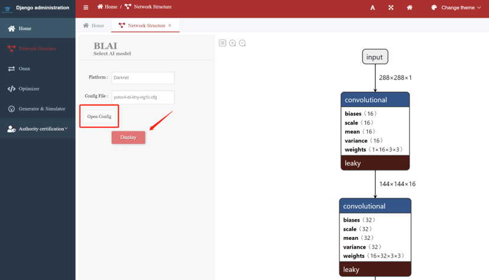

===============
NPU toolchain
===============

图形界面流程图
====================

.. figure:: ../../picture/NPUGUIflowchart.png
   :align: center
   :scale: 70%

   图形界面流程图

网络结构
=======================
要在 GUI 上通过 Netron 显示模型结构，用户需要选择用于显示的平台和配置文件，可选择的平台有： Darknet, Tensorflow, Caffe, Mxnet, ONNX。

   网络结构图

ONNX 转换器
===============
用户想要将自己的平台转换为 ONNX，必须要选择一个平台并命名 ONNX 文件。可选的平台有：Tensorflow, Caffe, Mxnet（DarkNet、Tensorflow Lite可直接支持）。

.. figure:: ../../picture/NPUONNXconverter.png
   :align: center

   转换界面

在 ONNX 转换器上按“convert”后，屏幕将显示另外两个按钮，用户可以选择“Display”或“Download”。

.. figure:: ../../picture/NPUONNXconverter2.png
   :align: center
   :scale: 70%

   显示或下载界面

优化器
==========
优化器部分可以将浮点数量化为固定点。

“Optimize”: 花更多时间，准确率高

“Fast Optimize”: 花费较少的时间，准确性损失值较大

支持的平台有: Darknet, Tensorflow, ONNX (BLAI NPU 也支持 Tensorflow Lite 上的优化器格式)。

.. figure:: ../../picture/NPUoptimizer.png
   :align: center
   :scale: 70%

   优化器界面

Generator & Simulator
=========================
在做完优化器部分后，点击“Sim&Gen”，使用 8 位量化权重预测图像，并生成 BLAI NPU 指令。

点击“Float Sim” 将预测具有 32 位未量化权重的图像。
 
支持的平台有: Darknet, Tensorflow, ONNX (BLAI NPU 也支持 Tensorflow Lite 上的优化器格式)。

.. figure:: ../../picture/NPUgensim.png
   :align: center
   :scale: 70%

   预测选择界面
