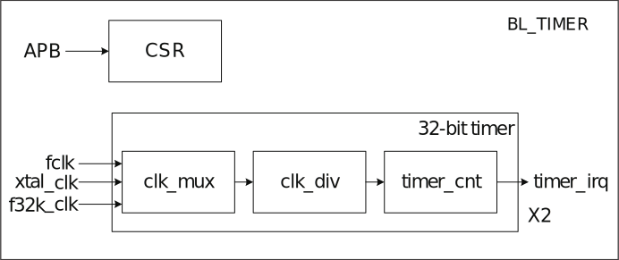

==========
TIMER
==========

简介
=====
芯片内置2组32-bit 计数器，每个计数器可独立控制配置其参数与时钟频率。

芯片内有一组看门狗计数器，不可预知的软件或硬件行为有可能导致应用程序工作失常，
看门狗定时器可以帮助系统从中恢复，如果当前阶段超过预定时间，
但没有喂狗或关闭看门狗定时器，可依设定触发中断或系统复位。

   定时器框图

.. figure:: ../../picture/WatchdogBlock.svg
   :align: center

   看门狗定时器框图

主要特征
=========
- 多种时钟来源，最高可支持80M时钟
- 8-bit 时钟分频器，分频系数为1-256
- 两组32-bit定时器
- 每个定时器包含三组报警值设定，可独立设定每组报警值溢出时报警
- 支持Free Run模式和Pre_load模式
- 16-bit 看门狗定时器
- 支持写入密码保护，防止误设定造成系统异常
- 支持中断或复位两种看门狗溢出方式
- 支持测量外部GPIO的脉冲宽度

功能描述
==========

Watchdog定时器时钟有5种选择：

- Bclk--总线时钟
- 32K--32K时钟
- 1K--1K时钟
- Xtal--外部晶振
- GPIO--外部GPIO

通过寄存器TCCR中cs_wdt配置。

每个定时器时钟来源都有5种选择，来源如下：

- Bclk--总线时钟
- 32K--32K时钟
- 1K--1K时钟（32K的分频）
- Xtal--外部晶振
- GPIO--外部GPIO

通过寄存器TCCR中cs_2和cs_3配置。

每个计数器有各自的8-bit分频器，可将的时钟进行1-256的分频，
具体来说设定为0时表示不分频，设定为1时进行2分频以此类推，
最大分频系数为256，计数器将以分频后的时钟作为计数周期单位。

通过寄存器TCDR中tcdr2、tcdr3、wcdr配置。

通用定时器工作原理
--------------------
每个通用定时器都包含三组比较器，一个计数器以及一个预加载寄存器，当设定好时钟源，
启动定时器后，计数器开始向上累加计数，当计数器的值与比较器相等的时候，
比较标志置位同时可以产生比较中断。

配置寄存器TICR2中tclr2_0设置TMR2比较器0的值，配置寄存器TICR2中tclr2_1设置TMR2比较器1的值，配置寄存器TICR2中tclr2_2设置TMR2比较器2的值。配置寄存器TPLVR2中tplvr2设置TMR2预加载值。

配置寄存器TICR3中tclr3_0设置TMR3比较器0的值，配置寄存器TICR3中tclr3_1设置TMR3比较器1的值，配置寄存器TICR3中tclr3_2设置TMR3比较器2的值。配置寄存器TPLVR3中tplvr3设置TMR3预加载值。

计数器的初始值取决于定时的模式，在FreeRun模式下，计数器的初始值是0，然后累加计数，
当达到计数最大值后，然后从0再次开始计数。

在PreLoad模式下，计数器的初始值是PreLoad寄存器的值，然后向上累加计数，
当满足PreLoad条件时，计数器的值被置为PreLoad寄存器的值，然后计数器再次开始向上累加计数，
在定时器的计数器计数过程中，一旦计数器的值与三个比较器中的某比较值一致，
该比较器的比较标志就会置位，并可以产生相应的比较中断。

配置寄存器TCMR中timer2_mode设置TMR2的计数模式，配置寄存器TCMR中timer3_mode设置TMR3的计数模式。

若预加载寄存器的值为10，比较器0的值为13，比较器1的值为16，比较器2的值为19，
则定时器在PreLoad的模式下工作时序如下图：

.. figure:: ../../picture/TimerPreload.svg
   :align: center

   定时器在PreLoad模式下工作时序

在FreeRun模式下，定时器工作时序与PreLoad基本相同，
只是计数器会从0开始累计到最大值，期间产生的比较标志和比较中断的机制与FreeRun模式相同。

TMR2可以使用内部的时钟源计算外部gpio的脉冲宽度。
通过设置寄存器GPIO中timer2_gpio_en开启该功能，通过设置timer2_gpio_inv位，判断获取的是外部gpio的高电平还是低电平的宽度，如果该位为0，表示高电平；如果该位为1，表示低电平；
另外需要将外部的gpio功能设置为gpio_tmr_clk功能。通过配置GLB模块中寄存器dig_clk_cfg2中的gpio_tmr_clk_sel[13:12]位；
同时需要将寄存器dig_clk_cfg2[11:8]中的某一位配置为0，需要和gpio_tmr_clk_sel配套使用。具体如下：

- 若gpio_tmr_clk_sel[13:12]配置为0，则寄存器dig_clk_cfg2中的chip_clk_out_0_en设置为0
- 若gpio_tmr_clk_sel[13:12]配置为1，则寄存器dig_clk_cfg2中的chip_clk_out_1_en设置为0
- 若gpio_tmr_clk_sel[13:12]配置为2，则寄存器dig_clk_cfg2中的chip_clk_out_2_en设置为0
- 若gpio_tmr_clk_sel[13:12]配置为3，则寄存器dig_clk_cfg2中的chip_clk_out_3_en设置为0

配置完成后，使能timer。当寄存器GPIO中gpio_lat_ok置1后，获取寄存器GPIO_LAT2和寄存器GPIO_LAT1的值。
外部gpio的脉冲宽度的计算方式：（GPIO_LAT2-GPIO_LAT1）\* timer内部时钟源的1个周期的宽度；

例如：timer的内部时钟源为80M，外部gpio的频率为2M，且占空比为1：1，将timer2_gpio_inv位写1，表示计算外部gpio低电平的宽度。
按照上述配置完成后，得到寄存器GPIO_LAT2和寄存器GPIO_LAT1的差为20，则外部gpio的低电平宽度为：20 \*（1 / 80000000） = 1 / 4000000；
将timer2_gpio_inv位写0，表示计算外部gpio高电平的宽度。
按照上述配置完成后，得到寄存器GPIO_LAT2和寄存器GPIO_LAT1的差为20，则外部gpio的高电平宽度为：20 \*（1 / 80000000） = 1 / 4000000；

看门狗定时器工作原理
----------------------
Watchdog定时器包含一个计数器和一个比较器，计数器从0开始累加计数，
如果计数器被复位(喂狗)，则从0再次开始向上计数，当计数器的值与比较器相等的时候，
可以产生一个比较中断信号或者系统复位信号，用户可以根据需要选择使用其中一个。
看门狗计数器会在每个计数周期单位上加1，软件可以在任何时间点通过APB将看门狗计数器归零。

配置寄存器WMR中wmr设置比较值，

若比较器的值为6,Watchdog的工作时序如下图所示

.. figure:: ../../picture/WatchDog.svg
   :align: center

   Watchdog工作时序

报警设定
-----------
每一组计数器有三个比较值提供软件设定，并可设定每一组比较值是否触发报警中断，
当计数器与比较值吻合且设定会报警时，计数器会通过中断通知处理器。
软件可以通过APB读取目前是否发生报警和是哪个比较值触发报警中断，
当清理报警中断时亦会同步清理报警状态。

看门狗报警
-----------
每个计数器可设定一组比较值，当软件因为系统错误，
来不及将看门狗计数器归零，
导致看门狗计数器超过比较值时，便会触发看门狗报警，报警方式有两种，
第一种是通过中断通知软件进行必要的处置，第二种是进入系统看门狗复位，
看门狗复位被触发时，会通知系统复位控制器，并做好系统复位前准备，
当一切就绪后进入系统勘门狗复位，值得注意的是，软件可通过APB读取WSR
寄存器得知是否曾经发生看门狗系统复位。

.. figure:: ../../picture/WatchDogAlarm.svg
   :align: center

   看门狗报警机制

.. only:: html

   .. include:: tmr_register.rst

.. raw:: latex

   \input{../../zh_CN/content/tmr}