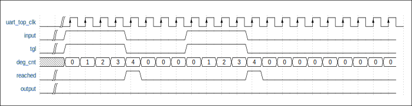

===========
UART
===========

简介
=====
通用异步收发传输器（Universal Asynchronous Receiver/Transmitter，通常称为UART）是一种异步收发传输器，提供了与外部设备进行全双工数据交换的灵活方式。
BL808共有4组UART，配合DMA使用，可以实现高效的数据通信。

主要特征
=========
 - 全双工异步通信
 - 数据位长度可选择5/6/7/8比特
 - 停止位长度可选择0.5/1/1.5/2比特
 - 支持奇/偶/无校验比特
 - 可侦测错误的起始比特
 - 丰富的中断控制
 - 支持硬件流控（RTS/CTS）
 - 便捷的波特率编程
 - 可配置MSB/LSB优先传输
 - 普通/固定字符的自动波特率检测
 - 32字节发送/接收FIFO
 - 支持DMA传输模式
 - 支持10Mbps及其以上波特率
 - 支持LIN总线协议
 - 支持RS485模式
 - 时钟源可以选择160M/BCLK/XCLk
 - 支持滤波功能

功能描述
===========
数据格式描述
-------------
正常的UART通信数据是由起始位、数据位、奇偶校验位、停止位组成的。BL808的UART支持可配置的数据位、奇偶校验位和停止位，这些都在寄存器utx_config和urx_config中设置。一帧数据的波形如下图所示：

   UART数据格式

数据帧的起始位占用1-bit，停止位可以通过配置寄存器utx_config中位cr_utx_bit_cnt_p实现0.5/1/1.5/2位宽。起始位为低电平，停止位为高电平。
数据位宽可以通过寄存器utx_config中位cr_utx_bit_cnt_d配置为5/6/7/8位宽。
当置位寄存器utx_config中位cr_utx_prt_en和寄存器urx_config中位cr_urx_prt_en时，数据帧会在数据之后添加一位奇偶校验位。寄存器utx_config中位cr_utx_prt_sel和寄存器urx_config中位cr_urx_prt_sel用于选择奇校验还是偶校验。当接收器检测到输入数据的校验位错误时会产生校验错误中断。但是接收的数据仍然会进入FIFO。
奇校验的计算方法：如果当前数据位1的个数是奇数个，奇校验位为0；反之为1。
偶校验的计算方法：如果当前数据位1的个数是奇数个，偶校验位为1；反之为0。

基本架构图
-------------

   UART架构图

时钟源
-------------
UART有3个时钟源：XCLK,160MHz CLK以及BCLK。时钟中的分频器用于对时钟源进行分频，然后产生时钟信号来驱动UART模块。如下图所示：

.. figure:: ../../picture/UARTClk.svg
   :align: center

   UART时钟

波特率设定
-------------
用户可通过设置寄存器UART_BIT_PRD来产生所需的波特率，该寄存器的高16位cr_urx_bit_prd和低16位cr_utx_bit_prd分别对应RX与TX，即RX与TX的波特率可单独进行设置，该16位值需要通过计算得出，公式如下：
波特率 = UART时钟/（16位位宽系数+1）
即：16位位宽系数 = UART时钟/波特率-1
该16位位宽系数的含义是以UART时钟去计数当前波特率位宽所得到的计数值。由于16位位宽系数最大值为65535，所以UART支持的最小波特率为：UART时钟/65536。
在UART对数据进行采样之前，会先对数据进行滤波，将波形当中的毛刺滤掉。然后会在上述16位系数的中间值时刻进行采样，这样根据不同的波特率调整不同的采样时刻，以保持其采到的始终是中间值，大大提高了灵活性与精度。采样过程如下图所示：

.. figure:: ../../picture/UARTSample.svg
   :align: center

   UART采样波形图

滤波
-------------
通过配置寄存器urx_config中cr_urx_deg_en使能该功能和配置cr_urx_deg_cnt设置门限值，UART会将达不到门限值宽度的数据过滤掉
如下图所示，若想滤去数据宽度小于4的数据，需要将cr_urx_deg_cnt的值设置为4。input为初始数据,output为滤波后的数据。

滤波逻辑过程：

 - tgl为input和output的异或结果。
 - deg_cnt从0开始计数，计数条件为tgl为高电平，并且reached为低电平。
 - 若deg_cnt计数值达到cr_urx_deg_cnt设置的值时,reached为高电平。
 - 当reached为高电平时，将input输出到output。
 - 注释:deg_cnt自加的条件：tgl为高电平且reached为低电平，其余情况下deg_cnt会被清0。

   UART滤波波形图

发送器
-------------
发送器包含一个32字节的发送FIFO，用来存放待发送的数据。软件可以通过APB总线写TX FIFO，也可以通过DMA将数据搬入TX FIFO。当发送使能位被设置时，FIFO中存放的数据会从TX引脚输出。
软件可以通过寄存器uart_fifo_config_1中tx_fifo_cnt查询TX FIFO剩余可用空间计数值来检查发送器的状态。

发送器的自由运行（FreeRun）模式如下：

 - 如果没有开启自由运行（FreeRun）模式，则当发送字节达到指定长度时发送行为终止并产生中断，如果要继续发送则需重新关闭再使能发送使能位。
 - 如果开启自由运行（FreeRun）模式，则当TX FIFO里存在数据时，发送器就会进行发送，不会因为发送字节达到指定长度而终止。

接收器
-------------
接收器包含一个32字节的接收FIFO，用来存放接收到的数据。软件可以通过寄存器uart_fifo_config_1中rx_fifo_cnt查询RX FIFO可用数据计数值来检查接收器的状态。寄存器URX_RTO_TIMER的低8位用于设定一个接收超时门限，当接收器超过该时间值未收到数据时，会触发中断。寄存器urx_config中cr_urx_deg_en和cr_urx_deg_cnt用于使能去毛刺功能和设置门限值，其控制的是UART采样之前的滤波部分，UART会将波形当中宽度低于门限值的毛刺滤掉，然后在将其送去采样。

自动波特率检测
-----------------
UART模块支持自动波特率检测，该检测分为两种，一种是通用模式，一种是固定字符模式。置位寄存器urx_config中cr_urx_abr_en每次开启时，这两种检测模式都会启用。

**通用模式**

对于所接收到的任意字符数据，UART模块会计数起使位宽当中的时钟数，此数字会接着被写入寄存器STS_URX_ABR_PRD的低16位sts_urx_abr_prd_start并用以计算波特率，因此当最先接收到的数据位为1时即可得到正确的波特率，如LSB-FIRST下的'0x01'。

**固定字符模式**

该模式下，UART模块在计数起使位宽当中的时钟数后，会继续计数后续数据位的时钟数，并与起始位相比较，如果上下浮动在允许误差范围内，则通过检测，否则计数值会被丢弃。允许误差可以通过设置寄存器urx_abr_pw_tol中的cr_urx_abr_pw_tol位来设置，单位是UART的时钟源。
因此，只有在LSB-FIRST下接收到固定字符'0x55'/'0xD5'或MSB-FIRST下的'0xAA'/'0xAB'时，UART模块才会将起使位宽当中的时钟数计数值写入寄存器STS_URX_ABR_PRD的高16位sts_urx_abr_prd_0x55。如下图所示：

.. figure:: ../../picture/UARTAbr.svg
   :align: center

   UART固定字符模式波形图

对于某一未知的波特率，UART用UART_CLK去计数起始位的位宽为1000，第二位的位宽为1001，与前一位宽上下浮动不超过4个UART_CLK，则UART会继续计数第三位，第三位为1005，与起始位相差超过4，则检测不通过，数据丢弃。UART会依次将数据位的前6位位宽与起始位进行比较。

计算检测到的波特率的公式如下：
波特率=源时钟/（16位检测值+1）

硬件流控
-------------
UART支持CTS/RTS方式的硬件流控，以防止FIFO里的数据由于来不及处理而丢失。硬件流控连接如下图所示：

   UART硬件流控图

RTS （Require To Send，发送请求）为输出信号，用于指示芯片准备好可接收对方数据，低电平有效，低电平说明芯片可以接收数据。

CTS （Clear To Send，清除发送）为输入信号，用于判断芯片是否可以向对方发送数据，低电平有效，低电平说明芯片可以向对方发送数据。

当使用硬件流控功能时，芯片端输出信号RTS为低电平表示请求对方发送数据，RTS为高电平表示通知对方中止数据发送。
当芯片检测到输入信号CTS拉高时，TX会停止发送数据，直到检测到CTS拉低时再继续发送。CTS在通信过程中的任意时刻拉高或者拉低，不影响TX发送数据的连续性，对方收到的数据也是连续的。

发送器的硬件流控有两种方式:

- 寄存器uart_sw_mode中cr_urx_rts_sw_mode等于0：寄存器urx_config中cr_urx_en没有开或者是RX FIFO快要满（剩一个字节）的时候RTS拉高。

- 寄存器uart_sw_mode中cr_urx_rts_sw_mode等于1：可以通过配置寄存器URX_SW_MODE中cr_urx_rts_sw_val改变RTS的电平。

DMA传输模式
-------------
UART支持DMA传输模式。使用该模式需要通过寄存器uart_fifo_config_1中tx_fifo_th和rx_fifo_th分别设置TX和RX FIFO的阈值，当该模式启用后，
如果uart_fifo_config_1中tx_fifo_cnt大于tx_fifo_th，则会触发DMA TX请求，配置好DMA后，DMA在收到该请求时，会按照设定从内存中将数据搬运到TX FIFO。
如果uart_fifo_config_1中rx_fifo_cnt大于rx_fifo_th，则会触发DMA RX请求，配置好DMA后，DMA在收到该请求时，会按照设定将RX FIFO的数据搬运到内存。
传输模式下为了保证芯片DMA TX Channel搬运数据的正确性，Channel配置中需要满足以下条件：transferWidth乘以burstSize小于等于设置的tx_fifo_th加1。
传输模式下为了保证芯片DMA RX Channel搬运数据的完整性，Channel配置中需要满足以下条件：transferWidth乘以burstSize等于设置的tx_fifo_th加1。

LIN总线支持
-------------
本地互联网络（LIN）协议基于Volvo衍生公司Volcano通信技术公司（VCT）开发的Volcano-Lite技术。
LIN是CAN和SAE J1850协议的补充性协议，针对时间要求不高或不需要精确容错的应用（因为LIN没有CAN协议那样可靠）。
LIN的目标是易于使用，作为CAN协议的低成本替代品。LIN在车辆中可以使用的场合包括车窗升降器、后视镜、雨刷和雨量传感器。

UART模块支持LIN总线模式，一个典型的LIN数据传输如图所示。

.. figure:: ../../picture/UARTLinFrame.svg
   :align: center

   一个典型的LIN帧

LIN总线采用主从模式，数据总是由主节点发起，主节点发送的帧（头）包含三个部分：同步间隔字段、同步字节字段和一个标识符字段。

同步间隔字段表示报文的开始，至少13个显性位（包括起始位）。同步间隔以一个“间隔分隔符”结束，该分隔符至少包含一个隐性位。

   LIN的Break域

LIN帧中的Break长度可以通过utx_config中cr_utx_bit_cnt_b来设定。

发送同步字节字段来确定两个下降沿之间的时间，从而确定主节点使用的传输速率。位模式是0x55（01010101，最大下降沿数量）。

   LIN的Sync域

标识符字段包含6位长的标识符和两个奇偶校验位。6位标识符包含关于发送方和接收方的信息，以及响应中要求的字节数。奇偶校验位如下进行计算：校验位P0是ID0、ID1、ID2和ID4之间进行逻辑“或”运算的结果。校验位P1是ID1、ID3、ID4和ID5之间逻辑“或”运算后在进行反转的结果。

   LIN的ID域

从节点等待同步间隔字段，然后通过同步字节字段开始主从节点之间的同步。根据主节点发送的标识符，从节点将进行接收、发送或什么都不做。应该进行发送的从节点发送主节点请求的字节数，然后以一个检验和字段结束传输。

UART支持LIN传输模式。使用该模式需要通过设置寄存器utx_config中cr_utx_lin_en，通过配置cr_utx_bit_cnt_b，使得同步间隔段至少是由13位的显性电平组成。

RS485模式
-------------
UART模块支持485模式，通过设置寄存器UTX_RS485_CFG中cr_utx_rs485_en可以让UART模块工作在485模式下，此时，可以通过外接一个485的收发器连接到485总线上，
在该模式下，模块中的RTS引脚，用作485收发器的Dir功能，
当UART模块有数据需要发生时，会自动控制RTS引脚为高电平，让485收发器把数据发送到总线上，反之，当UART模块没有数据需要发送时，
会自动控制RTS为低电平，让485收发器处在接收状态。

UART支持RS485传输模式。使用该模式需要通过设置寄存器UTX_RS485_CFG中cr_utx_rs485_pol和cr_utx_rs485_en。

UART中断
-------------
UART有着丰富的中断控制，包括以下几种中断模式：

 - TX传输结束中断
 - RX接收结束中断
 - TX FIFO请求中断
 - RX FIFO请求中断
 - RX超时中断
 - RX奇偶校验错误中断
 - TX FIFO溢出中断
 - RX FIFO溢出中断
 - RX BCR中断
 - LIN 同步错误中断
 - 通用模式自动波特率检测中断
 - 固定字符模式自动波特率检测中断

TX/RX传输结束中断
-----------------
TX和RX可以通过寄存器utx_config和urx_config的高16位分别设置一个传输长度值，当传输的字节数达到这个数值时，就会触发对应的TX/RX传输结束中断。
在产生该中断的同时,TX功能停止,用户如果需要继续使用TX,必须重新初始化该功能模块。RX功能可以正常使用。
对于TX而言，如果设置的传输长度值小于TX实际发送的数据时，对方可以收到等于TX传输长度值的数据，多余的数据存在TX的FIFO中，新初始化该功能模块后,可以将TX FIFO中的数据发出。

例如设置TX/RX传输长度值为64,芯片先发送63字节，无中断产生，再次发送1字节，此时发送的长度达到TX设置的传输长度值时产生发送结束中断，产生中断后再次发送数据发送不出去,数据存储在TX FIFO中。
对方先发送63字节数给芯片，无中断产生，再次发送1个字节，此时芯片接收的长度达到RX设置的传输长度值时产生中断，再次发送64个字节，UART可以收到数据，FIFO数据不为空。
设置transferlen=15，TX发送16个数据，RX会接收到15个数据。多出的一个数据在TX FIFO中，获取TX FIFO COUNT的值为默认值-1；Disable之后重新使能TX/RX，TX FIFO中剩下的数据会被发出。

TX/RX FIFO请求中断
------------------
当uart_fifo_config_1中tx_fifo_cnt大于tx_fifo_th时,产生TX FIFO请求中断。当条件不满足时该中断标志会自动清除。
当uart_fifo_config_1中rx_fifo_cnt大于rx_fifo_th时,产生RX FIFO请求中断。当条件不满足时该中断标志会自动清除。
TX/RX均可支持多次发送/接收，并非一次性达到tx_fifo_th/rx_fifo_th设置的值。

例如设置寄存器uart_fifo_config_1中tx_fifo_th/rx_fifo_th,将rx_fifo_th/rx_fifo_th设置为16；设置寄存器utx_config中cr_utx_frm_en,使能free run mode；
设置寄存器uart_int_mask中cr_utx_frdy_mask/cr_urx_frdy_mask为0,将TX/RX的FIFO中断打开；设置寄存器utx_config/urx_config中cr_utx_en/cr_urx_en,使能TX/RX；
TX FIFO中断：TX会一直进入FIFO中断，当芯片发送128字节后，将cr_utx_frdy_mask置1屏蔽该中断。如果想再次进入TX FIFO中断，cr_utx_frdy_mask置0即可。
RX FIFO中断：对方先发送15字节数，无中断产生，此时获取rx_fifo_cnt值为15，再次发送1个字节达到rx_fifo_th设置的值时产生中断。产生发送中断后，对方再次发送数据，芯片可以收到数据。

RX超时中断
---------------------
RX超时中断会在接收器超过超时门限值未收到数据时触发。门限值的超时单位是以通信的Bit为单位。

当对方给芯片发送数据时，达到设置的超时单位后，会产生一次超时中断。
例如通过设置寄存器uart_int_mask中的cr_urx_rto_mask位为0将超时中断打开，在超时中断中接收数据，通过打印RX的buffer及打印的log，确认进入超时中断并且接受的数据正确。

RX奇偶校验错误中断
-----------------
RX奇偶校验错误中断会发生在奇偶校验出错时。但是不影响RX正确接收并解析对方发来的数据。RX在接收数据的时候，会取前8bit作为数据位，忽略奇偶校验位，因此数据一致性完整。

例如设置寄存器utx_config/urx_config中cr_utx_prt_en/cr_urx_prt_en使能奇偶校验；设置寄存器utx_config/urx_config中cr_utx_prt_sel/cr_urx_prt_sel选择奇偶校验种类；
当对方使用奇校验/偶校验给芯片发送数据时，芯片的RX不开启奇偶校验，RX收到的数据正确。

TX/RX FIFO溢出中断
------------------
如果TX/RX FIFO发生了上溢或者下溢，会触发对应的溢出中断，当FIFO清除位:寄存器UART_FIFO_CONFIG_0中tx_fifo_clr和rx_fifo_clr被置1时，对应的FIFO会被清空，同时溢出中断标志会自动清除。
可以通过寄存器UART_INT_STS查询各中断状态，通过向寄存器UART_INT_CLEAR相应的位写1清除中断。

RX BCR中断
----------
当RX接收到的数据达到寄存器urx_bcr_int_cfg中cr_urx_bcr_value设置的值时，产生BCR中断。

与RX END中断的区别在于：END中断适合接收已知长度的数据，BCR中断则可用来接收未知长度的中断。END中断的触发位置由cr_urx_len控制，中断触发时counter就会清0。bcr中断的触发位置由cr_urx_bcr_value控制，中断触发时counter不会清0而会继续累加，但可由软件清0（cr_urx_bcr_clr）
BCR中断使用的场景配合链式DMA使用时，不清楚当前DMA已经传输的数据量，此时可通过count获知当前已知传输的数据量。

LIN 同步错误中断
----------------
当utx_config中cr_utx_lin_en使能后,进入LIN模式，在LIN模式下，如果接收数据时，没有检测到LIN总线的同步段，则产生LIN 同步错误中断。

通用/固定字符模式自动波特率检测中断
---------------------------------
在自动波特率模式下，根据用户的配置，在检测到波特率时，可以产生通用模式自动波特率检测中断或者固定字符模式自动波特率检测中断。

.. only:: html

   .. include:: uart_register.rst

.. raw:: latex

   \input{../../zh_CN/content/uart}

